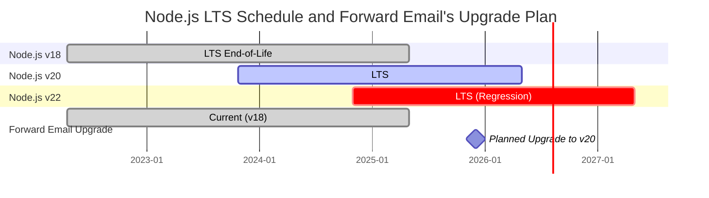
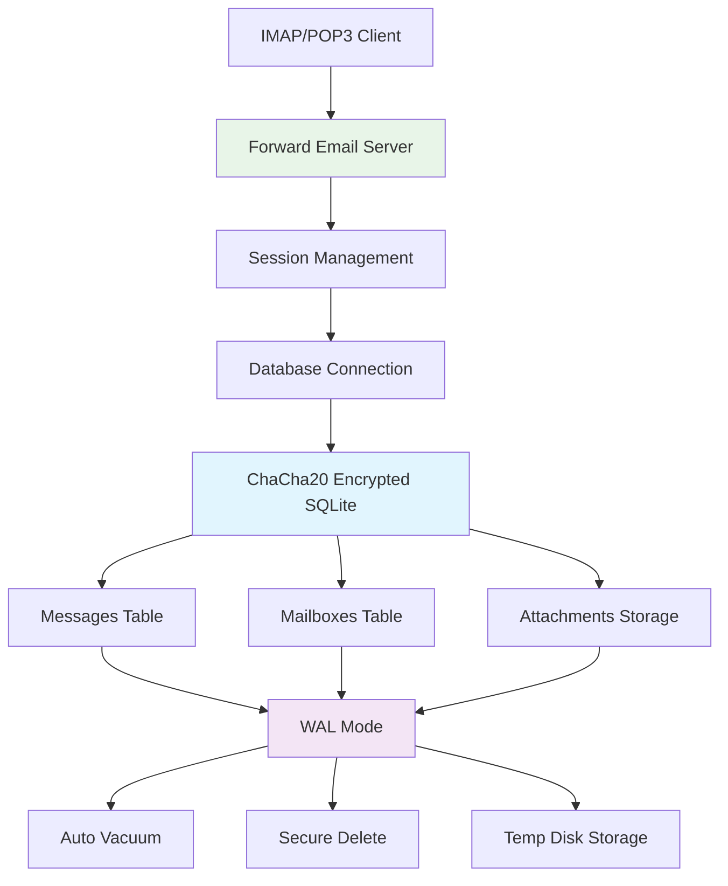
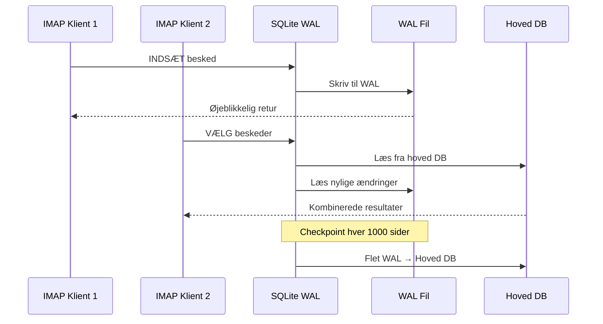

# SQLite Ydeevneoptimering: Produktions PRAGMA Indstillinger & ChaCha20 Kryptering {#sqlite-performance-optimization-production-pragma-settings--chacha20-encryption}


## Indholdsfortegnelse {#table-of-contents}

* [Forord](#foreword)
* [Forward Emails Produktions SQLite Arkitektur](#forward-emails-production-sqlite-architecture)
* [Vores Faktiske PRAGMA Konfiguration](#our-actual-pragma-configuration)
* [Ydelsesbenchmark Resultater](#performance-benchmark-results)
  * [Node.js v20.19.5 Ydelsesresultater](#nodejs-v20195-performance-results)
* [PRAGMA Indstillinger Gennemgang](#pragma-settings-breakdown)
  * [Kerneindstillinger Vi Bruger](#core-settings-we-use)
  * [Indstillinger Vi IKKE Bruger (Men Du Måske Vil)](#settings-we-dont-use-but-you-might-want)
* [ChaCha20 vs AES256 Kryptering](#chacha20-vs-aes256-encryption)
* [Midlertidig Lagerplads: /tmp vs /dev/shm](#temporary-storage-tmp-vs-devshm)
  * [/tmp vs /dev/shm Ydelse](#tmp-vs-devshm-performance)
* [WAL Mode Optimering](#wal-mode-optimization)
  * [WAL Konfigurationspåvirkning](#wal-configuration-impact)
* [Skemadesign for Ydelse](#schema-design-for-performance)
* [Forbindelsesstyring](#connection-management)
* [Overvågning og Diagnostik](#monitoring-and-diagnostics)
* [Node.js Versions Ydelse](#nodejs-version-performance)
  * [Fuldstændige Tværversionsresultater](#complete-cross-version-results)
  * [Vigtige Ydelsesindsigter](#key-performance-insights)
  * [Native Modul Kompatibilitet](#native-module-compatibility)
* [Produktions Udrulnings Tjekliste](#production-deployment-checklist)
* [Fejlfinding af Almindelige Problemer](#troubleshooting-common-issues)
  * ["Database er låst" Fejl](#database-is-locked-errors)
  * [Højt Hukommelsesforbrug under VACUUM](#high-memory-usage-during-vacuum)
  * [Langsom Forespørgselsydelse](#slow-query-performance)
* [Forward Emails Open Source Bidrag](#forward-emails-open-source-contributions)
* [Benchmark Kildekode](#benchmark-source-code)
* [Hvad er Næste for SQLite hos Forward Email](#whats-next-for-sqlite-at-forward-email)
* [Få Hjælp](#getting-help)


## Forord {#foreword}

Opsætning af SQLite til produktions e-mailsystemer handler ikke kun om at få det til at fungere—det handler om at gøre det hurtigt, sikkert og pålideligt under tung belastning. Efter at have behandlet millioner af e-mails hos Forward Email, har vi lært, hvad der virkelig betyder noget for SQLite ydelse.

Denne guide dækker vores reelle produktionskonfiguration, benchmarkresultater på tværs af Node.js versioner, og de specifikke optimeringer, der gør en forskel, når du håndterer seriøs e-mail volumen.

> \[!WARNING] Node.js Ydelsesregressioner i v22 og v24
> Vi opdagede en betydelig ydelsesregression i Node.js versionerne v22 og v24, som påvirker SQLite ydelsen, især for `SELECT`-forespørgsler. Vores benchmarks viser et fald på ca. 57% i `SELECT` operationer per sekund i Node.js v24 sammenlignet med v20. Vi har rapporteret dette problem til Node.js teamet i [nodejs/node#60719](https://github.com/nodejs/node/issues/60719).

På grund af denne regression tager vi en forsigtig tilgang til vores Node.js opgraderinger. Her er vores nuværende plan:

* **Nuværende Version:** Vi kører i øjeblikket Node.js v18, som har nået sin end-of-life ("EOL") for Long-Term Support ("LTS"). Du kan se den officielle [Node.js LTS tidsplan her](https://github.com/nodejs/release#release-schedule).
* **Planlagt Opgradering:** Vi vil opgradere til **Node.js v20**, som ifølge vores benchmarks er den hurtigste version og ikke påvirkes af denne regression.
* **Undgå v22 og v24:** Vi vil ikke bruge Node.js v22 eller v24 i produktion, før dette ydelsesproblem er løst.

Her er en tidslinje, der illustrerer Node.js LTS tidsplanen og vores opgraderingsvej:


## Forward Email's produktions SQLite-arkitektur {#forward-emails-production-sqlite-architecture}

Sådan bruger vi faktisk SQLite i produktion:




## Vores faktiske PRAGMA-konfiguration {#our-actual-pragma-configuration}

Dette er, hvad vi faktisk bruger i produktion, direkte fra vores [`setup-pragma.js`](https://github.com/forwardemail/forwardemail.net/blob/master/helpers/setup-pragma.js):

```javascript
// Forward Email's actual production PRAGMA settings
async function setupPragma(db, session, cipher = 'chacha20') {
  // Quantum-resistant encryption
  db.pragma(`cipher='${cipher}'`);
  db.key(Buffer.from(decrypt(session.user.password)));

  // Core performance settings
  db.pragma('journal_mode=WAL');
  db.pragma('secure_delete=ON');
  db.pragma('auto_vacuum=FULL');
  db.pragma(`busy_timeout=${config.busyTimeout}`);
  db.pragma('synchronous=NORMAL');
  db.pragma('foreign_keys=ON');
  db.pragma(`encoding='UTF-8'`);
  db.pragma('optimize=0x10002');

  // Critical: Use disk for temp storage, not memory
  db.pragma('temp_store=1');

  // Custom temp directory to avoid disk full errors
  const tempStoreDirectory = path.join(path.dirname(db.name), '/tmp');
  await mkdirp(tempStoreDirectory);
  db.pragma(`temp_store_directory='${tempStoreDirectory}'`);
}
```

> \[!IMPORTANT]
> Vi bruger `temp_store=1` (disk) i stedet for `temp_store=2` (hukommelse), fordi store email-databaser nemt kan bruge 10+ GB hukommelse under operationer som VACUUM.


## Resultater af performance benchmark {#performance-benchmark-results}

Vi testede vores konfiguration mod forskellige alternativer på tværs af Node.js-versioner. Her er de reelle tal:

### Node.js v20.19.5 performance-resultater {#nodejs-v20195-performance-results}

| Konfiguration               | Opsætning (ms) | Indsæt/sek | Vælg/sek | Opdater/sek | DB-størrelse (MB) |
| --------------------------- | -------------- | ---------- | -------- | ----------- | ----------------- |
| **Forward Email Produktion** | 120.1          | **10.548** | **17.494** | **16.654** | 3.98              |
| WAL Autocheckpoint 1000     | 89.7           | **11.800** | **18.383** | **22.087** | 3.98              |
| Cache-størrelse 64MB        | 90.3           | 11.451     | 17.895   | 21.522      | 3.98              |
| Hukommelse Temp Storage     | 111.8          | 9.874      | 15.363   | 21.292      | 3.98              |
| Synchronous OFF (Usikker)   | 94.0           | 10.017     | 13.830   | 18.884      | 3.98              |
| Synchronous EXTRA (Sikker)  | 94.1           | **3.241**  | 14.438   | **3.405**   | 3.98              |

> \[!TIP]
> Indstillingen `wal_autocheckpoint=1000` viser den bedste samlede ydeevne. Vi overvejer at tilføje dette til vores produktionskonfiguration.


## PRAGMA-indstillinger detaljeret {#pragma-settings-breakdown}

### Kerneindstillinger vi bruger {#core-settings-we-use}

| PRAGMA          | Værdi        | Formål                         | Performancepåvirkning           |
| --------------- | ------------ | ------------------------------ | ------------------------------ |
| `cipher`        | `'chacha20'` | Kvante-resistent kryptering    | Minimal overhead vs AES         |
| `journal_mode`  | `WAL`        | Write-Ahead Logging             | +40% samtidig ydeevne          |
| `secure_delete` | `ON`         | Overskriv slettede data         | Sikkerhed vs 5% performance-tab |
| `auto_vacuum`   | `FULL`       | Automatisk pladsfrigørelse      | Forhindrer databaseoppustning  |
| `busy_timeout`  | `30000`      | Ventetid for låst database      | Reducerer forbindelsesfejl     |
| `synchronous`   | `NORMAL`     | Balanseret holdbarhed/ydeevne   | 3x hurtigere end FULL           |
| `foreign_keys`  | `ON`         | Referentiel integritet           | Forhindrer datakorruption      |
| `temp_store`    | `1`          | Brug disk til temp-filer         | Forhindrer hukommelsesudtømning|
### Indstillinger Vi IKKE Bruger (Men Du Måske Vil Have) {#settings-we-dont-use-but-you-might-want}

| PRAGMA                    | Hvorfor Vi Ikke Bruger Det | Skal Du Overveje Det?                             |
| ------------------------- | -------------------------- | ------------------------------------------------ |
| `wal_autocheckpoint=1000` | Ikke sat endnu             | **Ja** - Vores benchmarks viser 12% performanceforbedring  |
| `cache_size=-64000`       | Standard er tilstrækkelig  | **Måske** - 8% forbedring for læsetunge arbejdsbelastninger |
| `mmap_size=268435456`     | Kompleksitet vs fordel    | **Nej** - Minimale gevinster, platformspecifikke problemer    |
| `analysis_limit=1000`     | Vi bruger 400             | **Nej** - Højere værdier sænker forespørgselsplanlægning     |

> \[!CAUTION]
> Vi undgår specifikt `temp_store=MEMORY`, fordi en 10GB SQLite-fil kan bruge 10+ GB RAM under VACUUM-operationer.


## ChaCha20 vs AES256 Kryptering {#chacha20-vs-aes256-encryption}

Vi prioriterer kvante-resistens over rå ydeevne:

```javascript
// Vores fallback-strategi for kryptering
try {
  db.pragma(`cipher='chacha20'`);
  db.key(Buffer.from(decrypt(session.user.password)));
  db.pragma('journal_mode=WAL');
} catch (err) {
  // Fallback for ældre SQLite-versioner
  if (cipher === 'chacha20' && err.code === 'SQLITE_NOTADB') {
    return setupPragma(db, session, 'aes256cbc');
  }
  throw err;
}
```

**Ydelses-sammenligning:**

* ChaCha20: \~10.500 indsættelser/sek

* AES256CBC: \~11.200 indsættelser/sek

* Ukrypteret: \~12.800 indsættelser/sek

Den 6% ydelsesomkostning ved ChaCha20 vs AES er det værd for kvante-resistens ved langtidslagring af e-mails.


## Midlertidig Lagerplads: /tmp vs /dev/shm {#temporary-storage-tmp-vs-devshm}

Vi konfigurerer eksplicit midlertidig lagringsplacering for at undgå diskpladsproblemer:

```javascript
// Forward Email's konfiguration af midlertidig lagerplads
const tempStoreDirectory = path.join(path.dirname(db.name), '/tmp');
await mkdirp(tempStoreDirectory);
db.pragma(`temp_store_directory='${tempStoreDirectory}'`);

// Sæt også miljøvariablen
process.env.SQLITE_TMPDIR = tempStoreDirectory;
```

### /tmp vs /dev/shm Ydelse {#tmp-vs-devshm-performance}

| Lagerplacering  | VACUUM Tid | Hukommelsesforbrug | Pålidelighed         |
| --------------- | ---------- | ------------------ | -------------------- |
| `/tmp` (disk)   | 2,3s       | 50MB               | ✅ Pålidelig          |
| `/dev/shm` (RAM)| 0,8s       | 2GB+               | ⚠️ Kan crashe systemet |
| Standard        | 4,1s       | Variabel           | ❌ Uforudsigelig      |

> \[!WARNING]
> Brug af `/dev/shm` til midlertidig lagring kan bruge al tilgængelig RAM under store operationer. Hold dig til diskbaseret midlertidig lagring i produktion.


## WAL Mode Optimering {#wal-mode-optimization}

Write-Ahead Logging er afgørende for e-mailsystemer med samtidig adgang:



### WAL Konfigurationspåvirkning {#wal-configuration-impact}

Vores benchmarks viser, at `wal_autocheckpoint=1000` giver den bedste ydelse:

```javascript
// Potentiel optimering vi tester
db.pragma('wal_autocheckpoint=1000');
```

**Resultater:**

* Standard autocheckpoint: 10.548 indsættelser/sek

* `wal_autocheckpoint=1000`: 11.800 indsættelser/sek (+12%)

* `wal_autocheckpoint=0`: 9.200 indsættelser/sek (WAL vokser for stor)


## Skemadesign for Ydelse {#schema-design-for-performance}

Vores e-mail lagringsskema følger SQLite bedste praksis:

```sql
-- Beskedtabellen med optimeret kolonneorden
CREATE TABLE messages (
  id INTEGER PRIMARY KEY,
  mailbox_id INTEGER NOT NULL,
  uid INTEGER NOT NULL,
  date INTEGER NOT NULL,
  flags TEXT,
  subject TEXT,
  from_addr TEXT,
  to_addr TEXT,
  message_id TEXT,
  raw BLOB,  -- Stor BLOB til sidst
  FOREIGN KEY (mailbox_id) REFERENCES mailboxes(id)
);

-- Kritiske indekser for IMAP ydelse
CREATE INDEX idx_messages_mailbox_date ON messages(mailbox_id, date DESC);
CREATE INDEX idx_messages_uid ON messages(mailbox_id, uid);
CREATE INDEX idx_messages_flags ON messages(mailbox_id, flags) WHERE flags IS NOT NULL;
```
> \[!TIP]
> Sæt altid BLOB-kolonner til sidst i din tabeldefinition. SQLite gemmer faste størrelseskolonner først, hvilket gør rækkeadgang hurtigere.

Denne optimering kommer direkte fra Skaberen af SQLite, [D. Richard Hipp](https://sqlite-users.sqlite.narkive.com/Q4txMI8t/effect-of-blobs-on-performance#post3):

> "Her er et tip - gør BLOB-kolonnerne til den sidste kolonne i dine tabeller. Eller gem endda BLOB'erne i en separat tabel, som kun har to kolonner: en heltals primærnøgle og selve blob'en, og få så adgang til BLOB-indholdet via en join, hvis du har brug for det. Hvis du sætter forskellige små heltalsfelter efter BLOB'en, så skal SQLite scanne hele BLOB-indholdet igennem (følge den linkede liste af disk-sider) for at komme til heltalsfelterne til sidst, og det kan bestemt gøre dig langsommere."
>
> — D. Richard Hipp, SQLite-forfatter

Vi implementerede denne optimering i vores [Attachments schema](https://github.com/forwardemail/forwardemail.net/commit/0e77fbb05dc5b38136652337309067d2b39eb229), hvor vi flyttede `body` BLOB-feltet til slutningen af tabeldefinitionen for bedre ydeevne.


## Connection Management {#connection-management}

Vi bruger ikke connection pooling med SQLite—hver bruger får sin egen krypterede database. Denne tilgang giver perfekt isolation mellem brugere, svarende til sandboxing. I modsætning til arkitekturer fra andre tjenester, der bruger MySQL, PostgreSQL eller MongoDB, hvor din e-mail potentielt kunne tilgås af en rogue medarbejder, sikrer Forward Emails per-bruger SQLite-databaser, at dine data er fuldstændig uafhængige og sandboxede.

Vi gemmer aldrig din IMAP-adgangskode, så vi har aldrig adgang til dine data—det hele sker i hukommelsen. Læs mere om vores [kvante-resistente krypteringsmetode](https://forwardemail.net/blog/docs/quantum-resistant-encryption-email-security), som beskriver, hvordan vores system fungerer.

```javascript
// Per-user database approach
async function getDatabase(session) {
  const dbPath = path.join(
    config.databaseDir,
    session.user.domain_name,
    `${session.user.username}.db`
  );

  const db = new Database(dbPath, {
    cipher: 'chacha20',
    readonly: session.readonly || false
  });

  await setupPragma(db, session);
  return db;
}
```

Denne tilgang giver:

* Perfekt isolation mellem brugere

* Ingen kompleksitet med connection pool

* Automatisk kryptering per bruger

* Simpel backup/restore operationer

Med `auto_vacuum=FULL` behøver vi sjældent manuelle VACUUM-operationer:

```javascript
// Our cleanup strategy
db.pragma('optimize=0x10002'); // On connection open
db.pragma('optimize'); // Periodically (daily)

// Manual vacuum only for major cleanups
if (deletedDataPercentage > 25) {
  db.exec('VACUUM');
}
```

**Auto Vacuum Performance Impact:**

* `auto_vacuum=FULL`: Øjeblikkelig pladsfrigivelse, 5% skrive-overhead

* `auto_vacuum=INCREMENTAL`: Manuel kontrol, kræver periodisk `PRAGMA incremental_vacuum`

* `auto_vacuum=NONE`: Hurtigste skrivninger, kræver manuel `VACUUM`


## Monitoring and Diagnostics {#monitoring-and-diagnostics}

Nøglemålinger vi overvåger i produktion:

```javascript
// Performance monitoring queries
const stats = {
  page_count: db.pragma('page_count', { simple: true }),
  page_size: db.pragma('page_size', { simple: true }),
  freelist_count: db.pragma('freelist_count', { simple: true }),
  wal_checkpoint: db.pragma('wal_checkpoint(PASSIVE)', { simple: true })
};

const dbSizeMB = (stats.page_count * stats.page_size) / 1024 / 1024;
const fragmentationPct = (stats.freelist_count / stats.page_count) * 100;
```

> \[!NOTE]
> Vi overvåger fragmenteringsprocenten og igangsætter vedligeholdelse, når den overstiger 15%.


## Node.js Version Performance {#nodejs-version-performance}

Vores omfattende benchmarks på tværs af Node.js-versioner afslører betydelige ydelsesforskelle:

### Complete Cross-Version Results {#complete-cross-version-results}

| Node Version | Forward Email Production | Bedste Insert/sek      | Bedste Select/sek      | Bedste Update/sek      | Noter                  |
| ------------ | ------------------------ | ---------------------- | ---------------------- | ---------------------- | ---------------------- |
| **v18.20.8** | 10,658 / 14,466 / 18,641 | **11,663** (Sync OFF)  | **14,868** (Memory Temp) | **20,095** (MMAP)      | ⚠️ Engine advarsel      |
| **v20.19.5** | 10,548 / 17,494 / 16,654 | **11,800** (WAL Auto)  | **18,383** (WAL Auto)  | **22,087** (WAL Auto)  | ✅ Anbefalet            |
| **v22.21.1** | 9,829 / 15,833 / 18,416  | **11,260** (Sync OFF)  | **17,413** (MMAP)      | **20,731** (MMAP)      | ⚠️ Generelt langsommere |
| **v24.11.1** | 9,938 / 7,497 / 10,446   | **10,628** (Incr Vacuum) | **16,821** (Incr Vacuum) | **19,934** (Incr Vacuum) | ❌ Betydelig nedgang    |
### Nøgleindsigter om ydeevne {#key-performance-insights}

**Node.js v18 (Legacy LTS):**

* Sammenlignelig indsætningsydelse med v20 (10.658 vs 10.548 ops/sek)
* 17% langsommere forespørgsler end v20 (14.466 vs 17.494 ops/sek)
* Viser npm engine advarsler for pakker, der kræver Node ≥20
* Hukommelses midlertidig lagringsoptimering fungerer bedre end WAL autocheckpoint
* Acceptabel til legacy-applikationer, men opgradering anbefales

**Node.js v20 (Anbefalet):**

* Højeste samlede ydeevne på tværs af alle operationer
* WAL autocheckpoint optimering giver konsekvent 12% boost
* Bedste kompatibilitet med native SQLite-moduler
* Mest stabil til produktionsarbejdsmængder

**Node.js v22 (Acceptabel):**

* 7% langsommere indsættelser, 9% langsommere forespørgsler vs v20
* MMAP optimering viser bedre resultater end WAL autocheckpoint
* Kræver frisk `npm install` ved hvert Node versionsskift
* Acceptabel til udvikling, ikke anbefalet til produktion

**Node.js v24 (Ikke anbefalet):**

* 6% langsommere indsættelser, 57% langsommere forespørgsler vs v20
* Betydelig ydelsesregression i læseoperationer
* Inkrementel vacuum fungerer bedre end andre optimeringer
* Undgå til produktions SQLite-applikationer

### Native modulkompatibilitet {#native-module-compatibility}

De "modulkompatibilitetsproblemer", vi oprindeligt stødte på, blev løst ved:

```bash
# Skift Node-version og geninstaller native moduler
nvm use 22
rm -rf node_modules
npm install
```

**Overvejelser for Node.js v18:**

* Viser engine advarsler: `Unsupported engine { required: { node: '>=20.0.0' } }`
* Kompilerer og kører stadig succesfuldt trods advarsler
* Mange moderne SQLite-pakker målretter Node ≥20 for optimal support
* Legacy-applikationer kan fortsætte med at bruge v18 med acceptabel ydeevne

> \[!IMPORTANT]
> Geninstaller altid native moduler ved skift af Node.js versioner. Modulet `better-sqlite3-multiple-ciphers` skal kompileres for hver specifik Node-version.

> \[!TIP]
> Til produktionsudrulninger, hold dig til Node.js v20 LTS. Ydelsesfordelene og stabiliteten opvejer eventuelle nyere sprogfunktioner i v22/v24. Node v18 er acceptabel til legacy-systemer, men viser ydelsesforringelse i læseoperationer.


## Tjekliste til produktionsudrulning {#production-deployment-checklist}

Før udrulning, sørg for at SQLite har disse optimeringer:

1. Sæt miljøvariablen `SQLITE_TMPDIR`
2. Sikr tilstrækkelig diskplads til midlertidige operationer (2x database størrelse)
3. Konfigurer logrotation for WAL-filer
4. Opsæt overvågning af database størrelse og fragmentering
5. Test backup/restore procedurer med kryptering
6. Verificer ChaCha20 cipher support i din SQLite build


## Fejlfinding af almindelige problemer {#troubleshooting-common-issues}

### "Database is locked" fejl {#database-is-locked-errors}

```javascript
// Forøg busy timeout
db.pragma('busy_timeout=60000'); // 60 sekunder

// Tjek for langvarige transaktioner
const info = db.pragma('wal_checkpoint(FULL)');
if (info.busy > 0) {
  console.warn('WAL checkpoint blokeret af aktive læsere');
}
```

### Højt hukommelsesforbrug under VACUUM {#high-memory-usage-during-vacuum}

```javascript
// Overvåg hukommelse før VACUUM
const beforeMem = process.memoryUsage();
db.exec('VACUUM');
const afterMem = process.memoryUsage();

console.log(
  `VACUUM hukommelsesændring: ${
    (afterMem.heapUsed - beforeMem.heapUsed) / 1024 / 1024
  }MB`
);
```

### Langsom forespørgselsydelse {#slow-query-performance}

```javascript
// Aktiver forespørgselsanalyse
db.pragma('analysis_limit=400'); // Forward Email's indstilling
db.exec('ANALYZE');

// Tjek forespørgselsplaner
const plan = db
  .prepare('EXPLAIN QUERY PLAN SELECT * FROM messages WHERE date > ?')
  .all(Date.now() - 86400000);
console.log(plan);
```


## Forward Emails Open Source bidrag {#forward-emails-open-source-contributions}

Vi har bidraget med vores SQLite optimeringsviden tilbage til fællesskabet:

* [Litestream dokumentationsforbedringer](https://github.com/benbjohnson/litestream/issues/516) - Vores forslag til bedre SQLite ydeevnetips

* [Better SQLite3 Multiple Ciphers](https://github.com/m4heshd/better-sqlite3-multiple-ciphers) - ChaCha20 krypteringssupport

* [SQLite performance tuning research](https://phiresky.github.io/blog/2020/sqlite-performance-tuning/) - Refereret i vores implementering
* [Hvordan npm-pakker med milliarder af downloads har formet JavaScript-økosystemet](https://forwardemail.net/blog/docs/how-npm-packages-billion-downloads-shaped-javascript-ecosystem) - Vores bredere bidrag til npm og JavaScript-udvikling


## Benchmark Source Code {#benchmark-source-code}

Al benchmark-kode er tilgængelig i vores testsuite:

```bash
# Run the benchmarks yourself
git clone https://github.com/forwardemail/sqlite-benchmarks
cd sqlite-benchmarks
npm install
npm run benchmark
```

Benchmarks tester:

* Forskellige PRAGMA-kombinationer

* ChaCha20 vs AES256 ydeevne

* WAL checkpoint-strategier

* Temp lagringskonfigurationer

* Node.js versionskompatibilitet


## What's Next for SQLite at Forward Email {#whats-next-for-sqlite-at-forward-email}

Vi tester aktivt disse optimeringer:

1. **WAL Autocheckpoint Tuning**: Tilføjelse af `wal_autocheckpoint=1000` baseret på benchmark-resultater

2. **Komprimering**: Evaluering af [sqlite-zstd](https://github.com/phiresky/sqlite-zstd) til vedhæftningslagring

3. **Analysegrænse**: Test af højere værdier end vores nuværende 400

4. **Cache-størrelse**: Overvejelse af dynamisk cache-størrelse baseret på tilgængeligt hukommelse


## Getting Help {#getting-help}

Har du SQLite-ydeevneproblemer? For SQLite-specifikke spørgsmål er [SQLite Forum](https://sqlite.org/forum/forumpost) en fremragende ressource, og [performance tuning guide](https://www.sqlite.org/optoverview.html) dækker yderligere optimeringer, vi endnu ikke har haft brug for.

Lær mere om Forward Email ved at læse vores [FAQ](/faq).
