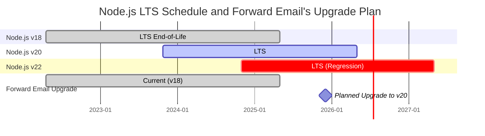
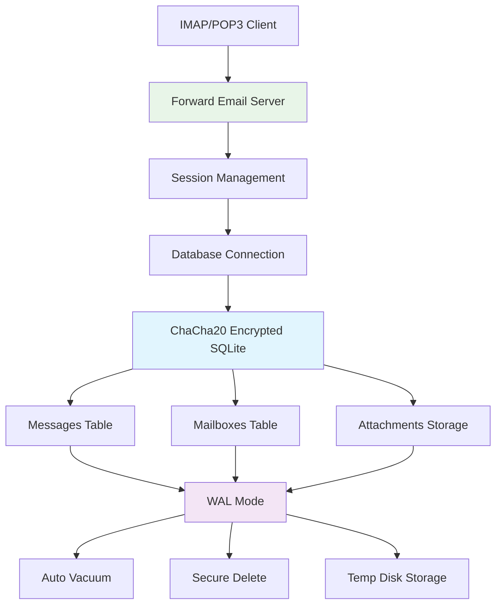
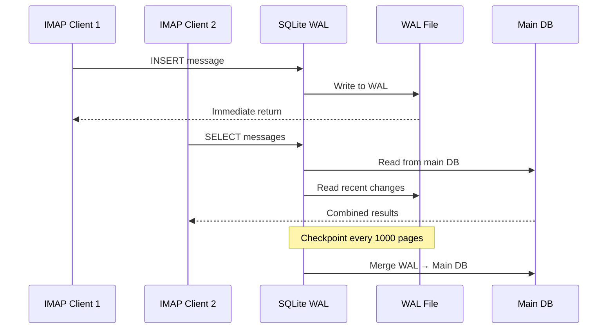

# SQLite Performance Optimization: Production PRAGMA Settings & ChaCha20 Encryption {#sqlite-performance-optimization-production-pragma-settings--chacha20-encryption}


## Table of Contents {#table-of-contents}

* [Foreword](#foreword)
* [Forward Email's Production SQLite Architecture](#forward-emails-production-sqlite-architecture)
* [Our Actual PRAGMA Configuration](#our-actual-pragma-configuration)
* [Performance Benchmark Results](#performance-benchmark-results)
  * [Node.js v20.19.5 Performance Results](#nodejs-v20195-performance-results)
* [PRAGMA Settings Breakdown](#pragma-settings-breakdown)
  * [Core Settings We Use](#core-settings-we-use)
  * [Settings We DON'T Use (But You Might Want)](#settings-we-dont-use-but-you-might-want)
* [ChaCha20 vs AES256 Encryption](#chacha20-vs-aes256-encryption)
* [Temporary Storage: /tmp vs /dev/shm](#temporary-storage-tmp-vs-devshm)
  * [/tmp vs /dev/shm Performance](#tmp-vs-devshm-performance)
* [WAL Mode Optimization](#wal-mode-optimization)
  * [WAL Configuration Impact](#wal-configuration-impact)
* [Schema Design for Performance](#schema-design-for-performance)
* [Connection Management](#connection-management)
* [Monitoring and Diagnostics](#monitoring-and-diagnostics)
* [Node.js Version Performance](#nodejs-version-performance)
  * [Complete Cross-Version Results](#complete-cross-version-results)
  * [Key Performance Insights](#key-performance-insights)
  * [Native Module Compatibility](#native-module-compatibility)
* [Production Deployment Checklist](#production-deployment-checklist)
* [Troubleshooting Common Issues](#troubleshooting-common-issues)
  * ["Database is locked" Errors](#database-is-locked-errors)
  * [High Memory Usage During VACUUM](#high-memory-usage-during-vacuum)
  * [Slow Query Performance](#slow-query-performance)
* [Forward Email's Open Source Contributions](#forward-emails-open-source-contributions)
* [Benchmark Source Code](#benchmark-source-code)
* [What's Next for SQLite at Forward Email](#whats-next-for-sqlite-at-forward-email)
* [Getting Help](#getting-help)

## Foreword {#foreword}

Setting up SQLite for production email systems isn't just about getting it working—it's about making it fast, secure, and reliable under heavy load. After processing millions of emails at Forward Email, we've learned what actually matters for SQLite performance.

This guide covers our real production configuration, benchmark results across Node.js versions, and the specific optimizations that make a difference when you're handling serious email volume.

> \[!WARNING] Node.js Performance Regressions in v22 and v24
> We discovered a significant performance regression in Node.js versions v22 and v24 that impacts SQLite performance, particularly for `SELECT` statements. Our benchmarks show a \~57% drop in `SELECT` operations per second in Node.js v24 compared to v20. We have reported this issue to the Node.js team in [nodejs/node#60719](https://github.com/nodejs/node/issues/60719).

Due to this regression, we are taking a cautious approach to our Node.js upgrades. Here is our current plan:

* **Current Version:** We are currently on Node.js v18, which has reached its end-of-life ("EOL") for Long-Term Support ("LTS"). You can view the official [Node.js LTS schedule here](https://github.com/nodejs/release#release-schedule).
* **Planned Upgrade:** We will be upgrading to **Node.js v20**, which is the fastest version according to our benchmarks and is not affected by this regression.
* **Avoiding v22 and v24:** We will not be using Node.js v22 or v24 in production until this performance issue is resolved.

Here is a timeline illustrating the Node.js LTS schedule and our upgrade path:



## Forward Email's Production SQLite Architecture {#forward-emails-production-sqlite-architecture}

Here's how we actually use SQLite in production:



## Our Actual PRAGMA Configuration {#our-actual-pragma-configuration}

This is what we actually use in production, straight from our [`setup-pragma.js`](https://github.com/forwardemail/forwardemail.net/blob/master/helpers/setup-pragma.js):

```javascript
// Forward Email's actual production PRAGMA settings
async function setupPragma(db, session, cipher = 'chacha20') {
  // Quantum-resistant encryption
  db.pragma(`cipher='${cipher}'`);
  db.key(Buffer.from(decrypt(session.user.password)));

  // Core performance settings
  db.pragma('journal_mode=WAL');
  db.pragma('secure_delete=ON');
  db.pragma('auto_vacuum=FULL');
  db.pragma(`busy_timeout=${config.busyTimeout}`);
  db.pragma('synchronous=NORMAL');
  db.pragma('foreign_keys=ON');
  db.pragma(`encoding='UTF-8'`);
  db.pragma('optimize=0x10002');

  // Critical: Use disk for temp storage, not memory
  db.pragma('temp_store=1');

  // Custom temp directory to avoid disk full errors
  const tempStoreDirectory = path.join(path.dirname(db.name), '/tmp');
  await mkdirp(tempStoreDirectory);
  db.pragma(`temp_store_directory='${tempStoreDirectory}'`);
}
```

> \[!IMPORTANT]
> We use `temp_store=1` (disk) instead of `temp_store=2` (memory) because large email databases can easily consume 10+ GB of memory during operations like VACUUM.

## Performance Benchmark Results {#performance-benchmark-results}

We tested our configuration against various alternatives across Node.js versions. Here are the real numbers:

### Node.js v20.19.5 Performance Results {#nodejs-v20195-performance-results}

| Configuration | Setup (ms) | Insert/sec | Select/sec | Update/sec | DB Size (MB) |
| ---------------------------- | ---------- | ---------- | ---------- | ---------- | ------------ |
| **Forward Email Production** | 120.1 | **10,548** | **17,494** | **16,654** | 3.98 |
| WAL Autocheckpoint 1000 | 89.7 | **11,800** | **18,383** | **22,087** | 3.98 |
| Cache Size 64MB | 90.3 | 11,451 | 17,895 | 21,522 | 3.98 |
| Memory Temp Storage | 111.8 | 9,874 | 15,363 | 21,292 | 3.98 |
| Synchronous OFF (Unsafe) | 94.0 | 10,017 | 13,830 | 18,884 | 3.98 |
| Synchronous EXTRA (Safe) | 94.1 | **3,241** | 14,438 | **3,405** | 3.98 |

> \[!TIP]
> The `wal_autocheckpoint=1000` setting shows the best overall performance. We're considering adding this to our production config.

## PRAGMA Settings Breakdown {#pragma-settings-breakdown}

### Core Settings We Use {#core-settings-we-use}

| PRAGMA | Wert | Ziel | Performance Impact |
| --------------- | ------------ | ------------------------------- | ------------------------------- |
| `cipher` | `'chacha20'` | Quantum-resistant encryption | Minimal overhead vs AES |
| `journal_mode` | `WAL` | Write-Ahead Logging | +40% concurrent performance |
| `secure_delete` | `ON` | Overwrite deleted data | Security vs 5% performance cost |
| `auto_vacuum` | `FULL` | Automatic space reclamation | Prevents database bloat |
| `busy_timeout` | `30000` | Wait time for locked database | Reduces connection failures |
| `synchronous` | `NORMAL` | Balanced durability/performance | 3x faster than FULL |
| `foreign_keys` | `ON` | Referential integrity | Prevents data corruption |
| `temp_store` | `1` | Use disk for temp files | Prevents memory exhaustion |

### Settings We DON'T Use (But You Might Want) {#settings-we-dont-use-but-you-might-want}

| PRAGMA | Why We Don't Use It | Should You Consider It? |
| ------------------------- | --------------------- | --------------------------------------------------- |
| `wal_autocheckpoint=1000` | Not set yet | **Yes** - Our benchmarks show 12% performance gain |
| `cache_size=-64000` | Default is sufficient | **Maybe** - 8% improvement for read-heavy workloads |
| `mmap_size=268435456` | Complexity vs benefit | **No** - Minimal gains, platform-specific issues |
| `analysis_limit=1000` | We use 400 | **No** - Higher values slow down query planning |

> \[!CAUTION]
> We specifically avoid `temp_store=MEMORY` because a 10GB SQLite file can consume 10+ GB of RAM during VACUUM operations.

## ChaCha20 vs AES256 Encryption {#chacha20-vs-aes256-encryption}

We prioritize quantum resistance over raw performance:

```javascript
// Our encryption fallback strategy
try {
  db.pragma(`cipher='chacha20'`);
  db.key(Buffer.from(decrypt(session.user.password)));
  db.pragma('journal_mode=WAL');
} catch (err) {
  // Fallback for older SQLite versions
  if (cipher === 'chacha20' && err.code === 'SQLITE_NOTADB') {
    return setupPragma(db, session, 'aes256cbc');
  }
  throw err;
}
```

**Performance Comparison:**

* ChaCha20: \~10,500 inserts/sec

* AES256CBC: \~11,200 inserts/sec

* Unencrypted: \~12,800 inserts/sec

The 6% performance cost of ChaCha20 vs AES is worth the quantum resistance for long-term email storage.

## Temporary Storage: /tmp vs /dev/shm {#temporary-storage-tmp-vs-devshm}

We explicitly configure temp storage location to avoid disk space issues:

```javascript
// Forward Email's temp storage configuration
const tempStoreDirectory = path.join(path.dirname(db.name), '/tmp');
await mkdirp(tempStoreDirectory);
db.pragma(`temp_store_directory='${tempStoreDirectory}'`);

// Also set environment variable
process.env.SQLITE_TMPDIR = tempStoreDirectory;
```

### /tmp vs /dev/shm Performance {#tmp-vs-devshm-performance}

| Storage Location | VACUUM Time | Memory Usage | Reliability |
| ---------------- | ----------- | ------------ | ------------------- |
| `/tmp` (disk) | 2.3s | 50MB | ✅ Reliable |
| `/dev/shm` (RAM) | 0.8s | 2GB+ | ⚠️ Can crash system |
| Default | 4.1s | Variable | ❌ Unpredictable |

> \[!WARNING]
> Using `/dev/shm` for temp storage can consume all available RAM during large operations. Stick with disk-based temp storage for production.

## WAL Mode Optimization {#wal-mode-optimization}

Write-Ahead Logging is crucial for email systems with concurrent access:



### WAL Configuration Impact {#wal-configuration-impact}

Our benchmarks show `wal_autocheckpoint=1000` provides the best performance:

```javascript
// Potential optimization we're testing
db.pragma('wal_autocheckpoint=1000');
```

**Results:**

* Default autocheckpoint: 10,548 inserts/sec

* `wal_autocheckpoint=1000`: 11,800 inserts/sec (+12%)

* `wal_autocheckpoint=0`: 9,200 inserts/sec (WAL grows too large)

## Schema Design for Performance {#schema-design-for-performance}

Our email storage schema follows SQLite best practices:

```sql
-- Messages table with optimized column order
CREATE TABLE messages (
  id INTEGER PRIMARY KEY,
  mailbox_id INTEGER NOT NULL,
  uid INTEGER NOT NULL,
  date INTEGER NOT NULL,
  flags TEXT,
  subject TEXT,
  from_addr TEXT,
  to_addr TEXT,
  message_id TEXT,
  raw BLOB,  -- Large BLOB at end
  FOREIGN KEY (mailbox_id) REFERENCES mailboxes(id)
);

-- Critical indexes for IMAP performance
CREATE INDEX idx_messages_mailbox_date ON messages(mailbox_id, date DESC);
CREATE INDEX idx_messages_uid ON messages(mailbox_id, uid);
CREATE INDEX idx_messages_flags ON messages(mailbox_id, flags) WHERE flags IS NOT NULL;
```

> \[!TIP]
> Always put BLOB columns at the end of your table definition. SQLite stores fixed-size columns first, making row access faster.

This optimization comes directly from SQLite's creator, [D. Richard Hipp](https://sqlite-users.sqlite.narkive.com/Q4txMI8t/effect-of-blobs-on-performance#post3):

> "Here's a hint though - make the BLOB columns the last column in your tables. Or even store the BLOBs in a separate table which only has two columns: an integer primary key and the blob itself, and then access the BLOB content using a join if you need to. If you put various small integer fields after the BLOB, then SQLite has to scan through the entire BLOB content (following the linked list of disk pages) to get to the integer fields at the end, and that definitely can slow you down."
>
> — D. Richard Hipp, SQLite Author

We implemented this optimization in our [Attachments schema](https://github.com/forwardemail/forwardemail.net/commit/0e77fbb05dc5b38136652337309067d2b39eb229), moving the `body` BLOB field to the end of the table definition for better performance.

## Connection Management {#connection-management}

We don't use connection pooling with SQLite—each user gets their own encrypted database. This approach provides perfect isolation between users, similar to sandboxing. Unlike architectures from other services that use MySQL, PostgreSQL, or MongoDB where your email could potentially be accessed by a rogue employee, Forward Email's per-user SQLite databases ensure your data is completely independent and sandboxed.

We never store your IMAP password, so we never have access to your data—it's all done in-memory. Learn more about our [quantum-resistant encryption approach](https://forwardemail.net/blog/docs/quantum-resistant-encryption-email-security) that details how our system works.

```javascript
// Per-user database approach
async function getDatabase(session) {
  const dbPath = path.join(
    config.databaseDir,
    session.user.domain_name,
    `${session.user.username}.db`
  );

  const db = new Database(dbPath, {
    cipher: 'chacha20',
    readonly: session.readonly || false
  });

  await setupPragma(db, session);
  return db;
}
```

This approach provides:

* Perfect isolation between users

* No connection pool complexity

* Automatic encryption per user

* Simpler backup/restore operations

With `auto_vacuum=FULL`, we rarely need manual VACUUM operations:

```javascript
// Our cleanup strategy
db.pragma('optimize=0x10002'); // On connection open
db.pragma('optimize'); // Periodically (daily)

// Manual vacuum only for major cleanups
if (deletedDataPercentage > 25) {
  db.exec('VACUUM');
}
```

**Auto Vacuum Performance Impact:**

* `auto_vacuum=FULL`: Immediate space reclamation, 5% write overhead

* `auto_vacuum=INCREMENTAL`: Manual control, requires periodic `PRAGMA incremental_vacuum`

* `auto_vacuum=NONE`: Fastest writes, requires manual `VACUUM`

## Monitoring and Diagnostics {#monitoring-and-diagnostics}

Key metrics we track in production:

```javascript
// Performance monitoring queries
const stats = {
  page_count: db.pragma('page_count', { simple: true }),
  page_size: db.pragma('page_size', { simple: true }),
  freelist_count: db.pragma('freelist_count', { simple: true }),
  wal_checkpoint: db.pragma('wal_checkpoint(PASSIVE)', { simple: true })
};

const dbSizeMB = (stats.page_count * stats.page_size) / 1024 / 1024;
const fragmentationPct = (stats.freelist_count / stats.page_count) * 100;
```

> \[!NOTE]
> We monitor fragmentation percentage and trigger maintenance when it exceeds 15%.

## Node.js Version Performance {#nodejs-version-performance}

Our comprehensive benchmarks across Node.js versions reveal significant performance differences:

### Complete Cross-Version Results {#complete-cross-version-results}

| Node Version | Forward Email Production | Best Insert/sec | Best Select/sec | Best Update/sec | Notes |
| ------------ | ------------------------ | ------------------------ | ------------------------ | ------------------------ | ---------------------- |
| **v18.20.8** | 10,658 / 14,466 / 18,641 | **11,663** (Sync OFF) | **14,868** (Memory Temp) | **20,095** (MMAP) | ⚠️ Engine warning |
| **v20.19.5** | 10,548 / 17,494 / 16,654 | **11,800** (WAL Auto) | **18,383** (WAL Auto) | **22,087** (WAL Auto) | ✅ Recommended |
| **v22.21.1** | 9,829 / 15,833 / 18,416 | **11,260** (Sync OFF) | **17,413** (MMAP) | **20,731** (MMAP) | ⚠️ Slower overall |
| **v24.11.1** | 9,938 / 7,497 / 10,446 | **10,628** (Incr Vacuum) | **16,821** (Incr Vacuum) | **19,934** (Incr Vacuum) | ❌ Significant slowdown |

### Key Performance Insights {#key-performance-insights}

**Node.js v18 (Legacy LTS):**

* Comparable insert performance to v20 (10,658 vs 10,548 ops/sec)
* 17% slower selects than v20 (14,466 vs 17,494 ops/sec)
* Shows npm engine warnings for packages requiring Node ≥20
* Memory temp storage optimization works better than WAL autocheckpoint
* Acceptable for legacy applications, but upgrade recommended

**Node.js v20 (Recommended):**

* Highest overall performance across all operations
* WAL autocheckpoint optimization provides consistent 12% boost
* Best compatibility with native SQLite modules
* Most stable for production workloads

**Node.js v22 (Acceptable):**

* 7% slower inserts, 9% slower selects vs v20
* MMAP optimization shows better results than WAL autocheckpoint
* Requires fresh `npm install` for each Node version switch
* Acceptable for development, not recommended for production

**Node.js v24 (Not Recommended):**

* 6% slower inserts, 57% slower selects vs v20
* Significant performance regression in read operations
* Incremental vacuum performs better than other optimizations
* Avoid for production SQLite applications

### Native Module Compatibility {#native-module-compatibility}

The "module compatibility issues" we initially encountered were resolved by:

```bash
# Switch Node version and reinstall native modules
nvm use 22
rm -rf node_modules
npm install
```

**Node.js v18 Considerations:**

* Shows engine warnings: `Unsupported engine { required: { node: '>=20.0.0' } }`
* Still compiles and runs successfully despite warnings
* Many modern SQLite packages target Node ≥20 for optimal support
* Legacy applications can continue using v18 with acceptable performance

> \[!IMPORTANT]
> Always reinstall native modules when switching Node.js versions. The `better-sqlite3-multiple-ciphers` module must be compiled for each specific Node version.

> \[!TIP]
> For production deployments, stick with Node.js v20 LTS. The performance benefits and stability outweigh any newer language features in v22/v24. Node v18 is acceptable for legacy systems but shows performance degradation in read operations.

## Production Deployment Checklist {#production-deployment-checklist}

Before deploying, ensure SQLite has these optimizations:

1. Set `SQLITE_TMPDIR` environment variable
2. Ensure adequate disk space for temp operations (2x database size)
3. Configure log rotation for WAL files
4. Set up monitoring for database size and fragmentation
5. Test backup/restore procedures with encryption
6. Verify ChaCha20 cipher support in your SQLite build

## Troubleshooting Common Issues {#troubleshooting-common-issues}

### "Database is locked" Errors {#database-is-locked-errors}

```javascript
// Increase busy timeout
db.pragma('busy_timeout=60000'); // 60 seconds

// Check for long-running transactions
const info = db.pragma('wal_checkpoint(FULL)');
if (info.busy > 0) {
  console.warn('WAL checkpoint blocked by active readers');
}
```

### High Memory Usage During VACUUM {#high-memory-usage-during-vacuum}

```javascript
// Monitor memory before VACUUM
const beforeMem = process.memoryUsage();
db.exec('VACUUM');
const afterMem = process.memoryUsage();

console.log(
  `VACUUM memory delta: ${
    (afterMem.heapUsed - beforeMem.heapUsed) / 1024 / 1024
  }MB`
);
```

### Slow Query Performance {#slow-query-performance}

```javascript
// Enable query analysis
db.pragma('analysis_limit=400'); // Forward Email's setting
db.exec('ANALYZE');

// Check query plans
const plan = db
  .prepare('EXPLAIN QUERY PLAN SELECT * FROM messages WHERE date > ?')
  .all(Date.now() - 86400000);
console.log(plan);
```

## Forward Email's Open Source Contributions {#forward-emails-open-source-contributions}

We've contributed our SQLite optimization knowledge back to the community:

* [Litestream documentation improvements](https://github.com/benbjohnson/litestream/issues/516) - Our suggestions for better SQLite performance tips

* [Better SQLite3 Multiple Ciphers](https://github.com/m4heshd/better-sqlite3-multiple-ciphers) - ChaCha20 encryption support

* [SQLite performance tuning research](https://phiresky.github.io/blog/2020/sqlite-performance-tuning/) - Referenced in our implementation

* [How npm packages with billion downloads shaped JavaScript ecosystem](https://forwardemail.net/blog/docs/how-npm-packages-billion-downloads-shaped-javascript-ecosystem) - Our broader contributions to npm and JavaScript development

## Benchmark Source Code {#benchmark-source-code}

All benchmark code is available in our test suite:

```bash
# Run the benchmarks yourself
git clone https://github.com/forwardemail/sqlite-benchmarks
cd sqlite-benchmarks
npm install
npm run benchmark
```

The benchmarks test:

* Various PRAGMA combinations

* ChaCha20 vs AES256 performance

* WAL checkpoint strategies

* Temp storage configurations

* Node.js version compatibility

## What's Next for SQLite at Forward Email {#whats-next-for-sqlite-at-forward-email}

We're actively testing these optimizations:

1. **WAL Autocheckpoint Tuning**: Adding `wal_autocheckpoint=1000` based on benchmark results

2. **Compression**: Evaluating [sqlite-zstd](https://github.com/phiresky/sqlite-zstd) for attachment storage

3. **Analysis Limit**: Testing higher values than our current 400

4. **Cache Size**: Considering dynamic cache sizing based on available memory

## Getting Help {#getting-help}

Having SQLite performance issues? For SQLite-specific questions, the [SQLite Forum](https://sqlite.org/forum/forumpost) is an excellent resource, and the [performance tuning guide](https://www.sqlite.org/optoverview.html) covers additional optimizations we haven't needed yet.

Learn more about Forward Email by reading our [FAQ](/faq).