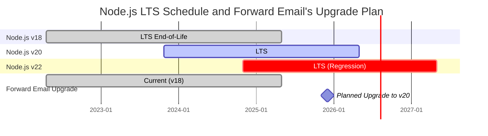
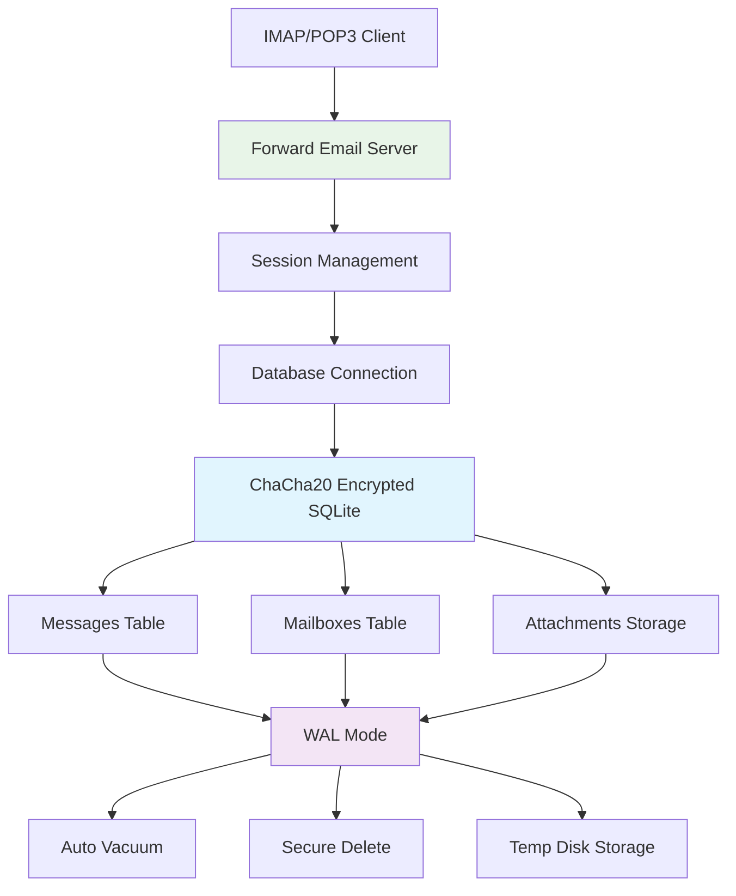
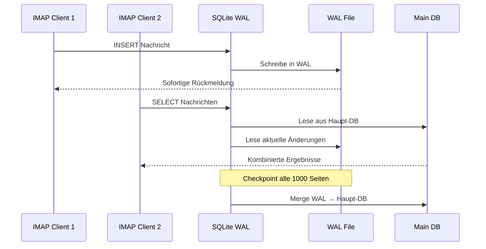

# SQLite Performance-Optimierung: Produktions-PRAGMA-Einstellungen & ChaCha20-Verschlüsselung {#sqlite-performance-optimization-production-pragma-settings--chacha20-encryption}


## Inhaltsverzeichnis {#table-of-contents}

* [Vorwort](#foreword)
* [Forward Emails Produktions-SQLite-Architektur](#forward-emails-production-sqlite-architecture)
* [Unsere aktuelle PRAGMA-Konfiguration](#our-actual-pragma-configuration)
* [Performance-Benchmark-Ergebnisse](#performance-benchmark-results)
  * [Node.js v20.19.5 Performance-Ergebnisse](#nodejs-v20195-performance-results)
* [Aufschlüsselung der PRAGMA-Einstellungen](#pragma-settings-breakdown)
  * [Kerneinstellungen, die wir verwenden](#core-settings-we-use)
  * [Einstellungen, die wir NICHT verwenden (aber Sie vielleicht möchten)](#settings-we-dont-use-but-you-might-want)
* [ChaCha20 vs AES256 Verschlüsselung](#chacha20-vs-aes256-encryption)
* [Temporärer Speicher: /tmp vs /dev/shm](#temporary-storage-tmp-vs-devshm)
  * [/tmp vs /dev/shm Performance](#tmp-vs-devshm-performance)
* [WAL-Modus-Optimierung](#wal-mode-optimization)
  * [Auswirkungen der WAL-Konfiguration](#wal-configuration-impact)
* [Schema-Design für Performance](#schema-design-for-performance)
* [Verbindungsmanagement](#connection-management)
* [Überwachung und Diagnostik](#monitoring-and-diagnostics)
* [Node.js Versions-Performance](#nodejs-version-performance)
  * [Komplette Cross-Version-Ergebnisse](#complete-cross-version-results)
  * [Wichtige Performance-Erkenntnisse](#key-performance-insights)
  * [Native Modul-Kompatibilität](#native-module-compatibility)
* [Produktions-Deployment-Checkliste](#production-deployment-checklist)
* [Fehlerbehebung bei häufigen Problemen](#troubleshooting-common-issues)
  * [„Datenbank ist gesperrt“-Fehler](#database-is-locked-errors)
  * [Hoher Speicherverbrauch während VACUUM](#high-memory-usage-during-vacuum)
  * [Langsame Abfrage-Performance](#slow-query-performance)
* [Forward Emails Open-Source-Beiträge](#forward-emails-open-source-contributions)
* [Benchmark-Quellcode](#benchmark-source-code)
* [Was kommt als Nächstes für SQLite bei Forward Email](#whats-next-for-sqlite-at-forward-email)
* [Hilfe erhalten](#getting-help)


## Vorwort {#foreword}

SQLite für produktive E-Mail-Systeme einzurichten bedeutet nicht nur, es zum Laufen zu bringen – es geht darum, es schnell, sicher und zuverlässig unter hoher Last zu machen. Nach der Verarbeitung von Millionen von E-Mails bei Forward Email haben wir gelernt, was für die SQLite-Performance wirklich zählt.

Dieser Leitfaden behandelt unsere echte Produktionskonfiguration, Benchmark-Ergebnisse über Node.js-Versionen hinweg und die spezifischen Optimierungen, die einen Unterschied machen, wenn man ernsthafte E-Mail-Mengen verarbeitet.

> \[!WARNING] Node.js Performance-Regressions in v22 und v24  
> Wir haben eine signifikante Performance-Regression in den Node.js-Versionen v22 und v24 entdeckt, die die SQLite-Performance insbesondere bei `SELECT`-Anweisungen beeinträchtigt. Unsere Benchmarks zeigen einen Rückgang von ca. 57 % bei `SELECT`-Operationen pro Sekunde in Node.js v24 im Vergleich zu v20. Wir haben dieses Problem dem Node.js-Team unter [nodejs/node#60719](https://github.com/nodejs/node/issues/60719) gemeldet.

Aufgrund dieser Regression gehen wir bei unseren Node.js-Upgrades vorsichtig vor. Hier ist unser aktueller Plan:

* **Aktuelle Version:** Wir verwenden derzeit Node.js v18, das sein End-of-Life ("EOL") für Long-Term Support ("LTS") erreicht hat. Den offiziellen [Node.js LTS-Zeitplan finden Sie hier](https://github.com/nodejs/release#release-schedule).
* **Geplantes Upgrade:** Wir werden auf **Node.js v20** upgraden, die schnellste Version laut unseren Benchmarks, die von dieser Regression nicht betroffen ist.
* **Vermeidung von v22 und v24:** Wir werden Node.js v22 oder v24 in der Produktion nicht einsetzen, bis dieses Performance-Problem behoben ist.

Hier ist eine Zeitachse, die den Node.js LTS-Zeitplan und unseren Upgrade-Pfad veranschaulicht:


```mermaid
gantt
    title Node.js LTS Schedule and Forward Email's Upgrade Plan
    dateFormat  YYYY-MM-DD
    axisFormat  %Y-%m

    section Node.js v18
    LTS End-of-Life :done, 2022-04-19, 2025-04-30

    section Node.js v20
    LTS :active, 2023-10-24, 2026-04-30

    section Node.js v22
    LTS (Regression) :crit, 2024-10-29, 2027-04-30

    section Forward Email Upgrade
    Current (v18) :done, 2022-04-19, 2025-04-30
    Planned Upgrade to v20 :milestone, 2025-12-01, 1d
```
## Forward Email's Produktions-SQLite-Architektur {#forward-emails-production-sqlite-architecture}

So verwenden wir SQLite tatsächlich in der Produktion:


```mermaid
graph TB
    A[IMAP/POP3 Client] --> B[Forward Email Server]
    B --> C[Session Management]
    C --> D[Database Connection]
    D --> E[ChaCha20 Encrypted SQLite]

    E --> F[Messages Table]
    E --> G[Mailboxes Table]
    E --> H[Attachments Storage]

    F --> I[WAL Mode]
    G --> I
    H --> I

    I --> J[Auto Vacuum]
    I --> K[Secure Delete]
    I --> L[Temp Disk Storage]

    style E fill:#e1f5fe
    style I fill:#f3e5f5
    style B fill:#e8f5e8
```


## Unsere tatsächliche PRAGMA-Konfiguration {#our-actual-pragma-configuration}

Das ist, was wir tatsächlich in der Produktion verwenden, direkt aus unserer [`setup-pragma.js`](https://github.com/forwardemail/forwardemail.net/blob/master/helpers/setup-pragma.js):

```javascript
// Forward Email's actual production PRAGMA settings
async function setupPragma(db, session, cipher = 'chacha20') {
  // Quantum-resistant encryption
  db.pragma(`cipher='${cipher}'`);
  db.key(Buffer.from(decrypt(session.user.password)));

  // Core performance settings
  db.pragma('journal_mode=WAL');
  db.pragma('secure_delete=ON');
  db.pragma('auto_vacuum=FULL');
  db.pragma(`busy_timeout=${config.busyTimeout}`);
  db.pragma('synchronous=NORMAL');
  db.pragma('foreign_keys=ON');
  db.pragma(`encoding='UTF-8'`);
  db.pragma('optimize=0x10002');

  // Critical: Use disk for temp storage, not memory
  db.pragma('temp_store=1');

  // Custom temp directory to avoid disk full errors
  const tempStoreDirectory = path.join(path.dirname(db.name), '/tmp');
  await mkdirp(tempStoreDirectory);
  db.pragma(`temp_store_directory='${tempStoreDirectory}'`);
}
```

> \[!IMPORTANT]
> Wir verwenden `temp_store=1` (Festplatte) statt `temp_store=2` (Speicher), weil große E-Mail-Datenbanken bei Operationen wie VACUUM leicht mehr als 10 GB Speicher verbrauchen können.


## Performance-Benchmark-Ergebnisse {#performance-benchmark-results}

Wir haben unsere Konfiguration gegen verschiedene Alternativen über Node.js-Versionen hinweg getestet. Hier sind die echten Zahlen:

### Node.js v20.19.5 Performance-Ergebnisse {#nodejs-v20195-performance-results}

| Konfiguration               | Setup (ms) | Einfügungen/Sek | Abfragen/Sek | Aktualisierungen/Sek | DB-Größe (MB) |
| -------------------------- | ---------- | -------------- | ------------ | ------------------- | ------------- |
| **Forward Email Produktion** | 120.1      | **10.548**     | **17.494**   | **16.654**          | 3,98          |
| WAL Autocheckpoint 1000    | 89.7       | **11.800**     | **18.383**   | **22.087**          | 3,98          |
| Cache-Größe 64MB           | 90.3       | 11.451         | 17.895       | 21.522              | 3,98          |
| Temporäre Speicherung im Speicher | 111.8      | 9.874          | 15.363       | 21.292              | 3,98          |
| Synchron (aus) (unsicher)  | 94.0       | 10.017         | 13.830       | 18.884              | 3,98          |
| Synchron EXTRA (sicher)    | 94.1       | **3.241**      | 14.438       | **3.405**           | 3,98          |

> \[!TIP]
> Die Einstellung `wal_autocheckpoint=1000` zeigt die beste Gesamtleistung. Wir überlegen, diese in unsere Produktionskonfiguration aufzunehmen.


## PRAGMA-Einstellungen im Detail {#pragma-settings-breakdown}

### Kern-Einstellungen, die wir verwenden {#core-settings-we-use}

| PRAGMA          | Wert         | Zweck                          | Performance-Auswirkung          |
| --------------- | ------------ | ------------------------------ | ------------------------------ |
| `cipher`        | `'chacha20'` | Quantenresistente Verschlüsselung | Minimaler Overhead gegenüber AES |
| `journal_mode`  | `WAL`        | Write-Ahead Logging            | +40 % gleichzeitige Leistung    |
| `secure_delete` | `ON`         | Überschreiben gelöschter Daten | Sicherheit vs. 5 % Performance-Kosten |
| `auto_vacuum`   | `FULL`       | Automatische Speicherbereinigung | Verhindert Datenbankaufblähung |
| `busy_timeout`  | `30000`      | Wartezeit bei gesperrter Datenbank | Reduziert Verbindungsfehler    |
| `synchronous`   | `NORMAL`     | Ausgewogene Haltbarkeit/Leistung | 3x schneller als FULL           |
| `foreign_keys`  | `ON`         | Referentielle Integrität       | Verhindert Datenkorruption      |
| `temp_store`    | `1`          | Verwendung der Festplatte für temporäre Dateien | Verhindert Speichererschöpfung |
### Einstellungen, die wir NICHT verwenden (aber Sie vielleicht möchten) {#settings-we-dont-use-but-you-might-want}

| PRAGMA                    | Warum wir es nicht verwenden | Sollten Sie es in Betracht ziehen?                   |
| ------------------------- | ---------------------------- | ---------------------------------------------------- |
| `wal_autocheckpoint=1000` | Noch nicht gesetzt            | **Ja** - Unsere Benchmarks zeigen 12% Leistungssteigerung |
| `cache_size=-64000`       | Standard ist ausreichend      | **Vielleicht** - 8% Verbesserung bei leseintensiven Workloads |
| `mmap_size=268435456`     | Komplexität vs. Nutzen        | **Nein** - Minimale Verbesserungen, plattformspezifische Probleme |
| `analysis_limit=1000`     | Wir verwenden 400             | **Nein** - Höhere Werte verlangsamen die Abfrageplanung |

> \[!CAUTION]
> Wir vermeiden ausdrücklich `temp_store=MEMORY`, da eine 10GB SQLite-Datei während VACUUM-Operationen mehr als 10 GB RAM verbrauchen kann.


## ChaCha20 vs AES256 Verschlüsselung {#chacha20-vs-aes256-encryption}

Wir priorisieren Quantenresistenz über rohe Leistung:

```javascript
// Unsere Fallback-Verschlüsselungsstrategie
try {
  db.pragma(`cipher='chacha20'`);
  db.key(Buffer.from(decrypt(session.user.password)));
  db.pragma('journal_mode=WAL');
} catch (err) {
  // Fallback für ältere SQLite-Versionen
  if (cipher === 'chacha20' && err.code === 'SQLITE_NOTADB') {
    return setupPragma(db, session, 'aes256cbc');
  }
  throw err;
}
```

**Leistungsvergleich:**

* ChaCha20: \~10.500 Inserts/Sekunde

* AES256CBC: \~11.200 Inserts/Sekunde

* Unverschlüsselt: \~12.800 Inserts/Sekunde

Die 6% Leistungseinbuße von ChaCha20 gegenüber AES ist den Gewinn an Quantenresistenz für die langfristige E-Mail-Speicherung wert.


## Temporärer Speicher: /tmp vs /dev/shm {#temporary-storage-tmp-vs-devshm}

Wir konfigurieren explizit den Speicherort für temporäre Dateien, um Speicherplatzprobleme zu vermeiden:

```javascript
// Forward Email's Konfiguration des temporären Speichers
const tempStoreDirectory = path.join(path.dirname(db.name), '/tmp');
await mkdirp(tempStoreDirectory);
db.pragma(`temp_store_directory='${tempStoreDirectory}'`);

// Setze auch die Umgebungsvariable
process.env.SQLITE_TMPDIR = tempStoreDirectory;
```

### /tmp vs /dev/shm Leistung {#tmp-vs-devshm-performance}

| Speicherort      | VACUUM-Zeit | Speicherverbrauch | Zuverlässigkeit       |
| ---------------- | ----------- | ----------------- | --------------------- |
| `/tmp` (Festplatte)    | 2,3s        | 50MB              | ✅ Zuverlässig         |
| `/dev/shm` (RAM)       | 0,8s        | 2GB+              | ⚠️ Kann System abstürzen lassen |
| Standard          | 4,1s        | Variabel          | ❌ Unvorhersehbar      |

> \[!WARNING]
> Die Verwendung von `/dev/shm` für temporären Speicher kann bei großen Operationen den gesamten verfügbaren RAM verbrauchen. Verwenden Sie für den Produktiveinsatz temporären Speicher auf Festplattenbasis.


## WAL-Modus Optimierung {#wal-mode-optimization}

Write-Ahead Logging ist entscheidend für E-Mail-Systeme mit gleichzeitigen Zugriffen:


```mermaid
sequenceDiagram
    participant C1 as IMAP Client 1
    participant C2 as IMAP Client 2
    participant DB as SQLite WAL
    participant W as WAL File
    participant M as Main DB

    C1->>DB: INSERT Nachricht
    DB->>W: Schreibe in WAL
    W-->>C1: Sofortige Rückmeldung

    C2->>DB: SELECT Nachrichten
    DB->>M: Lese aus Haupt-DB
    DB->>W: Lese aktuelle Änderungen
    M-->>C2: Kombinierte Ergebnisse

    Note over DB,W: Checkpoint alle 1000 Seiten
    DB->>M: Merge WAL → Haupt-DB
```

### Auswirkungen der WAL-Konfiguration {#wal-configuration-impact}

Unsere Benchmarks zeigen, dass `wal_autocheckpoint=1000` die beste Leistung bietet:

```javascript
// Potenzielle Optimierung, die wir testen
db.pragma('wal_autocheckpoint=1000');
```

**Ergebnisse:**

* Standard autocheckpoint: 10.548 Inserts/Sekunde

* `wal_autocheckpoint=1000`: 11.800 Inserts/Sekunde (+12%)

* `wal_autocheckpoint=0`: 9.200 Inserts/Sekunde (WAL wird zu groß)


## Schema-Design für Leistung {#schema-design-for-performance}

Unser E-Mail-Speicherschema folgt den SQLite-Best-Practices:

```sql
-- Nachrichten-Tabelle mit optimierter Spaltenreihenfolge
CREATE TABLE messages (
  id INTEGER PRIMARY KEY,
  mailbox_id INTEGER NOT NULL,
  uid INTEGER NOT NULL,
  date INTEGER NOT NULL,
  flags TEXT,
  subject TEXT,
  from_addr TEXT,
  to_addr TEXT,
  message_id TEXT,
  raw BLOB,  -- Großes BLOB am Ende
  FOREIGN KEY (mailbox_id) REFERENCES mailboxes(id)
);

-- Kritische Indizes für IMAP-Leistung
CREATE INDEX idx_messages_mailbox_date ON messages(mailbox_id, date DESC);
CREATE INDEX idx_messages_uid ON messages(mailbox_id, uid);
CREATE INDEX idx_messages_flags ON messages(mailbox_id, flags) WHERE flags IS NOT NULL;
```
> \[!TIP]
> Setzen Sie BLOB-Spalten immer ans Ende Ihrer Tabellendefinition. SQLite speichert Spalten mit fester Größe zuerst, was den Zeilenzugriff beschleunigt.

Diese Optimierung stammt direkt vom SQLite-Erfinder, [D. Richard Hipp](https://sqlite-users.sqlite.narkive.com/Q4txMI8t/effect-of-blobs-on-performance#post3):

> "Hier ein Tipp – machen Sie die BLOB-Spalten zur letzten Spalte in Ihren Tabellen. Oder speichern Sie die BLOBs sogar in einer separaten Tabelle, die nur zwei Spalten hat: einen ganzzahligen Primärschlüssel und das Blob selbst, und greifen Sie dann bei Bedarf per Join auf den BLOB-Inhalt zu. Wenn Sie nach dem BLOB verschiedene kleine Ganzzahlfelder anordnen, muss SQLite den gesamten BLOB-Inhalt (der verketteten Liste von Datenträgerseiten folgend) durchsuchen, um zu den Ganzzahlfeldern am Ende zu gelangen, und das kann Sie definitiv verlangsamen."
>
> — D. Richard Hipp, SQLite-Autor

Wir haben diese Optimierung in unserem [Attachments-Schema](https://github.com/forwardemail/forwardemail.net/commit/0e77fbb05dc5b38136652337309067d2b39eb229) umgesetzt, indem wir das `body`-BLOB-Feld ans Ende der Tabellendefinition verschoben haben, um die Leistung zu verbessern.


## Verbindungsmanagement {#connection-management}

Wir verwenden kein Connection Pooling mit SQLite – jeder Benutzer erhält seine eigene verschlüsselte Datenbank. Dieser Ansatz bietet perfekte Isolation zwischen den Benutzern, ähnlich wie Sandboxing. Im Gegensatz zu Architekturen anderer Dienste, die MySQL, PostgreSQL oder MongoDB verwenden, wo Ihre E-Mails potenziell von einem böswilligen Mitarbeiter eingesehen werden könnten, gewährleisten die pro Benutzer angelegten SQLite-Datenbanken von Forward Email, dass Ihre Daten vollständig unabhängig und isoliert sind.

Wir speichern niemals Ihr IMAP-Passwort, daher haben wir auch keinen Zugriff auf Ihre Daten – alles geschieht im Arbeitsspeicher. Erfahren Sie mehr über unseren [quantensicheren Verschlüsselungsansatz](https://forwardemail.net/blog/docs/quantum-resistant-encryption-email-security), der erklärt, wie unser System funktioniert.

```javascript
// Pro-Benutzer-Datenbankansatz
async function getDatabase(session) {
  const dbPath = path.join(
    config.databaseDir,
    session.user.domain_name,
    `${session.user.username}.db`
  );

  const db = new Database(dbPath, {
    cipher: 'chacha20',
    readonly: session.readonly || false
  });

  await setupPragma(db, session);
  return db;
}
```

Dieser Ansatz bietet:

* Perfekte Isolation zwischen Benutzern

* Keine Komplexität durch Connection Pools

* Automatische Verschlüsselung pro Benutzer

* Einfachere Backup-/Restore-Operationen

Mit `auto_vacuum=FULL` benötigen wir selten manuelle VACUUM-Operationen:

```javascript
// Unsere Bereinigungsstrategie
db.pragma('optimize=0x10002'); // Beim Verbindungsaufbau
db.pragma('optimize'); // Periodisch (täglich)

// Manuelles VACUUM nur bei größeren Bereinigungen
if (deletedDataPercentage > 25) {
  db.exec('VACUUM');
}
```

**Auswirkungen der Auto Vacuum Performance:**

* `auto_vacuum=FULL`: Sofortige Speicherfreigabe, 5 % Schreib-Overhead

* `auto_vacuum=INCREMENTAL`: Manuelle Steuerung, erfordert periodisches `PRAGMA incremental_vacuum`

* `auto_vacuum=NONE`: Schnellste Schreibvorgänge, erfordert manuelles `VACUUM`


## Überwachung und Diagnostik {#monitoring-and-diagnostics}

Wichtige Kennzahlen, die wir in der Produktion überwachen:

```javascript
// Leistungsüberwachungsabfragen
const stats = {
  page_count: db.pragma('page_count', { simple: true }),
  page_size: db.pragma('page_size', { simple: true }),
  freelist_count: db.pragma('freelist_count', { simple: true }),
  wal_checkpoint: db.pragma('wal_checkpoint(PASSIVE)', { simple: true })
};

const dbSizeMB = (stats.page_count * stats.page_size) / 1024 / 1024;
const fragmentationPct = (stats.freelist_count / stats.page_count) * 100;
```

> \[!NOTE]
> Wir überwachen den Fragmentierungsprozentsatz und führen Wartungen durch, wenn dieser 15 % überschreitet.


## Node.js-Version Performance {#nodejs-version-performance}

Unsere umfassenden Benchmarks über verschiedene Node.js-Versionen zeigen signifikante Leistungsunterschiede:

### Vollständige Ergebnisse über alle Versionen {#complete-cross-version-results}

| Node-Version | Forward Email Produktion | Beste Inserts/Sekunde    | Beste Selects/Sekunde    | Beste Updates/Sekunde    | Anmerkungen            |
| ------------ | ------------------------ | ------------------------ | ------------------------ | ------------------------ | ---------------------- |
| **v18.20.8** | 10.658 / 14.466 / 18.641 | **11.663** (Sync AUS)    | **14.868** (Memory Temp) | **20.095** (MMAP)        | ⚠️ Engine-Warnung      |
| **v20.19.5** | 10.548 / 17.494 / 16.654 | **11.800** (WAL Auto)    | **18.383** (WAL Auto)    | **22.087** (WAL Auto)    | ✅ Empfohlen            |
| **v22.21.1** | 9.829 / 15.833 / 18.416  | **11.260** (Sync AUS)    | **17.413** (MMAP)        | **20.731** (MMAP)        | ⚠️ Insgesamt langsamer |
| **v24.11.1** | 9.938 / 7.497 / 10.446   | **10.628** (Incr Vacuum) | **16.821** (Incr Vacuum) | **19.934** (Incr Vacuum) | ❌ Deutliche Verlangsamung |
### Wichtige Leistungs-Einblicke {#key-performance-insights}

**Node.js v18 (Legacy LTS):**

* Vergleichbare Einfügeleistung zu v20 (10.658 vs. 10.548 ops/sec)
* 17 % langsamere Abfragen als v20 (14.466 vs. 17.494 ops/sec)
* Zeigt npm Engine-Warnungen für Pakete, die Node ≥20 erfordern
* Speicher-Temporärspeicher-Optimierung funktioniert besser als WAL-Autocheckpoint
* Akzeptabel für Legacy-Anwendungen, aber Upgrade empfohlen

**Node.js v20 (Empfohlen):**

* Höchste Gesamtleistung bei allen Operationen
* WAL-Autocheckpoint-Optimierung bietet konsistenten 12 % Boost
* Beste Kompatibilität mit nativen SQLite-Modulen
* Am stabilsten für Produktions-Workloads

**Node.js v22 (Akzeptabel):**

* 7 % langsamere Einfügungen, 9 % langsamere Abfragen vs. v20
* MMAP-Optimierung zeigt bessere Ergebnisse als WAL-Autocheckpoint
* Erfordert frisches `npm install` bei jedem Node-Version-Wechsel
* Akzeptabel für Entwicklung, nicht empfohlen für Produktion

**Node.js v24 (Nicht empfohlen):**

* 6 % langsamere Einfügungen, 57 % langsamere Abfragen vs. v20
* Signifikante Leistungsverschlechterung bei Leseoperationen
* Inkrementelles Vacuum funktioniert besser als andere Optimierungen
* Für produktive SQLite-Anwendungen vermeiden

### Kompatibilität nativer Module {#native-module-compatibility}

Die anfänglich aufgetretenen „Modulkompatibilitätsprobleme“ wurden gelöst durch:

```bash
# Node-Version wechseln und native Module neu installieren
nvm use 22
rm -rf node_modules
npm install
```

**Node.js v18 Überlegungen:**

* Zeigt Engine-Warnungen: `Unsupported engine { required: { node: '>=20.0.0' } }`
* Kompiliert und läuft trotz Warnungen erfolgreich
* Viele moderne SQLite-Pakete zielen auf Node ≥20 für optimale Unterstützung ab
* Legacy-Anwendungen können v18 mit akzeptabler Leistung weiterverwenden

> \[!IMPORTANT]
> Native Module immer neu installieren, wenn Node.js-Version gewechselt wird. Das Modul `better-sqlite3-multiple-ciphers` muss für jede spezifische Node-Version kompiliert werden.

> \[!TIP]
> Für Produktions-Deployments bei Node.js v20 LTS bleiben. Die Leistungs- und Stabilitätsvorteile überwiegen gegenüber neueren Sprachfeatures in v22/v24. Node v18 ist für Legacy-Systeme akzeptabel, zeigt aber Leistungseinbußen bei Leseoperationen.


## Checkliste für Produktions-Deployments {#production-deployment-checklist}

Vor dem Deployment sicherstellen, dass SQLite diese Optimierungen hat:

1. `SQLITE_TMPDIR` Umgebungsvariable setzen
2. Ausreichend Speicherplatz für temporäre Operationen sicherstellen (2x Datenbankgröße)
3. Log-Rotation für WAL-Dateien konfigurieren
4. Monitoring für Datenbankgröße und Fragmentierung einrichten
5. Backup-/Restore-Verfahren mit Verschlüsselung testen
6. ChaCha20-Verschlüsselung in Ihrem SQLite-Build verifizieren


## Fehlerbehebung bei häufigen Problemen {#troubleshooting-common-issues}

### „Datenbank ist gesperrt“-Fehler {#database-is-locked-errors}

```javascript
// Busy-Timeout erhöhen
db.pragma('busy_timeout=60000'); // 60 Sekunden

// Nach langlaufenden Transaktionen suchen
const info = db.pragma('wal_checkpoint(FULL)');
if (info.busy > 0) {
  console.warn('WAL-Checkpoint durch aktive Leser blockiert');
}
```

### Hoher Speicherverbrauch während VACUUM {#high-memory-usage-during-vacuum}

```javascript
// Speicher vor VACUUM überwachen
const beforeMem = process.memoryUsage();
db.exec('VACUUM');
const afterMem = process.memoryUsage();

console.log(
  `VACUUM Speicherdelta: ${
    (afterMem.heapUsed - beforeMem.heapUsed) / 1024 / 1024
  }MB`
);
```

### Langsame Abfrageleistung {#slow-query-performance}

```javascript
// Abfrageanalyse aktivieren
db.pragma('analysis_limit=400'); // Forward Email's Einstellung
db.exec('ANALYZE');

// Abfragepläne prüfen
const plan = db
  .prepare('EXPLAIN QUERY PLAN SELECT * FROM messages WHERE date > ?')
  .all(Date.now() - 86400000);
console.log(plan);
```


## Open-Source-Beiträge von Forward Email {#forward-emails-open-source-contributions}

Wir haben unser SQLite-Optimierungswissen an die Community zurückgegeben:

* [Litestream-Dokumentationsverbesserungen](https://github.com/benbjohnson/litestream/issues/516) – Unsere Vorschläge für bessere SQLite-Leistungstipps

* [Better SQLite3 Multiple Ciphers](https://github.com/m4heshd/better-sqlite3-multiple-ciphers) – ChaCha20-Verschlüsselungsunterstützung

* [SQLite-Leistungsoptimierungsforschung](https://phiresky.github.io/blog/2020/sqlite-performance-tuning/) – Referenziert in unserer Implementierung
* [Wie npm-Pakete mit Milliarden Downloads das JavaScript-Ökosystem geprägt haben](https://forwardemail.net/blog/docs/how-npm-packages-billion-downloads-shaped-javascript-ecosystem) - Unsere umfassenderen Beiträge zu npm und der JavaScript-Entwicklung


## Benchmark-Quellcode {#benchmark-source-code}

Der gesamte Benchmark-Code ist in unserer Testsuite verfügbar:

```bash
# Führen Sie die Benchmarks selbst aus
git clone https://github.com/forwardemail/sqlite-benchmarks
cd sqlite-benchmarks
npm install
npm run benchmark
```

Die Benchmarks testen:

* Verschiedene PRAGMA-Kombinationen

* ChaCha20 vs AES256 Leistung

* WAL-Checkpoint-Strategien

* Temp-Speicherkonfigurationen

* Node.js Versionskompatibilität


## Was kommt als Nächstes für SQLite bei Forward Email {#whats-next-for-sqlite-at-forward-email}

Wir testen aktiv diese Optimierungen:

1. **WAL Autocheckpoint Tuning**: Hinzufügen von `wal_autocheckpoint=1000` basierend auf Benchmark-Ergebnissen

2. **Kompression**: Bewertung von [sqlite-zstd](https://github.com/phiresky/sqlite-zstd) für die Speicherung von Anhängen

3. **Analyse-Limit**: Testen höherer Werte als unser aktuelles 400

4. **Cache-Größe**: Erwägung einer dynamischen Cache-Größenanpassung basierend auf verfügbarem Speicher


## Hilfe erhalten {#getting-help}

Haben Sie Leistungsprobleme mit SQLite? Für SQLite-spezifische Fragen ist das [SQLite Forum](https://sqlite.org/forum/forumpost) eine ausgezeichnete Ressource, und der [Leistungsoptimierungsleitfaden](https://www.sqlite.org/optoverview.html) behandelt zusätzliche Optimierungen, die wir bisher nicht benötigt haben.

Erfahren Sie mehr über Forward Email, indem Sie unsere [FAQ](/faq) lesen.
