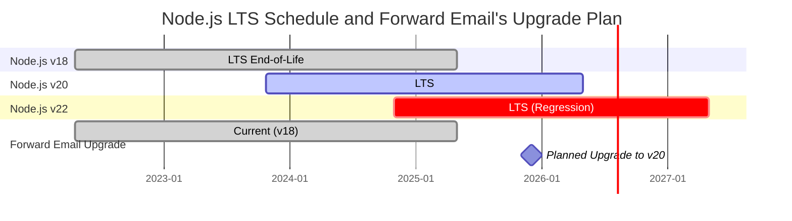
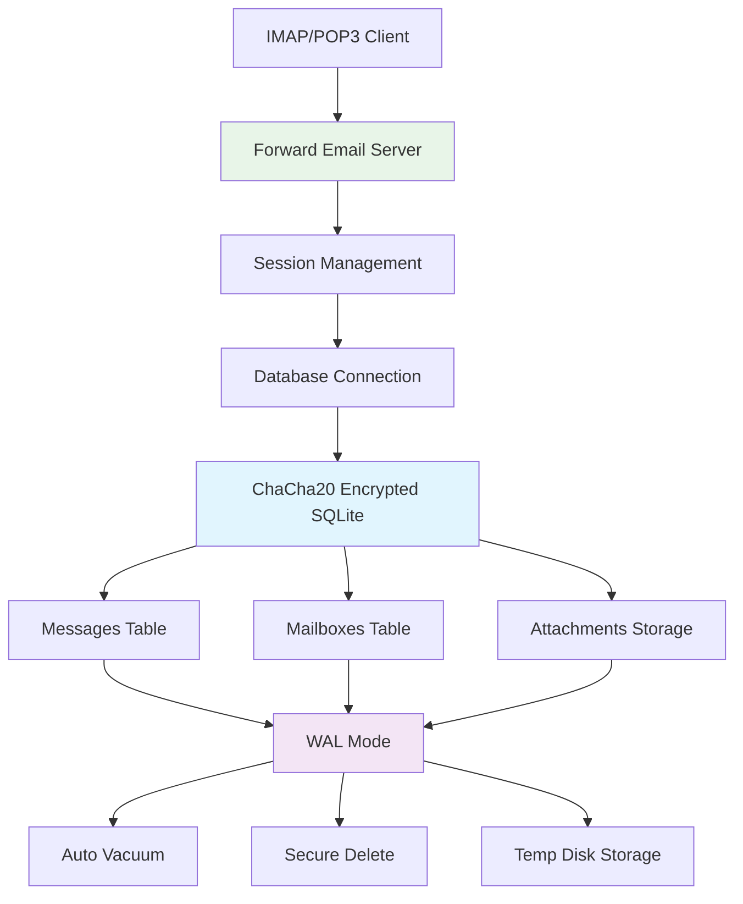
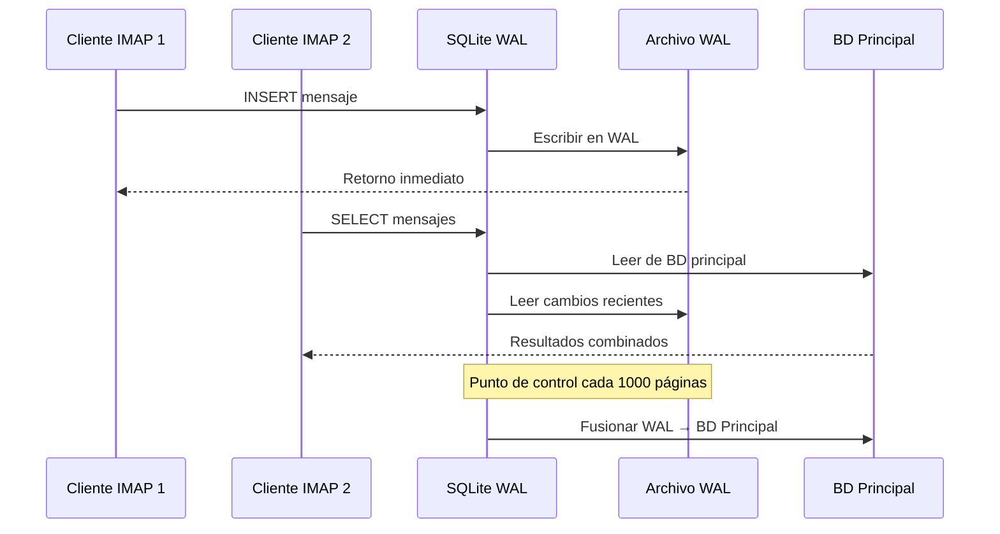

# Optimización del Rendimiento de SQLite: Configuraciones PRAGMA para Producción y Encriptación ChaCha20 {#sqlite-performance-optimization-production-pragma-settings--chacha20-encryption}


## Tabla de Contenidos {#table-of-contents}

* [Prólogo](#foreword)
* [Arquitectura de SQLite en Producción de Forward Email](#forward-emails-production-sqlite-architecture)
* [Nuestra Configuración Actual de PRAGMA](#our-actual-pragma-configuration)
* [Resultados del Benchmark de Rendimiento](#performance-benchmark-results)
  * [Resultados de Rendimiento en Node.js v20.19.5](#nodejs-v20195-performance-results)
* [Desglose de Configuraciones PRAGMA](#pragma-settings-breakdown)
  * [Configuraciones Básicas que Usamos](#core-settings-we-use)
  * [Configuraciones que NO Usamos (Pero Podrías Querer)](#settings-we-dont-use-but-you-might-want)
* [Encriptación ChaCha20 vs AES256](#chacha20-vs-aes256-encryption)
* [Almacenamiento Temporal: /tmp vs /dev/shm](#temporary-storage-tmp-vs-devshm)
  * [Rendimiento /tmp vs /dev/shm](#tmp-vs-devshm-performance)
* [Optimización del Modo WAL](#wal-mode-optimization)
  * [Impacto de la Configuración WAL](#wal-configuration-impact)
* [Diseño del Esquema para Rendimiento](#schema-design-for-performance)
* [Gestión de Conexiones](#connection-management)
* [Monitoreo y Diagnóstico](#monitoring-and-diagnostics)
* [Rendimiento según Versión de Node.js](#nodejs-version-performance)
  * [Resultados Completos entre Versiones](#complete-cross-version-results)
  * [Principales Conclusiones de Rendimiento](#key-performance-insights)
  * [Compatibilidad con Módulos Nativos](#native-module-compatibility)
* [Lista de Verificación para Despliegue en Producción](#production-deployment-checklist)
* [Solución de Problemas Comunes](#troubleshooting-common-issues)
  * [Errores "Database is locked"](#database-is-locked-errors)
  * [Alto Uso de Memoria Durante VACUUM](#high-memory-usage-during-vacuum)
  * [Rendimiento Lento en Consultas](#slow-query-performance)
* [Contribuciones Open Source de Forward Email](#forward-emails-open-source-contributions)
* [Código Fuente del Benchmark](#benchmark-source-code)
* [Qué Sigue para SQLite en Forward Email](#whats-next-for-sqlite-at-forward-email)
* [Cómo Obtener Ayuda](#getting-help)


## Prólogo {#foreword}

Configurar SQLite para sistemas de correo electrónico en producción no es solo hacer que funcione, sino hacerlo rápido, seguro y confiable bajo cargas pesadas. Después de procesar millones de correos en Forward Email, hemos aprendido qué es lo que realmente importa para el rendimiento de SQLite.

Esta guía cubre nuestra configuración real en producción, resultados de benchmarks en distintas versiones de Node.js y las optimizaciones específicas que marcan la diferencia cuando manejas un volumen serio de correos.

> \[!WARNING] Regresiones de Rendimiento en Node.js v22 y v24  
> Descubrimos una regresión significativa en el rendimiento de Node.js versiones v22 y v24 que afecta el rendimiento de SQLite, especialmente en sentencias `SELECT`. Nuestros benchmarks muestran una caída de ~57% en operaciones `SELECT` por segundo en Node.js v24 comparado con v20. Hemos reportado este problema al equipo de Node.js en [nodejs/node#60719](https://github.com/nodejs/node/issues/60719).

Debido a esta regresión, estamos tomando un enfoque cauteloso en nuestras actualizaciones de Node.js. Aquí está nuestro plan actual:

* **Versión Actual:** Actualmente usamos Node.js v18, que ha llegado al fin de su vida útil ("EOL") para Soporte a Largo Plazo ("LTS"). Puedes ver el [cronograma oficial de LTS de Node.js aquí](https://github.com/nodejs/release#release-schedule).
* **Actualización Planeada:** Actualizaremos a **Node.js v20**, que es la versión más rápida según nuestros benchmarks y no está afectada por esta regresión.
* **Evitar v22 y v24:** No usaremos Node.js v22 ni v24 en producción hasta que se resuelva este problema de rendimiento.

Aquí tienes una línea de tiempo que ilustra el cronograma LTS de Node.js y nuestra ruta de actualización:


## Arquitectura de SQLite en Producción de Forward Email {#forward-emails-production-sqlite-architecture}

Así es como realmente usamos SQLite en producción:




## Nuestra Configuración Actual de PRAGMA {#our-actual-pragma-configuration}

Esto es lo que realmente usamos en producción, directamente de nuestro [`setup-pragma.js`](https://github.com/forwardemail/forwardemail.net/blob/master/helpers/setup-pragma.js):

```javascript
// Forward Email's actual production PRAGMA settings
async function setupPragma(db, session, cipher = 'chacha20') {
  // Quantum-resistant encryption
  db.pragma(`cipher='${cipher}'`);
  db.key(Buffer.from(decrypt(session.user.password)));

  // Core performance settings
  db.pragma('journal_mode=WAL');
  db.pragma('secure_delete=ON');
  db.pragma('auto_vacuum=FULL');
  db.pragma(`busy_timeout=${config.busyTimeout}`);
  db.pragma('synchronous=NORMAL');
  db.pragma('foreign_keys=ON');
  db.pragma(`encoding='UTF-8'`);
  db.pragma('optimize=0x10002');

  // Critical: Use disk for temp storage, not memory
  db.pragma('temp_store=1');

  // Custom temp directory to avoid disk full errors
  const tempStoreDirectory = path.join(path.dirname(db.name), '/tmp');
  await mkdirp(tempStoreDirectory);
  db.pragma(`temp_store_directory='${tempStoreDirectory}'`);
}
```

> \[!IMPORTANT]
> Usamos `temp_store=1` (disco) en lugar de `temp_store=2` (memoria) porque las bases de datos de correo electrónico grandes pueden consumir fácilmente más de 10 GB de memoria durante operaciones como VACUUM.


## Resultados del Benchmark de Rendimiento {#performance-benchmark-results}

Probamos nuestra configuración contra varias alternativas en diferentes versiones de Node.js. Aquí están los números reales:

### Resultados de Rendimiento en Node.js v20.19.5 {#nodejs-v20195-performance-results}

| Configuración                | Configuración (ms) | Inserciones/seg | Selecciones/seg | Actualizaciones/seg | Tamaño BD (MB) |
| ---------------------------- | ------------------ | --------------- | --------------- | ------------------- | -------------- |
| **Producción Forward Email** | 120.1              | **10,548**      | **17,494**      | **16,654**          | 3.98           |
| WAL Autocheckpoint 1000      | 89.7               | **11,800**      | **18,383**      | **22,087**          | 3.98           |
| Tamaño Caché 64MB            | 90.3               | 11,451          | 17,895          | 21,522              | 3.98           |
| Almacenamiento Temp en Memoria | 111.8             | 9,874           | 15,363          | 21,292              | 3.98           |
| Síncrono OFF (Inseguro)      | 94.0               | 10,017          | 13,830          | 18,884              | 3.98           |
| Síncrono EXTRA (Seguro)      | 94.1               | **3,241**       | 14,438          | **3,405**           | 3.98           |

> \[!TIP]
> La configuración `wal_autocheckpoint=1000` muestra el mejor rendimiento general. Estamos considerando agregar esto a nuestra configuración de producción.


## Desglose de Configuraciones PRAGMA {#pragma-settings-breakdown}

### Configuraciones Básicas que Usamos {#core-settings-we-use}

| PRAGMA          | Valor        | Propósito                      | Impacto en el Rendimiento       |
| --------------- | ------------ | ------------------------------ | ------------------------------- |
| `cipher`        | `'chacha20'` | Encriptación resistente a quantum | Sobrecarga mínima vs AES        |
| `journal_mode`  | `WAL`        | Registro adelantado de escritura | +40% rendimiento concurrente    |
| `secure_delete` | `ON`         | Sobrescribir datos eliminados   | Seguridad vs costo del 5% en rendimiento |
| `auto_vacuum`   | `FULL`       | Recuperación automática de espacio | Previene el crecimiento de la base de datos |
| `busy_timeout`  | `30000`      | Tiempo de espera para BD bloqueada | Reduce fallos de conexión       |
| `synchronous`   | `NORMAL`     | Durabilidad/rendimiento equilibrado | 3x más rápido que FULL          |
| `foreign_keys`  | `ON`         | Integridad referencial          | Previene corrupción de datos    |
| `temp_store`    | `1`          | Usar disco para archivos temporales | Previene agotamiento de memoria |
### Configuraciones Que NO Usamos (Pero Podrías Querer) {#settings-we-dont-use-but-you-might-want}

| PRAGMA                    | Por Qué No Lo Usamos | ¿Deberías Considerarlo?                           |
| ------------------------- | -------------------- | ------------------------------------------------ |
| `wal_autocheckpoint=1000` | Aún no configurado   | **Sí** - Nuestros benchmarks muestran un 12% de mejora en rendimiento  |
| `cache_size=-64000`       | El valor por defecto es suficiente | **Quizás** - Mejora del 8% para cargas de trabajo con muchas lecturas |
| `mmap_size=268435456`     | Complejidad vs beneficio | **No** - Ganancias mínimas, problemas específicos de plataforma    |
| `analysis_limit=1000`     | Usamos 400           | **No** - Valores más altos ralentizan la planificación de consultas |

> \[!CAUTION]
> Evitamos específicamente `temp_store=MEMORY` porque un archivo SQLite de 10GB puede consumir más de 10 GB de RAM durante operaciones VACUUM.


## Encriptación ChaCha20 vs AES256 {#chacha20-vs-aes256-encryption}

Priorizamos la resistencia cuántica sobre el rendimiento bruto:

```javascript
// Nuestra estrategia de respaldo para encriptación
try {
  db.pragma(`cipher='chacha20'`);
  db.key(Buffer.from(decrypt(session.user.password)));
  db.pragma('journal_mode=WAL');
} catch (err) {
  // Respaldo para versiones antiguas de SQLite
  if (cipher === 'chacha20' && err.code === 'SQLITE_NOTADB') {
    return setupPragma(db, session, 'aes256cbc');
  }
  throw err;
}
```

**Comparación de Rendimiento:**

* ChaCha20: \~10,500 inserciones/seg

* AES256CBC: \~11,200 inserciones/seg

* Sin encriptar: \~12,800 inserciones/seg

El costo de rendimiento del 6% de ChaCha20 frente a AES vale la pena por la resistencia cuántica para almacenamiento de correo a largo plazo.


## Almacenamiento Temporal: /tmp vs /dev/shm {#temporary-storage-tmp-vs-devshm}

Configuramos explícitamente la ubicación del almacenamiento temporal para evitar problemas de espacio en disco:

```javascript
// Configuración de almacenamiento temporal de Forward Email
const tempStoreDirectory = path.join(path.dirname(db.name), '/tmp');
await mkdirp(tempStoreDirectory);
db.pragma(`temp_store_directory='${tempStoreDirectory}'`);

// También establecer variable de entorno
process.env.SQLITE_TMPDIR = tempStoreDirectory;
```

### Rendimiento /tmp vs /dev/shm {#tmp-vs-devshm-performance}

| Ubicación de Almacenamiento | Tiempo VACUUM | Uso de Memoria | Confiabilidad       |
| --------------------------- | ------------- | -------------- | ------------------- |
| `/tmp` (disco)              | 2.3s          | 50MB           | ✅ Confiable         |
| `/dev/shm` (RAM)            | 0.8s          | 2GB+           | ⚠️ Puede colapsar el sistema |
| Predeterminado              | 4.1s          | Variable       | ❌ Impredecible      |

> \[!WARNING]
> Usar `/dev/shm` para almacenamiento temporal puede consumir toda la RAM disponible durante operaciones grandes. Usa almacenamiento temporal basado en disco para producción.


## Optimización del Modo WAL {#wal-mode-optimization}

El registro adelantado (Write-Ahead Logging) es crucial para sistemas de correo con acceso concurrente:



### Impacto de la Configuración WAL {#wal-configuration-impact}

Nuestros benchmarks muestran que `wal_autocheckpoint=1000` ofrece el mejor rendimiento:

```javascript
// Optimización potencial que estamos probando
db.pragma('wal_autocheckpoint=1000');
```

**Resultados:**

* Autocheckpoint por defecto: 10,548 inserciones/seg

* `wal_autocheckpoint=1000`: 11,800 inserciones/seg (+12%)

* `wal_autocheckpoint=0`: 9,200 inserciones/seg (WAL crece demasiado)


## Diseño del Esquema para Rendimiento {#schema-design-for-performance}

Nuestro esquema de almacenamiento de correo sigue las mejores prácticas de SQLite:

```sql
-- Tabla de mensajes con orden optimizado de columnas
CREATE TABLE messages (
  id INTEGER PRIMARY KEY,
  mailbox_id INTEGER NOT NULL,
  uid INTEGER NOT NULL,
  date INTEGER NOT NULL,
  flags TEXT,
  subject TEXT,
  from_addr TEXT,
  to_addr TEXT,
  message_id TEXT,
  raw BLOB,  -- BLOB grande al final
  FOREIGN KEY (mailbox_id) REFERENCES mailboxes(id)
);

-- Índices críticos para rendimiento IMAP
CREATE INDEX idx_messages_mailbox_date ON messages(mailbox_id, date DESC);
CREATE INDEX idx_messages_uid ON messages(mailbox_id, uid);
CREATE INDEX idx_messages_flags ON messages(mailbox_id, flags) WHERE flags IS NOT NULL;
```
> \[!TIP]
> Siempre coloque las columnas BLOB al final de la definición de su tabla. SQLite almacena primero las columnas de tamaño fijo, lo que hace que el acceso a las filas sea más rápido.

Esta optimización viene directamente del creador de SQLite, [D. Richard Hipp](https://sqlite-users.sqlite.narkive.com/Q4txMI8t/effect-of-blobs-on-performance#post3):

> "Aquí hay un consejo: haga que las columnas BLOB sean la última columna en sus tablas. O incluso almacene los BLOBs en una tabla separada que solo tenga dos columnas: una clave primaria entera y el blob en sí, y luego acceda al contenido del BLOB usando un join si lo necesita. Si pone varios campos enteros pequeños después del BLOB, entonces SQLite tiene que escanear todo el contenido del BLOB (siguiendo la lista enlazada de páginas de disco) para llegar a los campos enteros al final, y eso definitivamente puede ralentizarlo."
>
> — D. Richard Hipp, Autor de SQLite

Implementamos esta optimización en nuestro [esquema de Adjuntos](https://github.com/forwardemail/forwardemail.net/commit/0e77fbb05dc5b38136652337309067d2b39eb229), moviendo el campo BLOB `body` al final de la definición de la tabla para un mejor rendimiento.


## Gestión de Conexiones {#connection-management}

No usamos agrupación de conexiones con SQLite—cada usuario obtiene su propia base de datos cifrada. Este enfoque proporciona un aislamiento perfecto entre usuarios, similar a un sandbox. A diferencia de arquitecturas de otros servicios que usan MySQL, PostgreSQL o MongoDB donde su correo electrónico podría ser potencialmente accedido por un empleado malintencionado, las bases de datos SQLite por usuario de Forward Email aseguran que sus datos sean completamente independientes y aislados.

Nunca almacenamos su contraseña IMAP, por lo que nunca tenemos acceso a sus datos—todo se hace en memoria. Aprenda más sobre nuestro [enfoque de cifrado resistente a la computación cuántica](https://forwardemail.net/blog/docs/quantum-resistant-encryption-email-security) que detalla cómo funciona nuestro sistema.

```javascript
// Enfoque de base de datos por usuario
async function getDatabase(session) {
  const dbPath = path.join(
    config.databaseDir,
    session.user.domain_name,
    `${session.user.username}.db`
  );

  const db = new Database(dbPath, {
    cipher: 'chacha20',
    readonly: session.readonly || false
  });

  await setupPragma(db, session);
  return db;
}
```

Este enfoque proporciona:

* Aislamiento perfecto entre usuarios

* Sin complejidad de agrupación de conexiones

* Cifrado automático por usuario

* Operaciones de respaldo/restauración más simples

Con `auto_vacuum=FULL`, rara vez necesitamos operaciones VACUUM manuales:

```javascript
// Nuestra estrategia de limpieza
db.pragma('optimize=0x10002'); // Al abrir la conexión
db.pragma('optimize'); // Periódicamente (diario)

// Vacuum manual solo para limpiezas mayores
if (deletedDataPercentage > 25) {
  db.exec('VACUUM');
}
```

**Impacto en el rendimiento del Auto Vacuum:**

* `auto_vacuum=FULL`: Recuperación inmediata de espacio, 5% de sobrecarga en escritura

* `auto_vacuum=INCREMENTAL`: Control manual, requiere `PRAGMA incremental_vacuum` periódico

* `auto_vacuum=NONE`: Escrituras más rápidas, requiere `VACUUM` manual


## Monitoreo y Diagnósticos {#monitoring-and-diagnostics}

Métricas clave que monitoreamos en producción:

```javascript
// Consultas de monitoreo de rendimiento
const stats = {
  page_count: db.pragma('page_count', { simple: true }),
  page_size: db.pragma('page_size', { simple: true }),
  freelist_count: db.pragma('freelist_count', { simple: true }),
  wal_checkpoint: db.pragma('wal_checkpoint(PASSIVE)', { simple: true })
};

const dbSizeMB = (stats.page_count * stats.page_size) / 1024 / 1024;
const fragmentationPct = (stats.freelist_count / stats.page_count) * 100;
```

> \[!NOTE]
> Monitoreamos el porcentaje de fragmentación y activamos mantenimiento cuando supera el 15%.


## Rendimiento según la Versión de Node.js {#nodejs-version-performance}

Nuestros benchmarks completos a través de versiones de Node.js revelan diferencias significativas en el rendimiento:

### Resultados Completos entre Versiones {#complete-cross-version-results}

| Versión de Node | Producción Forward Email | Mejor Insert/sec         | Mejor Select/sec         | Mejor Update/sec         | Notas                  |
| -------------- | ------------------------ | ------------------------ | ------------------------ | ------------------------ | ---------------------- |
| **v18.20.8**   | 10,658 / 14,466 / 18,641 | **11,663** (Sync OFF)    | **14,868** (Memory Temp) | **20,095** (MMAP)        | ⚠️ Advertencia del motor |
| **v20.19.5**   | 10,548 / 17,494 / 16,654 | **11,800** (WAL Auto)    | **18,383** (WAL Auto)    | **22,087** (WAL Auto)    | ✅ Recomendado          |
| **v22.21.1**   | 9,829 / 15,833 / 18,416  | **11,260** (Sync OFF)    | **17,413** (MMAP)        | **20,731** (MMAP)        | ⚠️ Más lento en general |
| **v24.11.1**   | 9,938 / 7,497 / 10,446   | **10,628** (Incr Vacuum) | **16,821** (Incr Vacuum) | **19,934** (Incr Vacuum) | ❌ Ralentización significativa |
### Perspectivas Clave de Rendimiento {#key-performance-insights}

**Node.js v18 (Legacy LTS):**

* Rendimiento de inserción comparable a v20 (10,658 vs 10,548 ops/seg)
* Selects un 17% más lentos que v20 (14,466 vs 17,494 ops/seg)
* Muestra advertencias del motor npm para paquetes que requieren Node ≥20
* La optimización de almacenamiento temporal en memoria funciona mejor que el autocheckpoint WAL
* Aceptable para aplicaciones legacy, pero se recomienda actualizar

**Node.js v20 (Recomendado):**

* Mayor rendimiento general en todas las operaciones
* La optimización de autocheckpoint WAL proporciona un aumento constante del 12%
* Mejor compatibilidad con módulos nativos de SQLite
* Más estable para cargas de trabajo en producción

**Node.js v22 (Aceptable):**

* Inserciones un 7% más lentas, selects un 9% más lentos vs v20
* La optimización MMAP muestra mejores resultados que el autocheckpoint WAL
* Requiere un `npm install` fresco para cada cambio de versión de Node
* Aceptable para desarrollo, no recomendado para producción

**Node.js v24 (No Recomendado):**

* Inserciones un 6% más lentas, selects un 57% más lentos vs v20
* Regresión significativa de rendimiento en operaciones de lectura
* El vacuum incremental funciona mejor que otras optimizaciones
* Evitar para aplicaciones SQLite en producción

### Compatibilidad con Módulos Nativos {#native-module-compatibility}

Los "problemas de compatibilidad de módulos" que inicialmente encontramos se resolvieron con:

```bash
# Cambiar versión de Node y reinstalar módulos nativos
nvm use 22
rm -rf node_modules
npm install
```

**Consideraciones para Node.js v18:**

* Muestra advertencias del motor: `Unsupported engine { required: { node: '>=20.0.0' } }`
* Aún compila y se ejecuta correctamente a pesar de las advertencias
* Muchos paquetes modernos de SQLite apuntan a Node ≥20 para soporte óptimo
* Las aplicaciones legacy pueden seguir usando v18 con rendimiento aceptable

> \[!IMPORTANT]
> Siempre reinstale los módulos nativos al cambiar versiones de Node.js. El módulo `better-sqlite3-multiple-ciphers` debe compilarse para cada versión específica de Node.

> \[!TIP]
> Para despliegues en producción, manténgase con Node.js v20 LTS. Los beneficios de rendimiento y estabilidad superan cualquier característica nueva del lenguaje en v22/v24. Node v18 es aceptable para sistemas legacy pero muestra degradación de rendimiento en operaciones de lectura.


## Lista de Verificación para Despliegue en Producción {#production-deployment-checklist}

Antes de desplegar, asegúrese de que SQLite tenga estas optimizaciones:

1. Establecer la variable de entorno `SQLITE_TMPDIR`
2. Asegurar espacio en disco adecuado para operaciones temporales (2x tamaño de la base de datos)
3. Configurar rotación de logs para archivos WAL
4. Configurar monitoreo del tamaño y fragmentación de la base de datos
5. Probar procedimientos de respaldo/restauración con cifrado
6. Verificar soporte del cifrado ChaCha20 en su compilación de SQLite


## Solución de Problemas Comunes {#troubleshooting-common-issues}

### Errores "Database is locked" {#database-is-locked-errors}

```javascript
// Incrementar tiempo de espera ocupado
db.pragma('busy_timeout=60000'); // 60 segundos

// Verificar transacciones de larga duración
const info = db.pragma('wal_checkpoint(FULL)');
if (info.busy > 0) {
  console.warn('Punto de control WAL bloqueado por lectores activos');
}
```

### Alto Uso de Memoria Durante VACUUM {#high-memory-usage-during-vacuum}

```javascript
// Monitorear memoria antes de VACUUM
const beforeMem = process.memoryUsage();
db.exec('VACUUM');
const afterMem = process.memoryUsage();

console.log(
  `Delta de memoria VACUUM: ${
    (afterMem.heapUsed - beforeMem.heapUsed) / 1024 / 1024
  }MB`
);
```

### Rendimiento Lento de Consultas {#slow-query-performance}

```javascript
// Habilitar análisis de consultas
db.pragma('analysis_limit=400'); // Configuración de Forward Email
db.exec('ANALYZE');

// Verificar planes de consulta
const plan = db
  .prepare('EXPLAIN QUERY PLAN SELECT * FROM messages WHERE date > ?')
  .all(Date.now() - 86400000);
console.log(plan);
```


## Contribuciones Open Source de Forward Email {#forward-emails-open-source-contributions}

Hemos aportado nuestro conocimiento de optimización de SQLite a la comunidad:

* [Mejoras en la documentación de Litestream](https://github.com/benbjohnson/litestream/issues/516) - Nuestras sugerencias para mejores consejos de rendimiento SQLite

* [Better SQLite3 Multiple Ciphers](https://github.com/m4heshd/better-sqlite3-multiple-ciphers) - Soporte de cifrado ChaCha20

* [Investigación de ajuste de rendimiento SQLite](https://phiresky.github.io/blog/2020/sqlite-performance-tuning/) - Referenciada en nuestra implementación
* [Cómo los paquetes npm con miles de millones de descargas moldearon el ecosistema de JavaScript](https://forwardemail.net/blog/docs/how-npm-packages-billion-downloads-shaped-javascript-ecosystem) - Nuestras contribuciones más amplias a npm y al desarrollo de JavaScript


## Código Fuente del Benchmark {#benchmark-source-code}

Todo el código del benchmark está disponible en nuestra suite de pruebas:

```bash
# Ejecuta los benchmarks tú mismo
git clone https://github.com/forwardemail/sqlite-benchmarks
cd sqlite-benchmarks
npm install
npm run benchmark
```

Los benchmarks prueban:

* Varias combinaciones de PRAGMA

* Rendimiento de ChaCha20 vs AES256

* Estrategias de checkpoint WAL

* Configuraciones de almacenamiento temporal

* Compatibilidad con versiones de Node.js


## Qué Sigue para SQLite en Forward Email {#whats-next-for-sqlite-at-forward-email}

Estamos probando activamente estas optimizaciones:

1. **Ajuste de Autocheckpoint WAL**: Añadiendo `wal_autocheckpoint=1000` basado en los resultados del benchmark

2. **Compresión**: Evaluando [sqlite-zstd](https://github.com/phiresky/sqlite-zstd) para almacenamiento de adjuntos

3. **Límite de Análisis**: Probando valores más altos que nuestro actual 400

4. **Tamaño de Caché**: Considerando un tamaño de caché dinámico basado en la memoria disponible


## Obtener Ayuda {#getting-help}

¿Tienes problemas de rendimiento con SQLite? Para preguntas específicas sobre SQLite, el [Foro de SQLite](https://sqlite.org/forum/forumpost) es un recurso excelente, y la [guía de ajuste de rendimiento](https://www.sqlite.org/optoverview.html) cubre optimizaciones adicionales que aún no hemos necesitado.

Aprende más sobre Forward Email leyendo nuestro [FAQ](/faq).
