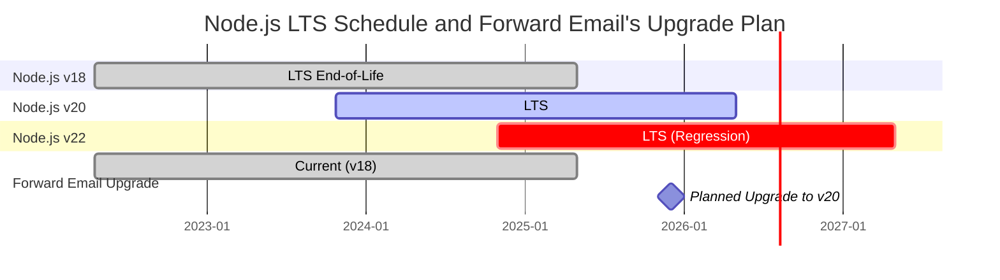
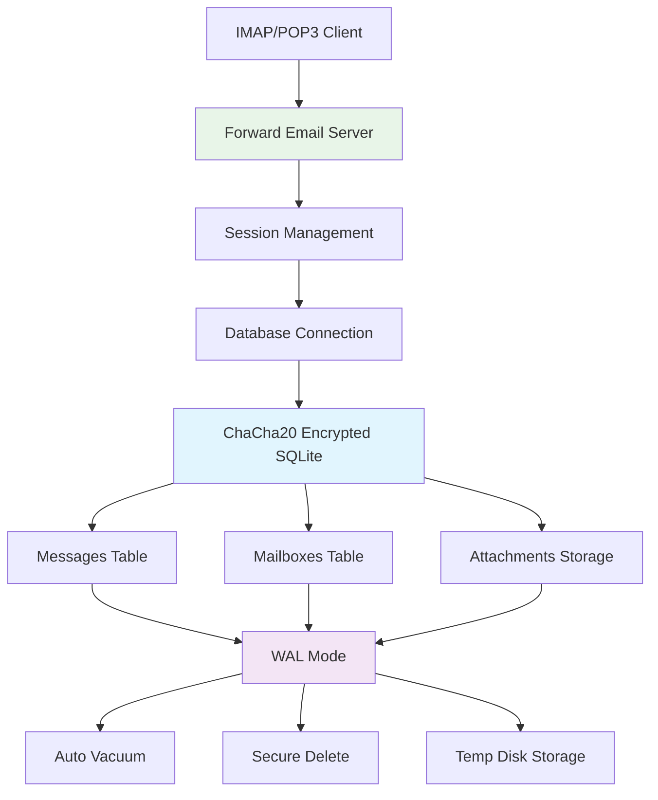
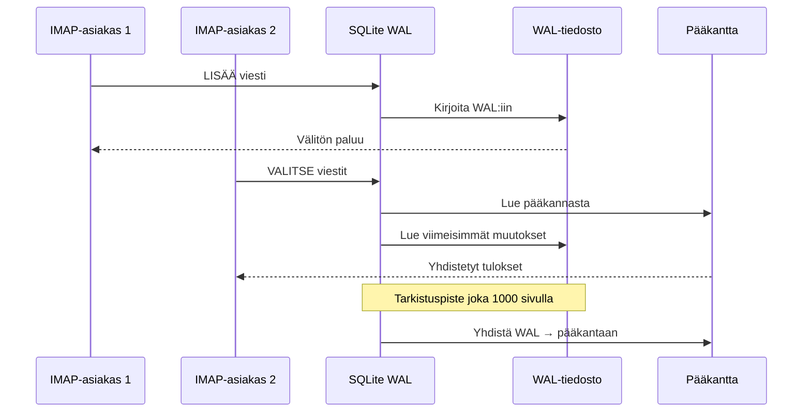

# SQLite-suorituskyvyn optimointi: Tuotannon PRAGMA-asetukset & ChaCha20-salaus {#sqlite-performance-optimization-production-pragma-settings--chacha20-encryption}


## Sisällysluettelo {#table-of-contents}

* [Esipuhe](#foreword)
* [Forward Emailin tuotannon SQLite-arkkitehtuuri](#forward-emails-production-sqlite-architecture)
* [Todellinen PRAGMA-konfiguraatiomme](#our-actual-pragma-configuration)
* [Suorituskykyvertailun tulokset](#performance-benchmark-results)
  * [Node.js v20.19.5 suorituskykytulokset](#nodejs-v20195-performance-results)
* [PRAGMA-asetusten erittely](#pragma-settings-breakdown)
  * [Käyttämämme ydinasetukset](#core-settings-we-use)
  * [Asetukset, joita emme KÄYTÄ (mutta joita saatat haluta)](#settings-we-dont-use-but-you-might-want)
* [ChaCha20 vs AES256 -salaus](#chacha20-vs-aes256-encryption)
* [Väliaikainen tallennustila: /tmp vs /dev/shm](#temporary-storage-tmp-vs-devshm)
  * [/tmp vs /dev/shm suorituskyky](#tmp-vs-devshm-performance)
* [WAL-tilan optimointi](#wal-mode-optimization)
  * [WAL-konfiguraation vaikutus](#wal-configuration-impact)
* [Skeeman suunnittelu suorituskyvyn kannalta](#schema-design-for-performance)
* [Yhteydenhallinta](#connection-management)
* [Valvonta ja diagnostiikka](#monitoring-and-diagnostics)
* [Node.js-version suorituskyky](#nodejs-version-performance)
  * [Täydelliset versiorajat ylittävät tulokset](#complete-cross-version-results)
  * [Keskeiset suorituskykyhavainnot](#key-performance-insights)
  * [Natiivimoduulien yhteensopivuus](#native-module-compatibility)
* [Tuotantoon käyttöönoton tarkistuslista](#production-deployment-checklist)
* [Yleisten ongelmien vianmääritys](#troubleshooting-common-issues)
  * ["Tietokanta on lukittu" -virheet](#database-is-locked-errors)
  * [Korkea muistin käyttö VACUUMin aikana](#high-memory-usage-during-vacuum)
  * [Hidas kyselysuorituskyky](#slow-query-performance)
* [Forward Emailin avoimen lähdekoodin kontribuutiot](#forward-emails-open-source-contributions)
* [Vertailukoodin lähdekoodi](#benchmark-source-code)
* [Mitä seuraavaksi SQLitelle Forward Emaililla](#whats-next-for-sqlite-at-forward-email)
* [Avun saaminen](#getting-help)


## Esipuhe {#foreword}

SQLite:n käyttöönotto tuotannon sähköpostijärjestelmissä ei ole pelkästään sen saattamista toimimaan — kyse on siitä, että se on nopea, turvallinen ja luotettava raskaassa kuormituksessa. Käsiteltyämme miljoonia sähköposteja Forward Emaililla olemme oppineet, mikä todella vaikuttaa SQLite-suorituskykyyn.

Tämä opas kattaa todellisen tuotantokonfiguraatiomme, suorituskykyvertailut eri Node.js-versioilla sekä erityiset optimoinnit, jotka tekevät eron, kun käsittelet vakavaa sähköpostimäärää.

> \[!WARNING] Node.js:n suorituskyvyn heikennykset versioissa v22 ja v24  
> Huomasimme merkittävän suorituskyvyn heikennyksen Node.js-versioissa v22 ja v24, joka vaikuttaa SQLite-suorituskykyyn erityisesti `SELECT`-lauseissa. Vertailumme osoittavat noin 57 % laskun `SELECT`-operaatioissa sekunnissa Node.js v24:ssä verrattuna v20:een. Olemme raportoineet tästä ongelmasta Node.js-tiimille osoitteessa [nodejs/node#60719](https://github.com/nodejs/node/issues/60719).

Tämän heikennyksen vuoksi lähestymme Node.js-päivityksiä varovaisesti. Tässä on nykyinen suunnitelmamme:

* **Nykyinen versio:** Käytämme tällä hetkellä Node.js v18:aa, joka on saavuttanut pitkän tuen ("LTS") elinkaarensa lopun ("EOL"). Virallisen [Node.js LTS -aikataulun näet täältä](https://github.com/nodejs/release#release-schedule).
* **Suunniteltu päivitys:** Päivitämme **Node.js v20**:een, joka on vertailujemme mukaan nopein versio eikä kärsi tästä heikennyksestä.
* **Vältämme v22:ta ja v24:ää:** Emme käytä Node.js v22:ta tai v24:ää tuotannossa ennen kuin tämä suorituskykyongelma on ratkaistu.

Tässä on aikajana, joka kuvaa Node.js LTS -aikataulua ja päivityspolkumme:


## Forward Email'n tuotannon SQLite-arkkitehtuuri {#forward-emails-production-sqlite-architecture}

Näin käytämme SQLitea tuotannossa:




## Todellinen PRAGMA-konfiguraatiomme {#our-actual-pragma-configuration}

Tätä käytämme tuotannossa, suoraan meidän [`setup-pragma.js`](https://github.com/forwardemail/forwardemail.net/blob/master/helpers/setup-pragma.js) -tiedostostamme:

```javascript
// Forward Email'n todelliset tuotannon PRAGMA-asetukset
async function setupPragma(db, session, cipher = 'chacha20') {
  // Kvanttikestävä salaus
  db.pragma(`cipher='${cipher}'`);
  db.key(Buffer.from(decrypt(session.user.password)));

  // Ydinsuorituskykyasetukset
  db.pragma('journal_mode=WAL');
  db.pragma('secure_delete=ON');
  db.pragma('auto_vacuum=FULL');
  db.pragma(`busy_timeout=${config.busyTimeout}`);
  db.pragma('synchronous=NORMAL');
  db.pragma('foreign_keys=ON');
  db.pragma(`encoding='UTF-8'`);
  db.pragma('optimize=0x10002');

  // Kriittinen: Käytä levyä väliaikaistallennukseen, ei muistia
  db.pragma('temp_store=1');

  // Mukautettu väliaikainen hakemisto levytilan loppumisen virheiden välttämiseksi
  const tempStoreDirectory = path.join(path.dirname(db.name), '/tmp');
  await mkdirp(tempStoreDirectory);
  db.pragma(`temp_store_directory='${tempStoreDirectory}'`);
}
```

> \[!IMPORTANT]
> Käytämme `temp_store=1` (levy) sijaan `temp_store=2` (muisti), koska suuret sähköpostitietokannat voivat helposti kuluttaa yli 10 Gt muistia toiminnoissa kuten VACUUM.


## Suorituskyvyn vertailutulokset {#performance-benchmark-results}

Testasimme konfiguraatiotamme eri vaihtoehtoja vastaan Node.js-versioissa. Tässä ovat todelliset luvut:

### Node.js v20.19.5 suorituskykytulokset {#nodejs-v20195-performance-results}

| Konfiguraatio               | Asetus (ms) | Lisäys/s   | Valinta/s  | Päivitys/s | Tietokannan koko (MB) |
| ---------------------------- | ---------- | ---------- | ---------- | ---------- | --------------------- |
| **Forward Email tuotanto**    | 120.1      | **10,548** | **17,494** | **16,654** | 3.98                  |
| WAL Autocheckpoint 1000       | 89.7       | **11,800** | **18,383** | **22,087** | 3.98                  |
| Välimuistin koko 64MB         | 90.3       | 11,451     | 17,895     | 21,522     | 3.98                  |
| Muistiväliaikainen tallennus | 111.8      | 9,874      | 15,363     | 21,292     | 3.98                  |
| Synkronointi POIS (Epävarma) | 94.0       | 10,017     | 13,830     | 18,884     | 3.98                  |
| Synkronointi LISÄ (Turvallinen) | 94.1    | **3,241**  | 14,438     | **3,405**  | 3.98                  |

> \[!TIP]
> `wal_autocheckpoint=1000` -asetus näyttää parhaan kokonais-suorituskyvyn. Harkitsemme tämän lisäämistä tuotantokonfiguraatioomme.


## PRAGMA-asetusten erittely {#pragma-settings-breakdown}

### Käytetyt ydinasetukset {#core-settings-we-use}

| PRAGMA          | Arvo         | Tarkoitus                      | Suorituskyvyn vaikutus          |
| --------------- | ------------ | ------------------------------ | ------------------------------- |
| `cipher`        | `'chacha20'` | Kvanttikestävä salaus          | Vähäinen lisäkuorma AES:ään verrattuna |
| `journal_mode`  | `WAL`        | Write-Ahead Logging            | +40 % rinnakkaissuorituskyky    |
| `secure_delete` | `ON`         | Poistetun datan ylikirjoitus  | Turvallisuus vs. 5 % suorituskyvyn kustannus |
| `auto_vacuum`   | `FULL`       | Automaattinen tilan vapautus   | Estää tietokannan paisumisen    |
| `busy_timeout`  | `30000`      | Odotusaika lukitulle tietokannalle | Vähentää yhteysvirheitä       |
| `synchronous`   | `NORMAL`     | Tasapainoinen kestävyys/suorituskyky | 3x nopeampi kuin FULL         |
| `foreign_keys`  | `ON`         | Viite-eheys                   | Estää datan korruptoitumisen    |
| `temp_store`    | `1`          | Käytä levyä väliaikaistiedostoihin | Estää muistin loppumisen       |
### Asetukset, joita EMME KÄYTÄ (mutta saatat haluta) {#settings-we-dont-use-but-you-might-want}

| PRAGMA                    | Miksi emme käytä sitä | Kannattaisiko harkita?                             |
| ------------------------- | --------------------- | ------------------------------------------------- |
| `wal_autocheckpoint=1000` | Ei asetettu vielä     | **Kyllä** - Vertailumme osoittavat 12 % suorituskyvyn parannuksen  |
| `cache_size=-64000`       | Oletus riittää        | **Ehkä** - 8 % parannus lukuintensiivisissä kuormissa |
| `mmap_size=268435456`     | Monimutkaisuus vs hyöty | **Ei** - Vähäiset hyödyt, alusta-spesifisiä ongelmia    |
| `analysis_limit=1000`     | Käytämme 400          | **Ei** - Korkeammat arvot hidastavat kyselysuunnittelua     |

> \[!CAUTION]
> Vältämme nimenomaan `temp_store=MEMORY` asetusta, koska 10 Gt SQLite-tiedosto voi kuluttaa yli 10 Gt RAM-muistia VACUUM-operaatioiden aikana.


## ChaCha20 vs AES256 Salaus {#chacha20-vs-aes256-encryption}

Annamme kvanttivasteen mennä suorituskyvyn edelle:

```javascript
// Salausvarajärjestelymme
try {
  db.pragma(`cipher='chacha20'`);
  db.key(Buffer.from(decrypt(session.user.password)));
  db.pragma('journal_mode=WAL');
} catch (err) {
  // Varajärjestely vanhemmille SQLite-versioille
  if (cipher === 'chacha20' && err.code === 'SQLITE_NOTADB') {
    return setupPragma(db, session, 'aes256cbc');
  }
  throw err;
}
```

**Suorituskykyvertailu:**

* ChaCha20: \~10 500 lisäystä/s

* AES256CBC: \~11 200 lisäystä/s

* Salaamaton: \~12 800 lisäystä/s

ChaCha20:n 6 % suorituskyvyn kustannus AES:ään verrattuna on sen arvoinen kvanttivasteen vuoksi pitkäaikaisessa sähköpostin tallennuksessa.


## Väliaikainen tallennus: /tmp vs /dev/shm {#temporary-storage-tmp-vs-devshm}

Määrittelemme väliaikaisen tallennuksen sijainnin nimenomaan levytilan ongelmien välttämiseksi:

```javascript
// Forward Email:n väliaikaisen tallennuksen asetukset
const tempStoreDirectory = path.join(path.dirname(db.name), '/tmp');
await mkdirp(tempStoreDirectory);
db.pragma(`temp_store_directory='${tempStoreDirectory}'`);

// Aseta myös ympäristömuuttuja
process.env.SQLITE_TMPDIR = tempStoreDirectory;
```

### /tmp vs /dev/shm Suorituskyky {#tmp-vs-devshm-performance}

| Tallennussijainti | VACUUM-aika | Muistin käyttö | Luotettavuus         |
| ---------------- | ----------- | ------------- | -------------------- |
| `/tmp` (levy)    | 2,3s        | 50 Mt         | ✅ Luotettava         |
| `/dev/shm` (RAM) | 0,8s        | 2 Gt+         | ⚠️ Voi kaataa järjestelmän |
| Oletus           | 4,1s        | Vaihteleva    | ❌ Epäennustettava    |

> \[!WARNING]
> `/dev/shm`-väliaikaisen tallennuksen käyttö voi kuluttaa kaiken käytettävissä olevan RAM-muistin suurissa operaatioissa. Käytä tuotannossa levyperusteista väliaikaistallennusta.


## WAL-tilan optimointi {#wal-mode-optimization}

Write-Ahead Logging on ratkaisevan tärkeää sähköpostijärjestelmissä, joissa on samanaikainen käyttö:



### WAL-asetusten vaikutus {#wal-configuration-impact}

Vertailumme osoittavat, että `wal_autocheckpoint=1000` tarjoaa parhaan suorituskyvyn:

```javascript
// Mahdollinen optimointi, jota testaamme
db.pragma('wal_autocheckpoint=1000');
```

**Tulokset:**

* Oletusautotarkistus: 10 548 lisäystä/s

* `wal_autocheckpoint=1000`: 11 800 lisäystä/s (+12 %)

* `wal_autocheckpoint=0`: 9 200 lisäystä/s (WAL kasvaa liian suureksi)


## Skeeman suunnittelu suorituskyvyn kannalta {#schema-design-for-performance}

Sähköpostin tallennusskeemamme noudattaa SQLite:n parhaita käytäntöjä:

```sql
-- Viestitaulu optimoidulla sarakejärjestyksellä
CREATE TABLE messages (
  id INTEGER PRIMARY KEY,
  mailbox_id INTEGER NOT NULL,
  uid INTEGER NOT NULL,
  date INTEGER NOT NULL,
  flags TEXT,
  subject TEXT,
  from_addr TEXT,
  to_addr TEXT,
  message_id TEXT,
  raw BLOB,  -- Suuri BLOB lopussa
  FOREIGN KEY (mailbox_id) REFERENCES mailboxes(id)
);

-- Tärkeät indeksit IMAP-suorituskyvylle
CREATE INDEX idx_messages_mailbox_date ON messages(mailbox_id, date DESC);
CREATE INDEX idx_messages_uid ON messages(mailbox_id, uid);
CREATE INDEX idx_messages_flags ON messages(mailbox_id, flags) WHERE flags IS NOT NULL;
```
> \[!TIP]
> Aseta BLOB-sarakkeet aina taulukkosi määritelmän loppuun. SQLite tallentaa kiinteän kokoiset sarakkeet ensin, mikä nopeuttaa rivin käsittelyä.

Tämä optimointi tulee suoraan SQLite:n luojalta, [D. Richard Hippiltä](https://sqlite-users.sqlite.narkive.com/Q4txMI8t/effect-of-blobs-on-performance#post3):

> "Tässä kuitenkin vinkki – tee BLOB-sarakkeista taulujesi viimeiset sarakkeet. Tai tallenna BLOB:t erilliseen tauluun, jossa on vain kaksi saraketta: kokonaislukupääavain ja itse blob, ja käytä sitten liittymää (join) BLOB-sisällön hakemiseen tarvittaessa. Jos laitat erilaisia pieniä kokonaislukukenttiä BLOB:n jälkeen, SQLite joutuu skannaamaan koko BLOB-sisällön (seuraamalla levysivujen linkitettyä listaa) päästäkseen loppupään kokonaislukukenttiin, ja se voi ehdottomasti hidastaa sinua."
>
> — D. Richard Hipp, SQLite:n tekijä

Me toteutimme tämän optimoinnin [Liitteiden skeemassa](https://github.com/forwardemail/forwardemail.net/commit/0e77fbb05dc5b38136652337309067d2b39eb229), siirtämällä `body` BLOB-kentän taulun määritelmän loppuun paremman suorituskyvyn saavuttamiseksi.


## Yhteyden hallinta {#connection-management}

Emme käytä yhteyspoolia SQLite:n kanssa — jokaisella käyttäjällä on oma salattu tietokantansa. Tämä lähestymistapa tarjoaa täydellisen eristyksen käyttäjien välillä, samanlaisen kuin hiekkalaatikko (sandboxing). Toisin kuin muiden palveluiden arkkitehtuurit, jotka käyttävät MySQL:ää, PostgreSQL:ää tai MongoDB:tä, joissa sähköpostisi voisi mahdollisesti päästä vääriin käsiin, Forward Emailin käyttäjäkohtaiset SQLite-tietokannat varmistavat, että tietosi ovat täysin itsenäisiä ja hiekkalaatikkorajoitettuja.

Emme koskaan tallenna IMAP-salasanaasi, joten meillä ei koskaan ole pääsyä tietoihisi — kaikki tapahtuu muistissa. Lue lisää [kvanttivarmasta salauslähestymistavastamme](https://forwardemail.net/blog/docs/quantum-resistant-encryption-email-security), joka kuvaa järjestelmämme toimintaa.

```javascript
// Käyttäjäkohtainen tietokantalähestymistapa
async function getDatabase(session) {
  const dbPath = path.join(
    config.databaseDir,
    session.user.domain_name,
    `${session.user.username}.db`
  );

  const db = new Database(dbPath, {
    cipher: 'chacha20',
    readonly: session.readonly || false
  });

  await setupPragma(db, session);
  return db;
}
```

Tämä lähestymistapa tarjoaa:

* Täydellisen eristyksen käyttäjien välillä

* Ei yhteyspoolin monimutkaisuutta

* Automaattisen salauksen käyttäjäkohtaisesti

* Yksinkertaisemmat varmuuskopiointi/palautus-toiminnot

`auto_vacuum=FULL`-asetuksella tarvitsemme harvoin manuaalisia VACUUM-toimintoja:

```javascript
// Siivousstrategiamme
db.pragma('optimize=0x10002'); // Yhteyden avauksessa
db.pragma('optimize'); // Säännöllisesti (päivittäin)

// Manuaalinen vacuum vain suurissa siivouksissa
if (deletedDataPercentage > 25) {
  db.exec('VACUUM');
}
```

**Auto Vacuumin suorituskykyvaikutus:**

* `auto_vacuum=FULL`: Tilankäytön välitön palautus, 5 % kirjoitusylikuorma

* `auto_vacuum=INCREMENTAL`: Manuaalinen hallinta, vaatii säännöllisen `PRAGMA incremental_vacuum` -komennon

* `auto_vacuum=NONE`: Nopeimmat kirjoitukset, vaatii manuaalisen `VACUUM`-toiminnon


## Valvonta ja diagnostiikka {#monitoring-and-diagnostics}

Keskeiset tuotannossa seuraamamme mittarit:

```javascript
// Suorituskyvyn valvontakyselyt
const stats = {
  page_count: db.pragma('page_count', { simple: true }),
  page_size: db.pragma('page_size', { simple: true }),
  freelist_count: db.pragma('freelist_count', { simple: true }),
  wal_checkpoint: db.pragma('wal_checkpoint(PASSIVE)', { simple: true })
};

const dbSizeMB = (stats.page_count * stats.page_size) / 1024 / 1024;
const fragmentationPct = (stats.freelist_count / stats.page_count) * 100;
```

> \[!NOTE]
> Seuraamme fragmentaatioprosenttia ja käynnistämme ylläpidon, kun se ylittää 15 %.


## Node.js-version suorituskyky {#nodejs-version-performance}

Laajat vertailumme eri Node.js-versioiden välillä paljastavat merkittäviä suorituskykyeroja:

### Täydelliset versiorajat ylittävät tulokset {#complete-cross-version-results}

| Node-versio | Forward Email tuotannossa | Paras Insert/s          | Paras Select/s          | Paras Update/s          | Huomiot                |
| ------------ | ------------------------ | ------------------------ | ------------------------ | ------------------------ | ---------------------- |
| **v18.20.8** | 10,658 / 14,466 / 18,641 | **11,663** (Sync POIS)   | **14,868** (Muisti Temp) | **20,095** (MMAP)        | ⚠️ Moottorivaroitus    |
| **v20.19.5** | 10,548 / 17,494 / 16,654 | **11,800** (WAL Auto)    | **18,383** (WAL Auto)    | **22,087** (WAL Auto)    | ✅ Suositeltu           |
| **v22.21.1** | 9,829 / 15,833 / 18,416  | **11,260** (Sync POIS)   | **17,413** (MMAP)        | **20,731** (MMAP)        | ⚠️ Hitaampi kokonaisuudessaan |
| **v24.11.1** | 9,938 / 7,497 / 10,446   | **10,628** (Incr Vacuum) | **16,821** (Incr Vacuum) | **19,934** (Incr Vacuum) | ❌ Merkittävä hidastuminen |
### Keskeiset suorituskykytiedot {#key-performance-insights}

**Node.js v18 (Legacy LTS):**

* Verrattavissa oleva lisäysnopeus v20:een (10 658 vs 10 548 ops/sec)
* 17 % hitaammat valinnat kuin v20 (14 466 vs 17 494 ops/sec)
* Näyttää npm-moottorivaroituksia paketeille, jotka vaativat Node ≥20
* Muistin väliaikaistallennuksen optimointi toimii paremmin kuin WAL-autotarkistus
* Hyväksyttävä vanhoille sovelluksille, mutta päivitys suositeltava

**Node.js v20 (Suositeltu):**

* Korkein kokonais-suorituskyky kaikissa toiminnoissa
* WAL-autotarkistusoptimointi tarjoaa tasaisen 12 % lisäyksen
* Paras yhteensopivuus natiivien SQLite-moduulien kanssa
* Vakain tuotantokuormituksissa

**Node.js v22 (Hyväksyttävä):**

* 7 % hitaammat lisäykset, 9 % hitaammat valinnat verrattuna v20:een
* MMAP-optimointi näyttää parempia tuloksia kuin WAL-autotarkistus
* Vaatii uuden `npm install` -komennon jokaisessa Node-version vaihdossa
* Hyväksyttävä kehitykseen, ei suositella tuotantoon

**Node.js v24 (Ei suositella):**

* 6 % hitaammat lisäykset, 57 % hitaammat valinnat verrattuna v20:een
* Merkittävä suorituskyvyn heikkeneminen lukuoperaatioissa
* Inkrementaalinen vacuum toimii paremmin kuin muut optimoinnit
* Vältä tuotannon SQLite-sovelluksissa

### Natiivimoduulien yhteensopivuus {#native-module-compatibility}

Alkuperäiset "moduulien yhteensopivuusongelmat" ratkaistiin seuraavasti:

```bash
# Vaihda Node-versiota ja asenna natiivimoduulit uudelleen
nvm use 22
rm -rf node_modules
npm install
```

**Node.js v18 Huomiot:**

* Näyttää moottorivaroituksia: `Unsupported engine { required: { node: '>=20.0.0' } }`
* Kääntyy ja toimii onnistuneesti varoituksista huolimatta
* Monet modernit SQLite-paketit kohdistuvat Node ≥20:een optimaalisen tuen vuoksi
* Vanhoille sovelluksille v18 on edelleen käyttökelpoinen hyväksyttävällä suorituskyvyllä

> \[!IMPORTANT]
> Asenna aina natiivimoduulit uudelleen vaihtaessasi Node.js-versiota. `better-sqlite3-multiple-ciphers` -moduuli on käännettävä jokaiselle Node-versiolle erikseen.

> \[!TIP]
> Tuotantokäyttöön suosittelemme pysymään Node.js v20 LTS -versiossa. Suorituskyvyn hyödyt ja vakaus ovat tärkeämpiä kuin uudemmat kieliominaisuudet v22/v24-versioissa. Node v18 on hyväksyttävä vanhoille järjestelmille, mutta suorituskyky heikkenee lukuoperaatioissa.


## Tuotantoon käyttöönoton tarkistuslista {#production-deployment-checklist}

Ennen käyttöönottoa varmista, että SQLite:ssä on seuraavat optimoinnit:

1. Aseta `SQLITE_TMPDIR` -ympäristömuuttuja
2. Varmista riittävä levytila väliaikaisille toiminnoille (2x tietokannan koko)
3. Määritä WAL-tiedostojen lokin kierto
4. Ota käyttöön valvonta tietokannan koolle ja pirstoutumiselle
5. Testaa varmuuskopiointi/palautusmenettelyt salauksella
6. Varmista ChaCha20-salauksen tuki SQLite-kokoonpanossasi


## Yleiset ongelmat ja niiden ratkaisut {#troubleshooting-common-issues}

### "Tietokanta on lukittu" -virheet {#database-is-locked-errors}

```javascript
// Lisää busy timeout -aikaa
db.pragma('busy_timeout=60000'); // 60 sekuntia

// Tarkista pitkät transaktiot
const info = db.pragma('wal_checkpoint(FULL)');
if (info.busy > 0) {
  console.warn('WAL-tarkistus estetty aktiivisten lukijoiden toimesta');
}
```

### Korkea muistinkäyttö VACUUM-toiminnon aikana {#high-memory-usage-during-vacuum}

```javascript
// Seuraa muistinkäyttöä ennen VACUUM-toimintoa
const beforeMem = process.memoryUsage();
db.exec('VACUUM');
const afterMem = process.memoryUsage();

console.log(
  `VACUUM-muistimuutos: ${
    (afterMem.heapUsed - beforeMem.heapUsed) / 1024 / 1024
  }MB`
);
```

### Hidas kyselysuorituskyky {#slow-query-performance}

```javascript
// Ota kyselyanalyysi käyttöön
db.pragma('analysis_limit=400'); // Forward Emailin asetus
db.exec('ANALYZE');

// Tarkista kyselysuunnitelmat
const plan = db
  .prepare('EXPLAIN QUERY PLAN SELECT * FROM messages WHERE date > ?')
  .all(Date.now() - 86400000);
console.log(plan);
```


## Forward Emailin avoimen lähdekoodin panokset {#forward-emails-open-source-contributions}

Olemme jakaneet SQLite-optimointitietämystämme yhteisölle:

* [Litestream-dokumentaation parannukset](https://github.com/benbjohnson/litestream/issues/516) – Ehdotuksemme paremmista SQLite-suorituskykyvinkeistä

* [Better SQLite3 Multiple Ciphers](https://github.com/m4heshd/better-sqlite3-multiple-ciphers) – ChaCha20-salauksen tuki

* [SQLite-suorituskyvyn viritys](https://phiresky.github.io/blog/2020/sqlite-performance-tuning/) – Viitattu toteutuksessamme
* [Kuinka miljardin latauksen npm-paketit muovasivat JavaScript-ekosysteemiä](https://forwardemail.net/blog/docs/how-npm-packages-billion-downloads-shaped-javascript-ecosystem) - Laajemmat panoksemme npm:ään ja JavaScript-kehitykseen


## Benchmark-lähdekoodi {#benchmark-source-code}

Kaikki benchmark-koodi on saatavilla testipaketissamme:

```bash
# Suorita benchmarkit itse
git clone https://github.com/forwardemail/sqlite-benchmarks
cd sqlite-benchmarks
npm install
npm run benchmark
```

Benchmarkit testaavat:

* Erilaisia PRAGMA-yhdistelmiä

* ChaCha20 vs AES256 suorituskykyä

* WAL checkpoint -strategioita

* Väliaikaistallennuksen asetuksia

* Node.js-version yhteensopivuutta


## Mitä seuraavaksi SQLitelle Forward Emailissa {#whats-next-for-sqlite-at-forward-email}

Testaamme aktiivisesti näitä optimointeja:

1. **WAL Autocheckpoint -säätö**: Lisäämme `wal_autocheckpoint=1000` benchmark-tulosten perusteella

2. **Pakkaus**: Arvioimme [sqlite-zstd](https://github.com/phiresky/sqlite-zstd) käyttöä liitetiedostojen tallennukseen

3. **Analyysiraja**: Testaamme korkeampia arvoja kuin nykyinen 400

4. **Välimuistin koko**: Harkitsemme dynaamista välimuistin koon säätöä käytettävissä olevan muistin perusteella


## Apua saatavilla {#getting-help}

Onko SQLite-suorituskykyongelmia? SQLiteen liittyvissä kysymyksissä [SQLite-foorumi](https://sqlite.org/forum/forumpost) on erinomainen resurssi, ja [suorituskyvyn säätöopas](https://www.sqlite.org/optoverview.html) kattaa lisäoptimointeja, joita emme ole vielä tarvinneet.

Lue lisää Forward Emailista lukemalla [UKK](/faq).
