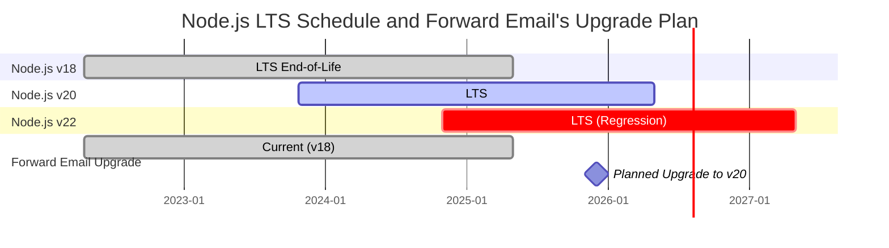
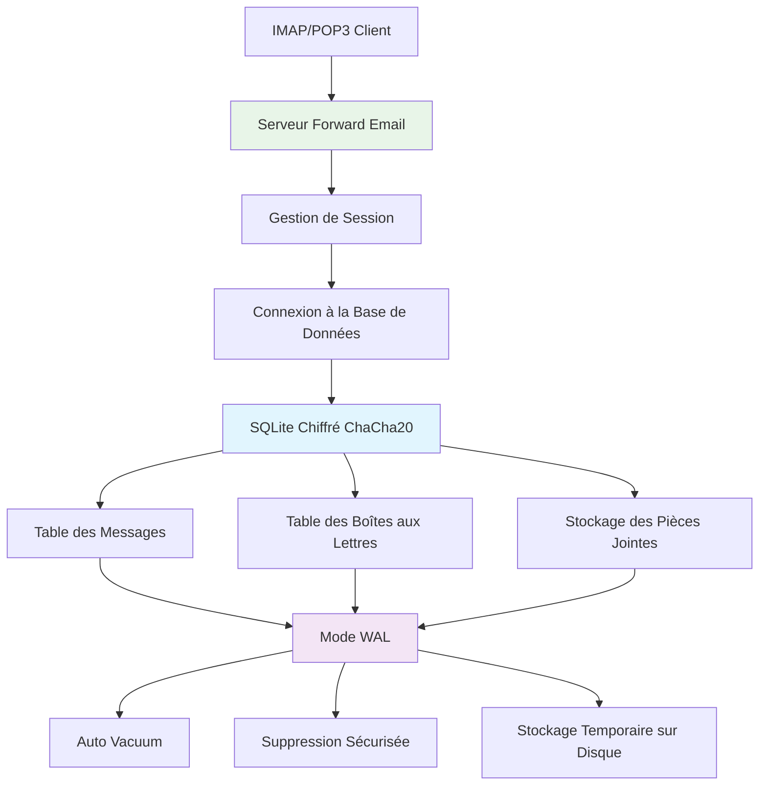
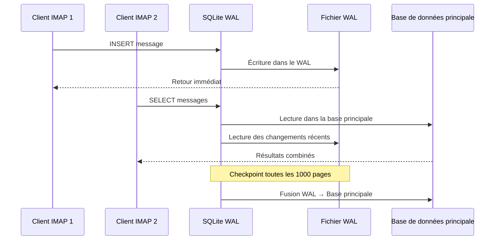

# Optimisation des performances SQLite : Paramètres PRAGMA en production & chiffrement ChaCha20 {#sqlite-performance-optimization-production-pragma-settings--chacha20-encryption}


## Table des matières {#table-of-contents}

* [Avant-propos](#foreword)
* [Architecture SQLite en production chez Forward Email](#forward-emails-production-sqlite-architecture)
* [Notre configuration PRAGMA actuelle](#our-actual-pragma-configuration)
* [Résultats des benchmarks de performance](#performance-benchmark-results)
  * [Résultats de performance Node.js v20.19.5](#nodejs-v20195-performance-results)
* [Analyse des paramètres PRAGMA](#pragma-settings-breakdown)
  * [Paramètres principaux que nous utilisons](#core-settings-we-use)
  * [Paramètres que nous N'UTILISONS PAS (mais que vous pourriez vouloir)](#settings-we-dont-use-but-you-might-want)
* [Chiffrement ChaCha20 vs AES256](#chacha20-vs-aes256-encryption)
* [Stockage temporaire : /tmp vs /dev/shm](#temporary-storage-tmp-vs-devshm)
  * [Performance /tmp vs /dev/shm](#tmp-vs-devshm-performance)
* [Optimisation du mode WAL](#wal-mode-optimization)
  * [Impact de la configuration WAL](#wal-configuration-impact)
* [Conception du schéma pour la performance](#schema-design-for-performance)
* [Gestion des connexions](#connection-management)
* [Surveillance et diagnostics](#monitoring-and-diagnostics)
* [Performance selon la version de Node.js](#nodejs-version-performance)
  * [Résultats complets cross-version](#complete-cross-version-results)
  * [Principaux enseignements sur la performance](#key-performance-insights)
  * [Compatibilité des modules natifs](#native-module-compatibility)
* [Checklist de déploiement en production](#production-deployment-checklist)
* [Dépannage des problèmes courants](#troubleshooting-common-issues)
  * [Erreurs "Database is locked"](#database-is-locked-errors)
  * [Utilisation élevée de la mémoire pendant VACUUM](#high-memory-usage-during-vacuum)
  * [Performance lente des requêtes](#slow-query-performance)
* [Contributions open source de Forward Email](#forward-emails-open-source-contributions)
* [Code source du benchmark](#benchmark-source-code)
* [L'avenir de SQLite chez Forward Email](#whats-next-for-sqlite-at-forward-email)
* [Obtenir de l'aide](#getting-help)


## Avant-propos {#foreword}

Configurer SQLite pour des systèmes de messagerie en production ne consiste pas seulement à le faire fonctionner — il s'agit de le rendre rapide, sécurisé et fiable sous forte charge. Après avoir traité des millions d'emails chez Forward Email, nous avons appris ce qui compte réellement pour la performance de SQLite.

Ce guide couvre notre configuration réelle en production, les résultats des benchmarks sur différentes versions de Node.js, et les optimisations spécifiques qui font la différence lorsque vous gérez un volume important d'emails.

> \[!WARNING] Régressions de performance Node.js dans les versions v22 et v24  
> Nous avons découvert une régression significative des performances dans les versions Node.js v22 et v24 qui impacte la performance de SQLite, en particulier pour les requêtes `SELECT`. Nos benchmarks montrent une baisse d'environ 57 % des opérations `SELECT` par seconde sous Node.js v24 comparé à v20. Nous avons signalé ce problème à l'équipe Node.js dans [nodejs/node#60719](https://github.com/nodejs/node/issues/60719).

En raison de cette régression, nous adoptons une approche prudente pour nos mises à jour Node.js. Voici notre plan actuel :

* **Version actuelle :** Nous utilisons actuellement Node.js v18, qui a atteint sa fin de vie ("EOL") pour le support à long terme ("LTS"). Vous pouvez consulter le [planning officiel des LTS Node.js ici](https://github.com/nodejs/release#release-schedule).
* **Mise à jour prévue :** Nous passerons à **Node.js v20**, qui est la version la plus rapide selon nos benchmarks et n'est pas affectée par cette régression.
* **Éviter v22 et v24 :** Nous n'utiliserons pas Node.js v22 ou v24 en production tant que ce problème de performance ne sera pas résolu.

Voici un calendrier illustrant le planning LTS de Node.js et notre trajectoire de mise à jour :


## Architecture SQLite en Production de Forward Email {#forward-emails-production-sqlite-architecture}

Voici comment nous utilisons réellement SQLite en production :




## Notre Configuration PRAGMA Réelle {#our-actual-pragma-configuration}

Voici ce que nous utilisons réellement en production, directement depuis notre [`setup-pragma.js`](https://github.com/forwardemail/forwardemail.net/blob/master/helpers/setup-pragma.js) :

```javascript
// Paramètres PRAGMA réels en production de Forward Email
async function setupPragma(db, session, cipher = 'chacha20') {
  // Chiffrement résistant quantique
  db.pragma(`cipher='${cipher}'`);
  db.key(Buffer.from(decrypt(session.user.password)));

  // Paramètres de performance principaux
  db.pragma('journal_mode=WAL');
  db.pragma('secure_delete=ON');
  db.pragma('auto_vacuum=FULL');
  db.pragma(`busy_timeout=${config.busyTimeout}`);
  db.pragma('synchronous=NORMAL');
  db.pragma('foreign_keys=ON');
  db.pragma(`encoding='UTF-8'`);
  db.pragma('optimize=0x10002');

  // Critique : utiliser le disque pour le stockage temporaire, pas la mémoire
  db.pragma('temp_store=1');

  // Répertoire temporaire personnalisé pour éviter les erreurs de disque plein
  const tempStoreDirectory = path.join(path.dirname(db.name), '/tmp');
  await mkdirp(tempStoreDirectory);
  db.pragma(`temp_store_directory='${tempStoreDirectory}'`);
}
```

> \[!IMPORTANT]
> Nous utilisons `temp_store=1` (disque) au lieu de `temp_store=2` (mémoire) car les grandes bases de données d’emails peuvent facilement consommer plus de 10 Go de mémoire lors d’opérations comme VACUUM.


## Résultats des Tests de Performance {#performance-benchmark-results}

Nous avons testé notre configuration face à diverses alternatives sur différentes versions de Node.js. Voici les chiffres réels :

### Résultats de Performance Node.js v20.19.5 {#nodejs-v20195-performance-results}

| Configuration                | Installation (ms) | Insertions/sec | Sélections/sec | Mises à jour/sec | Taille BD (Mo) |
| ---------------------------- | ---------------- | -------------- | -------------- | ---------------- | -------------- |
| **Production Forward Email** | 120.1            | **10 548**     | **17 494**     | **16 654**       | 3.98           |
| WAL Autocheckpoint 1000      | 89.7             | **11 800**     | **18 383**     | **22 087**       | 3.98           |
| Taille Cache 64Mo            | 90.3             | 11 451         | 17 895         | 21 522           | 3.98           |
| Stockage Temporaire Mémoire  | 111.8            | 9 874          | 15 363         | 21 292           | 3.98           |
| Synchrone OFF (Non sûr)      | 94.0             | 10 017         | 13 830         | 18 884           | 3.98           |
| Synchrone EXTRA (Sûr)        | 94.1             | **3 241**      | 14 438         | **3 405**        | 3.98           |

> \[!TIP]
> Le paramètre `wal_autocheckpoint=1000` offre la meilleure performance globale. Nous envisageons de l’ajouter à notre configuration de production.


## Détail des Paramètres PRAGMA {#pragma-settings-breakdown}

### Paramètres Principaux que Nous Utilisons {#core-settings-we-use}

| PRAGMA          | Valeur       | But                             | Impact sur la Performance        |
| --------------- | ------------ | ------------------------------- | ------------------------------- |
| `cipher`        | `'chacha20'` | Chiffrement résistant quantique | Surcharge minimale vs AES        |
| `journal_mode`  | `WAL`        | Journalisation anticipée         | +40% de performance concurrente |
| `secure_delete` | `ON`         | Écraser les données supprimées  | Sécurité vs coût de 5% en perf.  |
| `auto_vacuum`   | `FULL`       | Recyclage automatique d’espace  | Prévient le gonflement de la BD  |
| `busy_timeout`  | `30000`      | Temps d’attente base verrouillée | Réduit les échecs de connexion   |
| `synchronous`   | `NORMAL`     | Durabilité/performance équilibrée | 3x plus rapide que FULL          |
| `foreign_keys`  | `ON`         | Intégrité référentielle          | Prévient la corruption des données |
| `temp_store`    | `1`          | Utiliser le disque pour fichiers temporaires | Prévient l’épuisement mémoire    |
### Paramètres que NOUS N'utilisons PAS (Mais que vous pourriez vouloir) {#settings-we-dont-use-but-you-might-want}

| PRAGMA                    | Pourquoi nous ne l'utilisons pas | Devriez-vous le considérer ?                      |
| ------------------------- | -------------------------------- | ------------------------------------------------ |
| `wal_autocheckpoint=1000` | Pas encore défini                 | **Oui** - Nos benchmarks montrent un gain de performance de 12% |
| `cache_size=-64000`       | La valeur par défaut suffit       | **Peut-être** - Amélioration de 8% pour les charges de travail en lecture intensive |
| `mmap_size=268435456`     | Complexité vs bénéfice            | **Non** - Gains minimes, problèmes spécifiques à la plateforme |
| `analysis_limit=1000`     | Nous utilisons 400                | **Non** - Des valeurs plus élevées ralentissent la planification des requêtes |

> \[!CAUTION]
> Nous évitons spécifiquement `temp_store=MEMORY` car un fichier SQLite de 10 Go peut consommer plus de 10 Go de RAM lors des opérations VACUUM.


## Chiffrement ChaCha20 vs AES256 {#chacha20-vs-aes256-encryption}

Nous privilégions la résistance quantique plutôt que la performance brute :

```javascript
// Notre stratégie de repli pour le chiffrement
try {
  db.pragma(`cipher='chacha20'`);
  db.key(Buffer.from(decrypt(session.user.password)));
  db.pragma('journal_mode=WAL');
} catch (err) {
  // Repli pour les versions plus anciennes de SQLite
  if (cipher === 'chacha20' && err.code === 'SQLITE_NOTADB') {
    return setupPragma(db, session, 'aes256cbc');
  }
  throw err;
}
```

**Comparaison des performances :**

* ChaCha20 : \~10 500 insertions/sec

* AES256CBC : \~11 200 insertions/sec

* Non chiffré : \~12 800 insertions/sec

Le coût de performance de 6% de ChaCha20 par rapport à AES vaut la résistance quantique pour le stockage d'emails à long terme.


## Stockage temporaire : /tmp vs /dev/shm {#temporary-storage-tmp-vs-devshm}

Nous configurons explicitement l'emplacement du stockage temporaire pour éviter les problèmes d'espace disque :

```javascript
// Configuration du stockage temporaire de Forward Email
const tempStoreDirectory = path.join(path.dirname(db.name), '/tmp');
await mkdirp(tempStoreDirectory);
db.pragma(`temp_store_directory='${tempStoreDirectory}'`);

// Définir aussi la variable d'environnement
process.env.SQLITE_TMPDIR = tempStoreDirectory;
```

### Performance /tmp vs /dev/shm {#tmp-vs-devshm-performance}

| Emplacement de stockage | Temps VACUUM | Utilisation mémoire | Fiabilité           |
| ----------------------- | ------------ | ------------------- | ------------------- |
| `/tmp` (disque)         | 2,3s         | 50Mo                | ✅ Fiable            |
| `/dev/shm` (RAM)        | 0,8s         | 2Go+                | ⚠️ Peut faire planter le système |
| Par défaut              | 4,1s         | Variable            | ❌ Imprévisible      |

> \[!WARNING]
> Utiliser `/dev/shm` pour le stockage temporaire peut consommer toute la RAM disponible lors de grosses opérations. Préférez le stockage temporaire sur disque en production.


## Optimisation du mode WAL {#wal-mode-optimization}

Le Write-Ahead Logging est crucial pour les systèmes de messagerie avec accès concurrent :



### Impact de la configuration WAL {#wal-configuration-impact}

Nos benchmarks montrent que `wal_autocheckpoint=1000` offre la meilleure performance :

```javascript
// Optimisation potentielle que nous testons
db.pragma('wal_autocheckpoint=1000');
```

**Résultats :**

* Autocheckpoint par défaut : 10 548 insertions/sec

* `wal_autocheckpoint=1000` : 11 800 insertions/sec (+12%)

* `wal_autocheckpoint=0` : 9 200 insertions/sec (le WAL devient trop volumineux)


## Conception du schéma pour la performance {#schema-design-for-performance}

Notre schéma de stockage des emails suit les meilleures pratiques SQLite :

```sql
-- Table messages avec ordre de colonnes optimisé
CREATE TABLE messages (
  id INTEGER PRIMARY KEY,
  mailbox_id INTEGER NOT NULL,
  uid INTEGER NOT NULL,
  date INTEGER NOT NULL,
  flags TEXT,
  subject TEXT,
  from_addr TEXT,
  to_addr TEXT,
  message_id TEXT,
  raw BLOB,  -- Gros BLOB en fin de table
  FOREIGN KEY (mailbox_id) REFERENCES mailboxes(id)
);

-- Index critiques pour la performance IMAP
CREATE INDEX idx_messages_mailbox_date ON messages(mailbox_id, date DESC);
CREATE INDEX idx_messages_uid ON messages(mailbox_id, uid);
CREATE INDEX idx_messages_flags ON messages(mailbox_id, flags) WHERE flags IS NOT NULL;
```
> \[!TIP]
> Placez toujours les colonnes BLOB à la fin de la définition de votre table. SQLite stocke d'abord les colonnes de taille fixe, ce qui accélère l'accès aux lignes.

Cette optimisation vient directement du créateur de SQLite, [D. Richard Hipp](https://sqlite-users.sqlite.narkive.com/Q4txMI8t/effect-of-blobs-on-performance#post3) :

> "Voici un conseil cependant - faites en sorte que les colonnes BLOB soient la dernière colonne de vos tables. Ou même stockez les BLOBs dans une table séparée qui ne contient que deux colonnes : une clé primaire entière et le blob lui-même, puis accédez au contenu du BLOB via une jointure si nécessaire. Si vous placez divers petits champs entiers après le BLOB, alors SQLite doit parcourir tout le contenu du BLOB (en suivant la liste chaînée des pages disque) pour atteindre les champs entiers à la fin, ce qui peut certainement vous ralentir."
>
> — D. Richard Hipp, Auteur de SQLite

Nous avons implémenté cette optimisation dans notre [schéma des pièces jointes](https://github.com/forwardemail/forwardemail.net/commit/0e77fbb05dc5b38136652337309067d2b39eb229), en déplaçant le champ BLOB `body` à la fin de la définition de la table pour de meilleures performances.


## Gestion des connexions {#connection-management}

Nous n'utilisons pas de pool de connexions avec SQLite — chaque utilisateur dispose de sa propre base de données chiffrée. Cette approche offre une isolation parfaite entre les utilisateurs, similaire à un sandboxing. Contrairement aux architectures d'autres services utilisant MySQL, PostgreSQL ou MongoDB où votre email pourrait potentiellement être accessible par un employé malveillant, les bases de données SQLite par utilisateur de Forward Email garantissent que vos données sont complètement indépendantes et isolées.

Nous ne stockons jamais votre mot de passe IMAP, donc nous n'avons jamais accès à vos données — tout est fait en mémoire. En savoir plus sur notre [approche de chiffrement résistante au quantique](https://forwardemail.net/blog/docs/quantum-resistant-encryption-email-security) qui détaille le fonctionnement de notre système.

```javascript
// Approche base de données par utilisateur
async function getDatabase(session) {
  const dbPath = path.join(
    config.databaseDir,
    session.user.domain_name,
    `${session.user.username}.db`
  );

  const db = new Database(dbPath, {
    cipher: 'chacha20',
    readonly: session.readonly || false
  });

  await setupPragma(db, session);
  return db;
}
```

Cette approche offre :

* Isolation parfaite entre les utilisateurs

* Pas de complexité de pool de connexions

* Chiffrement automatique par utilisateur

* Opérations de sauvegarde/restauration simplifiées

Avec `auto_vacuum=FULL`, nous avons rarement besoin d'opérations VACUUM manuelles :

```javascript
// Notre stratégie de nettoyage
db.pragma('optimize=0x10002'); // À l'ouverture de la connexion
db.pragma('optimize'); // Périodiquement (quotidiennement)

// Vacuum manuel uniquement pour les nettoyages majeurs
if (deletedDataPercentage > 25) {
  db.exec('VACUUM');
}
```

**Impact sur les performances de l'Auto Vacuum :**

* `auto_vacuum=FULL` : Récupération d'espace immédiate, surcharge d'écriture de 5%

* `auto_vacuum=INCREMENTAL` : Contrôle manuel, nécessite un `PRAGMA incremental_vacuum` périodique

* `auto_vacuum=NONE` : Écritures les plus rapides, nécessite un `VACUUM` manuel


## Surveillance et diagnostics {#monitoring-and-diagnostics}

Principaux indicateurs que nous suivons en production :

```javascript
// Requêtes de surveillance des performances
const stats = {
  page_count: db.pragma('page_count', { simple: true }),
  page_size: db.pragma('page_size', { simple: true }),
  freelist_count: db.pragma('freelist_count', { simple: true }),
  wal_checkpoint: db.pragma('wal_checkpoint(PASSIVE)', { simple: true })
};

const dbSizeMB = (stats.page_count * stats.page_size) / 1024 / 1024;
const fragmentationPct = (stats.freelist_count / stats.page_count) * 100;
```

> \[!NOTE]
> Nous surveillons le pourcentage de fragmentation et déclenchons une maintenance lorsqu'il dépasse 15%.


## Performances selon la version de Node.js {#nodejs-version-performance}

Nos benchmarks complets sur différentes versions de Node.js révèlent des différences de performances significatives :

### Résultats complets toutes versions confondues {#complete-cross-version-results}

| Version Node | Production Forward Email | Meilleure insertion/sec   | Meilleure sélection/sec   | Meilleure mise à jour/sec | Notes                  |
| ------------ | ------------------------ | ------------------------ | ------------------------ | ------------------------ | ---------------------- |
| **v18.20.8** | 10 658 / 14 466 / 18 641 | **11 663** (Sync OFF)    | **14 868** (Mémoire Temp) | **20 095** (MMAP)        | ⚠️ Avertissement moteur |
| **v20.19.5** | 10 548 / 17 494 / 16 654 | **11 800** (WAL Auto)    | **18 383** (WAL Auto)    | **22 087** (WAL Auto)    | ✅ Recommandé           |
| **v22.21.1** | 9 829 / 15 833 / 18 416  | **11 260** (Sync OFF)    | **17 413** (MMAP)        | **20 731** (MMAP)        | ⚠️ Globalement plus lent|
| **v24.11.1** | 9 938 / 7 497 / 10 446   | **10 628** (Incr Vacuum) | **16 821** (Incr Vacuum) | **19 934** (Incr Vacuum) | ❌ Ralentissement important |
### Principaux enseignements sur les performances {#key-performance-insights}

**Node.js v18 (Legacy LTS) :**

* Performances d'insertion comparables à la v20 (10 658 vs 10 548 ops/sec)
* Sélections 17 % plus lentes que la v20 (14 466 vs 17 494 ops/sec)
* Affiche des avertissements npm engine pour les packages nécessitant Node ≥20
* L'optimisation du stockage temporaire en mémoire fonctionne mieux que le point de contrôle automatique WAL
* Acceptable pour les applications héritées, mais une mise à jour est recommandée

**Node.js v20 (Recommandé) :**

* Meilleures performances globales sur toutes les opérations
* L'optimisation du point de contrôle automatique WAL offre un gain constant de 12 %
* Meilleure compatibilité avec les modules SQLite natifs
* Le plus stable pour les charges de production

**Node.js v22 (Acceptable) :**

* Insertions 7 % plus lentes, sélections 9 % plus lentes que la v20
* L'optimisation MMAP donne de meilleurs résultats que le point de contrôle automatique WAL
* Nécessite une nouvelle `npm install` à chaque changement de version Node
* Acceptable pour le développement, non recommandé pour la production

**Node.js v24 (Non recommandé) :**

* Insertions 6 % plus lentes, sélections 57 % plus lentes que la v20
* Régression significative des performances en lecture
* Le vacuum incrémental fonctionne mieux que les autres optimisations
* À éviter pour les applications SQLite en production

### Compatibilité des modules natifs {#native-module-compatibility}

Les « problèmes de compatibilité des modules » rencontrés initialement ont été résolus par :

```bash
# Changer la version de Node et réinstaller les modules natifs
nvm use 22
rm -rf node_modules
npm install
```

**Considérations pour Node.js v18 :**

* Affiche des avertissements engine : `Unsupported engine { required: { node: '>=20.0.0' } }`
* Compile et s'exécute toujours avec succès malgré les avertissements
* De nombreux packages SQLite modernes ciblent Node ≥20 pour un support optimal
* Les applications héritées peuvent continuer à utiliser la v18 avec des performances acceptables

> \[!IMPORTANT]
> Toujours réinstaller les modules natifs lors du changement de version Node.js. Le module `better-sqlite3-multiple-ciphers` doit être compilé pour chaque version spécifique de Node.

> \[!TIP]
> Pour les déploiements en production, restez sur Node.js v20 LTS. Les avantages en performances et stabilité l'emportent sur les nouvelles fonctionnalités des versions v22/v24. Node v18 est acceptable pour les systèmes hérités mais montre une dégradation des performances en lecture.


## Liste de contrôle pour le déploiement en production {#production-deployment-checklist}

Avant de déployer, assurez-vous que SQLite bénéficie de ces optimisations :

1. Définir la variable d'environnement `SQLITE_TMPDIR`
2. Garantir un espace disque suffisant pour les opérations temporaires (2x la taille de la base)
3. Configurer la rotation des logs pour les fichiers WAL
4. Mettre en place une surveillance de la taille et de la fragmentation de la base
5. Tester les procédures de sauvegarde/restauration avec chiffrement
6. Vérifier le support du chiffrement ChaCha20 dans votre build SQLite


## Résolution des problèmes courants {#troubleshooting-common-issues}

### Erreurs « Database is locked » {#database-is-locked-errors}

```javascript
// Augmenter le délai d'attente en cas d'occupation
db.pragma('busy_timeout=60000'); // 60 secondes

// Vérifier les transactions longues
const info = db.pragma('wal_checkpoint(FULL)');
if (info.busy > 0) {
  console.warn('Point de contrôle WAL bloqué par des lecteurs actifs');
}
```

### Utilisation élevée de la mémoire pendant VACUUM {#high-memory-usage-during-vacuum}

```javascript
// Surveiller la mémoire avant VACUUM
const beforeMem = process.memoryUsage();
db.exec('VACUUM');
const afterMem = process.memoryUsage();

console.log(
  `Delta mémoire VACUUM : ${
    (afterMem.heapUsed - beforeMem.heapUsed) / 1024 / 1024
  }MB`
);
```

### Performances lentes des requêtes {#slow-query-performance}

```javascript
// Activer l'analyse des requêtes
db.pragma('analysis_limit=400'); // Paramètre de Forward Email
db.exec('ANALYZE');

// Vérifier les plans de requête
const plan = db
  .prepare('EXPLAIN QUERY PLAN SELECT * FROM messages WHERE date > ?')
  .all(Date.now() - 86400000);
console.log(plan);
```


## Contributions open source de Forward Email {#forward-emails-open-source-contributions}

Nous avons partagé nos connaissances en optimisation SQLite avec la communauté :

* [Améliorations de la documentation Litestream](https://github.com/benbjohnson/litestream/issues/516) - Nos suggestions pour de meilleurs conseils de performance SQLite

* [Better SQLite3 Multiple Ciphers](https://github.com/m4heshd/better-sqlite3-multiple-ciphers) - Support du chiffrement ChaCha20

* [Recherche sur l'optimisation des performances SQLite](https://phiresky.github.io/blog/2020/sqlite-performance-tuning/) - Référencée dans notre implémentation
* [Comment les paquets npm avec des milliards de téléchargements ont façonné l'écosystème JavaScript](https://forwardemail.net/blog/docs/how-npm-packages-billion-downloads-shaped-javascript-ecosystem) - Nos contributions plus larges au développement de npm et JavaScript


## Code source des benchmarks {#benchmark-source-code}

Tout le code des benchmarks est disponible dans notre suite de tests :

```bash
# Exécutez vous-même les benchmarks
git clone https://github.com/forwardemail/sqlite-benchmarks
cd sqlite-benchmarks
npm install
npm run benchmark
```

Les benchmarks testent :

* Diverses combinaisons de PRAGMA

* Performance ChaCha20 vs AES256

* Stratégies de checkpoint WAL

* Configurations de stockage temporaire

* Compatibilité avec les versions de Node.js


## Quelles sont les prochaines étapes pour SQLite chez Forward Email {#whats-next-for-sqlite-at-forward-email}

Nous testons activement ces optimisations :

1. **Réglage de l'autocheckpoint WAL** : Ajout de `wal_autocheckpoint=1000` basé sur les résultats des benchmarks

2. **Compression** : Évaluation de [sqlite-zstd](https://github.com/phiresky/sqlite-zstd) pour le stockage des pièces jointes

3. **Limite d'analyse** : Test de valeurs supérieures à notre limite actuelle de 400

4. **Taille du cache** : Envisager une taille de cache dynamique basée sur la mémoire disponible


## Obtenir de l'aide {#getting-help}

Vous rencontrez des problèmes de performance avec SQLite ? Pour des questions spécifiques à SQLite, le [Forum SQLite](https://sqlite.org/forum/forumpost) est une excellente ressource, et le [guide d'optimisation des performances](https://www.sqlite.org/optoverview.html) couvre des optimisations supplémentaires dont nous n'avons pas encore eu besoin.

En savoir plus sur Forward Email en lisant notre [FAQ](/faq).
