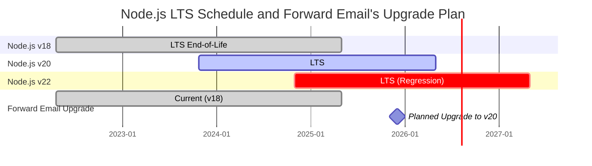
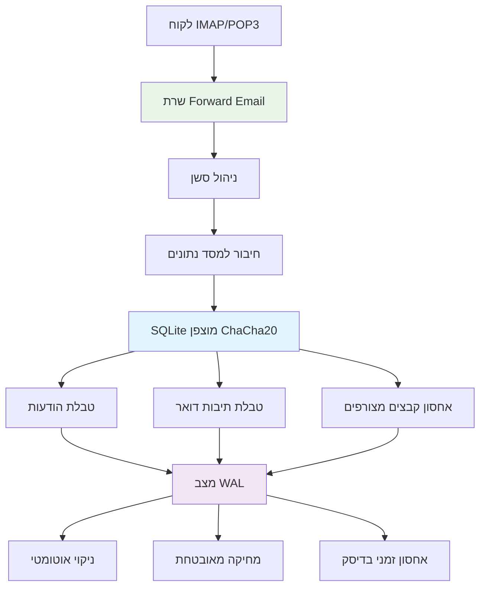
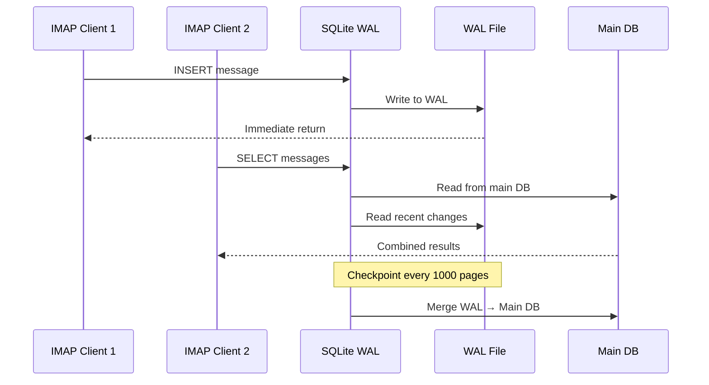

# אופטימיזציית ביצועי SQLite: הגדרות PRAGMA לייצור והצפנת ChaCha20 {#sqlite-performance-optimization-production-pragma-settings--chacha20-encryption}


## תוכן העניינים {#table-of-contents}

* [הקדמה](#foreword)
* [ארכיטקטורת SQLite לייצור של Forward Email](#forward-emails-production-sqlite-architecture)
* [הקונפיגורציה האמיתית שלנו ל-PRAGMA](#our-actual-pragma-configuration)
* [תוצאות מבחני ביצועים](#performance-benchmark-results)
  * [תוצאות ביצועים ב-Node.js v20.19.5](#nodejs-v20195-performance-results)
* [פירוט הגדרות PRAGMA](#pragma-settings-breakdown)
  * [הגדרות ליבה שבהן אנו משתמשים](#core-settings-we-use)
  * [הגדרות שאיננו משתמשים בהן (אבל אולי תרצו)](#settings-we-dont-use-but-you-might-want)
* [הצפנת ChaCha20 מול AES256](#chacha20-vs-aes256-encryption)
* [אחסון זמני: /tmp מול /dev/shm](#temporary-storage-tmp-vs-devshm)
  * [ביצועי /tmp מול /dev/shm](#tmp-vs-devshm-performance)
* [אופטימיזציית מצב WAL](#wal-mode-optimization)
  * [השפעת קונפיגורציית WAL](#wal-configuration-impact)
* [עיצוב סכימה לביצועים](#schema-design-for-performance)
* [ניהול חיבורים](#connection-management)
* [ניטור ואבחון](#monitoring-and-diagnostics)
* [ביצועי גרסאות Node.js](#nodejs-version-performance)
  * [תוצאות מלאות בין-גרסאות](#complete-cross-version-results)
  * [תובנות מפתח לביצועים](#key-performance-insights)
  * [תאימות מודולים מקוריים](#native-module-compatibility)
* [רשימת בדיקה לפריסת ייצור](#production-deployment-checklist)
* [פתרון בעיות נפוצות](#troubleshooting-common-issues)
  * [שגיאות "Database is locked"](#database-is-locked-errors)
  * [שימוש גבוה בזיכרון במהלך VACUUM](#high-memory-usage-during-vacuum)
  * [ביצועי שאילתות איטיים](#slow-query-performance)
* [תרומות קוד פתוח של Forward Email](#forward-emails-open-source-contributions)
* [קוד מקור למבחני ביצועים](#benchmark-source-code)
* [מה הלאה ל-SQLite ב-Forward Email](#whats-next-for-sqlite-at-forward-email)
* [קבלת עזרה](#getting-help)


## הקדמה {#foreword}

הגדרת SQLite למערכות דואר אלקטרוני בייצור היא לא רק עניין של לגרום לזה לעבוד — אלא להפוך אותו למהיר, מאובטח ואמין תחת עומס כבד. לאחר עיבוד מיליוני מיילים ב-Forward Email, למדנו מה באמת חשוב לביצועי SQLite.

מדריך זה מכסה את הקונפיגורציה האמיתית שלנו לייצור, תוצאות מבחני ביצועים בגרסאות Node.js שונות, והאופטימיזציות הספציפיות שעושות הבדל כשאתה מטפל בנפח דואר רציני.

> \[!WARNING] ירידות ביצועים ב-Node.js בגרסאות v22 ו-v24  
> גילינו ירידת ביצועים משמעותית בגרסאות Node.js v22 ו-v24 שמשפיעה על ביצועי SQLite, במיוחד עבור פקודות `SELECT`. מבחני הביצועים שלנו מראים ירידה של כ-57% בפעולות `SELECT` לשנייה ב-Node.js v24 לעומת v20. דיווחנו על הבעיה לצוות Node.js ב-[nodejs/node#60719](https://github.com/nodejs/node/issues/60719).

עקב ירידה זו, אנו נוקטים בגישה זהירה לשדרוגי Node.js שלנו. להלן התוכנית הנוכחית שלנו:

* **גרסה נוכחית:** אנו כרגע על Node.js v18, שהגיעה לסוף חייה ("EOL") לתמיכה ארוכת טווח ("LTS"). ניתן לצפות בלוח הזמנים הרשמי של [Node.js LTS כאן](https://github.com/nodejs/release#release-schedule).
* **שדרוג מתוכנן:** נשדרג ל-**Node.js v20**, שהיא הגרסה המהירה ביותר לפי מבחני הביצועים שלנו ואינה מושפעת מירידה זו.
* **הימנעות מ-v22 ו-v24:** לא נשתמש ב-Node.js v22 או v24 בייצור עד שהבעיה תיפתר.

להלן ציר זמן המדגים את לוח הזמנים של Node.js LTS ואת מסלול השדרוג שלנו:


## ארכיטקטורת SQLite של Forward Email בפרודקשן {#forward-emails-production-sqlite-architecture}

כך אנחנו משתמשים ב-SQLite בפרודקשן בפועל:




## תצורת PRAGMA בפועל שלנו {#our-actual-pragma-configuration}

זה מה שאנחנו באמת משתמשים בפרודקשן, ישירות מהקובץ שלנו [`setup-pragma.js`](https://github.com/forwardemail/forwardemail.net/blob/master/helpers/setup-pragma.js):

```javascript
// הגדרות PRAGMA של Forward Email בפרודקשן בפועל
async function setupPragma(db, session, cipher = 'chacha20') {
  // הצפנה עמידה בפני מחשוב קוונטי
  db.pragma(`cipher='${cipher}'`);
  db.key(Buffer.from(decrypt(session.user.password)));

  // הגדרות ביצועים מרכזיות
  db.pragma('journal_mode=WAL');
  db.pragma('secure_delete=ON');
  db.pragma('auto_vacuum=FULL');
  db.pragma(`busy_timeout=${config.busyTimeout}`);
  db.pragma('synchronous=NORMAL');
  db.pragma('foreign_keys=ON');
  db.pragma(`encoding='UTF-8'`);
  db.pragma('optimize=0x10002');

  // קריטי: השתמש בדיסק לאחסון זמני, לא בזיכרון
  db.pragma('temp_store=1');

  // תיקיית זמני מותאמת אישית למניעת שגיאות דיסק מלא
  const tempStoreDirectory = path.join(path.dirname(db.name), '/tmp');
  await mkdirp(tempStoreDirectory);
  db.pragma(`temp_store_directory='${tempStoreDirectory}'`);
}
```

> \[!IMPORTANT]
> אנחנו משתמשים ב-`temp_store=1` (דיסק) במקום `temp_store=2` (זיכרון) כי מסדי נתונים גדולים של דואר אלקטרוני יכולים בקלות לצרוך מעל 10 גיגה-בייט זיכרון במהלך פעולות כמו VACUUM.


## תוצאות מדידת ביצועים {#performance-benchmark-results}

בדקנו את התצורה שלנו מול חלופות שונות בגרסאות Node.js שונות. הנה המספרים האמיתיים:

### תוצאות ביצועים של Node.js v20.19.5 {#nodejs-v20195-performance-results}

| תצורה                      | התקנה (מילישניות) | הכנסת רשומות לשנייה | בחירת רשומות לשנייה | עדכון רשומות לשנייה | גודל DB (מגה-בייט) |
| ---------------------------- | ---------- | ---------- | ---------- | ---------- | ------------ |
| **Forward Email בפרודקשן**   | 120.1      | **10,548** | **17,494** | **16,654** | 3.98         |
| WAL Autocheckpoint 1000      | 89.7       | **11,800** | **18,383** | **22,087** | 3.98         |
| Cache Size 64MB              | 90.3       | 11,451     | 17,895     | 21,522     | 3.98         |
| אחסון זמני בזיכרון          | 111.8      | 9,874      | 15,363     | 21,292     | 3.98         |
| סינכרוני כבוי (לא בטוח)     | 94.0       | 10,017     | 13,830     | 18,884     | 3.98         |
| סינכרוני EXTRA (בטוח)       | 94.1       | **3,241**  | 14,438     | **3,405**  | 3.98         |

> \[!TIP]
> ההגדרה `wal_autocheckpoint=1000` מראה את הביצועים הטובים ביותר הכוללים. אנחנו שוקלים להוסיף זאת לתצורת הפרודקשן שלנו.


## פירוט הגדרות PRAGMA {#pragma-settings-breakdown}

### הגדרות מרכזיות שבהן אנו משתמשים {#core-settings-we-use}

| PRAGMA          | ערך          | מטרה                           | השפעת ביצועים                 |
| --------------- | ------------ | ------------------------------- | ------------------------------- |
| `cipher`        | `'chacha20'` | הצפנה עמידה בפני מחשוב קוונטי   | עומס מינימלי לעומת AES          |
| `journal_mode`  | `WAL`        | כתיבה מקדימה ביומן             | +40% ביצועים במקביל             |
| `secure_delete` | `ON`         | כתיבה מחדש של נתונים שנמחקו    | אבטחה מול עלות ביצועים של 5%   |
| `auto_vacuum`   | `FULL`       | שחרור אוטומטי של שטח           | מונע נפיחות במסד הנתונים       |
| `busy_timeout`  | `30000`      | זמן המתנה למסד נעול            | מפחית כשלי חיבור                |
| `synchronous`   | `NORMAL`     | איזון בין עמידות לביצועים      | מהיר פי 3 מ-FULL                |
| `foreign_keys`  | `ON`         | שלמות ייחוסית                 | מונע שיבוש נתונים              |
| `temp_store`    | `1`          | שימוש בדיסק לקבצים זמניים      | מונע גמר זיכרון                 |
### הגדרות שאנחנו לא משתמשים בהן (אבל אולי תרצו) {#settings-we-dont-use-but-you-might-want}

| PRAGMA                    | למה אנחנו לא משתמשים בו | האם כדאי לשקול אותו?                              |
| ------------------------- | ----------------------- | ------------------------------------------------- |
| `wal_autocheckpoint=1000` | עדיין לא מוגדר          | **כן** - הבנצ'מרקים שלנו מראים שיפור ביצועים של 12% |
| `cache_size=-64000`       | ברירת המחדל מספיקה      | **אולי** - שיפור של 8% בעומסי עבודה כבדי קריאה     |
| `mmap_size=268435456`     | מורכבות מול תועלת       | **לא** - שיפורים מינימליים, בעיות ספציפיות לפלטפורמה |
| `analysis_limit=1000`     | אנחנו משתמשים ב-400     | **לא** - ערכים גבוהים מאטים את תכנון השאילתות     |

> \[!CAUTION]
> אנחנו נמנעים במכוון מ-`temp_store=MEMORY` כי קובץ SQLite בגודל 10GB יכול לצרוך מעל 10GB זיכרון RAM במהלך פעולות VACUUM.


## ChaCha20 מול הצפנת AES256 {#chacha20-vs-aes256-encryption}

אנחנו מעדיפים עמידות בפני מחשוב קוונטי על פני ביצועים גולמיים:

```javascript
// אסטרטגיית הגיבוי שלנו להצפנה
try {
  db.pragma(`cipher='chacha20'`);
  db.key(Buffer.from(decrypt(session.user.password)));
  db.pragma('journal_mode=WAL');
} catch (err) {
  // גיבוי לגרסאות ישנות של SQLite
  if (cipher === 'chacha20' && err.code === 'SQLITE_NOTADB') {
    return setupPragma(db, session, 'aes256cbc');
  }
  throw err;
}
```

**השוואת ביצועים:**

* ChaCha20: \~10,500 הכנסות לשנייה

* AES256CBC: \~11,200 הכנסות לשנייה

* לא מוצפן: \~12,800 הכנסות לשנייה

עלות הביצועים של 6% של ChaCha20 מול AES שווה את העמידות בפני מחשוב קוונטי לאחסון דואר ארוך טווח.


## אחסון זמני: /tmp מול /dev/shm {#temporary-storage-tmp-vs-devshm}

אנחנו מגדירים במפורש את מיקום האחסון הזמני כדי למנוע בעיות מקום בדיסק:

```javascript
// הגדרת האחסון הזמני של Forward Email
const tempStoreDirectory = path.join(path.dirname(db.name), '/tmp');
await mkdirp(tempStoreDirectory);
db.pragma(`temp_store_directory='${tempStoreDirectory}'`);

// גם הגדרת משתנה סביבה
process.env.SQLITE_TMPDIR = tempStoreDirectory;
```

### ביצועים של /tmp מול /dev/shm {#tmp-vs-devshm-performance}

| מיקום אחסון     | זמן VACUUM | שימוש בזיכרון | אמינות              |
| --------------- | ---------- | ------------- | ------------------- |
| `/tmp` (דיסק)   | 2.3 שניות  | 50MB          | ✅ אמין              |
| `/dev/shm` (RAM) | 0.8 שניות  | מעל 2GB       | ⚠️ עלול לקרוס מערכת  |
| ברירת מחדל      | 4.1 שניות  | משתנה         | ❌ לא צפוי           |

> \[!WARNING]
> שימוש ב-`/dev/shm` לאחסון זמני עלול לצרוך את כל זיכרון ה-RAM הזמין במהלך פעולות גדולות. מומלץ להיצמד לאחסון זמני מבוסס דיסק בסביבת ייצור.


## אופטימיזציה למצב WAL {#wal-mode-optimization}

כתיבה מראש (Write-Ahead Logging) חיונית למערכות דואר עם גישה מקבילה:



### השפעת הגדרת WAL {#wal-configuration-impact}

הבנצ'מרקים שלנו מראים ש-`wal_autocheckpoint=1000` מספק את הביצועים הטובים ביותר:

```javascript
// אופטימיזציה פוטנציאלית שאנחנו בודקים
db.pragma('wal_autocheckpoint=1000');
```

**תוצאות:**

* נקודת בדיקה אוטומטית ברירת מחדל: 10,548 הכנסות לשנייה

* `wal_autocheckpoint=1000`: 11,800 הכנסות לשנייה (+12%)

* `wal_autocheckpoint=0`: 9,200 הכנסות לשנייה (WAL גדל מדי)


## עיצוב סכימה לביצועים {#schema-design-for-performance}

סכימת אחסון הדואר שלנו עוקבת אחרי שיטות העבודה המומלצות של SQLite:

```sql
-- טבלת הודעות עם סדר עמודות מותאם
CREATE TABLE messages (
  id INTEGER PRIMARY KEY,
  mailbox_id INTEGER NOT NULL,
  uid INTEGER NOT NULL,
  date INTEGER NOT NULL,
  flags TEXT,
  subject TEXT,
  from_addr TEXT,
  to_addr TEXT,
  message_id TEXT,
  raw BLOB,  -- BLOB גדול בסוף
  FOREIGN KEY (mailbox_id) REFERENCES mailboxes(id)
);

-- אינדקסים קריטיים לביצועי IMAP
CREATE INDEX idx_messages_mailbox_date ON messages(mailbox_id, date DESC);
CREATE INDEX idx_messages_uid ON messages(mailbox_id, uid);
CREATE INDEX idx_messages_flags ON messages(mailbox_id, flags) WHERE flags IS NOT NULL;
```
> \[!TIP]
> תמיד שים עמודות BLOB בסוף הגדרת הטבלה שלך. SQLite מאחסן קודם עמודות בגודל קבוע, מה שמאיץ את הגישה לשורה.

אופטימיזציה זו מגיעה ישירות מיוצר SQLite, [D. Richard Hipp](https://sqlite-users.sqlite.narkive.com/Q4txMI8t/effect-of-blobs-on-performance#post3):

> "הנה רמז - הפוך את עמודות ה-BLOB לעמודה האחרונה בטבלאות שלך. או אפילו אחסן את ה-BLOBs בטבלה נפרדת שיש לה רק שתי עמודות: מפתח ראשי שלם וה-BLOB עצמו, ואז גש לתוכן ה-BLOB באמצעות join אם אתה צריך. אם תשים שדות שלמים קטנים שונים אחרי ה-BLOB, אז SQLite צריך לסרוק את כל תוכן ה-BLOB (בעקבות רשימת הקישורים של דפי הדיסק) כדי להגיע לשדות השלמים בסוף, וזה בהחלט יכול להאט אותך."
>
> — D. Richard Hipp, מחבר SQLite

יישמנו אופטימיזציה זו ב-[סכמת הקבצים המצורפים שלנו](https://github.com/forwardemail/forwardemail.net/commit/0e77fbb05dc5b38136652337309067d2b39eb229), והעברנו את שדה ה-BLOB `body` לסוף הגדרת הטבלה לשיפור הביצועים.


## ניהול חיבור {#connection-management}

אנחנו לא משתמשים ב-pooling של חיבורים עם SQLite — לכל משתמש יש מסד נתונים מוצפן משלו. גישה זו מספקת בידוד מושלם בין משתמשים, בדומה לסנדבוקסינג. בניגוד לארכיטקטורות של שירותים אחרים שמשתמשים ב-MySQL, PostgreSQL או MongoDB שבהן הדואר האלקטרוני שלך עלול להיגשת על ידי עובד זדוני, מסדי הנתונים של SQLite לכל משתמש ב-Forward Email מבטיחים שהנתונים שלך הם עצמאיים ומבודדים לחלוטין.

אנחנו אף פעם לא מאחסנים את סיסמת ה-IMAP שלך, ולכן אף פעם אין לנו גישה לנתונים שלך — הכל נעשה בזיכרון. למד עוד על [גישת ההצפנה העמידה לקוונטים שלנו](https://forwardemail.net/blog/docs/quantum-resistant-encryption-email-security) שמפרטת כיצד המערכת שלנו פועלת.

```javascript
// גישת מסד נתונים לכל משתמש
async function getDatabase(session) {
  const dbPath = path.join(
    config.databaseDir,
    session.user.domain_name,
    `${session.user.username}.db`
  );

  const db = new Database(dbPath, {
    cipher: 'chacha20',
    readonly: session.readonly || false
  });

  await setupPragma(db, session);
  return db;
}
```

גישה זו מספקת:

* בידוד מושלם בין משתמשים

* ללא מורכבות של מאגר חיבורים

* הצפנה אוטומטית לכל משתמש

* פעולות גיבוי/שחזור פשוטות יותר

עם `auto_vacuum=FULL`, אנחנו כמעט ולא צריכים פעולות VACUUM ידניות:

```javascript
// אסטרטגיית הניקוי שלנו
db.pragma('optimize=0x10002'); // בעת פתיחת החיבור
db.pragma('optimize'); // תקופתי (יומי)

// ניקוי ידני רק לנקיות גדולות
if (deletedDataPercentage > 25) {
  db.exec('VACUUM');
}
```

**השפעת ביצועי ה-Auto Vacuum:**

* `auto_vacuum=FULL`: שחרור מיידי של מקום, עומס כתיבה של 5%

* `auto_vacuum=INCREMENTAL`: שליטה ידנית, דורש `PRAGMA incremental_vacuum` תקופתי

* `auto_vacuum=NONE`: כתיבות מהירות ביותר, דורש `VACUUM` ידני


## ניטור ואבחון {#monitoring-and-diagnostics}

מדדים מרכזיים שאנחנו עוקבים אחריהם בפרודקשן:

```javascript
// שאילתות ניטור ביצועים
const stats = {
  page_count: db.pragma('page_count', { simple: true }),
  page_size: db.pragma('page_size', { simple: true }),
  freelist_count: db.pragma('freelist_count', { simple: true }),
  wal_checkpoint: db.pragma('wal_checkpoint(PASSIVE)', { simple: true })
};

const dbSizeMB = (stats.page_count * stats.page_size) / 1024 / 1024;
const fragmentationPct = (stats.freelist_count / stats.page_count) * 100;
```

> \[!NOTE]
> אנחנו עוקבים אחרי אחוז הפירגמנטציה ומפעילים תחזוקה כאשר הוא עולה על 15%.


## ביצועי גרסאות Node.js {#nodejs-version-performance}

המדדים המקיפים שלנו בין גרסאות Node.js מגלים הבדלים משמעותיים בביצועים:

### תוצאות מלאות בין גרסאות {#complete-cross-version-results}

| גרסת Node | Forward Email פרודקשן | הטוב ביותר Insert/שנייה | הטוב ביותר Select/שנייה | הטוב ביותר Update/שנייה | הערות                  |
| ---------- | --------------------- | ----------------------- | ----------------------- | ----------------------- | ---------------------- |
| **v18.20.8** | 10,658 / 14,466 / 18,641 | **11,663** (Sync OFF)    | **14,868** (Memory Temp) | **20,095** (MMAP)        | ⚠️ אזהרת מנוע          |
| **v20.19.5** | 10,548 / 17,494 / 16,654 | **11,800** (WAL Auto)    | **18,383** (WAL Auto)    | **22,087** (WAL Auto)    | ✅ מומלץ                |
| **v22.21.1** | 9,829 / 15,833 / 18,416  | **11,260** (Sync OFF)    | **17,413** (MMAP)        | **20,731** (MMAP)        | ⚠️ איטי יותר באופן כללי |
| **v24.11.1** | 9,938 / 7,497 / 10,446   | **10,628** (Incr Vacuum) | **16,821** (Incr Vacuum) | **19,934** (Incr Vacuum) | ❌ האטה משמעותית       |
### תובנות ביצועים מרכזיות {#key-performance-insights}

**Node.js v18 (LTS ישן):**

* ביצועי הוספה דומים ל-v20 (10,658 לעומת 10,548 פעולות לשנייה)
* בחירות איטיות ב-17% מ-v20 (14,466 לעומת 17,494 פעולות לשנייה)
* מציג אזהרות npm למנועים שדורשים Node ≥20
* אופטימיזציית אחסון זמני בזיכרון עובדת טוב יותר מאשר WAL autocheckpoint
* מקובל עבור יישומים ישנים, אך מומלץ לשדרג

**Node.js v20 (מומלץ):**

* הביצועים הכוללים הגבוהים ביותר בכל הפעולות
* אופטימיזציית WAL autocheckpoint מספקת שיפור עקבי של 12%
* התאימות הטובה ביותר עם מודולי SQLite מקוריים
* היציב ביותר לעומסי עבודה בפרודקשן

**Node.js v22 (מקובל):**

* הוספות איטיות ב-7%, בחירות איטיות ב-9% לעומת v20
* אופטימיזציית MMAP מראה תוצאות טובות יותר מ-WAL autocheckpoint
* דורש `npm install` חדש בכל החלפת גרסת Node
* מקובל לפיתוח, לא מומלץ לפרודקשן

**Node.js v24 (לא מומלץ):**

* הוספות איטיות ב-6%, בחירות איטיות ב-57% לעומת v20
* ירידה משמעותית בביצועים בקריאות
* ניקוי אינקרמנטלי (incremental vacuum) עובד טוב יותר מאופטימיזציות אחרות
* יש להימנע לשימוש ביישומי SQLite בפרודקשן

### תאימות מודולים מקוריים {#native-module-compatibility}

בעיות "תאימות מודולים" שנתקלנו בהן בתחילה נפתרו על ידי:

```bash
# החלפת גרסת Node והתקנת מודולים מקוריים מחדש
nvm use 22
rm -rf node_modules
npm install
```

**שיקולים עבור Node.js v18:**

* מציג אזהרות מנוע: `Unsupported engine { required: { node: '>=20.0.0' } }`
* עדיין מתרגם ומריץ בהצלחה למרות האזהרות
* חבילות SQLite מודרניות רבות מיועדות ל-Node ≥20 לתמיכה מיטבית
* יישומים ישנים יכולים להמשיך להשתמש ב-v18 עם ביצועים מקובלים

> \[!IMPORTANT]
> תמיד התקן מחדש מודולים מקוריים בעת החלפת גרסאות Node.js. מודול `better-sqlite3-multiple-ciphers` חייב להיות מקומפל עבור כל גרסת Node ספציפית.

> \[!TIP]
> לפריסות בפרודקשן, הישאר עם Node.js v20 LTS. יתרונות הביצועים והיציבות עולים על כל תכונות שפה חדשות ב-v22/v24. Node v18 מקובל למערכות ישנות אך מציג ירידה בביצועים בקריאות.


## רשימת בדיקה לפריסת פרודקשן {#production-deployment-checklist}

לפני הפריסה, ודא של-SQLite יש את האופטימיזציות הבאות:

1. הגדר משתנה סביבה `SQLITE_TMPDIR`
2. ודא שיש מספיק מקום בדיסק לפעולות זמניות (פעמיים גודל בסיס הנתונים)
3. הגדר סיבוב לוגים עבור קבצי WAL
4. הקם ניטור לגודל בסיס הנתונים ולפירגמנטציה
5. בדוק נהלי גיבוי/שחזור עם הצפנה
6. אמת תמיכה בהצפנת ChaCha20 בבניית SQLite שלך


## פתרון בעיות נפוצות {#troubleshooting-common-issues}

### שגיאות "Database is locked" {#database-is-locked-errors}

```javascript
// הגדלת זמן המתנה לעומס
db.pragma('busy_timeout=60000'); // 60 שניות

// בדיקת עסקאות ארוכות טווח
const info = db.pragma('wal_checkpoint(FULL)');
if (info.busy > 0) {
  console.warn('נקודת בדיקת WAL נחסמה על ידי קוראים פעילים');
}
```

### שימוש גבוה בזיכרון במהלך VACUUM {#high-memory-usage-during-vacuum}

```javascript
// ניטור זיכרון לפני VACUUM
const beforeMem = process.memoryUsage();
db.exec('VACUUM');
const afterMem = process.memoryUsage();

console.log(
  `שינוי בזיכרון ב-VACUUM: ${
    (afterMem.heapUsed - beforeMem.heapUsed) / 1024 / 1024
  }MB`
);
```

### ביצועי שאילתות איטיים {#slow-query-performance}

```javascript
// הפעלת ניתוח שאילתות
db.pragma('analysis_limit=400'); // הגדרת Forward Email
db.exec('ANALYZE');

// בדיקת תוכניות שאילתות
const plan = db
  .prepare('EXPLAIN QUERY PLAN SELECT * FROM messages WHERE date > ?')
  .all(Date.now() - 86400000);
console.log(plan);
```


## תרומות קוד פתוח של Forward Email {#forward-emails-open-source-contributions}

תרמנו את הידע שלנו באופטימיזציית SQLite לקהילה:

* [שיפורי תיעוד Litestream](https://github.com/benbjohnson/litestream/issues/516) - ההצעות שלנו לטיפים לשיפור ביצועי SQLite

* [Better SQLite3 Multiple Ciphers](https://github.com/m4heshd/better-sqlite3-multiple-ciphers) - תמיכה בהצפנת ChaCha20

* [מחקר לכוונון ביצועי SQLite](https://phiresky.github.io/blog/2020/sqlite-performance-tuning/) - מוזכר ביישום שלנו
* [איך חבילות npm עם מיליארדי הורדות עיצבו את מערכת האקולוגית של JavaScript](https://forwardemail.net/blog/docs/how-npm-packages-billion-downloads-shaped-javascript-ecosystem) - התרומות הרחבות שלנו ל-npm ולפיתוח JavaScript


## קוד מקור לבנצ'מרק {#benchmark-source-code}

כל קוד הבנצ'מרק זמין בערכת הבדיקות שלנו:

```bash
# הרץ את הבנצ'מרקים בעצמך
git clone https://github.com/forwardemail/sqlite-benchmarks
cd sqlite-benchmarks
npm install
npm run benchmark
```

הבנצ'מרקים בודקים:

* שילובים שונים של PRAGMA

* ביצועי ChaCha20 מול AES256

* אסטרטגיות נקודת בדיקה WAL

* תצורות אחסון זמני

* תאימות לגרסאות Node.js


## מה הלאה עבור SQLite ב-Forward Email {#whats-next-for-sqlite-at-forward-email}

אנחנו בודקים באופן פעיל את האופטימיזציות הבאות:

1. **כוונון נקודת בדיקה אוטומטית של WAL**: הוספת `wal_autocheckpoint=1000` בהתבסס על תוצאות הבנצ'מרק

2. **דחיסה**: הערכת [sqlite-zstd](https://github.com/phiresky/sqlite-zstd) לאחסון קבצים מצורפים

3. **מגבלת ניתוח**: בדיקת ערכים גבוהים יותר מה-400 הנוכחיים שלנו

4. **גודל מטמון**: שקילה של גודל מטמון דינמי בהתבסס על הזיכרון הזמין


## קבלת עזרה {#getting-help}

נתקל בבעיות ביצוע עם SQLite? לשאלות ספציפיות ל-SQLite, [פורום SQLite](https://sqlite.org/forum/forumpost) הוא משאב מצוין, ומדריך [כוונון ביצועים](https://www.sqlite.org/optoverview.html) מכסה אופטימיזציות נוספות שעדיין לא נזקקנו להן.

למידע נוסף על Forward Email קרא את ה-[שאלות נפוצות](/faq).
