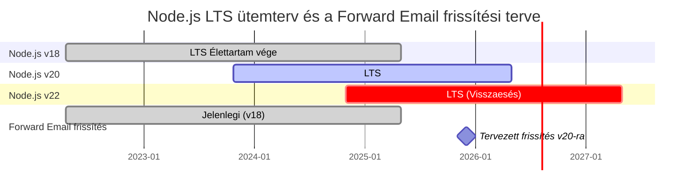
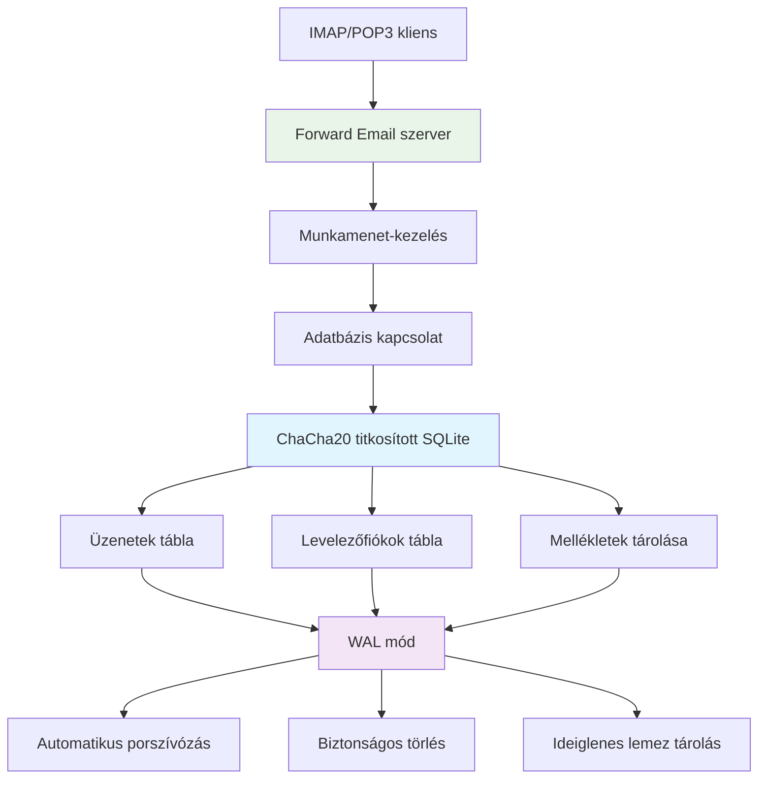
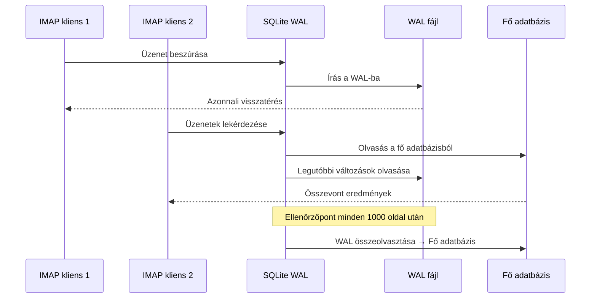

# SQLite Teljesítményoptimalizálás: Termelési PRAGMA Beállítások & ChaCha20 Titkosítás {#sqlite-performance-optimization-production-pragma-settings--chacha20-encryption}


## Tartalomjegyzék {#table-of-contents}

* [Előszó](#foreword)
* [A Forward Email termelési SQLite architektúrája](#forward-emails-production-sqlite-architecture)
* [A tényleges PRAGMA konfigurációnk](#our-actual-pragma-configuration)
* [Teljesítmény mérési eredmények](#performance-benchmark-results)
  * [Node.js v20.19.5 teljesítmény eredmények](#nodejs-v20195-performance-results)
* [PRAGMA beállítások részletezése](#pragma-settings-breakdown)
  * [Alapbeállítások, amiket használunk](#core-settings-we-use)
  * [Beállítások, amiket NEM használunk (de esetleg szeretnél)](#settings-we-dont-use-but-you-might-want)
* [ChaCha20 vs AES256 titkosítás](#chacha20-vs-aes256-encryption)
* [Ideiglenes tároló: /tmp vs /dev/shm](#temporary-storage-tmp-vs-devshm)
  * [/tmp vs /dev/shm teljesítmény](#tmp-vs-devshm-performance)
* [WAL mód optimalizálás](#wal-mode-optimization)
  * [WAL konfiguráció hatása](#wal-configuration-impact)
* [Séma tervezés a teljesítményért](#schema-design-for-performance)
* [Kapcsolatkezelés](#connection-management)
* [Monitorozás és diagnosztika](#monitoring-and-diagnostics)
* [Node.js verziók teljesítménye](#nodejs-version-performance)
  * [Teljes keresztverziós eredmények](#complete-cross-version-results)
  * [Főbb teljesítmény tanulságok](#key-performance-insights)
  * [Natív modul kompatibilitás](#native-module-compatibility)
* [Termelési telepítési ellenőrzőlista](#production-deployment-checklist)
* [Gyakori problémák elhárítása](#troubleshooting-common-issues)
  * ["Az adatbázis zárolva van" hibák](#database-is-locked-errors)
  * [Magas memóriahasználat VACUUM közben](#high-memory-usage-during-vacuum)
  * [Lassú lekérdezési teljesítmény](#slow-query-performance)
* [A Forward Email nyílt forráskódú hozzájárulásai](#forward-emails-open-source-contributions)
* [Benchmark forráskód](#benchmark-source-code)
* [Mi következik az SQLite számára a Forward Emailnél](#whats-next-for-sqlite-at-forward-email)
* [Segítségkérés](#getting-help)


## Előszó {#foreword}

Az SQLite beállítása termelési e-mail rendszerekhez nem csupán arról szól, hogy működjön — hanem arról is, hogy gyors, biztonságos és megbízható legyen nagy terhelés alatt. Több millió e-mail feldolgozása után a Forward Emailnél megtanultuk, mi számít igazán az SQLite teljesítményében.

Ez az útmutató bemutatja a valós termelési konfigurációnkat, a Node.js verziók közötti benchmark eredményeket, valamint azokat a specifikus optimalizációkat, amelyek számítanak, ha komoly e-mail mennyiséget kezelsz.

> \[!WARNING] Node.js teljesítmény visszaesések a v22 és v24 verziókban
> Jelentős teljesítmény visszaesést fedeztünk fel a Node.js v22 és v24 verzióiban, amely különösen az SQLite `SELECT` lekérdezéseit érinti. Benchmarkjaink szerint a `SELECT` műveletek másodpercenkénti száma körülbelül 57%-kal csökkent a Node.js v24-ben a v20-hoz képest. Ezt a problémát jelentettük a Node.js csapatnak a [nodejs/node#60719](https://github.com/nodejs/node/issues/60719) issue-ban.

E visszaesés miatt óvatosan közelítjük meg a Node.js frissítéseket. Íme a jelenlegi tervünk:

* **Jelenlegi verzió:** Jelenleg a Node.js v18-at használjuk, amely elérte az élettartamának végét ("EOL") a hosszú távú támogatás ("LTS") szempontjából. Az hivatalos [Node.js LTS ütemtervet itt tekintheted meg](https://github.com/nodejs/release#release-schedule).
* **Tervezett frissítés:** Frissíteni fogunk a **Node.js v20** verzióra, amely a benchmarkjaink szerint a leggyorsabb, és nem érinti ez a visszaesés.
* **v22 és v24 elkerülése:** Nem fogjuk használni a Node.js v22 vagy v24 verziókat termelésben, amíg ez a teljesítményprobléma meg nem oldódik.

Az alábbi idővonal szemlélteti a Node.js LTS ütemtervét és a frissítési tervünket:


## Forward Email termelési SQLite architektúrája {#forward-emails-production-sqlite-architecture}

Így használjuk valójában az SQLite-ot termelésben:



## A tényleges PRAGMA konfigurációnk {#our-actual-pragma-configuration}

Ez az, amit valójában használunk termelésben, közvetlenül a [`setup-pragma.js`](https://github.com/forwardemail/forwardemail.net/blob/master/helpers/setup-pragma.js) fájlból:

```javascript
// Forward Email tényleges termelési PRAGMA beállításai
async function setupPragma(db, session, cipher = 'chacha20') {
  // Kvantumrezisztens titkosítás
  db.pragma(`cipher='${cipher}'`);
  db.key(Buffer.from(decrypt(session.user.password)));

  // Alapvető teljesítménybeállítások
  db.pragma('journal_mode=WAL');
  db.pragma('secure_delete=ON');
  db.pragma('auto_vacuum=FULL');
  db.pragma(`busy_timeout=${config.busyTimeout}`);
  db.pragma('synchronous=NORMAL');
  db.pragma('foreign_keys=ON');
  db.pragma(`encoding='UTF-8'`);
  db.pragma('optimize=0x10002');

  // Kritikus: ideiglenes tároláshoz lemezt használjunk, ne memóriát
  db.pragma('temp_store=1');

  // Egyedi ideiglenes könyvtár a lemez megtelt hibák elkerülésére
  const tempStoreDirectory = path.join(path.dirname(db.name), '/tmp');
  await mkdirp(tempStoreDirectory);
  db.pragma(`temp_store_directory='${tempStoreDirectory}'`);
}
```

> \[!IMPORTANT]
> A `temp_store=1` (lemez) beállítást használjuk a `temp_store=2` (memória) helyett, mert a nagy email adatbázisok könnyen elfogyaszthatnak 10+ GB memóriát olyan műveletek során, mint a VACUUM.

## Teljesítmény mérési eredmények {#performance-benchmark-results}

Konfigurációnkat különböző alternatívákkal teszteltük Node.js verziók között. Íme a valós számok:

### Node.js v20.19.5 teljesítmény eredmények {#nodejs-v20195-performance-results}

| Konfiguráció                | Beállítás (ms) | Beszúrás/mp | Lekérdezés/mp | Frissítés/mp | Adatbázis méret (MB) |
| ---------------------------- | -------------- | ----------- | ------------- | ------------ | -------------------- |
| **Forward Email termelés**   | 120.1          | **10,548**  | **17,494**    | **16,654**   | 3.98                 |
| WAL Autocheckpoint 1000      | 89.7           | **11,800**  | **18,383**    | **22,087**   | 3.98                 |
| Cache méret 64MB             | 90.3           | 11,451      | 17,895        | 21,522       | 3.98                 |
| Memória ideiglenes tárolás   | 111.8          | 9,874       | 15,363        | 21,292       | 3.98                 |
| Szinkronizálás KI (Nem biztonságos) | 94.0    | 10,017      | 13,830        | 18,884       | 3.98                 |
| Szinkronizálás EXTRA (Biztonságos) | 94.1      | **3,241**   | 14,438        | **3,405**    | 3.98                 |

> \[!TIP]
> A `wal_autocheckpoint=1000` beállítás mutatja a legjobb összteljesítményt. Fontolgatjuk, hogy ezt hozzáadjuk a termelési konfigurációnkhoz.

## PRAGMA beállítások részletezése {#pragma-settings-breakdown}

### Alapbeállítások, amiket használunk {#core-settings-we-use}

| PRAGMA          | Érték        | Cél                             | Teljesítmény hatás             |
| --------------- | ------------ | ------------------------------- | ------------------------------ |
| `cipher`        | `'chacha20'` | Kvantumrezisztens titkosítás    | Minimális többletterhelés az AES-hez képest |
| `journal_mode`  | `WAL`        | Írás-előtti naplózás            | +40% párhuzamos teljesítmény   |
| `secure_delete` | `ON`         | Törölt adatok felülírása        | Biztonság vs 5% teljesítménycsökkenés |
| `auto_vacuum`   | `FULL`       | Automatikus helyfelszabadítás   | Megakadályozza az adatbázis duzzadást |
| `busy_timeout`  | `30000`      | Várakozási idő zárolt adatbázis esetén | Csökkenti a kapcsolódási hibákat |
| `synchronous`   | `NORMAL`     | Kiegyensúlyozott tartósság/teljesítmény | 3x gyorsabb, mint a FULL       |
| `foreign_keys`  | `ON`         | Referenciális integritás        | Megakadályozza az adatsérülést |
| `temp_store`    | `1`          | Ideiglenes fájlokhoz lemez használata | Megakadályozza a memória kimerülését |
### Beállítások, amiket NEM használunk (de esetleg szeretnél) {#settings-we-dont-use-but-you-might-want}

| PRAGMA                    | Miért nem használjuk   | Érdemes megfontolnod?                             |
| ------------------------- | --------------------- | --------------------------------------------------- |
| `wal_autocheckpoint=1000` | Még nincs beállítva   | **Igen** - Benchmarkjaink 12%-os teljesítménynövekedést mutatnak  |
| `cache_size=-64000`       | Az alapértelmezett elég | **Talán** - 8% javulás olvasás-intenzív munkaterhelésnél |
| `mmap_size=268435456`     | Bonyolultság vs előny | **Nem** - Minimális javulás, platformfüggő problémák    |
| `analysis_limit=1000`     | Mi 400-at használunk  | **Nem** - Magasabb érték lassítja a lekérdezés-tervezést     |

> \[!CAUTION]
> Kifejezetten kerüljük a `temp_store=MEMORY` használatát, mert egy 10GB-os SQLite fájl VACUUM műveletek alatt 10+ GB RAM-ot is elfogyaszthat.


## ChaCha20 vs AES256 titkosítás {#chacha20-vs-aes256-encryption}

A kvantumellenállóságot részesítjük előnyben a nyers teljesítmény helyett:

```javascript
// Titkosítási visszaesési stratégia
try {
  db.pragma(`cipher='chacha20'`);
  db.key(Buffer.from(decrypt(session.user.password)));
  db.pragma('journal_mode=WAL');
} catch (err) {
  // Visszaesés régebbi SQLite verziókhoz
  if (cipher === 'chacha20' && err.code === 'SQLITE_NOTADB') {
    return setupPragma(db, session, 'aes256cbc');
  }
  throw err;
}
```

**Teljesítmény összehasonlítás:**

* ChaCha20: \~10,500 beszúrás/mp

* AES256CBC: \~11,200 beszúrás/mp

* Titkosítatlan: \~12,800 beszúrás/mp

A ChaCha20 6%-os teljesítményköltsége az AES-hez képest megéri a kvantumellenállóságot a hosszú távú e-mail tárolásnál.


## Ideiglenes tárolás: /tmp vs /dev/shm {#temporary-storage-tmp-vs-devshm}

Kifejezetten beállítjuk az ideiglenes tároló helyét, hogy elkerüljük a lemezterület problémákat:

```javascript
// Forward Email ideiglenes tároló konfiguráció
const tempStoreDirectory = path.join(path.dirname(db.name), '/tmp');
await mkdirp(tempStoreDirectory);
db.pragma(`temp_store_directory='${tempStoreDirectory}'`);

// Környezeti változó beállítása is
process.env.SQLITE_TMPDIR = tempStoreDirectory;
```

### /tmp vs /dev/shm teljesítmény {#tmp-vs-devshm-performance}

| Tároló helye    | VACUUM idő | Memóriahasználat | Megbízhatóság         |
| ---------------- | ----------- | ------------ | ------------------- |
| `/tmp` (lemez)   | 2.3s        | 50MB         | ✅ Megbízható          |
| `/dev/shm` (RAM) | 0.8s        | 2GB+         | ⚠️ Rendszerösszeomlás lehet |
| Alapértelmezett  | 4.1s        | Változó      | ❌ Kiszámíthatatlan     |

> \[!WARNING]
> A `/dev/shm` ideiglenes tárolóként való használata nagy műveletek alatt az összes elérhető RAM-ot elfogyaszthatja. Termelésben maradj a lemezes ideiglenes tárolónál.


## WAL mód optimalizálás {#wal-mode-optimization}

A Write-Ahead Logging kulcsfontosságú az egyidejű hozzáférésű e-mail rendszerekhez:



### WAL konfiguráció hatása {#wal-configuration-impact}

Benchmarkjaink szerint a `wal_autocheckpoint=1000` adja a legjobb teljesítményt:

```javascript
// Potenciális optimalizáció, amit tesztelünk
db.pragma('wal_autocheckpoint=1000');
```

**Eredmények:**

* Alapértelmezett autocheckpoint: 10,548 beszúrás/mp

* `wal_autocheckpoint=1000`: 11,800 beszúrás/mp (+12%)

* `wal_autocheckpoint=0`: 9,200 beszúrás/mp (a WAL túl nagyra nő)


## Sématervezés a teljesítményért {#schema-design-for-performance}

E-mail tároló sémánk követi az SQLite legjobb gyakorlatait:

```sql
-- Üzenetek tábla optimalizált oszloprenddel
CREATE TABLE messages (
  id INTEGER PRIMARY KEY,
  mailbox_id INTEGER NOT NULL,
  uid INTEGER NOT NULL,
  date INTEGER NOT NULL,
  flags TEXT,
  subject TEXT,
  from_addr TEXT,
  to_addr TEXT,
  message_id TEXT,
  raw BLOB,  -- Nagy BLOB a végén
  FOREIGN KEY (mailbox_id) REFERENCES mailboxes(id)
);

-- Kritikus indexek az IMAP teljesítményhez
CREATE INDEX idx_messages_mailbox_date ON messages(mailbox_id, date DESC);
CREATE INDEX idx_messages_uid ON messages(mailbox_id, uid);
CREATE INDEX idx_messages_flags ON messages(mailbox_id, flags) WHERE flags IS NOT NULL;
```
> \[!TIP]
> Mindig helyezze a BLOB oszlopokat a tábladefiníció végére. Az SQLite először a fix méretű oszlopokat tárolja, így gyorsabb a sorok elérése.

Ez az optimalizáció közvetlenül az SQLite alkotójától, [D. Richard Hipp](https://sqlite-users.sqlite.narkive.com/Q4txMI8t/effect-of-blobs-on-performance#post3) származik:

> "Egy tipp azonban - tegye a BLOB oszlopokat a táblák utolsó oszlopává. Vagy akár tárolja a BLOB-okat egy külön táblában, amely csak két oszlopból áll: egy egész szám típusú elsődleges kulcsból és magából a blobból, majd szükség esetén egy join segítségével érje el a BLOB tartalmát. Ha különböző kis egész szám mezőket helyez a BLOB után, akkor az SQLite-nak végig kell pásztáznia a teljes BLOB tartalmat (a lemezoldalak láncolt listáját követve), hogy eljusson a végén lévő egész szám mezőkhöz, és ez határozottan lassíthatja a működést."
>
> — D. Richard Hipp, az SQLite szerzője

Ezt az optimalizációt megvalósítottuk a [Mellékletek sémánkban](https://github.com/forwardemail/forwardemail.net/commit/0e77fbb05dc5b38136652337309067d2b39eb229), a `body` BLOB mezőt a tábladefiníció végére helyezve a jobb teljesítmény érdekében.


## Kapcsolatkezelés {#connection-management}

Nem használunk kapcsolatpoolozást SQLite esetén — minden felhasználó saját titkosított adatbázist kap. Ez a megközelítés tökéletes izolációt biztosít a felhasználók között, hasonlóan a sandboxoláshoz. Ellentétben más szolgáltatások architektúráival, amelyek MySQL-t, PostgreSQL-t vagy MongoDB-t használnak, és ahol az e-mailje potenciálisan hozzáférhető lehet egy rosszindulatú alkalmazott számára, a Forward Email felhasználónkénti SQLite adatbázisai garantálják, hogy az adatai teljesen függetlenek és sandboxoltak.

Soha nem tároljuk az IMAP jelszavát, így soha nincs hozzáférésünk az adataihoz — minden memóriában történik. Tudjon meg többet a [kvantumrezisztens titkosítási megközelítésünkről](https://forwardemail.net/blog/docs/quantum-resistant-encryption-email-security), amely részletezi a rendszerünk működését.

```javascript
// Felhasználónkénti adatbázis megközelítés
async function getDatabase(session) {
  const dbPath = path.join(
    config.databaseDir,
    session.user.domain_name,
    `${session.user.username}.db`
  );

  const db = new Database(dbPath, {
    cipher: 'chacha20',
    readonly: session.readonly || false
  });

  await setupPragma(db, session);
  return db;
}
```

Ez a megközelítés biztosítja:

* Tökéletes izoláció a felhasználók között

* Nincs kapcsolatpool komplexitás

* Automatikus titkosítás felhasználónként

* Egyszerűbb biztonsági mentés/helyreállítás műveletek

Az `auto_vacuum=FULL` beállítással ritkán van szükség kézi VACUUM műveletekre:

```javascript
// Takarítási stratégia
db.pragma('optimize=0x10002'); // Kapcsolat megnyitásakor
db.pragma('optimize'); // Időszakosan (naponta)

// Kézi vacuum csak nagyobb takarításokhoz
if (deletedDataPercentage > 25) {
  db.exec('VACUUM');
}
```

**Auto Vacuum teljesítményhatás:**

* `auto_vacuum=FULL`: Azonnali helyfelszabadítás, 5% írási többletterhelés

* `auto_vacuum=INCREMENTAL`: Kézi vezérlés, időszakos `PRAGMA incremental_vacuum` szükséges

* `auto_vacuum=NONE`: Leggyorsabb írások, kézi `VACUUM` szükséges


## Monitorozás és diagnosztika {#monitoring-and-diagnostics}

Főbb metrikák, amelyeket éles környezetben követünk:

```javascript
// Teljesítmény monitorozó lekérdezések
const stats = {
  page_count: db.pragma('page_count', { simple: true }),
  page_size: db.pragma('page_size', { simple: true }),
  freelist_count: db.pragma('freelist_count', { simple: true }),
  wal_checkpoint: db.pragma('wal_checkpoint(PASSIVE)', { simple: true })
};

const dbSizeMB = (stats.page_count * stats.page_size) / 1024 / 1024;
const fragmentationPct = (stats.freelist_count / stats.page_count) * 100;
```

> \[!NOTE]
> Figyeljük a fragmentáció százalékát, és karbantartást indítunk, ha az meghaladja a 15%-ot.


## Node.js verzió teljesítmény {#nodejs-version-performance}

Átfogó benchmarkjaink a Node.js verziók között jelentős teljesítménykülönbségeket mutatnak:

### Teljes verziók közötti eredmények {#complete-cross-version-results}

| Node verzió | Forward Email éles | Legjobb beszúrás/mp       | Legjobb lekérdezés/mp     | Legjobb frissítés/mp      | Megjegyzések           |
| ------------ | ------------------ | ------------------------- | ------------------------- | ------------------------- | ---------------------- |
| **v18.20.8** | 10,658 / 14,466 / 18,641 | **11,663** (Sync KI)       | **14,868** (Memória Temp) | **20,095** (MMAP)         | ⚠️ Motor figyelmeztetés |
| **v20.19.5** | 10,548 / 17,494 / 16,654 | **11,800** (WAL Auto)      | **18,383** (WAL Auto)     | **22,087** (WAL Auto)     | ✅ Ajánlott             |
| **v22.21.1** | 9,829 / 15,833 / 18,416  | **11,260** (Sync KI)       | **17,413** (MMAP)         | **20,731** (MMAP)         | ⚠️ Általánosan lassabb |
| **v24.11.1** | 9,938 / 7,497 / 10,446   | **10,628** (Incr Vacuum)   | **16,821** (Incr Vacuum)  | **19,934** (Incr Vacuum)  | ❌ Jelentős lassulás    |
### Fő Teljesítménybeli Megállapítások {#key-performance-insights}

**Node.js v18 (Legacy LTS):**

* Összehasonlítható beszúrási teljesítmény a v20-hoz képest (10,658 vs 10,548 művelet/mp)
* 17%-kal lassabb lekérdezések, mint a v20 (14,466 vs 17,494 művelet/mp)
* npm engine figyelmeztetéseket mutat a Node ≥20-at igénylő csomagoknál
* Memória ideiglenes tárolás optimalizálás jobban működik, mint a WAL automatikus ellenőrzőpont
* Elfogadható régi alkalmazásokhoz, de frissítés ajánlott

**Node.js v20 (Ajánlott):**

* Legmagasabb összteljesítmény minden műveletnél
* WAL automatikus ellenőrzőpont optimalizálás következetes 12%-os növekedést biztosít
* Legjobb kompatibilitás natív SQLite modulokkal
* Legstabilabb gyártási terhelésekhez

**Node.js v22 (Elfogadható):**

* 7%-kal lassabb beszúrások, 9%-kal lassabb lekérdezések a v20-hoz képest
* MMAP optimalizálás jobb eredményeket mutat, mint a WAL automatikus ellenőrzőpont
* Minden Node verzióváltásnál friss `npm install` szükséges
* Fejlesztéshez elfogadható, gyártásban nem ajánlott

**Node.js v24 (Nem ajánlott):**

* 6%-kal lassabb beszúrások, 57%-kal lassabb lekérdezések a v20-hoz képest
* Jelentős teljesítményromlás olvasási műveleteknél
* Inkrementális vacuum jobban teljesít, mint más optimalizációk
* Kerülendő gyártási SQLite alkalmazásokhoz

### Natív Modul Kompatibilitás {#native-module-compatibility}

Az eredetileg tapasztalt "modul kompatibilitási problémák" megoldódtak az alábbi lépésekkel:

```bash
# Node verzió váltása és natív modulok újratelepítése
nvm use 22
rm -rf node_modules
npm install
```

**Node.js v18 megfontolások:**

* Motor figyelmeztetéseket mutat: `Unsupported engine { required: { node: '>=20.0.0' } }`
* Figyelmeztetések ellenére sikeresen fordul és fut
* Sok modern SQLite csomag Node ≥20-at céloz meg optimális támogatásért
* Régi alkalmazások tovább használhatják a v18-at elfogadható teljesítménnyel

> \[!IMPORTANT]
> Mindig telepítsd újra a natív modulokat Node.js verzióváltáskor. A `better-sqlite3-multiple-ciphers` modult minden egyes Node verzióhoz újra kell fordítani.

> \[!TIP]
> Gyártási telepítéshez ragaszkodj a Node.js v20 LTS-hez. A teljesítménybeli előnyök és stabilitás felülmúlják a v22/v24 újabb nyelvi funkcióit. A Node v18 elfogadható régi rendszerekhez, de olvasási műveleteknél teljesítményromlást mutat.


## Gyártási Telepítési Ellenőrzőlista {#production-deployment-checklist}

Telepítés előtt győződj meg róla, hogy az SQLite rendelkezik ezekkel az optimalizációkkal:

1. Állítsd be a `SQLITE_TMPDIR` környezeti változót
2. Biztosíts elegendő lemezterületet az ideiglenes műveletekhez (2x az adatbázis mérete)
3. Konfiguráld a WAL fájlok naplóforgatását
4. Állíts be monitorozást az adatbázis méretére és fragmentációjára
5. Teszteld a biztonsági mentés/helyreállítás eljárásokat titkosítással
6. Ellenőrizd a ChaCha20 titkosítás támogatását az SQLite buildben


## Gyakori Hibák Elhárítása {#troubleshooting-common-issues}

### „Az adatbázis zárolva van” hibák {#database-is-locked-errors}

```javascript
// Növeld a foglalt időkorlátot
db.pragma('busy_timeout=60000'); // 60 másodperc

// Ellenőrizd a hosszú futású tranzakciókat
const info = db.pragma('wal_checkpoint(FULL)');
if (info.busy > 0) {
  console.warn('WAL ellenőrzőpontot aktív olvasók blokkolják');
}
```

### Magas memóriahasználat VACUUM közben {#high-memory-usage-during-vacuum}

```javascript
// Memóriafigyelés VACUUM előtt
const beforeMem = process.memoryUsage();
db.exec('VACUUM');
const afterMem = process.memoryUsage();

console.log(
  `VACUUM memória változás: ${
    (afterMem.heapUsed - beforeMem.heapUsed) / 1024 / 1024
  }MB`
);
```

### Lassú lekérdezési teljesítmény {#slow-query-performance}

```javascript
// Lekérdezés elemzés engedélyezése
db.pragma('analysis_limit=400'); // Forward Email beállítása
db.exec('ANALYZE');

// Lekérdezési tervek ellenőrzése
const plan = db
  .prepare('EXPLAIN QUERY PLAN SELECT * FROM messages WHERE date > ?')
  .all(Date.now() - 86400000);
console.log(plan);
```


## Forward Email Nyílt Forráskódú Hozzájárulásai {#forward-emails-open-source-contributions}

Visszajuttattuk SQLite optimalizációs tudásunkat a közösségnek:

* [Litestream dokumentáció fejlesztések](https://github.com/benbjohnson/litestream/issues/516) – Javaslataink jobb SQLite teljesítmény tippekhez

* [Better SQLite3 Multiple Ciphers](https://github.com/m4heshd/better-sqlite3-multiple-ciphers) – ChaCha20 titkosítás támogatás

* [SQLite teljesítményhangolási kutatás](https://phiresky.github.io/blog/2020/sqlite-performance-tuning/) – Hivatkozott a megvalósításunkban
* [Hogyan formálták a milliárdos letöltésszámú npm csomagok a JavaScript ökoszisztémát](https://forwardemail.net/blog/docs/how-npm-packages-billion-downloads-shaped-javascript-ecosystem) - Szélesebb körű hozzájárulásaink az npm és a JavaScript fejlesztéséhez


## Benchmark Forráskód {#benchmark-source-code}

Az összes benchmark kód elérhető a tesztcsomagunkban:

```bash
# Futtasd le te magad a benchmarkokat
git clone https://github.com/forwardemail/sqlite-benchmarks
cd sqlite-benchmarks
npm install
npm run benchmark
```

A benchmarkok tesztelik:

* Különböző PRAGMA kombinációkat

* ChaCha20 vs AES256 teljesítményt

* WAL checkpoint stratégiákat

* Ideiglenes tárolási konfigurációkat

* Node.js verzió kompatibilitást


## Mi következik az SQLite számára a Forward Email-nél {#whats-next-for-sqlite-at-forward-email}

Aktívan teszteljük ezeket az optimalizációkat:

1. **WAL Autocheckpoint hangolás**: `wal_autocheckpoint=1000` hozzáadása a benchmark eredmények alapján

2. **Tömörítés**: Az [sqlite-zstd](https://github.com/phiresky/sqlite-zstd) értékelése a csatolmánytároláshoz

3. **Elemzési limit**: Magasabb értékek tesztelése a jelenlegi 400-nál

4. **Gyorsítótár méret**: Dinamikus gyorsítótár méretezésének megfontolása az elérhető memória alapján


## Segítségkérés {#getting-help}

SQLite teljesítményproblémáid vannak? SQLite-specifikus kérdések esetén az [SQLite Fórum](https://sqlite.org/forum/forumpost) kiváló forrás, és a [teljesítményhangolási útmutató](https://www.sqlite.org/optoverview.html) további optimalizációkat ismertet, amelyekre még nem volt szükségünk.

Tudj meg többet a Forward Emailről az [GYIK](/faq) elolvasásával.
