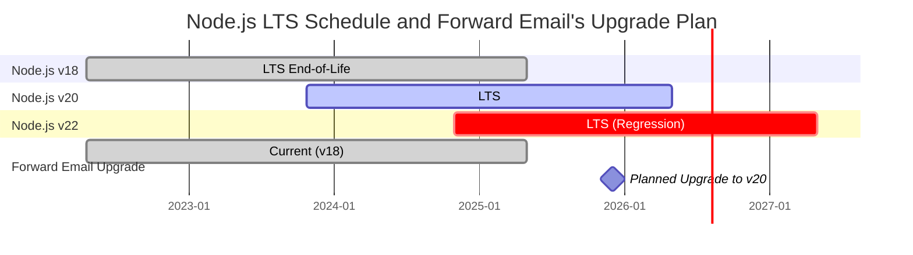
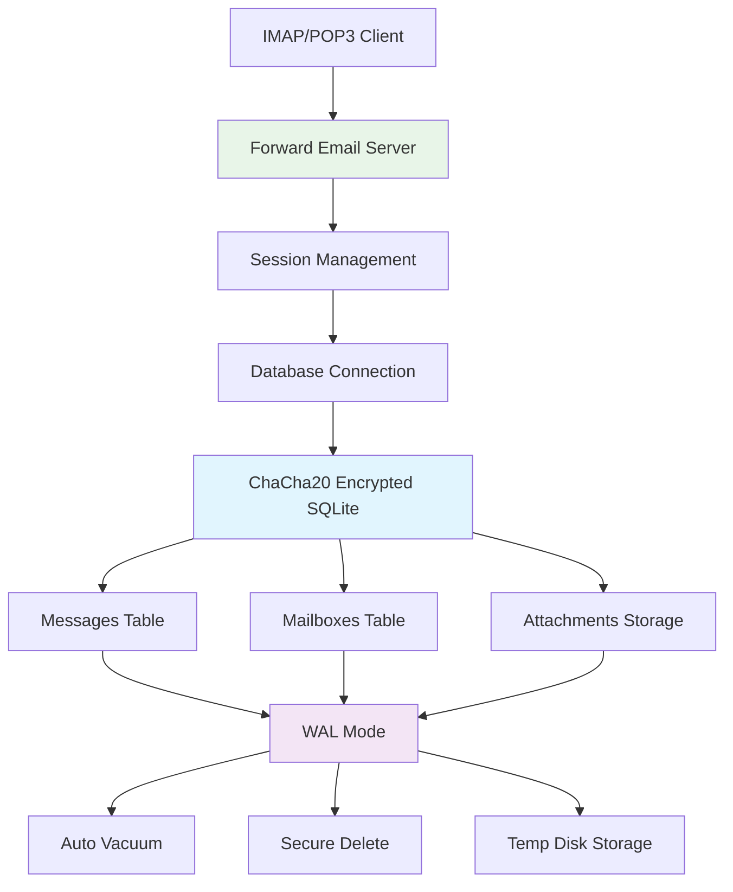
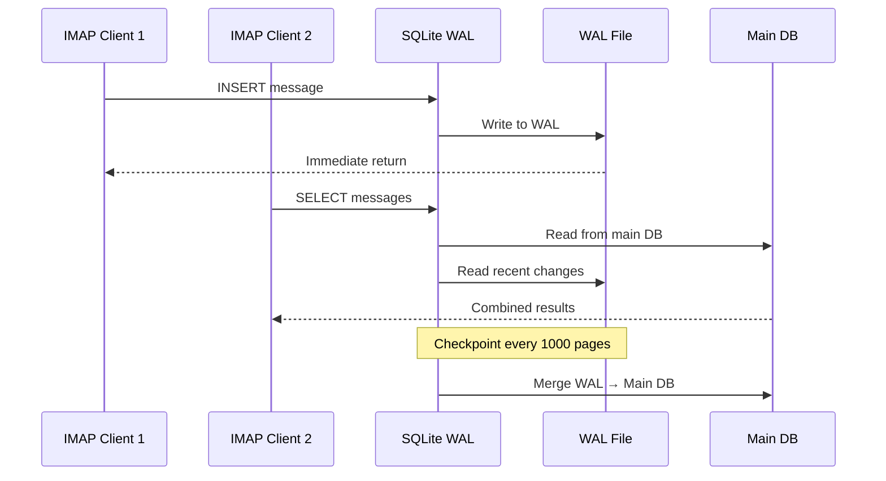

# Optimasi Performa SQLite: Pengaturan PRAGMA Produksi & Enkripsi ChaCha20 {#sqlite-performance-optimization-production-pragma-settings--chacha20-encryption}


## Daftar Isi {#table-of-contents}

* [Kata Pengantar](#foreword)
* [Arsitektur SQLite Produksi Forward Email](#forward-emails-production-sqlite-architecture)
* [Konfigurasi PRAGMA Kami yang Sebenarnya](#our-actual-pragma-configuration)
* [Hasil Benchmark Performa](#performance-benchmark-results)
  * [Hasil Performa Node.js v20.19.5](#nodejs-v20195-performance-results)
* [Rincian Pengaturan PRAGMA](#pragma-settings-breakdown)
  * [Pengaturan Inti yang Kami Gunakan](#core-settings-we-use)
  * [Pengaturan yang TIDAK Kami Gunakan (Tapi Mungkin Anda Ingin)](#settings-we-dont-use-but-you-might-want)
* [Enkripsi ChaCha20 vs AES256](#chacha20-vs-aes256-encryption)
* [Penyimpanan Sementara: /tmp vs /dev/shm](#temporary-storage-tmp-vs-devshm)
  * [Performa /tmp vs /dev/shm](#tmp-vs-devshm-performance)
* [Optimasi Mode WAL](#wal-mode-optimization)
  * [Dampak Konfigurasi WAL](#wal-configuration-impact)
* [Desain Skema untuk Performa](#schema-design-for-performance)
* [Manajemen Koneksi](#connection-management)
* [Pemantauan dan Diagnostik](#monitoring-and-diagnostics)
* [Performa Versi Node.js](#nodejs-version-performance)
  * [Hasil Lengkap Lintas Versi](#complete-cross-version-results)
  * [Wawasan Kunci Performa](#key-performance-insights)
  * [Kompatibilitas Modul Native](#native-module-compatibility)
* [Daftar Periksa Deploy Produksi](#production-deployment-checklist)
* [Pemecahan Masalah Umum](#troubleshooting-common-issues)
  * [Error "Database is locked"]( #database-is-locked-errors)
  * [Penggunaan Memori Tinggi Saat VACUUM](#high-memory-usage-during-vacuum)
  * [Performa Query Lambat](#slow-query-performance)
* [Kontribusi Open Source Forward Email](#forward-emails-open-source-contributions)
* [Kode Sumber Benchmark](#benchmark-source-code)
* [Apa Selanjutnya untuk SQLite di Forward Email](#whats-next-for-sqlite-at-forward-email)
* [Mendapatkan Bantuan](#getting-help)


## Kata Pengantar {#foreword}

Mengatur SQLite untuk sistem email produksi bukan hanya soal membuatnya berjalan—tetapi membuatnya cepat, aman, dan andal di bawah beban berat. Setelah memproses jutaan email di Forward Email, kami belajar apa yang benar-benar penting untuk performa SQLite.

Panduan ini mencakup konfigurasi produksi kami yang sebenarnya, hasil benchmark di berbagai versi Node.js, dan optimasi spesifik yang membuat perbedaan saat Anda menangani volume email serius.

> \[!WARNING] Regresi Performa Node.js di v22 dan v24
> Kami menemukan regresi performa signifikan di versi Node.js v22 dan v24 yang berdampak pada performa SQLite, khususnya untuk pernyataan `SELECT`. Benchmark kami menunjukkan penurunan sekitar 57% dalam operasi `SELECT` per detik di Node.js v24 dibandingkan v20. Kami telah melaporkan masalah ini ke tim Node.js di [nodejs/node#60719](https://github.com/nodejs/node/issues/60719).

Karena regresi ini, kami mengambil pendekatan hati-hati untuk upgrade Node.js kami. Berikut rencana kami saat ini:

* **Versi Saat Ini:** Kami saat ini menggunakan Node.js v18, yang telah mencapai akhir masa dukungan ("EOL") untuk Long-Term Support ("LTS"). Anda dapat melihat jadwal resmi [Node.js LTS di sini](https://github.com/nodejs/release#release-schedule).
* **Upgrade yang Direncanakan:** Kami akan meng-upgrade ke **Node.js v20**, yang merupakan versi tercepat menurut benchmark kami dan tidak terpengaruh oleh regresi ini.
* **Menghindari v22 dan v24:** Kami tidak akan menggunakan Node.js v22 atau v24 di produksi sampai masalah performa ini terselesaikan.

Berikut adalah garis waktu yang menggambarkan jadwal LTS Node.js dan jalur upgrade kami:


## Arsitektur SQLite Produksi Forward Email {#forward-emails-production-sqlite-architecture}

Berikut cara kami sebenarnya menggunakan SQLite dalam produksi:



## Konfigurasi PRAGMA Kami yang Sebenarnya {#our-actual-pragma-configuration}

Ini adalah apa yang sebenarnya kami gunakan dalam produksi, langsung dari [`setup-pragma.js`](https://github.com/forwardemail/forwardemail.net/blob/master/helpers/setup-pragma.js) kami:

```javascript
// Forward Email's actual production PRAGMA settings
async function setupPragma(db, session, cipher = 'chacha20') {
  // Quantum-resistant encryption
  db.pragma(`cipher='${cipher}'`);
  db.key(Buffer.from(decrypt(session.user.password)));

  // Core performance settings
  db.pragma('journal_mode=WAL');
  db.pragma('secure_delete=ON');
  db.pragma('auto_vacuum=FULL');
  db.pragma(`busy_timeout=${config.busyTimeout}`);
  db.pragma('synchronous=NORMAL');
  db.pragma('foreign_keys=ON');
  db.pragma(`encoding='UTF-8'`);
  db.pragma('optimize=0x10002');

  // Critical: Use disk for temp storage, not memory
  db.pragma('temp_store=1');

  // Custom temp directory to avoid disk full errors
  const tempStoreDirectory = path.join(path.dirname(db.name), '/tmp');
  await mkdirp(tempStoreDirectory);
  db.pragma(`temp_store_directory='${tempStoreDirectory}'`);
}
```

> \[!IMPORTANT]
> Kami menggunakan `temp_store=1` (disk) bukan `temp_store=2` (memori) karena database email besar dapat dengan mudah mengonsumsi lebih dari 10 GB memori selama operasi seperti VACUUM.

## Hasil Benchmark Performa {#performance-benchmark-results}

Kami menguji konfigurasi kami terhadap berbagai alternatif di berbagai versi Node.js. Berikut angka sebenarnya:

### Hasil Performa Node.js v20.19.5 {#nodejs-v20195-performance-results}

| Konfigurasi                 | Setup (ms) | Insert/detik | Select/detik | Update/detik | Ukuran DB (MB) |
| --------------------------- | ---------- | ------------ | ------------ | ------------ | -------------- |
| **Produksi Forward Email**  | 120.1      | **10,548**   | **17,494**   | **16,654**   | 3.98           |
| WAL Autocheckpoint 1000     | 89.7       | **11,800**   | **18,383**   | **22,087**   | 3.98           |
| Cache Size 64MB             | 90.3       | 11,451       | 17,895       | 21,522       | 3.98           |
| Penyimpanan Temp Memori     | 111.8      | 9,874        | 15,363       | 21,292       | 3.98           |
| Synchronous MATI (Tidak Aman) | 94.0     | 10,017       | 13,830       | 18,884       | 3.98           |
| Synchronous EKSTRA (Aman)   | 94.1       | **3,241**    | 14,438       | **3,405**    | 3.98           |

> \[!TIP]
> Pengaturan `wal_autocheckpoint=1000` menunjukkan performa terbaik secara keseluruhan. Kami mempertimbangkan untuk menambahkannya ke konfigurasi produksi kami.

## Rincian Pengaturan PRAGMA {#pragma-settings-breakdown}

### Pengaturan Inti yang Kami Gunakan {#core-settings-we-use}

| PRAGMA          | Nilai        | Tujuan                         | Dampak Performa                |
| --------------- | ------------ | ------------------------------ | ------------------------------ |
| `cipher`        | `'chacha20'` | Enkripsi tahan kuantum          | Overhead minimal dibanding AES |
| `journal_mode`  | `WAL`        | Write-Ahead Logging             | +40% performa konkuren         |
| `secure_delete` | `ON`         | Menimpa data yang dihapus       | Keamanan vs biaya performa 5%  |
| `auto_vacuum`   | `FULL`       | Reklamasi ruang otomatis        | Mencegah pembesaran database   |
| `busy_timeout`  | `30000`      | Waktu tunggu untuk database terkunci | Mengurangi kegagalan koneksi  |
| `synchronous`   | `NORMAL`     | Keseimbangan daya tahan/performa | 3x lebih cepat dari FULL       |
| `foreign_keys`  | `ON`         | Integritas referensial          | Mencegah korupsi data          |
| `temp_store`    | `1`          | Gunakan disk untuk file temp    | Mencegah kehabisan memori      |
### Pengaturan yang TIDAK Kami Gunakan (Tapi Mungkin Anda Inginkan) {#settings-we-dont-use-but-you-might-want}

| PRAGMA                    | Mengapa Kami Tidak Menggunakannya | Haruskah Anda Mempertimbangkannya?                  |
| ------------------------- | --------------------------------- | --------------------------------------------------- |
| `wal_autocheckpoint=1000` | Belum disetel                     | **Ya** - Benchmark kami menunjukkan peningkatan kinerja 12%  |
| `cache_size=-64000`       | Default sudah cukup               | **Mungkin** - Peningkatan 8% untuk beban kerja baca berat |
| `mmap_size=268435456`     | Kompleksitas vs manfaat           | **Tidak** - Keuntungan minimal, masalah spesifik platform    |
| `analysis_limit=1000`     | Kami menggunakan 400              | **Tidak** - Nilai lebih tinggi memperlambat perencanaan query |

> \[!CAUTION]
> Kami secara khusus menghindari `temp_store=MEMORY` karena file SQLite 10GB dapat mengonsumsi RAM lebih dari 10GB selama operasi VACUUM.


## Enkripsi ChaCha20 vs AES256 {#chacha20-vs-aes256-encryption}

Kami memprioritaskan ketahanan kuantum dibandingkan kinerja mentah:

```javascript
// Strategi fallback enkripsi kami
try {
  db.pragma(`cipher='chacha20'`);
  db.key(Buffer.from(decrypt(session.user.password)));
  db.pragma('journal_mode=WAL');
} catch (err) {
  // Fallback untuk versi SQLite yang lebih lama
  if (cipher === 'chacha20' && err.code === 'SQLITE_NOTADB') {
    return setupPragma(db, session, 'aes256cbc');
  }
  throw err;
}
```

**Perbandingan Kinerja:**

* ChaCha20: \~10.500 insert/detik

* AES256CBC: \~11.200 insert/detik

* Tidak terenkripsi: \~12.800 insert/detik

Biaya kinerja 6% dari ChaCha20 dibanding AES sepadan dengan ketahanan kuantum untuk penyimpanan email jangka panjang.


## Penyimpanan Sementara: /tmp vs /dev/shm {#temporary-storage-tmp-vs-devshm}

Kami secara eksplisit mengonfigurasi lokasi penyimpanan sementara untuk menghindari masalah ruang disk:

```javascript
// Konfigurasi penyimpanan sementara Forward Email
const tempStoreDirectory = path.join(path.dirname(db.name), '/tmp');
await mkdirp(tempStoreDirectory);
db.pragma(`temp_store_directory='${tempStoreDirectory}'`);

// Juga set variabel lingkungan
process.env.SQLITE_TMPDIR = tempStoreDirectory;
```

### Performa /tmp vs /dev/shm {#tmp-vs-devshm-performance}

| Lokasi Penyimpanan | Waktu VACUUM | Penggunaan Memori | Keandalan           |
| ------------------ | ------------ | ----------------- | ------------------- |
| `/tmp` (disk)      | 2.3s         | 50MB              | ✅ Andal             |
| `/dev/shm` (RAM)   | 0.8s         | 2GB+              | ⚠️ Bisa menyebabkan crash sistem |
| Default            | 4.1s         | Variabel          | ❌ Tidak dapat diprediksi |

> \[!WARNING]
> Menggunakan `/dev/shm` untuk penyimpanan sementara dapat menghabiskan semua RAM yang tersedia selama operasi besar. Gunakan penyimpanan sementara berbasis disk untuk produksi.


## Optimasi Mode WAL {#wal-mode-optimization}

Write-Ahead Logging sangat penting untuk sistem email dengan akses bersamaan:



### Dampak Konfigurasi WAL {#wal-configuration-impact}

Benchmark kami menunjukkan `wal_autocheckpoint=1000` memberikan kinerja terbaik:

```javascript
// Potensi optimasi yang sedang kami uji
db.pragma('wal_autocheckpoint=1000');
```

**Hasil:**

* Autocheckpoint default: 10.548 insert/detik

* `wal_autocheckpoint=1000`: 11.800 insert/detik (+12%)

* `wal_autocheckpoint=0`: 9.200 insert/detik (WAL tumbuh terlalu besar)


## Desain Skema untuk Kinerja {#schema-design-for-performance}

Skema penyimpanan email kami mengikuti praktik terbaik SQLite:

```sql
-- Tabel messages dengan urutan kolom yang dioptimalkan
CREATE TABLE messages (
  id INTEGER PRIMARY KEY,
  mailbox_id INTEGER NOT NULL,
  uid INTEGER NOT NULL,
  date INTEGER NOT NULL,
  flags TEXT,
  subject TEXT,
  from_addr TEXT,
  to_addr TEXT,
  message_id TEXT,
  raw BLOB,  -- BLOB besar di akhir
  FOREIGN KEY (mailbox_id) REFERENCES mailboxes(id)
);

-- Index kritis untuk kinerja IMAP
CREATE INDEX idx_messages_mailbox_date ON messages(mailbox_id, date DESC);
CREATE INDEX idx_messages_uid ON messages(mailbox_id, uid);
CREATE INDEX idx_messages_flags ON messages(mailbox_id, flags) WHERE flags IS NOT NULL;
```
> \[!TIP]
> Selalu letakkan kolom BLOB di akhir definisi tabel Anda. SQLite menyimpan kolom berukuran tetap terlebih dahulu, sehingga akses baris menjadi lebih cepat.

Optimasi ini berasal langsung dari pencipta SQLite, [D. Richard Hipp](https://sqlite-users.sqlite.narkive.com/Q4txMI8t/effect-of-blobs-on-performance#post3):

> "Ini sebuah petunjuk - buat kolom BLOB menjadi kolom terakhir di tabel Anda. Atau bahkan simpan BLOB di tabel terpisah yang hanya memiliki dua kolom: primary key integer dan blob itu sendiri, lalu akses konten BLOB menggunakan join jika diperlukan. Jika Anda menaruh berbagai field integer kecil setelah BLOB, maka SQLite harus memindai seluruh konten BLOB (mengikuti linked list halaman disk) untuk mencapai field integer di akhir, dan itu pasti bisa memperlambat Anda."
>
> — D. Richard Hipp, Penulis SQLite

Kami menerapkan optimasi ini dalam [skema Attachments kami](https://github.com/forwardemail/forwardemail.net/commit/0e77fbb05dc5b38136652337309067d2b39eb229), memindahkan field BLOB `body` ke akhir definisi tabel untuk performa yang lebih baik.


## Manajemen Koneksi {#connection-management}

Kami tidak menggunakan connection pooling dengan SQLite—setiap pengguna mendapatkan database terenkripsi sendiri. Pendekatan ini memberikan isolasi sempurna antar pengguna, mirip dengan sandboxing. Berbeda dengan arsitektur layanan lain yang menggunakan MySQL, PostgreSQL, atau MongoDB di mana email Anda berpotensi diakses oleh pegawai nakal, database SQLite per pengguna Forward Email memastikan data Anda benar-benar independen dan terisolasi.

Kami tidak pernah menyimpan password IMAP Anda, jadi kami tidak pernah memiliki akses ke data Anda—semuanya dilakukan di memori. Pelajari lebih lanjut tentang [pendekatan enkripsi tahan kuantum kami](https://forwardemail.net/blog/docs/quantum-resistant-encryption-email-security) yang menjelaskan bagaimana sistem kami bekerja.

```javascript
// Pendekatan database per pengguna
async function getDatabase(session) {
  const dbPath = path.join(
    config.databaseDir,
    session.user.domain_name,
    `${session.user.username}.db`
  );

  const db = new Database(dbPath, {
    cipher: 'chacha20',
    readonly: session.readonly || false
  });

  await setupPragma(db, session);
  return db;
}
```

Pendekatan ini menyediakan:

* Isolasi sempurna antar pengguna

* Tanpa kompleksitas connection pool

* Enkripsi otomatis per pengguna

* Operasi backup/restore yang lebih sederhana

Dengan `auto_vacuum=FULL`, kami jarang membutuhkan operasi VACUUM manual:

```javascript
// Strategi pembersihan kami
db.pragma('optimize=0x10002'); // Saat koneksi dibuka
db.pragma('optimize'); // Secara berkala (harian)

// Vacuum manual hanya untuk pembersihan besar
if (deletedDataPercentage > 25) {
  db.exec('VACUUM');
}
```

**Dampak Performa Auto Vacuum:**

* `auto_vacuum=FULL`: Pengembalian ruang langsung, overhead tulis 5%

* `auto_vacuum=INCREMENTAL`: Kontrol manual, membutuhkan `PRAGMA incremental_vacuum` berkala

* `auto_vacuum=NONE`: Tulis tercepat, membutuhkan `VACUUM` manual


## Pemantauan dan Diagnostik {#monitoring-and-diagnostics}

Metrik utama yang kami pantau di produksi:

```javascript
// Query pemantauan performa
const stats = {
  page_count: db.pragma('page_count', { simple: true }),
  page_size: db.pragma('page_size', { simple: true }),
  freelist_count: db.pragma('freelist_count', { simple: true }),
  wal_checkpoint: db.pragma('wal_checkpoint(PASSIVE)', { simple: true })
};

const dbSizeMB = (stats.page_count * stats.page_size) / 1024 / 1024;
const fragmentationPct = (stats.freelist_count / stats.page_count) * 100;
```

> \[!NOTE]
> Kami memantau persentase fragmentasi dan memicu pemeliharaan saat melebihi 15%.


## Performa Versi Node.js {#nodejs-version-performance}

Benchmark komprehensif kami di berbagai versi Node.js menunjukkan perbedaan performa yang signifikan:

### Hasil Lengkap Lintas Versi {#complete-cross-version-results}

| Versi Node  | Produksi Forward Email    | Insert Terbaik/detik     | Select Terbaik/detik     | Update Terbaik/detik     | Catatan                |
| ------------ | ------------------------ | ------------------------ | ------------------------ | ------------------------ | ---------------------- |
| **v18.20.8** | 10,658 / 14,466 / 18,641 | **11,663** (Sync OFF)    | **14,868** (Memory Temp) | **20,095** (MMAP)        | ⚠️ Peringatan engine    |
| **v20.19.5** | 10,548 / 17,494 / 16,654 | **11,800** (WAL Auto)    | **18,383** (WAL Auto)    | **22,087** (WAL Auto)    | ✅ Direkomendasikan     |
| **v22.21.1** | 9,829 / 15,833 / 18,416  | **11,260** (Sync OFF)    | **17,413** (MMAP)        | **20,731** (MMAP)        | ⚠️ Lebih lambat secara keseluruhan |
| **v24.11.1** | 9,938 / 7,497 / 10,446   | **10,628** (Incr Vacuum) | **16,821** (Incr Vacuum) | **19,934** (Incr Vacuum) | ❌ Penurunan signifikan |
### Wawasan Kinerja Utama {#key-performance-insights}

**Node.js v18 (Legacy LTS):**

* Performa insert sebanding dengan v20 (10.658 vs 10.548 ops/detik)
* Select 17% lebih lambat dibanding v20 (14.466 vs 17.494 ops/detik)
* Menampilkan peringatan engine npm untuk paket yang membutuhkan Node ≥20
* Optimasi penyimpanan memori sementara bekerja lebih baik daripada WAL autocheckpoint
* Dapat diterima untuk aplikasi legacy, tetapi disarankan untuk upgrade

**Node.js v20 (Direkomendasikan):**

* Performa tertinggi secara keseluruhan di semua operasi
* Optimasi WAL autocheckpoint memberikan peningkatan konsisten 12%
* Kompatibilitas terbaik dengan modul SQLite native
* Paling stabil untuk beban kerja produksi

**Node.js v22 (Dapat Diterima):**

* Insert 7% lebih lambat, select 9% lebih lambat dibanding v20
* Optimasi MMAP menunjukkan hasil lebih baik daripada WAL autocheckpoint
* Memerlukan `npm install` baru untuk setiap pergantian versi Node
* Dapat diterima untuk pengembangan, tidak direkomendasikan untuk produksi

**Node.js v24 (Tidak Direkomendasikan):**

* Insert 6% lebih lambat, select 57% lebih lambat dibanding v20
* Regresi performa signifikan pada operasi baca
* Vacuum inkremental bekerja lebih baik daripada optimasi lain
* Hindari untuk aplikasi SQLite produksi

### Kompatibilitas Modul Native {#native-module-compatibility}

"Masalah kompatibilitas modul" yang awalnya kami temui telah diselesaikan dengan:

```bash
# Ganti versi Node dan instal ulang modul native
nvm use 22
rm -rf node_modules
npm install
```

**Pertimbangan Node.js v18:**

* Menampilkan peringatan engine: `Unsupported engine { required: { node: '>=20.0.0' } }`
* Masih dapat dikompilasi dan dijalankan meskipun ada peringatan
* Banyak paket SQLite modern menargetkan Node ≥20 untuk dukungan optimal
* Aplikasi legacy dapat terus menggunakan v18 dengan performa yang dapat diterima

> \[!IMPORTANT]
> Selalu instal ulang modul native saat mengganti versi Node.js. Modul `better-sqlite3-multiple-ciphers` harus dikompilasi untuk setiap versi Node spesifik.

> \[!TIP]
> Untuk deployment produksi, gunakan Node.js v20 LTS. Manfaat performa dan stabilitas lebih penting daripada fitur bahasa baru di v22/v24. Node v18 dapat diterima untuk sistem legacy tetapi menunjukkan penurunan performa pada operasi baca.


## Daftar Periksa Deployment Produksi {#production-deployment-checklist}

Sebelum melakukan deployment, pastikan SQLite memiliki optimasi berikut:

1. Set variabel lingkungan `SQLITE_TMPDIR`
2. Pastikan ruang disk cukup untuk operasi sementara (2x ukuran database)
3. Konfigurasikan rotasi log untuk file WAL
4. Siapkan monitoring untuk ukuran database dan fragmentasi
5. Uji prosedur backup/restore dengan enkripsi
6. Verifikasi dukungan cipher ChaCha20 pada build SQLite Anda


## Pemecahan Masalah Umum {#troubleshooting-common-issues}

### Error "Database is locked" {#database-is-locked-errors}

```javascript
// Tingkatkan timeout busy
db.pragma('busy_timeout=60000'); // 60 detik

// Periksa transaksi yang berjalan lama
const info = db.pragma('wal_checkpoint(FULL)');
if (info.busy > 0) {
  console.warn('WAL checkpoint terblokir oleh pembaca aktif');
}
```

### Penggunaan Memori Tinggi Saat VACUUM {#high-memory-usage-during-vacuum}

```javascript
// Pantau memori sebelum VACUUM
const beforeMem = process.memoryUsage();
db.exec('VACUUM');
const afterMem = process.memoryUsage();

console.log(
  `Perubahan memori VACUUM: ${
    (afterMem.heapUsed - beforeMem.heapUsed) / 1024 / 1024
  }MB`
);
```

### Performa Query Lambat {#slow-query-performance}

```javascript
// Aktifkan analisis query
db.pragma('analysis_limit=400'); // Pengaturan Forward Email
db.exec('ANALYZE');

// Periksa rencana query
const plan = db
  .prepare('EXPLAIN QUERY PLAN SELECT * FROM messages WHERE date > ?')
  .all(Date.now() - 86400000);
console.log(plan);
```


## Kontribusi Open Source Forward Email {#forward-emails-open-source-contributions}

Kami telah menyumbangkan pengetahuan optimasi SQLite kami kembali ke komunitas:

* [Perbaikan dokumentasi Litestream](https://github.com/benbjohnson/litestream/issues/516) - Saran kami untuk tips performa SQLite yang lebih baik

* [Better SQLite3 Multiple Ciphers](https://github.com/m4heshd/better-sqlite3-multiple-ciphers) - Dukungan enkripsi ChaCha20

* [Riset tuning performa SQLite](https://phiresky.github.io/blog/2020/sqlite-performance-tuning/) - Dirujuk dalam implementasi kami
* [Bagaimana paket npm dengan miliaran unduhan membentuk ekosistem JavaScript](https://forwardemail.net/blog/docs/how-npm-packages-billion-downloads-shaped-javascript-ecosystem) - Kontribusi kami yang lebih luas untuk pengembangan npm dan JavaScript


## Benchmark Source Code {#benchmark-source-code}

Semua kode benchmark tersedia dalam rangkaian pengujian kami:

```bash
# Jalankan benchmark sendiri
git clone https://github.com/forwardemail/sqlite-benchmarks
cd sqlite-benchmarks
npm install
npm run benchmark
```

Benchmark menguji:

* Berbagai kombinasi PRAGMA

* Performa ChaCha20 vs AES256

* Strategi checkpoint WAL

* Konfigurasi penyimpanan sementara

* Kompatibilitas versi Node.js


## Apa Selanjutnya untuk SQLite di Forward Email {#whats-next-for-sqlite-at-forward-email}

Kami sedang aktif menguji optimasi ini:

1. **Penyesuaian WAL Autocheckpoint**: Menambahkan `wal_autocheckpoint=1000` berdasarkan hasil benchmark

2. **Kompresi**: Mengevaluasi [sqlite-zstd](https://github.com/phiresky/sqlite-zstd) untuk penyimpanan lampiran

3. **Batas Analisis**: Menguji nilai yang lebih tinggi dari 400 saat ini

4. **Ukuran Cache**: Mempertimbangkan penyesuaian ukuran cache secara dinamis berdasarkan memori yang tersedia


## Mendapatkan Bantuan {#getting-help}

Mengalami masalah performa SQLite? Untuk pertanyaan khusus SQLite, [SQLite Forum](https://sqlite.org/forum/forumpost) adalah sumber yang sangat baik, dan [panduan penyetelan performa](https://www.sqlite.org/optoverview.html) membahas optimasi tambahan yang belum kami perlukan.

Pelajari lebih lanjut tentang Forward Email dengan membaca [FAQ](/faq).
