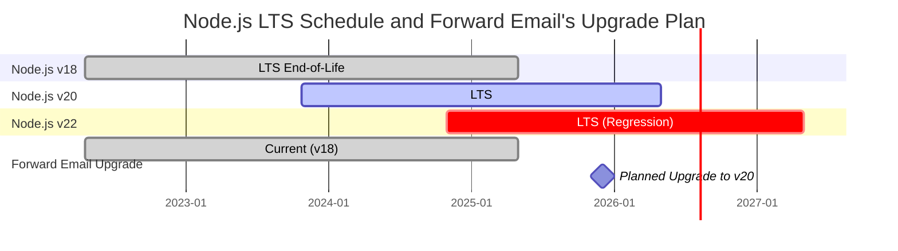
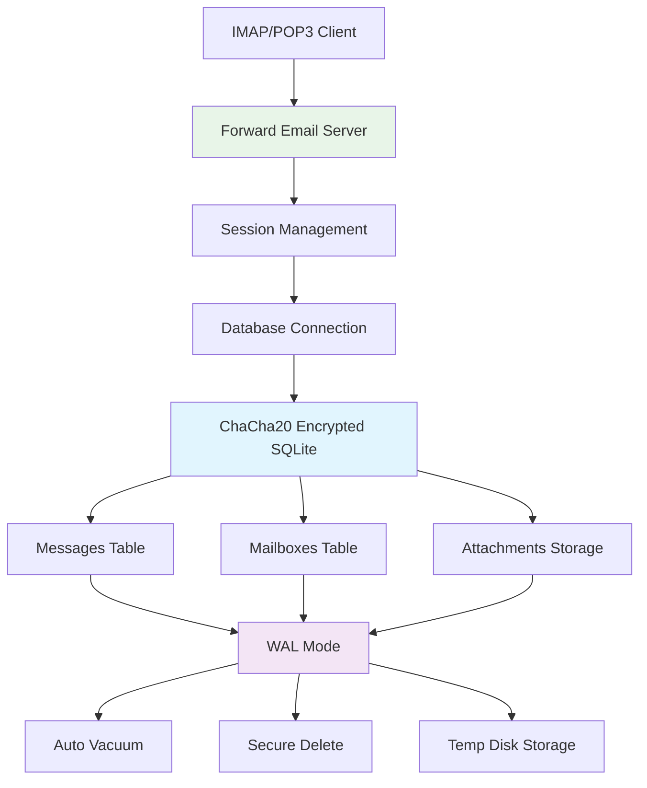
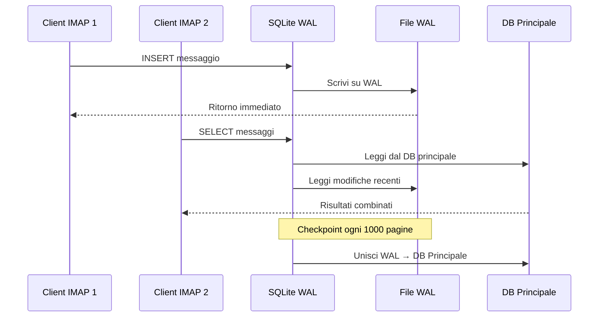

# Ottimizzazione delle Prestazioni di SQLite: Impostazioni PRAGMA di Produzione & Crittografia ChaCha20 {#sqlite-performance-optimization-production-pragma-settings--chacha20-encryption}


## Indice {#table-of-contents}

* [Prefazione](#foreword)
* [Architettura SQLite di Produzione di Forward Email](#forward-emails-production-sqlite-architecture)
* [La Nostra Configurazione PRAGMA Attuale](#our-actual-pragma-configuration)
* [Risultati del Benchmark delle Prestazioni](#performance-benchmark-results)
  * [Risultati delle Prestazioni Node.js v20.19.5](#nodejs-v20195-performance-results)
* [Analisi delle Impostazioni PRAGMA](#pragma-settings-breakdown)
  * [Impostazioni Core che Utilizziamo](#core-settings-we-use)
  * [Impostazioni che NON Utilizziamo (Ma Potresti Voler)](#settings-we-dont-use-but-you-might-want)
* [Crittografia ChaCha20 vs AES256](#chacha20-vs-aes256-encryption)
* [Archiviazione Temporanea: /tmp vs /dev/shm](#temporary-storage-tmp-vs-devshm)
  * [Prestazioni /tmp vs /dev/shm](#tmp-vs-devshm-performance)
* [Ottimizzazione della Modalità WAL](#wal-mode-optimization)
  * [Impatto della Configurazione WAL](#wal-configuration-impact)
* [Progettazione dello Schema per le Prestazioni](#schema-design-for-performance)
* [Gestione delle Connessioni](#connection-management)
* [Monitoraggio e Diagnostica](#monitoring-and-diagnostics)
* [Prestazioni delle Versioni di Node.js](#nodejs-version-performance)
  * [Risultati Completi Cross-Versione](#complete-cross-version-results)
  * [Principali Approfondimenti sulle Prestazioni](#key-performance-insights)
  * [Compatibilità del Modulo Nativo](#native-module-compatibility)
* [Checklist per il Deployment in Produzione](#production-deployment-checklist)
* [Risoluzione dei Problemi Comuni](#troubleshooting-common-issues)
  * [Errori "Database is locked"](#database-is-locked-errors)
  * [Elevato Utilizzo di Memoria Durante VACUUM](#high-memory-usage-during-vacuum)
  * [Prestazioni Lente delle Query](#slow-query-performance)
* [Contributi Open Source di Forward Email](#forward-emails-open-source-contributions)
* [Codice Sorgente del Benchmark](#benchmark-source-code)
* [Prossimi Passi per SQLite in Forward Email](#whats-next-for-sqlite-at-forward-email)
* [Come Ottenere Aiuto](#getting-help)


## Prefazione {#foreword}

Configurare SQLite per sistemi email di produzione non significa solo farlo funzionare—significa renderlo veloce, sicuro e affidabile sotto carichi pesanti. Dopo aver processato milioni di email con Forward Email, abbiamo imparato cosa conta davvero per le prestazioni di SQLite.

Questa guida copre la nostra configurazione reale di produzione, i risultati dei benchmark attraverso le versioni di Node.js, e le ottimizzazioni specifiche che fanno la differenza quando gestisci un volume serio di email.

> \[!WARNING] Regressioni di Prestazioni in Node.js v22 e v24  
> Abbiamo scoperto una regressione significativa delle prestazioni nelle versioni di Node.js v22 e v24 che impatta le prestazioni di SQLite, in particolare per le istruzioni `SELECT`. I nostri benchmark mostrano un calo di circa il 57% nelle operazioni `SELECT` al secondo in Node.js v24 rispetto a v20. Abbiamo segnalato questo problema al team di Node.js in [nodejs/node#60719](https://github.com/nodejs/node/issues/60719).

A causa di questa regressione, stiamo adottando un approccio prudente agli aggiornamenti di Node.js. Ecco il nostro piano attuale:

* **Versione Attuale:** Attualmente utilizziamo Node.js v18, che ha raggiunto la fine del ciclo di vita ("EOL") per il supporto a lungo termine ("LTS"). Puoi consultare il [calendario ufficiale LTS di Node.js qui](https://github.com/nodejs/release#release-schedule).
* **Aggiornamento Programmato:** Aggiorneremo a **Node.js v20**, che è la versione più veloce secondo i nostri benchmark e non è affetta da questa regressione.
* **Evitare v22 e v24:** Non utilizzeremo Node.js v22 o v24 in produzione finché questo problema di prestazioni non sarà risolto.

Ecco una timeline che illustra il calendario LTS di Node.js e il nostro percorso di aggiornamento:


## Architettura SQLite di Produzione di Forward Email {#forward-emails-production-sqlite-architecture}

Ecco come utilizziamo effettivamente SQLite in produzione:




## La Nostra Configurazione PRAGMA Attuale {#our-actual-pragma-configuration}

Questo è ciò che usiamo effettivamente in produzione, direttamente dal nostro [`setup-pragma.js`](https://github.com/forwardemail/forwardemail.net/blob/master/helpers/setup-pragma.js):

```javascript
// Forward Email's actual production PRAGMA settings
async function setupPragma(db, session, cipher = 'chacha20') {
  // Quantum-resistant encryption
  db.pragma(`cipher='${cipher}'`);
  db.key(Buffer.from(decrypt(session.user.password)));

  // Core performance settings
  db.pragma('journal_mode=WAL');
  db.pragma('secure_delete=ON');
  db.pragma('auto_vacuum=FULL');
  db.pragma(`busy_timeout=${config.busyTimeout}`);
  db.pragma('synchronous=NORMAL');
  db.pragma('foreign_keys=ON');
  db.pragma(`encoding='UTF-8'`);
  db.pragma('optimize=0x10002');

  // Critical: Use disk for temp storage, not memory
  db.pragma('temp_store=1');

  // Custom temp directory to avoid disk full errors
  const tempStoreDirectory = path.join(path.dirname(db.name), '/tmp');
  await mkdirp(tempStoreDirectory);
  db.pragma(`temp_store_directory='${tempStoreDirectory}'`);
}
```

> \[!IMPORTANT]
> Usiamo `temp_store=1` (disco) invece di `temp_store=2` (memoria) perché grandi database di email possono facilmente consumare più di 10 GB di memoria durante operazioni come VACUUM.


## Risultati del Benchmark delle Prestazioni {#performance-benchmark-results}

Abbiamo testato la nostra configurazione rispetto a varie alternative su diverse versioni di Node.js. Ecco i numeri reali:

### Risultati delle Prestazioni di Node.js v20.19.5 {#nodejs-v20195-performance-results}

| Configurazione               | Setup (ms) | Insert/sec | Select/sec | Update/sec | Dimensione DB (MB) |
| --------------------------- | ---------- | ---------- | ---------- | ---------- | ------------------ |
| **Produzione Forward Email**| 120.1      | **10,548** | **17,494** | **16,654** | 3.98               |
| WAL Autocheckpoint 1000     | 89.7       | **11,800** | **18,383** | **22,087** | 3.98               |
| Cache Size 64MB             | 90.3       | 11,451     | 17,895     | 21,522     | 3.98               |
| Memoria Temp Storage        | 111.8      | 9,874      | 15,363     | 21,292     | 3.98               |
| Synchronous OFF (Non Sicuro)| 94.0       | 10,017     | 13,830     | 18,884     | 3.98               |
| Synchronous EXTRA (Sicuro)  | 94.1       | **3,241**  | 14,438     | **3,405**  | 3.98               |

> \[!TIP]
> L'impostazione `wal_autocheckpoint=1000` mostra le migliori prestazioni complessive. Stiamo considerando di aggiungerla alla nostra configurazione di produzione.


## Dettaglio delle Impostazioni PRAGMA {#pragma-settings-breakdown}

### Impostazioni Core che Utilizziamo {#core-settings-we-use}

| PRAGMA          | Valore       | Scopo                          | Impatto sulle Prestazioni       |
| --------------- | ------------ | ------------------------------ | ------------------------------- |
| `cipher`        | `'chacha20'` | Crittografia resistente quantistica | Sovraccarico minimo rispetto ad AES |
| `journal_mode`  | `WAL`        | Write-Ahead Logging            | +40% di prestazioni concorrenti  |
| `secure_delete` | `ON`         | Sovrascrive i dati cancellati | Sicurezza vs costo prestazionale del 5% |
| `auto_vacuum`   | `FULL`       | Recupero automatico dello spazio | Previene il gonfiamento del database |
| `busy_timeout`  | `30000`      | Tempo di attesa per database bloccato | Riduce i fallimenti di connessione |
| `synchronous`   | `NORMAL`     | Durabilità/prestazioni bilanciate | 3 volte più veloce di FULL       |
| `foreign_keys`  | `ON`         | Integrità referenziale         | Previene la corruzione dei dati  |
| `temp_store`    | `1`          | Usa il disco per i file temporanei | Previene l'esaurimento della memoria |
### Impostazioni che NON Usiano (Ma Potresti Volerle) {#settings-we-dont-use-but-you-might-want}

| PRAGMA                    | Perché Non Lo Usiamo  | Dovresti Considerarlo?                             |
| ------------------------- | --------------------- | ------------------------------------------------- |
| `wal_autocheckpoint=1000` | Non ancora impostato  | **Sì** - I nostri benchmark mostrano un guadagno del 12% in prestazioni  |
| `cache_size=-64000`       | Il valore predefinito è sufficiente | **Forse** - Miglioramento dell'8% per carichi di lavoro con molte letture |
| `mmap_size=268435456`     | Complessità vs beneficio | **No** - Guadagni minimi, problemi specifici della piattaforma    |
| `analysis_limit=1000`     | Usiamo 400            | **No** - Valori più alti rallentano la pianificazione delle query     |

> \[!CAUTION]
> Evitiamo specificamente `temp_store=MEMORY` perché un file SQLite da 10GB può consumare più di 10 GB di RAM durante le operazioni VACUUM.


## Crittografia ChaCha20 vs AES256 {#chacha20-vs-aes256-encryption}

Diamo priorità alla resistenza quantistica rispetto alle prestazioni pure:

```javascript
// La nostra strategia di fallback per la crittografia
try {
  db.pragma(`cipher='chacha20'`);
  db.key(Buffer.from(decrypt(session.user.password)));
  db.pragma('journal_mode=WAL');
} catch (err) {
  // Fallback per versioni SQLite più vecchie
  if (cipher === 'chacha20' && err.code === 'SQLITE_NOTADB') {
    return setupPragma(db, session, 'aes256cbc');
  }
  throw err;
}
```

**Confronto delle Prestazioni:**

* ChaCha20: \~10.500 inserimenti/sec

* AES256CBC: \~11.200 inserimenti/sec

* Non crittografato: \~12.800 inserimenti/sec

Il costo in prestazioni del 6% di ChaCha20 rispetto ad AES vale la resistenza quantistica per l'archiviazione email a lungo termine.


## Archiviazione Temporanea: /tmp vs /dev/shm {#temporary-storage-tmp-vs-devshm}

Configuriamo esplicitamente la posizione dell'archiviazione temporanea per evitare problemi di spazio su disco:

```javascript
// Configurazione dell'archiviazione temporanea di Forward Email
const tempStoreDirectory = path.join(path.dirname(db.name), '/tmp');
await mkdirp(tempStoreDirectory);
db.pragma(`temp_store_directory='${tempStoreDirectory}'`);

// Impostiamo anche la variabile d'ambiente
process.env.SQLITE_TMPDIR = tempStoreDirectory;
```

### Prestazioni /tmp vs /dev/shm {#tmp-vs-devshm-performance}

| Posizione Archiviazione | Tempo VACUUM | Uso Memoria | Affidabilità         |
| ----------------------- | ------------ | ----------- | -------------------- |
| `/tmp` (disco)          | 2.3s         | 50MB        | ✅ Affidabile         |
| `/dev/shm` (RAM)        | 0.8s         | 2GB+        | ⚠️ Può causare crash del sistema |
| Predefinito             | 4.1s         | Variabile   | ❌ Imprevedibile      |

> \[!WARNING]
> Usare `/dev/shm` per l'archiviazione temporanea può consumare tutta la RAM disponibile durante operazioni di grandi dimensioni. Per la produzione, resta sull'archiviazione temporanea su disco.


## Ottimizzazione della Modalità WAL {#wal-mode-optimization}

Write-Ahead Logging è cruciale per sistemi email con accesso concorrente:



### Impatto della Configurazione WAL {#wal-configuration-impact}

I nostri benchmark mostrano che `wal_autocheckpoint=1000` offre le migliori prestazioni:

```javascript
// Ottimizzazione potenziale che stiamo testando
db.pragma('wal_autocheckpoint=1000');
```

**Risultati:**

* Autocheckpoint predefinito: 10.548 inserimenti/sec

* `wal_autocheckpoint=1000`: 11.800 inserimenti/sec (+12%)

* `wal_autocheckpoint=0`: 9.200 inserimenti/sec (WAL cresce troppo)


## Progettazione dello Schema per le Prestazioni {#schema-design-for-performance}

Il nostro schema di archiviazione email segue le migliori pratiche SQLite:

```sql
-- Tabella messaggi con ordine colonne ottimizzato
CREATE TABLE messages (
  id INTEGER PRIMARY KEY,
  mailbox_id INTEGER NOT NULL,
  uid INTEGER NOT NULL,
  date INTEGER NOT NULL,
  flags TEXT,
  subject TEXT,
  from_addr TEXT,
  to_addr TEXT,
  message_id TEXT,
  raw BLOB,  -- BLOB grande alla fine
  FOREIGN KEY (mailbox_id) REFERENCES mailboxes(id)
);

-- Indici critici per le prestazioni IMAP
CREATE INDEX idx_messages_mailbox_date ON messages(mailbox_id, date DESC);
CREATE INDEX idx_messages_uid ON messages(mailbox_id, uid);
CREATE INDEX idx_messages_flags ON messages(mailbox_id, flags) WHERE flags IS NOT NULL;
```
> \[!TIP]
> Metti sempre le colonne BLOB alla fine della definizione della tua tabella. SQLite memorizza prima le colonne a dimensione fissa, rendendo più veloce l'accesso alle righe.

Questa ottimizzazione viene direttamente dal creatore di SQLite, [D. Richard Hipp](https://sqlite-users.sqlite.narkive.com/Q4txMI8t/effect-of-blobs-on-performance#post3):

> "Ecco un suggerimento però - fai in modo che le colonne BLOB siano l'ultima colonna nelle tue tabelle. Oppure memorizza i BLOB in una tabella separata che abbia solo due colonne: una chiave primaria intera e il blob stesso, e poi accedi al contenuto del BLOB usando una join se necessario. Se metti vari piccoli campi interi dopo il BLOB, allora SQLite deve scansionare l'intero contenuto del BLOB (seguendo la lista collegata delle pagine su disco) per arrivare ai campi interi alla fine, e questo sicuramente può rallentarti."
>
> — D. Richard Hipp, Autore di SQLite

Abbiamo implementato questa ottimizzazione nel nostro [schema Attachments](https://github.com/forwardemail/forwardemail.net/commit/0e77fbb05dc5b38136652337309067d2b39eb229), spostando il campo BLOB `body` alla fine della definizione della tabella per migliorare le prestazioni.


## Gestione della Connessione {#connection-management}

Non usiamo il connection pooling con SQLite—ogni utente ha il proprio database criptato. Questo approccio fornisce un'isolamento perfetto tra gli utenti, simile al sandboxing. A differenza delle architetture di altri servizi che usano MySQL, PostgreSQL o MongoDB dove la tua email potrebbe potenzialmente essere accessibile da un dipendente malintenzionato, i database SQLite per utente di Forward Email garantiscono che i tuoi dati siano completamente indipendenti e isolati.

Non memorizziamo mai la tua password IMAP, quindi non abbiamo mai accesso ai tuoi dati—tutto avviene in memoria. Scopri di più sul nostro [approccio di crittografia resistente al quantum](https://forwardemail.net/blog/docs/quantum-resistant-encryption-email-security) che spiega come funziona il nostro sistema.

```javascript
// Approccio database per utente
async function getDatabase(session) {
  const dbPath = path.join(
    config.databaseDir,
    session.user.domain_name,
    `${session.user.username}.db`
  );

  const db = new Database(dbPath, {
    cipher: 'chacha20',
    readonly: session.readonly || false
  });

  await setupPragma(db, session);
  return db;
}
```

Questo approccio offre:

* Isolamento perfetto tra gli utenti

* Nessuna complessità di connection pool

* Crittografia automatica per utente

* Operazioni di backup/restore più semplici

Con `auto_vacuum=FULL`, raramente abbiamo bisogno di operazioni manuali di VACUUM:

```javascript
// La nostra strategia di pulizia
db.pragma('optimize=0x10002'); // All'apertura della connessione
db.pragma('optimize'); // Periodicamente (giornalmente)

// Vacuum manuale solo per pulizie importanti
if (deletedDataPercentage > 25) {
  db.exec('VACUUM');
}
```

**Impatto sulle prestazioni di Auto Vacuum:**

* `auto_vacuum=FULL`: Recupero immediato dello spazio, 5% di overhead in scrittura

* `auto_vacuum=INCREMENTAL`: Controllo manuale, richiede `PRAGMA incremental_vacuum` periodico

* `auto_vacuum=NONE`: Scritture più veloci, richiede `VACUUM` manuale


## Monitoraggio e Diagnostica {#monitoring-and-diagnostics}

Metriche chiave che monitoriamo in produzione:

```javascript
// Query di monitoraggio delle prestazioni
const stats = {
  page_count: db.pragma('page_count', { simple: true }),
  page_size: db.pragma('page_size', { simple: true }),
  freelist_count: db.pragma('freelist_count', { simple: true }),
  wal_checkpoint: db.pragma('wal_checkpoint(PASSIVE)', { simple: true })
};

const dbSizeMB = (stats.page_count * stats.page_size) / 1024 / 1024;
const fragmentationPct = (stats.freelist_count / stats.page_count) * 100;
```

> \[!NOTE]
> Monitoriamo la percentuale di frammentazione e avviamo la manutenzione quando supera il 15%.


## Prestazioni della Versione Node.js {#nodejs-version-performance}

I nostri benchmark completi tra le versioni di Node.js rivelano differenze significative nelle prestazioni:

### Risultati Completi Cross-Versione {#complete-cross-version-results}

| Versione Node | Forward Email Produzione | Miglior Insert/sec       | Miglior Select/sec       | Miglior Update/sec       | Note                   |
| ------------ | ------------------------ | ------------------------ | ------------------------ | ------------------------ | ---------------------- |
| **v18.20.8** | 10,658 / 14,466 / 18,641 | **11,663** (Sync OFF)    | **14,868** (Memory Temp) | **20,095** (MMAP)        | ⚠️ Avviso motore        |
| **v20.19.5** | 10,548 / 17,494 / 16,654 | **11,800** (WAL Auto)    | **18,383** (WAL Auto)    | **22,087** (WAL Auto)    | ✅ Raccomandato         |
| **v22.21.1** | 9,829 / 15,833 / 18,416  | **11,260** (Sync OFF)    | **17,413** (MMAP)        | **20,731** (MMAP)        | ⚠️ Complessivamente più lento |
| **v24.11.1** | 9,938 / 7,497 / 10,446   | **10,628** (Incr Vacuum) | **16,821** (Incr Vacuum) | **19,934** (Incr Vacuum) | ❌ Rallentamento significativo |
### Approfondimenti sulle Prestazioni Chiave {#key-performance-insights}

**Node.js v18 (Legacy LTS):**

* Prestazioni di inserimento comparabili a v20 (10.658 vs 10.548 ops/sec)
* Selezioni il 17% più lente rispetto a v20 (14.466 vs 17.494 ops/sec)
* Mostra avvisi npm engine per pacchetti che richiedono Node ≥20
* L’ottimizzazione della memorizzazione temporanea in memoria funziona meglio dell’autocheckpoint WAL
* Accettabile per applicazioni legacy, ma si consiglia l’aggiornamento

**Node.js v20 (Consigliato):**

* Prestazioni complessive più elevate in tutte le operazioni
* L’ottimizzazione dell’autocheckpoint WAL fornisce un incremento costante del 12%
* Migliore compatibilità con moduli SQLite nativi
* Più stabile per carichi di lavoro in produzione

**Node.js v22 (Accettabile):**

* Inserimenti il 7% più lenti, selezioni il 9% più lente rispetto a v20
* L’ottimizzazione MMAP mostra risultati migliori rispetto all’autocheckpoint WAL
* Richiede un nuovo `npm install` per ogni cambio di versione Node
* Accettabile per sviluppo, non consigliato per produzione

**Node.js v24 (Non Consigliato):**

* Inserimenti il 6% più lenti, selezioni il 57% più lente rispetto a v20
* Regresso significativo delle prestazioni nelle operazioni di lettura
* Il vacuum incrementale funziona meglio delle altre ottimizzazioni
* Da evitare per applicazioni SQLite in produzione

### Compatibilità dei Moduli Nativi {#native-module-compatibility}

I "problemi di compatibilità dei moduli" inizialmente riscontrati sono stati risolti con:

```bash
# Cambia versione di Node e reinstalla i moduli nativi
nvm use 22
rm -rf node_modules
npm install
```

**Considerazioni su Node.js v18:**

* Mostra avvisi engine: `Unsupported engine { required: { node: '>=20.0.0' } }`
* Compila ed esegue comunque con successo nonostante gli avvisi
* Molti pacchetti SQLite moderni puntano a Node ≥20 per supporto ottimale
* Le applicazioni legacy possono continuare a usare v18 con prestazioni accettabili

> \[!IMPORTANT]
> Reinstalla sempre i moduli nativi quando cambi versione di Node.js. Il modulo `better-sqlite3-multiple-ciphers` deve essere compilato per ogni versione specifica di Node.

> \[!TIP]
> Per le distribuzioni in produzione, usa Node.js v20 LTS. I benefici in termini di prestazioni e stabilità superano le nuove funzionalità di linguaggio in v22/v24. Node v18 è accettabile per sistemi legacy ma mostra un degrado delle prestazioni nelle operazioni di lettura.


## Checklist per il Deployment in Produzione {#production-deployment-checklist}

Prima di distribuire, assicurati che SQLite abbia queste ottimizzazioni:

1. Imposta la variabile d’ambiente `SQLITE_TMPDIR`
2. Garantire spazio su disco adeguato per operazioni temporanee (2x dimensione del database)
3. Configura la rotazione dei log per i file WAL
4. Imposta il monitoraggio per dimensione e frammentazione del database
5. Testa le procedure di backup/restore con crittografia
6. Verifica il supporto del cifrario ChaCha20 nella tua build di SQLite


## Risoluzione dei Problemi Comuni {#troubleshooting-common-issues}

### Errori "Database is locked" {#database-is-locked-errors}

```javascript
// Aumenta il timeout busy
db.pragma('busy_timeout=60000'); // 60 secondi

// Controlla transazioni a lunga durata
const info = db.pragma('wal_checkpoint(FULL)');
if (info.busy > 0) {
  console.warn('Checkpoint WAL bloccato da lettori attivi');
}
```

### Alto Utilizzo di Memoria Durante VACUUM {#high-memory-usage-during-vacuum}

```javascript
// Monitora la memoria prima del VACUUM
const beforeMem = process.memoryUsage();
db.exec('VACUUM');
const afterMem = process.memoryUsage();

console.log(
  `Delta memoria VACUUM: ${
    (afterMem.heapUsed - beforeMem.heapUsed) / 1024 / 1024
  }MB`
);
```

### Prestazioni Lente delle Query {#slow-query-performance}

```javascript
// Abilita l’analisi delle query
db.pragma('analysis_limit=400'); // Impostazione di Forward Email
db.exec('ANALYZE');

// Controlla i piani delle query
const plan = db
  .prepare('EXPLAIN QUERY PLAN SELECT * FROM messages WHERE date > ?')
  .all(Date.now() - 86400000);
console.log(plan);
```


## Contributi Open Source di Forward Email {#forward-emails-open-source-contributions}

Abbiamo restituito alla comunità le nostre conoscenze sull’ottimizzazione di SQLite:

* [Miglioramenti alla documentazione di Litestream](https://github.com/benbjohnson/litestream/issues/516) - I nostri suggerimenti per migliori consigli sulle prestazioni di SQLite

* [Better SQLite3 Multiple Ciphers](https://github.com/m4heshd/better-sqlite3-multiple-ciphers) - Supporto crittografia ChaCha20

* [Ricerca sul tuning delle prestazioni di SQLite](https://phiresky.github.io/blog/2020/sqlite-performance-tuning/) - Citata nella nostra implementazione
* [Come i pacchetti npm con miliardi di download hanno plasmato l'ecosistema JavaScript](https://forwardemail.net/blog/docs/how-npm-packages-billion-downloads-shaped-javascript-ecosystem) - I nostri contributi più ampi a npm e allo sviluppo JavaScript


## Codice Sorgente del Benchmark {#benchmark-source-code}

Tutto il codice del benchmark è disponibile nella nostra suite di test:

```bash
# Esegui i benchmark da solo
git clone https://github.com/forwardemail/sqlite-benchmarks
cd sqlite-benchmarks
npm install
npm run benchmark
```

I benchmark testano:

* Varie combinazioni di PRAGMA

* Prestazioni di ChaCha20 vs AES256

* Strategie di checkpoint WAL

* Configurazioni di storage temporaneo

* Compatibilità con versioni di Node.js


## Cosa Succede Dopo per SQLite in Forward Email {#whats-next-for-sqlite-at-forward-email}

Stiamo testando attivamente queste ottimizzazioni:

1. **Regolazione del WAL Autocheckpoint**: Aggiunta di `wal_autocheckpoint=1000` basata sui risultati del benchmark

2. **Compressione**: Valutazione di [sqlite-zstd](https://github.com/phiresky/sqlite-zstd) per l'archiviazione degli allegati

3. **Limite di Analisi**: Test di valori più alti rispetto al nostro attuale 400

4. **Dimensione della Cache**: Considerazione di una dimensione dinamica della cache basata sulla memoria disponibile


## Ottenere Aiuto {#getting-help}

Hai problemi di prestazioni con SQLite? Per domande specifiche su SQLite, il [Forum SQLite](https://sqlite.org/forum/forumpost) è una risorsa eccellente, e la [guida all'ottimizzazione delle prestazioni](https://www.sqlite.org/optoverview.html) copre ulteriori ottimizzazioni che non abbiamo ancora avuto bisogno di applicare.

Scopri di più su Forward Email leggendo la nostra [FAQ](/faq).
