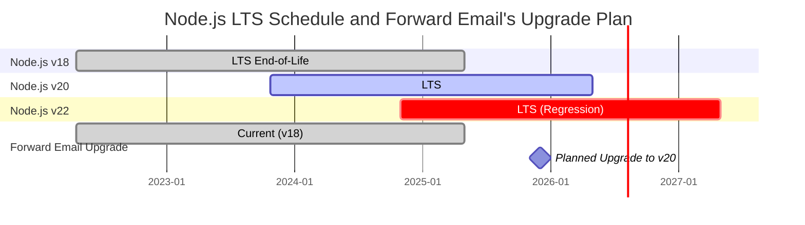
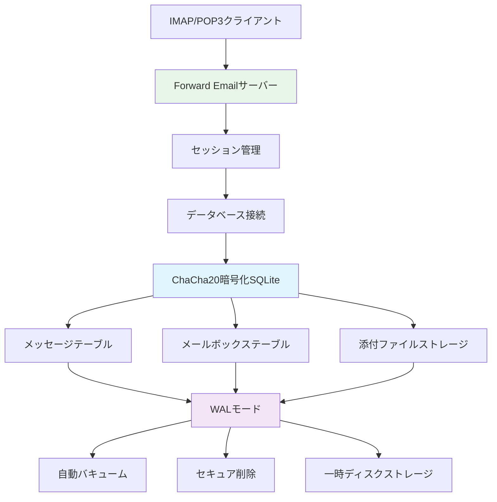
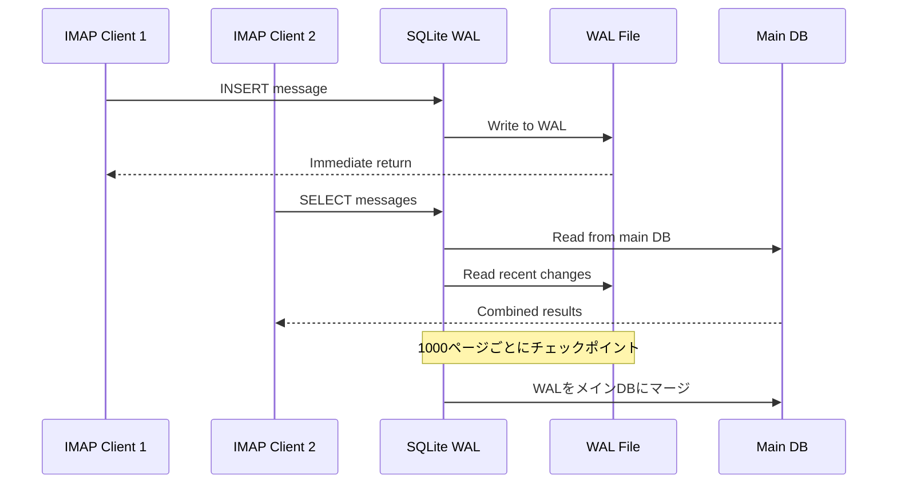

# SQLite パフォーマンス最適化：本番用 PRAGMA 設定と ChaCha20 暗号化 {#sqlite-performance-optimization-production-pragma-settings--chacha20-encryption}


## 目次 {#table-of-contents}

* [はじめに](#foreword)
* [Forward Email の本番用 SQLite アーキテクチャ](#forward-emails-production-sqlite-architecture)
* [実際の PRAGMA 設定](#our-actual-pragma-configuration)
* [パフォーマンスベンチマーク結果](#performance-benchmark-results)
  * [Node.js v20.19.5 パフォーマンス結果](#nodejs-v20195-performance-results)
* [PRAGMA 設定の詳細](#pragma-settings-breakdown)
  * [使用しているコア設定](#core-settings-we-use)
  * [使用していない設定（しかし必要かもしれないもの）](#settings-we-dont-use-but-you-might-want)
* [ChaCha20 と AES256 暗号化の比較](#chacha20-vs-aes256-encryption)
* [一時ストレージ：/tmp と /dev/shm の比較](#temporary-storage-tmp-vs-devshm)
  * [/tmp と /dev/shm のパフォーマンス](#tmp-vs-devshm-performance)
* [WAL モードの最適化](#wal-mode-optimization)
  * [WAL 設定の影響](#wal-configuration-impact)
* [パフォーマンスのためのスキーマ設計](#schema-design-for-performance)
* [接続管理](#connection-management)
* [監視と診断](#monitoring-and-diagnostics)
* [Node.js バージョン別パフォーマンス](#nodejs-version-performance)
  * [全バージョンの結果](#complete-cross-version-results)
  * [主要なパフォーマンスの洞察](#key-performance-insights)
  * [ネイティブモジュールの互換性](#native-module-compatibility)
* [本番環境デプロイチェックリスト](#production-deployment-checklist)
* [よくある問題のトラブルシューティング](#troubleshooting-common-issues)
  * [「データベースがロックされています」エラー](#database-is-locked-errors)
  * [VACUUM 実行中の高メモリ使用](#high-memory-usage-during-vacuum)
  * [クエリの遅延](#slow-query-performance)
* [Forward Email のオープンソース貢献](#forward-emails-open-source-contributions)
* [ベンチマークのソースコード](#benchmark-source-code)
* [Forward Email における SQLite の今後](#whats-next-for-sqlite-at-forward-email)
* [サポートを受けるには](#getting-help)


## はじめに {#foreword}

本番のメールシステム向けに SQLite を設定する際は、単に動作させるだけでなく、高負荷下でも高速で安全かつ信頼性の高い状態にすることが重要です。Forward Email で数百万通のメールを処理した経験から、SQLite のパフォーマンスに本当に重要なポイントがわかりました。

このガイドでは、実際の本番設定、Node.js バージョン別のベンチマーク結果、そして大量のメールを扱う際に効果的な具体的な最適化について解説します。

> \[!WARNING] Node.js v22 および v24 におけるパフォーマンス低下について
> Node.js の v22 と v24 バージョンで、特に `SELECT` 文の SQLite パフォーマンスに大きな低下があることを発見しました。ベンチマークでは、Node.js v24 での `SELECT` 処理速度が v20 と比べて約57%低下しています。この問題は [nodejs/node#60719](https://github.com/nodejs/node/issues/60719) にて Node.js チームに報告済みです。

このパフォーマンス低下を踏まえ、Node.js のアップグレードは慎重に進めています。現在の計画は以下の通りです：

* **現在のバージョン：** 現在は Node.js v18 を使用していますが、これは Long-Term Support（LTS）のサポート終了（EOL）を迎えています。公式の [Node.js LTS スケジュールはこちら](https://github.com/nodejs/release#release-schedule) で確認できます。
* **予定しているアップグレード：** ベンチマークで最速かつこの問題の影響を受けていない **Node.js v20** へのアップグレードを予定しています。
* **v22 と v24 の回避：** このパフォーマンス問題が解決されるまで、本番環境での Node.js v22 および v24 の使用は避けます。

以下は Node.js の LTS スケジュールと当社のアップグレード計画を示したタイムラインです：


## Forward Emailの本番SQLiteアーキテクチャ {#forward-emails-production-sqlite-architecture}

実際に本番環境でSQLiteをどのように使用しているかは以下の通りです：




## 実際のPRAGMA設定 {#our-actual-pragma-configuration}

これは本番環境で実際に使用しているもので、[`setup-pragma.js`](https://github.com/forwardemail/forwardemail.net/blob/master/helpers/setup-pragma.js)からの抜粋です：

```javascript
// Forward Emailの実際の本番PRAGMA設定
async function setupPragma(db, session, cipher = 'chacha20') {
  // 量子耐性暗号化
  db.pragma(`cipher='${cipher}'`);
  db.key(Buffer.from(decrypt(session.user.password)));

  // コアパフォーマンス設定
  db.pragma('journal_mode=WAL');
  db.pragma('secure_delete=ON');
  db.pragma('auto_vacuum=FULL');
  db.pragma(`busy_timeout=${config.busyTimeout}`);
  db.pragma('synchronous=NORMAL');
  db.pragma('foreign_keys=ON');
  db.pragma(`encoding='UTF-8'`);
  db.pragma('optimize=0x10002');

  // 重要：一時ストレージはメモリではなくディスクを使用
  db.pragma('temp_store=1');

  // ディスク容量不足エラーを避けるためのカスタム一時ディレクトリ
  const tempStoreDirectory = path.join(path.dirname(db.name), '/tmp');
  await mkdirp(tempStoreDirectory);
  db.pragma(`temp_store_directory='${tempStoreDirectory}'`);
}
```

> \[!IMPORTANT]
> 大きなメールデータベースはVACUUMなどの操作中に10GB以上のメモリを簡単に消費するため、`temp_store=2`（メモリ）ではなく`temp_store=1`（ディスク）を使用しています。


## パフォーマンスベンチマーク結果 {#performance-benchmark-results}

Node.jsの各バージョンで様々な設定と比較した結果がこちらです：

### Node.js v20.19.5 パフォーマンス結果 {#nodejs-v20195-performance-results}

| 設定                         | セットアップ (ms) | 挿入/秒      | 選択/秒      | 更新/秒      | DBサイズ (MB) |
| ---------------------------- | ----------------- | ------------ | ------------ | ------------ | ------------- |
| **Forward Email本番設定**    | 120.1             | **10,548**   | **17,494**   | **16,654**   | 3.98          |
| WAL自動チェックポイント1000 | 89.7              | **11,800**   | **18,383**   | **22,087**   | 3.98          |
| キャッシュサイズ64MB         | 90.3              | 11,451       | 17,895       | 21,522       | 3.98          |
| メモリ一時ストレージ         | 111.8             | 9,874        | 15,363       | 21,292       | 3.98          |
| 同期OFF（安全でない）        | 94.0              | 10,017       | 13,830       | 18,884       | 3.98          |
| 同期EXTRA（安全）            | 94.1              | **3,241**    | 14,438       | **3,405**    | 3.98          |

> \[!TIP]
> `wal_autocheckpoint=1000`の設定が全体的に最も良いパフォーマンスを示しています。これを本番設定に追加することを検討中です。


## PRAGMA設定の内訳 {#pragma-settings-breakdown}

### 使用しているコア設定 {#core-settings-we-use}

| PRAGMA          | 値           | 目的                           | パフォーマンスへの影響           |
| --------------- | ------------ | ------------------------------ | ------------------------------- |
| `cipher`        | `'chacha20'` | 量子耐性暗号化                 | AESに比べて最小限のオーバーヘッド |
| `journal_mode`  | `WAL`        | 書き込み先行ログ               | 同時実行性能が40%向上            |
| `secure_delete` | `ON`         | 削除データの上書き             | セキュリティ向上だが5%の性能低下 |
| `auto_vacuum`   | `FULL`       | 自動空き領域回収               | データベースの肥大化防止          |
| `busy_timeout`  | `30000`      | ロックされたDB待機時間         | 接続失敗を減少                   |
| `synchronous`   | `NORMAL`     | 耐久性と性能のバランス         | FULLより3倍高速                  |
| `foreign_keys`  | `ON`         | 参照整合性                     | データ破損防止                   |
| `temp_store`    | `1`          | 一時ファイルにディスクを使用   | メモリ枯渇防止                   |
### 私たちが使わない設定（でもあなたは使いたいかも） {#settings-we-dont-use-but-you-might-want}

| PRAGMA                    | 私たちが使わない理由       | あなたは検討すべき？                                  |
| ------------------------- | ------------------------- | ----------------------------------------------------- |
| `wal_autocheckpoint=1000` | まだ設定していない         | **はい** - ベンチマークで12%の性能向上を確認          |
| `cache_size=-64000`       | デフォルトで十分           | **場合によっては** - 読み込み重視のワークロードで8%改善 |
| `mmap_size=268435456`     | 複雑さと効果のバランス     | **いいえ** - 効果はわずかでプラットフォーム依存の問題あり |
| `analysis_limit=1000`     | 私たちは400を使用          | **いいえ** - 大きい値はクエリプランニングを遅くする    |

> \[!CAUTION]
> `temp_store=MEMORY`は避けています。10GBのSQLiteファイルがVACUUM操作中に10GB以上のRAMを消費するためです。


## ChaCha20 と AES256 暗号化の比較 {#chacha20-vs-aes256-encryption}

私たちは生のパフォーマンスよりも量子耐性を優先しています：

```javascript
// 私たちの暗号化フォールバック戦略
try {
  db.pragma(`cipher='chacha20'`);
  db.key(Buffer.from(decrypt(session.user.password)));
  db.pragma('journal_mode=WAL');
} catch (err) {
  // 古いSQLiteバージョン用のフォールバック
  if (cipher === 'chacha20' && err.code === 'SQLITE_NOTADB') {
    return setupPragma(db, session, 'aes256cbc');
  }
  throw err;
}
```

**パフォーマンス比較:**

* ChaCha20: 約10,500挿入/秒

* AES256CBC: 約11,200挿入/秒

* 暗号化なし: 約12,800挿入/秒

ChaCha20のAESに対する6%の性能コストは、長期的なメール保存における量子耐性の価値があります。


## 一時ストレージ：/tmp と /dev/shm の比較 {#temporary-storage-tmp-vs-devshm}

ディスク容量問題を避けるために一時ストレージの場所を明示的に設定しています：

```javascript
// Forward Emailの一時ストレージ設定
const tempStoreDirectory = path.join(path.dirname(db.name), '/tmp');
await mkdirp(tempStoreDirectory);
db.pragma(`temp_store_directory='${tempStoreDirectory}'`);

// 環境変数も設定
process.env.SQLITE_TMPDIR = tempStoreDirectory;
```

### /tmp と /dev/shm のパフォーマンス比較 {#tmp-vs-devshm-performance}

| ストレージ場所    | VACUUM時間 | メモリ使用量 | 信頼性               |
| ----------------- | ---------- | ------------ | -------------------- |
| `/tmp` (ディスク)  | 2.3秒      | 50MB         | ✅ 信頼できる         |
| `/dev/shm` (RAM)  | 0.8秒      | 2GB以上      | ⚠️ システムがクラッシュする可能性あり |
| デフォルト        | 4.1秒      | 変動         | ❌ 予測不可能         |

> \[!WARNING]
> `/dev/shm`を一時ストレージに使うと大規模操作時に全RAMを消費する可能性があります。運用環境ではディスクベースの一時ストレージを使いましょう。


## WALモードの最適化 {#wal-mode-optimization}

Write-Ahead Loggingは同時アクセスのあるメールシステムに不可欠です：



### WAL設定の影響 {#wal-configuration-impact}

ベンチマークでは `wal_autocheckpoint=1000` が最良のパフォーマンスを示しています：

```javascript
// テスト中の潜在的最適化
db.pragma('wal_autocheckpoint=1000');
```

**結果:**

* デフォルトの自動チェックポイント: 10,548挿入/秒

* `wal_autocheckpoint=1000`: 11,800挿入/秒 (+12%)

* `wal_autocheckpoint=0`: 9,200挿入/秒 (WALが大きくなりすぎる)


## パフォーマンスのためのスキーマ設計 {#schema-design-for-performance}

私たちのメール保存スキーマはSQLiteのベストプラクティスに従っています：

```sql
-- 最適化されたカラム順のmessagesテーブル
CREATE TABLE messages (
  id INTEGER PRIMARY KEY,
  mailbox_id INTEGER NOT NULL,
  uid INTEGER NOT NULL,
  date INTEGER NOT NULL,
  flags TEXT,
  subject TEXT,
  from_addr TEXT,
  to_addr TEXT,
  message_id TEXT,
  raw BLOB,  -- 大きなBLOBは最後に配置
  FOREIGN KEY (mailbox_id) REFERENCES mailboxes(id)
);

-- IMAPパフォーマンスに重要なインデックス
CREATE INDEX idx_messages_mailbox_date ON messages(mailbox_id, date DESC);
CREATE INDEX idx_messages_uid ON messages(mailbox_id, uid);
CREATE INDEX idx_messages_flags ON messages(mailbox_id, flags) WHERE flags IS NOT NULL;
```
> \[!TIP]
> BLOB列は常にテーブル定義の最後に配置してください。SQLiteは固定サイズの列を先に格納するため、行アクセスが高速になります。

この最適化はSQLiteの作成者である[D. Richard Hipp](https://sqlite-users.sqlite.narkive.com/Q4txMI8t/effect-of-blobs-on-performance#post3)から直接のアドバイスです：

> "ヒントですが、BLOB列はテーブルの最後の列にしてください。あるいは、BLOBを整数の主キーとBLOB自体の2列だけを持つ別のテーブルに格納し、必要に応じてJOINでBLOBの内容にアクセスする方法もあります。BLOBの後に小さな整数フィールドを配置すると、SQLiteは整数フィールドにアクセスするために（ディスクページのリンクリストをたどって）BLOB全体をスキャンしなければならず、これが確実にパフォーマンスを低下させます。"
>
> — D. Richard Hipp, SQLiteの作者

私たちはこの最適化を[Attachmentsスキーマ](https://github.com/forwardemail/forwardemail.net/commit/0e77fbb05dc5b38136652337309067d2b39eb229)に実装し、`body` BLOBフィールドをテーブル定義の最後に移動してパフォーマンスを向上させました。


## 接続管理 {#connection-management}

SQLiteでは接続プーリングを使用せず、各ユーザーに専用の暗号化されたデータベースを提供しています。この方法はサンドボックスのようにユーザー間の完全な分離を実現します。MySQL、PostgreSQL、MongoDBを使用する他のサービスのアーキテクチャとは異なり、Forward EmailのユーザーごとのSQLiteデータベースは、悪意のある従業員によるメールアクセスのリスクを排除し、データを完全に独立かつサンドボックス化します。

私たちはIMAPパスワードを一切保存しないため、データにアクセスすることはなく、すべてメモリ内で処理されます。システムの仕組みを詳述した[量子耐性暗号化アプローチ](https://forwardemail.net/blog/docs/quantum-resistant-encryption-email-security)もご覧ください。

```javascript
// ユーザーごとのデータベースアプローチ
async function getDatabase(session) {
  const dbPath = path.join(
    config.databaseDir,
    session.user.domain_name,
    `${session.user.username}.db`
  );

  const db = new Database(dbPath, {
    cipher: 'chacha20',
    readonly: session.readonly || false
  });

  await setupPragma(db, session);
  return db;
}
```

このアプローチの利点：

* ユーザー間の完全な分離

* 接続プールの複雑さなし

* ユーザーごとの自動暗号化

* バックアップ/復元操作が簡単

`auto_vacuum=FULL`を使用しているため、手動でのVACUUM操作はほとんど不要です：

```javascript
// クリーンアップ戦略
db.pragma('optimize=0x10002'); // 接続オープン時
db.pragma('optimize'); // 定期的に（毎日）

// 大規模クリーンアップ時のみ手動でVACUUM
if (deletedDataPercentage > 25) {
  db.exec('VACUUM');
}
```

**自動バキュームのパフォーマンス影響：**

* `auto_vacuum=FULL`：即時の空き領域回収、書き込みに5%のオーバーヘッド

* `auto_vacuum=INCREMENTAL`：手動制御、定期的な`PRAGMA incremental_vacuum`が必要

* `auto_vacuum=NONE`：最速の書き込み、手動での`VACUUM`が必要


## 監視と診断 {#monitoring-and-diagnostics}

本番環境で追跡している主要なメトリクス：

```javascript
// パフォーマンス監視クエリ
const stats = {
  page_count: db.pragma('page_count', { simple: true }),
  page_size: db.pragma('page_size', { simple: true }),
  freelist_count: db.pragma('freelist_count', { simple: true }),
  wal_checkpoint: db.pragma('wal_checkpoint(PASSIVE)', { simple: true })
};

const dbSizeMB = (stats.page_count * stats.page_size) / 1024 / 1024;
const fragmentationPct = (stats.freelist_count / stats.page_count) * 100;
```

> \[!NOTE]
> 断片化率を監視し、15%を超えた場合にメンテナンスを実施しています。


## Node.jsバージョン別パフォーマンス {#nodejs-version-performance}

Node.jsの各バージョンでの包括的なベンチマークにより、パフォーマンスに大きな差があることが判明しました：

### 全バージョン結果 {#complete-cross-version-results}

| Nodeバージョン | Forward Email本番環境 | 最高Insert/sec           | 最高Select/sec           | 最高Update/sec           | 備考                   |
| -------------- | --------------------- | ------------------------ | ------------------------ | ------------------------ | ---------------------- |
| **v18.20.8**   | 10,658 / 14,466 / 18,641 | **11,663** (Sync OFF)    | **14,868** (Memory Temp) | **20,095** (MMAP)        | ⚠️ エンジン警告        |
| **v20.19.5**   | 10,548 / 17,494 / 16,654 | **11,800** (WAL Auto)    | **18,383** (WAL Auto)    | **22,087** (WAL Auto)    | ✅ 推奨                 |
| **v22.21.1**   | 9,829 / 15,833 / 18,416  | **11,260** (Sync OFF)    | **17,413** (MMAP)        | **20,731** (MMAP)        | ⚠️ 全体的に遅め        |
| **v24.11.1**   | 9,938 / 7,497 / 10,446   | **10,628** (Incr Vacuum) | **16,821** (Incr Vacuum) | **19,934** (Incr Vacuum) | ❌ 大幅な遅延           |
### 主要なパフォーマンスの洞察 {#key-performance-insights}

**Node.js v18 (レガシーLTS):**

* v20と同等の挿入パフォーマンス（10,658 vs 10,548 ops/sec）
* v20より17%遅い選択操作（14,466 vs 17,494 ops/sec）
* Node ≥20を必要とするパッケージでnpmエンジン警告を表示
* メモリの一時ストレージ最適化はWAL自動チェックポイントより効果的
* レガシーアプリケーションには許容範囲だがアップグレード推奨

**Node.js v20 (推奨):**

* すべての操作で最高の総合パフォーマンス
* WAL自動チェックポイント最適化により一貫した12%の向上
* ネイティブSQLiteモジュールとの互換性が最良
* 本番環境のワークロードに最も安定

**Node.js v22 (許容範囲):**

* v20より挿入が7%、選択が9%遅い
* MMAP最適化はWAL自動チェックポイントより良好な結果を示す
* Nodeバージョン切り替えごとに新規の`npm install`が必要
* 開発には許容されるが本番環境には推奨されない

**Node.js v24 (非推奨):**

* v20より挿入が6%、選択が57%遅い
* 読み取り操作で大幅なパフォーマンス低下
* インクリメンタルバキュームが他の最適化より優れる
* 本番のSQLiteアプリケーションには避けるべき

### ネイティブモジュールの互換性 {#native-module-compatibility}

最初に遭遇した「モジュール互換性の問題」は以下で解決しました：

```bash
# Nodeバージョンを切り替え、ネイティブモジュールを再インストール
nvm use 22
rm -rf node_modules
npm install
```

**Node.js v18の考慮点:**

* エンジン警告を表示：`Unsupported engine { required: { node: '>=20.0.0' } }`
* 警告があっても正常にコンパイル・実行可能
* 多くの最新SQLiteパッケージはNode ≥20を対象に最適化
* レガシーアプリはv18を使い続けても許容範囲のパフォーマンス

> \[!IMPORTANT]
> Node.jsのバージョンを切り替える際は必ずネイティブモジュールを再インストールしてください。`better-sqlite3-multiple-ciphers`モジュールは各Nodeバージョンごとにコンパイルが必要です。

> \[!TIP]
> 本番環境ではNode.js v20 LTSを使用してください。パフォーマンスと安定性がv22/v24の新機能より優先されます。v18はレガシーシステム向けに許容されますが、読み取り操作でパフォーマンス低下が見られます。


## 本番環境デプロイチェックリスト {#production-deployment-checklist}

デプロイ前にSQLiteの以下の最適化を確認してください：

1. `SQLITE_TMPDIR`環境変数を設定
2. 一時操作用に十分なディスク空き容量を確保（データベースサイズの2倍）
3. WALファイルのログローテーションを設定
4. データベースサイズと断片化の監視を設定
5. 暗号化対応のバックアップ/リストア手順をテスト
6. SQLiteビルドでChaCha20暗号のサポートを確認


## よくある問題のトラブルシューティング {#troubleshooting-common-issues}

### 「データベースがロックされています」エラー {#database-is-locked-errors}

```javascript
// ビジータイムアウトを延長
db.pragma('busy_timeout=60000'); // 60秒

// 長時間実行中のトランザクションを確認
const info = db.pragma('wal_checkpoint(FULL)');
if (info.busy > 0) {
  console.warn('WALチェックポイントがアクティブなリーダーによりブロックされています');
}
```

### VACUUM中の高メモリ使用量 {#high-memory-usage-during-vacuum}

```javascript
// VACUUM前のメモリを監視
const beforeMem = process.memoryUsage();
db.exec('VACUUM');
const afterMem = process.memoryUsage();

console.log(
  `VACUUMメモリ差分: ${
    (afterMem.heapUsed - beforeMem.heapUsed) / 1024 / 1024
  }MB`
);
```

### クエリの遅延パフォーマンス {#slow-query-performance}

```javascript
// クエリ解析を有効化
db.pragma('analysis_limit=400'); // Forward Emailの設定
db.exec('ANALYZE');

// クエリプランを確認
const plan = db
  .prepare('EXPLAIN QUERY PLAN SELECT * FROM messages WHERE date > ?')
  .all(Date.now() - 86400000);
console.log(plan);
```


## Forward Emailのオープンソース貢献 {#forward-emails-open-source-contributions}

私たちはSQLite最適化の知見をコミュニティに還元しています：

* [Litestreamドキュメント改善](https://github.com/benbjohnson/litestream/issues/516) - SQLiteパフォーマンス向上の提案

* [Better SQLite3 Multiple Ciphers](https://github.com/m4heshd/better-sqlite3-multiple-ciphers) - ChaCha20暗号化サポート

* [SQLiteパフォーマンスチューニング研究](https://phiresky.github.io/blog/2020/sqlite-performance-tuning/) - 実装で参照した資料
* [10億ダウンロードを超えるnpmパッケージがJavaScriptエコシステムに与えた影響](https://forwardemail.net/blog/docs/how-npm-packages-billion-downloads-shaped-javascript-ecosystem) - npmおよびJavaScript開発への私たちの幅広い貢献


## ベンチマークソースコード {#benchmark-source-code}

すべてのベンチマークコードは私たちのテストスイートで利用可能です：

```bash
# ベンチマークを自分で実行する
git clone https://github.com/forwardemail/sqlite-benchmarks
cd sqlite-benchmarks
npm install
npm run benchmark
```

ベンチマークは以下をテストします：

* 様々なPRAGMAの組み合わせ

* ChaCha20とAES256のパフォーマンス比較

* WALチェックポイント戦略

* 一時ストレージの設定

* Node.jsのバージョン互換性


## Forward EmailにおけるSQLiteの今後 {#whats-next-for-sqlite-at-forward-email}

私たちは以下の最適化を積極的にテストしています：

1. **WAL自動チェックポイントの調整**：ベンチマーク結果に基づき`wal_autocheckpoint=1000`を追加

2. **圧縮**：[sqlite-zstd](https://github.com/phiresky/sqlite-zstd)を添付ファイルストレージに評価中

3. **分析制限**：現在の400より高い値をテスト中

4. **キャッシュサイズ**：利用可能なメモリに基づく動的キャッシュサイズの検討


## ヘルプを得るには {#getting-help}

SQLiteのパフォーマンスに問題がありますか？SQLiteに特化した質問には、[SQLiteフォーラム](https://sqlite.org/forum/forumpost)が優れたリソースであり、[パフォーマンスチューニングガイド](https://www.sqlite.org/optoverview.html)では、まだ必要としていない追加の最適化についても解説しています。

Forward Emailについて詳しくは、[FAQ](/faq)をご覧ください。
