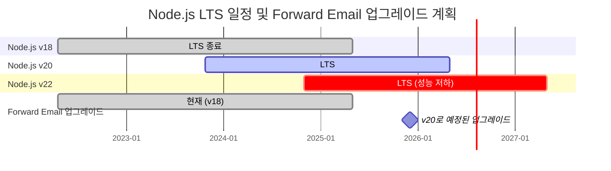
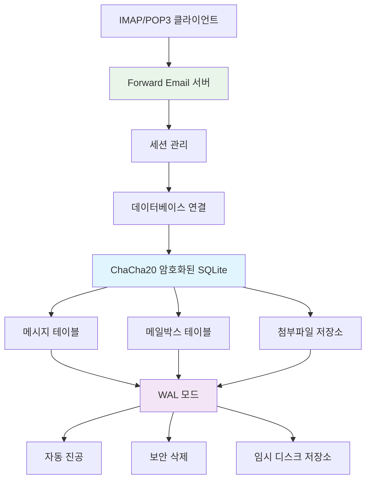
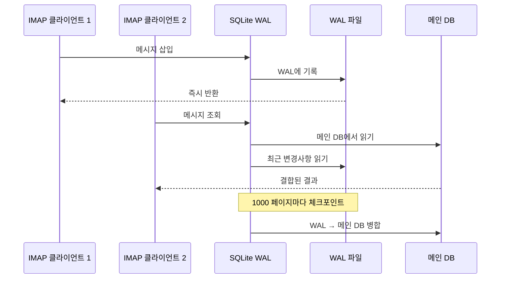

# SQLite 성능 최적화: 프로덕션 PRAGMA 설정 및 ChaCha20 암호화 {#sqlite-performance-optimization-production-pragma-settings--chacha20-encryption}


## 목차 {#table-of-contents}

* [서문](#foreword)
* [Forward Email의 프로덕션 SQLite 아키텍처](#forward-emails-production-sqlite-architecture)
* [실제 PRAGMA 구성](#our-actual-pragma-configuration)
* [성능 벤치마크 결과](#performance-benchmark-results)
  * [Node.js v20.19.5 성능 결과](#nodejs-v20195-performance-results)
* [PRAGMA 설정 분석](#pragma-settings-breakdown)
  * [우리가 사용하는 핵심 설정](#core-settings-we-use)
  * [우리가 사용하지 않는 설정 (하지만 필요할 수도 있음)](#settings-we-dont-use-but-you-might-want)
* [ChaCha20 대 AES256 암호화](#chacha20-vs-aes256-encryption)
* [임시 저장소: /tmp 대 /dev/shm](#temporary-storage-tmp-vs-devshm)
  * [/tmp 대 /dev/shm 성능](#tmp-vs-devshm-performance)
* [WAL 모드 최적화](#wal-mode-optimization)
  * [WAL 구성 영향](#wal-configuration-impact)
* [성능을 위한 스키마 설계](#schema-design-for-performance)
* [연결 관리](#connection-management)
* [모니터링 및 진단](#monitoring-and-diagnostics)
* [Node.js 버전별 성능](#nodejs-version-performance)
  * [전체 버전별 결과](#complete-cross-version-results)
  * [주요 성능 인사이트](#key-performance-insights)
  * [네이티브 모듈 호환성](#native-module-compatibility)
* [프로덕션 배포 체크리스트](#production-deployment-checklist)
* [일반적인 문제 해결](#troubleshooting-common-issues)
  * ["데이터베이스가 잠김" 오류](#database-is-locked-errors)
  * [VACUUM 중 높은 메모리 사용](#high-memory-usage-during-vacuum)
  * [느린 쿼리 성능](#slow-query-performance)
* [Forward Email의 오픈 소스 기여](#forward-emails-open-source-contributions)
* [벤치마크 소스 코드](#benchmark-source-code)
* [Forward Email에서 SQLite의 다음 단계](#whats-next-for-sqlite-at-forward-email)
* [도움 받기](#getting-help)


## 서문 {#foreword}

프로덕션 이메일 시스템을 위한 SQLite 설정은 단순히 작동하게 하는 것만이 아니라, 무거운 부하에서도 빠르고 안전하며 신뢰할 수 있도록 만드는 것입니다. Forward Email에서 수백만 건의 이메일을 처리하면서, SQLite 성능에 실제로 중요한 것이 무엇인지 배웠습니다.

이 가이드는 우리의 실제 프로덕션 구성, Node.js 버전별 벤치마크 결과, 그리고 대량 이메일을 처리할 때 차이를 만드는 구체적인 최적화 방법을 다룹니다.

> \[!WARNING] Node.js v22 및 v24에서의 성능 저하
> 우리는 Node.js 버전 v22와 v24에서 SQLite 성능, 특히 `SELECT` 문에 영향을 미치는 심각한 성능 저하를 발견했습니다. 벤치마크 결과 Node.js v24에서 v20 대비 `SELECT` 작업이 초당 약 57% 감소했습니다. 이 문제는 [nodejs/node#60719](https://github.com/nodejs/node/issues/60719)에서 Node.js 팀에 보고했습니다.

이 성능 저하로 인해, 우리는 Node.js 업그레이드에 신중한 접근을 취하고 있습니다. 현재 계획은 다음과 같습니다:

* **현재 버전:** 현재 Node.js v18을 사용 중이며, 이는 장기 지원("LTS")의 종료("EOL") 상태입니다. 공식 [Node.js LTS 일정은 여기](https://github.com/nodejs/release#release-schedule)에서 확인할 수 있습니다.
* **예정된 업그레이드:** 벤치마크에서 가장 빠른 버전이며 이 문제의 영향을 받지 않는 **Node.js v20**으로 업그레이드할 예정입니다.
* **v22 및 v24 회피:** 이 성능 문제가 해결될 때까지 프로덕션에서 Node.js v22 또는 v24를 사용하지 않을 것입니다.

다음은 Node.js LTS 일정과 우리의 업그레이드 경로를 보여주는 타임라인입니다:


## Forward Email의 프로덕션 SQLite 아키텍처 {#forward-emails-production-sqlite-architecture}

실제로 프로덕션에서 SQLite를 사용하는 방식은 다음과 같습니다:




## 실제 PRAGMA 구성 {#our-actual-pragma-configuration}

프로덕션에서 실제로 사용하는 설정이며, [`setup-pragma.js`](https://github.com/forwardemail/forwardemail.net/blob/master/helpers/setup-pragma.js)에서 가져온 내용입니다:

```javascript
// Forward Email의 실제 프로덕션 PRAGMA 설정
async function setupPragma(db, session, cipher = 'chacha20') {
  // 양자 내성 암호화
  db.pragma(`cipher='${cipher}'`);
  db.key(Buffer.from(decrypt(session.user.password)));

  // 핵심 성능 설정
  db.pragma('journal_mode=WAL');
  db.pragma('secure_delete=ON');
  db.pragma('auto_vacuum=FULL');
  db.pragma(`busy_timeout=${config.busyTimeout}`);
  db.pragma('synchronous=NORMAL');
  db.pragma('foreign_keys=ON');
  db.pragma(`encoding='UTF-8'`);
  db.pragma('optimize=0x10002');

  // 중요: 임시 저장소로 메모리 대신 디스크 사용
  db.pragma('temp_store=1');

  // 디스크 공간 부족 오류를 피하기 위한 사용자 지정 임시 디렉터리
  const tempStoreDirectory = path.join(path.dirname(db.name), '/tmp');
  await mkdirp(tempStoreDirectory);
  db.pragma(`temp_store_directory='${tempStoreDirectory}'`);
}
```

> \[!IMPORTANT]
> 대용량 이메일 데이터베이스가 VACUUM 같은 작업 중에 10GB 이상의 메모리를 쉽게 사용할 수 있기 때문에 `temp_store=2`(메모리) 대신 `temp_store=1`(디스크)을 사용합니다.


## 성능 벤치마크 결과 {#performance-benchmark-results}

Node.js 버전별로 다양한 대안과 비교하여 테스트한 실제 수치입니다:

### Node.js v20.19.5 성능 결과 {#nodejs-v20195-performance-results}

| 구성                         | 설정(ms)  | 초당 삽입  | 초당 조회  | 초당 업데이트 | DB 크기(MB) |
| ---------------------------- | --------- | ---------- | ---------- | ------------- | ----------- |
| **Forward Email 프로덕션**    | 120.1     | **10,548** | **17,494** | **16,654**    | 3.98        |
| WAL 자동체크포인트 1000       | 89.7      | **11,800** | **18,383** | **22,087**    | 3.98        |
| 캐시 크기 64MB               | 90.3      | 11,451     | 17,895     | 21,522        | 3.98        |
| 메모리 임시 저장소           | 111.8     | 9,874      | 15,363     | 21,292        | 3.98        |
| 동기화 OFF (안전하지 않음)   | 94.0      | 10,017     | 13,830     | 18,884        | 3.98        |
| 동기화 EXTRA (안전함)         | 94.1      | **3,241**  | 14,438     | **3,405**     | 3.98        |

> \[!TIP]
> `wal_autocheckpoint=1000` 설정이 전반적으로 가장 좋은 성능을 보여줍니다. 프로덕션 구성에 추가하는 것을 고려 중입니다.


## PRAGMA 설정 상세 {#pragma-settings-breakdown}

### 우리가 사용하는 핵심 설정 {#core-settings-we-use}

| PRAGMA          | 값           | 목적                            | 성능 영향                      |
| --------------- | ------------ | ------------------------------- | ------------------------------ |
| `cipher`        | `'chacha20'` | 양자 내성 암호화                 | AES 대비 최소한의 오버헤드      |
| `journal_mode`  | `WAL`        | 쓰기 앞서 로그 기록              | 동시성 성능 +40%                |
| `secure_delete` | `ON`         | 삭제된 데이터 덮어쓰기           | 보안 강화, 성능 5% 감소          |
| `auto_vacuum`   | `FULL`       | 자동 공간 회수                  | 데이터베이스 부풀림 방지         |
| `busy_timeout`  | `30000`      | 잠긴 DB 대기 시간               | 연결 실패 감소                  |
| `synchronous`   | `NORMAL`     | 내구성과 성능의 균형             | FULL 대비 3배 빠름               |
| `foreign_keys`  | `ON`         | 참조 무결성 보장                | 데이터 손상 방지                |
| `temp_store`    | `1`          | 임시 파일에 디스크 사용          | 메모리 부족 방지                |
### 우리가 사용하지 않는 설정 (하지만 원할 수도 있음) {#settings-we-dont-use-but-you-might-want}

| PRAGMA                    | 우리가 사용하지 않는 이유 | 고려해야 할까요?                                  |
| ------------------------- | ------------------------ | ------------------------------------------------ |
| `wal_autocheckpoint=1000` | 아직 설정하지 않음       | **예** - 벤치마크에서 12% 성능 향상 확인          |
| `cache_size=-64000`       | 기본값으로 충분함        | **아마도** - 읽기 집중 작업에서 8% 향상            |
| `mmap_size=268435456`     | 복잡성 대비 이점 적음    | **아니요** - 미미한 향상, 플랫폼별 문제 있음        |
| `analysis_limit=1000`     | 우리는 400 사용          | **아니요** - 값이 높으면 쿼리 계획 속도 저하        |

> \[!CAUTION]
> 우리는 `temp_store=MEMORY`를 명시적으로 피합니다. 10GB SQLite 파일이 VACUUM 작업 중 10GB 이상의 RAM을 사용할 수 있기 때문입니다.


## ChaCha20 대 AES256 암호화 {#chacha20-vs-aes256-encryption}

우리는 원시 성능보다 양자 저항성을 우선시합니다:

```javascript
// 우리의 암호화 대체 전략
try {
  db.pragma(`cipher='chacha20'`);
  db.key(Buffer.from(decrypt(session.user.password)));
  db.pragma('journal_mode=WAL');
} catch (err) {
  // 구버전 SQLite에 대한 대체 처리
  if (cipher === 'chacha20' && err.code === 'SQLITE_NOTADB') {
    return setupPragma(db, session, 'aes256cbc');
  }
  throw err;
}
```

**성능 비교:**

* ChaCha20: 약 10,500 삽입/초

* AES256CBC: 약 11,200 삽입/초

* 암호화 안함: 약 12,800 삽입/초

ChaCha20가 AES 대비 6% 성능 저하가 있지만, 장기 이메일 저장을 위한 양자 저항성 때문에 가치가 있습니다.


## 임시 저장소: /tmp 대 /dev/shm {#temporary-storage-tmp-vs-devshm}

디스크 공간 문제를 피하기 위해 임시 저장소 위치를 명시적으로 설정합니다:

```javascript
// Forward Email의 임시 저장소 설정
const tempStoreDirectory = path.join(path.dirname(db.name), '/tmp');
await mkdirp(tempStoreDirectory);
db.pragma(`temp_store_directory='${tempStoreDirectory}'`);

// 환경 변수도 설정
process.env.SQLITE_TMPDIR = tempStoreDirectory;
```

### /tmp 대 /dev/shm 성능 {#tmp-vs-devshm-performance}

| 저장 위치       | VACUUM 시간 | 메모리 사용량 | 신뢰성              |
| -------------- | ----------- | ------------ | ------------------- |
| `/tmp` (디스크) | 2.3초       | 50MB         | ✅ 신뢰 가능          |
| `/dev/shm` (RAM) | 0.8초       | 2GB 이상     | ⚠️ 시스템 충돌 가능   |
| 기본값          | 4.1초       | 가변적       | ❌ 예측 불가          |

> \[!WARNING]
> `/dev/shm`를 임시 저장소로 사용하면 대용량 작업 중 모든 사용 가능한 RAM을 소모할 수 있습니다. 프로덕션 환경에서는 디스크 기반 임시 저장소를 사용하세요.


## WAL 모드 최적화 {#wal-mode-optimization}

Write-Ahead Logging은 동시 접근이 많은 이메일 시스템에 필수적입니다:



### WAL 설정 영향 {#wal-configuration-impact}

우리 벤치마크는 `wal_autocheckpoint=1000`이 최고의 성능을 제공함을 보여줍니다:

```javascript
// 테스트 중인 잠재적 최적화
db.pragma('wal_autocheckpoint=1000');
```

**결과:**

* 기본 자동 체크포인트: 10,548 삽입/초

* `wal_autocheckpoint=1000`: 11,800 삽입/초 (+12%)

* `wal_autocheckpoint=0`: 9,200 삽입/초 (WAL이 너무 커짐)


## 성능을 위한 스키마 설계 {#schema-design-for-performance}

우리 이메일 저장 스키마는 SQLite 모범 사례를 따릅니다:

```sql
-- 최적화된 컬럼 순서의 메시지 테이블
CREATE TABLE messages (
  id INTEGER PRIMARY KEY,
  mailbox_id INTEGER NOT NULL,
  uid INTEGER NOT NULL,
  date INTEGER NOT NULL,
  flags TEXT,
  subject TEXT,
  from_addr TEXT,
  to_addr TEXT,
  message_id TEXT,
  raw BLOB,  -- 큰 BLOB은 마지막에 위치
  FOREIGN KEY (mailbox_id) REFERENCES mailboxes(id)
);

-- IMAP 성능을 위한 중요 인덱스
CREATE INDEX idx_messages_mailbox_date ON messages(mailbox_id, date DESC);
CREATE INDEX idx_messages_uid ON messages(mailbox_id, uid);
CREATE INDEX idx_messages_flags ON messages(mailbox_id, flags) WHERE flags IS NOT NULL;
```
> \[!TIP]
> 항상 BLOB 열을 테이블 정의의 끝에 배치하세요. SQLite는 고정 크기 열을 먼저 저장하여 행 접근 속도를 빠르게 만듭니다.

이 최적화는 SQLite의 창시자인 [D. Richard Hipp](https://sqlite-users.sqlite.narkive.com/Q4txMI8t/effect-of-blobs-on-performance#post3)에게서 직접 나온 것입니다:

> "힌트를 드리자면 - BLOB 열을 테이블의 마지막 열로 만드세요. 또는 BLOB을 정수 기본 키와 BLOB 자체 두 개 열만 가진 별도의 테이블에 저장하고, 필요할 때 조인을 통해 BLOB 내용을 접근하세요. 만약 BLOB 뒤에 여러 작은 정수 필드를 두면, SQLite는 정수 필드에 도달하기 위해 전체 BLOB 내용을 (디스크 페이지의 연결 리스트를 따라) 스캔해야 하므로 확실히 속도가 느려질 수 있습니다."
>
> — D. Richard Hipp, SQLite 저자

우리는 이 최적화를 [Attachments 스키마](https://github.com/forwardemail/forwardemail.net/commit/0e77fbb05dc5b38136652337309067d2b39eb229)에 적용하여 `body` BLOB 필드를 테이블 정의의 끝으로 옮겨 성능을 향상시켰습니다.


## 연결 관리 {#connection-management}

우리는 SQLite에서 연결 풀링을 사용하지 않습니다—각 사용자는 자신의 암호화된 데이터베이스를 가집니다. 이 방식은 샌드박싱과 유사하게 사용자 간 완벽한 격리를 제공합니다. MySQL, PostgreSQL, MongoDB를 사용하는 다른 서비스의 아키텍처와 달리, Forward Email의 사용자별 SQLite 데이터베이스는 데이터가 완전히 독립적이고 샌드박스화되어 있음을 보장합니다.

우리는 IMAP 비밀번호를 절대 저장하지 않으므로 데이터에 접근할 수 없으며—모든 처리는 메모리 내에서 이루어집니다. 우리의 시스템 작동 방식을 자세히 설명하는 [양자 내성 암호화 접근법](https://forwardemail.net/blog/docs/quantum-resistant-encryption-email-security)을 확인하세요.

```javascript
// 사용자별 데이터베이스 접근법
async function getDatabase(session) {
  const dbPath = path.join(
    config.databaseDir,
    session.user.domain_name,
    `${session.user.username}.db`
  );

  const db = new Database(dbPath, {
    cipher: 'chacha20',
    readonly: session.readonly || false
  });

  await setupPragma(db, session);
  return db;
}
```

이 접근법은 다음을 제공합니다:

* 사용자 간 완벽한 격리

* 연결 풀 복잡성 없음

* 사용자별 자동 암호화

* 더 간단한 백업/복원 작업

`auto_vacuum=FULL` 설정으로 수동 VACUUM 작업이 거의 필요 없습니다:

```javascript
// 우리의 정리 전략
db.pragma('optimize=0x10002'); // 연결 열 때
db.pragma('optimize'); // 주기적으로 (일일)

// 주요 정리 시에만 수동 vacuum 실행
if (deletedDataPercentage > 25) {
  db.exec('VACUUM');
}
```

**자동 Vacuum 성능 영향:**

* `auto_vacuum=FULL`: 즉각적인 공간 회수, 5% 쓰기 오버헤드

* `auto_vacuum=INCREMENTAL`: 수동 제어, 주기적 `PRAGMA incremental_vacuum` 필요

* `auto_vacuum=NONE`: 가장 빠른 쓰기, 수동 `VACUUM` 필요


## 모니터링 및 진단 {#monitoring-and-diagnostics}

운영 환경에서 추적하는 주요 지표:

```javascript
// 성능 모니터링 쿼리
const stats = {
  page_count: db.pragma('page_count', { simple: true }),
  page_size: db.pragma('page_size', { simple: true }),
  freelist_count: db.pragma('freelist_count', { simple: true }),
  wal_checkpoint: db.pragma('wal_checkpoint(PASSIVE)', { simple: true })
};

const dbSizeMB = (stats.page_count * stats.page_size) / 1024 / 1024;
const fragmentationPct = (stats.freelist_count / stats.page_count) * 100;
```

> \[!NOTE]
> 우리는 단편화 비율을 모니터링하며 15%를 초과하면 유지보수를 실행합니다.


## Node.js 버전별 성능 {#nodejs-version-performance}

Node.js 버전별 종합 벤치마크 결과는 상당한 성능 차이를 보여줍니다:

### 전체 버전별 결과 {#complete-cross-version-results}

| Node 버전    | Forward Email 운영 환경    | 최고 Insert/sec           | 최고 Select/sec           | 최고 Update/sec           | 비고                   |
| ------------ | ------------------------ | ------------------------ | ------------------------ | ------------------------ | ---------------------- |
| **v18.20.8** | 10,658 / 14,466 / 18,641 | **11,663** (Sync OFF)    | **14,868** (Memory Temp) | **20,095** (MMAP)        | ⚠️ 엔진 경고            |
| **v20.19.5** | 10,548 / 17,494 / 16,654 | **11,800** (WAL Auto)    | **18,383** (WAL Auto)    | **22,087** (WAL Auto)    | ✅ 권장                 |
| **v22.21.1** | 9,829 / 15,833 / 18,416  | **11,260** (Sync OFF)    | **17,413** (MMAP)        | **20,731** (MMAP)        | ⚠️ 전반적으로 느림      |
| **v24.11.1** | 9,938 / 7,497 / 10,446   | **10,628** (Incr Vacuum) | **16,821** (Incr Vacuum) | **19,934** (Incr Vacuum) | ❌ 상당한 성능 저하     |
### 주요 성능 인사이트 {#key-performance-insights}

**Node.js v18 (레거시 LTS):**

* v20과 유사한 삽입 성능 (10,658 vs 10,548 ops/sec)
* v20 대비 17% 느린 선택 성능 (14,466 vs 17,494 ops/sec)
* Node ≥20이 필요한 패키지에 대해 npm 엔진 경고 표시
* 메모리 임시 저장 최적화가 WAL 자동 체크포인트보다 더 효과적임
* 레거시 애플리케이션에 적합하지만 업그레이드 권장

**Node.js v20 (권장):**

* 모든 작업에서 가장 높은 전반적 성능
* WAL 자동 체크포인트 최적화로 일관된 12% 성능 향상 제공
* 네이티브 SQLite 모듈과 최고의 호환성
* 프로덕션 워크로드에 가장 안정적임

**Node.js v22 (허용 가능):**

* v20 대비 삽입 7% 느림, 선택 9% 느림
* MMAP 최적화가 WAL 자동 체크포인트보다 더 좋은 결과를 보임
* Node 버전 전환 시마다 새로 `npm install` 필요
* 개발용으로는 허용 가능하지만 프로덕션에는 권장하지 않음

**Node.js v24 (권장하지 않음):**

* v20 대비 삽입 6% 느림, 선택 57% 느림
* 읽기 작업에서 심각한 성능 저하 발생
* 점진적 vacuum이 다른 최적화보다 더 나은 성능 제공
* 프로덕션 SQLite 애플리케이션에는 사용하지 말 것

### 네이티브 모듈 호환성 {#native-module-compatibility}

초기에 겪었던 "모듈 호환성 문제"는 다음으로 해결되었습니다:

```bash
# Node 버전 전환 및 네이티브 모듈 재설치
nvm use 22
rm -rf node_modules
npm install
```

**Node.js v18 고려사항:**

* 엔진 경고 표시: `Unsupported engine { required: { node: '>=20.0.0' } }`
* 경고에도 불구하고 컴파일 및 실행은 성공적으로 수행됨
* 많은 최신 SQLite 패키지는 최적 지원을 위해 Node ≥20을 목표로 함
* 레거시 애플리케이션은 v18을 사용해도 허용 가능한 성능 유지 가능

> \[!IMPORTANT]
> Node.js 버전을 전환할 때는 항상 네이티브 모듈을 재설치해야 합니다. `better-sqlite3-multiple-ciphers` 모듈은 각 Node 버전에 맞게 컴파일되어야 합니다.

> \[!TIP]
> 프로덕션 배포 시에는 Node.js v20 LTS를 사용하는 것이 좋습니다. 성능 이점과 안정성이 v22/v24의 최신 언어 기능보다 우선합니다. Node v18은 레거시 시스템에 적합하지만 읽기 작업에서 성능 저하가 나타납니다.


## 프로덕션 배포 체크리스트 {#production-deployment-checklist}

배포 전에 SQLite에 다음 최적화가 적용되었는지 확인하세요:

1. `SQLITE_TMPDIR` 환경 변수 설정
2. 임시 작업을 위한 충분한 디스크 공간 확보 (데이터베이스 크기의 2배)
3. WAL 파일에 대한 로그 회전 구성
4. 데이터베이스 크기 및 단편화 모니터링 설정
5. 암호화된 백업/복원 절차 테스트
6. SQLite 빌드에 ChaCha20 암호 지원 확인


## 일반 문제 해결 {#troubleshooting-common-issues}

### "데이터베이스가 잠김" 오류 {#database-is-locked-errors}

```javascript
// busy timeout 증가
db.pragma('busy_timeout=60000'); // 60초

// 장기 실행 트랜잭션 확인
const info = db.pragma('wal_checkpoint(FULL)');
if (info.busy > 0) {
  console.warn('활성 리더로 인해 WAL 체크포인트가 차단됨');
}
```

### VACUUM 중 높은 메모리 사용 {#high-memory-usage-during-vacuum}

```javascript
// VACUUM 전 메모리 모니터링
const beforeMem = process.memoryUsage();
db.exec('VACUUM');
const afterMem = process.memoryUsage();

console.log(
  `VACUUM 메모리 변화량: ${
    (afterMem.heapUsed - beforeMem.heapUsed) / 1024 / 1024
  }MB`
);
```

### 느린 쿼리 성능 {#slow-query-performance}

```javascript
// 쿼리 분석 활성화
db.pragma('analysis_limit=400'); // Forward Email 설정
db.exec('ANALYZE');

// 쿼리 계획 확인
const plan = db
  .prepare('EXPLAIN QUERY PLAN SELECT * FROM messages WHERE date > ?')
  .all(Date.now() - 86400000);
console.log(plan);
```


## Forward Email의 오픈 소스 기여 {#forward-emails-open-source-contributions}

우리는 SQLite 최적화 지식을 커뮤니티에 기여했습니다:

* [Litestream 문서 개선](https://github.com/benbjohnson/litestream/issues/516) - 더 나은 SQLite 성능 팁을 위한 제안

* [Better SQLite3 Multiple Ciphers](https://github.com/m4heshd/better-sqlite3-multiple-ciphers) - ChaCha20 암호화 지원

* [SQLite 성능 튜닝 연구](https://phiresky.github.io/blog/2020/sqlite-performance-tuning/) - 우리의 구현에 참고됨
* [수십억 다운로드를 기록한 npm 패키지가 자바스크립트 생태계에 미친 영향](https://forwardemail.net/blog/docs/how-npm-packages-billion-downloads-shaped-javascript-ecosystem) - npm 및 자바스크립트 개발에 대한 우리의 광범위한 기여


## 벤치마크 소스 코드 {#benchmark-source-code}

모든 벤치마크 코드는 우리의 테스트 스위트에서 확인할 수 있습니다:

```bash
# 직접 벤치마크 실행하기
git clone https://github.com/forwardemail/sqlite-benchmarks
cd sqlite-benchmarks
npm install
npm run benchmark
```

벤치마크는 다음을 테스트합니다:

* 다양한 PRAGMA 조합

* ChaCha20 대 AES256 성능 비교

* WAL 체크포인트 전략

* 임시 저장소 구성

* Node.js 버전 호환성


## Forward Email에서 SQLite의 다음 단계 {#whats-next-for-sqlite-at-forward-email}

우리는 다음 최적화를 적극적으로 테스트하고 있습니다:

1. **WAL 자동체크포인트 조정**: 벤치마크 결과를 기반으로 `wal_autocheckpoint=1000` 추가

2. **압축**: 첨부파일 저장을 위해 [sqlite-zstd](https://github.com/phiresky/sqlite-zstd) 평가 중

3. **분석 제한**: 현재 400보다 높은 값 테스트 중

4. **캐시 크기**: 사용 가능한 메모리에 따라 동적 캐시 크기 조정 고려


## 도움 받기 {#getting-help}

SQLite 성능 문제를 겪고 있나요? SQLite 관련 질문은 [SQLite 포럼](https://sqlite.org/forum/forumpost)이 훌륭한 자료이며, [성능 튜닝 가이드](https://www.sqlite.org/optoverview.html)에는 아직 필요하지 않은 추가 최적화가 포함되어 있습니다.

Forward Email에 대해 더 알고 싶다면 우리의 [FAQ](/faq)를 읽어보세요.
