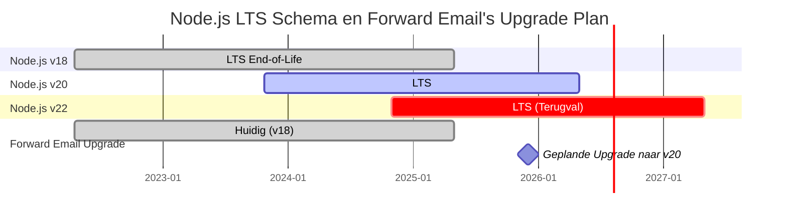
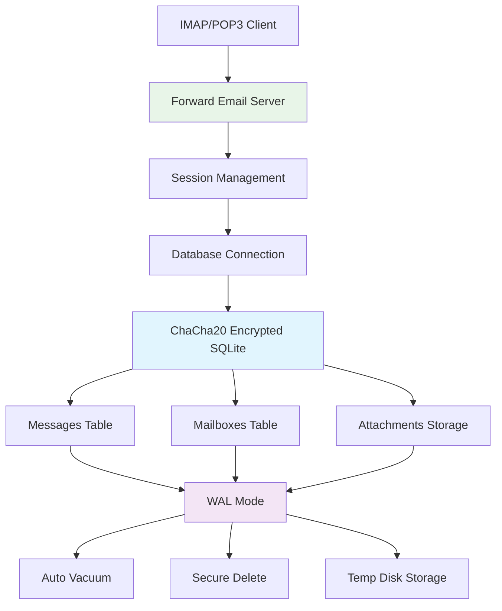
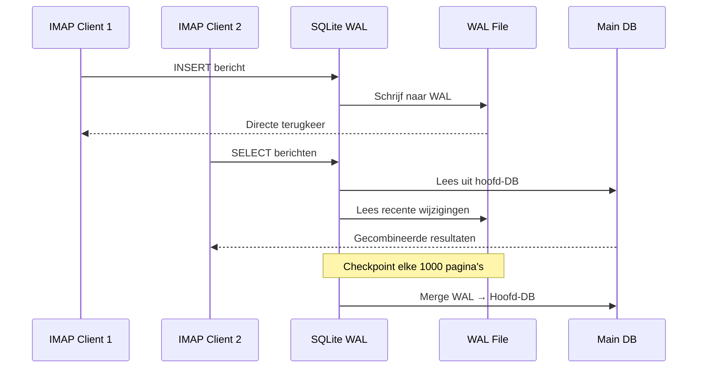

# SQLite Prestatieoptimalisatie: Productie PRAGMA-instellingen & ChaCha20 Encryptie {#sqlite-performance-optimization-production-pragma-settings--chacha20-encryption}


## Inhoudsopgave {#table-of-contents}

* [Voorwoord](#foreword)
* [Forward Email's Productie SQLite Architectuur](#forward-emails-production-sqlite-architecture)
* [Onze Werkelijke PRAGMA Configuratie](#our-actual-pragma-configuration)
* [Prestatie Benchmark Resultaten](#performance-benchmark-results)
  * [Node.js v20.19.5 Prestatie Resultaten](#nodejs-v20195-performance-results)
* [Uitleg PRAGMA Instellingen](#pragma-settings-breakdown)
  * [Kerninstellingen Die We Gebruiken](#core-settings-we-use)
  * [Instellingen Die We NIET Gebruiken (Maar Jij Misschien Wel)](#settings-we-dont-use-but-you-might-want)
* [ChaCha20 vs AES256 Encryptie](#chacha20-vs-aes256-encryption)
* [Tijdelijke Opslag: /tmp vs /dev/shm](#temporary-storage-tmp-vs-devshm)
  * [/tmp vs /dev/shm Prestatie](#tmp-vs-devshm-performance)
* [WAL Modus Optimalisatie](#wal-mode-optimization)
  * [Impact WAL Configuratie](#wal-configuration-impact)
* [Schema Ontwerp voor Prestatie](#schema-design-for-performance)
* [Connectiebeheer](#connection-management)
* [Monitoring en Diagnostiek](#monitoring-and-diagnostics)
* [Node.js Versie Prestatie](#nodejs-version-performance)
  * [Volledige Cross-Versie Resultaten](#complete-cross-version-results)
  * [Belangrijkste Prestatie Inzichten](#key-performance-insights)
  * [Compatibiliteit Native Modules](#native-module-compatibility)
* [Productie Deployment Checklist](#production-deployment-checklist)
* [Probleemoplossing Veelvoorkomende Problemen](#troubleshooting-common-issues)
  * ["Database is locked" Fouten](#database-is-locked-errors)
  * [Hoog Geheugengebruik Tijdens VACUUM](#high-memory-usage-during-vacuum)
  * [Trage Query Prestatie](#slow-query-performance)
* [Forward Email's Open Source Bijdragen](#forward-emails-open-source-contributions)
* [Benchmark Broncode](#benchmark-source-code)
* [Wat Staat Er Op De Planning Voor SQLite Bij Forward Email](#whats-next-for-sqlite-at-forward-email)
* [Hulp Krijgen](#getting-help)


## Voorwoord {#foreword}

Het opzetten van SQLite voor productie e-mailsystemen gaat niet alleen over het werkend krijgen—het gaat erom het snel, veilig en betrouwbaar te maken onder zware belasting. Na miljoenen e-mails verwerkt te hebben bij Forward Email, hebben we geleerd wat er echt toe doet voor SQLite prestatie.

Deze gids behandelt onze echte productieconfiguratie, benchmarkresultaten over Node.js versies heen, en de specifieke optimalisaties die het verschil maken wanneer je serieuze e-mailvolumes verwerkt.

> \[!WARNING] Node.js Prestatie Terugval in v22 en v24
> We ontdekten een significante prestatie terugval in Node.js versies v22 en v24 die de SQLite prestatie beïnvloedt, met name voor `SELECT` statements. Onze benchmarks tonen een ~57% daling in `SELECT` operaties per seconde in Node.js v24 vergeleken met v20. We hebben dit probleem gemeld aan het Node.js team in [nodejs/node#60719](https://github.com/nodejs/node/issues/60719).

Vanwege deze terugval hanteren we een voorzichtige aanpak voor onze Node.js upgrades. Dit is ons huidige plan:

* **Huidige Versie:** We gebruiken momenteel Node.js v18, welke het einde van de levensduur ("EOL") heeft bereikt voor Long-Term Support ("LTS"). Je kunt het officiële [Node.js LTS schema hier bekijken](https://github.com/nodejs/release#release-schedule).
* **Geplande Upgrade:** We zullen upgraden naar **Node.js v20**, de snelste versie volgens onze benchmarks en niet getroffen door deze terugval.
* **Vermijden van v22 en v24:** We zullen Node.js v22 of v24 niet in productie gebruiken totdat dit prestatieprobleem is opgelost.

Hier is een tijdlijn die het Node.js LTS schema en ons upgradepad illustreert:


## Forward Email's productie SQLite-architectuur {#forward-emails-production-sqlite-architecture}

Zo gebruiken we SQLite daadwerkelijk in productie:




## Onze daadwerkelijke PRAGMA-configuratie {#our-actual-pragma-configuration}

Dit is wat we daadwerkelijk in productie gebruiken, rechtstreeks uit onze [`setup-pragma.js`](https://github.com/forwardemail/forwardemail.net/blob/master/helpers/setup-pragma.js):

```javascript
// Forward Email's actual production PRAGMA settings
async function setupPragma(db, session, cipher = 'chacha20') {
  // Quantum-resistant encryption
  db.pragma(`cipher='${cipher}'`);
  db.key(Buffer.from(decrypt(session.user.password)));

  // Core performance settings
  db.pragma('journal_mode=WAL');
  db.pragma('secure_delete=ON');
  db.pragma('auto_vacuum=FULL');
  db.pragma(`busy_timeout=${config.busyTimeout}`);
  db.pragma('synchronous=NORMAL');
  db.pragma('foreign_keys=ON');
  db.pragma(`encoding='UTF-8'`);
  db.pragma('optimize=0x10002');

  // Critical: Use disk for temp storage, not memory
  db.pragma('temp_store=1');

  // Custom temp directory to avoid disk full errors
  const tempStoreDirectory = path.join(path.dirname(db.name), '/tmp');
  await mkdirp(tempStoreDirectory);
  db.pragma(`temp_store_directory='${tempStoreDirectory}'`);
}
```

> \[!IMPORTANT]
> We gebruiken `temp_store=1` (schijf) in plaats van `temp_store=2` (geheugen) omdat grote e-maildatabases gemakkelijk meer dan 10 GB geheugen kunnen verbruiken tijdens bewerkingen zoals VACUUM.


## Prestatiebenchmarkresultaten {#performance-benchmark-results}

We hebben onze configuratie getest tegen verschillende alternatieven over Node.js-versies heen. Hier zijn de echte cijfers:

### Node.js v20.19.5 prestatie-resultaten {#nodejs-v20195-performance-results}

| Configuratie                 | Setup (ms) | Insert/sec | Select/sec | Update/sec | DB-grootte (MB) |
| ---------------------------- | ---------- | ---------- | ---------- | ---------- | --------------- |
| **Forward Email Productie**  | 120.1      | **10,548** | **17,494** | **16,654** | 3.98            |
| WAL Autocheckpoint 1000      | 89.7       | **11,800** | **18,383** | **22,087** | 3.98            |
| Cachegrootte 64MB            | 90.3       | 11,451     | 17,895     | 21,522     | 3.98            |
| Geheugen tijdelijke opslag   | 111.8      | 9,874      | 15,363     | 21,292     | 3.98            |
| Synchronous UIT (Onveilig)   | 94.0       | 10,017     | 13,830     | 18,884     | 3.98            |
| Synchronous EXTRA (Veilig)   | 94.1       | **3,241**  | 14,438     | **3,405**  | 3.98            |

> \[!TIP]
> De instelling `wal_autocheckpoint=1000` toont de beste algehele prestaties. We overwegen dit toe te voegen aan onze productieconfiguratie.


## Uitleg PRAGMA-instellingen {#pragma-settings-breakdown}

### Kerninstellingen die we gebruiken {#core-settings-we-use}

| PRAGMA          | Waarde       | Doel                           | Prestatie-impact               |
| --------------- | ------------ | ------------------------------ | ----------------------------- |
| `cipher`        | `'chacha20'` | Quantum-resistente encryptie    | Minimale overhead vs AES       |
| `journal_mode`  | `WAL`        | Write-Ahead Logging             | +40% gelijktijdige prestaties  |
| `secure_delete` | `ON`         | Overschrijven van verwijderde data | Veiligheid vs 5% prestatieverlies |
| `auto_vacuum`   | `FULL`       | Automatische ruimte-terugwinning | Voorkomt database-opblazing   |
| `busy_timeout`  | `30000`      | Wachtijd voor vergrendelde database | Vermindert verbindingsfouten  |
| `synchronous`   | `NORMAL`     | Gebalanceerde duurzaamheid/prestatie | 3x sneller dan FULL            |
| `foreign_keys`  | `ON`         | Referentiële integriteit        | Voorkomt datacorruptie         |
| `temp_store`    | `1`          | Gebruik schijf voor tijdelijke bestanden | Voorkomt geheugentekort       |
### Instellingen Die We NIET Gebruiken (Maar Die Je Misschien Wilt) {#settings-we-dont-use-but-you-might-want}

| PRAGMA                    | Waarom We Het Niet Gebruiken | Moet Je Het Overwegen?                             |
| ------------------------- | ----------------------------- | ------------------------------------------------- |
| `wal_autocheckpoint=1000` | Nog niet ingesteld            | **Ja** - Onze benchmarks tonen 12% prestatiewinst |
| `cache_size=-64000`       | Standaard is voldoende        | **Misschien** - 8% verbetering voor leesintensieve workloads |
| `mmap_size=268435456`     | Complexiteit versus voordeel  | **Nee** - Minimale winst, platform-specifieke problemen |
| `analysis_limit=1000`     | Wij gebruiken 400             | **Nee** - Hogere waarden vertragen queryplanning  |

> \[!CAUTION]
> We vermijden specifiek `temp_store=MEMORY` omdat een 10GB SQLite-bestand tijdens VACUUM-operaties meer dan 10 GB RAM kan gebruiken.


## ChaCha20 vs AES256 Encryptie {#chacha20-vs-aes256-encryption}

We geven prioriteit aan kwantumbestendigheid boven ruwe prestaties:

```javascript
// Onze fallback-encryptiestrategie
try {
  db.pragma(`cipher='chacha20'`);
  db.key(Buffer.from(decrypt(session.user.password)));
  db.pragma('journal_mode=WAL');
} catch (err) {
  // Fallback voor oudere SQLite-versies
  if (cipher === 'chacha20' && err.code === 'SQLITE_NOTADB') {
    return setupPragma(db, session, 'aes256cbc');
  }
  throw err;
}
```

**Prestatievergelijking:**

* ChaCha20: \~10.500 inserts/sec

* AES256CBC: \~11.200 inserts/sec

* Onversleuteld: \~12.800 inserts/sec

De 6% prestatiekost van ChaCha20 versus AES is de kwantumbestendigheid waard voor langdurige e-mailopslag.


## Tijdelijke Opslag: /tmp vs /dev/shm {#temporary-storage-tmp-vs-devshm}

We configureren expliciet de locatie van tijdelijke opslag om schijfruimteproblemen te voorkomen:

```javascript
// Forward Email's configuratie voor tijdelijke opslag
const tempStoreDirectory = path.join(path.dirname(db.name), '/tmp');
await mkdirp(tempStoreDirectory);
db.pragma(`temp_store_directory='${tempStoreDirectory}'`);

// Stel ook de omgevingsvariabele in
process.env.SQLITE_TMPDIR = tempStoreDirectory;
```

### /tmp vs /dev/shm Prestaties {#tmp-vs-devshm-performance}

| Opslaglocatie    | VACUUM Tijd | Geheugengebruik | Betrouwbaarheid       |
| ---------------- | ----------- | --------------- | --------------------- |
| `/tmp` (schijf)  | 2,3s        | 50MB            | ✅ Betrouwbaar         |
| `/dev/shm` (RAM) | 0,8s        | 2GB+            | ⚠️ Kan systeem laten crashen |
| Standaard        | 4,1s        | Variabel        | ❌ Onvoorspelbaar      |

> \[!WARNING]
> Het gebruik van `/dev/shm` voor tijdelijke opslag kan tijdens grote operaties al het beschikbare RAM verbruiken. Gebruik voor productie opslag op schijf voor tijdelijke bestanden.


## WAL Modus Optimalisatie {#wal-mode-optimization}

Write-Ahead Logging is cruciaal voor e-mailsystemen met gelijktijdige toegang:



### Impact van WAL Configuratie {#wal-configuration-impact}

Onze benchmarks tonen dat `wal_autocheckpoint=1000` de beste prestaties levert:

```javascript
// Potentiële optimalisatie die we testen
db.pragma('wal_autocheckpoint=1000');
```

**Resultaten:**

* Standaard autocheckpoint: 10.548 inserts/sec

* `wal_autocheckpoint=1000`: 11.800 inserts/sec (+12%)

* `wal_autocheckpoint=0`: 9.200 inserts/sec (WAL wordt te groot)


## Schema Ontwerp voor Prestaties {#schema-design-for-performance}

Ons e-mailopslagschema volgt SQLite best practices:

```sql
-- Tabel berichten met geoptimaliseerde kolomvolgorde
CREATE TABLE messages (
  id INTEGER PRIMARY KEY,
  mailbox_id INTEGER NOT NULL,
  uid INTEGER NOT NULL,
  date INTEGER NOT NULL,
  flags TEXT,
  subject TEXT,
  from_addr TEXT,
  to_addr TEXT,
  message_id TEXT,
  raw BLOB,  -- Grote BLOB aan het einde
  FOREIGN KEY (mailbox_id) REFERENCES mailboxes(id)
);

-- Kritieke indexen voor IMAP-prestaties
CREATE INDEX idx_messages_mailbox_date ON messages(mailbox_id, date DESC);
CREATE INDEX idx_messages_uid ON messages(mailbox_id, uid);
CREATE INDEX idx_messages_flags ON messages(mailbox_id, flags) WHERE flags IS NOT NULL;
```
> \[!TIP]
> Plaats BLOB-kolommen altijd aan het einde van je tabeldefinitie. SQLite slaat eerst kolommen met vaste grootte op, wat de rijtoegang versnelt.

Deze optimalisatie komt rechtstreeks van de maker van SQLite, [D. Richard Hipp](https://sqlite-users.sqlite.narkive.com/Q4txMI8t/effect-of-blobs-on-performance#post3):

> "Hier is een tip - maak de BLOB-kolommen de laatste kolom in je tabellen. Of sla de BLOBs zelfs op in een aparte tabel die slechts twee kolommen heeft: een integer primaire sleutel en de blob zelf, en benader dan de BLOB-inhoud via een join als je die nodig hebt. Als je verschillende kleine integervelden na de BLOB plaatst, moet SQLite door de hele BLOB-inhoud scannen (volgend de gekoppelde lijst van schijfpagina's) om bij de integervelden aan het einde te komen, en dat kan je zeker vertragen."
>
> — D. Richard Hipp, SQLite Auteur

We hebben deze optimalisatie geïmplementeerd in ons [Attachments schema](https://github.com/forwardemail/forwardemail.net/commit/0e77fbb05dc5b38136652337309067d2b39eb229), waarbij we het `body` BLOB-veld naar het einde van de tabeldefinitie hebben verplaatst voor betere prestaties.


## Connection Management {#connection-management}

We gebruiken geen connection pooling met SQLite—elke gebruiker krijgt zijn eigen versleutelde database. Deze aanpak biedt perfecte isolatie tussen gebruikers, vergelijkbaar met sandboxing. In tegenstelling tot architecturen van andere diensten die MySQL, PostgreSQL of MongoDB gebruiken waarbij je e-mail mogelijk toegankelijk is voor een kwaadwillende medewerker, zorgen de per-gebruiker SQLite-databases van Forward Email ervoor dat je gegevens volledig onafhankelijk en gesandboxed zijn.

We slaan je IMAP-wachtwoord nooit op, dus we hebben nooit toegang tot je gegevens—alles gebeurt in het geheugen. Lees meer over onze [kwantumresistente encryptiebenadering](https://forwardemail.net/blog/docs/quantum-resistant-encryption-email-security) die uitlegt hoe ons systeem werkt.

```javascript
// Per-user database approach
async function getDatabase(session) {
  const dbPath = path.join(
    config.databaseDir,
    session.user.domain_name,
    `${session.user.username}.db`
  );

  const db = new Database(dbPath, {
    cipher: 'chacha20',
    readonly: session.readonly || false
  });

  await setupPragma(db, session);
  return db;
}
```

Deze aanpak biedt:

* Perfecte isolatie tussen gebruikers

* Geen complexiteit van connection pools

* Automatische encryptie per gebruiker

* Eenvoudigere backup/restore operaties

Met `auto_vacuum=FULL` hebben we zelden handmatige VACUUM-operaties nodig:

```javascript
// Our cleanup strategy
db.pragma('optimize=0x10002'); // On connection open
db.pragma('optimize'); // Periodically (daily)

// Manual vacuum only for major cleanups
if (deletedDataPercentage > 25) {
  db.exec('VACUUM');
}
```

**Impact van Auto Vacuum op prestaties:**

* `auto_vacuum=FULL`: Directe ruimte-terugwinning, 5% schrijf-overhead

* `auto_vacuum=INCREMENTAL`: Handmatige controle, vereist periodieke `PRAGMA incremental_vacuum`

* `auto_vacuum=NONE`: Snelste schrijfacties, vereist handmatige `VACUUM`


## Monitoring and Diagnostics {#monitoring-and-diagnostics}

Belangrijke statistieken die we in productie bijhouden:

```javascript
// Performance monitoring queries
const stats = {
  page_count: db.pragma('page_count', { simple: true }),
  page_size: db.pragma('page_size', { simple: true }),
  freelist_count: db.pragma('freelist_count', { simple: true }),
  wal_checkpoint: db.pragma('wal_checkpoint(PASSIVE)', { simple: true })
};

const dbSizeMB = (stats.page_count * stats.page_size) / 1024 / 1024;
const fragmentationPct = (stats.freelist_count / stats.page_count) * 100;
```

> \[!NOTE]
> We monitoren het fragmentatiepercentage en starten onderhoud wanneer dit boven de 15% komt.


## Node.js Version Performance {#nodejs-version-performance}

Onze uitgebreide benchmarks over Node.js-versies tonen significante prestatieverschillen:

### Complete Cross-Version Results {#complete-cross-version-results}

| Node Version | Forward Email Production | Beste Insert/sec         | Beste Select/sec         | Beste Update/sec         | Opmerkingen            |
| ------------ | ------------------------ | ------------------------ | ------------------------ | ------------------------ | ---------------------- |
| **v18.20.8** | 10,658 / 14,466 / 18,641 | **11,663** (Sync OFF)    | **14,868** (Memory Temp) | **20,095** (MMAP)        | ⚠️ Engine waarschuwing |
| **v20.19.5** | 10,548 / 17,494 / 16,654 | **11,800** (WAL Auto)    | **18,383** (WAL Auto)    | **22,087** (WAL Auto)    | ✅ Aanbevolen           |
| **v22.21.1** | 9,829 / 15,833 / 18,416  | **11,260** (Sync OFF)    | **17,413** (MMAP)        | **20,731** (MMAP)        | ⚠️ Over het algemeen trager |
| **v24.11.1** | 9,938 / 7,497 / 10,446   | **10,628** (Incr Vacuum) | **16,821** (Incr Vacuum) | **19,934** (Incr Vacuum) | ❌ Aanzienlijke vertraging |
### Belangrijke Prestatie-Inzichten {#key-performance-insights}

**Node.js v18 (Legacy LTS):**

* Vergelijkbare insert-prestaties met v20 (10.658 vs 10.548 ops/sec)
* 17% langzamere selects dan v20 (14.466 vs 17.494 ops/sec)
* Toont npm engine-waarschuwingen voor pakketten die Node ≥20 vereisen
* Geheugen tijdelijke opslagoptimalisatie werkt beter dan WAL autocheckpoint
* Acceptabel voor legacy applicaties, maar upgrade aanbevolen

**Node.js v20 (Aanbevolen):**

* Hoogste algehele prestaties over alle bewerkingen
* WAL autocheckpoint optimalisatie levert consistente 12% boost
* Beste compatibiliteit met native SQLite modules
* Meest stabiel voor productie workloads

**Node.js v22 (Acceptabel):**

* 7% langzamere inserts, 9% langzamere selects vs v20
* MMAP-optimalisatie toont betere resultaten dan WAL autocheckpoint
* Vereist verse `npm install` bij elke Node versie wissel
* Acceptabel voor ontwikkeling, niet aanbevolen voor productie

**Node.js v24 (Niet Aanbevolen):**

* 6% langzamere inserts, 57% langzamere selects vs v20
* Significante prestatieachteruitgang bij leesbewerkingen
* Incrementele vacuum presteert beter dan andere optimalisaties
* Vermijd voor productie SQLite applicaties

### Compatibiliteit van Native Modules {#native-module-compatibility}

De "module compatibiliteitsproblemen" die we aanvankelijk tegenkwamen, werden opgelost door:

```bash
# Wissel Node versie en installeer native modules opnieuw
nvm use 22
rm -rf node_modules
npm install
```

**Overwegingen voor Node.js v18:**

* Toont engine-waarschuwingen: `Unsupported engine { required: { node: '>=20.0.0' } }`
* Compileert en draait nog steeds succesvol ondanks waarschuwingen
* Veel moderne SQLite pakketten richten zich op Node ≥20 voor optimale ondersteuning
* Legacy applicaties kunnen v18 blijven gebruiken met acceptabele prestaties

> \[!IMPORTANT]
> Installeer native modules altijd opnieuw bij het wisselen van Node.js versies. De `better-sqlite3-multiple-ciphers` module moet voor elke specifieke Node versie gecompileerd worden.

> \[!TIP]
> Voor productie-implementaties, blijf bij Node.js v20 LTS. De prestatievoordelen en stabiliteit wegen zwaarder dan nieuwere taalfeatures in v22/v24. Node v18 is acceptabel voor legacy systemen maar toont prestatievermindering bij leesbewerkingen.


## Checklist voor Productie-Implementatie {#production-deployment-checklist}

Zorg ervoor dat SQLite deze optimalisaties heeft voordat je implementeert:

1. Stel de omgevingsvariabele `SQLITE_TMPDIR` in
2. Zorg voor voldoende schijfruimte voor tijdelijke bewerkingen (2x databasegrootte)
3. Configureer logrotatie voor WAL-bestanden
4. Zet monitoring op voor databasegrootte en fragmentatie
5. Test backup/restore procedures met encryptie
6. Verifieer ChaCha20 cipher ondersteuning in je SQLite build


## Problemen Oplossen bij Veelvoorkomende Issues {#troubleshooting-common-issues}

### "Database is locked" Fouten {#database-is-locked-errors}

```javascript
// Verhoog busy timeout
db.pragma('busy_timeout=60000'); // 60 seconden

// Controleer op langlopende transacties
const info = db.pragma('wal_checkpoint(FULL)');
if (info.busy > 0) {
  console.warn('WAL checkpoint geblokkeerd door actieve lezers');
}
```

### Hoog Geheugengebruik Tijdens VACUUM {#high-memory-usage-during-vacuum}

```javascript
// Monitor geheugen voor VACUUM
const beforeMem = process.memoryUsage();
db.exec('VACUUM');
const afterMem = process.memoryUsage();

console.log(
  `VACUUM geheugen delta: ${
    (afterMem.heapUsed - beforeMem.heapUsed) / 1024 / 1024
  }MB`
);
```

### Trage Query Prestaties {#slow-query-performance}

```javascript
// Schakel query-analyse in
db.pragma('analysis_limit=400'); // Forward Email's instelling
db.exec('ANALYZE');

// Controleer query plannen
const plan = db
  .prepare('EXPLAIN QUERY PLAN SELECT * FROM messages WHERE date > ?')
  .all(Date.now() - 86400000);
console.log(plan);
```


## Open Source Bijdragen van Forward Email {#forward-emails-open-source-contributions}

We hebben onze kennis over SQLite optimalisatie teruggegeven aan de community:

* [Litestream documentatie verbeteringen](https://github.com/benbjohnson/litestream/issues/516) - Onze suggesties voor betere SQLite prestatie tips

* [Better SQLite3 Multiple Ciphers](https://github.com/m4heshd/better-sqlite3-multiple-ciphers) - ChaCha20 encryptie ondersteuning

* [SQLite prestatie tuning onderzoek](https://phiresky.github.io/blog/2020/sqlite-performance-tuning/) - Gerefereerd in onze implementatie
* [Hoe npm-pakketten met miljarden downloads het JavaScript-ecosysteem vormgaven](https://forwardemail.net/blog/docs/how-npm-packages-billion-downloads-shaped-javascript-ecosystem) - Onze bredere bijdragen aan npm en JavaScript-ontwikkeling


## Benchmark Source Code {#benchmark-source-code}

Alle benchmarkcode is beschikbaar in onze test suite:

```bash
# Voer de benchmarks zelf uit
git clone https://github.com/forwardemail/sqlite-benchmarks
cd sqlite-benchmarks
npm install
npm run benchmark
```

De benchmarks testen:

* Verschillende PRAGMA-combinaties

* ChaCha20 vs AES256 prestaties

* WAL checkpoint strategieën

* Temp opslagconfiguraties

* Node.js versiecompatibiliteit


## Wat staat er te wachten voor SQLite bij Forward Email {#whats-next-for-sqlite-at-forward-email}

We testen actief deze optimalisaties:

1. **WAL Autocheckpoint Afstemming**: Toevoegen van `wal_autocheckpoint=1000` op basis van benchmarkresultaten

2. **Compressie**: Evalueren van [sqlite-zstd](https://github.com/phiresky/sqlite-zstd) voor opslag van bijlagen

3. **Analyse Limiet**: Testen van hogere waarden dan onze huidige 400

4. **Cache Grootte**: Overwegen van dynamische cachegrootte op basis van beschikbare geheugen


## Hulp krijgen {#getting-help}

Heb je SQLite-prestatieproblemen? Voor SQLite-specifieke vragen is het [SQLite Forum](https://sqlite.org/forum/forumpost) een uitstekende bron, en de [performance tuning guide](https://www.sqlite.org/optoverview.html) behandelt aanvullende optimalisaties die we nog niet nodig hadden.

Lees meer over Forward Email door onze [FAQ](/faq) te lezen.
