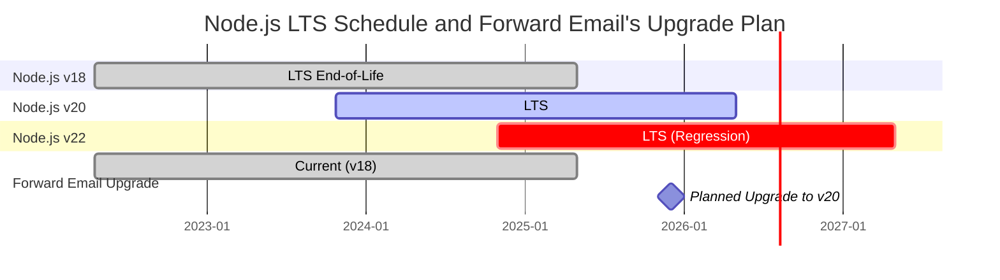
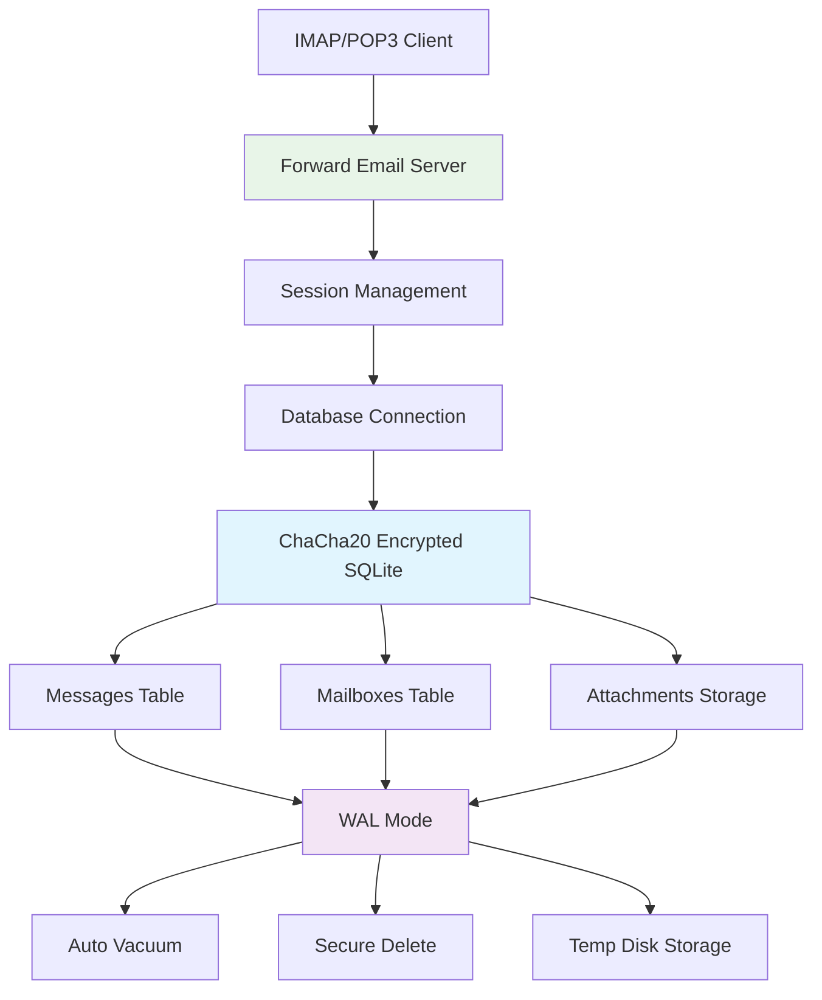
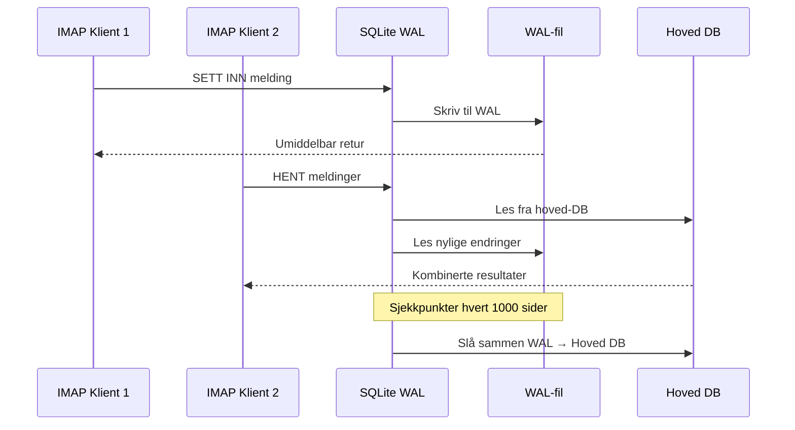

# SQLite Ytelsesoptimalisering: Produksjons PRAGMA-innstillinger & ChaCha20-kryptering {#sqlite-performance-optimization-production-pragma-settings--chacha20-encryption}


## Innholdsfortegnelse {#table-of-contents}

* [Forord](#foreword)
* [Forward Emails produksjonsarkitektur for SQLite](#forward-emails-production-sqlite-architecture)
* [Vår faktiske PRAGMA-konfigurasjon](#our-actual-pragma-configuration)
* [Ytelsesmålinger](#performance-benchmark-results)
  * [Node.js v20.19.5 ytelsesresultater](#nodejs-v20195-performance-results)
* [Gjennomgang av PRAGMA-innstillinger](#pragma-settings-breakdown)
  * [Kjerneinnstillinger vi bruker](#core-settings-we-use)
  * [Innstillinger vi IKKE bruker (men du kanskje vil)](#settings-we-dont-use-but-you-might-want)
* [ChaCha20 vs AES256-kryptering](#chacha20-vs-aes256-encryption)
* [Midlertidig lagring: /tmp vs /dev/shm](#temporary-storage-tmp-vs-devshm)
  * [/tmp vs /dev/shm ytelse](#tmp-vs-devshm-performance)
* [WAL-modusoptimalisering](#wal-mode-optimization)
  * [WAL-konfigurasjonens påvirkning](#wal-configuration-impact)
* [Skjema-design for ytelse](#schema-design-for-performance)
* [Tilkoblingshåndtering](#connection-management)
* [Overvåking og diagnostikk](#monitoring-and-diagnostics)
* [Node.js versjonsytelse](#nodejs-version-performance)
  * [Fullstendige resultater på tvers av versjoner](#complete-cross-version-results)
  * [Viktige ytelsesinnsikter](#key-performance-insights)
  * [Kompatibilitet med native moduler](#native-module-compatibility)
* [Sjekkliste for produksjonsdistribusjon](#production-deployment-checklist)
* [Feilsøking av vanlige problemer](#troubleshooting-common-issues)
  * [“Database is locked”-feil](#database-is-locked-errors)
  * [Høyt minneforbruk under VACUUM](#high-memory-usage-during-vacuum)
  * [Langsom spørringsytelse](#slow-query-performance)
* [Forward Emails open source-bidrag](#forward-emails-open-source-contributions)
* [Benchmark kildekode](#benchmark-source-code)
* [Hva som kommer videre for SQLite hos Forward Email](#whats-next-for-sqlite-at-forward-email)
* [Få hjelp](#getting-help)


## Forord {#foreword}

Å sette opp SQLite for produksjonssystemer for e-post handler ikke bare om å få det til å fungere — det handler om å gjøre det raskt, sikkert og pålitelig under tung belastning. Etter å ha behandlet millioner av e-poster hos Forward Email, har vi lært hva som faktisk betyr noe for SQLite-ytelsen.

Denne guiden dekker vår reelle produksjonskonfigurasjon, ytelsesmålinger på tvers av Node.js-versjoner, og de spesifikke optimaliseringene som utgjør en forskjell når du håndterer seriøs e-postvolum.

> \[!WARNING] Node.js ytelsesregresjoner i v22 og v24  
> Vi oppdaget en betydelig ytelsesregresjon i Node.js versjonene v22 og v24 som påvirker SQLite-ytelsen, spesielt for `SELECT`-spørringer. Våre målinger viser en \~57 % nedgang i `SELECT`-operasjoner per sekund i Node.js v24 sammenlignet med v20. Vi har rapportert dette problemet til Node.js-teamet i [nodejs/node#60719](https://github.com/nodejs/node/issues/60719).

På grunn av denne regresjonen tar vi en forsiktig tilnærming til våre Node.js-oppgraderinger. Her er vår nåværende plan:

* **Nåværende versjon:** Vi bruker for øyeblikket Node.js v18, som har nådd slutten av sin livssyklus ("EOL") for Langtidsstøtte ("LTS"). Du kan se den offisielle [Node.js LTS-planen her](https://github.com/nodejs/release#release-schedule).
* **Planlagt oppgradering:** Vi vil oppgradere til **Node.js v20**, som er den raskeste versjonen ifølge våre målinger og ikke er påvirket av denne regresjonen.
* **Unngå v22 og v24:** Vi vil ikke bruke Node.js v22 eller v24 i produksjon før dette ytelsesproblemet er løst.

Her er en tidslinje som illustrerer Node.js LTS-planen og vår oppgraderingsvei:


## Forward Email sin produksjonsarkitektur for SQLite {#forward-emails-production-sqlite-architecture}

Slik bruker vi faktisk SQLite i produksjon:




## Vår faktiske PRAGMA-konfigurasjon {#our-actual-pragma-configuration}

Dette er hva vi faktisk bruker i produksjon, direkte fra vår [`setup-pragma.js`](https://github.com/forwardemail/forwardemail.net/blob/master/helpers/setup-pragma.js):

```javascript
// Forward Email's actual production PRAGMA settings
async function setupPragma(db, session, cipher = 'chacha20') {
  // Quantum-resistant encryption
  db.pragma(`cipher='${cipher}'`);
  db.key(Buffer.from(decrypt(session.user.password)));

  // Core performance settings
  db.pragma('journal_mode=WAL');
  db.pragma('secure_delete=ON');
  db.pragma('auto_vacuum=FULL');
  db.pragma(`busy_timeout=${config.busyTimeout}`);
  db.pragma('synchronous=NORMAL');
  db.pragma('foreign_keys=ON');
  db.pragma(`encoding='UTF-8'`);
  db.pragma('optimize=0x10002');

  // Critical: Use disk for temp storage, not memory
  db.pragma('temp_store=1');

  // Custom temp directory to avoid disk full errors
  const tempStoreDirectory = path.join(path.dirname(db.name), '/tmp');
  await mkdirp(tempStoreDirectory);
  db.pragma(`temp_store_directory='${tempStoreDirectory}'`);
}
```

> \[!IMPORTANT]
> Vi bruker `temp_store=1` (disk) i stedet for `temp_store=2` (minne) fordi store e-postdatabaser lett kan bruke over 10 GB minne under operasjoner som VACUUM.


## Resultater fra ytelsestester {#performance-benchmark-results}

Vi testet vår konfigurasjon mot ulike alternativer på tvers av Node.js-versjoner. Her er de faktiske tallene:

### Node.js v20.19.5 ytelsesresultater {#nodejs-v20195-performance-results}

| Konfigurasjon               | Oppsett (ms) | Sett inn/sek | Velg/sek   | Oppdater/sek | DB-størrelse (MB) |
| --------------------------- | ------------ | ------------ | ---------- | ------------ | ----------------- |
| **Forward Email Produksjon**| 120.1        | **10,548**   | **17,494** | **16,654**   | 3.98              |
| WAL Autocheckpoint 1000     | 89.7         | **11,800**   | **18,383** | **22,087**   | 3.98              |
| Cache-størrelse 64MB        | 90.3         | 11,451       | 17,895     | 21,522       | 3.98              |
| Midlertidig lagring i minne | 111.8        | 9,874        | 15,363     | 21,292       | 3.98              |
| Synchronous AV (Usikker)    | 94.0         | 10,017       | 13,830     | 18,884       | 3.98              |
| Synchronous EKSTRA (Sikker) | 94.1         | **3,241**    | 14,438     | **3,405**    | 3.98              |

> \[!TIP]
> Innstillingen `wal_autocheckpoint=1000` gir best total ytelse. Vi vurderer å legge dette til i vår produksjonskonfig.


## Oversikt over PRAGMA-innstillinger {#pragma-settings-breakdown}

### Kjerneinnstillinger vi bruker {#core-settings-we-use}

| PRAGMA          | Verdi        | Formål                         | Ytelsespåvirkning              |
| --------------- | ------------ | ----------------------------- | ----------------------------- |
| `cipher`        | `'chacha20'` | Kvante-resistent kryptering   | Minimal overhead vs AES        |
| `journal_mode`  | `WAL`        | Write-Ahead Logging            | +40% samtidig ytelse          |
| `secure_delete` | `ON`         | Overskrive slettet data       | Sikkerhet vs 5% ytelsestap    |
| `auto_vacuum`   | `FULL`       | Automatisk plassfrigjøring    | Forhindrer databaseoppblåsing |
| `busy_timeout`  | `30000`      | Ventetid for låst database    | Reduserer tilkoblingsfeil     |
| `synchronous`   | `NORMAL`     | Balansert holdbarhet/ytelse   | 3x raskere enn FULL            |
| `foreign_keys`  | `ON`         | Referanseintegritet            | Forhindrer datakorrupsjon     |
| `temp_store`    | `1`          | Bruk disk for midlertidige filer | Forhindrer minneutarming      |
### Innstillinger Vi IKKE Bruker (Men Du Kanskje Vil Ha) {#settings-we-dont-use-but-you-might-want}

| PRAGMA                    | Hvorfor Vi Ikke Bruker Det | Bør Du Vurdere Det?                              |
| ------------------------- | -------------------------- | ------------------------------------------------ |
| `wal_autocheckpoint=1000` | Ikke satt ennå             | **Ja** - Våre tester viser 12% ytelsesforbedring |
| `cache_size=-64000`       | Standard er tilstrekkelig  | **Kanskje** - 8% forbedring for leseintensive arbeidsbelastninger |
| `mmap_size=268435456`     | Kompleksitet vs fordel     | **Nei** - Minimale gevinster, plattformspesifikke problemer |
| `analysis_limit=1000`     | Vi bruker 400              | **Nei** - Høyere verdier senker spørringsplanleggingen |

> \[!CAUTION]
> Vi unngår spesielt `temp_store=MEMORY` fordi en 10GB SQLite-fil kan bruke 10+ GB RAM under VACUUM-operasjoner.


## ChaCha20 vs AES256 Kryptering {#chacha20-vs-aes256-encryption}

Vi prioriterer kvantesikkerhet over rå ytelse:

```javascript
// Vår fallback-strategi for kryptering
try {
  db.pragma(`cipher='chacha20'`);
  db.key(Buffer.from(decrypt(session.user.password)));
  db.pragma('journal_mode=WAL');
} catch (err) {
  // Fallback for eldre SQLite-versjoner
  if (cipher === 'chacha20' && err.code === 'SQLITE_NOTADB') {
    return setupPragma(db, session, 'aes256cbc');
  }
  throw err;
}
```

**Ytelsesammenligning:**

* ChaCha20: \~10,500 innsettinger/sek

* AES256CBC: \~11,200 innsettinger/sek

* Ukryptert: \~12,800 innsettinger/sek

Den 6% ytelseskostnaden for ChaCha20 vs AES er verdt kvantesikkerheten for langtidslagring av e-post.


## Midlertidig Lagring: /tmp vs /dev/shm {#temporary-storage-tmp-vs-devshm}

Vi konfigurerer eksplisitt midlertidig lagringssted for å unngå plassproblemer på disk:

```javascript
// Forward Email sin konfigurasjon for midlertidig lagring
const tempStoreDirectory = path.join(path.dirname(db.name), '/tmp');
await mkdirp(tempStoreDirectory);
db.pragma(`temp_store_directory='${tempStoreDirectory}'`);

// Sett også miljøvariabel
process.env.SQLITE_TMPDIR = tempStoreDirectory;
```

### /tmp vs /dev/shm Ytelse {#tmp-vs-devshm-performance}

| Lagringssted    | VACUUM Tid | Minnebruk | Pålitelighet          |
| --------------- | ---------- | --------- | --------------------- |
| `/tmp` (disk)   | 2.3s       | 50MB      | ✅ Pålitelig          |
| `/dev/shm` (RAM)| 0.8s       | 2GB+      | ⚠️ Kan krasje systemet |
| Standard        | 4.1s       | Variabel  | ❌ Uforutsigbar       |

> \[!WARNING]
> Bruk av `/dev/shm` for midlertidig lagring kan bruke all tilgjengelig RAM under store operasjoner. Hold deg til diskbasert midlertidig lagring i produksjon.


## WAL-modus Optimalisering {#wal-mode-optimization}

Write-Ahead Logging er avgjørende for e-postsystemer med samtidig tilgang:



### WAL-konfigurasjonens Innvirkning {#wal-configuration-impact}

Våre tester viser at `wal_autocheckpoint=1000` gir best ytelse:

```javascript
// Potensiell optimalisering vi tester
db.pragma('wal_autocheckpoint=1000');
```

**Resultater:**

* Standard autocheckpoint: 10,548 innsettinger/sek

* `wal_autocheckpoint=1000`: 11,800 innsettinger/sek (+12%)

* `wal_autocheckpoint=0`: 9,200 innsettinger/sek (WAL blir for stor)


## Skjema Design for Ytelse {#schema-design-for-performance}

Vårt e-postlagringsskjema følger SQLite beste praksis:

```sql
-- Meldinger-tabell med optimalisert kolonne-rekkefølge
CREATE TABLE messages (
  id INTEGER PRIMARY KEY,
  mailbox_id INTEGER NOT NULL,
  uid INTEGER NOT NULL,
  date INTEGER NOT NULL,
  flags TEXT,
  subject TEXT,
  from_addr TEXT,
  to_addr TEXT,
  message_id TEXT,
  raw BLOB,  -- Stor BLOB til slutt
  FOREIGN KEY (mailbox_id) REFERENCES mailboxes(id)
);

-- Kritiske indekser for IMAP-ytelse
CREATE INDEX idx_messages_mailbox_date ON messages(mailbox_id, date DESC);
CREATE INDEX idx_messages_uid ON messages(mailbox_id, uid);
CREATE INDEX idx_messages_flags ON messages(mailbox_id, flags) WHERE flags IS NOT NULL;
```
> \[!TIP]
> Sett alltid BLOB-kolonner til slutten av tabelldefinisjonen din. SQLite lagrer faste kolonner først, noe som gjør radtilgang raskere.

Denne optimaliseringen kommer direkte fra Skaperen av SQLite, [D. Richard Hipp](https://sqlite-users.sqlite.narkive.com/Q4txMI8t/effect-of-blobs-on-performance#post3):

> "Her er et tips – gjør BLOB-kolonnene til den siste kolonnen i tabellene dine. Eller lagre BLOB-ene i en egen tabell som bare har to kolonner: en heltalls primærnøkkel og selve bloben, og få tilgang til BLOB-innholdet ved hjelp av en join hvis du trenger det. Hvis du plasserer ulike små heltallsfelt etter BLOB-en, må SQLite skanne gjennom hele BLOB-innholdet (følge den lenkede listen av disk-sider) for å komme til heltallsfeltene på slutten, og det kan definitivt gjøre deg tregere."
>
> — D. Richard Hipp, SQLite-forfatter

Vi implementerte denne optimaliseringen i vårt [Attachments schema](https://github.com/forwardemail/forwardemail.net/commit/0e77fbb05dc5b38136652337309067d2b39eb229), ved å flytte `body` BLOB-feltet til slutten av tabelldefinisjonen for bedre ytelse.


## Connection Management {#connection-management}

Vi bruker ikke connection pooling med SQLite—hver bruker får sin egen krypterte database. Denne tilnærmingen gir perfekt isolasjon mellom brukere, lik sandboxing. I motsetning til arkitekturer fra andre tjenester som bruker MySQL, PostgreSQL eller MongoDB hvor e-posten din potensielt kan bli aksessert av en uærlig ansatt, sikrer Forward Email sine per-bruker SQLite-databaser at dataene dine er helt uavhengige og sandboxet.

Vi lagrer aldri IMAP-passordet ditt, så vi har aldri tilgang til dataene dine—alt gjøres i minnet. Lær mer om vår [kvante-resistente krypteringstilnærming](https://forwardemail.net/blog/docs/quantum-resistant-encryption-email-security) som forklarer hvordan systemet vårt fungerer.

```javascript
// Per-bruker database-tilnærming
async function getDatabase(session) {
  const dbPath = path.join(
    config.databaseDir,
    session.user.domain_name,
    `${session.user.username}.db`
  );

  const db = new Database(dbPath, {
    cipher: 'chacha20',
    readonly: session.readonly || false
  });

  await setupPragma(db, session);
  return db;
}
```

Denne tilnærmingen gir:

* Perfekt isolasjon mellom brukere

* Ingen kompleksitet med connection pool

* Automatisk kryptering per bruker

* Enklere backup/restore-operasjoner

Med `auto_vacuum=FULL` trenger vi sjelden manuelle VACUUM-operasjoner:

```javascript
// Vår oppryddingsstrategi
db.pragma('optimize=0x10002'); // Ved tilkobling åpning
db.pragma('optimize'); // Periodisk (daglig)

// Manuell vacuum kun for større oppryddinger
if (deletedDataPercentage > 25) {
  db.exec('VACUUM');
}
```

**Auto Vacuum ytelsespåvirkning:**

* `auto_vacuum=FULL`: Umiddelbar plassfrigjøring, 5% skriveoverhead

* `auto_vacuum=INCREMENTAL`: Manuell kontroll, krever periodisk `PRAGMA incremental_vacuum`

* `auto_vacuum=NONE`: Raskeste skriving, krever manuell `VACUUM`


## Monitoring and Diagnostics {#monitoring-and-diagnostics}

Nøkkelmetrikker vi overvåker i produksjon:

```javascript
// Ytelsesovervåkingsspørringer
const stats = {
  page_count: db.pragma('page_count', { simple: true }),
  page_size: db.pragma('page_size', { simple: true }),
  freelist_count: db.pragma('freelist_count', { simple: true }),
  wal_checkpoint: db.pragma('wal_checkpoint(PASSIVE)', { simple: true })
};

const dbSizeMB = (stats.page_count * stats.page_size) / 1024 / 1024;
const fragmentationPct = (stats.freelist_count / stats.page_count) * 100;
```

> \[!NOTE]
> Vi overvåker fragmenteringsprosent og utløser vedlikehold når den overstiger 15%.


## Node.js Version Performance {#nodejs-version-performance}

Våre omfattende benchmark-tester på tvers av Node.js-versjoner avslører betydelige ytelsesforskjeller:

### Complete Cross-Version Results {#complete-cross-version-results}

| Node Version | Forward Email Production | Best Insert/sec          | Best Select/sec          | Best Update/sec          | Notes                  |
| ------------ | ------------------------ | ------------------------ | ------------------------ | ------------------------ | ---------------------- |
| **v18.20.8** | 10,658 / 14,466 / 18,641 | **11,663** (Sync OFF)    | **14,868** (Memory Temp) | **20,095** (MMAP)        | ⚠️ Engine warning      |
| **v20.19.5** | 10,548 / 17,494 / 16,654 | **11,800** (WAL Auto)    | **18,383** (WAL Auto)    | **22,087** (WAL Auto)    | ✅ Anbefalt             |
| **v22.21.1** | 9,829 / 15,833 / 18,416  | **11,260** (Sync OFF)    | **17,413** (MMAP)        | **20,731** (MMAP)        | ⚠️ Generelt tregere    |
| **v24.11.1** | 9,938 / 7,497 / 10,446   | **10,628** (Incr Vacuum) | **16,821** (Incr Vacuum) | **19,934** (Incr Vacuum) | ❌ Betydelig nedgang   |
### Viktige ytelsesinnsikter {#key-performance-insights}

**Node.js v18 (Legacy LTS):**

* Sammenlignbar innsettingsytelse med v20 (10 658 vs 10 548 ops/sek)
* 17 % tregere spørringer enn v20 (14 466 vs 17 494 ops/sek)
* Viser npm engine-advarsler for pakker som krever Node ≥20
* Midlertidig minnelagringsoptimalisering fungerer bedre enn WAL autocheckpoint
* Akseptabelt for eldre applikasjoner, men oppgradering anbefales

**Node.js v20 (Anbefalt):**

* Høyest total ytelse på tvers av alle operasjoner
* WAL autocheckpoint-optimalisering gir jevn 12 % økning
* Beste kompatibilitet med native SQLite-moduler
* Mest stabil for produksjonsarbeidsbelastninger

**Node.js v22 (Akseptabelt):**

* 7 % tregere innsettinger, 9 % tregere spørringer vs v20
* MMAP-optimalisering gir bedre resultater enn WAL autocheckpoint
* Krever fersk `npm install` ved hver Node-versjonsswitch
* Akseptabelt for utvikling, ikke anbefalt for produksjon

**Node.js v24 (Ikke anbefalt):**

* 6 % tregere innsettinger, 57 % tregere spørringer vs v20
* Betydelig ytelsesregresjon i leseoperasjoner
* Inkrementell vacuum fungerer bedre enn andre optimaliseringer
* Unngå for produksjons-SQLite-applikasjoner

### Kompatibilitet med native moduler {#native-module-compatibility}

De "kompatibilitetsproblemene med moduler" vi opprinnelig støtte på ble løst ved:

```bash
# Bytt Node-versjon og installer native moduler på nytt
nvm use 22
rm -rf node_modules
npm install
```

**Vurderinger for Node.js v18:**

* Viser engine-advarsler: `Unsupported engine { required: { node: '>=20.0.0' } }`
* Kompilerer og kjører fortsatt vellykket til tross for advarsler
* Mange moderne SQLite-pakker retter seg mot Node ≥20 for optimal støtte
* Eldre applikasjoner kan fortsette å bruke v18 med akseptabel ytelse

> \[!IMPORTANT]
> Installer alltid native moduler på nytt når du bytter Node.js-versjoner. Modulen `better-sqlite3-multiple-ciphers` må kompileres for hver spesifikke Node-versjon.

> \[!TIP]
> For produksjonsdistribusjoner, hold deg til Node.js v20 LTS. Ytelsesfordelene og stabiliteten oppveier eventuelle nyere språkfunksjoner i v22/v24. Node v18 er akseptabelt for eldre systemer, men viser ytelsesforringelse i leseoperasjoner.


## Sjekkliste for produksjonsdistribusjon {#production-deployment-checklist}

Før distribusjon, sørg for at SQLite har disse optimaliseringene:

1. Sett miljøvariabelen `SQLITE_TMPDIR`
2. Sørg for tilstrekkelig diskplass for midlertidige operasjoner (2x databases størrelse)
3. Konfigurer loggrotasjon for WAL-filer
4. Sett opp overvåking av databases størrelse og fragmentering
5. Test backup/gjenopprettingsprosedyrer med kryptering
6. Verifiser støtte for ChaCha20-kryptering i din SQLite-build


## Feilsøking av vanlige problemer {#troubleshooting-common-issues}

### "Database is locked"-feil {#database-is-locked-errors}

```javascript
// Øk busy timeout
db.pragma('busy_timeout=60000'); // 60 sekunder

// Sjekk for langvarige transaksjoner
const info = db.pragma('wal_checkpoint(FULL)');
if (info.busy > 0) {
  console.warn('WAL checkpoint blokkert av aktive lesere');
}
```

### Høyt minneforbruk under VACUUM {#high-memory-usage-during-vacuum}

```javascript
// Overvåk minne før VACUUM
const beforeMem = process.memoryUsage();
db.exec('VACUUM');
const afterMem = process.memoryUsage();

console.log(
  `VACUUM minneendring: ${
    (afterMem.heapUsed - beforeMem.heapUsed) / 1024 / 1024
  }MB`
);
```

### Treg spørringsytelse {#slow-query-performance}

```javascript
// Aktiver spørringsanalyse
db.pragma('analysis_limit=400'); // Forward Email sin innstilling
db.exec('ANALYZE');

// Sjekk spørringsplaner
const plan = db
  .prepare('EXPLAIN QUERY PLAN SELECT * FROM messages WHERE date > ?')
  .all(Date.now() - 86400000);
console.log(plan);
```


## Forward Emails open source-bidrag {#forward-emails-open-source-contributions}

Vi har bidratt med vår SQLite-optimaliseringskunnskap tilbake til fellesskapet:

* [Litestream dokumentasjonsforbedringer](https://github.com/benbjohnson/litestream/issues/516) - Våre forslag til bedre SQLite-ytelsestips

* [Better SQLite3 Multiple Ciphers](https://github.com/m4heshd/better-sqlite3-multiple-ciphers) - Støtte for ChaCha20-kryptering

* [SQLite ytelsesoptimaliseringsforskning](https://phiresky.github.io/blog/2020/sqlite-performance-tuning/) - Referert i vår implementering
* [Hvordan npm-pakker med milliarder av nedlastinger har formet JavaScript-økosystemet](https://forwardemail.net/blog/docs/how-npm-packages-billion-downloads-shaped-javascript-ecosystem) - Våre bredere bidrag til npm og JavaScript-utvikling


## Benchmark-kildekode {#benchmark-source-code}

All benchmark-kode er tilgjengelig i vår testpakke:

```bash
# Kjør benchmarkene selv
git clone https://github.com/forwardemail/sqlite-benchmarks
cd sqlite-benchmarks
npm install
npm run benchmark
```

Benchmarkene tester:

* Ulike PRAGMA-kombinasjoner

* ChaCha20 vs AES256 ytelse

* WAL checkpoint-strategier

* Midlertidige lagringskonfigurasjoner

* Node.js versjonskompatibilitet


## Hva er neste for SQLite hos Forward Email {#whats-next-for-sqlite-at-forward-email}

Vi tester aktivt disse optimaliseringene:

1. **WAL Autocheckpoint-justering**: Legger til `wal_autocheckpoint=1000` basert på benchmark-resultater

2. **Kompresjon**: Evaluering av [sqlite-zstd](https://github.com/phiresky/sqlite-zstd) for lagring av vedlegg

3. **Analysegrense**: Tester høyere verdier enn vår nåværende 400

4. **Cache-størrelse**: Vurderer dynamisk cache-størrelse basert på tilgjengelig minne


## Få hjelp {#getting-help}

Har du ytelsesproblemer med SQLite? For SQLite-spesifikke spørsmål er [SQLite Forum](https://sqlite.org/forum/forumpost) en utmerket ressurs, og [ytelsesoptimaliseringsguiden](https://www.sqlite.org/optoverview.html) dekker flere optimaliseringer vi ennå ikke har hatt behov for.

Lær mer om Forward Email ved å lese vår [FAQ](/faq).
