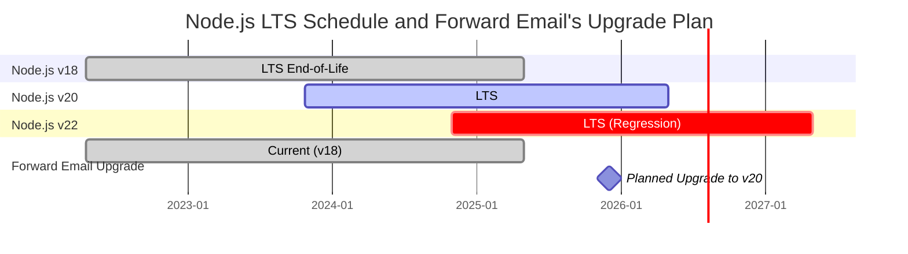
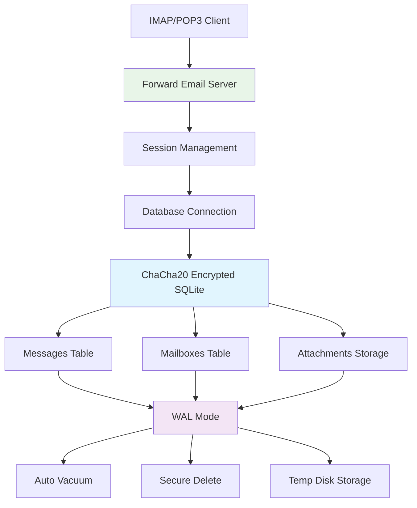
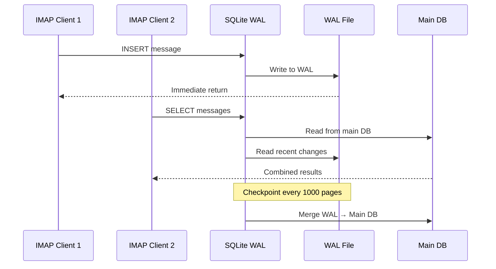

# Optymalizacja wydajności SQLite: ustawienia PRAGMA produkcji i szyfrowanie ChaCha20 {#sqlite-performance-optimization-production-pragma-settings--chacha20-encryption}


## Spis treści {#table-of-contents}

* [Przedmowa](#foreword)
* [Architektura produkcyjna SQLite w Forward Email](#forward-emails-production-sqlite-architecture)
* [Nasza aktualna konfiguracja PRAGMA](#our-actual-pragma-configuration)
* [Wyniki testów wydajności](#performance-benchmark-results)
  * [Wyniki wydajności Node.js v20.19.5](#nodejs-v20195-performance-results)
* [Analiza ustawień PRAGMA](#pragma-settings-breakdown)
  * [Podstawowe ustawienia, których używamy](#core-settings-we-use)
  * [Ustawienia, których NIE używamy (ale możesz chcieć)](#settings-we-dont-use-but-you-might-want)
* [Szyfrowanie ChaCha20 vs AES256](#chacha20-vs-aes256-encryption)
* [Pamięć tymczasowa: /tmp vs /dev/shm](#temporary-storage-tmp-vs-devshm)
  * [Wydajność /tmp vs /dev/shm](#tmp-vs-devshm-performance)
* [Optymalizacja trybu WAL](#wal-mode-optimization)
  * [Wpływ konfiguracji WAL](#wal-configuration-impact)
* [Projektowanie schematu pod kątem wydajności](#schema-design-for-performance)
* [Zarządzanie połączeniami](#connection-management)
* [Monitorowanie i diagnostyka](#monitoring-and-diagnostics)
* [Wydajność wersji Node.js](#nodejs-version-performance)
  * [Pełne wyniki międzywersyjne](#complete-cross-version-results)
  * [Kluczowe wnioski dotyczące wydajności](#key-performance-insights)
  * [Kompatybilność modułów natywnych](#native-module-compatibility)
* [Lista kontrolna wdrożenia produkcyjnego](#production-deployment-checklist)
* [Rozwiązywanie typowych problemów](#troubleshooting-common-issues)
  * [Błędy "Database is locked"]( #database-is-locked-errors)
  * [Wysokie zużycie pamięci podczas VACUUM](#high-memory-usage-during-vacuum)
  * [Wolne działanie zapytań](#slow-query-performance)
* [Wkład open source Forward Email](#forward-emails-open-source-contributions)
* [Kod źródłowy testów wydajności](#benchmark-source-code)
* [Co dalej z SQLite w Forward Email](#whats-next-for-sqlite-at-forward-email)
* [Uzyskiwanie pomocy](#getting-help)


## Przedmowa {#foreword}

Konfiguracja SQLite dla produkcyjnych systemów e-mail to nie tylko kwestia uruchomienia — chodzi o to, by działał szybko, bezpiecznie i niezawodnie pod dużym obciążeniem. Po przetworzeniu milionów wiadomości e-mail w Forward Email nauczyliśmy się, co naprawdę ma znaczenie dla wydajności SQLite.

Ten przewodnik obejmuje naszą rzeczywistą konfigurację produkcyjną, wyniki testów wydajności na różnych wersjach Node.js oraz konkretne optymalizacje, które robią różnicę, gdy obsługujesz poważny wolumen e-maili.

> \[!WARNING] Regresje wydajności Node.js w wersjach v22 i v24  
> Odkryliśmy znaczącą regresję wydajności w wersjach Node.js v22 i v24, która wpływa na wydajność SQLite, szczególnie dla zapytań `SELECT`. Nasze testy wykazały spadek liczby operacji `SELECT` na sekundę o około 57% w Node.js v24 w porównaniu do v20. Zgłosiliśmy ten problem zespołowi Node.js w [nodejs/node#60719](https://github.com/nodejs/node/issues/60719).

Z powodu tej regresji podchodzimy ostrożnie do aktualizacji Node.js. Oto nasz obecny plan:

* **Aktualna wersja:** Obecnie korzystamy z Node.js v18, który osiągnął koniec wsparcia ("EOL") dla Long-Term Support ("LTS"). Oficjalny [harmonogram LTS Node.js znajdziesz tutaj](https://github.com/nodejs/release#release-schedule).
* **Planowana aktualizacja:** Zamierzamy przejść na **Node.js v20**, który według naszych testów jest najszybszą wersją i nie jest dotknięty tą regresją.
* **Unikanie v22 i v24:** Nie będziemy używać Node.js v22 ani v24 w produkcji, dopóki problem z wydajnością nie zostanie rozwiązany.

Poniżej znajduje się harmonogram ilustrujący plan LTS Node.js oraz naszą ścieżkę aktualizacji:


## Architektura produkcyjna SQLite Forward Email {#forward-emails-production-sqlite-architecture}

Oto jak faktycznie używamy SQLite w produkcji:




## Nasza faktyczna konfiguracja PRAGMA {#our-actual-pragma-configuration}

To jest to, czego faktycznie używamy w produkcji, prosto z naszego [`setup-pragma.js`](https://github.com/forwardemail/forwardemail.net/blob/master/helpers/setup-pragma.js):

```javascript
// Forward Email's actual production PRAGMA settings
async function setupPragma(db, session, cipher = 'chacha20') {
  // Quantum-resistant encryption
  db.pragma(`cipher='${cipher}'`);
  db.key(Buffer.from(decrypt(session.user.password)));

  // Core performance settings
  db.pragma('journal_mode=WAL');
  db.pragma('secure_delete=ON');
  db.pragma('auto_vacuum=FULL');
  db.pragma(`busy_timeout=${config.busyTimeout}`);
  db.pragma('synchronous=NORMAL');
  db.pragma('foreign_keys=ON');
  db.pragma(`encoding='UTF-8'`);
  db.pragma('optimize=0x10002');

  // Critical: Use disk for temp storage, not memory
  db.pragma('temp_store=1');

  // Custom temp directory to avoid disk full errors
  const tempStoreDirectory = path.join(path.dirname(db.name), '/tmp');
  await mkdirp(tempStoreDirectory);
  db.pragma(`temp_store_directory='${tempStoreDirectory}'`);
}
```

> \[!IMPORTANT]
> Używamy `temp_store=1` (dysk) zamiast `temp_store=2` (pamięć), ponieważ duże bazy danych e-mail mogą łatwo zużywać ponad 10 GB pamięci podczas operacji takich jak VACUUM.


## Wyniki testów wydajności {#performance-benchmark-results}

Testowaliśmy naszą konfigurację w porównaniu z różnymi alternatywami na różnych wersjach Node.js. Oto rzeczywiste liczby:

### Wyniki wydajności Node.js v20.19.5 {#nodejs-v20195-performance-results}

| Konfiguracja                | Setup (ms) | Wstawianie/s | Selekcja/s | Aktualizacja/s | Rozmiar DB (MB) |
| ---------------------------- | ---------- | ---------- | ---------- | ---------- | ------------ |
| **Forward Email Production** | 120.1      | **10,548** | **17,494** | **16,654** | 3.98         |
| WAL Autocheckpoint 1000      | 89.7       | **11,800** | **18,383** | **22,087** | 3.98         |
| Cache Size 64MB              | 90.3       | 11,451     | 17,895     | 21,522     | 3.98         |
| Memory Temp Storage          | 111.8      | 9,874      | 15,363     | 21,292     | 3.98         |
| Synchronous OFF (Unsafe)     | 94.0       | 10,017     | 13,830     | 18,884     | 3.98         |
| Synchronous EXTRA (Safe)     | 94.1       | **3,241**  | 14,438     | **3,405**  | 3.98         |

> \[!TIP]
> Ustawienie `wal_autocheckpoint=1000` pokazuje najlepszą ogólną wydajność. Rozważamy dodanie tego do naszej konfiguracji produkcyjnej.


## Szczegóły ustawień PRAGMA {#pragma-settings-breakdown}

### Podstawowe ustawienia, których używamy {#core-settings-we-use}

| PRAGMA          | Wartość        | Cel                            | Wpływ na wydajność             |
| --------------- | -------------- | ------------------------------ | ------------------------------ |
| `cipher`        | `'chacha20'`   | Szyfrowanie odporne na kwanty  | Minimalny narzut w porównaniu do AES |
| `journal_mode`  | `WAL`          | Write-Ahead Logging            | +40% wydajności współbieżnej   |
| `secure_delete` | `ON`           | Nadpisywanie usuniętych danych | Bezpieczeństwo kosztem 5% wydajności |
| `auto_vacuum`   | `FULL`         | Automatyczne odzyskiwanie przestrzeni | Zapobiega rozrostowi bazy danych |
| `busy_timeout`  | `30000`        | Czas oczekiwania na zablokowaną bazę | Zmniejsza liczbę błędów połączenia |
| `synchronous`   | `NORMAL`       | Zrównoważona trwałość/wydajność | 3x szybsze niż FULL            |
| `foreign_keys`  | `ON`           | Integralność referencyjna      | Zapobiega uszkodzeniom danych  |
| `temp_store`    | `1`            | Użycie dysku do plików tymczasowych | Zapobiega wyczerpaniu pamięci  |
### Ustawienia, których NIE używamy (ale możesz chcieć) {#settings-we-dont-use-but-you-might-want}

| PRAGMA                    | Dlaczego go nie używamy | Czy powinieneś to rozważyć?                         |
| ------------------------- | ----------------------- | -------------------------------------------------- |
| `wal_autocheckpoint=1000` | Jeszcze nie ustawione   | **Tak** - Nasze testy pokazują 12% wzrost wydajności |
| `cache_size=-64000`       | Domyślne jest wystarczające | **Może** - 8% poprawa dla obciążeń z przewagą odczytów |
| `mmap_size=268435456`     | Złożoność vs korzyść    | **Nie** - Minimalne zyski, problemy specyficzne dla platformy |
| `analysis_limit=1000`     | Używamy 400             | **Nie** - Wyższe wartości spowalniają planowanie zapytań |

> \[!CAUTION]
> Specjalnie unikamy `temp_store=MEMORY`, ponieważ plik SQLite o rozmiarze 10 GB może zużywać ponad 10 GB RAM podczas operacji VACUUM.


## Szyfrowanie ChaCha20 vs AES256 {#chacha20-vs-aes256-encryption}

Priorytetem jest dla nas odporność na komputery kwantowe ponad surową wydajność:

```javascript
// Nasza strategia zapasowego szyfrowania
try {
  db.pragma(`cipher='chacha20'`);
  db.key(Buffer.from(decrypt(session.user.password)));
  db.pragma('journal_mode=WAL');
} catch (err) {
  // Zapas dla starszych wersji SQLite
  if (cipher === 'chacha20' && err.code === 'SQLITE_NOTADB') {
    return setupPragma(db, session, 'aes256cbc');
  }
  throw err;
}
```

**Porównanie wydajności:**

* ChaCha20: ~10 500 wstawek/sek

* AES256CBC: ~11 200 wstawek/sek

* Nieszyfrowane: ~12 800 wstawek/sek

6% koszt wydajności ChaCha20 względem AES jest wart odporności kwantowej dla długoterminowego przechowywania maili.


## Pamięć tymczasowa: /tmp vs /dev/shm {#temporary-storage-tmp-vs-devshm}

Wyraźnie konfigurujemy lokalizację pamięci tymczasowej, aby uniknąć problemów z miejscem na dysku:

```javascript
// Konfiguracja pamięci tymczasowej Forward Email
const tempStoreDirectory = path.join(path.dirname(db.name), '/tmp');
await mkdirp(tempStoreDirectory);
db.pragma(`temp_store_directory='${tempStoreDirectory}'`);

// Ustaw też zmienną środowiskową
process.env.SQLITE_TMPDIR = tempStoreDirectory;
```

### Wydajność /tmp vs /dev/shm {#tmp-vs-devshm-performance}

| Lokalizacja pamięci | Czas VACUUM | Zużycie pamięci | Niezawodność          |
| ------------------- | ----------- | --------------- | --------------------- |
| `/tmp` (dysk)       | 2,3s        | 50MB            | ✅ Niezawodne          |
| `/dev/shm` (RAM)    | 0,8s        | 2GB+            | ⚠️ Może zawiesić system |
| Domyślne            | 4,1s        | Zmienna         | ❌ Nieprzewidywalne    |

> \[!WARNING]
> Używanie `/dev/shm` jako pamięci tymczasowej może zużyć całą dostępną pamięć RAM podczas dużych operacji. W środowisku produkcyjnym trzymaj się pamięci tymczasowej opartej na dysku.


## Optymalizacja trybu WAL {#wal-mode-optimization}

Write-Ahead Logging jest kluczowy dla systemów mailowych z równoczesnym dostępem:



### Wpływ konfiguracji WAL {#wal-configuration-impact}

Nasze testy pokazują, że `wal_autocheckpoint=1000` zapewnia najlepszą wydajność:

```javascript
// Potencjalna optymalizacja, którą testujemy
db.pragma('wal_autocheckpoint=1000');
```

**Wyniki:**

* Domyślny autocheckpoint: 10 548 wstawek/sek

* `wal_autocheckpoint=1000`: 11 800 wstawek/sek (+12%)

* `wal_autocheckpoint=0`: 9 200 wstawek/sek (WAL rośnie zbyt duży)


## Projekt schematu dla wydajności {#schema-design-for-performance}

Nasz schemat przechowywania maili stosuje najlepsze praktyki SQLite:

```sql
-- Tabela wiadomości z zoptymalizowaną kolejnością kolumn
CREATE TABLE messages (
  id INTEGER PRIMARY KEY,
  mailbox_id INTEGER NOT NULL,
  uid INTEGER NOT NULL,
  date INTEGER NOT NULL,
  flags TEXT,
  subject TEXT,
  from_addr TEXT,
  to_addr TEXT,
  message_id TEXT,
  raw BLOB,  -- Duży BLOB na końcu
  FOREIGN KEY (mailbox_id) REFERENCES mailboxes(id)
);

-- Krytyczne indeksy dla wydajności IMAP
CREATE INDEX idx_messages_mailbox_date ON messages(mailbox_id, date DESC);
CREATE INDEX idx_messages_uid ON messages(mailbox_id, uid);
CREATE INDEX idx_messages_flags ON messages(mailbox_id, flags) WHERE flags IS NOT NULL;
```
> \[!TIP]
> Zawsze umieszczaj kolumny BLOB na końcu definicji tabeli. SQLite najpierw przechowuje kolumny o stałym rozmiarze, co przyspiesza dostęp do wierszy.

Ta optymalizacja pochodzi bezpośrednio od twórcy SQLite, [D. Richarda Hippa](https://sqlite-users.sqlite.narkive.com/Q4txMI8t/effect-of-blobs-on-performance#post3):

> "Oto wskazówka - umieść kolumny BLOB jako ostatnie w swoich tabelach. Lub nawet przechowuj BLOB-y w osobnej tabeli, która ma tylko dwie kolumny: całkowity klucz główny i sam blob, a następnie uzyskuj dostęp do zawartości BLOB za pomocą join, jeśli potrzebujesz. Jeśli umieścisz różne małe pola całkowite po BLOB-ie, to SQLite musi przeszukać całą zawartość BLOB (podążając za listą powiązanych stron dysku), aby dostać się do pól całkowitych na końcu, co zdecydowanie może Cię spowolnić."
>
> — D. Richard Hipp, autor SQLite

Wdrożyliśmy tę optymalizację w naszym [schemacie załączników](https://github.com/forwardemail/forwardemail.net/commit/0e77fbb05dc5b38136652337309067d2b39eb229), przesuwając pole BLOB `body` na koniec definicji tabeli dla lepszej wydajności.


## Zarządzanie połączeniami {#connection-management}

Nie używamy puli połączeń z SQLite — każdy użytkownik ma swoją własną zaszyfrowaną bazę danych. Takie podejście zapewnia idealną izolację między użytkownikami, podobnie jak sandboxing. W przeciwieństwie do architektur innych usług korzystających z MySQL, PostgreSQL lub MongoDB, gdzie Twój e-mail mógłby potencjalnie zostać odczytany przez nieuczciwego pracownika, bazy SQLite per użytkownik w Forward Email gwarantują, że Twoje dane są całkowicie niezależne i odizolowane.

Nigdy nie przechowujemy Twojego hasła IMAP, więc nigdy nie mamy dostępu do Twoich danych — wszystko odbywa się w pamięci. Dowiedz się więcej o naszym [kwantowo-odpornym podejściu do szyfrowania](https://forwardemail.net/blog/docs/quantum-resistant-encryption-email-security), które szczegółowo opisuje działanie naszego systemu.

```javascript
// Podejście z bazą danych per użytkownik
async function getDatabase(session) {
  const dbPath = path.join(
    config.databaseDir,
    session.user.domain_name,
    `${session.user.username}.db`
  );

  const db = new Database(dbPath, {
    cipher: 'chacha20',
    readonly: session.readonly || false
  });

  await setupPragma(db, session);
  return db;
}
```

To podejście zapewnia:

* Idealną izolację między użytkownikami

* Brak złożoności puli połączeń

* Automatyczne szyfrowanie per użytkownik

* Prostszą obsługę kopii zapasowych/przywracania

Dzięki `auto_vacuum=FULL` rzadko potrzebujemy ręcznych operacji VACUUM:

```javascript
// Nasza strategia sprzątania
db.pragma('optimize=0x10002'); // Przy otwarciu połączenia
db.pragma('optimize'); // Okresowo (codziennie)

// Ręczne vacuum tylko przy większych porządkach
if (deletedDataPercentage > 25) {
  db.exec('VACUUM');
}
```

**Wpływ Auto Vacuum na wydajność:**

* `auto_vacuum=FULL`: Natychmiastowe odzyskiwanie przestrzeni, 5% narzutu na zapis

* `auto_vacuum=INCREMENTAL`: Ręczna kontrola, wymaga okresowego `PRAGMA incremental_vacuum`

* `auto_vacuum=NONE`: Najszybsze zapisy, wymaga ręcznego `VACUUM`


## Monitorowanie i diagnostyka {#monitoring-and-diagnostics}

Kluczowe metryki, które śledzimy w produkcji:

```javascript
// Zapytania monitorujące wydajność
const stats = {
  page_count: db.pragma('page_count', { simple: true }),
  page_size: db.pragma('page_size', { simple: true }),
  freelist_count: db.pragma('freelist_count', { simple: true }),
  wal_checkpoint: db.pragma('wal_checkpoint(PASSIVE)', { simple: true })
};

const dbSizeMB = (stats.page_count * stats.page_size) / 1024 / 1024;
const fragmentationPct = (stats.freelist_count / stats.page_count) * 100;
```

> \[!NOTE]
> Monitorujemy procent fragmentacji i uruchamiamy konserwację, gdy przekracza 15%.


## Wydajność wersji Node.js {#nodejs-version-performance}

Nasze kompleksowe benchmarki na różnych wersjach Node.js ujawniają znaczące różnice w wydajności:

### Pełne wyniki między wersjami {#complete-cross-version-results}

| Wersja Node | Forward Email Produkcja | Najlepsze Insert/s       | Najlepsze Select/s       | Najlepsze Update/s       | Uwagi                  |
| ------------ | ------------------------ | ------------------------ | ------------------------ | ------------------------ | ---------------------- |
| **v18.20.8** | 10,658 / 14,466 / 18,641 | **11,663** (Sync OFF)    | **14,868** (Memory Temp) | **20,095** (MMAP)        | ⚠️ Ostrzeżenie silnika  |
| **v20.19.5** | 10,548 / 17,494 / 16,654 | **11,800** (WAL Auto)    | **18,383** (WAL Auto)    | **22,087** (WAL Auto)    | ✅ Zalecane             |
| **v22.21.1** | 9,829 / 15,833 / 18,416  | **11,260** (Sync OFF)    | **17,413** (MMAP)        | **20,731** (MMAP)        | ⚠️ Ogólnie wolniejsze   |
| **v24.11.1** | 9,938 / 7,497 / 10,446   | **10,628** (Incr Vacuum) | **16,821** (Incr Vacuum) | **19,934** (Incr Vacuum) | ❌ Znaczące spowolnienie |
### Kluczowe Wnioski Wydajnościowe {#key-performance-insights}

**Node.js v18 (Legacy LTS):**

* Porównywalna wydajność wstawiania do v20 (10,658 vs 10,548 operacji/sek)
* 17% wolniejsze zapytania SELECT niż w v20 (14,466 vs 17,494 operacji/sek)
* Pokazuje ostrzeżenia silnika npm dla pakietów wymagających Node ≥20
* Optymalizacja tymczasowego przechowywania w pamięci działa lepiej niż automatyczne punktowanie kontrolne WAL
* Akceptowalny dla aplikacji legacy, ale zalecana aktualizacja

**Node.js v20 (Zalecany):**

* Najwyższa ogólna wydajność we wszystkich operacjach
* Optymalizacja automatycznego punktowania kontrolnego WAL zapewnia stały wzrost o 12%
* Najlepsza kompatybilność z natywnymi modułami SQLite
* Najbardziej stabilny dla obciążeń produkcyjnych

**Node.js v22 (Akceptowalny):**

* 7% wolniejsze wstawiania, 9% wolniejsze zapytania SELECT w porównaniu do v20
* Optymalizacja MMAP daje lepsze wyniki niż automatyczne punktowanie kontrolne WAL
* Wymaga świeżej instalacji `npm install` przy każdej zmianie wersji Node
* Akceptowalny do rozwoju, niezalecany do produkcji

**Node.js v24 (Nie Zalecany):**

* 6% wolniejsze wstawiania, 57% wolniejsze zapytania SELECT w porównaniu do v20
* Znaczna regresja wydajności w operacjach odczytu
* Inkrementalne odkurzanie działa lepiej niż inne optymalizacje
* Unikać w produkcyjnych aplikacjach SQLite

### Kompatybilność Natywnych Modułów {#native-module-compatibility}

"Początkowe problemy z kompatybilnością modułów" zostały rozwiązane przez:

```bash
# Zmiana wersji Node i ponowna instalacja natywnych modułów
nvm use 22
rm -rf node_modules
npm install
```

**Uwagi dotyczące Node.js v18:**

* Pokazuje ostrzeżenia silnika: `Unsupported engine { required: { node: '>=20.0.0' } }`
* Nadal kompiluje się i działa pomimo ostrzeżeń
* Wiele nowoczesnych pakietów SQLite celuje w Node ≥20 dla optymalnego wsparcia
* Aplikacje legacy mogą nadal używać v18 z akceptowalną wydajnością

> \[!IMPORTANT]
> Zawsze ponownie instaluj natywne moduły przy zmianie wersji Node.js. Moduł `better-sqlite3-multiple-ciphers` musi być kompilowany dla każdej konkretnej wersji Node.

> \[!TIP]
> Do wdrożeń produkcyjnych trzymaj się Node.js v20 LTS. Korzyści wydajnościowe i stabilność przewyższają nowe funkcje językowe w v22/v24. Node v18 jest akceptowalny dla systemów legacy, ale wykazuje pogorszenie wydajności w operacjach odczytu.


## Lista Kontrolna Wdrożenia Produkcyjnego {#production-deployment-checklist}

Przed wdrożeniem upewnij się, że SQLite ma następujące optymalizacje:

1. Ustaw zmienną środowiskową `SQLITE_TMPDIR`
2. Zapewnij odpowiednią przestrzeń dyskową dla operacji tymczasowych (2x rozmiar bazy danych)
3. Skonfiguruj rotację logów dla plików WAL
4. Ustaw monitoring rozmiaru bazy i fragmentacji
5. Przetestuj procedury backup/restore z szyfrowaniem
6. Zweryfikuj wsparcie szyfru ChaCha20 w swojej kompilacji SQLite


## Rozwiązywanie Typowych Problemów {#troubleshooting-common-issues}

### Błędy "Database is locked" {#database-is-locked-errors}

```javascript
// Zwiększ timeout oczekiwania
db.pragma('busy_timeout=60000'); // 60 sekund

// Sprawdź długotrwałe transakcje
const info = db.pragma('wal_checkpoint(FULL)');
if (info.busy > 0) {
  console.warn('Punkt kontrolny WAL zablokowany przez aktywnych czytelników');
}
```

### Wysokie zużycie pamięci podczas VACUUM {#high-memory-usage-during-vacuum}

```javascript
// Monitoruj pamięć przed VACUUM
const beforeMem = process.memoryUsage();
db.exec('VACUUM');
const afterMem = process.memoryUsage();

console.log(
  `Różnica pamięci po VACUUM: ${
    (afterMem.heapUsed - beforeMem.heapUsed) / 1024 / 1024
  }MB`
);
```

### Wolna wydajność zapytań {#slow-query-performance}

```javascript
// Włącz analizę zapytań
db.pragma('analysis_limit=400'); // ustawienie Forward Email
db.exec('ANALYZE');

// Sprawdź plany zapytań
const plan = db
  .prepare('EXPLAIN QUERY PLAN SELECT * FROM messages WHERE date > ?')
  .all(Date.now() - 86400000);
console.log(plan);
```


## Wkład Open Source Forward Email {#forward-emails-open-source-contributions}

Podzieliliśmy się naszą wiedzą o optymalizacji SQLite ze społecznością:

* [Ulepszenia dokumentacji Litestream](https://github.com/benbjohnson/litestream/issues/516) - Nasze sugestie dotyczące lepszych wskazówek wydajności SQLite

* [Better SQLite3 Multiple Ciphers](https://github.com/m4heshd/better-sqlite3-multiple-ciphers) - wsparcie szyfrowania ChaCha20

* [Badania nad tuningiem wydajności SQLite](https://phiresky.github.io/blog/2020/sqlite-performance-tuning/) - Referencje w naszej implementacji
* [Jak pakiety npm z miliardem pobrań ukształtowały ekosystem JavaScript](https://forwardemail.net/blog/docs/how-npm-packages-billion-downloads-shaped-javascript-ecosystem) - Nasz szerszy wkład w rozwój npm i JavaScript


## Benchmark Source Code {#benchmark-source-code}

Cały kod benchmarków jest dostępny w naszym zestawie testów:

```bash
# Uruchom benchmarki samodzielnie
git clone https://github.com/forwardemail/sqlite-benchmarks
cd sqlite-benchmarks
npm install
npm run benchmark
```

Benchmarki testują:

* Różne kombinacje PRAGMA

* Wydajność ChaCha20 vs AES256

* Strategie punktów kontrolnych WAL

* Konfiguracje pamięci tymczasowej

* Kompatybilność z wersjami Node.js


## What's Next for SQLite at Forward Email {#whats-next-for-sqlite-at-forward-email}

Aktywnie testujemy następujące optymalizacje:

1. **Dostrajanie WAL Autocheckpoint**: Dodanie `wal_autocheckpoint=1000` na podstawie wyników benchmarków

2. **Kompresja**: Ocena [sqlite-zstd](https://github.com/phiresky/sqlite-zstd) do przechowywania załączników

3. **Limit analizy**: Testowanie wartości wyższych niż obecne 400

4. **Rozmiar pamięci podręcznej**: Rozważanie dynamicznego rozmiaru pamięci podręcznej w zależności od dostępnej pamięci


## Getting Help {#getting-help}

Masz problemy z wydajnością SQLite? W przypadku pytań dotyczących SQLite doskonałym źródłem jest [SQLite Forum](https://sqlite.org/forum/forumpost), a [przewodnik po optymalizacji wydajności](https://www.sqlite.org/optoverview.html) zawiera dodatkowe optymalizacje, których jeszcze nie potrzebowaliśmy.

Dowiedz się więcej o Forward Email, czytając naszą [FAQ](/faq).
