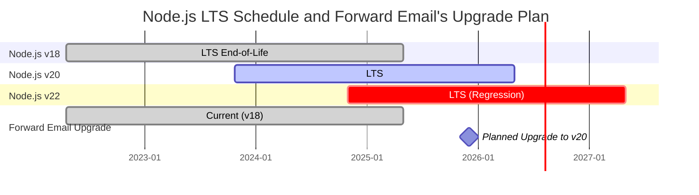
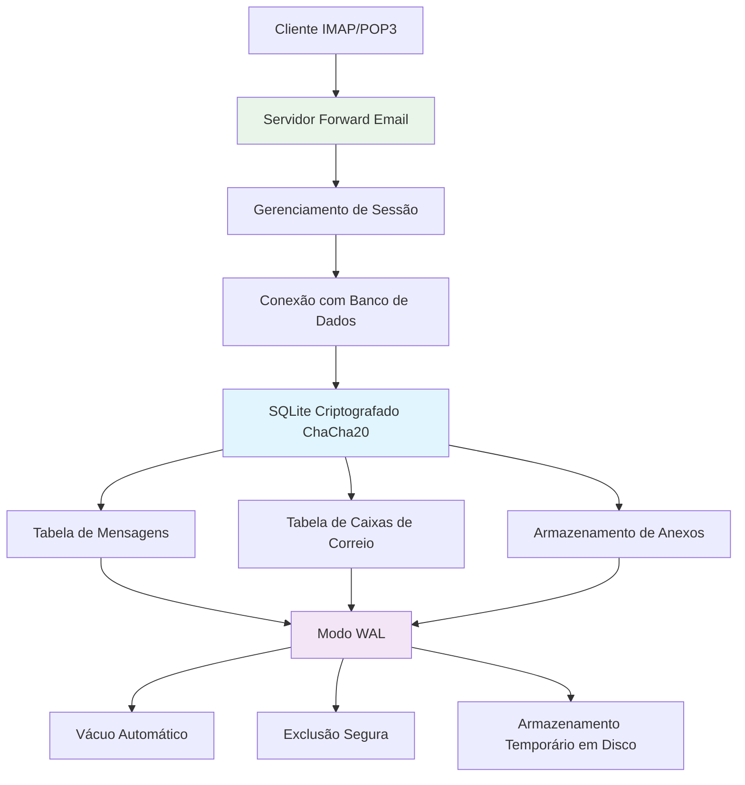
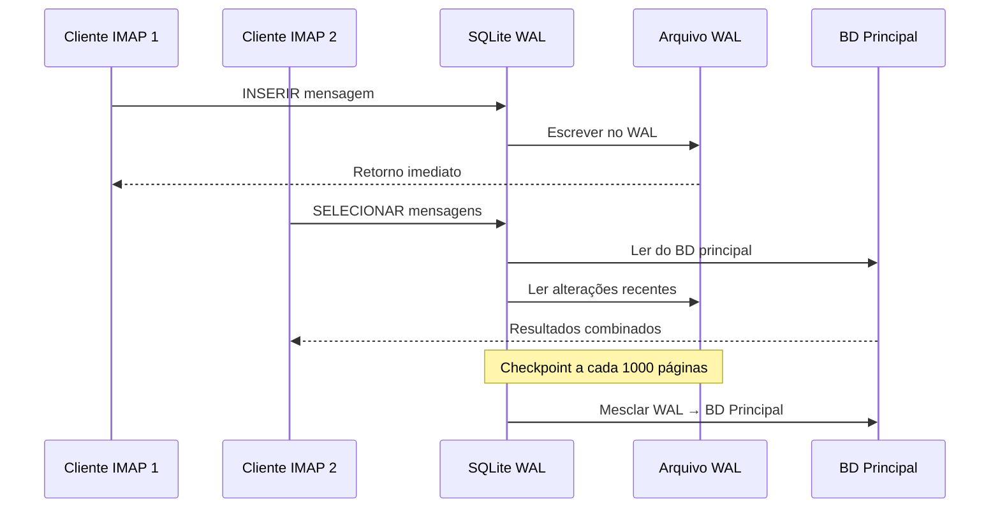

# Otimização de Performance do SQLite: Configurações PRAGMA para Produção & Criptografia ChaCha20 {#sqlite-performance-optimization-production-pragma-settings--chacha20-encryption}


## Índice {#table-of-contents}

* [Prefácio](#foreword)
* [Arquitetura SQLite de Produção do Forward Email](#forward-emails-production-sqlite-architecture)
* [Nossa Configuração PRAGMA Atual](#our-actual-pragma-configuration)
* [Resultados do Benchmark de Performance](#performance-benchmark-results)
  * [Resultados de Performance do Node.js v20.19.5](#nodejs-v20195-performance-results)
* [Análise das Configurações PRAGMA](#pragma-settings-breakdown)
  * [Configurações Principais que Usamos](#core-settings-we-use)
  * [Configurações que NÃO Usamos (Mas Você Pode Querer)](#settings-we-dont-use-but-you-might-want)
* [Criptografia ChaCha20 vs AES256](#chacha20-vs-aes256-encryption)
* [Armazenamento Temporário: /tmp vs /dev/shm](#temporary-storage-tmp-vs-devshm)
  * [Performance /tmp vs /dev/shm](#tmp-vs-devshm-performance)
* [Otimização do Modo WAL](#wal-mode-optimization)
  * [Impacto da Configuração WAL](#wal-configuration-impact)
* [Design do Esquema para Performance](#schema-design-for-performance)
* [Gerenciamento de Conexões](#connection-management)
* [Monitoramento e Diagnóstico](#monitoring-and-diagnostics)
* [Performance por Versão do Node.js](#nodejs-version-performance)
  * [Resultados Completos entre Versões](#complete-cross-version-results)
  * [Principais Insights de Performance](#key-performance-insights)
  * [Compatibilidade com Módulos Nativos](#native-module-compatibility)
* [Checklist para Implantação em Produção](#production-deployment-checklist)
* [Resolução de Problemas Comuns](#troubleshooting-common-issues)
  * [Erros "Database is locked"](#database-is-locked-errors)
  * [Alto Uso de Memória Durante VACUUM](#high-memory-usage-during-vacuum)
  * [Performance Lenta em Consultas](#slow-query-performance)
* [Contribuições Open Source do Forward Email](#forward-emails-open-source-contributions)
* [Código Fonte do Benchmark](#benchmark-source-code)
* [O Que Vem a Seguir para o SQLite no Forward Email](#whats-next-for-sqlite-at-forward-email)
* [Obtendo Ajuda](#getting-help)


## Prefácio {#foreword}

Configurar o SQLite para sistemas de email em produção não é apenas fazer funcionar — é torná-lo rápido, seguro e confiável sob carga pesada. Após processar milhões de emails no Forward Email, aprendemos o que realmente importa para a performance do SQLite.

Este guia cobre nossa configuração real de produção, resultados de benchmark em várias versões do Node.js, e as otimizações específicas que fazem diferença quando você está lidando com um volume sério de emails.

> \[!WARNING] Regressões de Performance no Node.js nas versões v22 e v24  
> Descobrimos uma regressão significativa de performance nas versões v22 e v24 do Node.js que impacta a performance do SQLite, particularmente para instruções `SELECT`. Nossos benchmarks mostram uma queda de \~57% nas operações `SELECT` por segundo no Node.js v24 comparado ao v20. Reportamos este problema para a equipe do Node.js em [nodejs/node#60719](https://github.com/nodejs/node/issues/60719).

Devido a essa regressão, estamos adotando uma abordagem cautelosa para nossas atualizações do Node.js. Aqui está nosso plano atual:

* **Versão Atual:** Atualmente estamos no Node.js v18, que atingiu seu fim de vida ("EOL") para Suporte de Longo Prazo ("LTS"). Você pode ver o [cronograma oficial do Node.js LTS aqui](https://github.com/nodejs/release#release-schedule).
* **Atualização Planejada:** Faremos upgrade para **Node.js v20**, que é a versão mais rápida segundo nossos benchmarks e não é afetada por essa regressão.
* **Evitando v22 e v24:** Não usaremos Node.js v22 ou v24 em produção até que esse problema de performance seja resolvido.

Aqui está uma linha do tempo ilustrando o cronograma LTS do Node.js e nosso caminho de atualização:


## Arquitetura SQLite de Produção do Forward Email {#forward-emails-production-sqlite-architecture}

Aqui está como realmente usamos o SQLite em produção:




## Nossa Configuração PRAGMA Atual {#our-actual-pragma-configuration}

Isto é o que realmente usamos em produção, direto do nosso [`setup-pragma.js`](https://github.com/forwardemail/forwardemail.net/blob/master/helpers/setup-pragma.js):

```javascript
// Configurações PRAGMA reais de produção do Forward Email
async function setupPragma(db, session, cipher = 'chacha20') {
  // Criptografia resistente a computação quântica
  db.pragma(`cipher='${cipher}'`);
  db.key(Buffer.from(decrypt(session.user.password)));

  // Configurações principais de desempenho
  db.pragma('journal_mode=WAL');
  db.pragma('secure_delete=ON');
  db.pragma('auto_vacuum=FULL');
  db.pragma(`busy_timeout=${config.busyTimeout}`);
  db.pragma('synchronous=NORMAL');
  db.pragma('foreign_keys=ON');
  db.pragma(`encoding='UTF-8'`);
  db.pragma('optimize=0x10002');

  // Crítico: Usar disco para armazenamento temporário, não memória
  db.pragma('temp_store=1');

  // Diretório temporário personalizado para evitar erros de disco cheio
  const tempStoreDirectory = path.join(path.dirname(db.name), '/tmp');
  await mkdirp(tempStoreDirectory);
  db.pragma(`temp_store_directory='${tempStoreDirectory}'`);
}
```

> \[!IMPORTANT]
> Usamos `temp_store=1` (disco) em vez de `temp_store=2` (memória) porque grandes bancos de dados de email podem facilmente consumir mais de 10 GB de memória durante operações como VACUUM.


## Resultados do Benchmark de Desempenho {#performance-benchmark-results}

Testamos nossa configuração contra várias alternativas em diferentes versões do Node.js. Aqui estão os números reais:

### Resultados de Desempenho do Node.js v20.19.5 {#nodejs-v20195-performance-results}

| Configuração                 | Setup (ms) | Inserções/seg | Seleções/seg | Atualizações/seg | Tamanho BD (MB) |
| ---------------------------- | ---------- | ------------ | ------------ | --------------- | --------------- |
| **Produção Forward Email**   | 120.1      | **10.548**   | **17.494**   | **16.654**      | 3,98            |
| WAL Autocheckpoint 1000      | 89.7       | **11.800**   | **18.383**   | **22.087**      | 3,98            |
| Cache Size 64MB              | 90.3       | 11.451       | 17.895       | 21.522          | 3,98            |
| Armazenamento Temporário Memória | 111.8  | 9.874        | 15.363       | 21.292          | 3,98            |
| Synchronous OFF (Inseguro)   | 94.0       | 10.017       | 13.830       | 18.884          | 3,98            |
| Synchronous EXTRA (Seguro)   | 94.1       | **3.241**    | 14.438       | **3.405**       | 3,98            |

> \[!TIP]
> A configuração `wal_autocheckpoint=1000` apresenta o melhor desempenho geral. Estamos considerando adicioná-la à nossa configuração de produção.


## Detalhamento das Configurações PRAGMA {#pragma-settings-breakdown}

### Configurações Principais que Usamos {#core-settings-we-use}

| PRAGMA          | Valor        | Propósito                      | Impacto no Desempenho           |
| --------------- | ------------ | ------------------------------ | ------------------------------ |
| `cipher`        | `'chacha20'` | Criptografia resistente a computação quântica | Sobrecarga mínima em relação ao AES |
| `journal_mode`  | `WAL`        | Write-Ahead Logging            | +40% de desempenho concorrente |
| `secure_delete` | `ON`         | Sobrescrever dados deletados  | Segurança vs custo de 5% no desempenho |
| `auto_vacuum`   | `FULL`       | Reivindicação automática de espaço | Evita crescimento excessivo do banco |
| `busy_timeout`  | `30000`      | Tempo de espera para banco bloqueado | Reduz falhas de conexão        |
| `synchronous`   | `NORMAL`     | Durabilidade/desempenho balanceados | 3x mais rápido que FULL         |
| `foreign_keys`  | `ON`         | Integridade referencial        | Evita corrupção de dados       |
| `temp_store`    | `1`          | Usar disco para arquivos temporários | Evita esgotamento de memória   |
### Configurações Que NÃO Usamos (Mas Você Pode Querer) {#settings-we-dont-use-but-you-might-want}

| PRAGMA                    | Por Que Não Usamos   | Você Deve Considerar?                             |
| ------------------------- | --------------------- | --------------------------------------------------- |
| `wal_autocheckpoint=1000` | Ainda não configurado           | **Sim** - Nossos benchmarks mostram ganho de desempenho de 12%  |
| `cache_size=-64000`       | O padrão é suficiente | **Talvez** - Melhora de 8% para cargas de trabalho com muitas leituras |
| `mmap_size=268435456`     | Complexidade vs benefício | **Não** - Ganhos mínimos, problemas específicos da plataforma    |
| `analysis_limit=1000`     | Usamos 400            | **Não** - Valores maiores desaceleram o planejamento de consultas     |

> \[!CAUTION]
> Evitamos especificamente `temp_store=MEMORY` porque um arquivo SQLite de 10GB pode consumir mais de 10 GB de RAM durante operações VACUUM.


## Criptografia ChaCha20 vs AES256 {#chacha20-vs-aes256-encryption}

Priorizamos resistência quântica em vez de desempenho bruto:

```javascript
// Nossa estratégia de fallback para criptografia
try {
  db.pragma(`cipher='chacha20'`);
  db.key(Buffer.from(decrypt(session.user.password)));
  db.pragma('journal_mode=WAL');
} catch (err) {
  // Fallback para versões antigas do SQLite
  if (cipher === 'chacha20' && err.code === 'SQLITE_NOTADB') {
    return setupPragma(db, session, 'aes256cbc');
  }
  throw err;
}
```

**Comparação de Desempenho:**

* ChaCha20: \~10.500 inserções/segundo

* AES256CBC: \~11.200 inserções/segundo

* Sem criptografia: \~12.800 inserções/segundo

O custo de desempenho de 6% do ChaCha20 em relação ao AES vale a resistência quântica para armazenamento de e-mails a longo prazo.


## Armazenamento Temporário: /tmp vs /dev/shm {#temporary-storage-tmp-vs-devshm}

Configuramos explicitamente o local de armazenamento temporário para evitar problemas de espaço em disco:

```javascript
// Configuração de armazenamento temporário do Forward Email
const tempStoreDirectory = path.join(path.dirname(db.name), '/tmp');
await mkdirp(tempStoreDirectory);
db.pragma(`temp_store_directory='${tempStoreDirectory}'`);

// Também define variável de ambiente
process.env.SQLITE_TMPDIR = tempStoreDirectory;
```

### Desempenho /tmp vs /dev/shm {#tmp-vs-devshm-performance}

| Local de Armazenamento | Tempo VACUUM | Uso de Memória | Confiabilidade         |
| ---------------------- | ------------ | -------------- | ---------------------- |
| `/tmp` (disco)         | 2,3s         | 50MB           | ✅ Confiável           |
| `/dev/shm` (RAM)       | 0,8s         | 2GB+           | ⚠️ Pode travar o sistema |
| Padrão                 | 4,1s         | Variável       | ❌ Imprevisível        |

> \[!WARNING]
> Usar `/dev/shm` para armazenamento temporário pode consumir toda a RAM disponível durante operações grandes. Use armazenamento temporário baseado em disco para produção.


## Otimização do Modo WAL {#wal-mode-optimization}

Write-Ahead Logging é crucial para sistemas de e-mail com acesso concorrente:



### Impacto da Configuração WAL {#wal-configuration-impact}

Nossos benchmarks mostram que `wal_autocheckpoint=1000` oferece o melhor desempenho:

```javascript
// Otimização potencial que estamos testando
db.pragma('wal_autocheckpoint=1000');
```

**Resultados:**

* Autocheckpoint padrão: 10.548 inserções/segundo

* `wal_autocheckpoint=1000`: 11.800 inserções/segundo (+12%)

* `wal_autocheckpoint=0`: 9.200 inserções/segundo (WAL cresce demais)


## Design do Esquema para Desempenho {#schema-design-for-performance}

Nosso esquema de armazenamento de e-mails segue as melhores práticas do SQLite:

```sql
-- Tabela de mensagens com ordem de colunas otimizada
CREATE TABLE messages (
  id INTEGER PRIMARY KEY,
  mailbox_id INTEGER NOT NULL,
  uid INTEGER NOT NULL,
  date INTEGER NOT NULL,
  flags TEXT,
  subject TEXT,
  from_addr TEXT,
  to_addr TEXT,
  message_id TEXT,
  raw BLOB,  -- BLOB grande no final
  FOREIGN KEY (mailbox_id) REFERENCES mailboxes(id)
);

-- Índices críticos para desempenho IMAP
CREATE INDEX idx_messages_mailbox_date ON messages(mailbox_id, date DESC);
CREATE INDEX idx_messages_uid ON messages(mailbox_id, uid);
CREATE INDEX idx_messages_flags ON messages(mailbox_id, flags) WHERE flags IS NOT NULL;
```
> \[!TIP]
> Sempre coloque colunas BLOB no final da definição da sua tabela. O SQLite armazena colunas de tamanho fixo primeiro, tornando o acesso às linhas mais rápido.

Essa otimização vem diretamente do criador do SQLite, [D. Richard Hipp](https://sqlite-users.sqlite.narkive.com/Q4txMI8t/effect-of-blobs-on-performance#post3):

> "Aqui vai uma dica - faça as colunas BLOB serem a última coluna nas suas tabelas. Ou até armazene os BLOBs em uma tabela separada que tenha apenas duas colunas: uma chave primária inteira e o próprio blob, e então acesse o conteúdo do BLOB usando um join se precisar. Se você colocar vários campos inteiros pequenos depois do BLOB, então o SQLite precisa escanear todo o conteúdo do BLOB (seguindo a lista ligada de páginas de disco) para chegar aos campos inteiros no final, e isso definitivamente pode te deixar mais lento."
>
> — D. Richard Hipp, Autor do SQLite

Implementamos essa otimização em nosso [esquema de Anexos](https://github.com/forwardemail/forwardemail.net/commit/0e77fbb05dc5b38136652337309067d2b39eb229), movendo o campo BLOB `body` para o final da definição da tabela para melhor desempenho.


## Gerenciamento de Conexão {#connection-management}

Não usamos pool de conexões com SQLite—cada usuário tem seu próprio banco de dados criptografado. Essa abordagem fornece isolamento perfeito entre usuários, semelhante a sandboxing. Diferente de arquiteturas de outros serviços que usam MySQL, PostgreSQL ou MongoDB onde seu e-mail poderia ser potencialmente acessado por um funcionário mal-intencionado, os bancos de dados SQLite por usuário do Forward Email garantem que seus dados sejam completamente independentes e isolados.

Nunca armazenamos sua senha IMAP, então nunca temos acesso aos seus dados—tudo é feito em memória. Saiba mais sobre nossa [abordagem de criptografia resistente a computadores quânticos](https://forwardemail.net/blog/docs/quantum-resistant-encryption-email-security) que detalha como nosso sistema funciona.

```javascript
// Abordagem de banco de dados por usuário
async function getDatabase(session) {
  const dbPath = path.join(
    config.databaseDir,
    session.user.domain_name,
    `${session.user.username}.db`
  );

  const db = new Database(dbPath, {
    cipher: 'chacha20',
    readonly: session.readonly || false
  });

  await setupPragma(db, session);
  return db;
}
```

Essa abordagem oferece:

* Isolamento perfeito entre usuários

* Sem complexidade de pool de conexões

* Criptografia automática por usuário

* Operações de backup/restore mais simples

Com `auto_vacuum=FULL`, raramente precisamos de operações VACUUM manuais:

```javascript
// Nossa estratégia de limpeza
db.pragma('optimize=0x10002'); // Ao abrir conexão
db.pragma('optimize'); // Periodicamente (diariamente)

// Vacuum manual apenas para limpezas maiores
if (deletedDataPercentage > 25) {
  db.exec('VACUUM');
}
```

**Impacto de desempenho do Auto Vacuum:**

* `auto_vacuum=FULL`: Reivindicação imediata de espaço, 5% de overhead na escrita

* `auto_vacuum=INCREMENTAL`: Controle manual, requer `PRAGMA incremental_vacuum` periódico

* `auto_vacuum=NONE`: Escritas mais rápidas, requer `VACUUM` manual


## Monitoramento e Diagnósticos {#monitoring-and-diagnostics}

Principais métricas que monitoramos em produção:

```javascript
// Consultas de monitoramento de desempenho
const stats = {
  page_count: db.pragma('page_count', { simple: true }),
  page_size: db.pragma('page_size', { simple: true }),
  freelist_count: db.pragma('freelist_count', { simple: true }),
  wal_checkpoint: db.pragma('wal_checkpoint(PASSIVE)', { simple: true })
};

const dbSizeMB = (stats.page_count * stats.page_size) / 1024 / 1024;
const fragmentationPct = (stats.freelist_count / stats.page_count) * 100;
```

> \[!NOTE]
> Monitoramos a porcentagem de fragmentação e acionamos manutenção quando ultrapassa 15%.


## Desempenho por Versão do Node.js {#nodejs-version-performance}

Nossos benchmarks abrangentes entre versões do Node.js revelam diferenças significativas de desempenho:

### Resultados Completos Entre Versões {#complete-cross-version-results}

| Versão do Node | Produção Forward Email    | Melhor Insert/seg       | Melhor Select/seg       | Melhor Update/seg       | Notas                  |
| -------------- | ------------------------- | ----------------------- | ----------------------- | ----------------------- | ---------------------- |
| **v18.20.8**   | 10.658 / 14.466 / 18.641  | **11.663** (Sync OFF)   | **14.868** (Memory Temp)| **20.095** (MMAP)       | ⚠️ Aviso do motor       |
| **v20.19.5**   | 10.548 / 17.494 / 16.654  | **11.800** (WAL Auto)   | **18.383** (WAL Auto)   | **22.087** (WAL Auto)   | ✅ Recomendado          |
| **v22.21.1**   | 9.829 / 15.833 / 18.416   | **11.260** (Sync OFF)   | **17.413** (MMAP)       | **20.731** (MMAP)       | ⚠️ Mais lento no geral  |
| **v24.11.1**   | 9.938 / 7.497 / 10.446    | **10.628** (Incr Vacuum)| **16.821** (Incr Vacuum)| **19.934** (Incr Vacuum)| ❌ Lentidão significativa |
### Principais Insights de Desempenho {#key-performance-insights}

**Node.js v18 (Legacy LTS):**

* Desempenho de inserção comparável ao v20 (10.658 vs 10.548 ops/sec)
* Seleções 17% mais lentas que o v20 (14.466 vs 17.494 ops/sec)
* Exibe avisos do engine npm para pacotes que requerem Node ≥20
* Otimização de armazenamento temporário de memória funciona melhor que o checkpoint automático WAL
* Aceitável para aplicações legadas, mas atualização recomendada

**Node.js v20 (Recomendado):**

* Maior desempenho geral em todas as operações
* Otimização de checkpoint automático WAL fornece aumento consistente de 12%
* Melhor compatibilidade com módulos nativos SQLite
* Mais estável para cargas de trabalho em produção

**Node.js v22 (Aceitável):**

* Inserções 7% mais lentas, seleções 9% mais lentas vs v20
* Otimização MMAP mostra melhores resultados que checkpoint automático WAL
* Requer `npm install` novo para cada troca de versão do Node
* Aceitável para desenvolvimento, não recomendado para produção

**Node.js v24 (Não Recomendado):**

* Inserções 6% mais lentas, seleções 57% mais lentas vs v20
* Regressão significativa de desempenho em operações de leitura
* Vacuum incremental tem desempenho melhor que outras otimizações
* Evitar para aplicações SQLite em produção

### Compatibilidade de Módulos Nativos {#native-module-compatibility}

Os "problemas de compatibilidade de módulos" que inicialmente encontramos foram resolvidos por:

```bash
# Trocar versão do Node e reinstalar módulos nativos
nvm use 22
rm -rf node_modules
npm install
```

**Considerações sobre Node.js v18:**

* Exibe avisos do engine: `Unsupported engine { required: { node: '>=20.0.0' } }`
* Ainda compila e roda com sucesso apesar dos avisos
* Muitos pacotes modernos SQLite têm como alvo Node ≥20 para suporte ideal
* Aplicações legadas podem continuar usando v18 com desempenho aceitável

> \[!IMPORTANT]
> Sempre reinstale módulos nativos ao trocar versões do Node.js. O módulo `better-sqlite3-multiple-ciphers` deve ser compilado para cada versão específica do Node.

> \[!TIP]
> Para implantações em produção, mantenha-se com Node.js v20 LTS. Os benefícios de desempenho e estabilidade superam quaisquer recursos mais recentes da linguagem em v22/v24. Node v18 é aceitável para sistemas legados, mas apresenta degradação de desempenho em operações de leitura.


## Checklist para Implantação em Produção {#production-deployment-checklist}

Antes de implantar, assegure que o SQLite tenha estas otimizações:

1. Defina a variável de ambiente `SQLITE_TMPDIR`
2. Garanta espaço em disco adequado para operações temporárias (2x o tamanho do banco)
3. Configure rotação de logs para arquivos WAL
4. Configure monitoramento para tamanho do banco e fragmentação
5. Teste procedimentos de backup/restore com criptografia
6. Verifique suporte ao cifrador ChaCha20 na sua build do SQLite


## Solução de Problemas Comuns {#troubleshooting-common-issues}

### Erros "Database is locked" {#database-is-locked-errors}

```javascript
// Aumentar timeout de busy
db.pragma('busy_timeout=60000'); // 60 segundos

// Verificar transações de longa duração
const info = db.pragma('wal_checkpoint(FULL)');
if (info.busy > 0) {
  console.warn('Checkpoint WAL bloqueado por leitores ativos');
}
```

### Alto Uso de Memória Durante VACUUM {#high-memory-usage-during-vacuum}

```javascript
// Monitorar memória antes do VACUUM
const beforeMem = process.memoryUsage();
db.exec('VACUUM');
const afterMem = process.memoryUsage();

console.log(
  `Delta de memória do VACUUM: ${
    (afterMem.heapUsed - beforeMem.heapUsed) / 1024 / 1024
  }MB`
);
```

### Desempenho Lento de Consultas {#slow-query-performance}

```javascript
// Habilitar análise de consultas
db.pragma('analysis_limit=400'); // Configuração do Forward Email
db.exec('ANALYZE');

// Verificar planos de consulta
const plan = db
  .prepare('EXPLAIN QUERY PLAN SELECT * FROM messages WHERE date > ?')
  .all(Date.now() - 86400000);
console.log(plan);
```


## Contribuições Open Source do Forward Email {#forward-emails-open-source-contributions}

Contribuímos nosso conhecimento de otimização SQLite de volta para a comunidade:

* [Melhorias na documentação do Litestream](https://github.com/benbjohnson/litestream/issues/516) - Nossas sugestões para melhores dicas de desempenho SQLite

* [Better SQLite3 Multiple Ciphers](https://github.com/m4heshd/better-sqlite3-multiple-ciphers) - Suporte à criptografia ChaCha20

* [Pesquisa de tuning de desempenho SQLite](https://phiresky.github.io/blog/2020/sqlite-performance-tuning/) - Referenciada em nossa implementação
* [Como pacotes npm com bilhões de downloads moldaram o ecossistema JavaScript](https://forwardemail.net/blog/docs/how-npm-packages-billion-downloads-shaped-javascript-ecosystem) - Nossas contribuições mais amplas para o desenvolvimento do npm e JavaScript


## Código Fonte do Benchmark {#benchmark-source-code}

Todo o código do benchmark está disponível em nossa suíte de testes:

```bash
# Execute os benchmarks você mesmo
git clone https://github.com/forwardemail/sqlite-benchmarks
cd sqlite-benchmarks
npm install
npm run benchmark
```

Os benchmarks testam:

* Várias combinações de PRAGMA

* Desempenho ChaCha20 vs AES256

* Estratégias de checkpoint WAL

* Configurações de armazenamento temporário

* Compatibilidade com versões do Node.js


## O Que Vem a Seguir para SQLite no Forward Email {#whats-next-for-sqlite-at-forward-email}

Estamos testando ativamente essas otimizações:

1. **Ajuste do Autocheckpoint WAL**: Adicionando `wal_autocheckpoint=1000` com base nos resultados do benchmark

2. **Compressão**: Avaliando [sqlite-zstd](https://github.com/phiresky/sqlite-zstd) para armazenamento de anexos

3. **Limite de Análise**: Testando valores maiores que nosso atual 400

4. **Tamanho do Cache**: Considerando dimensionamento dinâmico do cache baseado na memória disponível


## Obtendo Ajuda {#getting-help}

Está tendo problemas de desempenho com SQLite? Para perguntas específicas sobre SQLite, o [Fórum SQLite](https://sqlite.org/forum/forumpost) é um excelente recurso, e o [guia de otimização de desempenho](https://www.sqlite.org/optoverview.html) cobre otimizações adicionais que ainda não precisávamos.

Saiba mais sobre o Forward Email lendo nosso [FAQ](/faq).
