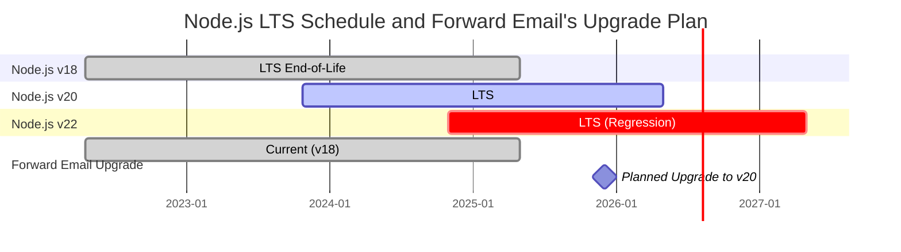
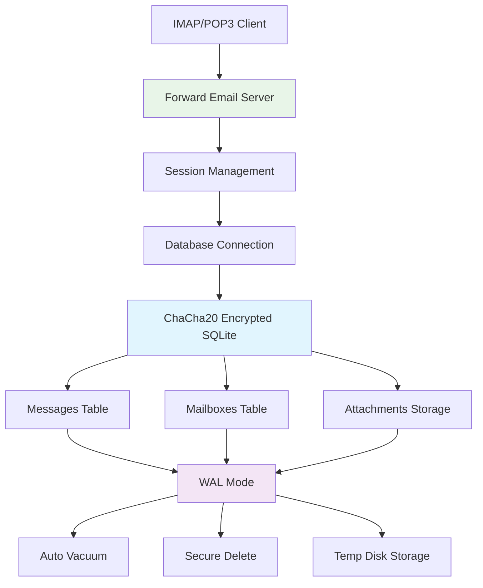
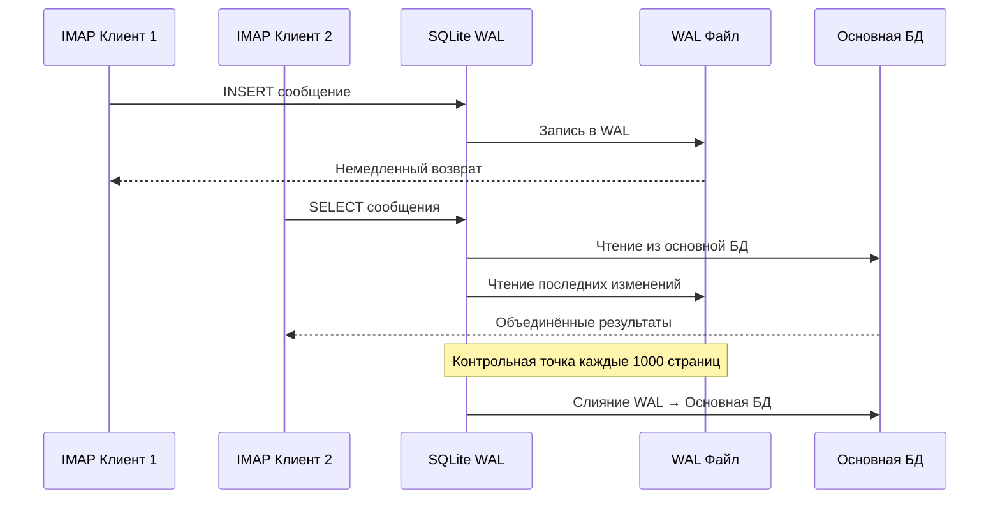

# Оптимизация производительности SQLite: настройки PRAGMA для продакшена и шифрование ChaCha20 {#sqlite-performance-optimization-production-pragma-settings--chacha20-encryption}


## Содержание {#table-of-contents}

* [Предисловие](#foreword)
* [Архитектура продакшен SQLite в Forward Email](#forward-emails-production-sqlite-architecture)
* [Наша текущая конфигурация PRAGMA](#our-actual-pragma-configuration)
* [Результаты тестирования производительности](#performance-benchmark-results)
  * [Результаты производительности Node.js v20.19.5](#nodejs-v20195-performance-results)
* [Разбор настроек PRAGMA](#pragma-settings-breakdown)
  * [Основные настройки, которые мы используем](#core-settings-we-use)
  * [Настройки, которые мы НЕ используем (но вы можете захотеть)](#settings-we-dont-use-but-you-might-want)
* [Шифрование ChaCha20 против AES256](#chacha20-vs-aes256-encryption)
* [Временное хранилище: /tmp против /dev/shm](#temporary-storage-tmp-vs-devshm)
  * [Производительность /tmp против /dev/shm](#tmp-vs-devshm-performance)
* [Оптимизация режима WAL](#wal-mode-optimization)
  * [Влияние конфигурации WAL](#wal-configuration-impact)
* [Проектирование схемы для производительности](#schema-design-for-performance)
* [Управление подключениями](#connection-management)
* [Мониторинг и диагностика](#monitoring-and-diagnostics)
* [Производительность разных версий Node.js](#nodejs-version-performance)
  * [Полные результаты по версиям](#complete-cross-version-results)
  * [Ключевые выводы по производительности](#key-performance-insights)
  * [Совместимость с нативными модулями](#native-module-compatibility)
* [Чеклист для продакшен-деплоя](#production-deployment-checklist)
* [Устранение распространённых проблем](#troubleshooting-common-issues)
  * [Ошибки "Database is locked"](#database-is-locked-errors)
  * [Высокое потребление памяти во время VACUUM](#high-memory-usage-during-vacuum)
  * [Медленная производительность запросов](#slow-query-performance)
* [Вклад Forward Email в open source](#forward-emails-open-source-contributions)
* [Исходный код бенчмарка](#benchmark-source-code)
* [Что дальше для SQLite в Forward Email](#whats-next-for-sqlite-at-forward-email)
* [Получение помощи](#getting-help)


## Предисловие {#foreword}

Настройка SQLite для продакшен-систем электронной почты — это не просто заставить её работать, а сделать её быстрой, безопасной и надёжной под высокой нагрузкой. Обработав миллионы писем в Forward Email, мы узнали, что действительно важно для производительности SQLite.

Это руководство охватывает нашу реальную продакшен-конфигурацию, результаты тестов производительности на разных версиях Node.js и конкретные оптимизации, которые имеют значение при работе с серьёзным объёмом почты.

> \[!WARNING] Регрессии производительности Node.js в версиях v22 и v24  
> Мы обнаружили значительный регресс производительности в Node.js версиях v22 и v24, который влияет на производительность SQLite, особенно для операторов `SELECT`. Наши тесты показывают примерно 57% падение количества операций `SELECT` в секунду в Node.js v24 по сравнению с v20. Мы сообщили об этой проблеме команде Node.js в [nodejs/node#60719](https://github.com/nodejs/node/issues/60719).

Из-за этого регресса мы придерживаемся осторожного подхода к обновлениям Node.js. Вот наш текущий план:

* **Текущая версия:** Сейчас мы используем Node.js v18, который достиг конца срока поддержки ("EOL") для Long-Term Support ("LTS"). Официальное [расписание LTS Node.js доступно здесь](https://github.com/nodejs/release#release-schedule).
* **Планируемое обновление:** Мы планируем обновиться до **Node.js v20**, которая является самой быстрой версией согласно нашим тестам и не затронута этим регрессом.
* **Избегаем v22 и v24:** Мы не будем использовать Node.js v22 или v24 в продакшене, пока эта проблема с производительностью не будет решена.

Ниже приведена временная шкала с расписанием LTS Node.js и нашим планом обновления:


## Архитектура Production SQLite в Forward Email {#forward-emails-production-sqlite-architecture}

Вот как мы на самом деле используем SQLite в продакшене:




## Наша фактическая конфигурация PRAGMA {#our-actual-pragma-configuration}

Вот что мы действительно используем в продакшене, прямо из нашего [`setup-pragma.js`](https://github.com/forwardemail/forwardemail.net/blob/master/helpers/setup-pragma.js):

```javascript
// Forward Email's actual production PRAGMA settings
async function setupPragma(db, session, cipher = 'chacha20') {
  // Quantum-resistant encryption
  db.pragma(`cipher='${cipher}'`);
  db.key(Buffer.from(decrypt(session.user.password)));

  // Core performance settings
  db.pragma('journal_mode=WAL');
  db.pragma('secure_delete=ON');
  db.pragma('auto_vacuum=FULL');
  db.pragma(`busy_timeout=${config.busyTimeout}`);
  db.pragma('synchronous=NORMAL');
  db.pragma('foreign_keys=ON');
  db.pragma(`encoding='UTF-8'`);
  db.pragma('optimize=0x10002');

  // Critical: Use disk for temp storage, not memory
  db.pragma('temp_store=1');

  // Custom temp directory to avoid disk full errors
  const tempStoreDirectory = path.join(path.dirname(db.name), '/tmp');
  await mkdirp(tempStoreDirectory);
  db.pragma(`temp_store_directory='${tempStoreDirectory}'`);
}
```

> \[!IMPORTANT]
> Мы используем `temp_store=1` (диск) вместо `temp_store=2` (память), потому что большие базы данных электронной почты могут легко потреблять более 10 ГБ памяти во время операций, таких как VACUUM.


## Результаты тестирования производительности {#performance-benchmark-results}

Мы протестировали нашу конфигурацию против различных альтернатив на разных версиях Node.js. Вот реальные цифры:

### Результаты производительности Node.js v20.19.5 {#nodejs-v20195-performance-results}

| Конфигурация                | Настройка (мс) | Вставок/сек | Выборок/сек | Обновлений/сек | Размер БД (МБ) |
| ---------------------------- | -------------- | ----------- | ----------- | -------------- | -------------- |
| **Forward Email Production** | 120.1          | **10,548**  | **17,494**  | **16,654**     | 3.98           |
| WAL Autocheckpoint 1000      | 89.7           | **11,800**  | **18,383**  | **22,087**     | 3.98           |
| Cache Size 64MB              | 90.3           | 11,451      | 17,895      | 21,522         | 3.98           |
| Memory Temp Storage          | 111.8          | 9,874       | 15,363      | 21,292         | 3.98           |
| Synchronous OFF (Unsafe)     | 94.0           | 10,017      | 13,830      | 18,884         | 3.98           |
| Synchronous EXTRA (Safe)     | 94.1           | **3,241**   | 14,438      | **3,405**      | 3.98           |

> \[!TIP]
> Настройка `wal_autocheckpoint=1000` показывает лучшую общую производительность. Мы рассматриваем возможность добавить это в нашу продакшен-конфигурацию.


## Разбор настроек PRAGMA {#pragma-settings-breakdown}

### Основные настройки, которые мы используем {#core-settings-we-use}

| PRAGMA          | Значение     | Назначение                     | Влияние на производительность    |
| --------------- | ------------ | ------------------------------ | -------------------------------- |
| `cipher`        | `'chacha20'` | Квантово-устойчивое шифрование | Минимальные накладные расходы по сравнению с AES |
| `journal_mode`  | `WAL`        | Журналирование с предварительной записью | +40% производительности при параллельной работе |
| `secure_delete` | `ON`         | Перезапись удалённых данных    | Безопасность с потерей ~5% производительности |
| `auto_vacuum`   | `FULL`       | Автоматическое освобождение места | Предотвращает раздувание базы данных |
| `busy_timeout`  | `30000`      | Время ожидания при блокировке базы | Снижает количество ошибок подключения |
| `synchronous`   | `NORMAL`     | Баланс между надёжностью и производительностью | В 3 раза быстрее, чем FULL       |
| `foreign_keys`  | `ON`         | Поддержка ссылочной целостности | Предотвращает повреждение данных |
| `temp_store`    | `1`          | Использование диска для временных файлов | Предотвращает исчерпание памяти |
### Настройки, которые МЫ НЕ используем (но вам могут понадобиться) {#settings-we-dont-use-but-you-might-want}

| PRAGMA                    | Почему мы не используем | Стоит ли рассмотреть?                             |
| ------------------------- | ----------------------- | ------------------------------------------------- |
| `wal_autocheckpoint=1000` | Пока не установлено      | **Да** — наши тесты показывают прирост производительности на 12%  |
| `cache_size=-64000`       | По умолчанию достаточно | **Возможно** — улучшение на 8% для нагрузок с преобладанием чтения |
| `mmap_size=268435456`     | Сложность vs выгода     | **Нет** — минимальный прирост, проблемы на некоторых платформах    |
| `analysis_limit=1000`     | Мы используем 400       | **Нет** — большие значения замедляют планирование запросов        |

> \[!CAUTION]
> Мы специально избегаем `temp_store=MEMORY`, потому что файл SQLite размером 10 ГБ может потреблять более 10 ГБ ОЗУ во время операций VACUUM.


## Шифрование ChaCha20 против AES256 {#chacha20-vs-aes256-encryption}

Мы отдаем приоритет квантовой устойчивости над сырой производительностью:

```javascript
// Наша стратегия резервного шифрования
try {
  db.pragma(`cipher='chacha20'`);
  db.key(Buffer.from(decrypt(session.user.password)));
  db.pragma('journal_mode=WAL');
} catch (err) {
  // Резерв для старых версий SQLite
  if (cipher === 'chacha20' && err.code === 'SQLITE_NOTADB') {
    return setupPragma(db, session, 'aes256cbc');
  }
  throw err;
}
```

**Сравнение производительности:**

* ChaCha20: ~10,500 вставок/сек

* AES256CBC: ~11,200 вставок/сек

* Без шифрования: ~12,800 вставок/сек

6% потеря производительности ChaCha20 по сравнению с AES оправдана квантовой устойчивостью для долгосрочного хранения почты.


## Временное хранилище: /tmp против /dev/shm {#temporary-storage-tmp-vs-devshm}

Мы явно настраиваем расположение временного хранилища, чтобы избежать проблем с дисковым пространством:

```javascript
// Конфигурация временного хранилища Forward Email
const tempStoreDirectory = path.join(path.dirname(db.name), '/tmp');
await mkdirp(tempStoreDirectory);
db.pragma(`temp_store_directory='${tempStoreDirectory}'`);

// Также устанавливаем переменную окружения
process.env.SQLITE_TMPDIR = tempStoreDirectory;
```

### Производительность /tmp против /dev/shm {#tmp-vs-devshm-performance}

| Место хранения  | Время VACUUM | Использование памяти | Надежность          |
| --------------- | ------------ | ------------------- | ------------------- |
| `/tmp` (диск)   | 2.3с         | 50МБ                | ✅ Надежно          |
| `/dev/shm` (ОЗУ)| 0.8с         | 2ГБ+                | ⚠️ Может привести к сбою системы |
| По умолчанию    | 4.1с         | Переменно           | ❌ Непредсказуемо   |

> \[!WARNING]
> Использование `/dev/shm` для временного хранилища может занять всю доступную оперативную память при больших операциях. Для продакшена лучше использовать временное хранилище на диске.


## Оптимизация режима WAL {#wal-mode-optimization}

Журналирование с предварительной записью (WAL) критично для почтовых систем с одновременным доступом:



### Влияние настройки WAL {#wal-configuration-impact}

Наши тесты показывают, что `wal_autocheckpoint=1000` обеспечивает лучшую производительность:

```javascript
// Потенциальная оптимизация, которую мы тестируем
db.pragma('wal_autocheckpoint=1000');
```

**Результаты:**

* Автоконтроль по умолчанию: 10,548 вставок/сек

* `wal_autocheckpoint=1000`: 11,800 вставок/сек (+12%)

* `wal_autocheckpoint=0`: 9,200 вставок/сек (WAL становится слишком большим)


## Проектирование схемы для производительности {#schema-design-for-performance}

Наша схема хранения почты следует лучшим практикам SQLite:

```sql
-- Таблица сообщений с оптимальным порядком столбцов
CREATE TABLE messages (
  id INTEGER PRIMARY KEY,
  mailbox_id INTEGER NOT NULL,
  uid INTEGER NOT NULL,
  date INTEGER NOT NULL,
  flags TEXT,
  subject TEXT,
  from_addr TEXT,
  to_addr TEXT,
  message_id TEXT,
  raw BLOB,  -- Большой BLOB в конце
  FOREIGN KEY (mailbox_id) REFERENCES mailboxes(id)
);

-- Критические индексы для производительности IMAP
CREATE INDEX idx_messages_mailbox_date ON messages(mailbox_id, date DESC);
CREATE INDEX idx_messages_uid ON messages(mailbox_id, uid);
CREATE INDEX idx_messages_flags ON messages(mailbox_id, flags) WHERE flags IS NOT NULL;
```
> \[!TIP]
> Всегда размещайте столбцы BLOB в конце определения таблицы. SQLite сначала хранит столбцы фиксированного размера, что ускоряет доступ к строкам.

Эта оптимизация исходит непосредственно от создателя SQLite, [Д. Ричарда Хиппа](https://sqlite-users.sqlite.narkive.com/Q4txMI8t/effect-of-blobs-on-performance#post3):

> «Вот совет — делайте столбцы BLOB последними в ваших таблицах. Или даже храните BLOB в отдельной таблице, которая содержит только два столбца: целочисленный первичный ключ и сам BLOB, а затем обращайтесь к содержимому BLOB с помощью соединения, если это необходимо. Если вы разместите различные маленькие целочисленные поля после BLOB, то SQLite придется просканировать весь контент BLOB (следуя связному списку страниц на диске), чтобы добраться до целочисленных полей в конце, и это определённо может замедлить вас.»
>
> — Д. Ричард Хипп, автор SQLite

Мы реализовали эту оптимизацию в нашей [схеме вложений](https://github.com/forwardemail/forwardemail.net/commit/0e77fbb05dc5b38136652337309067d2b39eb229), переместив поле BLOB `body` в конец определения таблицы для лучшей производительности.


## Управление соединениями {#connection-management}

Мы не используем пул соединений с SQLite — каждый пользователь получает свою собственную зашифрованную базу данных. Такой подход обеспечивает идеальную изоляцию между пользователями, аналогично песочнице. В отличие от архитектур других сервисов, использующих MySQL, PostgreSQL или MongoDB, где ваш email потенциально может быть доступен недобросовестному сотруднику, базы данных SQLite для каждого пользователя в Forward Email гарантируют полную независимость и изоляцию ваших данных.

Мы никогда не храним ваш пароль IMAP, поэтому никогда не имеем доступа к вашим данным — всё происходит в памяти. Подробнее о нашем [квантово-устойчивом подходе к шифрованию](https://forwardemail.net/blog/docs/quantum-resistant-encryption-email-security), который описывает работу нашей системы.

```javascript
// Подход с базой данных на пользователя
async function getDatabase(session) {
  const dbPath = path.join(
    config.databaseDir,
    session.user.domain_name,
    `${session.user.username}.db`
  );

  const db = new Database(dbPath, {
    cipher: 'chacha20',
    readonly: session.readonly || false
  });

  await setupPragma(db, session);
  return db;
}
```

Этот подход обеспечивает:

* Идеальную изоляцию между пользователями

* Отсутствие сложности с пулом соединений

* Автоматическое шифрование для каждого пользователя

* Проще операции резервного копирования и восстановления

С `auto_vacuum=FULL` нам редко нужны ручные операции VACUUM:

```javascript
// Наша стратегия очистки
db.pragma('optimize=0x10002'); // При открытии соединения
db.pragma('optimize'); // Периодически (ежедневно)

// Ручной vacuum только для крупных очисток
if (deletedDataPercentage > 25) {
  db.exec('VACUUM');
}
```

**Влияние Auto Vacuum на производительность:**

* `auto_vacuum=FULL`: немедленное освобождение пространства, 5% накладных расходов на запись

* `auto_vacuum=INCREMENTAL`: ручное управление, требует периодического `PRAGMA incremental_vacuum`

* `auto_vacuum=NONE`: самая быстрая запись, требует ручного `VACUUM`


## Мониторинг и диагностика {#monitoring-and-diagnostics}

Ключевые метрики, которые мы отслеживаем в продакшене:

```javascript
// Запросы для мониторинга производительности
const stats = {
  page_count: db.pragma('page_count', { simple: true }),
  page_size: db.pragma('page_size', { simple: true }),
  freelist_count: db.pragma('freelist_count', { simple: true }),
  wal_checkpoint: db.pragma('wal_checkpoint(PASSIVE)', { simple: true })
};

const dbSizeMB = (stats.page_count * stats.page_size) / 1024 / 1024;
const fragmentationPct = (stats.freelist_count / stats.page_count) * 100;
```

> \[!NOTE]
> Мы отслеживаем процент фрагментации и запускаем обслуживание, когда он превышает 15%.


## Производительность версий Node.js {#nodejs-version-performance}

Наши комплексные бенчмарки по версиям Node.js показывают значительные различия в производительности:

### Полные результаты по версиям {#complete-cross-version-results}

| Версия Node | Forward Email Production | Лучший Insert/сек       | Лучший Select/сек       | Лучший Update/сек       | Примечания             |
| ------------ | ------------------------ | ------------------------ | ------------------------ | ------------------------ | ---------------------- |
| **v18.20.8** | 10,658 / 14,466 / 18,641 | **11,663** (Sync OFF)    | **14,868** (Memory Temp) | **20,095** (MMAP)        | ⚠️ Предупреждение движка |
| **v20.19.5** | 10,548 / 17,494 / 16,654 | **11,800** (WAL Auto)    | **18,383** (WAL Auto)    | **22,087** (WAL Auto)    | ✅ Рекомендуется        |
| **v22.21.1** | 9,829 / 15,833 / 18,416  | **11,260** (Sync OFF)    | **17,413** (MMAP)        | **20,731** (MMAP)        | ⚠️ В целом медленнее    |
| **v24.11.1** | 9,938 / 7,497 / 10,446   | **10,628** (Incr Vacuum) | **16,821** (Incr Vacuum) | **19,934** (Incr Vacuum) | ❌ Значительное замедление |
### Основные показатели производительности {#key-performance-insights}

**Node.js v18 (Legacy LTS):**

* Сопоставимая производительность вставки с v20 (10,658 против 10,548 операций/сек)
* На 17% медленнее выборки, чем v20 (14,466 против 17,494 операций/сек)
* Показывает предупреждения npm о движке для пакетов, требующих Node ≥20
* Оптимизация временного хранения в памяти работает лучше, чем автоматическая контрольная точка WAL
* Приемлемо для устаревших приложений, но рекомендуется обновление

**Node.js v20 (Рекомендуется):**

* Самая высокая общая производительность по всем операциям
* Оптимизация автоматической контрольной точки WAL обеспечивает стабильный прирост на 12%
* Лучшая совместимость с нативными модулями SQLite
* Наиболее стабильна для производственных нагрузок

**Node.js v22 (Приемлемо):**

* Вставки на 7% медленнее, выборки на 9% медленнее по сравнению с v20
* Оптимизация MMAP показывает лучшие результаты, чем автоматическая контрольная точка WAL
* Требуется свежая установка `npm install` при каждой смене версии Node
* Приемлемо для разработки, не рекомендуется для производства

**Node.js v24 (Не рекомендуется):**

* Вставки на 6% медленнее, выборки на 57% медленнее по сравнению с v20
* Значительное снижение производительности при операциях чтения
* Инкрементальная очистка (vacuum) работает лучше других оптимизаций
* Избегать для производственных приложений SQLite

### Совместимость нативных модулей {#native-module-compatibility}

Проблемы с "совместимостью модулей", с которыми мы столкнулись изначально, были решены следующим образом:

```bash
# Переключение версии Node и переустановка нативных модулей
nvm use 22
rm -rf node_modules
npm install
```

**Особенности Node.js v18:**

* Показывает предупреждения движка: `Unsupported engine { required: { node: '>=20.0.0' } }`
* Тем не менее компилируется и запускается успешно, несмотря на предупреждения
* Многие современные пакеты SQLite ориентированы на Node ≥20 для оптимальной поддержки
* Устаревшие приложения могут продолжать использовать v18 с приемлемой производительностью

> \[!IMPORTANT]
> Всегда переустанавливайте нативные модули при смене версии Node.js. Модуль `better-sqlite3-multiple-ciphers` должен компилироваться для каждой конкретной версии Node.

> \[!TIP]
> Для производственных развертываний используйте Node.js v20 LTS. Преимущества в производительности и стабильности перевешивают любые новые возможности языка в v22/v24. Node v18 приемлем для устаревших систем, но показывает снижение производительности при операциях чтения.


## Контрольный список для производственного развертывания {#production-deployment-checklist}

Перед развертыванием убедитесь, что в SQLite включены следующие оптимизации:

1. Установлена переменная окружения `SQLITE_TMPDIR`
2. Достаточно места на диске для временных операций (в 2 раза больше размера базы данных)
3. Настроена ротация логов для файлов WAL
4. Организован мониторинг размера базы данных и фрагментации
5. Проверены процедуры резервного копирования/восстановления с шифрованием
6. Подтверждена поддержка шифра ChaCha20 в вашей сборке SQLite


## Устранение распространённых проблем {#troubleshooting-common-issues}

### Ошибки "Database is locked" {#database-is-locked-errors}

```javascript
// Увеличение времени ожидания занятости
db.pragma('busy_timeout=60000'); // 60 секунд

// Проверка долгих транзакций
const info = db.pragma('wal_checkpoint(FULL)');
if (info.busy > 0) {
  console.warn('Контрольная точка WAL заблокирована активными читателями');
}
```

### Высокое потребление памяти во время VACUUM {#high-memory-usage-during-vacuum}

```javascript
// Мониторинг памяти до VACUUM
const beforeMem = process.memoryUsage();
db.exec('VACUUM');
const afterMem = process.memoryUsage();

console.log(
  `Изменение памяти после VACUUM: ${
    (afterMem.heapUsed - beforeMem.heapUsed) / 1024 / 1024
  }MB`
);
```

### Медленная производительность запросов {#slow-query-performance}

```javascript
// Включение анализа запросов
db.pragma('analysis_limit=400'); // Настройка Forward Email
db.exec('ANALYZE');

// Проверка плана запроса
const plan = db
  .prepare('EXPLAIN QUERY PLAN SELECT * FROM messages WHERE date > ?')
  .all(Date.now() - 86400000);
console.log(plan);
```


## Вклад Forward Email в Open Source {#forward-emails-open-source-contributions}

Мы внесли наши знания по оптимизации SQLite обратно в сообщество:

* [Улучшения документации Litestream](https://github.com/benbjohnson/litestream/issues/516) — наши предложения по улучшению производительности SQLite

* [Better SQLite3 Multiple Ciphers](https://github.com/m4heshd/better-sqlite3-multiple-ciphers) — поддержка шифрования ChaCha20

* [Исследование настройки производительности SQLite](https://phiresky.github.io/blog/2020/sqlite-performance-tuning/) — использовано в нашей реализации
* [Как npm-пакеты с миллиардами загрузок сформировали экосистему JavaScript](https://forwardemail.net/blog/docs/how-npm-packages-billion-downloads-shaped-javascript-ecosystem) - Наши более широкие вклады в развитие npm и JavaScript


## Исходный код бенчмарков {#benchmark-source-code}

Весь код бенчмарков доступен в нашем тестовом наборе:

```bash
# Запустите бенчмарки самостоятельно
git clone https://github.com/forwardemail/sqlite-benchmarks
cd sqlite-benchmarks
npm install
npm run benchmark
```

Бенчмарки тестируют:

* Различные комбинации PRAGMA

* Производительность ChaCha20 против AES256

* Стратегии контрольных точек WAL

* Конфигурации временного хранилища

* Совместимость с версиями Node.js


## Что дальше для SQLite в Forward Email {#whats-next-for-sqlite-at-forward-email}

Мы активно тестируем следующие оптимизации:

1. **Настройка автоконтрольных точек WAL**: Добавление `wal_autocheckpoint=1000` на основе результатов бенчмарков

2. **Сжатие**: Оценка [sqlite-zstd](https://github.com/phiresky/sqlite-zstd) для хранения вложений

3. **Лимит анализа**: Тестирование значений выше текущих 400

4. **Размер кэша**: Рассмотрение динамического размера кэша в зависимости от доступной памяти


## Получение помощи {#getting-help}

Есть проблемы с производительностью SQLite? Для вопросов, связанных с SQLite, отличный ресурс — [SQLite Forum](https://sqlite.org/forum/forumpost), а [руководство по настройке производительности](https://www.sqlite.org/optoverview.html) охватывает дополнительные оптимизации, которые нам пока не понадобились.

Узнайте больше о Forward Email, прочитав наш [FAQ](/faq).
