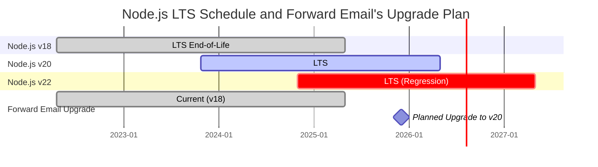
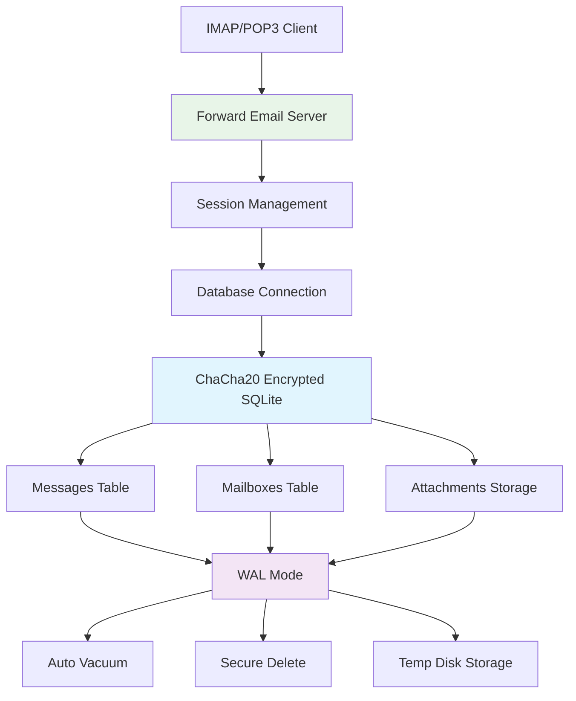
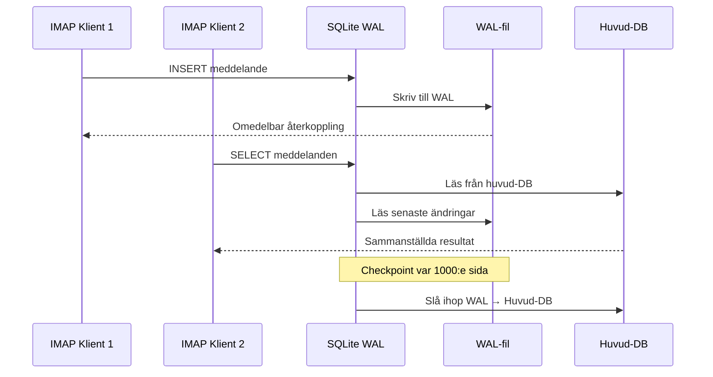

# SQLite Prestandaoptimering: Produktionsinställningar för PRAGMA & ChaCha20 Kryptering {#sqlite-performance-optimization-production-pragma-settings--chacha20-encryption}


## Innehållsförteckning {#table-of-contents}

* [Förord](#foreword)
* [Forward Emails produktionsarkitektur för SQLite](#forward-emails-production-sqlite-architecture)
* [Vår faktiska PRAGMA-konfiguration](#our-actual-pragma-configuration)
* [Resultat från prestandamätningar](#performance-benchmark-results)
  * [Node.js v20.19.5 prestandaresultat](#nodejs-v20195-performance-results)
* [Genomgång av PRAGMA-inställningar](#pragma-settings-breakdown)
  * [Kärninställningar vi använder](#core-settings-we-use)
  * [Inställningar vi INTE använder (men som du kanske vill ha)](#settings-we-dont-use-but-you-might-want)
* [ChaCha20 vs AES256 Kryptering](#chacha20-vs-aes256-encryption)
* [Tillfällig lagring: /tmp vs /dev/shm](#temporary-storage-tmp-vs-devshm)
  * [/tmp vs /dev/shm prestanda](#tmp-vs-devshm-performance)
* [Optimering av WAL-läge](#wal-mode-optimization)
  * [Effekt av WAL-konfiguration](#wal-configuration-impact)
* [Schemaläggning för prestanda](#schema-design-for-performance)
* [Hantera anslutningar](#connection-management)
* [Övervakning och diagnostik](#monitoring-and-diagnostics)
* [Node.js versionsprestanda](#nodejs-version-performance)
  * [Fullständiga resultat över versioner](#complete-cross-version-results)
  * [Viktiga prestandainsikter](#key-performance-insights)
  * [Kompatibilitet med native-moduler](#native-module-compatibility)
* [Checklista för produktionsdistribution](#production-deployment-checklist)
* [Felsökning av vanliga problem](#troubleshooting-common-issues)
  * [Felmeddelanden "Database is locked"](#database-is-locked-errors)
  * [Hög minnesanvändning under VACUUM](#high-memory-usage-during-vacuum)
  * [Långsam frågeprestanda](#slow-query-performance)
* [Forward Emails open source-bidrag](#forward-emails-open-source-contributions)
* [Källkod för benchmark](#benchmark-source-code)
* [Vad som är nästa för SQLite hos Forward Email](#whats-next-for-sqlite-at-forward-email)
* [Få hjälp](#getting-help)


## Förord {#foreword}

Att sätta upp SQLite för produktionssystem för e-post handlar inte bara om att få det att fungera – det handlar om att göra det snabbt, säkert och pålitligt under hög belastning. Efter att ha hanterat miljontals e-postmeddelanden hos Forward Email har vi lärt oss vad som verkligen spelar roll för SQLite-prestanda.

Denna guide täcker vår verkliga produktionskonfiguration, resultat från prestandamätningar över olika Node.js-versioner, och de specifika optimeringar som gör skillnad när du hanterar seriös e-postvolym.

> \[!WARNING] Prestandaregressioner i Node.js v22 och v24  
> Vi upptäckte en betydande prestandaregression i Node.js versionerna v22 och v24 som påverkar SQLite-prestanda, särskilt för `SELECT`-satser. Våra benchmarkresultat visar en ~57% minskning i `SELECT`-operationer per sekund i Node.js v24 jämfört med v20. Vi har rapporterat detta till Node.js-teamet i [nodejs/node#60719](https://github.com/nodejs/node/issues/60719).

På grund av denna regression tar vi en försiktig inställning till våra Node.js-uppgraderingar. Här är vår nuvarande plan:

* **Nuvarande version:** Vi använder för närvarande Node.js v18, som har nått slutet på sin livscykel ("EOL") för Long-Term Support ("LTS"). Du kan se den officiella [Node.js LTS-schemat här](https://github.com/nodejs/release#release-schedule).
* **Planerad uppgradering:** Vi kommer att uppgradera till **Node.js v20**, som är den snabbaste versionen enligt våra benchmarkresultat och inte påverkas av denna regression.
* **Undvika v22 och v24:** Vi kommer inte att använda Node.js v22 eller v24 i produktion förrän detta prestandaproblem är löst.

Här är en tidslinje som illustrerar Node.js LTS-schemat och vår uppgraderingsplan:


## Forward Emails produktionsarkitektur för SQLite {#forward-emails-production-sqlite-architecture}

Så här använder vi faktiskt SQLite i produktion:




## Vår faktiska PRAGMA-konfiguration {#our-actual-pragma-configuration}

Det här är vad vi faktiskt använder i produktion, direkt från vår [`setup-pragma.js`](https://github.com/forwardemail/forwardemail.net/blob/master/helpers/setup-pragma.js):

```javascript
// Forward Email's actual production PRAGMA settings
async function setupPragma(db, session, cipher = 'chacha20') {
  // Quantum-resistant encryption
  db.pragma(`cipher='${cipher}'`);
  db.key(Buffer.from(decrypt(session.user.password)));

  // Core performance settings
  db.pragma('journal_mode=WAL');
  db.pragma('secure_delete=ON');
  db.pragma('auto_vacuum=FULL');
  db.pragma(`busy_timeout=${config.busyTimeout}`);
  db.pragma('synchronous=NORMAL');
  db.pragma('foreign_keys=ON');
  db.pragma(`encoding='UTF-8'`);
  db.pragma('optimize=0x10002');

  // Critical: Use disk for temp storage, not memory
  db.pragma('temp_store=1');

  // Custom temp directory to avoid disk full errors
  const tempStoreDirectory = path.join(path.dirname(db.name), '/tmp');
  await mkdirp(tempStoreDirectory);
  db.pragma(`temp_store_directory='${tempStoreDirectory}'`);
}
```

> \[!IMPORTANT]
> Vi använder `temp_store=1` (disk) istället för `temp_store=2` (minne) eftersom stora e-postdatabaser lätt kan använda över 10 GB minne under operationer som VACUUM.


## Prestandamätningsresultat {#performance-benchmark-results}

Vi testade vår konfiguration mot olika alternativ över Node.js-versioner. Här är de verkliga siffrorna:

### Node.js v20.19.5 Prestandaresultat {#nodejs-v20195-performance-results}

| Konfiguration               | Setup (ms) | Infogningar/sek | Urval/sek | Uppdateringar/sek | DB Storlek (MB) |
| -------------------------- | ---------- | --------------- | --------- | ----------------- | --------------- |
| **Forward Email Produktion** | 120.1      | **10,548**      | **17,494**| **16,654**        | 3.98            |
| WAL Autocheckpoint 1000    | 89.7       | **11,800**      | **18,383**| **22,087**        | 3.98            |
| Cache Size 64MB            | 90.3       | 11,451          | 17,895    | 21,522            | 3.98            |
| Memory Temp Storage        | 111.8      | 9,874           | 15,363    | 21,292            | 3.98            |
| Synchronous OFF (Osäkert) | 94.0       | 10,017          | 13,830    | 18,884            | 3.98            |
| Synchronous EXTRA (Säkert) | 94.1       | **3,241**       | 14,438    | **3,405**         | 3.98            |

> \[!TIP]
> Inställningen `wal_autocheckpoint=1000` visar den bästa totala prestandan. Vi överväger att lägga till detta i vår produktionskonfiguration.


## PRAGMA-inställningarnas uppdelning {#pragma-settings-breakdown}

### Kärninställningar vi använder {#core-settings-we-use}

| PRAGMA          | Värde        | Syfte                          | Prestandapåverkan               |
| --------------- | ------------ | ------------------------------ | ------------------------------- |
| `cipher`        | `'chacha20'` | Kvantresistent kryptering      | Minimal overhead jämfört med AES |
| `journal_mode`  | `WAL`        | Write-Ahead Logging             | +40% samtidig prestanda          |
| `secure_delete` | `ON`         | Överskrivning av raderade data | Säkerhet mot 5% prestandakostnad |
| `auto_vacuum`   | `FULL`       | Automatisk återvinning av utrymme | Förhindrar databasuppblåsning    |
| `busy_timeout`  | `30000`      | Väntetid för låst databas      | Minskar anslutningsfel           |
| `synchronous`   | `NORMAL`     | Balanserad hållbarhet/prestanda | 3x snabbare än FULL              |
| `foreign_keys`  | `ON`         | Referensintegritet             | Förhindrar datakorruption        |
| `temp_store`    | `1`          | Använd disk för temporära filer | Förhindrar minnesutarmning       |
### Inställningar Vi INTE Använder (Men Du Kanske Vill Ha) {#settings-we-dont-use-but-you-might-want}

| PRAGMA                    | Varför Vi Inte Använder Det | Bör Du Överväga Det?                              |
| ------------------------- | --------------------------- | ------------------------------------------------- |
| `wal_autocheckpoint=1000` | Inte inställt än             | **Ja** - Våra tester visar 12% prestandaökning   |
| `cache_size=-64000`       | Standard är tillräckligt    | **Kanske** - 8% förbättring för lästunga arbetsbelastningar |
| `mmap_size=268435456`     | Komplexitet vs nytta         | **Nej** - Minimala vinster, plattformspecifika problem |
| `analysis_limit=1000`     | Vi använder 400             | **Nej** - Högre värden saktar ner frågeplanering |

> \[!CAUTION]
> Vi undviker specifikt `temp_store=MEMORY` eftersom en 10GB SQLite-fil kan använda över 10 GB RAM under VACUUM-operationer.


## ChaCha20 vs AES256 Kryptering {#chacha20-vs-aes256-encryption}

Vi prioriterar kvantmotstånd över rå prestanda:

```javascript
// Vår fallback-strategi för kryptering
try {
  db.pragma(`cipher='chacha20'`);
  db.key(Buffer.from(decrypt(session.user.password)));
  db.pragma('journal_mode=WAL');
} catch (err) {
  // Fallback för äldre SQLite-versioner
  if (cipher === 'chacha20' && err.code === 'SQLITE_NOTADB') {
    return setupPragma(db, session, 'aes256cbc');
  }
  throw err;
}
```

**Prestandajämförelse:**

* ChaCha20: \~10,500 insättningar/sek

* AES256CBC: \~11,200 insättningar/sek

* Okrypterat: \~12,800 insättningar/sek

Den 6% prestandakostnaden för ChaCha20 jämfört med AES är värd kvantmotståndet för långsiktig e-postlagring.


## Temporär Lagring: /tmp vs /dev/shm {#temporary-storage-tmp-vs-devshm}

Vi konfigurerar uttryckligen plats för temporär lagring för att undvika problem med diskutrymme:

```javascript
// Forward Email's konfiguration för temporär lagring
const tempStoreDirectory = path.join(path.dirname(db.name), '/tmp');
await mkdirp(tempStoreDirectory);
db.pragma(`temp_store_directory='${tempStoreDirectory}'`);

// Sätt även miljövariabeln
process.env.SQLITE_TMPDIR = tempStoreDirectory;
```

### /tmp vs /dev/shm Prestanda {#tmp-vs-devshm-performance}

| Lagringsplats    | VACUUM Tid | Minnesanvändning | Tillförlitlighet      |
| ---------------- | ---------- | ---------------- | --------------------- |
| `/tmp` (disk)    | 2.3s       | 50MB             | ✅ Pålitlig           |
| `/dev/shm` (RAM) | 0.8s       | 2GB+             | ⚠️ Kan krascha system |
| Standard         | 4.1s       | Variabel         | ❌ Oförutsägbar       |

> \[!WARNING]
> Att använda `/dev/shm` för temporär lagring kan konsumera allt tillgängligt RAM vid stora operationer. Använd diskbaserad temporär lagring i produktion.


## WAL-läge Optimering {#wal-mode-optimization}

Write-Ahead Logging är avgörande för e-postsystem med samtidiga åtkomster:



### WAL-konfigurationens Påverkan {#wal-configuration-impact}

Våra tester visar att `wal_autocheckpoint=1000` ger bäst prestanda:

```javascript
// Potentiell optimering vi testar
db.pragma('wal_autocheckpoint=1000');
```

**Resultat:**

* Standard autocheckpoint: 10,548 insättningar/sek

* `wal_autocheckpoint=1000`: 11,800 insättningar/sek (+12%)

* `wal_autocheckpoint=0`: 9,200 insättningar/sek (WAL växer för stor)


## Schemaläggning för Prestanda {#schema-design-for-performance}

Vårt e-postlagringsschema följer SQLite:s bästa praxis:

```sql
-- Meddelandetabell med optimerad kolumnordning
CREATE TABLE messages (
  id INTEGER PRIMARY KEY,
  mailbox_id INTEGER NOT NULL,
  uid INTEGER NOT NULL,
  date INTEGER NOT NULL,
  flags TEXT,
  subject TEXT,
  from_addr TEXT,
  to_addr TEXT,
  message_id TEXT,
  raw BLOB,  -- Stor BLOB sist
  FOREIGN KEY (mailbox_id) REFERENCES mailboxes(id)
);

-- Kritiska index för IMAP-prestanda
CREATE INDEX idx_messages_mailbox_date ON messages(mailbox_id, date DESC);
CREATE INDEX idx_messages_uid ON messages(mailbox_id, uid);
CREATE INDEX idx_messages_flags ON messages(mailbox_id, flags) WHERE flags IS NOT NULL;
```
> \[!TIP]
> Placera alltid BLOB-kolumner sist i din tabelldefinition. SQLite lagrar kolumner med fast storlek först, vilket gör radåtkomst snabbare.

Denna optimering kommer direkt från SQLite:s skapare, [D. Richard Hipp](https://sqlite-users.sqlite.narkive.com/Q4txMI8t/effect-of-blobs-on-performance#post3):

> "Här är ett tips – gör BLOB-kolumnerna till den sista kolumnen i dina tabeller. Eller lagra till och med BLOB:arna i en separat tabell som bara har två kolumner: en heltals-primärnyckel och själva bloben, och sedan kan du komma åt BLOB-innehållet med en join om du behöver. Om du placerar olika små heltalsfält efter BLOB:en måste SQLite skanna igenom hela BLOB-innehållet (följande den länkade listan av disk-sidor) för att komma till heltalsfälten i slutet, och det kan definitivt sakta ner dig."
>
> — D. Richard Hipp, SQLite-författare

Vi implementerade denna optimering i vårt [Attachments schema](https://github.com/forwardemail/forwardemail.net/commit/0e77fbb05dc5b38136652337309067d2b39eb229), där vi flyttade `body` BLOB-fältet till slutet av tabelldefinitionen för bättre prestanda.


## Connection Management {#connection-management}

Vi använder inte connection pooling med SQLite—varje användare får sin egen krypterade databas. Detta tillvägagångssätt ger perfekt isolering mellan användare, liknande sandboxing. Till skillnad från arkitekturer från andra tjänster som använder MySQL, PostgreSQL eller MongoDB där din e-post potentiellt kan nås av en illvillig anställd, säkerställer Forward Email:s per-användare SQLite-databaser att dina data är helt oberoende och sandboxade.

Vi lagrar aldrig ditt IMAP-lösenord, så vi har aldrig tillgång till dina data—allt sker i minnet. Läs mer om vår [kvantresistenta krypteringsmetod](https://forwardemail.net/blog/docs/quantum-resistant-encryption-email-security) som beskriver hur vårt system fungerar.

```javascript
// Per-user database approach
async function getDatabase(session) {
  const dbPath = path.join(
    config.databaseDir,
    session.user.domain_name,
    `${session.user.username}.db`
  );

  const db = new Database(dbPath, {
    cipher: 'chacha20',
    readonly: session.readonly || false
  });

  await setupPragma(db, session);
  return db;
}
```

Detta tillvägagångssätt ger:

* Perfekt isolering mellan användare

* Ingen komplexitet med connection pool

* Automatisk kryptering per användare

* Enklare backup/återställningsoperationer

Med `auto_vacuum=FULL` behöver vi sällan manuella VACUUM-operationer:

```javascript
// Our cleanup strategy
db.pragma('optimize=0x10002'); // On connection open
db.pragma('optimize'); // Periodically (daily)

// Manual vacuum only for major cleanups
if (deletedDataPercentage > 25) {
  db.exec('VACUUM');
}
```

**Auto Vacuum prestandapåverkan:**

* `auto_vacuum=FULL`: Omedelbar återvinning av utrymme, 5% skrivöverhead

* `auto_vacuum=INCREMENTAL`: Manuell kontroll, kräver periodisk `PRAGMA incremental_vacuum`

* `auto_vacuum=NONE`: Snabbaste skrivningar, kräver manuell `VACUUM`


## Monitoring and Diagnostics {#monitoring-and-diagnostics}

Viktiga mätvärden vi följer i produktion:

```javascript
// Performance monitoring queries
const stats = {
  page_count: db.pragma('page_count', { simple: true }),
  page_size: db.pragma('page_size', { simple: true }),
  freelist_count: db.pragma('freelist_count', { simple: true }),
  wal_checkpoint: db.pragma('wal_checkpoint(PASSIVE)', { simple: true })
};

const dbSizeMB = (stats.page_count * stats.page_size) / 1024 / 1024;
const fragmentationPct = (stats.freelist_count / stats.page_count) * 100;
```

> \[!NOTE]
> Vi övervakar fragmenteringsprocenten och triggar underhåll när den överstiger 15%.


## Node.js Version Performance {#nodejs-version-performance}

Våra omfattande benchmarktester över Node.js-versioner visar betydande prestandaskillnader:

### Complete Cross-Version Results {#complete-cross-version-results}

| Node Version | Forward Email Production | Bästa Insert/sek         | Bästa Select/sek         | Bästa Update/sek         | Noteringar              |
| ------------ | ------------------------ | ------------------------ | ------------------------ | ------------------------ | ----------------------- |
| **v18.20.8** | 10,658 / 14,466 / 18,641 | **11,663** (Sync OFF)    | **14,868** (Memory Temp) | **20,095** (MMAP)        | ⚠️ Varningsmotor         |
| **v20.19.5** | 10,548 / 17,494 / 16,654 | **11,800** (WAL Auto)    | **18,383** (WAL Auto)    | **22,087** (WAL Auto)    | ✅ Rekommenderad         |
| **v22.21.1** | 9,829 / 15,833 / 18,416  | **11,260** (Sync OFF)    | **17,413** (MMAP)        | **20,731** (MMAP)        | ⚠️ Långsammare totalt    |
| **v24.11.1** | 9,938 / 7,497 / 10,446   | **10,628** (Incr Vacuum) | **16,821** (Incr Vacuum) | **19,934** (Incr Vacuum) | ❌ Betydande nedgång     |
### Viktiga prestandainsikter {#key-performance-insights}

**Node.js v18 (Legacy LTS):**

* Jämförbar insättningsprestanda med v20 (10 658 vs 10 548 ops/sek)
* 17 % långsammare val än v20 (14 466 vs 17 494 ops/sek)
* Visar npm engine-varningar för paket som kräver Node ≥20
* Optimering av temporär minneslagring fungerar bättre än WAL-autokontrollpunkt
* Acceptabelt för äldre applikationer, men uppgradering rekommenderas

**Node.js v20 (Rekommenderad):**

* Högst total prestanda över alla operationer
* WAL-autokontrollpunktoptimering ger konsekvent 12 % ökning
* Bäst kompatibilitet med inbyggda SQLite-moduler
* Mest stabil för produktionsbelastningar

**Node.js v22 (Acceptabel):**

* 7 % långsammare insättningar, 9 % långsammare val jämfört med v20
* MMAP-optimering visar bättre resultat än WAL-autokontrollpunkt
* Kräver ny `npm install` vid varje Node-versionbyte
* Acceptabelt för utveckling, ej rekommenderat för produktion

**Node.js v24 (Ej rekommenderad):**

* 6 % långsammare insättningar, 57 % långsammare val jämfört med v20
* Betydande prestandanedgång vid läsoperationer
* Inkrementell vacuum presterar bättre än andra optimeringar
* Undvik för produktionsapplikationer med SQLite

### Kompatibilitet med inbyggda moduler {#native-module-compatibility}

De "modulkompatibilitetsproblem" vi initialt stötte på löstes genom:

```bash
# Byt Node-version och installera om inbyggda moduler
nvm use 22
rm -rf node_modules
npm install
```

**Node.js v18-överväganden:**

* Visar engine-varningar: `Unsupported engine { required: { node: '>=20.0.0' } }`
* Kompilerar och körs fortfarande framgångsrikt trots varningarna
* Många moderna SQLite-paket riktar sig mot Node ≥20 för optimal support
* Äldre applikationer kan fortsätta använda v18 med acceptabel prestanda

> \[!IMPORTANT]
> Installera alltid om inbyggda moduler när du byter Node.js-version. Modulen `better-sqlite3-multiple-ciphers` måste kompileras för varje specifik Node-version.

> \[!TIP]
> För produktionsdistributioner, håll dig till Node.js v20 LTS. Prestandafördelarna och stabiliteten överväger eventuella nyare språkfunktioner i v22/v24. Node v18 är acceptabelt för äldre system men visar prestandanedgång vid läsoperationer.


## Checklista för produktionsdistribution {#production-deployment-checklist}

Innan distribution, säkerställ att SQLite har dessa optimeringar:

1. Sätt miljövariabeln `SQLITE_TMPDIR`
2. Säkerställ tillräckligt diskutrymme för temporära operationer (2x databasstorlek)
3. Konfigurera loggrotation för WAL-filer
4. Sätt upp övervakning för databasstorlek och fragmentering
5. Testa backup/återställningsprocedurer med kryptering
6. Verifiera stöd för ChaCha20-kryptering i din SQLite-build


## Felsökning av vanliga problem {#troubleshooting-common-issues}

### Fel "Database is locked" {#database-is-locked-errors}

```javascript
// Öka busy timeout
db.pragma('busy_timeout=60000'); // 60 sekunder

// Kontrollera långvariga transaktioner
const info = db.pragma('wal_checkpoint(FULL)');
if (info.busy > 0) {
  console.warn('WAL-kontrollpunkt blockerad av aktiva läsare');
}
```

### Hög minnesanvändning under VACUUM {#high-memory-usage-during-vacuum}

```javascript
// Övervaka minne före VACUUM
const beforeMem = process.memoryUsage();
db.exec('VACUUM');
const afterMem = process.memoryUsage();

console.log(
  `VACUUM minnesförändring: ${
    (afterMem.heapUsed - beforeMem.heapUsed) / 1024 / 1024
  }MB`
);
```

### Långsam frågeprestanda {#slow-query-performance}

```javascript
// Aktivera frågeanalys
db.pragma('analysis_limit=400'); // Forward Email:s inställning
db.exec('ANALYZE');

// Kontrollera frågeplaner
const plan = db
  .prepare('EXPLAIN QUERY PLAN SELECT * FROM messages WHERE date > ?')
  .all(Date.now() - 86400000);
console.log(plan);
```


## Forward Emails open source-bidrag {#forward-emails-open-source-contributions}

Vi har bidragit med vår kunskap om SQLite-optimering tillbaka till communityn:

* [Litestream dokumentationsförbättringar](https://github.com/benbjohnson/litestream/issues/516) – Våra förslag för bättre SQLite-prestandatips

* [Better SQLite3 Multiple Ciphers](https://github.com/m4heshd/better-sqlite3-multiple-ciphers) – Stöd för ChaCha20-kryptering

* [SQLite prestandatuningforskning](https://phiresky.github.io/blog/2020/sqlite-performance-tuning/) – Refererad i vår implementation
* [Hur npm-paket med miljarder nedladdningar formade JavaScript-ekosystemet](https://forwardemail.net/blog/docs/how-npm-packages-billion-downloads-shaped-javascript-ecosystem) - Våra bredare bidrag till npm och JavaScript-utveckling


## Benchmark Source Code {#benchmark-source-code}

All benchmark-kod finns tillgänglig i vår testsuite:

```bash
# Kör benchmarken själv
git clone https://github.com/forwardemail/sqlite-benchmarks
cd sqlite-benchmarks
npm install
npm run benchmark
```

Benchmarken testar:

* Olika PRAGMA-kombinationer

* ChaCha20 vs AES256 prestanda

* WAL checkpoint-strategier

* Temp lagringskonfigurationer

* Node.js versionskompatibilitet


## What's Next for SQLite at Forward Email {#whats-next-for-sqlite-at-forward-email}

Vi testar aktivt dessa optimeringar:

1. **WAL Autocheckpoint Tuning**: Lägger till `wal_autocheckpoint=1000` baserat på benchmark-resultat

2. **Komprimering**: Utvärderar [sqlite-zstd](https://github.com/phiresky/sqlite-zstd) för bilagelagring

3. **Analysgräns**: Testar högre värden än vårt nuvarande 400

4. **Cache-storlek**: Överväger dynamisk cache-storlek baserat på tillgängligt minne


## Getting Help {#getting-help}

Har du prestandaproblem med SQLite? För SQLite-specifika frågor är [SQLite Forum](https://sqlite.org/forum/forumpost) en utmärkt resurs, och [performance tuning guide](https://www.sqlite.org/optoverview.html) täcker ytterligare optimeringar som vi ännu inte behövt.

Lär dig mer om Forward Email genom att läsa vår [FAQ](/faq).
