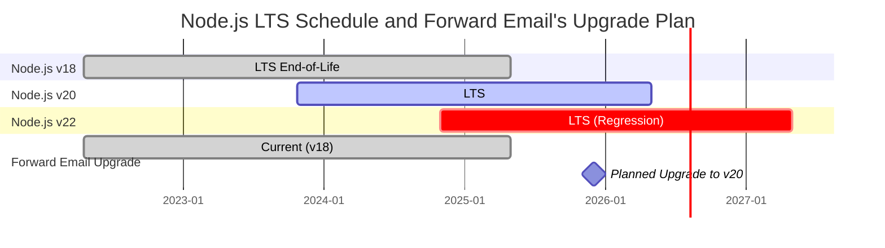
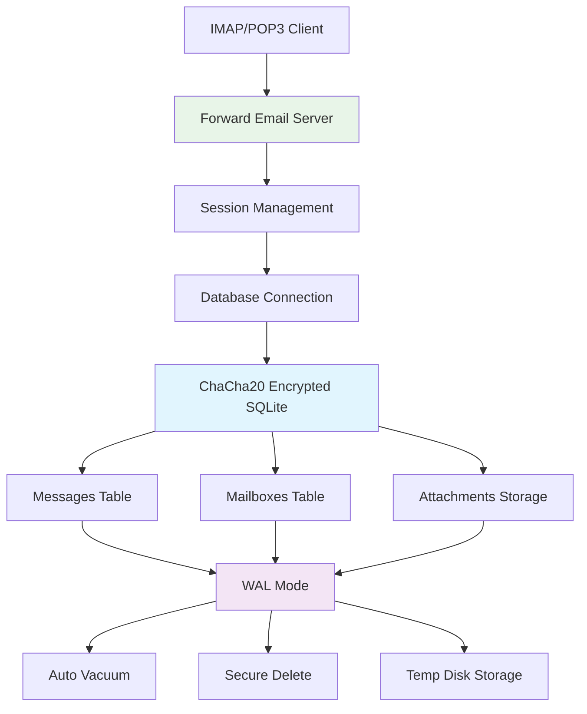
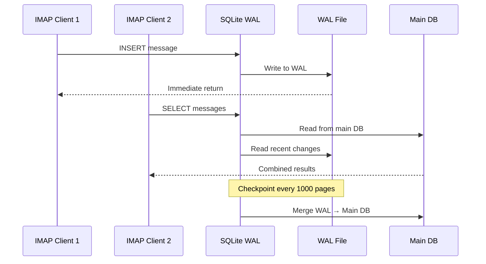

# การปรับแต่งประสิทธิภาพ SQLite: การตั้งค่า PRAGMA สำหรับการใช้งานจริง & การเข้ารหัส ChaCha20 {#sqlite-performance-optimization-production-pragma-settings--chacha20-encryption}


## สารบัญ {#table-of-contents}

* [คำนำ](#foreword)
* [สถาปัตยกรรม SQLite สำหรับการใช้งานจริงของ Forward Email](#forward-emails-production-sqlite-architecture)
* [การตั้งค่า PRAGMA ที่เราใช้จริง](#our-actual-pragma-configuration)
* [ผลการทดสอบประสิทธิภาพ](#performance-benchmark-results)
  * [ผลการทดสอบประสิทธิภาพ Node.js v20.19.5](#nodejs-v20195-performance-results)
* [การวิเคราะห์การตั้งค่า PRAGMA](#pragma-settings-breakdown)
  * [การตั้งค่าหลักที่เราใช้](#core-settings-we-use)
  * [การตั้งค่าที่เราไม่ใช้ (แต่คุณอาจต้องการ)](#settings-we-dont-use-but-you-might-want)
* [การเข้ารหัส ChaCha20 กับ AES256](#chacha20-vs-aes256-encryption)
* [พื้นที่เก็บข้อมูลชั่วคราว: /tmp กับ /dev/shm](#temporary-storage-tmp-vs-devshm)
  * [/tmp กับ /dev/shm ประสิทธิภาพ](#tmp-vs-devshm-performance)
* [การปรับแต่งโหมด WAL](#wal-mode-optimization)
  * [ผลกระทบของการตั้งค่า WAL](#wal-configuration-impact)
* [การออกแบบสคีมาเพื่อประสิทธิภาพ](#schema-design-for-performance)
* [การจัดการการเชื่อมต่อ](#connection-management)
* [การตรวจสอบและวินิจฉัย](#monitoring-and-diagnostics)
* [ประสิทธิภาพของเวอร์ชัน Node.js](#nodejs-version-performance)
  * [ผลการทดสอบข้ามเวอร์ชันครบถ้วน](#complete-cross-version-results)
  * [ข้อมูลเชิงลึกสำคัญเกี่ยวกับประสิทธิภาพ](#key-performance-insights)
  * [ความเข้ากันได้ของโมดูลเนทีฟ](#native-module-compatibility)
* [รายการตรวจสอบการปรับใช้ในสภาพแวดล้อมจริง](#production-deployment-checklist)
* [การแก้ไขปัญหาที่พบบ่อย](#troubleshooting-common-issues)
  * [ข้อผิดพลาด "Database is locked"](#database-is-locked-errors)
  * [การใช้หน่วยความจำสูงระหว่าง VACUUM](#high-memory-usage-during-vacuum)
  * [ประสิทธิภาพการค้นหาช้า](#slow-query-performance)
* [การมีส่วนร่วมโอเพนซอร์สของ Forward Email](#forward-emails-open-source-contributions)
* [ซอร์สโค้ดสำหรับการทดสอบประสิทธิภาพ](#benchmark-source-code)
* [สิ่งที่กำลังจะเกิดขึ้นกับ SQLite ที่ Forward Email](#whats-next-for-sqlite-at-forward-email)
* [การขอความช่วยเหลือ](#getting-help)


## คำนำ {#foreword}

การตั้งค่า SQLite สำหรับระบบอีเมลในสภาพแวดล้อมจริงไม่ได้หมายถึงแค่การทำให้มันใช้งานได้เท่านั้น — แต่หมายถึงการทำให้มันเร็ว ปลอดภัย และเชื่อถือได้ภายใต้ภาระงานหนัก หลังจากที่ประมวลผลอีเมลนับล้านฉบับที่ Forward Email เราได้เรียนรู้ว่าสิ่งใดที่สำคัญจริง ๆ สำหรับประสิทธิภาพของ SQLite

คู่มือนี้ครอบคลุมการตั้งค่าการใช้งานจริงของเรา ผลการทดสอบประสิทธิภาพในหลายเวอร์ชันของ Node.js และการปรับแต่งเฉพาะที่สร้างความแตกต่างเมื่อคุณจัดการกับปริมาณอีเมลจำนวนมาก

> \[!WARNING] การถดถอยของประสิทธิภาพ Node.js ในเวอร์ชัน v22 และ v24  
> เราค้นพบการถดถอยของประสิทธิภาพอย่างมีนัยสำคัญใน Node.js เวอร์ชัน v22 และ v24 ที่ส่งผลกระทบต่อประสิทธิภาพของ SQLite โดยเฉพาะกับคำสั่ง `SELECT` ผลการทดสอบของเราชี้ให้เห็นว่าการดำเนินการ `SELECT` ลดลงประมาณ 57% ต่อวินาทีใน Node.js v24 เมื่อเทียบกับ v20 เราได้รายงานปัญหานี้กับทีม Node.js ใน [nodejs/node#60719](https://github.com/nodejs/node/issues/60719)

เนื่องจากการถดถอยนี้ เราจึงใช้วิธีระมัดระวังในการอัปเกรด Node.js แผนปัจจุบันของเราคือ:

* **เวอร์ชันปัจจุบัน:** ขณะนี้เราใช้ Node.js v18 ซึ่งได้สิ้นสุดการสนับสนุนระยะยาว ("EOL") แล้ว คุณสามารถดู [ตารางเวลาการสนับสนุน LTS ของ Node.js ได้ที่นี่](https://github.com/nodejs/release#release-schedule)
* **แผนอัปเกรด:** เราจะอัปเกรดเป็น **Node.js v20** ซึ่งเป็นเวอร์ชันที่เร็วที่สุดตามผลการทดสอบของเราและไม่ได้รับผลกระทบจากการถดถอยนี้
* **หลีกเลี่ยง v22 และ v24:** เราจะไม่ใช้ Node.js v22 หรือ v24 ในสภาพแวดล้อมจริงจนกว่าปัญหาประสิทธิภาพนี้จะได้รับการแก้ไข

นี่คือตารางเวลาที่แสดงตารางการสนับสนุน LTS ของ Node.js และเส้นทางการอัปเกรดของเรา:


## สถาปัตยกรรม SQLite สำหรับ Forward Email ในการใช้งานจริง {#forward-emails-production-sqlite-architecture}

นี่คือวิธีที่เราใช้ SQLite ในการใช้งานจริง:



## การตั้งค่า PRAGMA ที่เราใช้จริง {#our-actual-pragma-configuration}

นี่คือสิ่งที่เราใช้จริงในระบบ production โดยตรงจาก [`setup-pragma.js`](https://github.com/forwardemail/forwardemail.net/blob/master/helpers/setup-pragma.js):

```javascript
// Forward Email's actual production PRAGMA settings
async function setupPragma(db, session, cipher = 'chacha20') {
  // Quantum-resistant encryption
  db.pragma(`cipher='${cipher}'`);
  db.key(Buffer.from(decrypt(session.user.password)));

  // Core performance settings
  db.pragma('journal_mode=WAL');
  db.pragma('secure_delete=ON');
  db.pragma('auto_vacuum=FULL');
  db.pragma(`busy_timeout=${config.busyTimeout}`);
  db.pragma('synchronous=NORMAL');
  db.pragma('foreign_keys=ON');
  db.pragma(`encoding='UTF-8'`);
  db.pragma('optimize=0x10002');

  // Critical: Use disk for temp storage, not memory
  db.pragma('temp_store=1');

  // Custom temp directory to avoid disk full errors
  const tempStoreDirectory = path.join(path.dirname(db.name), '/tmp');
  await mkdirp(tempStoreDirectory);
  db.pragma(`temp_store_directory='${tempStoreDirectory}'`);
}
```

> \[!IMPORTANT]
> เราใช้ `temp_store=1` (ดิสก์) แทน `temp_store=2` (หน่วยความจำ) เพราะฐานข้อมูลอีเมลขนาดใหญ่สามารถใช้หน่วยความจำเกิน 10+ GB ได้ง่ายในระหว่างการทำงานเช่น VACUUM

## ผลลัพธ์การทดสอบประสิทธิภาพ {#performance-benchmark-results}

เราทดสอบการตั้งค่าของเรากับตัวเลือกต่าง ๆ ในหลายเวอร์ชันของ Node.js นี่คือข้อมูลจริง:

### ผลลัพธ์ประสิทธิภาพ Node.js v20.19.5 {#nodejs-v20195-performance-results}

| การตั้งค่า                  | การตั้งค่า (มิลลิวินาที) | แทรก/วินาที | เลือก/วินาที | อัปเดต/วินาที | ขนาดฐานข้อมูล (MB) |
| ---------------------------- | ------------------------- | ------------ | ------------ | ------------- | ------------------- |
| **Forward Email Production** | 120.1                     | **10,548**   | **17,494**   | **16,654**    | 3.98                |
| WAL Autocheckpoint 1000      | 89.7                      | **11,800**   | **18,383**   | **22,087**    | 3.98                |
| Cache Size 64MB              | 90.3                      | 11,451       | 17,895       | 21,522        | 3.98                |
| Memory Temp Storage          | 111.8                     | 9,874        | 15,363       | 21,292        | 3.98                |
| Synchronous OFF (Unsafe)     | 94.0                      | 10,017       | 13,830       | 18,884        | 3.98                |
| Synchronous EXTRA (Safe)     | 94.1                      | **3,241**    | 14,438       | **3,405**     | 3.98                |

> \[!TIP]
> การตั้งค่า `wal_autocheckpoint=1000` แสดงประสิทธิภาพโดยรวมที่ดีที่สุด เรากำลังพิจารณาเพิ่มการตั้งค่านี้ใน config production ของเรา

## การแยกแยะการตั้งค่า PRAGMA {#pragma-settings-breakdown}

### การตั้งค่าหลักที่เราใช้ {#core-settings-we-use}

| PRAGMA          | ค่า          | จุดประสงค์                      | ผลกระทบต่อประสิทธิภาพ          |
| --------------- | ------------ | ------------------------------- | ------------------------------- |
| `cipher`        | `'chacha20'` | การเข้ารหัสที่ต้านทานควอนตัม   | ภาระงานน้อยกว่าการใช้ AES      |
| `journal_mode`  | `WAL`        | การบันทึกล่วงหน้า (Write-Ahead Logging) | เพิ่มประสิทธิภาพพร้อมกัน 40%    |
| `secure_delete` | `ON`         | เขียนทับข้อมูลที่ถูกลบ          | ความปลอดภัยแลกกับค่าใช้จ่าย 5% |
| `auto_vacuum`   | `FULL`       | การเก็บคืนพื้นที่อัตโนมัติ       | ป้องกันฐานข้อมูลบวม             |
| `busy_timeout`  | `30000`      | เวลารอเมื่อฐานข้อมูลถูกล็อก     | ลดความล้มเหลวในการเชื่อมต่อ     |
| `synchronous`   | `NORMAL`     | สมดุลระหว่างความทนทานและประสิทธิภาพ | เร็วกว่าการตั้งค่า FULL 3 เท่า  |
| `foreign_keys`  | `ON`         | ความสมบูรณ์ของข้อมูลเชิงสัมพันธ์ | ป้องกันการเสียหายของข้อมูล      |
| `temp_store`    | `1`          | ใช้ดิสก์สำหรับไฟล์ชั่วคราว       | ป้องกันการใช้หน่วยความจำเกิน    |
### การตั้งค่าที่เราไม่ใช้ (แต่คุณอาจต้องการ) {#settings-we-dont-use-but-you-might-want}

| PRAGMA                    | เหตุผลที่เราไม่ใช้   | คุณควรพิจารณาหรือไม่?                             |
| ------------------------- | --------------------- | --------------------------------------------------- |
| `wal_autocheckpoint=1000` | ยังไม่ได้ตั้งค่า     | **ใช่** - การทดสอบของเราชี้ให้เห็นการเพิ่มประสิทธิภาพ 12%  |
| `cache_size=-64000`       | ค่าเริ่มต้นเพียงพอ   | **อาจจะ** - ปรับปรุง 8% สำหรับงานที่เน้นอ่านมาก       |
| `mmap_size=268435456`     | ความซับซ้อนเทียบกับประโยชน์ | **ไม่** - กำไรน้อย ปัญหาเฉพาะแพลตฟอร์ม              |
| `analysis_limit=1000`     | เราใช้ 400           | **ไม่** - ค่าที่สูงกว่าจะทำให้การวางแผนคำสั่งช้า         |

> \[!CAUTION]
> เราหลีกเลี่ยงการใช้ `temp_store=MEMORY` โดยเฉพาะ เพราะไฟล์ SQLite ขนาด 10GB อาจใช้ RAM มากกว่า 10GB ในระหว่างการทำงาน VACUUM


## การเข้ารหัส ChaCha20 กับ AES256 {#chacha20-vs-aes256-encryption}

เรามุ่งเน้นความต้านทานควอนตัมมากกว่าประสิทธิภาพดิบ:

```javascript
// กลยุทธ์สำรองการเข้ารหัสของเรา
try {
  db.pragma(`cipher='chacha20'`);
  db.key(Buffer.from(decrypt(session.user.password)));
  db.pragma('journal_mode=WAL');
} catch (err) {
  // สำรองสำหรับเวอร์ชัน SQLite เก่า
  if (cipher === 'chacha20' && err.code === 'SQLITE_NOTADB') {
    return setupPragma(db, session, 'aes256cbc');
  }
  throw err;
}
```

**การเปรียบเทียบประสิทธิภาพ:**

* ChaCha20: \~10,500 การแทรกต่อวินาที

* AES256CBC: \~11,200 การแทรกต่อวินาที

* ไม่เข้ารหัส: \~12,800 การแทรกต่อวินาที

ต้นทุนประสิทธิภาพ 6% ของ ChaCha20 เทียบกับ AES คุ้มค่ากับความต้านทานควอนตัมสำหรับการเก็บอีเมลระยะยาว


## ที่เก็บข้อมูลชั่วคราว: /tmp กับ /dev/shm {#temporary-storage-tmp-vs-devshm}

เรากำหนดตำแหน่งที่เก็บข้อมูลชั่วคราวอย่างชัดเจนเพื่อหลีกเลี่ยงปัญหาพื้นที่ดิสก์:

```javascript
// การตั้งค่าที่เก็บข้อมูลชั่วคราวของ Forward Email
const tempStoreDirectory = path.join(path.dirname(db.name), '/tmp');
await mkdirp(tempStoreDirectory);
db.pragma(`temp_store_directory='${tempStoreDirectory}'`);

// ตั้งค่าตัวแปรสภาพแวดล้อมด้วย
process.env.SQLITE_TMPDIR = tempStoreDirectory;
```

### ประสิทธิภาพ /tmp กับ /dev/shm {#tmp-vs-devshm-performance}

| ตำแหน่งที่เก็บข้อมูล | เวลา VACUUM | การใช้หน่วยความจำ | ความน่าเชื่อถือ       |
| ---------------- | ----------- | ------------ | ------------------- |
| `/tmp` (ดิสก์)    | 2.3 วินาที  | 50MB         | ✅ เชื่อถือได้         |
| `/dev/shm` (RAM) | 0.8 วินาที  | 2GB+         | ⚠️ อาจทำให้ระบบล่ม    |
| ค่าเริ่มต้น       | 4.1 วินาที  | ตัวแปร       | ❌ ไม่แน่นอน          |

> \[!WARNING]
> การใช้ `/dev/shm` สำหรับที่เก็บข้อมูลชั่วคราวอาจใช้ RAM ทั้งหมดในระหว่างการทำงานขนาดใหญ่ ควรใช้ที่เก็บข้อมูลชั่วคราวบนดิสก์สำหรับการใช้งานจริง


## การปรับแต่งโหมด WAL {#wal-mode-optimization}

การเขียนล่วงหน้า (Write-Ahead Logging) สำคัญสำหรับระบบอีเมลที่มีการเข้าถึงพร้อมกัน:



### ผลกระทบของการตั้งค่า WAL {#wal-configuration-impact}

การทดสอบของเราแสดงว่า `wal_autocheckpoint=1000` ให้ประสิทธิภาพดีที่สุด:

```javascript
// การปรับแต่งที่อาจทำให้ดีขึ้นที่เรากำลังทดสอบ
db.pragma('wal_autocheckpoint=1000');
```

**ผลลัพธ์:**

* ค่าเริ่มต้น autocheckpoint: 10,548 การแทรกต่อวินาที

* `wal_autocheckpoint=1000`: 11,800 การแทรกต่อวินาที (+12%)

* `wal_autocheckpoint=0`: 9,200 การแทรกต่อวินาที (WAL โตเกินไป)


## การออกแบบสคีมาเพื่อประสิทธิภาพ {#schema-design-for-performance}

สคีมาของเราสำหรับเก็บอีเมลเป็นไปตามแนวทางปฏิบัติที่ดีที่สุดของ SQLite:

```sql
-- ตารางข้อความพร้อมลำดับคอลัมน์ที่ปรับแต่ง
CREATE TABLE messages (
  id INTEGER PRIMARY KEY,
  mailbox_id INTEGER NOT NULL,
  uid INTEGER NOT NULL,
  date INTEGER NOT NULL,
  flags TEXT,
  subject TEXT,
  from_addr TEXT,
  to_addr TEXT,
  message_id TEXT,
  raw BLOB,  -- BLOB ขนาดใหญ่ไว้ท้าย
  FOREIGN KEY (mailbox_id) REFERENCES mailboxes(id)
);

-- ดัชนีสำคัญสำหรับประสิทธิภาพ IMAP
CREATE INDEX idx_messages_mailbox_date ON messages(mailbox_id, date DESC);
CREATE INDEX idx_messages_uid ON messages(mailbox_id, uid);
CREATE INDEX idx_messages_flags ON messages(mailbox_id, flags) WHERE flags IS NOT NULL;
```
> \[!TIP]
> ควรวางคอลัมน์ BLOB ไว้ที่ท้ายสุดของการกำหนดตารางเสมอ SQLite จะเก็บคอลัมน์ขนาดคงที่ก่อน ทำให้การเข้าถึงแถวเร็วขึ้น

การปรับแต่งนี้มาจากผู้สร้าง SQLite โดยตรง, [D. Richard Hipp](https://sqlite-users.sqlite.narkive.com/Q4txMI8t/effect-of-blobs-on-performance#post3):

> "นี่คือคำแนะนำ - ให้ทำคอลัมน์ BLOB เป็นคอลัมน์สุดท้ายในตารางของคุณ หรือจะเก็บ BLOB ไว้ในตารางแยกที่มีแค่สองคอลัมน์: คีย์หลักแบบจำนวนเต็มและ BLOB เอง แล้วเข้าถึงเนื้อหา BLOB โดยใช้ join เมื่อจำเป็น หากคุณวางฟิลด์จำนวนเต็มขนาดเล็กต่างๆ หลัง BLOB SQLite จะต้องสแกนเนื้อหา BLOB ทั้งหมด (ตามลิงก์ลิสต์ของหน้าในดิสก์) เพื่อไปยังฟิลด์จำนวนเต็มที่ท้ายสุด และนั่นจะทำให้ช้าลงแน่นอน"
>
> — D. Richard Hipp, ผู้เขียน SQLite

เราได้นำการปรับแต่งนี้ไปใช้ใน [โครงสร้าง Attachments ของเรา](https://github.com/forwardemail/forwardemail.net/commit/0e77fbb05dc5b38136652337309067d2b39eb229) โดยย้ายฟิลด์ `body` ที่เป็น BLOB ไปไว้ท้ายสุดของการกำหนดตารางเพื่อประสิทธิภาพที่ดีขึ้น


## การจัดการการเชื่อมต่อ {#connection-management}

เราไม่ใช้ connection pooling กับ SQLite — ผู้ใช้แต่ละคนจะได้ฐานข้อมูลที่เข้ารหัสของตัวเอง วิธีนี้ให้การแยกกันอย่างสมบูรณ์ระหว่างผู้ใช้ เหมือนกับ sandboxing แตกต่างจากสถาปัตยกรรมของบริการอื่นที่ใช้ MySQL, PostgreSQL หรือ MongoDB ที่อีเมลของคุณอาจถูกเข้าถึงโดยพนักงานที่ไม่หวังดี ฐานข้อมูล SQLite ต่อผู้ใช้ของ Forward Email ทำให้ข้อมูลของคุณแยกกันอย่างสมบูรณ์และถูก sandboxed

เราไม่เคยเก็บรหัสผ่าน IMAP ของคุณ ดังนั้นเราไม่เคยเข้าถึงข้อมูลของคุณ — ทุกอย่างทำในหน่วยความจำ เรียนรู้เพิ่มเติมเกี่ยวกับ [แนวทางการเข้ารหัสที่ต้านทานควอนตัม](https://forwardemail.net/blog/docs/quantum-resistant-encryption-email-security) ที่อธิบายว่าระบบของเราทำงานอย่างไร

```javascript
// วิธีฐานข้อมูลต่อผู้ใช้
async function getDatabase(session) {
  const dbPath = path.join(
    config.databaseDir,
    session.user.domain_name,
    `${session.user.username}.db`
  );

  const db = new Database(dbPath, {
    cipher: 'chacha20',
    readonly: session.readonly || false
  });

  await setupPragma(db, session);
  return db;
}
```

วิธีนี้ให้:

* การแยกกันอย่างสมบูรณ์ระหว่างผู้ใช้

* ไม่มีความซับซ้อนของ connection pool

* การเข้ารหัสอัตโนมัติสำหรับแต่ละผู้ใช้

* การสำรองข้อมูล/กู้คืนที่ง่ายขึ้น

ด้วย `auto_vacuum=FULL` เราแทบไม่ต้องทำ VACUUM ด้วยตนเอง:

```javascript
// กลยุทธ์การทำความสะอาดของเรา
db.pragma('optimize=0x10002'); // เมื่อเปิดการเชื่อมต่อ
db.pragma('optimize'); // เป็นระยะ (รายวัน)

// ทำ vacuum ด้วยตนเองเฉพาะการทำความสะอาดใหญ่
if (deletedDataPercentage > 25) {
  db.exec('VACUUM');
}
```

**ผลกระทบของ Auto Vacuum ต่อประสิทธิภาพ:**

* `auto_vacuum=FULL`: คืนพื้นที่ทันที, เขียนช้าลง 5%

* `auto_vacuum=INCREMENTAL`: ควบคุมด้วยตนเอง, ต้องเรียก `PRAGMA incremental_vacuum` เป็นระยะ

* `auto_vacuum=NONE`: เขียนเร็วที่สุด, ต้องทำ `VACUUM` ด้วยตนเอง


## การตรวจสอบและวินิจฉัย {#monitoring-and-diagnostics}

เมตริกสำคัญที่เราติดตามในระบบจริง:

```javascript
// คำสั่งตรวจสอบประสิทธิภาพ
const stats = {
  page_count: db.pragma('page_count', { simple: true }),
  page_size: db.pragma('page_size', { simple: true }),
  freelist_count: db.pragma('freelist_count', { simple: true }),
  wal_checkpoint: db.pragma('wal_checkpoint(PASSIVE)', { simple: true })
};

const dbSizeMB = (stats.page_count * stats.page_size) / 1024 / 1024;
const fragmentationPct = (stats.freelist_count / stats.page_count) * 100;
```

> \[!NOTE]
> เราตรวจสอบเปอร์เซ็นต์การแตกกระจายและเริ่มการบำรุงรักษาเมื่อเกิน 15%


## ประสิทธิภาพของ Node.js เวอร์ชันต่างๆ {#nodejs-version-performance}

การทดสอบเปรียบเทียบอย่างละเอียดของเราข้ามเวอร์ชัน Node.js แสดงความแตกต่างของประสิทธิภาพอย่างมีนัยสำคัญ:

### ผลลัพธ์ข้ามเวอร์ชันทั้งหมด {#complete-cross-version-results}

| เวอร์ชัน Node | Forward Email Production | การแทรกข้อมูลสูงสุด/วินาที | การเลือกข้อมูลสูงสุด/วินาที | การอัปเดตสูงสุด/วินาที | หมายเหตุ               |
| ------------ | ------------------------ | ------------------------ | ------------------------ | ------------------------ | ---------------------- |
| **v18.20.8** | 10,658 / 14,466 / 18,641 | **11,663** (ปิด Sync)    | **14,868** (หน่วยความจำชั่วคราว) | **20,095** (MMAP)        | ⚠️ เตือนเครื่องยนต์      |
| **v20.19.5** | 10,548 / 17,494 / 16,654 | **11,800** (WAL อัตโนมัติ) | **18,383** (WAL อัตโนมัติ) | **22,087** (WAL อัตโนมัติ) | ✅ แนะนำ                |
| **v22.21.1** | 9,829 / 15,833 / 18,416  | **11,260** (ปิด Sync)    | **17,413** (MMAP)        | **20,731** (MMAP)        | ⚠️ ช้ากว่าโดยรวม       |
| **v24.11.1** | 9,938 / 7,497 / 10,446   | **10,628** (Incr Vacuum) | **16,821** (Incr Vacuum) | **19,934** (Incr Vacuum) | ❌ ช้าลงอย่างมีนัยสำคัญ |
### ข้อมูลเชิงลึกเกี่ยวกับประสิทธิภาพหลัก {#key-performance-insights}

**Node.js v18 (Legacy LTS):**

* ประสิทธิภาพการแทรกข้อมูลใกล้เคียงกับ v20 (10,658 เทียบกับ 10,548 ops/sec)
* การเลือกข้อมูลช้ากว่า v20 ถึง 17% (14,466 เทียบกับ 17,494 ops/sec)
* แสดงคำเตือน npm engine สำหรับแพ็กเกจที่ต้องการ Node ≥20
* การปรับแต่งการจัดเก็บข้อมูลชั่วคราวในหน่วยความจำทำงานได้ดีกว่าการตรวจสอบจุดตรวจสอบอัตโนมัติ WAL
* ยอมรับได้สำหรับแอปพลิเคชันรุ่นเก่า แต่แนะนำให้อัปเกรด

**Node.js v20 (แนะนำ):**

* ประสิทธิภาพโดยรวมสูงสุดในทุกการดำเนินการ
* การปรับแต่งการตรวจสอบจุดตรวจสอบอัตโนมัติ WAL ให้การเพิ่มประสิทธิภาพที่สม่ำเสมอ 12%
* ความเข้ากันได้ดีที่สุดกับโมดูล SQLite แบบเนทีฟ
* เสถียรที่สุดสำหรับงานในสภาพแวดล้อมการผลิต

**Node.js v22 (ยอมรับได้):**

* การแทรกข้อมูลช้ากว่า v20 7%, การเลือกข้อมูลช้ากว่า 9%
* การปรับแต่ง MMAP ให้ผลลัพธ์ดีกว่าการตรวจสอบจุดตรวจสอบอัตโนมัติ WAL
* ต้องติดตั้ง `npm install` ใหม่ทุกครั้งที่เปลี่ยนเวอร์ชัน Node
* ยอมรับได้สำหรับการพัฒนา แต่ไม่แนะนำสำหรับการผลิต

**Node.js v24 (ไม่แนะนำ):**

* การแทรกข้อมูลช้ากว่า v20 6%, การเลือกข้อมูลช้ากว่า 57%
* ประสิทธิภาพการอ่านข้อมูลถดถอยอย่างมีนัยสำคัญ
* การทำ vacuum แบบเพิ่มขึ้นทำงานได้ดีกว่าการปรับแต่งอื่น ๆ
* หลีกเลี่ยงสำหรับแอปพลิเคชัน SQLite ในการผลิต

### ความเข้ากันได้ของโมดูลเนทีฟ {#native-module-compatibility}

ปัญหา "ความเข้ากันได้ของโมดูล" ที่เราเจอในตอนแรกได้รับการแก้ไขโดย:

```bash
# สลับเวอร์ชัน Node และติดตั้งโมดูลเนทีฟใหม่
nvm use 22
rm -rf node_modules
npm install
```

**ข้อควรพิจารณาสำหรับ Node.js v18:**

* แสดงคำเตือน engine: `Unsupported engine { required: { node: '>=20.0.0' } }`
* ยังคงคอมไพล์และรันได้สำเร็จแม้มีคำเตือน
* แพ็กเกจ SQLite สมัยใหม่หลายตัวตั้งเป้า Node ≥20 เพื่อการสนับสนุนที่ดีที่สุด
* แอปพลิเคชันรุ่นเก่าสามารถใช้ v18 ต่อไปได้ด้วยประสิทธิภาพที่ยอมรับได้

> \[!IMPORTANT]
> ควรติดตั้งโมดูลเนทีฟใหม่ทุกครั้งที่เปลี่ยนเวอร์ชัน Node.js โมดูล `better-sqlite3-multiple-ciphers` ต้องคอมไพล์สำหรับแต่ละเวอร์ชัน Node โดยเฉพาะ

> \[!TIP]
> สำหรับการใช้งานในสภาพแวดล้อมการผลิต ให้ใช้ Node.js v20 LTS ประโยชน์ด้านประสิทธิภาพและความเสถียรมีมากกว่าคุณสมบัติภาษาใหม่ใน v22/v24 Node v18 ยอมรับได้สำหรับระบบรุ่นเก่าแต่แสดงการถดถอยของประสิทธิภาพในการอ่านข้อมูล


## รายการตรวจสอบก่อนการใช้งานจริง {#production-deployment-checklist}

ก่อนการใช้งานจริง ให้แน่ใจว่า SQLite มีการปรับแต่งเหล่านี้:

1. ตั้งค่าตัวแปรสภาพแวดล้อม `SQLITE_TMPDIR`
2. ตรวจสอบว่ามีพื้นที่ดิสก์เพียงพอสำหรับการทำงานชั่วคราว (2 เท่าของขนาดฐานข้อมูล)
3. กำหนดค่าการหมุนเวียนบันทึกสำหรับไฟล์ WAL
4. ตั้งค่าการตรวจสอบขนาดฐานข้อมูลและการกระจายตัวของข้อมูล
5. ทดสอบกระบวนการสำรองข้อมูล/กู้คืนพร้อมการเข้ารหัส
6. ตรวจสอบการรองรับการเข้ารหัส ChaCha20 ในการสร้าง SQLite ของคุณ


## การแก้ไขปัญหาที่พบบ่อย {#troubleshooting-common-issues}

### ข้อผิดพลาด "Database is locked" {#database-is-locked-errors}

```javascript
// เพิ่มเวลารอ busy timeout
db.pragma('busy_timeout=60000'); // 60 วินาที

// ตรวจสอบธุรกรรมที่ทำงานนาน
const info = db.pragma('wal_checkpoint(FULL)');
if (info.busy > 0) {
  console.warn('WAL checkpoint ถูกบล็อกโดยผู้อ่านที่กำลังใช้งาน');
}
```

### การใช้หน่วยความจำสูงระหว่าง VACUUM {#high-memory-usage-during-vacuum}

```javascript
// ตรวจสอบหน่วยความจำก่อน VACUUM
const beforeMem = process.memoryUsage();
db.exec('VACUUM');
const afterMem = process.memoryUsage();

console.log(
  `การเปลี่ยนแปลงหน่วยความจำจาก VACUUM: ${
    (afterMem.heapUsed - beforeMem.heapUsed) / 1024 / 1024
  }MB`
);
```

### ประสิทธิภาพการสืบค้นช้า {#slow-query-performance}

```javascript
// เปิดใช้งานการวิเคราะห์การสืบค้น
db.pragma('analysis_limit=400'); // การตั้งค่าของ Forward Email
db.exec('ANALYZE');

// ตรวจสอบแผนการสืบค้น
const plan = db
  .prepare('EXPLAIN QUERY PLAN SELECT * FROM messages WHERE date > ?')
  .all(Date.now() - 86400000);
console.log(plan);
```


## การมีส่วนร่วมของ Forward Email ในโอเพนซอร์ส {#forward-emails-open-source-contributions}

เราได้แบ่งปันความรู้เกี่ยวกับการปรับแต่ง SQLite กลับสู่ชุมชน:

* [การปรับปรุงเอกสาร Litestream](https://github.com/benbjohnson/litestream/issues/516) - ข้อเสนอแนะของเราเพื่อเคล็ดลับประสิทธิภาพ SQLite ที่ดีกว่า

* [Better SQLite3 Multiple Ciphers](https://github.com/m4heshd/better-sqlite3-multiple-ciphers) - การรองรับการเข้ารหัส ChaCha20

* [งานวิจัยการปรับแต่งประสิทธิภาพ SQLite](https://phiresky.github.io/blog/2020/sqlite-performance-tuning/) - อ้างอิงในการใช้งานของเรา
* [แพ็กเกจ npm ที่มียอดดาวน์โหลดพันล้านครั้งมีผลต่อระบบนิเวศ JavaScript อย่างไร](https://forwardemail.net/blog/docs/how-npm-packages-billion-downloads-shaped-javascript-ecosystem) - การมีส่วนร่วมที่กว้างขึ้นของเราต่อการพัฒนา npm และ JavaScript


## Benchmark Source Code {#benchmark-source-code}

โค้ดเบนช์มาร์กทั้งหมดมีให้ในชุดทดสอบของเรา:

```bash
# Run the benchmarks yourself
git clone https://github.com/forwardemail/sqlite-benchmarks
cd sqlite-benchmarks
npm install
npm run benchmark
```

เบนช์มาร์กทดสอบ:

* การผสมผสาน PRAGMA ต่างๆ

* ประสิทธิภาพ ChaCha20 เทียบกับ AES256

* กลยุทธ์การตรวจสอบจุดเช็คพอยต์ WAL

* การกำหนดค่าที่เก็บข้อมูลชั่วคราว

* ความเข้ากันได้ของเวอร์ชัน Node.js


## What's Next for SQLite at Forward Email {#whats-next-for-sqlite-at-forward-email}

เรากำลังทดสอบการปรับแต่งเหล่านี้อย่างต่อเนื่อง:

1. **การปรับแต่ง WAL Autocheckpoint**: เพิ่ม `wal_autocheckpoint=1000` ตามผลลัพธ์เบนช์มาร์ก

2. **การบีบอัด**: ประเมิน [sqlite-zstd](https://github.com/phiresky/sqlite-zstd) สำหรับการจัดเก็บไฟล์แนบ

3. **ขีดจำกัดการวิเคราะห์**: ทดสอบค่าที่สูงกว่าค่า 400 ปัจจุบันของเรา

4. **ขนาดแคช**: พิจารณาการปรับขนาดแคชแบบไดนามิกตามหน่วยความจำที่มีอยู่


## Getting Help {#getting-help}

มีปัญหาด้านประสิทธิภาพ SQLite หรือไม่? สำหรับคำถามเฉพาะเกี่ยวกับ SQLite, [SQLite Forum](https://sqlite.org/forum/forumpost) เป็นแหล่งข้อมูลที่ยอดเยี่ยม และ [performance tuning guide](https://www.sqlite.org/optoverview.html) ครอบคลุมการปรับแต่งเพิ่มเติมที่เรายังไม่จำเป็นต้องใช้

เรียนรู้เพิ่มเติมเกี่ยวกับ Forward Email โดยอ่าน [คำถามที่พบบ่อย](/faq)
