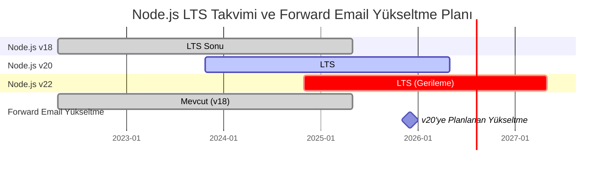
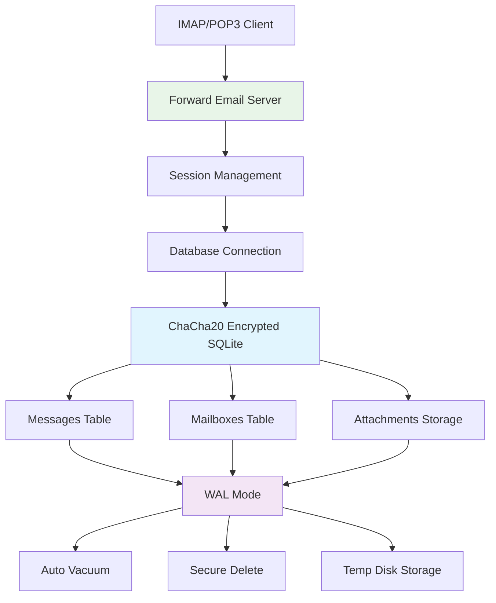
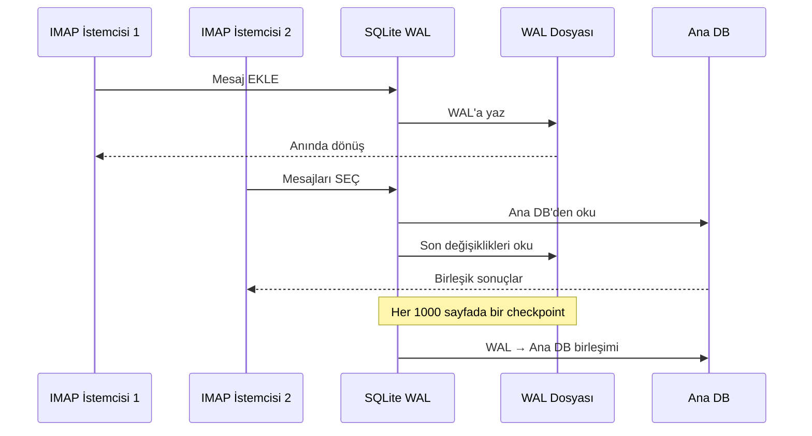

# SQLite Performans Optimizasyonu: Üretim PRAGMA Ayarları & ChaCha20 Şifreleme {#sqlite-performance-optimization-production-pragma-settings--chacha20-encryption}


## İçindekiler {#table-of-contents}

* [Önsöz](#foreword)
* [Forward Email'in Üretim SQLite Mimarisi](#forward-emails-production-sqlite-architecture)
* [Gerçek PRAGMA Yapılandırmamız](#our-actual-pragma-configuration)
* [Performans Kıyaslama Sonuçları](#performance-benchmark-results)
  * [Node.js v20.19.5 Performans Sonuçları](#nodejs-v20195-performance-results)
* [PRAGMA Ayarlarının Detayları](#pragma-settings-breakdown)
  * [Kullandığımız Temel Ayarlar](#core-settings-we-use)
  * [Kullanmadığımız (Ama İsteyebileceğiniz) Ayarlar](#settings-we-dont-use-but-you-might-want)
* [ChaCha20 vs AES256 Şifreleme](#chacha20-vs-aes256-encryption)
* [Geçici Depolama: /tmp vs /dev/shm](#temporary-storage-tmp-vs-devshm)
  * [/tmp vs /dev/shm Performansı](#tmp-vs-devshm-performance)
* [WAL Modu Optimizasyonu](#wal-mode-optimization)
  * [WAL Yapılandırmasının Etkisi](#wal-configuration-impact)
* [Performans İçin Şema Tasarımı](#schema-design-for-performance)
* [Bağlantı Yönetimi](#connection-management)
* [İzleme ve Tanılama](#monitoring-and-diagnostics)
* [Node.js Versiyon Performansı](#nodejs-version-performance)
  * [Tüm Versiyonlar Arası Sonuçlar](#complete-cross-version-results)
  * [Önemli Performans İçgörüleri](#key-performance-insights)
  * [Native Modül Uyumluluğu](#native-module-compatibility)
* [Üretim Dağıtım Kontrol Listesi](#production-deployment-checklist)
* [Yaygın Sorunların Giderilmesi](#troubleshooting-common-issues)
  * ["Database is locked" Hataları](#database-is-locked-errors)
  * [VACUUM Sırasında Yüksek Bellek Kullanımı](#high-memory-usage-during-vacuum)
  * [Yavaş Sorgu Performansı](#slow-query-performance)
* [Forward Email'in Açık Kaynak Katkıları](#forward-emails-open-source-contributions)
* [Kıyaslama Kaynak Kodu](#benchmark-source-code)
* [Forward Email'de SQLite İçin Gelecek Planları](#whats-next-for-sqlite-at-forward-email)
* [Yardım Alma](#getting-help)


## Önsöz {#foreword}

SQLite'ı üretim e-posta sistemleri için kurmak sadece çalışmasını sağlamakla kalmaz—yük altında hızlı, güvenli ve güvenilir olmasını sağlamakla ilgilidir. Forward Email'de milyonlarca e-posta işledikten sonra, SQLite performansı için gerçekten önemli olan şeyleri öğrendik.

Bu rehber, gerçek üretim yapılandırmamızı, Node.js versiyonları arasındaki kıyaslama sonuçlarını ve ciddi e-posta hacmiyle uğraşırken fark yaratan özel optimizasyonları kapsar.

> \[!WARNING] Node.js v22 ve v24'te Performans Gerilemeleri  
> Node.js v22 ve v24 sürümlerinde, özellikle `SELECT` ifadeleri için SQLite performansını etkileyen önemli bir performans gerilemesi keşfettik. Kıyaslamalarımız, Node.js v24'te `SELECT` işlemlerinde saniye başına yaklaşık %57 düşüş olduğunu gösteriyor. Bu sorunu Node.js ekibine [nodejs/node#60719](https://github.com/nodejs/node/issues/60719) üzerinden bildirdik.

Bu gerileme nedeniyle, Node.js yükseltmelerimizde temkinli bir yaklaşım benimsiyoruz. İşte mevcut planımız:

* **Mevcut Versiyon:** Şu anda Node.js v18 kullanıyoruz, bu sürüm Uzun Süreli Destek ("LTS") için yaşam döngüsünü tamamladı ("EOL"). Resmi [Node.js LTS takvimini buradan](https://github.com/nodejs/release#release-schedule) görebilirsiniz.
* **Planlanan Yükseltme:** Kıyaslamalarımıza göre en hızlı sürüm olan ve bu gerilemeden etkilenmeyen **Node.js v20**'ye yükselteceğiz.
* **v22 ve v24'ten Kaçınma:** Bu performans sorunu çözülene kadar üretimde Node.js v22 veya v24 kullanmayacağız.

İşte Node.js LTS takvimini ve yükseltme yolumuzu gösteren bir zaman çizelgesi:


## Forward Email'in Üretim SQLite Mimarisi {#forward-emails-production-sqlite-architecture}

İşte SQLite'ı üretimde nasıl kullandığımız:




## Gerçek PRAGMA Yapılandırmamız {#our-actual-pragma-configuration}

Üretimde gerçekten kullandığımız ayarlar, doğrudan [`setup-pragma.js`](https://github.com/forwardemail/forwardemail.net/blob/master/helpers/setup-pragma.js) dosyamızdan:

```javascript
// Forward Email'in gerçek üretim PRAGMA ayarları
async function setupPragma(db, session, cipher = 'chacha20') {
  // Kuantum dirençli şifreleme
  db.pragma(`cipher='${cipher}'`);
  db.key(Buffer.from(decrypt(session.user.password)));

  // Temel performans ayarları
  db.pragma('journal_mode=WAL');
  db.pragma('secure_delete=ON');
  db.pragma('auto_vacuum=FULL');
  db.pragma(`busy_timeout=${config.busyTimeout}`);
  db.pragma('synchronous=NORMAL');
  db.pragma('foreign_keys=ON');
  db.pragma(`encoding='UTF-8'`);
  db.pragma('optimize=0x10002');

  // Kritik: Geçici depolama için bellek değil disk kullan
  db.pragma('temp_store=1');

  // Disk doluluk hatalarını önlemek için özel geçici dizin
  const tempStoreDirectory = path.join(path.dirname(db.name), '/tmp');
  await mkdirp(tempStoreDirectory);
  db.pragma(`temp_store_directory='${tempStoreDirectory}'`);
}
```

> \[!IMPORTANT]
> `temp_store=2` (bellek) yerine `temp_store=1` (disk) kullanıyoruz çünkü büyük e-posta veritabanları VACUUM gibi işlemler sırasında kolayca 10+ GB bellek tüketebilir.


## Performans Kıyaslama Sonuçları {#performance-benchmark-results}

Yapılandırmamızı Node.js sürümleri arasında çeşitli alternatiflere karşı test ettik. İşte gerçek rakamlar:

### Node.js v20.19.5 Performans Sonuçları {#nodejs-v20195-performance-results}

| Yapılandırma                | Kurulum (ms) | Ekleme/sn | Seçme/sn | Güncelleme/sn | DB Boyutu (MB) |
| ---------------------------- | ---------- | ---------- | ---------- | ---------- | ------------ |
| **Forward Email Üretim**     | 120.1      | **10,548** | **17,494** | **16,654** | 3.98         |
| WAL Otomatik Kontrol 1000    | 89.7       | **11,800** | **18,383** | **22,087** | 3.98         |
| Önbellek Boyutu 64MB         | 90.3       | 11,451     | 17,895     | 21,522     | 3.98         |
| Bellek Geçici Depolama       | 111.8      | 9,874      | 15,363     | 21,292     | 3.98         |
| Senkronizasyon KAPALI (Güvensiz) | 94.0       | 10,017     | 13,830     | 18,884     | 3.98         |
| Senkronizasyon EKSTRA (Güvenli) | 94.1       | **3,241**  | 14,438     | **3,405**  | 3.98         |

> \[!TIP]
> `wal_autocheckpoint=1000` ayarı en iyi genel performansı gösteriyor. Bunu üretim yapılandırmamıza eklemeyi düşünüyoruz.


## PRAGMA Ayarlarının Detayları {#pragma-settings-breakdown}

### Kullandığımız Temel Ayarlar {#core-settings-we-use}

| PRAGMA          | Değer        | Amaç                           | Performans Etkisi              |
| --------------- | ------------ | ------------------------------ | ------------------------------ |
| `cipher`        | `'chacha20'` | Kuantum dirençli şifreleme     | AES'e kıyasla minimal ek yük   |
| `journal_mode`  | `WAL`        | Yazma Öncülü Günlükleme        | %40 daha fazla eşzamanlılık    |
| `secure_delete` | `ON`         | Silinen veriyi üzerine yazma   | Güvenlik, %5 performans maliyeti |
| `auto_vacuum`   | `FULL`       | Otomatik alan temizleme        | Veritabanı şişmesini önler     |
| `busy_timeout`  | `30000`      | Kilitli veritabanı için bekleme süresi | Bağlantı hatalarını azaltır    |
| `synchronous`   | `NORMAL`     | Dengeli dayanıklılık/performance | FULL'den 3 kat daha hızlı      |
| `foreign_keys`  | `ON`         | Referans bütünlüğü             | Veri bozulmasını önler         |
| `temp_store`    | `1`          | Geçici dosyalar için disk kullanımı | Bellek tükenmesini önler       |
### Kullanmadığımız (Ama İsteyebileceğiniz) Ayarlar {#settings-we-dont-use-but-you-might-want}

| PRAGMA                    | Neden Kullanmadığımız   | Düşünmeli misiniz?                             |
| ------------------------- | ----------------------- | --------------------------------------------------- |
| `wal_autocheckpoint=1000` | Henüz ayarlanmadı       | **Evet** - Benchmarklarımız %12 performans artışı gösteriyor  |
| `cache_size=-64000`       | Varsayılan yeterli      | **Belki** - Okuma ağırlıklı iş yüklerinde %8 iyileşme |
| `mmap_size=268435456`     | Karmaşıklık ve fayda    | **Hayır** - Minimal kazanç, platforma özgü sorunlar    |
| `analysis_limit=1000`     | Biz 400 kullanıyoruz    | **Hayır** - Daha yüksek değerler sorgu planlamasını yavaşlatır     |

> \[!CAUTION]
> `temp_store=MEMORY` kullanmaktan özellikle kaçınıyoruz çünkü 10GB SQLite dosyası VACUUM işlemleri sırasında 10+ GB RAM tüketebilir.


## ChaCha20 vs AES256 Şifreleme {#chacha20-vs-aes256-encryption}

Kaba performanstan ziyade kuantum direncini önceliklendiriyoruz:

```javascript
// Şifreleme yedekleme stratejimiz
try {
  db.pragma(`cipher='chacha20'`);
  db.key(Buffer.from(decrypt(session.user.password)));
  db.pragma('journal_mode=WAL');
} catch (err) {
  // Eski SQLite sürümleri için yedek
  if (cipher === 'chacha20' && err.code === 'SQLITE_NOTADB') {
    return setupPragma(db, session, 'aes256cbc');
  }
  throw err;
}
```

**Performans Karşılaştırması:**

* ChaCha20: \~10,500 ekleme/sn

* AES256CBC: \~11,200 ekleme/sn

* Şifresiz: \~12,800 ekleme/sn

ChaCha20'nin AES'e göre %6 performans maliyeti, uzun vadeli e-posta depolama için kuantum direncine değer.


## Geçici Depolama: /tmp vs /dev/shm {#temporary-storage-tmp-vs-devshm}

Disk alanı sorunlarından kaçınmak için geçici depolama konumunu açıkça yapılandırıyoruz:

```javascript
// Forward Email'in geçici depolama yapılandırması
const tempStoreDirectory = path.join(path.dirname(db.name), '/tmp');
await mkdirp(tempStoreDirectory);
db.pragma(`temp_store_directory='${tempStoreDirectory}'`);

// Ayrıca ortam değişkenini ayarla
process.env.SQLITE_TMPDIR = tempStoreDirectory;
```

### /tmp vs /dev/shm Performans {#tmp-vs-devshm-performance}

| Depolama Konumu | VACUUM Süresi | Bellek Kullanımı | Güvenilirlik         |
| ---------------- | ------------- | --------------- | ------------------- |
| `/tmp` (disk)    | 2.3s          | 50MB            | ✅ Güvenilir          |
| `/dev/shm` (RAM) | 0.8s          | 2GB+            | ⚠️ Sistemi çökertme riski |
| Varsayılan       | 4.1s          | Değişken        | ❌ Öngörülemez       |

> \[!WARNING]
> Büyük işlemler sırasında `/dev/shm` kullanımı tüm mevcut RAM'i tüketebilir. Üretimde disk tabanlı geçici depolama kullanmaya devam edin.


## WAL Modu Optimizasyonu {#wal-mode-optimization}

Write-Ahead Logging, eşzamanlı erişimi olan e-posta sistemleri için kritik önemdedir:



### WAL Yapılandırma Etkisi {#wal-configuration-impact}

Benchmarklarımız `wal_autocheckpoint=1000` değerinin en iyi performansı sağladığını gösteriyor:

```javascript
// Test ettiğimiz potansiyel optimizasyon
db.pragma('wal_autocheckpoint=1000');
```

**Sonuçlar:**

* Varsayılan autocheckpoint: 10,548 ekleme/sn

* `wal_autocheckpoint=1000`: 11,800 ekleme/sn (+%12)

* `wal_autocheckpoint=0`: 9,200 ekleme/sn (WAL çok büyür)


## Performans İçin Şema Tasarımı {#schema-design-for-performance}

E-posta depolama şemamız SQLite en iyi uygulamalarını takip eder:

```sql
-- Optimize edilmiş sütun sırasına sahip mesajlar tablosu
CREATE TABLE messages (
  id INTEGER PRIMARY KEY,
  mailbox_id INTEGER NOT NULL,
  uid INTEGER NOT NULL,
  date INTEGER NOT NULL,
  flags TEXT,
  subject TEXT,
  from_addr TEXT,
  to_addr TEXT,
  message_id TEXT,
  raw BLOB,  -- Büyük BLOB sonda
  FOREIGN KEY (mailbox_id) REFERENCES mailboxes(id)
);

-- IMAP performansı için kritik indeksler
CREATE INDEX idx_messages_mailbox_date ON messages(mailbox_id, date DESC);
CREATE INDEX idx_messages_uid ON messages(mailbox_id, uid);
CREATE INDEX idx_messages_flags ON messages(mailbox_id, flags) WHERE flags IS NOT NULL;
```
> \[!TIP]
> BLOB sütunlarını her zaman tablo tanımınızın sonunda tutun. SQLite, sabit boyutlu sütunları önce depolar, bu da satır erişimini hızlandırır.

Bu optimizasyon doğrudan SQLite'ın yaratıcısı [D. Richard Hipp](https://sqlite-users.sqlite.narkive.com/Q4txMI8t/effect-of-blobs-on-performance#post3)'dan gelmektedir:

> "Bir ipucu vereyim - BLOB sütunlarını tablolarınızdaki son sütun yapın. Ya da BLOB'ları sadece iki sütunu olan ayrı bir tabloda saklayın: bir tamsayı birincil anahtar ve blobun kendisi, ve ihtiyacınız olduğunda BLOB içeriğine join kullanarak erişin. Eğer BLOB'dan sonra çeşitli küçük tamsayı alanları koyarsanız, SQLite tamsayı alanlarına ulaşmak için tüm BLOB içeriğini (disk sayfalarının bağlı listesini takip ederek) taramak zorunda kalır ve bu kesinlikle sizi yavaşlatabilir."
>
> — D. Richard Hipp, SQLite Yazarı

Bu optimizasyonu [Attachments şemamızda](https://github.com/forwardemail/forwardemail.net/commit/0e77fbb05dc5b38136652337309067d2b39eb229) uyguladık, `body` BLOB alanını daha iyi performans için tablo tanımının sonuna taşıdık.


## Bağlantı Yönetimi {#connection-management}

SQLite ile bağlantı havuzu kullanmıyoruz—her kullanıcı kendi şifrelenmiş veritabanını alır. Bu yaklaşım, kullanıcılar arasında mükemmel izolasyon sağlar, sandboxing'e benzer. MySQL, PostgreSQL veya MongoDB kullanan diğer servislerin mimarilerinin aksine, Forward Email'in kullanıcı başına SQLite veritabanları verilerinizin tamamen bağımsız ve sandbox içinde olmasını garanti eder; böylece kötü niyetli bir çalışan tarafından erişilme riski yoktur.

IMAP şifrenizi asla saklamıyoruz, bu yüzden verilerinize asla erişimimiz olmaz—her şey bellekte yapılır. Sistemimizin nasıl çalıştığını detaylandıran [kuantum dirençli şifreleme yaklaşımımız](https://forwardemail.net/blog/docs/quantum-resistant-encryption-email-security) hakkında daha fazla bilgi edinin.

```javascript
// Kullanıcı başına veritabanı yaklaşımı
async function getDatabase(session) {
  const dbPath = path.join(
    config.databaseDir,
    session.user.domain_name,
    `${session.user.username}.db`
  );

  const db = new Database(dbPath, {
    cipher: 'chacha20',
    readonly: session.readonly || false
  });

  await setupPragma(db, session);
  return db;
}
```

Bu yaklaşım şunları sağlar:

* Kullanıcılar arasında mükemmel izolasyon

* Bağlantı havuzu karmaşıklığı yok

* Kullanıcı başına otomatik şifreleme

* Daha basit yedekleme/geri yükleme işlemleri

`auto_vacuum=FULL` ile nadiren manuel VACUUM işlemi gerekir:

```javascript
// Temizlik stratejimiz
db.pragma('optimize=0x10002'); // Bağlantı açıldığında
db.pragma('optimize'); // Periyodik olarak (günlük)

// Manuel vacuum sadece büyük temizlikler için
if (deletedDataPercentage > 25) {
  db.exec('VACUUM');
}
```

**Otomatik Vacuum Performans Etkisi:**

* `auto_vacuum=FULL`: Anında alan geri kazanımı, %5 yazma ek yükü

* `auto_vacuum=INCREMENTAL`: Manuel kontrol, periyodik `PRAGMA incremental_vacuum` gerektirir

* `auto_vacuum=NONE`: En hızlı yazma, manuel `VACUUM` gerektirir


## İzleme ve Tanılama {#monitoring-and-diagnostics}

Üretimde takip ettiğimiz temel metrikler:

```javascript
// Performans izleme sorguları
const stats = {
  page_count: db.pragma('page_count', { simple: true }),
  page_size: db.pragma('page_size', { simple: true }),
  freelist_count: db.pragma('freelist_count', { simple: true }),
  wal_checkpoint: db.pragma('wal_checkpoint(PASSIVE)', { simple: true })
};

const dbSizeMB = (stats.page_count * stats.page_size) / 1024 / 1024;
const fragmentationPct = (stats.freelist_count / stats.page_count) * 100;
```

> \[!NOTE]
> Parçalanma yüzdesini izliyoruz ve %15'i aştığında bakım tetikleniyor.


## Node.js Sürümü Performansı {#nodejs-version-performance}

Node.js sürümleri arasında yaptığımız kapsamlı kıyaslamalar önemli performans farkları ortaya koyuyor:

### Tüm Sürümler Arası Sonuçlar {#complete-cross-version-results}

| Node Sürümü | Forward Email Üretim      | En İyi Insert/sn         | En İyi Select/sn         | En İyi Update/sn         | Notlar                 |
| ------------ | ------------------------ | ------------------------ | ------------------------ | ------------------------ | ---------------------- |
| **v18.20.8** | 10,658 / 14,466 / 18,641 | **11,663** (Sync KAPALI) | **14,868** (Bellek Geçici) | **20,095** (MMAP)        | ⚠️ Motor uyarısı       |
| **v20.19.5** | 10,548 / 17,494 / 16,654 | **11,800** (WAL Otomatik) | **18,383** (WAL Otomatik) | **22,087** (WAL Otomatik) | ✅ Tavsiye edilen       |
| **v22.21.1** | 9,829 / 15,833 / 18,416  | **11,260** (Sync KAPALI) | **17,413** (MMAP)        | **20,731** (MMAP)        | ⚠️ Genel olarak daha yavaş |
| **v24.11.1** | 9,938 / 7,497 / 10,446   | **10,628** (Artımlı Vacuum) | **16,821** (Artımlı Vacuum) | **19,934** (Artımlı Vacuum) | ❌ Önemli yavaşlama    |
### Temel Performans İçgörüleri {#key-performance-insights}

**Node.js v18 (Legacy LTS):**

* v20 ile karşılaştırılabilir ekleme performansı (10,658 vs 10,548 işlem/sn)
* v20'ye göre %17 daha yavaş seçimler (14,466 vs 17,494 işlem/sn)
* Node ≥20 gerektiren paketler için npm motor uyarıları gösterir
* Bellek geçici depolama optimizasyonu, WAL otomatik kontrol noktasından daha iyi çalışır
* Legacy uygulamalar için kabul edilebilir, ancak yükseltme önerilir

**Node.js v20 (Önerilen):**

* Tüm işlemlerde en yüksek genel performans
* WAL otomatik kontrol noktası optimizasyonu tutarlı %12 artış sağlar
* Yerel SQLite modülleri ile en iyi uyumluluk
* Üretim iş yükleri için en kararlı sürüm

**Node.js v22 (Kabul Edilebilir):**

* v20'ye göre %7 daha yavaş eklemeler, %9 daha yavaş seçimler
* MMAP optimizasyonu, WAL otomatik kontrol noktasından daha iyi sonuçlar gösterir
* Her Node sürüm değişikliğinde taze `npm install` gerektirir
* Geliştirme için kabul edilebilir, üretim için önerilmez

**Node.js v24 (Önerilmez):**

* v20'ye göre %6 daha yavaş eklemeler, %57 daha yavaş seçimler
* Okuma işlemlerinde önemli performans gerilemesi
* Artımlı vakum diğer optimizasyonlardan daha iyi performans gösterir
* Üretim SQLite uygulamaları için kaçınılmalıdır

### Yerel Modül Uyumluluğu {#native-module-compatibility}

Başlangıçta karşılaştığımız "modül uyumluluk sorunları" şu şekilde çözüldü:

```bash
# Node sürümünü değiştir ve yerel modülleri yeniden yükle
nvm use 22
rm -rf node_modules
npm install
```

**Node.js v18 Dikkat Edilmesi Gerekenler:**

* Motor uyarıları gösterir: `Unsupported engine { required: { node: '>=20.0.0' } }`
* Uyarılara rağmen derlenir ve başarıyla çalışır
* Birçok modern SQLite paketi optimal destek için Node ≥20 hedefler
* Legacy uygulamalar kabul edilebilir performansla v18 kullanmaya devam edebilir

> \[!IMPORTANT]
> Node.js sürümleri değiştirilirken her zaman yerel modüller yeniden yüklenmelidir. `better-sqlite3-multiple-ciphers` modülü her Node sürümü için ayrı derlenmelidir.

> \[!TIP]
> Üretim dağıtımları için Node.js v20 LTS sürümünü kullanın. Performans avantajları ve kararlılık, v22/v24'teki yeni dil özelliklerinden daha önemlidir. Node v18 legacy sistemler için kabul edilebilir ancak okuma işlemlerinde performans düşüşü gösterir.


## Üretim Dağıtım Kontrol Listesi {#production-deployment-checklist}

Dağıtımdan önce SQLite'ın şu optimizasyonlara sahip olduğundan emin olun:

1. `SQLITE_TMPDIR` ortam değişkenini ayarlayın
2. Geçici işlemler için yeterli disk alanı sağlayın (veritabanı boyutunun 2 katı)
3. WAL dosyaları için günlük döndürme yapılandırması yapın
4. Veritabanı boyutu ve parçalanma için izleme kurun
5. Şifreleme ile yedekleme/geri yükleme prosedürlerini test edin
6. SQLite yapınızda ChaCha20 şifre desteğini doğrulayın


## Yaygın Sorun Giderme {#troubleshooting-common-issues}

### "Veritabanı kilitli" Hataları {#database-is-locked-errors}

```javascript
// Meşguliyet zaman aşımını artır
db.pragma('busy_timeout=60000'); // 60 saniye

// Uzun süren işlemleri kontrol et
const info = db.pragma('wal_checkpoint(FULL)');
if (info.busy > 0) {
  console.warn('WAL kontrol noktası aktif okuyucular tarafından engellendi');
}
```

### VACUUM Sırasında Yüksek Bellek Kullanımı {#high-memory-usage-during-vacuum}

```javascript
// VACUUM öncesi belleği izle
const beforeMem = process.memoryUsage();
db.exec('VACUUM');
const afterMem = process.memoryUsage();

console.log(
  `VACUUM bellek farkı: ${
    (afterMem.heapUsed - beforeMem.heapUsed) / 1024 / 1024
  }MB`
);
```

### Yavaş Sorgu Performansı {#slow-query-performance}

```javascript
// Sorgu analizini etkinleştir
db.pragma('analysis_limit=400'); // Forward Email ayarı
db.exec('ANALYZE');

// Sorgu planlarını kontrol et
const plan = db
  .prepare('EXPLAIN QUERY PLAN SELECT * FROM messages WHERE date > ?')
  .all(Date.now() - 86400000);
console.log(plan);
```


## Forward Email'in Açık Kaynak Katkıları {#forward-emails-open-source-contributions}

SQLite optimizasyon bilgimizi topluluğa geri sunduk:

* [Litestream dokümantasyon iyileştirmeleri](https://github.com/benbjohnson/litestream/issues/516) - Daha iyi SQLite performans ipuçları için önerilerimiz

* [Better SQLite3 Multiple Ciphers](https://github.com/m4heshd/better-sqlite3-multiple-ciphers) - ChaCha20 şifreleme desteği

* [SQLite performans ayarı araştırması](https://phiresky.github.io/blog/2020/sqlite-performance-tuning/) - Uygulamamızda referans alınmıştır
* [Milyar indirmeye sahip npm paketlerinin JavaScript ekosistemini nasıl şekillendirdiği](https://forwardemail.net/blog/docs/how-npm-packages-billion-downloads-shaped-javascript-ecosystem) - npm ve JavaScript geliştirmeye yaptığımız daha geniş katkılar


## Benchmark Kaynak Kodu {#benchmark-source-code}

Tüm benchmark kodları test paketimizde mevcuttur:

```bash
# Benchmarkları kendiniz çalıştırın
git clone https://github.com/forwardemail/sqlite-benchmarks
cd sqlite-benchmarks
npm install
npm run benchmark
```

Benchmarklar şunları test eder:

* Çeşitli PRAGMA kombinasyonları

* ChaCha20 ve AES256 performansı

* WAL checkpoint stratejileri

* Geçici depolama yapılandırmaları

* Node.js sürüm uyumluluğu


## Forward Email'de SQLite için Sırada Ne Var? {#whats-next-for-sqlite-at-forward-email}

Bu optimizasyonları aktif olarak test ediyoruz:

1. **WAL Otomatik Checkpoint Ayarı**: Benchmark sonuçlarına dayanarak `wal_autocheckpoint=1000` eklenmesi

2. **Sıkıştırma**: Eklenti depolama için [sqlite-zstd](https://github.com/phiresky/sqlite-zstd) değerlendirmesi

3. **Analiz Limiti**: Mevcut 400 değerinden daha yüksek değerlerin test edilmesi

4. **Önbellek Boyutu**: Mevcut belleğe göre dinamik önbellek boyutlandırmasının düşünülmesi


## Yardım Alma {#getting-help}

SQLite performans sorunları mı yaşıyorsunuz? SQLite ile ilgili sorular için [SQLite Forumu](https://sqlite.org/forum/forumpost) mükemmel bir kaynaktır ve [performans ayarlama rehberi](https://www.sqlite.org/optoverview.html) henüz ihtiyaç duymadığımız ek optimizasyonları kapsar.

Forward Email hakkında daha fazla bilgi edinmek için [SSS](/faq) sayfamızı okuyun.
