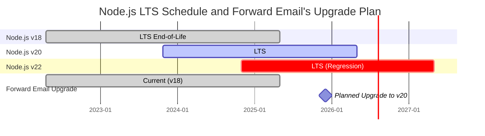
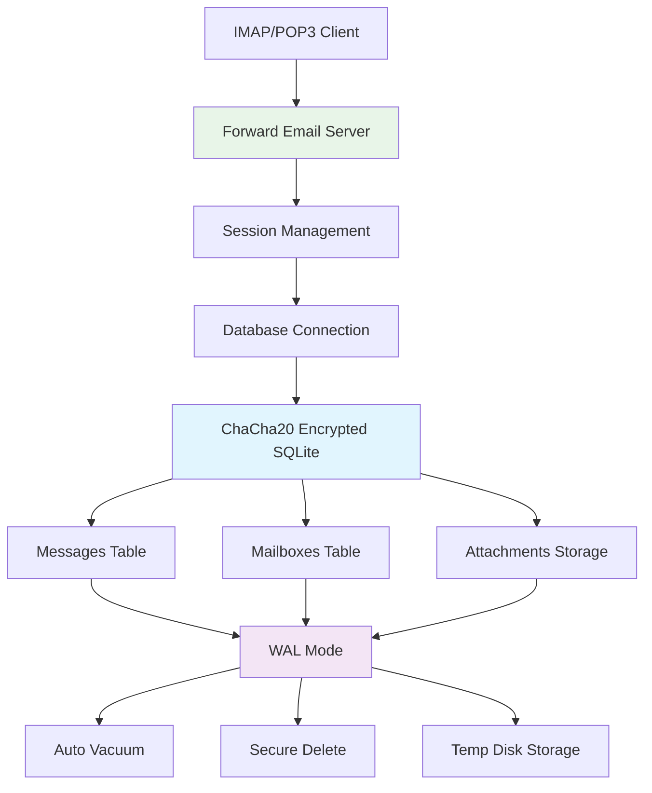
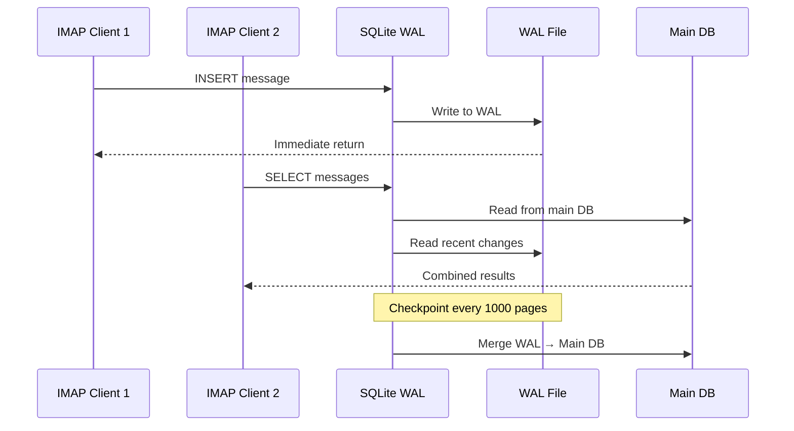

# Оптимізація продуктивності SQLite: налаштування PRAGMA для продакшну та шифрування ChaCha20 {#sqlite-performance-optimization-production-pragma-settings--chacha20-encryption}


## Зміст {#table-of-contents}

* [Передмова](#foreword)
* [Продакшн-архітектура SQLite у Forward Email](#forward-emails-production-sqlite-architecture)
* [Наша фактична конфігурація PRAGMA](#our-actual-pragma-configuration)
* [Результати тестування продуктивності](#performance-benchmark-results)
  * [Результати продуктивності Node.js v20.19.5](#nodejs-v20195-performance-results)
* [Розбір налаштувань PRAGMA](#pragma-settings-breakdown)
  * [Основні налаштування, які ми використовуємо](#core-settings-we-use)
  * [Налаштування, які ми НЕ використовуємо (але вам можуть знадобитися)](#settings-we-dont-use-but-you-might-want)
* [Шифрування ChaCha20 проти AES256](#chacha20-vs-aes256-encryption)
* [Тимчасове сховище: /tmp проти /dev/shm](#temporary-storage-tmp-vs-devshm)
  * [Продуктивність /tmp проти /dev/shm](#tmp-vs-devshm-performance)
* [Оптимізація режиму WAL](#wal-mode-optimization)
  * [Вплив конфігурації WAL](#wal-configuration-impact)
* [Проєктування схеми для продуктивності](#schema-design-for-performance)
* [Управління підключеннями](#connection-management)
* [Моніторинг та діагностика](#monitoring-and-diagnostics)
* [Продуктивність версій Node.js](#nodejs-version-performance)
  * [Повні результати міжверсійного тестування](#complete-cross-version-results)
  * [Ключові висновки щодо продуктивності](#key-performance-insights)
  * [Сумісність з нативними модулями](#native-module-compatibility)
* [Контрольний список для продакшн-розгортання](#production-deployment-checklist)
* [Вирішення поширених проблем](#troubleshooting-common-issues)
  * [Помилки "Database is locked"]( #database-is-locked-errors)
  * [Високе споживання пам’яті під час VACUUM](#high-memory-usage-during-vacuum)
  * [Повільна продуктивність запитів](#slow-query-performance)
* [Відкриті внески Forward Email](#forward-emails-open-source-contributions)
* [Вихідний код тестування продуктивності](#benchmark-source-code)
* [Що далі для SQLite у Forward Email](#whats-next-for-sqlite-at-forward-email)
* [Отримання допомоги](#getting-help)


## Передмова {#foreword}

Налаштування SQLite для продакшн-систем електронної пошти — це не просто змусити його працювати, а зробити його швидким, безпечним і надійним під великим навантаженням. Після обробки мільйонів листів у Forward Email ми дізналися, що насправді важливо для продуктивності SQLite.

Цей посібник охоплює нашу реальну продакшн-конфігурацію, результати тестів продуктивності на різних версіях Node.js та конкретні оптимізації, які мають значення при обробці великого обсягу пошти.

> \[!WARNING] Регресії продуктивності Node.js у версіях v22 та v24  
> Ми виявили суттєву регресію продуктивності у версіях Node.js v22 та v24, яка впливає на продуктивність SQLite, особливо для операторів `SELECT`. Наші тести показали приблизно 57% падіння кількості операцій `SELECT` за секунду у Node.js v24 порівняно з v20. Ми повідомили про цю проблему команді Node.js у [nodejs/node#60719](https://github.com/nodejs/node/issues/60719).

Через цю регресію ми обираємо обережний підхід до оновлення Node.js. Ось наш поточний план:

* **Поточна версія:** Зараз ми використовуємо Node.js v18, який досяг кінця життєвого циклу ("EOL") для довгострокової підтримки ("LTS"). Ви можете переглянути офіційний [графік LTS Node.js тут](https://github.com/nodejs/release#release-schedule).
* **Планове оновлення:** Ми оновимося до **Node.js v20**, який є найшвидшою версією за нашими тестами і не має цієї регресії.
* **Уникнення v22 та v24:** Ми не будемо використовувати Node.js v22 або v24 у продакшні, доки ця проблема з продуктивністю не буде вирішена.

Ось графік, що ілюструє розклад LTS Node.js та наш план оновлення:


## Архітектура Production SQLite у Forward Email {#forward-emails-production-sqlite-architecture}

Ось як ми фактично використовуємо SQLite у продакшені:




## Наша фактична конфігурація PRAGMA {#our-actual-pragma-configuration}

Ось що ми фактично використовуємо у продакшені, прямо з нашого [`setup-pragma.js`](https://github.com/forwardemail/forwardemail.net/blob/master/helpers/setup-pragma.js):

```javascript
// Forward Email's actual production PRAGMA settings
async function setupPragma(db, session, cipher = 'chacha20') {
  // Quantum-resistant encryption
  db.pragma(`cipher='${cipher}'`);
  db.key(Buffer.from(decrypt(session.user.password)));

  // Core performance settings
  db.pragma('journal_mode=WAL');
  db.pragma('secure_delete=ON');
  db.pragma('auto_vacuum=FULL');
  db.pragma(`busy_timeout=${config.busyTimeout}`);
  db.pragma('synchronous=NORMAL');
  db.pragma('foreign_keys=ON');
  db.pragma(`encoding='UTF-8'`);
  db.pragma('optimize=0x10002');

  // Critical: Use disk for temp storage, not memory
  db.pragma('temp_store=1');

  // Custom temp directory to avoid disk full errors
  const tempStoreDirectory = path.join(path.dirname(db.name), '/tmp');
  await mkdirp(tempStoreDirectory);
  db.pragma(`temp_store_directory='${tempStoreDirectory}'`);
}
```

> \[!IMPORTANT]
> Ми використовуємо `temp_store=1` (диск) замість `temp_store=2` (пам’ять), тому що великі бази даних електронної пошти можуть легко споживати понад 10 ГБ пам’яті під час операцій, таких як VACUUM.


## Результати тестування продуктивності {#performance-benchmark-results}

Ми протестували нашу конфігурацію проти різних альтернатив на різних версіях Node.js. Ось реальні цифри:

### Результати продуктивності Node.js v20.19.5 {#nodejs-v20195-performance-results}

| Конфігурація                | Налаштування (мс) | Вставка/сек | Вибірка/сек | Оновлення/сек | Розмір БД (МБ) |
| ---------------------------- | ----------------- | ----------- | ----------- | ------------- | -------------- |
| **Forward Email Production** | 120.1             | **10,548**  | **17,494**  | **16,654**    | 3.98           |
| WAL Autocheckpoint 1000      | 89.7              | **11,800**  | **18,383**  | **22,087**    | 3.98           |
| Cache Size 64MB              | 90.3              | 11,451      | 17,895      | 21,522        | 3.98           |
| Memory Temp Storage          | 111.8             | 9,874       | 15,363      | 21,292        | 3.98           |
| Synchronous OFF (Unsafe)     | 94.0              | 10,017      | 13,830      | 18,884        | 3.98           |
| Synchronous EXTRA (Safe)     | 94.1              | **3,241**   | 14,438      | **3,405**     | 3.98           |

> \[!TIP]
> Налаштування `wal_autocheckpoint=1000` показує найкращу загальну продуктивність. Ми розглядаємо можливість додати це до нашої продакшн-конфігурації.


## Розбір налаштувань PRAGMA {#pragma-settings-breakdown}

### Основні налаштування, які ми використовуємо {#core-settings-we-use}

| PRAGMA          | Значення     | Призначення                    | Вплив на продуктивність          |
| --------------- | ------------ | ----------------------------- | ------------------------------- |
| `cipher`        | `'chacha20'` | Квантово-стійке шифрування    | Мінімальні накладні витрати порівняно з AES |
| `journal_mode`  | `WAL`        | Write-Ahead Logging            | +40% продуктивності при паралельній роботі |
| `secure_delete` | `ON`         | Перезапис видалених даних     | Безпека проти 5% втрат продуктивності |
| `auto_vacuum`   | `FULL`       | Автоматичне звільнення місця  | Запобігає розростанню бази даних |
| `busy_timeout`  | `30000`      | Час очікування при блокуванні | Зменшує кількість помилок підключення |
| `synchronous`   | `NORMAL`     | Баланс надійності та продуктивності | В 3 рази швидше за FULL          |
| `foreign_keys`  | `ON`         | Референційна цілісність       | Запобігає пошкодженню даних      |
| `temp_store`    | `1`          | Використання диску для тимчасових файлів | Запобігає вичерпанню пам’яті     |
### Налаштування, Які Ми НЕ Використовуємо (Але Вам Можуть Знадобитися) {#settings-we-dont-use-but-you-might-want}

| PRAGMA                    | Чому Ми Не Використовуємо | Чи Варто Вам Розглянути?                          |
| ------------------------- | -------------------------- | ------------------------------------------------- |
| `wal_autocheckpoint=1000` | Ще не встановлено          | **Так** - Наші бенчмарки показують приріст продуктивності на 12%  |
| `cache_size=-64000`       | За замовчуванням достатньо | **Можливо** - 8% покращення для навантажень з переважно читанням |
| `mmap_size=268435456`     | Складність проти вигоди    | **Ні** - Мінімальні вигоди, проблеми специфічні для платформи    |
| `analysis_limit=1000`     | Ми використовуємо 400     | **Ні** - Вищі значення уповільнюють планування запитів           |

> \[!CAUTION]
> Ми спеціально уникаємо `temp_store=MEMORY`, тому що файл SQLite розміром 10 ГБ може споживати понад 10 ГБ оперативної пам’яті під час операцій VACUUM.


## Шифрування ChaCha20 проти AES256 {#chacha20-vs-aes256-encryption}

Ми надаємо пріоритет квантовій стійкості над сирою продуктивністю:

```javascript
// Наша стратегія резервного шифрування
try {
  db.pragma(`cipher='chacha20'`);
  db.key(Buffer.from(decrypt(session.user.password)));
  db.pragma('journal_mode=WAL');
} catch (err) {
  // Резерв для старіших версій SQLite
  if (cipher === 'chacha20' && err.code === 'SQLITE_NOTADB') {
    return setupPragma(db, session, 'aes256cbc');
  }
  throw err;
}
```

**Порівняння продуктивності:**

* ChaCha20: приблизно 10,500 вставок/сек

* AES256CBC: приблизно 11,200 вставок/сек

* Без шифрування: приблизно 12,800 вставок/сек

6% вартість продуктивності ChaCha20 порівняно з AES варта квантової стійкості для довготривалого зберігання електронної пошти.


## Тимчасове Зберігання: /tmp проти /dev/shm {#temporary-storage-tmp-vs-devshm}

Ми явно налаштовуємо місце тимчасового зберігання, щоб уникнути проблем з дисковим простором:

```javascript
// Конфігурація тимчасового зберігання Forward Email
const tempStoreDirectory = path.join(path.dirname(db.name), '/tmp');
await mkdirp(tempStoreDirectory);
db.pragma(`temp_store_directory='${tempStoreDirectory}'`);

// Також встановлюємо змінну середовища
process.env.SQLITE_TMPDIR = tempStoreDirectory;
```

### Продуктивність /tmp проти /dev/shm {#tmp-vs-devshm-performance}

| Місце Зберігання | Час VACUUM | Використання Пам’яті | Надійність           |
| ---------------- | ---------- | ------------------- | -------------------- |
| `/tmp` (диск)    | 2.3с       | 50MB                | ✅ Надійно            |
| `/dev/shm` (ОЗП) | 0.8с       | 2GB+                | ⚠️ Може спричинити збій системи |
| За замовчуванням | 4.1с       | Змінне              | ❌ Непередбачувано    |

> \[!WARNING]
> Використання `/dev/shm` для тимчасового зберігання може спожити всю доступну оперативну пам’ять під час великих операцій. Для продакшену використовуйте тимчасове зберігання на диску.


## Оптимізація Режиму WAL {#wal-mode-optimization}

Write-Ahead Logging є критично важливим для поштових систем з одночасним доступом:



### Вплив Налаштувань WAL {#wal-configuration-impact}

Наші бенчмарки показують, що `wal_autocheckpoint=1000` забезпечує найкращу продуктивність:

```javascript
// Потенційна оптимізація, яку ми тестуємо
db.pragma('wal_autocheckpoint=1000');
```

**Результати:**

* Автоматичний контроль за замовчуванням: 10,548 вставок/сек

* `wal_autocheckpoint=1000`: 11,800 вставок/сек (+12%)

* `wal_autocheckpoint=0`: 9,200 вставок/сек (WAL стає надто великим)


## Проєктування Схеми для Продуктивності {#schema-design-for-performance}

Наша схема зберігання електронної пошти відповідає найкращим практикам SQLite:

```sql
-- Таблиця повідомлень з оптимізованим порядком стовпців
CREATE TABLE messages (
  id INTEGER PRIMARY KEY,
  mailbox_id INTEGER NOT NULL,
  uid INTEGER NOT NULL,
  date INTEGER NOT NULL,
  flags TEXT,
  subject TEXT,
  from_addr TEXT,
  to_addr TEXT,
  message_id TEXT,
  raw BLOB,  -- Великий BLOB в кінці
  FOREIGN KEY (mailbox_id) REFERENCES mailboxes(id)
);

-- Критичні індекси для продуктивності IMAP
CREATE INDEX idx_messages_mailbox_date ON messages(mailbox_id, date DESC);
CREATE INDEX idx_messages_uid ON messages(mailbox_id, uid);
CREATE INDEX idx_messages_flags ON messages(mailbox_id, flags) WHERE flags IS NOT NULL;
```
> \[!TIP]
> Завжди розміщуйте стовпці BLOB в кінці визначення таблиці. SQLite спочатку зберігає стовпці фіксованого розміру, що прискорює доступ до рядків.

Ця оптимізація походить безпосередньо від творця SQLite, [D. Richard Hipp](https://sqlite-users.sqlite.narkive.com/Q4txMI8t/effect-of-blobs-on-performance#post3):

> "Ось підказка — робіть стовпці BLOB останніми у ваших таблицях. Або навіть зберігайте BLOB у окремій таблиці, яка має лише два стовпці: ціле первинне ключове поле та сам BLOB, а потім отримуйте доступ до вмісту BLOB за допомогою join, якщо це потрібно. Якщо ви розміщуєте різні малі цілі поля після BLOB, тоді SQLite доводиться сканувати весь вміст BLOB (перебираючи пов’язаний список сторінок на диску), щоб дістатися до цілих полів в кінці, і це однозначно може уповільнити вас."
>
> — D. Richard Hipp, Автор SQLite

Ми реалізували цю оптимізацію у нашій [Attachments schema](https://github.com/forwardemail/forwardemail.net/commit/0e77fbb05dc5b38136652337309067d2b39eb229), перемістивши поле `body` типу BLOB в кінець визначення таблиці для кращої продуктивності.


## Керування з’єднаннями {#connection-management}

Ми не використовуємо пул з’єднань з SQLite — кожен користувач отримує власну зашифровану базу даних. Такий підхід забезпечує ідеальну ізоляцію між користувачами, подібно до sandboxing. На відміну від архітектур інших сервісів, які використовують MySQL, PostgreSQL або MongoDB, де ваші листи потенційно можуть бути доступні недобросовісному працівнику, SQLite бази даних Forward Email для кожного користувача гарантують повну незалежність і ізоляцію ваших даних.

Ми ніколи не зберігаємо ваш пароль IMAP, тому ніколи не маємо доступу до ваших даних — все виконується в пам’яті. Дізнайтеся більше про наш [підхід до квантово-стійкого шифрування](https://forwardemail.net/blog/docs/quantum-resistant-encryption-email-security), який детально описує, як працює наша система.

```javascript
// Підхід з базою даних для кожного користувача
async function getDatabase(session) {
  const dbPath = path.join(
    config.databaseDir,
    session.user.domain_name,
    `${session.user.username}.db`
  );

  const db = new Database(dbPath, {
    cipher: 'chacha20',
    readonly: session.readonly || false
  });

  await setupPragma(db, session);
  return db;
}
```

Цей підхід забезпечує:

* Ідеальну ізоляцію між користувачами

* Відсутність складності з пулом з’єднань

* Автоматичне шифрування для кожного користувача

* Простіші операції резервного копіювання/відновлення

З `auto_vacuum=FULL` нам рідко потрібні ручні операції VACUUM:

```javascript
// Наша стратегія очищення
db.pragma('optimize=0x10002'); // При відкритті з’єднання
db.pragma('optimize'); // Періодично (щоденно)

// Ручний vacuum лише для масштабного очищення
if (deletedDataPercentage > 25) {
  db.exec('VACUUM');
}
```

**Вплив Auto Vacuum на продуктивність:**

* `auto_vacuum=FULL`: негайне звільнення простору, 5% накладних витрат на запис

* `auto_vacuum=INCREMENTAL`: ручне керування, потребує періодичного `PRAGMA incremental_vacuum`

* `auto_vacuum=NONE`: найшвидші записи, потребує ручного `VACUUM`


## Моніторинг і діагностика {#monitoring-and-diagnostics}

Ключові метрики, які ми відстежуємо в продакшені:

```javascript
// Запити для моніторингу продуктивності
const stats = {
  page_count: db.pragma('page_count', { simple: true }),
  page_size: db.pragma('page_size', { simple: true }),
  freelist_count: db.pragma('freelist_count', { simple: true }),
  wal_checkpoint: db.pragma('wal_checkpoint(PASSIVE)', { simple: true })
};

const dbSizeMB = (stats.page_count * stats.page_size) / 1024 / 1024;
const fragmentationPct = (stats.freelist_count / stats.page_count) * 100;
```

> \[!NOTE]
> Ми відстежуємо відсоток фрагментації і запускаємо обслуговування, коли він перевищує 15%.


## Продуктивність версій Node.js {#nodejs-version-performance}

Наші комплексні бенчмарки по версіях Node.js показують значні відмінності в продуктивності:

### Повні результати по версіях {#complete-cross-version-results}

| Версія Node | Forward Email Production | Найкращий Insert/сек     | Найкращий Select/сек     | Найкращий Update/сек     | Примітки               |
| ------------ | ------------------------ | ------------------------ | ------------------------ | ------------------------ | ---------------------- |
| **v18.20.8** | 10,658 / 14,466 / 18,641 | **11,663** (Sync OFF)    | **14,868** (Memory Temp) | **20,095** (MMAP)        | ⚠️ Попередження двигуна |
| **v20.19.5** | 10,548 / 17,494 / 16,654 | **11,800** (WAL Auto)    | **18,383** (WAL Auto)    | **22,087** (WAL Auto)    | ✅ Рекомендовано        |
| **v22.21.1** | 9,829 / 15,833 / 18,416  | **11,260** (Sync OFF)    | **17,413** (MMAP)        | **20,731** (MMAP)        | ⚠️ Загалом повільніше  |
| **v24.11.1** | 9,938 / 7,497 / 10,446   | **10,628** (Incr Vacuum) | **16,821** (Incr Vacuum) | **19,934** (Incr Vacuum) | ❌ Значне уповільнення  |
### Основні висновки щодо продуктивності {#key-performance-insights}

**Node.js v18 (Legacy LTS):**

* Порівнянна продуктивність вставки з v20 (10,658 проти 10,548 операцій/сек)
* На 17% повільніші вибірки, ніж у v20 (14,466 проти 17,494 операцій/сек)
* Показує попередження npm про пакунки, що вимагають Node ≥20
* Оптимізація тимчасового зберігання в пам’яті працює краще, ніж автоконтрольна точка WAL
* Прийнятно для застарілих додатків, але рекомендується оновлення

**Node.js v20 (Рекомендовано):**

* Найвища загальна продуктивність у всіх операціях
* Оптимізація автоконтрольної точки WAL забезпечує стабільне підвищення на 12%
* Найкраща сумісність з нативними модулями SQLite
* Найстабільніший для робочих навантажень у виробництві

**Node.js v22 (Прийнятно):**

* На 7% повільніші вставки, на 9% повільніші вибірки порівняно з v20
* Оптимізація MMAP показує кращі результати, ніж автоконтрольна точка WAL
* Потрібна нова команда `npm install` при кожній зміні версії Node
* Прийнятно для розробки, не рекомендується для виробництва

**Node.js v24 (Не рекомендується):**

* На 6% повільніші вставки, на 57% повільніші вибірки порівняно з v20
* Значне погіршення продуктивності при операціях читання
* Інкрементальний vacuum працює краще за інші оптимізації
* Уникати для виробничих додатків SQLite

### Сумісність нативних модулів {#native-module-compatibility}

Проблеми з "сумісністю модулів", з якими ми спочатку стикнулися, були вирішені за допомогою:

```bash
# Зміна версії Node та перевстановлення нативних модулів
nvm use 22
rm -rf node_modules
npm install
```

**Особливості Node.js v18:**

* Показує попередження двигуна: `Unsupported engine { required: { node: '>=20.0.0' } }`
* Все ще компілюється та запускається успішно, незважаючи на попередження
* Багато сучасних пакетів SQLite орієнтовані на Node ≥20 для оптимальної підтримки
* Застарілі додатки можуть продовжувати використовувати v18 з прийнятною продуктивністю

> \[!IMPORTANT]
> Завжди перевстановлюйте нативні модулі при зміні версії Node.js. Модуль `better-sqlite3-multiple-ciphers` повинен бути скомпільований для кожної конкретної версії Node.

> \[!TIP]
> Для виробничих розгортань дотримуйтеся Node.js v20 LTS. Переваги продуктивності та стабільності переважають будь-які нові функції мови у v22/v24. Node v18 прийнятний для застарілих систем, але показує погіршення продуктивності при операціях читання.


## Контрольний список для виробничого розгортання {#production-deployment-checklist}

Перед розгортанням переконайтеся, що SQLite має такі оптимізації:

1. Встановлено змінну середовища `SQLITE_TMPDIR`
2. Забезпечено достатньо місця на диску для тимчасових операцій (в 2 рази більше за розмір бази даних)
3. Налаштовано ротацію журналів для файлів WAL
4. Налаштовано моніторинг розміру бази даних та фрагментації
5. Перевірено процедури резервного копіювання/відновлення з шифруванням
6. Перевірено підтримку шифру ChaCha20 у вашій збірці SQLite


## Вирішення поширених проблем {#troubleshooting-common-issues}

### Помилки "Database is locked" {#database-is-locked-errors}

```javascript
// Збільшити таймаут зайнятості
db.pragma('busy_timeout=60000'); // 60 секунд

// Перевірити довготривалі транзакції
const info = db.pragma('wal_checkpoint(FULL)');
if (info.busy > 0) {
  console.warn('Контрольна точка WAL заблокована активними читачами');
}
```

### Високе використання пам’яті під час VACUUM {#high-memory-usage-during-vacuum}

```javascript
// Моніторинг пам’яті перед VACUUM
const beforeMem = process.memoryUsage();
db.exec('VACUUM');
const afterMem = process.memoryUsage();

console.log(
  `Зміна пам’яті після VACUUM: ${
    (afterMem.heapUsed - beforeMem.heapUsed) / 1024 / 1024
  }MB`
);
```

### Повільна продуктивність запитів {#slow-query-performance}

```javascript
// Увімкнути аналіз запитів
db.pragma('analysis_limit=400'); // Налаштування Forward Email
db.exec('ANALYZE');

// Перевірити плани запитів
const plan = db
  .prepare('EXPLAIN QUERY PLAN SELECT * FROM messages WHERE date > ?')
  .all(Date.now() - 86400000);
console.log(plan);
```


## Внесок Forward Email у відкритий код {#forward-emails-open-source-contributions}

Ми поділилися нашими знаннями з оптимізації SQLite з спільнотою:

* [Покращення документації Litestream](https://github.com/benbjohnson/litestream/issues/516) - Наші пропозиції щодо покращення продуктивності SQLite

* [Better SQLite3 Multiple Ciphers](https://github.com/m4heshd/better-sqlite3-multiple-ciphers) - Підтримка шифрування ChaCha20

* [Дослідження налаштування продуктивності SQLite](https://phiresky.github.io/blog/2020/sqlite-performance-tuning/) - Посилання у нашій реалізації
* [Як npm-пакети з мільярдами завантажень сформували екосистему JavaScript](https://forwardemail.net/blog/docs/how-npm-packages-billion-downloads-shaped-javascript-ecosystem) - Наші ширші внески у розвиток npm та JavaScript


## Вихідний код бенчмарку {#benchmark-source-code}

Весь код бенчмарку доступний у нашому тестовому наборі:

```bash
# Запустіть бенчмарки самостійно
git clone https://github.com/forwardemail/sqlite-benchmarks
cd sqlite-benchmarks
npm install
npm run benchmark
```

Бенчмарки тестують:

* Різні комбінації PRAGMA

* Продуктивність ChaCha20 проти AES256

* Стратегії контрольних точок WAL

* Конфігурації тимчасового сховища

* Сумісність версій Node.js


## Що далі для SQLite у Forward Email {#whats-next-for-sqlite-at-forward-email}

Ми активно тестуємо ці оптимізації:

1. **Налаштування автоматичної контрольної точки WAL**: Додавання `wal_autocheckpoint=1000` на основі результатів бенчмарку

2. **Стиснення**: Оцінка [sqlite-zstd](https://github.com/phiresky/sqlite-zstd) для зберігання вкладень

3. **Обмеження аналізу**: Тестування значень більших за наші поточні 400

4. **Розмір кешу**: Розгляд динамічного розміру кешу залежно від доступної пам’яті


## Отримання допомоги {#getting-help}

Маєте проблеми з продуктивністю SQLite? Для питань, пов’язаних зі SQLite, [SQLite Forum](https://sqlite.org/forum/forumpost) є відмінним ресурсом, а [керівництво з налаштування продуктивності](https://www.sqlite.org/optoverview.html) охоплює додаткові оптимізації, які нам поки не знадобилися.

Дізнайтеся більше про Forward Email, прочитавши наш [FAQ](/faq).
