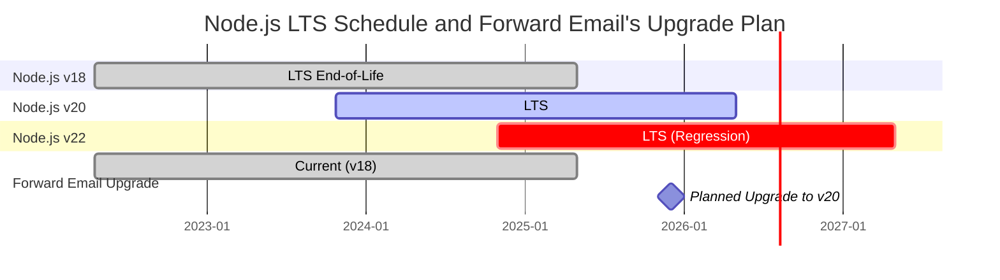
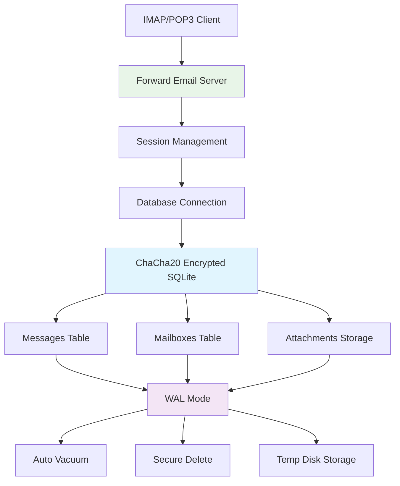
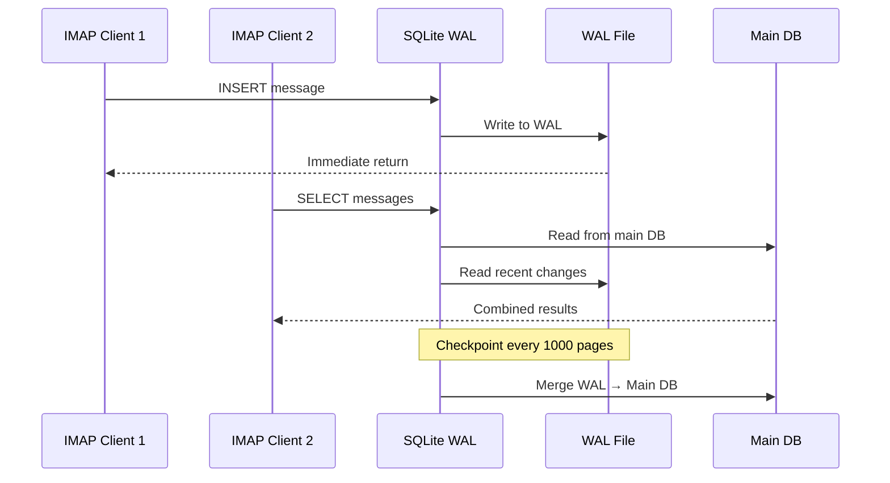

# Tối ưu hiệu suất SQLite: Cấu hình PRAGMA sản xuất & Mã hóa ChaCha20 {#sqlite-performance-optimization-production-pragma-settings--chacha20-encryption}


## Mục lục {#table-of-contents}

* [Lời nói đầu](#foreword)
* [Kiến trúc SQLite sản xuất của Forward Email](#forward-emails-production-sqlite-architecture)
* [Cấu hình PRAGMA thực tế của chúng tôi](#our-actual-pragma-configuration)
* [Kết quả đánh giá hiệu suất](#performance-benchmark-results)
  * [Kết quả hiệu suất Node.js v20.19.5](#nodejs-v20195-performance-results)
* [Phân tích cấu hình PRAGMA](#pragma-settings-breakdown)
  * [Cấu hình cốt lõi chúng tôi sử dụng](#core-settings-we-use)
  * [Cấu hình chúng tôi KHÔNG sử dụng (nhưng bạn có thể muốn)](#settings-we-dont-use-but-you-might-want)
* [Mã hóa ChaCha20 vs AES256](#chacha20-vs-aes256-encryption)
* [Bộ nhớ tạm: /tmp vs /dev/shm](#temporary-storage-tmp-vs-devshm)
  * [Hiệu suất /tmp vs /dev/shm](#tmp-vs-devshm-performance)
* [Tối ưu chế độ WAL](#wal-mode-optimization)
  * [Ảnh hưởng cấu hình WAL](#wal-configuration-impact)
* [Thiết kế schema cho hiệu suất](#schema-design-for-performance)
* [Quản lý kết nối](#connection-management)
* [Giám sát và chẩn đoán](#monitoring-and-diagnostics)
* [Hiệu suất các phiên bản Node.js](#nodejs-version-performance)
  * [Kết quả đầy đủ qua các phiên bản](#complete-cross-version-results)
  * [Những hiểu biết chính về hiệu suất](#key-performance-insights)
  * [Tương thích module native](#native-module-compatibility)
* [Danh sách kiểm tra triển khai sản xuất](#production-deployment-checklist)
* [Khắc phục sự cố phổ biến](#troubleshooting-common-issues)
  * [Lỗi "Database is locked"](#database-is-locked-errors)
  * [Sử dụng bộ nhớ cao khi VACUUM](#high-memory-usage-during-vacuum)
  * [Hiệu suất truy vấn chậm](#slow-query-performance)
* [Đóng góp mã nguồn mở của Forward Email](#forward-emails-open-source-contributions)
* [Mã nguồn đánh giá hiệu suất](#benchmark-source-code)
* [Điều gì tiếp theo cho SQLite tại Forward Email](#whats-next-for-sqlite-at-forward-email)
* [Nhận trợ giúp](#getting-help)


## Lời nói đầu {#foreword}

Thiết lập SQLite cho hệ thống email sản xuất không chỉ là làm cho nó hoạt động — mà còn phải làm cho nó nhanh, an toàn và đáng tin cậy dưới tải nặng. Sau khi xử lý hàng triệu email tại Forward Email, chúng tôi đã học được điều gì thực sự quan trọng đối với hiệu suất SQLite.

Hướng dẫn này bao gồm cấu hình sản xuất thực tế của chúng tôi, kết quả đánh giá hiệu suất qua các phiên bản Node.js, và các tối ưu cụ thể tạo ra sự khác biệt khi bạn xử lý khối lượng email lớn.

> \[!WARNING] Suy giảm hiệu suất Node.js trong v22 và v24
> Chúng tôi phát hiện một suy giảm hiệu suất đáng kể trong các phiên bản Node.js v22 và v24 ảnh hưởng đến hiệu suất SQLite, đặc biệt với các câu lệnh `SELECT`. Các bài đánh giá của chúng tôi cho thấy giảm khoảng 57% số lượng thao tác `SELECT` mỗi giây trên Node.js v24 so với v20. Chúng tôi đã báo cáo vấn đề này với nhóm Node.js tại [nodejs/node#60719](https://github.com/nodejs/node/issues/60719).

Do suy giảm này, chúng tôi đang áp dụng cách tiếp cận thận trọng trong việc nâng cấp Node.js. Kế hoạch hiện tại của chúng tôi như sau:

* **Phiên bản hiện tại:** Chúng tôi đang dùng Node.js v18, phiên bản đã hết vòng đời ("EOL") cho Hỗ trợ Dài hạn ("LTS"). Bạn có thể xem lịch trình chính thức [Node.js LTS tại đây](https://github.com/nodejs/release#release-schedule).
* **Nâng cấp dự kiến:** Chúng tôi sẽ nâng cấp lên **Node.js v20**, phiên bản nhanh nhất theo đánh giá của chúng tôi và không bị ảnh hưởng bởi suy giảm này.
* **Tránh dùng v22 và v24:** Chúng tôi sẽ không sử dụng Node.js v22 hoặc v24 trong môi trường sản xuất cho đến khi vấn đề hiệu suất được giải quyết.

Dưới đây là dòng thời gian minh họa lịch trình Node.js LTS và lộ trình nâng cấp của chúng tôi:


## Kiến trúc SQLite trong Sản xuất của Forward Email {#forward-emails-production-sqlite-architecture}

Dưới đây là cách chúng tôi thực sự sử dụng SQLite trong môi trường sản xuất:



## Cấu hình PRAGMA Thực tế của Chúng tôi {#our-actual-pragma-configuration}

Đây là những gì chúng tôi thực sự sử dụng trong sản xuất, trực tiếp từ [`setup-pragma.js`](https://github.com/forwardemail/forwardemail.net/blob/master/helpers/setup-pragma.js):

```javascript
// Forward Email's actual production PRAGMA settings
async function setupPragma(db, session, cipher = 'chacha20') {
  // Quantum-resistant encryption
  db.pragma(`cipher='${cipher}'`);
  db.key(Buffer.from(decrypt(session.user.password)));

  // Core performance settings
  db.pragma('journal_mode=WAL');
  db.pragma('secure_delete=ON');
  db.pragma('auto_vacuum=FULL');
  db.pragma(`busy_timeout=${config.busyTimeout}`);
  db.pragma('synchronous=NORMAL');
  db.pragma('foreign_keys=ON');
  db.pragma(`encoding='UTF-8'`);
  db.pragma('optimize=0x10002');

  // Critical: Use disk for temp storage, not memory
  db.pragma('temp_store=1');

  // Custom temp directory to avoid disk full errors
  const tempStoreDirectory = path.join(path.dirname(db.name), '/tmp');
  await mkdirp(tempStoreDirectory);
  db.pragma(`temp_store_directory='${tempStoreDirectory}'`);
}
```

> \[!IMPORTANT]
> Chúng tôi sử dụng `temp_store=1` (đĩa) thay vì `temp_store=2` (bộ nhớ) vì các cơ sở dữ liệu email lớn có thể dễ dàng tiêu thụ hơn 10 GB bộ nhớ trong các thao tác như VACUUM.

## Kết quả Đo hiệu năng {#performance-benchmark-results}

Chúng tôi đã thử nghiệm cấu hình của mình với nhiều lựa chọn khác nhau trên các phiên bản Node.js. Dưới đây là các con số thực tế:

### Kết quả Hiệu năng Node.js v20.19.5 {#nodejs-v20195-performance-results}

| Cấu hình                    | Thiết lập (ms) | Chèn/giây | Truy vấn/giây | Cập nhật/giây | Kích thước DB (MB) |
| ---------------------------- | -------------- | --------- | ------------- | ------------- | ------------------- |
| **Forward Email Production** | 120.1          | **10,548**| **17,494**    | **16,654**    | 3.98                |
| WAL Autocheckpoint 1000      | 89.7           | **11,800**| **18,383**    | **22,087**    | 3.98                |
| Cache Size 64MB              | 90.3           | 11,451    | 17,895        | 21,522        | 3.98                |
| Memory Temp Storage          | 111.8          | 9,874     | 15,363        | 21,292        | 3.98                |
| Synchronous OFF (Unsafe)     | 94.0           | 10,017    | 13,830        | 18,884        | 3.98                |
| Synchronous EXTRA (Safe)     | 94.1           | **3,241** | 14,438        | **3,405**     | 3.98                |

> \[!TIP]
> Cấu hình `wal_autocheckpoint=1000` cho thấy hiệu năng tổng thể tốt nhất. Chúng tôi đang cân nhắc thêm cấu hình này vào cấu hình sản xuất của mình.

## Phân tích Cài đặt PRAGMA {#pragma-settings-breakdown}

### Các Cài đặt Cốt lõi Chúng tôi Sử dụng {#core-settings-we-use}

| PRAGMA          | Giá trị      | Mục đích                      | Tác động Hiệu năng             |
| --------------- | ------------ | ----------------------------- | ----------------------------- |
| `cipher`        | `'chacha20'` | Mã hóa chống lượng tử          | Chi phí thấp hơn so với AES    |
| `journal_mode`  | `WAL`        | Ghi nhật ký trước khi ghi      | Tăng 40% hiệu năng đồng thời   |
| `secure_delete` | `ON`         | Ghi đè dữ liệu đã xóa          | Bảo mật đổi lấy 5% hiệu năng   |
| `auto_vacuum`   | `FULL`       | Tự động thu hồi không gian     | Ngăn ngừa phình to cơ sở dữ liệu |
| `busy_timeout`  | `30000`      | Thời gian chờ khi DB bị khóa  | Giảm lỗi kết nối               |
| `synchronous`   | `NORMAL`     | Cân bằng độ bền và hiệu năng  | Nhanh gấp 3 lần so với FULL    |
| `foreign_keys`  | `ON`         | Tính toàn vẹn tham chiếu      | Ngăn ngừa hỏng dữ liệu         |
| `temp_store`    | `1`          | Sử dụng đĩa cho file tạm      | Ngăn ngừa cạn kiệt bộ nhớ      |
### Cài Đặt Chúng Tôi KHÔNG Dùng (Nhưng Bạn Có Thể Muốn) {#settings-we-dont-use-but-you-might-want}

| PRAGMA                    | Tại Sao Chúng Tôi Không Dùng | Bạn Có Nên Xem Xét?                              |
| ------------------------- | ----------------------------- | ------------------------------------------------ |
| `wal_autocheckpoint=1000` | Chưa được thiết lập           | **Có** - Các bài kiểm tra của chúng tôi cho thấy tăng hiệu suất 12% |
| `cache_size=-64000`       | Mặc định là đủ                | **Có Thể** - Cải thiện 8% cho các khối lượng công việc đọc nhiều |
| `mmap_size=268435456`     | Độ phức tạp so với lợi ích    | **Không** - Lợi ích tối thiểu, vấn đề đặc thù nền tảng |
| `analysis_limit=1000`     | Chúng tôi dùng 400            | **Không** - Giá trị cao hơn làm chậm quá trình lập kế hoạch truy vấn |

> \[!CAUTION]
> Chúng tôi đặc biệt tránh `temp_store=MEMORY` vì một file SQLite 10GB có thể tiêu thụ hơn 10GB RAM trong quá trình VACUUM.


## Mã Hóa ChaCha20 vs AES256 {#chacha20-vs-aes256-encryption}

Chúng tôi ưu tiên khả năng chống lượng tử hơn là hiệu suất thuần túy:

```javascript
// Chiến lược dự phòng mã hóa của chúng tôi
try {
  db.pragma(`cipher='chacha20'`);
  db.key(Buffer.from(decrypt(session.user.password)));
  db.pragma('journal_mode=WAL');
} catch (err) {
  // Dự phòng cho các phiên bản SQLite cũ hơn
  if (cipher === 'chacha20' && err.code === 'SQLITE_NOTADB') {
    return setupPragma(db, session, 'aes256cbc');
  }
  throw err;
}
```

**So sánh hiệu suất:**

* ChaCha20: \~10,500 lần chèn/giây

* AES256CBC: \~11,200 lần chèn/giây

* Không mã hóa: \~12,800 lần chèn/giây

Chi phí hiệu suất 6% của ChaCha20 so với AES là xứng đáng cho khả năng chống lượng tử trong lưu trữ email lâu dài.


## Lưu Trữ Tạm Thời: /tmp vs /dev/shm {#temporary-storage-tmp-vs-devshm}

Chúng tôi cấu hình rõ ràng vị trí lưu trữ tạm để tránh các vấn đề về dung lượng đĩa:

```javascript
// Cấu hình lưu trữ tạm thời của Forward Email
const tempStoreDirectory = path.join(path.dirname(db.name), '/tmp');
await mkdirp(tempStoreDirectory);
db.pragma(`temp_store_directory='${tempStoreDirectory}'`);

// Cũng thiết lập biến môi trường
process.env.SQLITE_TMPDIR = tempStoreDirectory;
```

### Hiệu Suất /tmp vs /dev/shm {#tmp-vs-devshm-performance}

| Vị Trí Lưu Trữ  | Thời Gian VACUUM | Sử Dụng Bộ Nhớ | Độ Tin Cậy          |
| ---------------- | ---------------- | -------------- | ------------------- |
| `/tmp` (đĩa)     | 2.3s             | 50MB           | ✅ Đáng tin cậy      |
| `/dev/shm` (RAM) | 0.8s             | 2GB+           | ⚠️ Có thể làm sập hệ thống |
| Mặc định         | 4.1s             | Thay đổi       | ❌ Không dự đoán được |

> \[!WARNING]
> Sử dụng `/dev/shm` cho lưu trữ tạm có thể tiêu thụ toàn bộ RAM có sẵn trong các thao tác lớn. Nên dùng lưu trữ tạm dựa trên đĩa cho môi trường sản xuất.


## Tối Ưu Chế Độ WAL {#wal-mode-optimization}

Ghi nhật ký trước (Write-Ahead Logging) rất quan trọng cho hệ thống email với truy cập đồng thời:



### Tác Động Cấu Hình WAL {#wal-configuration-impact}

Các bài kiểm tra của chúng tôi cho thấy `wal_autocheckpoint=1000` mang lại hiệu suất tốt nhất:

```javascript
// Tối ưu tiềm năng đang thử nghiệm
db.pragma('wal_autocheckpoint=1000');
```

**Kết quả:**

* Tự động checkpoint mặc định: 10,548 lần chèn/giây

* `wal_autocheckpoint=1000`: 11,800 lần chèn/giây (+12%)

* `wal_autocheckpoint=0`: 9,200 lần chèn/giây (WAL phát triển quá lớn)


## Thiết Kế Schema Cho Hiệu Suất {#schema-design-for-performance}

Schema lưu trữ email của chúng tôi tuân theo các thực hành tốt nhất của SQLite:

```sql
-- Bảng messages với thứ tự cột tối ưu
CREATE TABLE messages (
  id INTEGER PRIMARY KEY,
  mailbox_id INTEGER NOT NULL,
  uid INTEGER NOT NULL,
  date INTEGER NOT NULL,
  flags TEXT,
  subject TEXT,
  from_addr TEXT,
  to_addr TEXT,
  message_id TEXT,
  raw BLOB,  -- BLOB lớn ở cuối
  FOREIGN KEY (mailbox_id) REFERENCES mailboxes(id)
);

-- Các chỉ mục quan trọng cho hiệu suất IMAP
CREATE INDEX idx_messages_mailbox_date ON messages(mailbox_id, date DESC);
CREATE INDEX idx_messages_uid ON messages(mailbox_id, uid);
CREATE INDEX idx_messages_flags ON messages(mailbox_id, flags) WHERE flags IS NOT NULL;
```
> \[!TIP]
> Luôn đặt các cột BLOB ở cuối định nghĩa bảng của bạn. SQLite lưu trữ các cột kích thước cố định trước, giúp truy cập hàng nhanh hơn.

Tối ưu hóa này đến trực tiếp từ người tạo SQLite, [D. Richard Hipp](https://sqlite-users.sqlite.narkive.com/Q4txMI8t/effect-of-blobs-on-performance#post3):

> "Dưới đây là một gợi ý - hãy đặt các cột BLOB là cột cuối cùng trong bảng của bạn. Hoặc thậm chí lưu trữ các BLOB trong một bảng riêng chỉ có hai cột: một khóa chính kiểu số nguyên và chính BLOB, rồi truy cập nội dung BLOB bằng cách sử dụng join nếu bạn cần. Nếu bạn đặt các trường số nguyên nhỏ khác sau BLOB, thì SQLite phải quét toàn bộ nội dung BLOB (theo danh sách liên kết các trang đĩa) để đến các trường số nguyên ở cuối, và điều đó chắc chắn có thể làm chậm bạn."
>
> — D. Richard Hipp, Tác giả SQLite

Chúng tôi đã triển khai tối ưu hóa này trong [schema Đính kèm](https://github.com/forwardemail/forwardemail.net/commit/0e77fbb05dc5b38136652337309067d2b39eb229), di chuyển trường BLOB `body` về cuối định nghĩa bảng để cải thiện hiệu suất.


## Quản lý Kết nối {#connection-management}

Chúng tôi không sử dụng connection pooling với SQLite — mỗi người dùng có cơ sở dữ liệu được mã hóa riêng. Cách tiếp cận này cung cấp sự cô lập hoàn hảo giữa các người dùng, tương tự như sandboxing. Khác với kiến trúc của các dịch vụ khác sử dụng MySQL, PostgreSQL hoặc MongoDB, nơi email của bạn có thể bị truy cập bởi nhân viên không đáng tin cậy, các cơ sở dữ liệu SQLite riêng biệt theo người dùng của Forward Email đảm bảo dữ liệu của bạn hoàn toàn độc lập và được sandbox.

Chúng tôi không bao giờ lưu mật khẩu IMAP của bạn, vì vậy chúng tôi không bao giờ có quyền truy cập vào dữ liệu của bạn — tất cả đều được xử lý trong bộ nhớ. Tìm hiểu thêm về [phương pháp mã hóa chống lượng tử](https://forwardemail.net/blog/docs/quantum-resistant-encryption-email-security) của chúng tôi mô tả cách hệ thống hoạt động.

```javascript
// Cách tiếp cận cơ sở dữ liệu theo người dùng
async function getDatabase(session) {
  const dbPath = path.join(
    config.databaseDir,
    session.user.domain_name,
    `${session.user.username}.db`
  );

  const db = new Database(dbPath, {
    cipher: 'chacha20',
    readonly: session.readonly || false
  });

  await setupPragma(db, session);
  return db;
}
```

Cách tiếp cận này cung cấp:

* Cô lập hoàn hảo giữa các người dùng

* Không có sự phức tạp của connection pool

* Mã hóa tự động theo từng người dùng

* Các thao tác sao lưu/phục hồi đơn giản hơn

Với `auto_vacuum=FULL`, chúng tôi hiếm khi cần thao tác VACUUM thủ công:

```javascript
// Chiến lược dọn dẹp của chúng tôi
db.pragma('optimize=0x10002'); // Khi mở kết nối
db.pragma('optimize'); // Định kỳ (hàng ngày)

// VACUUM thủ công chỉ cho các lần dọn dẹp lớn
if (deletedDataPercentage > 25) {
  db.exec('VACUUM');
}
```

**Ảnh hưởng hiệu suất của Auto Vacuum:**

* `auto_vacuum=FULL`: Thu hồi không gian ngay lập tức, chi phí ghi tăng 5%

* `auto_vacuum=INCREMENTAL`: Kiểm soát thủ công, yêu cầu `PRAGMA incremental_vacuum` định kỳ

* `auto_vacuum=NONE`: Ghi nhanh nhất, yêu cầu VACUUM thủ công


## Giám sát và Chẩn đoán {#monitoring-and-diagnostics}

Các chỉ số chính chúng tôi theo dõi trong môi trường sản xuất:

```javascript
// Các truy vấn giám sát hiệu suất
const stats = {
  page_count: db.pragma('page_count', { simple: true }),
  page_size: db.pragma('page_size', { simple: true }),
  freelist_count: db.pragma('freelist_count', { simple: true }),
  wal_checkpoint: db.pragma('wal_checkpoint(PASSIVE)', { simple: true })
};

const dbSizeMB = (stats.page_count * stats.page_size) / 1024 / 1024;
const fragmentationPct = (stats.freelist_count / stats.page_count) * 100;
```

> \[!NOTE]
> Chúng tôi theo dõi tỷ lệ phân mảnh và kích hoạt bảo trì khi vượt quá 15%.


## Hiệu suất Phiên bản Node.js {#nodejs-version-performance}

Các benchmark toàn diện của chúng tôi trên các phiên bản Node.js cho thấy sự khác biệt hiệu suất đáng kể:

### Kết quả Đầy đủ Qua Các Phiên bản {#complete-cross-version-results}

| Phiên bản Node | Forward Email Production | Tốc độ Insert tốt nhất/sec | Tốc độ Select tốt nhất/sec | Tốc độ Update tốt nhất/sec | Ghi chú                |
| -------------- | ------------------------ | -------------------------- | -------------------------- | -------------------------- | ---------------------- |
| **v18.20.8**   | 10,658 / 14,466 / 18,641 | **11,663** (Sync OFF)      | **14,868** (Memory Temp)   | **20,095** (MMAP)          | ⚠️ Cảnh báo Engine      |
| **v20.19.5**   | 10,548 / 17,494 / 16,654 | **11,800** (WAL Auto)      | **18,383** (WAL Auto)      | **22,087** (WAL Auto)      | ✅ Được khuyến nghị     |
| **v22.21.1**   | 9,829 / 15,833 / 18,416  | **11,260** (Sync OFF)      | **17,413** (MMAP)          | **20,731** (MMAP)          | ⚠️ Chậm hơn tổng thể    |
| **v24.11.1**   | 9,938 / 7,497 / 10,446   | **10,628** (Incr Vacuum)   | **16,821** (Incr Vacuum)   | **19,934** (Incr Vacuum)   | ❌ Giảm tốc đáng kể     |
### Những Thông Tin Hiệu Suất Chính {#key-performance-insights}

**Node.js v18 (Legacy LTS):**

* Hiệu suất chèn tương đương với v20 (10,658 so với 10,548 ops/giây)
* Chọn dữ liệu chậm hơn 17% so với v20 (14,466 so với 17,494 ops/giây)
* Hiển thị cảnh báo engine npm cho các gói yêu cầu Node ≥20
* Tối ưu lưu trữ tạm bộ nhớ hoạt động tốt hơn so với WAL autocheckpoint
* Chấp nhận được cho các ứng dụng kế thừa, nhưng nên nâng cấp

**Node.js v20 (Khuyến nghị):**

* Hiệu suất tổng thể cao nhất trên tất cả các thao tác
* Tối ưu WAL autocheckpoint cung cấp tăng trưởng ổn định 12%
* Tương thích tốt nhất với các module SQLite gốc
* Ổn định nhất cho khối lượng công việc sản xuất

**Node.js v22 (Chấp nhận được):**

* Chèn chậm hơn 7%, chọn dữ liệu chậm hơn 9% so với v20
* Tối ưu MMAP cho kết quả tốt hơn WAL autocheckpoint
* Yêu cầu cài đặt `npm install` mới cho mỗi lần chuyển đổi phiên bản Node
* Chấp nhận được cho phát triển, không khuyến nghị cho sản xuất

**Node.js v24 (Không khuyến nghị):**

* Chèn chậm hơn 6%, chọn dữ liệu chậm hơn 57% so với v20
* Suy giảm hiệu suất đáng kể trong các thao tác đọc
* Dọn dẹp incremental vacuum hoạt động tốt hơn các tối ưu khác
* Tránh sử dụng cho các ứng dụng SQLite sản xuất

### Tương Thích Module Gốc {#native-module-compatibility}

Các "vấn đề tương thích module" mà chúng tôi gặp phải ban đầu đã được giải quyết bằng:

```bash
# Chuyển phiên bản Node và cài đặt lại các module gốc
nvm use 22
rm -rf node_modules
npm install
```

**Lưu ý về Node.js v18:**

* Hiển thị cảnh báo engine: `Unsupported engine { required: { node: '>=20.0.0' } }`
* Vẫn biên dịch và chạy thành công mặc dù có cảnh báo
* Nhiều gói SQLite hiện đại nhắm tới Node ≥20 để hỗ trợ tối ưu
* Các ứng dụng kế thừa có thể tiếp tục dùng v18 với hiệu suất chấp nhận được

> \[!IMPORTANT]
> Luôn cài đặt lại các module gốc khi chuyển đổi phiên bản Node.js. Module `better-sqlite3-multiple-ciphers` phải được biên dịch cho từng phiên bản Node cụ thể.

> \[!TIP]
> Đối với triển khai sản xuất, hãy sử dụng Node.js v20 LTS. Lợi ích về hiệu suất và sự ổn định vượt trội hơn các tính năng ngôn ngữ mới hơn trong v22/v24. Node v18 chấp nhận được cho hệ thống kế thừa nhưng có suy giảm hiệu suất trong các thao tác đọc.


## Danh Sách Kiểm Tra Triển Khai Sản Xuất {#production-deployment-checklist}

Trước khi triển khai, đảm bảo SQLite có các tối ưu sau:

1. Thiết lập biến môi trường `SQLITE_TMPDIR`
2. Đảm bảo đủ dung lượng đĩa cho các thao tác tạm (gấp 2 lần kích thước cơ sở dữ liệu)
3. Cấu hình xoay vòng nhật ký cho các file WAL
4. Thiết lập giám sát kích thước cơ sở dữ liệu và phân mảnh
5. Kiểm tra quy trình sao lưu/phục hồi với mã hóa
6. Xác minh hỗ trợ mã hóa ChaCha20 trong bản build SQLite của bạn


## Khắc Phục Các Vấn Đề Thường Gặp {#troubleshooting-common-issues}

### Lỗi "Database is locked" {#database-is-locked-errors}

```javascript
// Tăng thời gian chờ busy
db.pragma('busy_timeout=60000'); // 60 giây

// Kiểm tra các giao dịch chạy lâu
const info = db.pragma('wal_checkpoint(FULL)');
if (info.busy > 0) {
  console.warn('WAL checkpoint bị chặn bởi các trình đọc đang hoạt động');
}
```

### Sử Dụng Bộ Nhớ Cao Trong Quá Trình VACUUM {#high-memory-usage-during-vacuum}

```javascript
// Giám sát bộ nhớ trước VACUUM
const beforeMem = process.memoryUsage();
db.exec('VACUUM');
const afterMem = process.memoryUsage();

console.log(
  `Chênh lệch bộ nhớ VACUUM: ${
    (afterMem.heapUsed - beforeMem.heapUsed) / 1024 / 1024
  }MB`
);
```

### Hiệu Suất Truy Vấn Chậm {#slow-query-performance}

```javascript
// Bật phân tích truy vấn
db.pragma('analysis_limit=400'); // Cài đặt của Forward Email
db.exec('ANALYZE');

// Kiểm tra kế hoạch truy vấn
const plan = db
  .prepare('EXPLAIN QUERY PLAN SELECT * FROM messages WHERE date > ?')
  .all(Date.now() - 86400000);
console.log(plan);
```


## Đóng Góp Mã Nguồn Mở Của Forward Email {#forward-emails-open-source-contributions}

Chúng tôi đã đóng góp kiến thức tối ưu SQLite trở lại cộng đồng:

* [Cải tiến tài liệu Litestream](https://github.com/benbjohnson/litestream/issues/516) - Các đề xuất của chúng tôi cho mẹo hiệu suất SQLite tốt hơn

* [Better SQLite3 Multiple Ciphers](https://github.com/m4heshd/better-sqlite3-multiple-ciphers) - Hỗ trợ mã hóa ChaCha20

* [Nghiên cứu tối ưu hiệu suất SQLite](https://phiresky.github.io/blog/2020/sqlite-performance-tuning/) - Tham khảo trong triển khai của chúng tôi
* [Cách các gói npm với hàng tỷ lượt tải đã định hình hệ sinh thái JavaScript](https://forwardemail.net/blog/docs/how-npm-packages-billion-downloads-shaped-javascript-ecosystem) - Những đóng góp rộng lớn hơn của chúng tôi cho npm và phát triển JavaScript


## Mã nguồn Benchmark {#benchmark-source-code}

Tất cả mã benchmark đều có trong bộ kiểm thử của chúng tôi:

```bash
# Tự chạy các benchmark
git clone https://github.com/forwardemail/sqlite-benchmarks
cd sqlite-benchmarks
npm install
npm run benchmark
```

Các benchmark kiểm tra:

* Các kết hợp PRAGMA khác nhau

* Hiệu năng ChaCha20 so với AES256

* Chiến lược checkpoint WAL

* Cấu hình lưu trữ tạm thời

* Tương thích phiên bản Node.js


## Điều gì tiếp theo cho SQLite tại Forward Email {#whats-next-for-sqlite-at-forward-email}

Chúng tôi đang tích cực thử nghiệm các tối ưu hóa sau:

1. **Điều chỉnh WAL Autocheckpoint**: Thêm `wal_autocheckpoint=1000` dựa trên kết quả benchmark

2. **Nén**: Đánh giá [sqlite-zstd](https://github.com/phiresky/sqlite-zstd) cho lưu trữ tệp đính kèm

3. **Giới hạn phân tích**: Thử nghiệm các giá trị cao hơn so với 400 hiện tại

4. **Kích thước bộ nhớ đệm**: Cân nhắc điều chỉnh bộ nhớ đệm động dựa trên bộ nhớ khả dụng


## Nhận trợ giúp {#getting-help}

Gặp vấn đề về hiệu năng SQLite? Đối với các câu hỏi cụ thể về SQLite, [Diễn đàn SQLite](https://sqlite.org/forum/forumpost) là nguồn tài nguyên tuyệt vời, và [hướng dẫn điều chỉnh hiệu năng](https://www.sqlite.org/optoverview.html) bao gồm các tối ưu hóa bổ sung mà chúng tôi chưa cần dùng đến.

Tìm hiểu thêm về Forward Email bằng cách đọc [Câu hỏi thường gặp](/faq).
