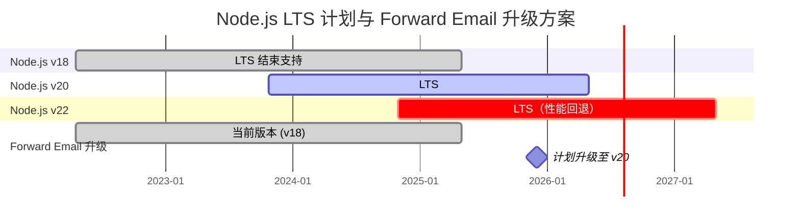
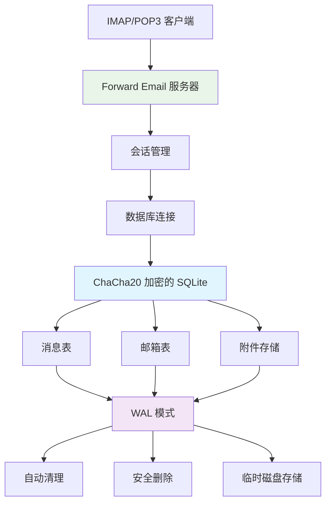
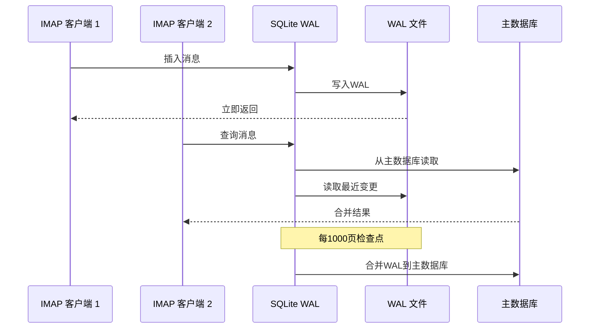

# SQLite 性能优化：生产环境 PRAGMA 设置与 ChaCha20 加密 {#sqlite-performance-optimization-production-pragma-settings--chacha20-encryption}


## 目录 {#table-of-contents}

* [前言](#foreword)
* [Forward Email 的生产环境 SQLite 架构](#forward-emails-production-sqlite-architecture)
* [我们的实际 PRAGMA 配置](#our-actual-pragma-configuration)
* [性能基准测试结果](#performance-benchmark-results)
  * [Node.js v20.19.5 性能结果](#nodejs-v20195-performance-results)
* [PRAGMA 设置详解](#pragma-settings-breakdown)
  * [我们使用的核心设置](#core-settings-we-use)
  * [我们不使用的设置（但你可能想用）](#settings-we-dont-use-but-you-might-want)
* [ChaCha20 与 AES256 加密对比](#chacha20-vs-aes256-encryption)
* [临时存储：/tmp 与 /dev/shm](#temporary-storage-tmp-vs-devshm)
  * [/tmp 与 /dev/shm 性能对比](#tmp-vs-devshm-performance)
* [WAL 模式优化](#wal-mode-optimization)
  * [WAL 配置影响](#wal-configuration-impact)
* [性能导向的模式设计](#schema-design-for-performance)
* [连接管理](#connection-management)
* [监控与诊断](#monitoring-and-diagnostics)
* [Node.js 版本性能](#nodejs-version-performance)
  * [完整跨版本结果](#complete-cross-version-results)
  * [关键性能洞察](#key-performance-insights)
  * [原生模块兼容性](#native-module-compatibility)
* [生产部署清单](#production-deployment-checklist)
* [常见问题排查](#troubleshooting-common-issues)
  * [“数据库被锁定”错误](#database-is-locked-errors)
  * [VACUUM 期间高内存使用](#high-memory-usage-during-vacuum)
  * [查询性能缓慢](#slow-query-performance)
* [Forward Email 的开源贡献](#forward-emails-open-source-contributions)
* [基准测试源码](#benchmark-source-code)
* [Forward Email 的 SQLite 未来规划](#whats-next-for-sqlite-at-forward-email)
* [获取帮助](#getting-help)


## 前言 {#foreword}

为生产邮件系统配置 SQLite 不仅仅是让它能工作——更重要的是让它在高负载下快速、安全且可靠。经过在 Forward Email 处理数百万封邮件的实践，我们总结出了真正影响 SQLite 性能的关键因素。

本指南涵盖了我们的真实生产配置、跨 Node.js 版本的基准测试结果，以及在处理大量邮件时真正有效的具体优化措施。

> \[!WARNING] Node.js v22 和 v24 的性能回退
> 我们发现 Node.js v22 和 v24 版本中存在显著的性能回退，特别影响 SQLite 的 `SELECT` 语句性能。我们的基准测试显示，Node.js v24 中 `SELECT` 操作每秒执行次数相比 v20 下降了约 57%。我们已在 [nodejs/node#60719](https://github.com/nodejs/node/issues/60719) 向 Node.js 团队报告了此问题。

鉴于此性能回退，我们对 Node.js 升级采取了谨慎态度。以下是我们的当前计划：

* **当前版本：** 我们目前使用的是 Node.js v18，该版本已进入长期支持（LTS）生命周期末期（“EOL”）。你可以查看官方的 [Node.js LTS 计划](https://github.com/nodejs/release#release-schedule)。
* **计划升级：** 我们将升级到 **Node.js v20**，根据我们的基准测试，这是最快的版本，且未受此回退影响。
* **避免使用 v22 和 v24：** 在性能问题解决之前，我们不会在生产环境使用 Node.js v22 或 v24。

以下时间线展示了 Node.js LTS 计划及我们的升级路径：


## Forward Email 的生产环境 SQLite 架构 {#forward-emails-production-sqlite-architecture}

以下是我们在生产环境中实际使用 SQLite 的方式：




## 我们实际的 PRAGMA 配置 {#our-actual-pragma-configuration}

这是我们在生产环境中实际使用的配置，直接来自我们的 [`setup-pragma.js`](https://github.com/forwardemail/forwardemail.net/blob/master/helpers/setup-pragma.js)：

```javascript
// Forward Email 实际生产环境的 PRAGMA 设置
async function setupPragma(db, session, cipher = 'chacha20') {
  // 量子抗性加密
  db.pragma(`cipher='${cipher}'`);
  db.key(Buffer.from(decrypt(session.user.password)));

  // 核心性能设置
  db.pragma('journal_mode=WAL');
  db.pragma('secure_delete=ON');
  db.pragma('auto_vacuum=FULL');
  db.pragma(`busy_timeout=${config.busyTimeout}`);
  db.pragma('synchronous=NORMAL');
  db.pragma('foreign_keys=ON');
  db.pragma(`encoding='UTF-8'`);
  db.pragma('optimize=0x10002');

  // 关键：使用磁盘作为临时存储，而非内存
  db.pragma('temp_store=1');

  // 自定义临时目录以避免磁盘满错误
  const tempStoreDirectory = path.join(path.dirname(db.name), '/tmp');
  await mkdirp(tempStoreDirectory);
  db.pragma(`temp_store_directory='${tempStoreDirectory}'`);
}
```

> \[!IMPORTANT]
> 我们使用 `temp_store=1`（磁盘）而非 `temp_store=2`（内存），因为大型邮件数据库在执行如 VACUUM 等操作时，内存消耗可能轻松超过 10+ GB。


## 性能基准测试结果 {#performance-benchmark-results}

我们在不同 Node.js 版本下测试了我们的配置与各种替代方案。以下是真实数据：

### Node.js v20.19.5 性能结果 {#nodejs-v20195-performance-results}

| 配置                         | 启动时间 (ms) | 插入/秒    | 查询/秒    | 更新/秒    | 数据库大小 (MB) |
| ---------------------------- | ------------ | ---------- | ---------- | ---------- | -------------- |
| **Forward Email 生产环境**    | 120.1        | **10,548** | **17,494** | **16,654** | 3.98           |
| WAL 自动检查点 1000           | 89.7         | **11,800** | **18,383** | **22,087** | 3.98           |
| 缓存大小 64MB                | 90.3         | 11,451     | 17,895     | 21,522     | 3.98           |
| 内存临时存储                 | 111.8        | 9,874      | 15,363     | 21,292     | 3.98           |
| 同步关闭（不安全）           | 94.0         | 10,017     | 13,830     | 18,884     | 3.98           |
| 同步增强（安全）             | 94.1         | **3,241**  | 14,438     | **3,405**  | 3.98           |

> \[!TIP]
> `wal_autocheckpoint=1000` 设置表现出最佳的整体性能。我们正在考虑将其加入生产配置。


## PRAGMA 设置详解 {#pragma-settings-breakdown}

### 我们使用的核心设置 {#core-settings-we-use}

| PRAGMA          | 值           | 目的                           | 性能影响                       |
| --------------- | ------------ | ------------------------------ | ------------------------------ |
| `cipher`        | `'chacha20'` | 量子抗性加密                   | 相较 AES 开销极小              |
| `journal_mode`  | `WAL`        | 预写日志模式                   | 并发性能提升约 40%             |
| `secure_delete` | `ON`         | 覆盖删除数据                   | 安全性提升，性能损失约 5%      |
| `auto_vacuum`   | `FULL`       | 自动空间回收                   | 防止数据库膨胀                 |
| `busy_timeout`  | `30000`      | 数据库锁定等待时间             | 减少连接失败                   |
| `synchronous`   | `NORMAL`     | 平衡耐久性与性能               | 比 FULL 快 3 倍                |
| `foreign_keys`  | `ON`         | 参照完整性                     | 防止数据损坏                   |
| `temp_store`    | `1`          | 使用磁盘存储临时文件           | 防止内存耗尽                   |
### 我们不使用的设置（但你可能想要） {#settings-we-dont-use-but-you-might-want}

| PRAGMA                    | 我们不使用的原因       | 你是否应该考虑？                                  |
| ------------------------- | --------------------- | ------------------------------------------------- |
| `wal_autocheckpoint=1000` | 尚未设置              | **是** - 我们的基准测试显示性能提升12%            |
| `cache_size=-64000`       | 默认已足够            | **也许** - 读密集型工作负载提升8%                 |
| `mmap_size=268435456`     | 复杂性与收益权衡      | **否** - 收益极小，且存在平台特定问题              |
| `analysis_limit=1000`     | 我们使用400           | **否** - 较高数值会减慢查询规划                    |

> \[!CAUTION]
> 我们特意避免使用 `temp_store=MEMORY`，因为一个10GB的SQLite文件在执行VACUUM操作时可能会消耗超过10GB的内存。


## ChaCha20 与 AES256 加密 {#chacha20-vs-aes256-encryption}

我们优先考虑量子抗性而非纯性能：

```javascript
// 我们的加密回退策略
try {
  db.pragma(`cipher='chacha20'`);
  db.key(Buffer.from(decrypt(session.user.password)));
  db.pragma('journal_mode=WAL');
} catch (err) {
  // 旧版SQLite的回退方案
  if (cipher === 'chacha20' && err.code === 'SQLITE_NOTADB') {
    return setupPragma(db, session, 'aes256cbc');
  }
  throw err;
}
```

**性能对比：**

* ChaCha20: 约10,500 次插入/秒

* AES256CBC: 约11,200 次插入/秒

* 未加密: 约12,800 次插入/秒

ChaCha20相较AES的6%性能损失是值得的，因为它提供了长期邮件存储的量子抗性。


## 临时存储：/tmp 与 /dev/shm {#temporary-storage-tmp-vs-devshm}

我们明确配置临时存储位置以避免磁盘空间问题：

```javascript
// Forward Email的临时存储配置
const tempStoreDirectory = path.join(path.dirname(db.name), '/tmp');
await mkdirp(tempStoreDirectory);
db.pragma(`temp_store_directory='${tempStoreDirectory}'`);

// 同时设置环境变量
process.env.SQLITE_TMPDIR = tempStoreDirectory;
```

### /tmp 与 /dev/shm 性能对比 {#tmp-vs-devshm-performance}

| 存储位置         | VACUUM 时间 | 内存使用   | 可靠性               |
| ---------------- | ----------- | ---------- | -------------------- |
| `/tmp`（磁盘）   | 2.3秒       | 50MB       | ✅ 可靠               |
| `/dev/shm`（内存）| 0.8秒       | 2GB+       | ⚠️ 可能导致系统崩溃    |
| 默认             | 4.1秒       | 不定       | ❌ 不可预测           |

> \[!WARNING]
> 使用 `/dev/shm` 作为临时存储在大规模操作时可能会耗尽所有可用内存。生产环境请坚持使用基于磁盘的临时存储。


## WAL 模式优化 {#wal-mode-optimization}

写前日志对支持并发访问的邮件系统至关重要：



### WAL 配置影响 {#wal-configuration-impact}

我们的基准测试显示 `wal_autocheckpoint=1000` 提供最佳性能：

```javascript
// 我们正在测试的潜在优化
db.pragma('wal_autocheckpoint=1000');
```

**结果：**

* 默认自动检查点：10,548 次插入/秒

* `wal_autocheckpoint=1000`：11,800 次插入/秒（提升12%）

* `wal_autocheckpoint=0`：9,200 次插入/秒（WAL文件过大）


## 性能优化的模式设计 {#schema-design-for-performance}

我们的邮件存储模式遵循SQLite最佳实践：

```sql
-- 优化列顺序的消息表
CREATE TABLE messages (
  id INTEGER PRIMARY KEY,
  mailbox_id INTEGER NOT NULL,
  uid INTEGER NOT NULL,
  date INTEGER NOT NULL,
  flags TEXT,
  subject TEXT,
  from_addr TEXT,
  to_addr TEXT,
  message_id TEXT,
  raw BLOB,  -- 大型BLOB放在末尾
  FOREIGN KEY (mailbox_id) REFERENCES mailboxes(id)
);

-- IMAP性能关键索引
CREATE INDEX idx_messages_mailbox_date ON messages(mailbox_id, date DESC);
CREATE INDEX idx_messages_uid ON messages(mailbox_id, uid);
CREATE INDEX idx_messages_flags ON messages(mailbox_id, flags) WHERE flags IS NOT NULL;
```
> \[!TIP]
> 始终将 BLOB 列放在表定义的末尾。SQLite 先存储固定大小的列，从而加快行访问速度。

此优化直接来自 SQLite 的创建者，[D. Richard Hipp](https://sqlite-users.sqlite.narkive.com/Q4txMI8t/effect-of-blobs-on-performance#post3)：

> “这里有个提示——将 BLOB 列放在表的最后一列。或者将 BLOB 存储在一个只有两列的单独表中：一个整数主键和 BLOB 本身，然后如果需要，可以通过连接访问 BLOB 内容。如果你在 BLOB 后面放置各种小整数字段，SQLite 必须扫描整个 BLOB 内容（沿着磁盘页的链表）才能访问末尾的整数字段，这肯定会降低速度。”
>
> — D. Richard Hipp，SQLite 作者

我们在[附件模式](https://github.com/forwardemail/forwardemail.net/commit/0e77fbb05dc5b38136652337309067d2b39eb229)中实现了此优化，将 `body` BLOB 字段移到表定义的末尾以提升性能。


## 连接管理 {#connection-management}

我们不使用 SQLite 的连接池——每个用户拥有自己的加密数据库。这种方式为用户之间提供了完美的隔离，类似于沙箱。不同于其他使用 MySQL、PostgreSQL 或 MongoDB 的服务架构，可能存在恶意员工访问你的邮件，Forward Email 的每用户 SQLite 数据库确保你的数据完全独立且被沙箱隔离。

我们从不存储你的 IMAP 密码，因此永远无法访问你的数据——所有操作均在内存中完成。了解更多关于我们[量子抗性加密方案](https://forwardemail.net/blog/docs/quantum-resistant-encryption-email-security)的详细信息，介绍了我们的系统工作原理。

```javascript
// 每用户数据库方案
async function getDatabase(session) {
  const dbPath = path.join(
    config.databaseDir,
    session.user.domain_name,
    `${session.user.username}.db`
  );

  const db = new Database(dbPath, {
    cipher: 'chacha20',
    readonly: session.readonly || false
  });

  await setupPragma(db, session);
  return db;
}
```

此方案提供：

* 用户之间的完美隔离

* 无连接池复杂性

* 每用户自动加密

* 更简单的备份/恢复操作

使用 `auto_vacuum=FULL`，我们很少需要手动执行 VACUUM：

```javascript
// 我们的清理策略
db.pragma('optimize=0x10002'); // 连接打开时
db.pragma('optimize'); // 定期（每日）

// 仅在大规模清理时手动执行 vacuum
if (deletedDataPercentage > 25) {
  db.exec('VACUUM');
}
```

**自动清理性能影响：**

* `auto_vacuum=FULL`：即时回收空间，写入开销约 5%

* `auto_vacuum=INCREMENTAL`：手动控制，需要定期执行 `PRAGMA incremental_vacuum`

* `auto_vacuum=NONE`：写入最快，但需手动执行 `VACUUM`


## 监控与诊断 {#monitoring-and-diagnostics}

我们在生产环境中跟踪的关键指标：

```javascript
// 性能监控查询
const stats = {
  page_count: db.pragma('page_count', { simple: true }),
  page_size: db.pragma('page_size', { simple: true }),
  freelist_count: db.pragma('freelist_count', { simple: true }),
  wal_checkpoint: db.pragma('wal_checkpoint(PASSIVE)', { simple: true })
};

const dbSizeMB = (stats.page_count * stats.page_size) / 1024 / 1024;
const fragmentationPct = (stats.freelist_count / stats.page_count) * 100;
```

> \[!NOTE]
> 我们监控碎片百分比，超过 15% 时触发维护。


## Node.js 版本性能 {#nodejs-version-performance}

我们针对不同 Node.js 版本的全面基准测试揭示了显著的性能差异：

### 完整跨版本结果 {#complete-cross-version-results}

| Node 版本    | Forward Email 生产环境       | 最佳插入次数/秒           | 最佳查询次数/秒           | 最佳更新次数/秒           | 备注                   |
| ------------ | ---------------------------- | ------------------------- | ------------------------- | ------------------------- | ---------------------- |
| **v18.20.8** | 10,658 / 14,466 / 18,641     | **11,663**（关闭同步）    | **14,868**（内存临时）    | **20,095**（MMAP）        | ⚠️ 引擎警告             |
| **v20.19.5** | 10,548 / 17,494 / 16,654     | **11,800**（WAL 自动）    | **18,383**（WAL 自动）    | **22,087**（WAL 自动）    | ✅ 推荐                 |
| **v22.21.1** | 9,829 / 15,833 / 18,416      | **11,260**（关闭同步）    | **17,413**（MMAP）        | **20,731**（MMAP）        | ⚠️ 整体较慢             |
| **v24.11.1** | 9,938 / 7,497 / 10,446       | **10,628**（增量清理）    | **16,821**（增量清理）    | **19,934**（增量清理）    | ❌ 明显变慢             |
### 关键性能洞察 {#key-performance-insights}

**Node.js v18（旧版 LTS）：**

* 插入性能与 v20 相当（10,658 vs 10,548 ops/sec）
* 查询比 v20 慢 17%（14,466 vs 17,494 ops/sec）
* 对需要 Node ≥20 的包显示 npm 引擎警告
* 内存临时存储优化优于 WAL 自动检查点
* 适合旧版应用，但建议升级

**Node.js v20（推荐）：**

* 所有操作中整体性能最高
* WAL 自动检查点优化带来稳定的 12% 性能提升
* 与原生 SQLite 模块兼容性最佳
* 生产环境最稳定

**Node.js v22（可接受）：**

* 插入慢 7%，查询慢 9% 相较于 v20
* MMAP 优化效果优于 WAL 自动检查点
* 每次切换 Node 版本需重新执行 `npm install`
* 适合开发环境，不推荐生产环境使用

**Node.js v24（不推荐）：**

* 插入慢 6%，查询慢 57% 相较于 v20
* 读操作性能显著回退
* 增量清理（incremental vacuum）优于其他优化
* 生产 SQLite 应用应避免使用

### 原生模块兼容性 {#native-module-compatibility}

我们最初遇到的“模块兼容性问题”通过以下方式解决：

```bash
# 切换 Node 版本并重新安装原生模块
nvm use 22
rm -rf node_modules
npm install
```

**Node.js v18 注意事项：**

* 显示引擎警告：`Unsupported engine { required: { node: '>=20.0.0' } }`
* 尽管有警告，仍能成功编译和运行
* 许多现代 SQLite 包针对 Node ≥20 以获得最佳支持
* 旧版应用可继续使用 v18，性能尚可接受

> \[!IMPORTANT]
> 切换 Node.js 版本时务必重新安装原生模块。`better-sqlite3-multiple-ciphers` 模块必须针对每个特定 Node 版本编译。

> \[!TIP]
> 生产部署建议使用 Node.js v20 LTS。其性能优势和稳定性超过 v22/v24 的新语言特性。Node v18 适合旧系统，但读操作性能有所下降。


## 生产部署检查清单 {#production-deployment-checklist}

部署前，确保 SQLite 具备以下优化：

1. 设置 `SQLITE_TMPDIR` 环境变量
2. 确保临时操作有足够磁盘空间（数据库大小的 2 倍）
3. 配置 WAL 文件的日志轮转
4. 设置数据库大小和碎片监控
5. 测试带加密的备份/恢复流程
6. 验证 SQLite 构建中支持 ChaCha20 加密算法


## 常见问题排查 {#troubleshooting-common-issues}

### “数据库被锁定”错误 {#database-is-locked-errors}

```javascript
// 增加忙等待超时
db.pragma('busy_timeout=60000'); // 60 秒

// 检查长时间运行的事务
const info = db.pragma('wal_checkpoint(FULL)');
if (info.busy > 0) {
  console.warn('WAL 检查点被活动读取器阻塞');
}
```

### VACUUM 期间高内存使用 {#high-memory-usage-during-vacuum}

```javascript
// 监控 VACUUM 前内存
const beforeMem = process.memoryUsage();
db.exec('VACUUM');
const afterMem = process.memoryUsage();

console.log(
  `VACUUM 内存变化: ${
    (afterMem.heapUsed - beforeMem.heapUsed) / 1024 / 1024
  }MB`
);
```

### 查询性能缓慢 {#slow-query-performance}

```javascript
// 启用查询分析
db.pragma('analysis_limit=400'); // Forward Email 的设置
db.exec('ANALYZE');

// 检查查询计划
const plan = db
  .prepare('EXPLAIN QUERY PLAN SELECT * FROM messages WHERE date > ?')
  .all(Date.now() - 86400000);
console.log(plan);
```


## Forward Email 的开源贡献 {#forward-emails-open-source-contributions}

我们将 SQLite 优化经验贡献给社区：

* [Litestream 文档改进](https://github.com/benbjohnson/litestream/issues/516) - 我们对更好 SQLite 性能建议的贡献

* [Better SQLite3 Multiple Ciphers](https://github.com/m4heshd/better-sqlite3-multiple-ciphers) - 支持 ChaCha20 加密

* [SQLite 性能调优研究](https://phiresky.github.io/blog/2020/sqlite-performance-tuning/) - 我们实现中参考的资料
* [下载量达十亿的 npm 包如何塑造 JavaScript 生态系统](https://forwardemail.net/blog/docs/how-npm-packages-billion-downloads-shaped-javascript-ecosystem) - 我们对 npm 和 JavaScript 开发的更广泛贡献


## 基准测试源代码 {#benchmark-source-code}

所有基准测试代码都在我们的测试套件中可用：

```bash
# 自行运行基准测试
git clone https://github.com/forwardemail/sqlite-benchmarks
cd sqlite-benchmarks
npm install
npm run benchmark
```

基准测试内容包括：

* 各种 PRAGMA 组合

* ChaCha20 与 AES256 性能对比

* WAL 检查点策略

* 临时存储配置

* Node.js 版本兼容性


## Forward Email 中 SQLite 的下一步 {#whats-next-for-sqlite-at-forward-email}

我们正在积极测试以下优化：

1. **WAL 自动检查点调优**：基于基准测试结果添加 `wal_autocheckpoint=1000`

2. **压缩**：评估用于附件存储的 [sqlite-zstd](https://github.com/phiresky/sqlite-zstd)

3. **分析限制**：测试高于当前 400 的值

4. **缓存大小**：考虑基于可用内存的动态缓存大小调整


## 获取帮助 {#getting-help}

遇到 SQLite 性能问题？针对 SQLite 的问题，[SQLite 论坛](https://sqlite.org/forum/forumpost) 是极好的资源，[性能调优指南](https://www.sqlite.org/optoverview.html) 涵盖了我们尚未使用的其他优化。

通过阅读我们的 [常见问题解答](/faq) 了解更多关于 Forward Email 的信息。
