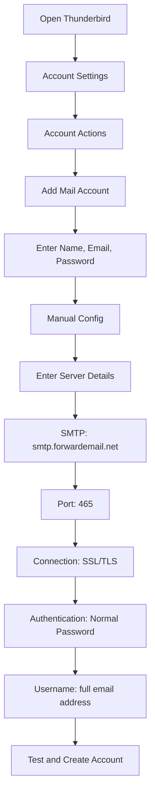

# أمثلة تكامل SMTP {#smtp-integration-examples}

## جدول المحتويات {#table-of-contents}

* [مقدمة](#foreword)
* [كيفية عمل معالجة SMTP في Forward Email](#how-forward-emails-smtp-processing-works)
  * [نظام قائمة انتظار البريد الإلكتروني وإعادة المحاولة](#email-queue-and-retry-system)
  * [مُثبَّتة ضد الأخطاء لضمان الموثوقية](#dummy-proofed-for-reliability)
* [تكامل Node.js](#nodejs-integration)
  * [استخدام Nodemailer](#using-nodemailer)
  * [استخدام Express.js](#using-expressjs)
* [تكامل بايثون](#python-integration)
  * [استخدام smtplib](#using-smtplib)
  * [استخدام جانجو](#using-django)
* [تكامل PHP](#php-integration)
  * [استخدام PHPMailer](#using-phpmailer)
  * [استخدام لارافيل](#using-laravel)
* [تكامل روبي](#ruby-integration)
  * [استخدام Ruby Mail Gem](#using-ruby-mail-gem)
* [تكامل جافا](#java-integration)
  * [استخدام واجهة برمجة تطبيقات Java Mail](#using-javamail-api)
* [تكوين عميل البريد الإلكتروني](#email-client-configuration)
  * [طائر الرعد](#thunderbird)
  * [بريد آبل](#apple-mail)
  * [Gmail (إرسال البريد باسم)](#gmail-send-mail-as)
* [استكشاف الأخطاء وإصلاحها](#troubleshooting)
  * [المشاكل والحلول الشائعة](#common-issues-and-solutions)
  * [الحصول على المساعدة](#getting-help)
* [موارد إضافية](#additional-resources)
* [خاتمة](#conclusion)

## مقدمة {#foreword}

يقدم هذا الدليل أمثلة مفصلة حول كيفية التكامل مع خدمة SMTP من Forward Email باستخدام لغات برمجة وأطر عمل وبرامج بريد إلكتروني متنوعة. صُممت خدمة SMTP لتكون موثوقة وآمنة وسهلة التكامل مع تطبيقاتك الحالية.

## كيفية عمل معالجة SMTP للبريد الإلكتروني المعاد توجيهه {#how-forward-emails-smtp-processing-works}

قبل الخوض في أمثلة التكامل، من المهم فهم كيفية معالجة خدمة SMTP الخاصة بنا لرسائل البريد الإلكتروني:

### نظام قائمة انتظار البريد الإلكتروني وإعادة المحاولة {#email-queue-and-retry-system}

عند إرسال بريد إلكتروني عبر SMTP إلى خوادمنا:

١. **المعالجة الأولية**: يتم التحقق من صحة البريد الإلكتروني، وفحصه بحثًا عن البرامج الضارة، وفحصه باستخدام مرشحات البريد العشوائي.
٢. **الترتيب الذكي**: تُوضع رسائل البريد الإلكتروني في نظام انتظار متطور للتسليم.
٣. **آلية إعادة المحاولة الذكية**: في حال فشل التسليم مؤقتًا، سيقوم نظامنا بما يلي:
* تحليل استجابة الخطأ باستخدام دالة `getBounceInfo`
* تحديد ما إذا كانت المشكلة مؤقتة (مثل "حاول مرة أخرى لاحقًا"، "مؤجلة مؤقتًا") أو دائمة (مثل "المستخدم غير معروف")
* في حال وجود مشاكل مؤقتة، يُرجى تحديد البريد الإلكتروني لإعادة المحاولة.
* في حال وجود مشاكل دائمة، يُرجى إنشاء إشعار ارتداد.
٤. **فترة إعادة المحاولة لمدة ٥ أيام**: نعيد محاولة التسليم لمدة تصل إلى ٥ أيام (على غرار معايير الصناعة مثل Postfix)، مما يمنح المشاكل المؤقتة وقتًا لحلها.
٥. **إشعارات حالة التسليم**: يتلقى المرسلون إشعارات بحالة رسائلهم الإلكترونية (تم التسليم، أو التأخير، أو الارتداد).

بعد نجاح التسليم، يُحذف محتوى بريد SMTP الصادر بعد فترة احتفاظ قابلة للتخصيص (30 يومًا افتراضيًا) حفاظًا على الأمان والخصوصية. تبقى رسالة مؤقتة فقط تُشير إلى نجاح التسليم.

### مُثبَّتة ضد الخداع لضمان الموثوقية {#dummy-proofed-for-reliability}

تم تصميم نظامنا للتعامل مع مختلف الحالات الحدية:

* في حال اكتشاف قائمة حظر، ستتم إعادة محاولة إرسال البريد الإلكتروني تلقائيًا.
* في حال حدوث مشاكل في الشبكة، ستتم إعادة محاولة التسليم.
* إذا كان صندوق بريد المستلم ممتلئًا، سيعيد النظام المحاولة لاحقًا.
* إذا كان خادم الاستقبال غير متاح مؤقتًا، فسنواصل المحاولة.

يؤدي هذا النهج إلى تحسين معدلات التسليم بشكل كبير مع الحفاظ على الخصوصية والأمان.

## تكامل Node.js {#nodejs-integration}

### باستخدام Nodemailer {#using-nodemailer}

[مُرسِل البريد العقدي](https://nodemailer.com/) هي وحدة شائعة لإرسال رسائل البريد الإلكتروني من تطبيقات Node.js.

```javascript
const nodemailer = require('nodemailer');

// Create a transporter object
const transporter = nodemailer.createTransport({
  host: 'smtp.forwardemail.net',
  port: 465,
  secure: true, // Use TLS
  auth: {
    user: 'your-username@your-domain.com',
    pass: 'your-password'
  }
});

// Send mail with defined transport object
async function sendEmail() {
  try {
    const info = await transporter.sendMail({
      from: '"Your Name" <your-username@your-domain.com>',
      to: 'recipient@example.com',
      subject: 'Hello from Forward Email',
      text: 'Hello world! This is a test email sent using Nodemailer and Forward Email SMTP.',
      html: '<b>Hello world!</b> This is a test email sent using Nodemailer and Forward Email SMTP.'
    });

    console.log('Message sent: %s', info.messageId);
  } catch (error) {
    console.error('Error sending email:', error);
  }
}

sendEmail();
```

### باستخدام Express.js {#using-expressjs}

فيما يلي كيفية دمج Forward Email SMTP مع تطبيق Express.js:

```javascript
const express = require('express');
const nodemailer = require('nodemailer');
const app = express();
const port = 3000;

app.use(express.json());

// Configure email transporter
const transporter = nodemailer.createTransport({
  host: 'smtp.forwardemail.net',
  port: 465,
  secure: true,
  auth: {
    user: 'your-username@your-domain.com',
    pass: 'your-password'
  }
});

// API endpoint for sending emails
app.post('/send-email', async (req, res) => {
  const { to, subject, text, html } = req.body;

  try {
    const info = await transporter.sendMail({
      from: '"Your App" <your-username@your-domain.com>',
      to,
      subject,
      text,
      html
    });

    res.status(200).json({
      success: true,
      messageId: info.messageId
    });
  } catch (error) {
    console.error('Error sending email:', error);
    res.status(500).json({
      success: false,
      error: error.message
    });
  }
});

app.listen(port, () => {
  console.log(`Server running at http://localhost:${port}`);
});
```

## تكامل بايثون {#python-integration}

### باستخدام smtplib {#using-smtplib}

```python
import smtplib
from email.mime.text import MIMEText
from email.mime.multipart import MIMEMultipart

# Email configuration
sender_email = "your-username@your-domain.com"
receiver_email = "recipient@example.com"
password = "your-password"

# Create message
message = MIMEMultipart("alternative")
message["Subject"] = "Hello from Forward Email"
message["From"] = sender_email
message["To"] = receiver_email

# Create the plain-text and HTML version of your message
text = "Hello world! This is a test email sent using Python and Forward Email SMTP."
html = "<html><body><b>Hello world!</b> This is a test email sent using Python and Forward Email SMTP.</body></html>"

# Turn these into plain/html MIMEText objects
part1 = MIMEText(text, "plain")
part2 = MIMEText(html, "html")

# Add HTML/plain-text parts to MIMEMultipart message
message.attach(part1)
message.attach(part2)

# Send email
try:
    server = smtplib.SMTP_SSL("smtp.forwardemail.net", 465)
    server.login(sender_email, password)
    server.sendmail(sender_email, receiver_email, message.as_string())
    server.quit()
    print("Email sent successfully!")
except Exception as e:
    print(f"Error sending email: {e}")
```

### باستخدام Django {#using-django}

بالنسبة لتطبيقات Django، أضف ما يلي إلى `settings.py`:

```python
# Email settings
EMAIL_BACKEND = 'django.core.mail.backends.smtp.EmailBackend'
EMAIL_HOST = 'smtp.forwardemail.net'
EMAIL_PORT = 465
EMAIL_USE_SSL = True
EMAIL_HOST_USER = 'your-username@your-domain.com'
EMAIL_HOST_PASSWORD = 'your-password'
DEFAULT_FROM_EMAIL = 'your-username@your-domain.com'
```

ثم أرسل رسائل البريد الإلكتروني في وجهات نظرك:

```python
from django.core.mail import send_mail

def send_email_view(request):
    send_mail(
        'Subject here',
        'Here is the message.',
        'from@your-domain.com',
        ['to@example.com'],
        fail_silently=False,
        html_message='<b>Here is the HTML message.</b>'
    )
    return HttpResponse('Email sent!')
```

## تكامل PHP مع {#php-integration}

### باستخدام PHPMailer {#using-phpmailer}

```php
<?php
use PHPMailer\PHPMailer\PHPMailer;
use PHPMailer\PHPMailer\Exception;

require 'vendor/autoload.php';

$mail = new PHPMailer(true);

try {
    // Server settings
    $mail->isSMTP();
    $mail->Host       = 'smtp.forwardemail.net';
    $mail->SMTPAuth   = true;
    $mail->Username   = 'your-username@your-domain.com';
    $mail->Password   = 'your-password';
    $mail->SMTPSecure = PHPMailer::ENCRYPTION_SMTPS;
    $mail->Port       = 465;

    // Recipients
    $mail->setFrom('your-username@your-domain.com', 'Your Name');
    $mail->addAddress('recipient@example.com', 'Recipient Name');
    $mail->addReplyTo('your-username@your-domain.com', 'Your Name');

    // Content
    $mail->isHTML(true);
    $mail->Subject = 'Hello from Forward Email';
    $mail->Body    = '<b>Hello world!</b> This is a test email sent using PHPMailer and Forward Email SMTP.';
    $mail->AltBody = 'Hello world! This is a test email sent using PHPMailer and Forward Email SMTP.';

    $mail->send();
    echo 'Message has been sent';
} catch (Exception $e) {
    echo "Message could not be sent. Mailer Error: {$mail->ErrorInfo}";
}
```

### باستخدام Laravel {#using-laravel}

بالنسبة لتطبيقات Laravel، قم بتحديث ملف `.env` الخاص بك:

```sh
MAIL_MAILER=smtp
MAIL_HOST=smtp.forwardemail.net
MAIL_PORT=465
MAIL_USERNAME=your-username@your-domain.com
MAIL_PASSWORD=your-password
MAIL_ENCRYPTION=ssl
MAIL_FROM_ADDRESS=your-username@your-domain.com
MAIL_FROM_NAME="${APP_NAME}"
```

ثم أرسل رسائل البريد الإلكتروني باستخدام واجهة Mail الخاصة بـ Laravel:

```php
<?php

namespace App\Http\Controllers;

use Illuminate\Http\Request;
use Illuminate\Support\Facades\Mail;
use App\Mail\WelcomeEmail;

class EmailController extends Controller
{
    public function sendEmail()
    {
        Mail::to('recipient@example.com')->send(new WelcomeEmail());

        return 'Email sent successfully!';
    }
}
```

## تكامل روبي {#ruby-integration}

### باستخدام Ruby Mail Gem {#using-ruby-mail-gem}

```ruby
require 'mail'

Mail.defaults do
  delivery_method :smtp, {
    address: 'smtp.forwardemail.net',
    port: 465,
    domain: 'your-domain.com',
    user_name: 'your-username@your-domain.com',
    password: 'your-password',
    authentication: 'plain',
    enable_starttls_auto: true,
    ssl: true
  }
end

mail = Mail.new do
  from     'your-username@your-domain.com'
  to       'recipient@example.com'
  subject  'Hello from Forward Email'

  text_part do
    body 'Hello world! This is a test email sent using Ruby Mail and Forward Email SMTP.'
  end

  html_part do
    content_type 'text/html; charset=UTF-8'
    body '<b>Hello world!</b> This is a test email sent using Ruby Mail and Forward Email SMTP.'
  end
end

mail.deliver!
puts "Email sent successfully!"
```

## تكامل جافا {#java-integration}

### باستخدام واجهة برمجة تطبيقات JavaMail {#using-javamail-api}

```java
import java.util.Properties;
import javax.mail.*;
import javax.mail.internet.*;

public class SendEmail {
    public static void main(String[] args) {
        // Sender's email and password
        final String username = "your-username@your-domain.com";
        final String password = "your-password";

        // SMTP server properties
        Properties props = new Properties();
        props.put("mail.smtp.auth", "true");
        props.put("mail.smtp.starttls.enable", "true");
        props.put("mail.smtp.host", "smtp.forwardemail.net");
        props.put("mail.smtp.port", "465");
        props.put("mail.smtp.socketFactory.port", "465");
        props.put("mail.smtp.socketFactory.class", "javax.net.ssl.SSLSocketFactory");

        // Create session with authenticator
        Session session = Session.getInstance(props,
            new javax.mail.Authenticator() {
                protected PasswordAuthentication getPasswordAuthentication() {
                    return new PasswordAuthentication(username, password);
                }
            });

        try {
            // Create message
            Message message = new MimeMessage(session);
            message.setFrom(new InternetAddress(username));
            message.setRecipients(Message.RecipientType.TO, InternetAddress.parse("recipient@example.com"));
            message.setSubject("Hello from Forward Email");

            // Create multipart message
            Multipart multipart = new MimeMultipart("alternative");

            // Text part
            BodyPart textPart = new MimeBodyPart();
            textPart.setText("Hello world! This is a test email sent using JavaMail and Forward Email SMTP.");

            // HTML part
            BodyPart htmlPart = new MimeBodyPart();
            htmlPart.setContent("<b>Hello world!</b> This is a test email sent using JavaMail and Forward Email SMTP.", "text/html");

            // Add parts to multipart
            multipart.addBodyPart(textPart);
            multipart.addBodyPart(htmlPart);

            // Set content
            message.setContent(multipart);

            // Send message
            Transport.send(message);

            System.out.println("Email sent successfully!");

        } catch (MessagingException e) {
            throw new RuntimeException(e);
        }
    }
}
```

## تكوين عميل البريد الإلكتروني {#email-client-configuration}

حامل مكان مؤقت 0 ثندربيرد {حامل مكان مؤقت 1}



١. افتح Thunderbird وانتقل إلى إعدادات الحساب.
٢. انقر على "إجراءات الحساب" ثم اختر "إضافة حساب بريد".
٣. أدخل اسمك وعنوان بريدك الإلكتروني وكلمة مرورك.
٤. انقر على "التكوين اليدوي" وأدخل البيانات التالية:
* خادم البريد الوارد:
* IMAP: imap.forwardemail.net، المنفذ: ٩٩٣، SSL/TLS
* POP3: pop3.forwardemail.net، المنفذ: ٩٩٥، SSL/TLS
* خادم البريد الصادر (SMTP): smtp.forwardemail.net، المنفذ: ٤٦٥، SSL/TLS
* المصادقة: كلمة مرور عادية
* اسم المستخدم: عنوان بريدك الإلكتروني الكامل.
٥. انقر على "اختبار" ثم "تم".

### بريد Apple {#apple-mail}

١. افتح البريد وانتقل إلى البريد > التفضيلات > الحسابات.
٢. انقر على زر "+" لإضافة حساب جديد.
٣. حدد "حساب بريد آخر" وانقر على "متابعة".
٤. أدخل اسمك وعنوان بريدك الإلكتروني وكلمة مرورك، ثم انقر على "تسجيل الدخول".
٥. في حال فشل الإعداد التلقائي، أدخل البيانات التالية:

* خادم البريد الوارد: imap.forwardemail.net (أو pop3.forwardemail.net لـ POP3).
* خادم البريد الصادر: smtp.forwardemail.net.
* اسم المستخدم: عنوان بريدك الإلكتروني بالكامل.
* كلمة المرور: كلمة مرورك.
٦. انقر على "تسجيل الدخول" لإكمال الإعداد.

### Gmail (إرسال البريد باسم) {#gmail-send-mail-as}

١. افتح Gmail وانتقل إلى الإعدادات > الحسابات والاستيراد.
٢. ضمن "إرسال البريد باسم"، انقر على "إضافة عنوان بريد إلكتروني آخر".
٣. أدخل اسمك وعنوان بريدك الإلكتروني، ثم انقر على "الخطوة التالية".
٤. أدخل بيانات خادم SMTP التالية:

* خادم SMTP: smtp.forwardemail.net
* المنفذ: ٤٦٥
* اسم المستخدم: عنوان بريدك الإلكتروني الكامل.
* كلمة المرور: كلمة مرورك.
* اختر "اتصال آمن باستخدام SSL".
٥. انقر على "إضافة حساب" وتحقق من عنوان بريدك الإلكتروني.

استكشاف أخطاء ## وإصلاحها {#troubleshooting}

### المشكلات الشائعة والحلول {#common-issues-and-solutions}

١. **فشل المصادقة**
* تحقق من اسم المستخدم (عنوان البريد الإلكتروني الكامل) وكلمة المرور.
* تأكد من استخدام المنفذ الصحيح (٤٦٥ لـ SSL/TLS).
* تحقق مما إذا كان حسابك مُفعّلاً لوصول SMTP.

٢. **انقطاع الاتصال**
* تحقق من اتصالك بالإنترنت
* تأكد من أن إعدادات جدار الحماية لا تحظر حركة مرور SMTP
* حاول استخدام منفذ مختلف (٥٨٧ مع STARTTLS)

٣. **تم رفض الرسالة**
* تأكد من تطابق عنوان "المرسل" مع بريدك الإلكتروني المُصادق عليه.
* تحقق مما إذا كان عنوان IP الخاص بك مدرجًا في القائمة السوداء.
* تأكد من أن محتوى رسالتك لا يُفعّل مرشحات البريد العشوائي.

٤. **أخطاء TLS/SSL**
* تحديث تطبيقك/مكتبتك لدعم إصدارات TLS الحديثة
* التأكد من تحديث شهادات CA لنظامك
* استخدام TLS الصريح بدلاً من TLS الضمني

### الحصول على المساعدة {#getting-help}

إذا واجهت مشكلات غير مذكورة هنا، يرجى:

١. راجع [صفحة الأسئلة الشائعة](/faq) للأسئلة الشائعة.
٢. راجع [تدوينة حول تسليم البريد الإلكتروني](/blog/docs/best-email-forwarding-service) لمزيد من المعلومات التفصيلية.
٣. تواصل مع فريق الدعم لدينا على <support@forwardemail.net>

## موارد إضافية {#additional-resources}

* [توثيق إعادة توجيه البريد الإلكتروني](/docs)
* [حدود خادم SMTP وتكوينه](/faq#what-are-your-outbound-smtp-limits)
* [دليل أفضل ممارسات البريد الإلكتروني](/blog/docs/best-email-forwarding-service)
* [ممارسات الأمن](/security)

## الاستنتاج {#conclusion}

توفر خدمة SMTP من Forward Email طريقة موثوقة وآمنة تُراعي الخصوصية لإرسال رسائل البريد الإلكتروني من تطبيقاتك وبرامج البريد الإلكتروني. بفضل نظامنا الذكي لقوائم الانتظار، وآلية إعادة المحاولة خلال 5 أيام، وإشعارات حالة التسليم الشاملة، كن على ثقة بأن رسائلك ستصل إلى وجهتها.

للحصول على حالات استخدام أكثر تقدمًا أو تكاملات مخصصة، يرجى الاتصال بفريق الدعم الخاص بنا.