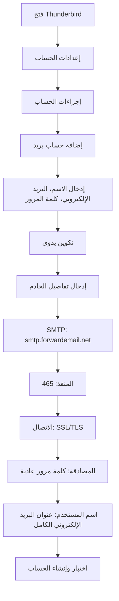

# أمثلة على تكامل SMTP {#smtp-integration-examples}


## جدول المحتويات {#table-of-contents}

* [مقدمة](#foreword)
* [كيف يعمل معالجة SMTP في Forward Email](#how-forward-emails-smtp-processing-works)
  * [نظام قائمة الانتظار وإعادة المحاولة للبريد الإلكتروني](#email-queue-and-retry-system)
  * [مصمم ليكون سهل الاستخدام وموثوق](#dummy-proofed-for-reliability)
* [تكامل Node.js](#nodejs-integration)
  * [استخدام Nodemailer](#using-nodemailer)
  * [استخدام Express.js](#using-expressjs)
* [تكامل Python](#python-integration)
  * [استخدام smtplib](#using-smtplib)
  * [استخدام Django](#using-django)
* [تكامل PHP](#php-integration)
  * [استخدام PHPMailer](#using-phpmailer)
  * [استخدام Laravel](#using-laravel)
* [تكامل Ruby](#ruby-integration)
  * [استخدام Ruby Mail Gem](#using-ruby-mail-gem)
* [تكامل Java](#java-integration)
  * [استخدام JavaMail API](#using-javamail-api)
* [تكوين عميل البريد الإلكتروني](#email-client-configuration)
  * [Thunderbird](#thunderbird)
  * [Apple Mail](#apple-mail)
  * [Gmail (إرسال البريد كـ)](#gmail-send-mail-as)
* [استكشاف الأخطاء وإصلاحها](#troubleshooting)
  * [المشاكل الشائعة والحلول](#common-issues-and-solutions)
  * [الحصول على المساعدة](#getting-help)
* [الموارد الإضافية](#additional-resources)
* [الخاتمة](#conclusion)


## مقدمة {#foreword}

يوفر هذا الدليل أمثلة مفصلة حول كيفية التكامل مع خدمة SMTP الخاصة بـ Forward Email باستخدام لغات برمجة وأُطُر عمل مختلفة وعملاء بريد إلكتروني. تم تصميم خدمة SMTP الخاصة بنا لتكون موثوقة وآمنة وسهلة التكامل مع تطبيقاتك الحالية.


## كيف يعمل معالجة SMTP في Forward Email {#how-forward-emails-smtp-processing-works}

قبل الغوص في أمثلة التكامل، من المهم فهم كيفية معالجة خدمتنا للبريد الإلكتروني عبر SMTP:

### نظام قائمة الانتظار وإعادة المحاولة للبريد الإلكتروني {#email-queue-and-retry-system}

عند إرسال بريد إلكتروني عبر SMTP إلى خوادمنا:

1. **المعالجة الأولية**: يتم التحقق من صحة البريد الإلكتروني، وفحصه من البرمجيات الخبيثة، وفحصه ضد مرشحات الرسائل المزعجة
2. **قائمة انتظار ذكية**: يتم وضع الرسائل في نظام قائمة انتظار متطور للتسليم
3. **آلية إعادة المحاولة الذكية**: إذا فشل التسليم مؤقتًا، سيقوم نظامنا بـ:
   * تحليل استجابة الخطأ باستخدام دالة `getBounceInfo` الخاصة بنا
   * تحديد ما إذا كانت المشكلة مؤقتة (مثل "حاول مرة أخرى لاحقًا"، "مؤجل مؤقتًا") أو دائمة (مثل "المستخدم غير معروف")
   * للمشاكل المؤقتة، يتم وضع البريد الإلكتروني لإعادة المحاولة
   * للمشاكل الدائمة، يتم إنشاء إشعار ارتداد
4. **فترة إعادة المحاولة لمدة 5 أيام**: نقوم بإعادة محاولة التسليم لمدة تصل إلى 5 أيام (مماثلة للمعايير الصناعية مثل Postfix)، مما يمنح الوقت لحل المشاكل المؤقتة
5. **إشعارات حالة التسليم**: يتلقى المرسلون إشعارات حول حالة رسائلهم (تم التسليم، مؤجلة، أو مرتدة)

> \[!NOTE]
> بعد التسليم الناجح، يتم حذف محتوى البريد الإلكتروني الصادر عبر SMTP بعد فترة احتفاظ قابلة للتكوين (الافتراضية 30 يومًا) لأسباب أمنية وخصوصية. يبقى فقط رسالة نائب تشير إلى نجاح التسليم.

### مصمم ليكون سهل الاستخدام وموثوق {#dummy-proofed-for-reliability}

تم تصميم نظامنا للتعامل مع حالات الحافة المختلفة:

* إذا تم اكتشاف قائمة حظر، سيتم إعادة محاولة البريد الإلكتروني تلقائيًا
* إذا حدثت مشاكل في الشبكة، سيتم إعادة محاولة التسليم
* إذا كانت علبة بريد المستلم ممتلئة، سيقوم النظام بإعادة المحاولة لاحقًا
* إذا كان خادم الاستلام غير متاح مؤقتًا، سنستمر في المحاولة

هذا النهج يحسن بشكل كبير معدلات التسليم مع الحفاظ على الخصوصية والأمان.


## تكامل Node.js {#nodejs-integration}

### استخدام Nodemailer {#using-nodemailer}

[Nodemailer](https://nodemailer.com/) هو وحدة شائعة لإرسال البريد الإلكتروني من تطبيقات Node.js.

```javascript
const nodemailer = require('nodemailer');

// Create a transporter object
const transporter = nodemailer.createTransport({
  host: 'smtp.forwardemail.net',
  port: 465,
  secure: true, // Use TLS
  auth: {
    user: 'your-username@your-domain.com',
    pass: 'your-password'
  }
});

// Send mail with defined transport object
async function sendEmail() {
  try {
    const info = await transporter.sendMail({
      from: '"Your Name" <your-username@your-domain.com>',
      to: 'recipient@example.com',
      subject: 'Hello from Forward Email',
      text: 'Hello world! This is a test email sent using Nodemailer and Forward Email SMTP.',
      html: '<b>Hello world!</b> This is a test email sent using Nodemailer and Forward Email SMTP.'
    });

    console.log('Message sent: %s', info.messageId);
  } catch (error) {
    console.error('Error sending email:', error);
  }
}

sendEmail();
```
### استخدام Express.js {#using-expressjs}

إليك كيفية دمج Forward Email SMTP مع تطبيق Express.js:

```javascript
const express = require('express');
const nodemailer = require('nodemailer');
const app = express();
const port = 3000;

app.use(express.json());

// تكوين ناقل البريد الإلكتروني
const transporter = nodemailer.createTransport({
  host: 'smtp.forwardemail.net',
  port: 465,
  secure: true,
  auth: {
    user: 'your-username@your-domain.com',
    pass: 'your-password'
  }
});

// نقطة نهاية API لإرسال الرسائل الإلكترونية
app.post('/send-email', async (req, res) => {
  const { to, subject, text, html } = req.body;

  try {
    const info = await transporter.sendMail({
      from: '"Your App" <your-username@your-domain.com>',
      to,
      subject,
      text,
      html
    });

    res.status(200).json({
      success: true,
      messageId: info.messageId
    });
  } catch (error) {
    console.error('Error sending email:', error);
    res.status(500).json({
      success: false,
      error: error.message
    });
  }
});

app.listen(port, () => {
  console.log(`Server running at http://localhost:${port}`);
});
```


## دمج بايثون {#python-integration}

### استخدام smtplib {#using-smtplib}

```python
import smtplib
from email.mime.text import MIMEText
from email.mime.multipart import MIMEMultipart

# تكوين البريد الإلكتروني
sender_email = "your-username@your-domain.com"
receiver_email = "recipient@example.com"
password = "your-password"

# إنشاء الرسالة
message = MIMEMultipart("alternative")
message["Subject"] = "مرحبًا من Forward Email"
message["From"] = sender_email
message["To"] = receiver_email

# إنشاء النسخة النصية العادية ونسخة HTML من رسالتك
text = "مرحبًا بالعالم! هذه رسالة اختبار تم إرسالها باستخدام بايثون و Forward Email SMTP."
html = "<html><body><b>مرحبًا بالعالم!</b> هذه رسالة اختبار تم إرسالها باستخدام بايثون و Forward Email SMTP.</body></html>"

# تحويل هذه إلى كائنات MIMEText نصية/HTML
part1 = MIMEText(text, "plain")
part2 = MIMEText(html, "html")

# إضافة أجزاء HTML/النص العادي إلى رسالة MIMEMultipart
message.attach(part1)
message.attach(part2)

# إرسال البريد الإلكتروني
try:
    server = smtplib.SMTP_SSL("smtp.forwardemail.net", 465)
    server.login(sender_email, password)
    server.sendmail(sender_email, receiver_email, message.as_string())
    server.quit()
    print("تم إرسال البريد الإلكتروني بنجاح!")
except Exception as e:
    print(f"خطأ في إرسال البريد الإلكتروني: {e}")
```

### استخدام Django {#using-django}

لتطبيقات Django، أضف التالي إلى ملف `settings.py` الخاص بك:

```python
# إعدادات البريد الإلكتروني
EMAIL_BACKEND = 'django.core.mail.backends.smtp.EmailBackend'
EMAIL_HOST = 'smtp.forwardemail.net'
EMAIL_PORT = 465
EMAIL_USE_SSL = True
EMAIL_HOST_USER = 'your-username@your-domain.com'
EMAIL_HOST_PASSWORD = 'your-password'
DEFAULT_FROM_EMAIL = 'your-username@your-domain.com'
```

ثم أرسل الرسائل في ملفات العرض (views) الخاصة بك:

```python
from django.core.mail import send_mail

def send_email_view(request):
    send_mail(
        'الموضوع هنا',
        'هذه هي الرسالة.',
        'from@your-domain.com',
        ['to@example.com'],
        fail_silently=False,
        html_message='<b>هذه هي رسالة HTML.</b>'
    )
    return HttpResponse('تم إرسال البريد الإلكتروني!')
```


## دمج PHP {#php-integration}

### استخدام PHPMailer {#using-phpmailer}

```php
<?php
use PHPMailer\PHPMailer\PHPMailer;
use PHPMailer\PHPMailer\Exception;

require 'vendor/autoload.php';

$mail = new PHPMailer(true);

try {
    // إعدادات الخادم
    $mail->isSMTP();
    $mail->Host       = 'smtp.forwardemail.net';
    $mail->SMTPAuth   = true;
    $mail->Username   = 'your-username@your-domain.com';
    $mail->Password   = 'your-password';
    $mail->SMTPSecure = PHPMailer::ENCRYPTION_SMTPS;
    $mail->Port       = 465;

    // المستلمون
    $mail->setFrom('your-username@your-domain.com', 'اسمك');
    $mail->addAddress('recipient@example.com', 'اسم المستلم');
    $mail->addReplyTo('your-username@your-domain.com', 'اسمك');

    // المحتوى
    $mail->isHTML(true);
    $mail->Subject = 'مرحبًا من Forward Email';
    $mail->Body    = '<b>مرحبًا بالعالم!</b> هذه رسالة اختبار تم إرسالها باستخدام PHPMailer و Forward Email SMTP.';
    $mail->AltBody = 'مرحبًا بالعالم! هذه رسالة اختبار تم إرسالها باستخدام PHPMailer و Forward Email SMTP.';

    $mail->send();
    echo 'تم إرسال الرسالة';
} catch (Exception $e) {
    echo "تعذر إرسال الرسالة. خطأ Mailer: {$mail->ErrorInfo}";
}
```
### استخدام لارافيل {#using-laravel}

لتطبيقات لارافيل، قم بتحديث ملف `.env` الخاص بك:

```sh
MAIL_MAILER=smtp
MAIL_HOST=smtp.forwardemail.net
MAIL_PORT=465
MAIL_USERNAME=your-username@your-domain.com
MAIL_PASSWORD=your-password
MAIL_ENCRYPTION=ssl
MAIL_FROM_ADDRESS=your-username@your-domain.com
MAIL_FROM_NAME="${APP_NAME}"
```

ثم أرسل الرسائل الإلكترونية باستخدام واجهة Mail في لارافيل:

```php
<?php

namespace App\Http\Controllers;

use Illuminate\Http\Request;
use Illuminate\Support\Facades\Mail;
use App\Mail\WelcomeEmail;

class EmailController extends Controller
{
    public function sendEmail()
    {
        Mail::to('recipient@example.com')->send(new WelcomeEmail());

        return 'تم إرسال البريد الإلكتروني بنجاح!';
    }
}
```


## تكامل روبي {#ruby-integration}

### استخدام مكتبة Ruby Mail {#using-ruby-mail-gem}

```ruby
require 'mail'

Mail.defaults do
  delivery_method :smtp, {
    address: 'smtp.forwardemail.net',
    port: 465,
    domain: 'your-domain.com',
    user_name: 'your-username@your-domain.com',
    password: 'your-password',
    authentication: 'plain',
    enable_starttls_auto: true,
    ssl: true
  }
end

mail = Mail.new do
  from     'your-username@your-domain.com'
  to       'recipient@example.com'
  subject  'مرحبًا من Forward Email'

  text_part do
    body 'مرحبًا بالعالم! هذه رسالة اختبار تم إرسالها باستخدام Ruby Mail و Forward Email SMTP.'
  end

  html_part do
    content_type 'text/html; charset=UTF-8'
    body '<b>مرحبًا بالعالم!</b> هذه رسالة اختبار تم إرسالها باستخدام Ruby Mail و Forward Email SMTP.'
  end
end

mail.deliver!
puts "تم إرسال البريد الإلكتروني بنجاح!"
```


## تكامل جافا {#java-integration}

### استخدام JavaMail API {#using-javamail-api}

```java
import java.util.Properties;
import javax.mail.*;
import javax.mail.internet.*;

public class SendEmail {
    public static void main(String[] args) {
        // بريد المرسل وكلمة المرور
        final String username = "your-username@your-domain.com";
        final String password = "your-password";

        // خصائص خادم SMTP
        Properties props = new Properties();
        props.put("mail.smtp.auth", "true");
        props.put("mail.smtp.starttls.enable", "true");
        props.put("mail.smtp.host", "smtp.forwardemail.net");
        props.put("mail.smtp.port", "465");
        props.put("mail.smtp.socketFactory.port", "465");
        props.put("mail.smtp.socketFactory.class", "javax.net.ssl.SSLSocketFactory");

        // إنشاء الجلسة مع المصادقة
        Session session = Session.getInstance(props,
            new javax.mail.Authenticator() {
                protected PasswordAuthentication getPasswordAuthentication() {
                    return new PasswordAuthentication(username, password);
                }
            });

        try {
            // إنشاء الرسالة
            Message message = new MimeMessage(session);
            message.setFrom(new InternetAddress(username));
            message.setRecipients(Message.RecipientType.TO, InternetAddress.parse("recipient@example.com"));
            message.setSubject("مرحبًا من Forward Email");

            // إنشاء رسالة متعددة الأجزاء
            Multipart multipart = new MimeMultipart("alternative");

            // الجزء النصي
            BodyPart textPart = new MimeBodyPart();
            textPart.setText("مرحبًا بالعالم! هذه رسالة اختبار تم إرسالها باستخدام JavaMail و Forward Email SMTP.");

            // الجزء HTML
            BodyPart htmlPart = new MimeBodyPart();
            htmlPart.setContent("<b>مرحبًا بالعالم!</b> هذه رسالة اختبار تم إرسالها باستخدام JavaMail و Forward Email SMTP.", "text/html");

            // إضافة الأجزاء إلى الرسالة متعددة الأجزاء
            multipart.addBodyPart(textPart);
            multipart.addBodyPart(htmlPart);

            // تعيين المحتوى
            message.setContent(multipart);

            // إرسال الرسالة
            Transport.send(message);

            System.out.println("تم إرسال البريد الإلكتروني بنجاح!");

        } catch (MessagingException e) {
            throw new RuntimeException(e);
        }
    }
}
```


## تكوين عميل البريد الإلكتروني {#email-client-configuration}

### Thunderbird {#thunderbird}


```mermaid
flowchart TD
    A[فتح Thunderbird] --> B[إعدادات الحساب]
    B --> C[إجراءات الحساب]
    C --> D[إضافة حساب بريد]
    D --> E[إدخال الاسم، البريد الإلكتروني، كلمة المرور]
    E --> F[تكوين يدوي]
    F --> G[إدخال تفاصيل الخادم]
    G --> H[SMTP: smtp.forwardemail.net]
    H --> I[المنفذ: 465]
    I --> J[الاتصال: SSL/TLS]
    J --> K[المصادقة: كلمة مرور عادية]
    K --> L[اسم المستخدم: عنوان البريد الإلكتروني الكامل]
    L --> M[اختبار وإنشاء الحساب]
```
1. افتح Thunderbird واذهب إلى إعدادات الحساب
2. انقر على "إجراءات الحساب" واختر "إضافة حساب بريد"
3. أدخل اسمك، عنوان بريدك الإلكتروني، وكلمة المرور
4. انقر على "الإعداد اليدوي" وأدخل التفاصيل التالية:
   * خادم البريد الوارد:
     * IMAP: imap.forwardemail.net، المنفذ: 993، SSL/TLS
     * POP3: pop3.forwardemail.net، المنفذ: 995، SSL/TLS
   * خادم البريد الصادر (SMTP): smtp.forwardemail.net، المنفذ: 465، SSL/TLS
   * المصادقة: كلمة مرور عادية
   * اسم المستخدم: عنوان بريدك الإلكتروني الكامل
5. انقر على "اختبار" ثم "تم"

### Apple Mail {#apple-mail}

1. افتح Mail واذهب إلى Mail > التفضيلات > الحسابات
2. انقر على زر "+" لإضافة حساب جديد
3. اختر "حساب بريد آخر" وانقر على "متابعة"
4. أدخل اسمك، عنوان بريدك الإلكتروني، وكلمة المرور، ثم انقر على "تسجيل الدخول"
5. عندما يفشل الإعداد التلقائي، أدخل التفاصيل التالية:
   * خادم البريد الوارد: imap.forwardemail.net (أو pop3.forwardemail.net لـ POP3)
   * خادم البريد الصادر: smtp.forwardemail.net
   * اسم المستخدم: عنوان بريدك الإلكتروني الكامل
   * كلمة المرور: كلمة مرورك
6. انقر على "تسجيل الدخول" لإكمال الإعداد

### Gmail (إرسال البريد كـ) {#gmail-send-mail-as}

1. افتح Gmail واذهب إلى الإعدادات > الحسابات والاستيراد
2. تحت "إرسال البريد كـ"، انقر على "إضافة عنوان بريد إلكتروني آخر"
3. أدخل اسمك وعنوان بريدك الإلكتروني، ثم انقر على "الخطوة التالية"
4. أدخل تفاصيل خادم SMTP التالية:
   * خادم SMTP: smtp.forwardemail.net
   * المنفذ: 465
   * اسم المستخدم: عنوان بريدك الإلكتروني الكامل
   * كلمة المرور: كلمة مرورك
   * اختر "اتصال مؤمن باستخدام SSL"
5. انقر على "إضافة حساب" وتحقق من عنوان بريدك الإلكتروني


## استكشاف الأخطاء وإصلاحها {#troubleshooting}

### المشاكل والحلول الشائعة {#common-issues-and-solutions}

1. **فشل المصادقة**
   * تحقق من اسم المستخدم (عنوان البريد الإلكتروني الكامل) وكلمة المرور
   * تأكد من استخدام المنفذ الصحيح (465 لـ SSL/TLS)
   * تحقق مما إذا كان حسابك مفعل للوصول إلى SMTP

2. **انتهاء مهلة الاتصال**
   * تحقق من اتصال الإنترنت لديك
   * تأكد من أن إعدادات جدار الحماية لا تمنع حركة مرور SMTP
   * جرب استخدام المنفذ 465 مع SSL/TLS (موصى به) أو المنفذ 587 مع STARTTLS

3. **رفض الرسالة**
   * تأكد من أن عنوان "من" يطابق بريدك الإلكتروني المصادق عليه
   * تحقق مما إذا كان عنوان IP الخاص بك مدرجًا في القائمة السوداء
   * تحقق من أن محتوى رسالتك لا يثير فلاتر البريد المزعج

4. **أخطاء TLS/SSL**
   * قم بتحديث التطبيق/المكتبة الخاصة بك لدعم إصدارات TLS الحديثة
   * تأكد من تحديث شهادات CA في نظامك
   * جرب TLS الصريح بدلاً من TLS الضمني

### الحصول على المساعدة {#getting-help}

إذا واجهت مشاكل غير مغطاة هنا، يرجى:

1. مراجعة [صفحة الأسئلة الشائعة](/faq) للأسئلة الشائعة
2. الاطلاع على [مقال المدونة حول تسليم البريد الإلكتروني](/blog/docs/best-email-forwarding-service) لمعلومات مفصلة
3. التواصل مع فريق الدعم لدينا على <support@forwardemail.net>


## موارد إضافية {#additional-resources}

* [توثيق Forward Email](/docs)
* [حدود وتكوين خادم SMTP](/faq#what-are-your-outbound-smtp-limits)
* [دليل أفضل ممارسات البريد الإلكتروني](/blog/docs/best-email-forwarding-service)
* [ممارسات الأمان](/security)


## الخاتمة {#conclusion}

يوفر خدمة SMTP من Forward Email طريقة موثوقة وآمنة وتركز على الخصوصية لإرسال الرسائل الإلكترونية من تطبيقاتك وعملاء البريد الإلكتروني لديك. مع نظام الطوابير الذكي، وآلية إعادة المحاولة لمدة 5 أيام، وإشعارات حالة التسليم الشاملة، يمكنك التأكد من وصول رسائلك إلى وجهتها.

للحالات المتقدمة أو التكاملات المخصصة، يرجى التواصل مع فريق الدعم لدينا.
