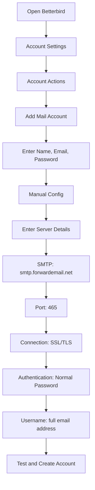

# Příklady integrace SMTP {#smtp-integration-examples}

## Obsah {#table-of-contents}

* [Předmluva](#foreword)
* [Jak funguje zpracování SMTP přesměrování e-mailů](#how-forward-emails-smtp-processing-works)
  * [Systém fronty e-mailů a opakování pokusů](#email-queue-and-retry-system)
  * [Ochranné proti zkoušce pro spolehlivost](#dummy-proofed-for-reliability)
* [Integrace Node.js](#nodejs-integration)
  * [Používání Nodemaileru](#using-nodemailer)
  * [Používání Express.js](#using-expressjs)
* [Integrace Pythonu](#python-integration)
  * [Používání smtplib](#using-smtplib)
  * [Používání Djanga](#using-django)
* [Integrace PHP](#php-integration)
  * [Používání PHPMaileru](#using-phpmailer)
  * [Používání Laravelu](#using-laravel)
* [Integrace Ruby](#ruby-integration)
  * [Používání Ruby Mail Gemu](#using-ruby-mail-gem)
* [Integrace Javy](#java-integration)
  * [Používání rozhraní Java Mail API](#using-javamail-api)
* [Konfigurace e-mailového klienta](#email-client-configuration)
  * [Betterbird](#betterbird)
  * [Apple Mail](#apple-mail)
  * [Gmail (Odesílat poštu jako)](#gmail-send-mail-as)
* [Odstraňování problémů](#troubleshooting)
  * [Běžné problémy a jejich řešení](#common-issues-and-solutions)
  * [Získání pomoci](#getting-help)
* [Další zdroje](#additional-resources)
* [Závěr](#conclusion)

## Předmluva {#foreword}

Tato příručka poskytuje podrobné příklady integrace se službou SMTP od Forward Email pomocí různých programovacích jazyků, frameworků a e-mailových klientů. Naše služba SMTP je navržena tak, aby byla spolehlivá, bezpečná a snadno se integrovala s vašimi stávajícími aplikacemi.

## Jak funguje zpracování SMTP pro přeposílání e-mailů {#how-forward-emails-smtp-processing-works}

Než se ponoříme do příkladů integrace, je důležité pochopit, jak naše služba SMTP zpracovává e-maily:

### Systém fronty e-mailů a opakování pokusů {#email-queue-and-retry-system}

Když odešlete e-mail přes SMTP na naše servery:

1. **Počáteční zpracování**: E-mail je ověřen, skenován na přítomnost malwaru a kontrolován pomocí spamových filtrů.
2. **Inteligentní řazení do fronty**: E-maily jsou zařazeny do sofistikovaného systému front pro doručení.
3. **Inteligentní mechanismus opakování**: Pokud doručení dočasně selže, náš systém:
* Analyzuje chybovou odpověď pomocí funkce `getBounceInfo`.
* Určí, zda je problém dočasný (např. „zkuste to znovu později“, „dočasně odloženo“) nebo trvalý (např. „uživatel neznámý“).
* V případě dočasných problémů označí e-mail k opakování.
* V případě trvalých problémů vygeneruje oznámení o nedoručení.
4. **5denní lhůta pro opakované pokusy**: Doručení opakujeme až 5 dní (podobně jako v oborových standardech, jako je Postfix), což dává dočasným problémům čas na vyřešení.
5. **Oznámení o stavu doručení**: Odesílatelé dostávají oznámení o stavu svých e-mailů (doručeno, zpožděno nebo nedoručeno).

> \[!NOTE]
> Po úspěšném doručení je obsah odchozích SMTP e-mailů po uplynutí nastavitelné doby uchovávání (výchozí hodnota je 30 dní) z důvodu zabezpečení a ochrany soukromí odstraněn. Zůstane pouze zástupná zpráva o úspěšném doručení.

### Ověřeno pro spolehlivost {#dummy-proofed-for-reliability}

Náš systém je navržen tak, aby zvládal různé hraniční případy:

* Pokud je detekován blokovaný seznam, pokus o doručení bude automaticky zopakován.
* Pokud dojde k problémům se sítí, pokus o doručení bude zopakován.
* Pokud je poštovní schránka příjemce plná, systém se pokusí o doručení později.
* Pokud je přijímací server dočasně nedostupný, budeme se o doručení dále pokoušet.

Tento přístup výrazně zlepšuje míru doručování a zároveň zachovává soukromí a bezpečnost.

## Integrace Node.js {#nodejs-integration}

### Používání Nodemaileru {#using-nodemailer}

[Nodemailer](https://nodemailer.com/) je oblíbený modul pro odesílání e-mailů z aplikací Node.js.

```javascript
const nodemailer = require('nodemailer');

// Create a transporter object
const transporter = nodemailer.createTransport({
  host: 'smtp.forwardemail.net',
  port: 465,
  secure: true, // Use TLS
  auth: {
    user: 'your-username@your-domain.com',
    pass: 'your-password'
  }
});

// Send mail with defined transport object
async function sendEmail() {
  try {
    const info = await transporter.sendMail({
      from: '"Your Name" <your-username@your-domain.com>',
      to: 'recipient@example.com',
      subject: 'Hello from Forward Email',
      text: 'Hello world! This is a test email sent using Nodemailer and Forward Email SMTP.',
      html: '<b>Hello world!</b> This is a test email sent using Nodemailer and Forward Email SMTP.'
    });

    console.log('Message sent: %s', info.messageId);
  } catch (error) {
    console.error('Error sending email:', error);
  }
}

sendEmail();
```

### Používání Express.js {#using-expressjs}

Zde je návod, jak integrovat SMTP pro přeposílání e-mailů s aplikací Express.js:

```javascript
const express = require('express');
const nodemailer = require('nodemailer');
const app = express();
const port = 3000;

app.use(express.json());

// Configure email transporter
const transporter = nodemailer.createTransport({
  host: 'smtp.forwardemail.net',
  port: 465,
  secure: true,
  auth: {
    user: 'your-username@your-domain.com',
    pass: 'your-password'
  }
});

// API endpoint for sending emails
app.post('/send-email', async (req, res) => {
  const { to, subject, text, html } = req.body;

  try {
    const info = await transporter.sendMail({
      from: '"Your App" <your-username@your-domain.com>',
      to,
      subject,
      text,
      html
    });

    res.status(200).json({
      success: true,
      messageId: info.messageId
    });
  } catch (error) {
    console.error('Error sending email:', error);
    res.status(500).json({
      success: false,
      error: error.message
    });
  }
});

app.listen(port, () => {
  console.log(`Server running at http://localhost:${port}`);
});
```

## Integrace Pythonu {#python-integration}

### Používání smtplib {#using-smtplib}

```python
import smtplib
from email.mime.text import MIMEText
from email.mime.multipart import MIMEMultipart

# Email configuration
sender_email = "your-username@your-domain.com"
receiver_email = "recipient@example.com"
password = "your-password"

# Create message
message = MIMEMultipart("alternative")
message["Subject"] = "Hello from Forward Email"
message["From"] = sender_email
message["To"] = receiver_email

# Create the plain-text and HTML version of your message
text = "Hello world! This is a test email sent using Python and Forward Email SMTP."
html = "<html><body><b>Hello world!</b> This is a test email sent using Python and Forward Email SMTP.</body></html>"

# Turn these into plain/html MIMEText objects
part1 = MIMEText(text, "plain")
part2 = MIMEText(html, "html")

# Add HTML/plain-text parts to MIMEMultipart message
message.attach(part1)
message.attach(part2)

# Send email
try:
    server = smtplib.SMTP_SSL("smtp.forwardemail.net", 465)
    server.login(sender_email, password)
    server.sendmail(sender_email, receiver_email, message.as_string())
    server.quit()
    print("Email sent successfully!")
except Exception as e:
    print(f"Error sending email: {e}")
```

### Používání Djanga {#using-django}

Pro aplikace Django přidejte do `settings.py` následující:

```python
# Email settings
EMAIL_BACKEND = 'django.core.mail.backends.smtp.EmailBackend'
EMAIL_HOST = 'smtp.forwardemail.net'
EMAIL_PORT = 465
EMAIL_USE_SSL = True
EMAIL_HOST_USER = 'your-username@your-domain.com'
EMAIL_HOST_PASSWORD = 'your-password'
DEFAULT_FROM_EMAIL = 'your-username@your-domain.com'
```

Pak odešlete e-maily ve svých zobrazeních:

```python
from django.core.mail import send_mail

def send_email_view(request):
    send_mail(
        'Subject here',
        'Here is the message.',
        'from@your-domain.com',
        ['to@example.com'],
        fail_silently=False,
        html_message='<b>Here is the HTML message.</b>'
    )
    return HttpResponse('Email sent!')
```

## Integrace PHP {#php-integration}

### Používání PHPMaileru {#using-phpmailer}

```php
<?php
use PHPMailer\PHPMailer\PHPMailer;
use PHPMailer\PHPMailer\Exception;

require 'vendor/autoload.php';

$mail = new PHPMailer(true);

try {
    // Server settings
    $mail->isSMTP();
    $mail->Host       = 'smtp.forwardemail.net';
    $mail->SMTPAuth   = true;
    $mail->Username   = 'your-username@your-domain.com';
    $mail->Password   = 'your-password';
    $mail->SMTPSecure = PHPMailer::ENCRYPTION_SMTPS;
    $mail->Port       = 465;

    // Recipients
    $mail->setFrom('your-username@your-domain.com', 'Your Name');
    $mail->addAddress('recipient@example.com', 'Recipient Name');
    $mail->addReplyTo('your-username@your-domain.com', 'Your Name');

    // Content
    $mail->isHTML(true);
    $mail->Subject = 'Hello from Forward Email';
    $mail->Body    = '<b>Hello world!</b> This is a test email sent using PHPMailer and Forward Email SMTP.';
    $mail->AltBody = 'Hello world! This is a test email sent using PHPMailer and Forward Email SMTP.';

    $mail->send();
    echo 'Message has been sent';
} catch (Exception $e) {
    echo "Message could not be sent. Mailer Error: {$mail->ErrorInfo}";
}
```

### Používání Laravelu {#using-laravel}

Pro aplikace Laravel aktualizujte soubor `.env`:

```sh
MAIL_MAILER=smtp
MAIL_HOST=smtp.forwardemail.net
MAIL_PORT=465
MAIL_USERNAME=your-username@your-domain.com
MAIL_PASSWORD=your-password
MAIL_ENCRYPTION=ssl
MAIL_FROM_ADDRESS=your-username@your-domain.com
MAIL_FROM_NAME="${APP_NAME}"
```

Pak odešlete e-maily pomocí fasády Mail v Laravelu:

```php
<?php

namespace App\Http\Controllers;

use Illuminate\Http\Request;
use Illuminate\Support\Facades\Mail;
use App\Mail\WelcomeEmail;

class EmailController extends Controller
{
    public function sendEmail()
    {
        Mail::to('recipient@example.com')->send(new WelcomeEmail());

        return 'Email sent successfully!';
    }
}
```

## Integrace Ruby {#ruby-integration}

### Používání Ruby Mail Gem {#using-ruby-mail-gem}

```ruby
require 'mail'

Mail.defaults do
  delivery_method :smtp, {
    address: 'smtp.forwardemail.net',
    port: 465,
    domain: 'your-domain.com',
    user_name: 'your-username@your-domain.com',
    password: 'your-password',
    authentication: 'plain',
    enable_starttls_auto: true,
    ssl: true
  }
end

mail = Mail.new do
  from     'your-username@your-domain.com'
  to       'recipient@example.com'
  subject  'Hello from Forward Email'

  text_part do
    body 'Hello world! This is a test email sent using Ruby Mail and Forward Email SMTP.'
  end

  html_part do
    content_type 'text/html; charset=UTF-8'
    body '<b>Hello world!</b> This is a test email sent using Ruby Mail and Forward Email SMTP.'
  end
end

mail.deliver!
puts "Email sent successfully!"
```

## Integrace Javy {#java-integration}

### Používání rozhraní JavaMail API {#using-javamail-api}

```java
import java.util.Properties;
import javax.mail.*;
import javax.mail.internet.*;

public class SendEmail {
    public static void main(String[] args) {
        // Sender's email and password
        final String username = "your-username@your-domain.com";
        final String password = "your-password";

        // SMTP server properties
        Properties props = new Properties();
        props.put("mail.smtp.auth", "true");
        props.put("mail.smtp.starttls.enable", "true");
        props.put("mail.smtp.host", "smtp.forwardemail.net");
        props.put("mail.smtp.port", "465");
        props.put("mail.smtp.socketFactory.port", "465");
        props.put("mail.smtp.socketFactory.class", "javax.net.ssl.SSLSocketFactory");

        // Create session with authenticator
        Session session = Session.getInstance(props,
            new javax.mail.Authenticator() {
                protected PasswordAuthentication getPasswordAuthentication() {
                    return new PasswordAuthentication(username, password);
                }
            });

        try {
            // Create message
            Message message = new MimeMessage(session);
            message.setFrom(new InternetAddress(username));
            message.setRecipients(Message.RecipientType.TO, InternetAddress.parse("recipient@example.com"));
            message.setSubject("Hello from Forward Email");

            // Create multipart message
            Multipart multipart = new MimeMultipart("alternative");

            // Text part
            BodyPart textPart = new MimeBodyPart();
            textPart.setText("Hello world! This is a test email sent using JavaMail and Forward Email SMTP.");

            // HTML part
            BodyPart htmlPart = new MimeBodyPart();
            htmlPart.setContent("<b>Hello world!</b> This is a test email sent using JavaMail and Forward Email SMTP.", "text/html");

            // Add parts to multipart
            multipart.addBodyPart(textPart);
            multipart.addBodyPart(htmlPart);

            // Set content
            message.setContent(multipart);

            // Send message
            Transport.send(message);

            System.out.println("Email sent successfully!");

        } catch (MessagingException e) {
            throw new RuntimeException(e);
        }
    }
}
```

## Konfigurace e-mailového klienta {#email-client-configuration}

### Betterbird {#betterbird}



1. Otevřete Betterbird a přejděte do Nastavení účtu.
2. Klikněte na „Akce účtu“ a vyberte „Přidat poštovní účet“.
3. Zadejte své jméno, e-mailovou adresu a heslo.
4. Klikněte na „Ruční konfigurace“ a zadejte následující údaje:
* Server příchozí pošty:
* IMAP: imap.forwardemail.net, Port: 993, SSL/TLS
* POP3: pop3.forwardemail.net, Port: 995, SSL/TLS
* Server odchozí pošty (SMTP): smtp.forwardemail.net, Port: 465, SSL/TLS
* Ověřování: Normální heslo.
* Uživatelské jméno: vaše úplná e-mailová adresa.
5. Klikněte na „Test“ a poté na „Hotovo“.

### Apple Mail {#apple-mail}

1. Otevřete aplikaci Mail a přejděte do sekce Pošta > Předvolby > Účty
2. Klikněte na tlačítko „+“ pro přidání nového účtu
3. Vyberte možnost „Jiný poštovní účet“ a klikněte na tlačítko „Pokračovat“
4. Zadejte své jméno, e-mailovou adresu a heslo a poté klikněte na tlačítko „Přihlásit se“
5. Pokud automatické nastavení selže, zadejte následující údaje:
* Server příchozí pošty: imap.forwardemail.net (nebo pop3.forwardemail.net pro POP3)
* Server odchozí pošty: smtp.forwardemail.net
* Uživatelské jméno: vaše celá e-mailová adresa
* Heslo: vaše heslo
6. Klikněte na tlačítko „Přihlásit se“ pro dokončení nastavení

### Gmail (Odesílat poštu jako) {#gmail-send-mail-as}

1. Otevřete Gmail a přejděte do Nastavení > Účty a import
2. V části „Odeslat poštu jako“ klikněte na „Přidat další e-mailovou adresu“
3. Zadejte své jméno a e-mailovou adresu a poté klikněte na „Další krok“
4. Zadejte následující údaje o serveru SMTP:
* Server SMTP: smtp.forwardemail.net
* Port: 465
* Uživatelské jméno: vaše úplná e-mailová adresa
* Heslo: vaše heslo
* Vyberte „Zabezpečené připojení pomocí SSL“
5. Klikněte na „Přidat účet“ a ověřte svou e-mailovou adresu

## Řešení problémů {#troubleshooting}

### Běžné problémy a řešení {#common-issues-and-solutions}

1. **Ověření selhalo**
* Ověřte své uživatelské jméno (úplnou e-mailovou adresu) a heslo
* Ujistěte se, že používáte správný port (465 pro SSL/TLS)
* Zkontrolujte, zda má váš účet povolený přístup k SMTP

2. **Časový limit připojení**
* Zkontrolujte připojení k internetu
* Ověřte, zda nastavení firewallu neblokuje provoz SMTP
* Zkuste použít jiný port (587 se STARTTLS)

3. **Zpráva odmítnuta**
* Ujistěte se, že vaše adresa v poli „Od“ odpovídá vaší ověřené e-mailové adrese.
* Zkontrolujte, zda je vaše IP adresa na černé listině.
* Ověřte, zda obsah vaší zprávy neaktivuje spamové filtry.

4. **Chyby TLS/SSL**
* Aktualizujte svou aplikaci/knihovnu tak, aby podporovala moderní verze TLS
* Ujistěte se, že certifikáty CA vašeho systému jsou aktuální
* Zkuste explicitní TLS místo implicitního TLS

### Získání pomoci {#getting-help}

Pokud narazíte na problémy, které zde nejsou uvedeny, prosím:

1. Pro časté dotazy si prohlédněte náš [Stránka s častými dotazy](/faq).
2. Pro podrobné informace si projděte náš [blogový příspěvek o doručování e-mailů](/blog/docs/best-email-forwarding-service).
3. Kontaktujte náš tým podpory na adrese <support@forwardemail.net>.

## Další zdroje {#additional-resources}

* [Dokumentace k přeposlání e-mailu](/docs)
* [Omezení a konfigurace SMTP serveru](/faq#what-are-your-outbound-smtp-limits)
* [Průvodce osvědčenými postupy pro e-maily](/blog/docs/best-email-forwarding-service)
* [Bezpečnostní postupy](/security)

## Závěr {#conclusion}

Služba SMTP od Forward Email poskytuje spolehlivý, bezpečný a na soukromí zaměřený způsob odesílání e-mailů z vašich aplikací a e-mailových klientů. Díky našemu inteligentnímu systému front, 5dennímu mechanismu opakování a komplexním oznámením o stavu doručení si můžete být jisti, že vaše e-maily dorazí do cíle.

Pro pokročilejší případy použití nebo vlastní integrace se prosím obraťte na náš tým podpory.