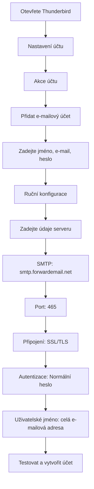

# Příklady integrace SMTP {#smtp-integration-examples}


## Obsah {#table-of-contents}

* [Předmluva](#foreword)
* [Jak funguje zpracování SMTP ve Forward Email](#how-forward-emails-smtp-processing-works)
  * [Fronta e-mailů a systém opakování](#email-queue-and-retry-system)
  * [Bezpečné pro spolehlivost](#dummy-proofed-for-reliability)
* [Integrace Node.js](#nodejs-integration)
  * [Použití Nodemailer](#using-nodemailer)
  * [Použití Express.js](#using-expressjs)
* [Integrace Python](#python-integration)
  * [Použití smtplib](#using-smtplib)
  * [Použití Django](#using-django)
* [Integrace PHP](#php-integration)
  * [Použití PHPMailer](#using-phpmailer)
  * [Použití Laravel](#using-laravel)
* [Integrace Ruby](#ruby-integration)
  * [Použití Ruby Mail Gem](#using-ruby-mail-gem)
* [Integrace Java](#java-integration)
  * [Použití JavaMail API](#using-javamail-api)
* [Konfigurace e-mailového klienta](#email-client-configuration)
  * [Thunderbird](#thunderbird)
  * [Apple Mail](#apple-mail)
  * [Gmail (Odesílat jako)](#gmail-send-mail-as)
* [Řešení problémů](#troubleshooting)
  * [Běžné problémy a řešení](#common-issues-and-solutions)
  * [Získání pomoci](#getting-help)
* [Další zdroje](#additional-resources)
* [Závěr](#conclusion)


## Předmluva {#foreword}

Tato příručka poskytuje podrobné příklady, jak integrovat službu SMTP Forward Email pomocí různých programovacích jazyků, frameworků a e-mailových klientů. Naše SMTP služba je navržena tak, aby byla spolehlivá, bezpečná a snadno integrovatelná do vašich stávajících aplikací.


## Jak funguje zpracování SMTP ve Forward Email {#how-forward-emails-smtp-processing-works}

Než se pustíte do příkladů integrace, je důležité pochopit, jak naše SMTP služba zpracovává e-maily:

### Fronta e-mailů a systém opakování {#email-queue-and-retry-system}

Když odešlete e-mail přes SMTP na naše servery:

1. **Počáteční zpracování**: E-mail je ověřen, prohledán na malware a zkontrolován proti spamovým filtrům
2. **Chytrá fronta**: E-maily jsou umístěny do sofistikovaného systému front pro doručení
3. **Inteligentní mechanismus opakování**: Pokud doručení dočasně selže, náš systém:
   * Analyzuje chybovou odpověď pomocí naší funkce `getBounceInfo`
   * Určí, zda je problém dočasný (např. „zkuste později“, „dočasně odloženo“) nebo trvalý (např. „uživatel neznámý“)
   * U dočasných problémů označí e-mail k opakování
   * U trvalých problémů vygeneruje oznámení o nedoručení
4. **5denní období opakování**: Doručení se opakuje až 5 dní (podobně jako průmyslové standardy jako Postfix), aby měly dočasné problémy čas na vyřešení
5. **Oznámení o stavu doručení**: Odesílatelé dostávají oznámení o stavu svých e-mailů (doručeno, zpožděno nebo vráceno)

> \[!NOTE]
> Po úspěšném doručení je obsah odchozího SMTP e-mailu po uplynutí konfigurovatelné doby uchování (výchozí 30 dní) z bezpečnostních a soukromých důvodů odstraněn. Zůstává pouze zástupná zpráva indikující úspěšné doručení.

### Bezpečné pro spolehlivost {#dummy-proofed-for-reliability}

Náš systém je navržen tak, aby zvládal různé okrajové případy:

* Pokud je detekován blokovací seznam, e-mail bude automaticky opakován
* Pokud dojde k problémům se sítí, doručení bude znovu pokuseno
* Pokud je schránka příjemce plná, systém zkusí doručení později
* Pokud je přijímací server dočasně nedostupný, budeme pokračovat v pokusech

Tento přístup výrazně zlepšuje míru doručení při zachování soukromí a bezpečnosti.


## Integrace Node.js {#nodejs-integration}

### Použití Nodemailer {#using-nodemailer}

[Nodemailer](https://nodemailer.com/) je populární modul pro odesílání e-mailů z aplikací Node.js.

```javascript
const nodemailer = require('nodemailer');

// Vytvoření objektu transportéru
const transporter = nodemailer.createTransport({
  host: 'smtp.forwardemail.net',
  port: 465,
  secure: true, // Použít TLS
  auth: {
    user: 'your-username@your-domain.com',
    pass: 'your-password'
  }
});

// Odeslání e-mailu pomocí definovaného transportéru
async function sendEmail() {
  try {
    const info = await transporter.sendMail({
      from: '"Vaše jméno" <your-username@your-domain.com>',
      to: 'recipient@example.com',
      subject: 'Pozdrav z Forward Email',
      text: 'Ahoj světe! Toto je testovací e-mail odeslaný pomocí Nodemailer a Forward Email SMTP.',
      html: '<b>Ahoj světe!</b> Toto je testovací e-mail odeslaný pomocí Nodemailer a Forward Email SMTP.'
    });

    console.log('Zpráva odeslána: %s', info.messageId);
  } catch (error) {
    console.error('Chyba při odesílání e-mailu:', error);
  }
}

sendEmail();
```
### Použití Express.js {#using-expressjs}

Zde je návod, jak integrovat Forward Email SMTP s aplikací Express.js:

```javascript
const express = require('express');
const nodemailer = require('nodemailer');
const app = express();
const port = 3000;

app.use(express.json());

// Konfigurace emailového transportéru
const transporter = nodemailer.createTransport({
  host: 'smtp.forwardemail.net',
  port: 465,
  secure: true,
  auth: {
    user: 'your-username@your-domain.com',
    pass: 'your-password'
  }
});

// API endpoint pro odesílání emailů
app.post('/send-email', async (req, res) => {
  const { to, subject, text, html } = req.body;

  try {
    const info = await transporter.sendMail({
      from: '"Your App" <your-username@your-domain.com>',
      to,
      subject,
      text,
      html
    });

    res.status(200).json({
      success: true,
      messageId: info.messageId
    });
  } catch (error) {
    console.error('Chyba při odesílání emailu:', error);
    res.status(500).json({
      success: false,
      error: error.message
    });
  }
});

app.listen(port, () => {
  console.log(`Server běží na http://localhost:${port}`);
});
```


## Integrace Pythonu {#python-integration}

### Použití smtplib {#using-smtplib}

```python
import smtplib
from email.mime.text import MIMEText
from email.mime.multipart import MIMEMultipart

# Konfigurace emailu
sender_email = "your-username@your-domain.com"
receiver_email = "recipient@example.com"
password = "your-password"

# Vytvoření zprávy
message = MIMEMultipart("alternative")
message["Subject"] = "Hello from Forward Email"
message["From"] = sender_email
message["To"] = receiver_email

# Vytvoření textové a HTML verze zprávy
text = "Hello world! This is a test email sent using Python and Forward Email SMTP."
html = "<html><body><b>Hello world!</b> This is a test email sent using Python and Forward Email SMTP.</body></html>"

# Převod na MIMEText objekty pro plain/html
part1 = MIMEText(text, "plain")
part2 = MIMEText(html, "html")

# Přidání HTML/plain-text částí do MIMEMultipart zprávy
message.attach(part1)
message.attach(part2)

# Odeslání emailu
try:
    server = smtplib.SMTP_SSL("smtp.forwardemail.net", 465)
    server.login(sender_email, password)
    server.sendmail(sender_email, receiver_email, message.as_string())
    server.quit()
    print("Email byl úspěšně odeslán!")
except Exception as e:
    print(f"Chyba při odesílání emailu: {e}")
```

### Použití Django {#using-django}

Pro aplikace Django přidejte následující do vašeho `settings.py`:

```python
# Nastavení emailu
EMAIL_BACKEND = 'django.core.mail.backends.smtp.EmailBackend'
EMAIL_HOST = 'smtp.forwardemail.net'
EMAIL_PORT = 465
EMAIL_USE_SSL = True
EMAIL_HOST_USER = 'your-username@your-domain.com'
EMAIL_HOST_PASSWORD = 'your-password'
DEFAULT_FROM_EMAIL = 'your-username@your-domain.com'
```

Poté odesílejte emaily ve vašich views:

```python
from django.core.mail import send_mail

def send_email_view(request):
    send_mail(
        'Předmět zde',
        'Zde je zpráva.',
        'from@your-domain.com',
        ['to@example.com'],
        fail_silently=False,
        html_message='<b>Zde je HTML zpráva.</b>'
    )
    return HttpResponse('Email odeslán!')
```


## Integrace PHP {#php-integration}

### Použití PHPMailer {#using-phpmailer}

```php
<?php
use PHPMailer\PHPMailer\PHPMailer;
use PHPMailer\PHPMailer\Exception;

require 'vendor/autoload.php';

$mail = new PHPMailer(true);

try {
    // Nastavení serveru
    $mail->isSMTP();
    $mail->Host       = 'smtp.forwardemail.net';
    $mail->SMTPAuth   = true;
    $mail->Username   = 'your-username@your-domain.com';
    $mail->Password   = 'your-password';
    $mail->SMTPSecure = PHPMailer::ENCRYPTION_SMTPS;
    $mail->Port       = 465;

    // Příjemci
    $mail->setFrom('your-username@your-domain.com', 'Your Name');
    $mail->addAddress('recipient@example.com', 'Recipient Name');
    $mail->addReplyTo('your-username@your-domain.com', 'Your Name');

    // Obsah
    $mail->isHTML(true);
    $mail->Subject = 'Hello from Forward Email';
    $mail->Body    = '<b>Hello world!</b> This is a test email sent using PHPMailer and Forward Email SMTP.';
    $mail->AltBody = 'Hello world! This is a test email sent using PHPMailer and Forward Email SMTP.';

    $mail->send();
    echo 'Zpráva byla odeslána';
} catch (Exception $e) {
    echo "Zprávu se nepodařilo odeslat. Chyba Maileru: {$mail->ErrorInfo}";
}
```
### Použití Laravelu {#using-laravel}

Pro Laravel aplikace aktualizujte svůj `.env` soubor:

```sh
MAIL_MAILER=smtp
MAIL_HOST=smtp.forwardemail.net
MAIL_PORT=465
MAIL_USERNAME=your-username@your-domain.com
MAIL_PASSWORD=your-password
MAIL_ENCRYPTION=ssl
MAIL_FROM_ADDRESS=your-username@your-domain.com
MAIL_FROM_NAME="${APP_NAME}"
```

Poté odesílejte e-maily pomocí Laravel Mail façade:

```php
<?php

namespace App\Http\Controllers;

use Illuminate\Http\Request;
use Illuminate\Support\Facades\Mail;
use App\Mail\WelcomeEmail;

class EmailController extends Controller
{
    public function sendEmail()
    {
        Mail::to('recipient@example.com')->send(new WelcomeEmail());

        return 'E-mail byl úspěšně odeslán!';
    }
}
```


## Integrace Ruby {#ruby-integration}

### Použití Ruby Mail Gem {#using-ruby-mail-gem}

```ruby
require 'mail'

Mail.defaults do
  delivery_method :smtp, {
    address: 'smtp.forwardemail.net',
    port: 465,
    domain: 'your-domain.com',
    user_name: 'your-username@your-domain.com',
    password: 'your-password',
    authentication: 'plain',
    enable_starttls_auto: true,
    ssl: true
  }
end

mail = Mail.new do
  from     'your-username@your-domain.com'
  to       'recipient@example.com'
  subject  'Pozdrav z Forward Email'

  text_part do
    body 'Ahoj světe! Toto je testovací e-mail odeslaný pomocí Ruby Mail a Forward Email SMTP.'
  end

  html_part do
    content_type 'text/html; charset=UTF-8'
    body '<b>Ahoj světe!</b> Toto je testovací e-mail odeslaný pomocí Ruby Mail a Forward Email SMTP.'
  end
end

mail.deliver!
puts "E-mail byl úspěšně odeslán!"
```


## Integrace Java {#java-integration}

### Použití JavaMail API {#using-javamail-api}

```java
import java.util.Properties;
import javax.mail.*;
import javax.mail.internet.*;

public class SendEmail {
    public static void main(String[] args) {
        // E-mail a heslo odesílatele
        final String username = "your-username@your-domain.com";
        final String password = "your-password";

        // Vlastnosti SMTP serveru
        Properties props = new Properties();
        props.put("mail.smtp.auth", "true");
        props.put("mail.smtp.starttls.enable", "true");
        props.put("mail.smtp.host", "smtp.forwardemail.net");
        props.put("mail.smtp.port", "465");
        props.put("mail.smtp.socketFactory.port", "465");
        props.put("mail.smtp.socketFactory.class", "javax.net.ssl.SSLSocketFactory");

        // Vytvoření session s autentizátorem
        Session session = Session.getInstance(props,
            new javax.mail.Authenticator() {
                protected PasswordAuthentication getPasswordAuthentication() {
                    return new PasswordAuthentication(username, password);
                }
            });

        try {
            // Vytvoření zprávy
            Message message = new MimeMessage(session);
            message.setFrom(new InternetAddress(username));
            message.setRecipients(Message.RecipientType.TO, InternetAddress.parse("recipient@example.com"));
            message.setSubject("Pozdrav z Forward Email");

            // Vytvoření multipart zprávy
            Multipart multipart = new MimeMultipart("alternative");

            // Textová část
            BodyPart textPart = new MimeBodyPart();
            textPart.setText("Ahoj světe! Toto je testovací e-mail odeslaný pomocí JavaMail a Forward Email SMTP.");

            // HTML část
            BodyPart htmlPart = new MimeBodyPart();
            htmlPart.setContent("<b>Ahoj světe!</b> Toto je testovací e-mail odeslaný pomocí JavaMail a Forward Email SMTP.", "text/html");

            // Přidání částí do multipart
            multipart.addBodyPart(textPart);
            multipart.addBodyPart(htmlPart);

            // Nastavení obsahu
            message.setContent(multipart);

            // Odeslání zprávy
            Transport.send(message);

            System.out.println("E-mail byl úspěšně odeslán!");

        } catch (MessagingException e) {
            throw new RuntimeException(e);
        }
    }
}
```


## Konfigurace e-mailového klienta {#email-client-configuration}

### Thunderbird {#thunderbird}


```mermaid
flowchart TD
    A[Otevřete Thunderbird] --> B[Nastavení účtu]
    B --> C[Akce účtu]
    C --> D[Přidat e-mailový účet]
    D --> E[Zadejte jméno, e-mail, heslo]
    E --> F[Ruční konfigurace]
    F --> G[Zadejte údaje serveru]
    G --> H[SMTP: smtp.forwardemail.net]
    H --> I[Port: 465]
    I --> J[Připojení: SSL/TLS]
    J --> K[Autentizace: Normální heslo]
    K --> L[Uživatelské jméno: celá e-mailová adresa]
    L --> M[Testovat a vytvořit účet]
```
1. Otevřete Thunderbird a přejděte do Nastavení účtu  
2. Klikněte na „Akce účtu“ a vyberte „Přidat e-mailový účet“  
3. Zadejte své jméno, e-mailovou adresu a heslo  
4. Klikněte na „Ruční konfigurace“ a zadejte následující údaje:  
   * Příchozí server:  
     * IMAP: imap.forwardemail.net, Port: 993, SSL/TLS  
     * POP3: pop3.forwardemail.net, Port: 995, SSL/TLS  
   * Odchozí server (SMTP): smtp.forwardemail.net, Port: 465, SSL/TLS  
   * Autentizace: Normální heslo  
   * Uživatelské jméno: vaše celá e-mailová adresa  
5. Klikněte na „Testovat“ a poté na „Hotovo“  

### Apple Mail {#apple-mail}

1. Otevřete Mail a přejděte na Mail > Předvolby > Účty  
2. Klikněte na tlačítko „+“ pro přidání nového účtu  
3. Vyberte „Jiný e-mailový účet“ a klikněte na „Pokračovat“  
4. Zadejte své jméno, e-mailovou adresu a heslo, poté klikněte na „Přihlásit se“  
5. Pokud automatické nastavení selže, zadejte následující údaje:  
   * Příchozí poštovní server: imap.forwardemail.net (nebo pop3.forwardemail.net pro POP3)  
   * Odchozí poštovní server: smtp.forwardemail.net  
   * Uživatelské jméno: vaše celá e-mailová adresa  
   * Heslo: vaše heslo  
6. Klikněte na „Přihlásit se“ pro dokončení nastavení  

### Gmail (Odesílat poštu jako) {#gmail-send-mail-as}

1. Otevřete Gmail a přejděte do Nastavení > Účty a import  
2. V sekci „Odesílat poštu jako“ klikněte na „Přidat další e-mailovou adresu“  
3. Zadejte své jméno a e-mailovou adresu, poté klikněte na „Další krok“  
4. Zadejte následující údaje SMTP serveru:  
   * SMTP server: smtp.forwardemail.net  
   * Port: 465  
   * Uživatelské jméno: vaše celá e-mailová adresa  
   * Heslo: vaše heslo  
   * Vyberte „Zabezpečené připojení pomocí SSL“  
5. Klikněte na „Přidat účet“ a ověřte svou e-mailovou adresu  

## Řešení problémů {#troubleshooting}

### Běžné problémy a řešení {#common-issues-and-solutions}

1. **Autentizace selhala**  
   * Ověřte své uživatelské jméno (celou e-mailovou adresu) a heslo  
   * Ujistěte se, že používáte správný port (465 pro SSL/TLS)  
   * Zkontrolujte, zda má váš účet povolený přístup k SMTP  

2. **Vypršení časového limitu připojení**  
   * Zkontrolujte své internetové připojení  
   * Ověřte, že firewall neblokuje SMTP provoz  
   * Zkuste použít port 465 s SSL/TLS (doporučeno) nebo port 587 s STARTTLS  

3. **Zpráva byla odmítnuta**  
   * Ujistěte se, že adresa „Od“ odpovídá vaší autentizované e-mailové adrese  
   * Zkontrolujte, zda vaše IP není na blacklistu  
   * Ověřte, že obsah zprávy nevyvolává spamové filtry  

4. **Chyby TLS/SSL**  
   * Aktualizujte svou aplikaci/knihovnu, aby podporovala moderní verze TLS  
   * Ujistěte se, že certifikáty CA ve vašem systému jsou aktuální  
   * Zkuste explicitní TLS místo implicitního TLS  

### Získání pomoci {#getting-help}

Pokud narazíte na problémy, které zde nejsou pokryty, prosím:  

1. Zkontrolujte naši [FAQ stránku](/faq) pro běžné otázky  
2. Prostudujte náš [blogový příspěvek o doručování e-mailů](/blog/docs/best-email-forwarding-service) pro podrobné informace  
3. Kontaktujte náš tým podpory na <support@forwardemail.net>  

## Další zdroje {#additional-resources}

* [Dokumentace Forward Email](/docs)  
* [Limity a konfigurace SMTP serveru](/faq#what-are-your-outbound-smtp-limits)  
* [Průvodce nejlepšími postupy pro e-mail](/blog/docs/best-email-forwarding-service)  
* [Bezpečnostní postupy](/security)  

## Závěr {#conclusion}

SMTP služba Forward Email poskytuje spolehlivý, bezpečný a na soukromí zaměřený způsob odesílání e-mailů z vašich aplikací a e-mailových klientů. Díky našemu inteligentnímu systému front, pětidennímu mechanismu opakování a komplexním oznámením o stavu doručení můžete mít jistotu, že vaše e-maily dorazí do cíle.  

Pro pokročilejší použití nebo vlastní integrace prosím kontaktujte náš tým podpory.
