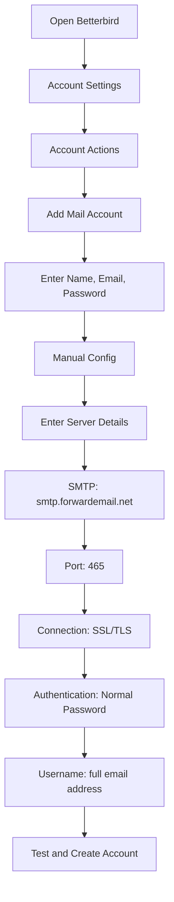

# Eksempler på SMTP-integration {#smtp-integration-examples}

## Indholdsfortegnelse {#table-of-contents}

* [Forord](#foreword)
* [Sådan fungerer SMTP-behandling af videresendte e-mails](#how-forward-emails-smtp-processing-works)
  * [E-mailkø og gentagne forsøgssystem](#email-queue-and-retry-system)
  * [Dummy-proofed for pålidelighed](#dummy-proofed-for-reliability)
* [Node.js-integration](#nodejs-integration)
  * [Brug af Nodemailer](#using-nodemailer)
  * [Brug af Express.js](#using-expressjs)
* [Python-integration](#python-integration)
  * [Brug af smtplib](#using-smtplib)
  * [Brug af Django](#using-django)
* [PHP-integration](#php-integration)
  * [Brug af PHPMailer](#using-phpmailer)
  * [Brug af Laravel](#using-laravel)
* [Ruby-integration](#ruby-integration)
  * [Brug af Ruby Mail Gem](#using-ruby-mail-gem)
* [Java-integration](#java-integration)
  * [Brug af Java Mail API'en](#using-javamail-api)
* [Konfiguration af e-mailklient](#email-client-configuration)
  * [Betterbird](#betterbird)
  * [Apple Mail](#apple-mail)
  * [Gmail (Send mail som)](#gmail-send-mail-as)
* [Fejlfinding](#troubleshooting)
  * [Almindelige problemer og løsninger](#common-issues-and-solutions)
  * [Få hjælp](#getting-help)
* [Yderligere ressourcer](#additional-resources)
* [Konklusion](#conclusion)

## Forord {#foreword}

Denne vejledning giver detaljerede eksempler på, hvordan man integrerer med Forward Emails SMTP-tjeneste ved hjælp af forskellige programmeringssprog, frameworks og e-mailklienter. Vores SMTP-tjeneste er designet til at være pålidelig, sikker og nem at integrere med dine eksisterende applikationer.

## Sådan fungerer SMTP-behandling af videresendelse af e-mail {#how-forward-emails-smtp-processing-works}

Før vi dykker ned i integrationseksemplerne, er det vigtigt at forstå, hvordan vores SMTP-tjeneste behandler e-mails:

### E-mailkø og gentagne forsøgssystem {#email-queue-and-retry-system}

Når du sender en e-mail via SMTP til vores servere:

1. **Initial behandling**: E-mailen valideres, scannes for malware og kontrolleres mod spamfiltre
2. **Smart køstyring**: E-mails placeres i et sofistikeret køsystem til levering
3. **Intelligent gentagelsesmekanisme**: Hvis leveringen mislykkes midlertidigt, vil vores system:
* Analysere fejlresponsen ved hjælp af vores `getBounceInfo`-funktion
* Bestemme, om problemet er midlertidigt (f.eks. "prøv igen senere", "midlertidigt udskudt") eller permanent (f.eks. "bruger ukendt")
* Ved midlertidige problemer markeres e-mailen til gentagelse
* Ved permanente problemer genereres en afvisningsmeddelelse
4. **5-dages gentagelsesperiode**: Vi forsøger levering igen i op til 5 dage (svarende til branchestandarder som Postfix), hvilket giver midlertidige problemer tid til at løse
5. **Leveringsstatusmeddelelser**: Afsendere modtager meddelelser om status for deres e-mails (leveret, forsinket eller afvist)

> \[!NOTE]
> Efter vellykket levering redigeres udgående SMTP-e-mailindhold efter en konfigurerbar opbevaringsperiode (standard 30 dage) af sikkerheds- og privatlivsmæssige årsager. Kun en pladsholdermeddelelse vises, der angiver vellykket levering.

### Dummy-sikret for pålidelighed {#dummy-proofed-for-reliability}

Vores system er designet til at håndtere forskellige edge cases:

* Hvis der registreres en blokeringsliste, forsøges e-mailen automatisk at sende den igen.
* Hvis der opstår netværksproblemer, forsøges levering igen.
* Hvis modtagerens postkasse er fuld, forsøger systemet igen senere.
* Hvis den modtagende server midlertidigt ikke er tilgængelig, fortsætter vi med at forsøge.

Denne tilgang forbedrer leveringsraterne betydeligt, samtidig med at privatlivets fred og sikkerhed opretholdes.

## Node.js-integration {#nodejs-integration}

### Brug af Nodemailer {#using-nodemailer}

[Nodemailer](https://nodemailer.com/) er et populært modul til at sende e-mails fra Node.js-applikationer.

```javascript
const nodemailer = require('nodemailer');

// Create a transporter object
const transporter = nodemailer.createTransport({
  host: 'smtp.forwardemail.net',
  port: 465,
  secure: true, // Use TLS
  auth: {
    user: 'your-username@your-domain.com',
    pass: 'your-password'
  }
});

// Send mail with defined transport object
async function sendEmail() {
  try {
    const info = await transporter.sendMail({
      from: '"Your Name" <your-username@your-domain.com>',
      to: 'recipient@example.com',
      subject: 'Hello from Forward Email',
      text: 'Hello world! This is a test email sent using Nodemailer and Forward Email SMTP.',
      html: '<b>Hello world!</b> This is a test email sent using Nodemailer and Forward Email SMTP.'
    });

    console.log('Message sent: %s', info.messageId);
  } catch (error) {
    console.error('Error sending email:', error);
  }
}

sendEmail();
```

### Brug af Express.js {#using-expressjs}

Sådan integrerer du Videresend Email SMTP med en Express.js-applikation:

```javascript
const express = require('express');
const nodemailer = require('nodemailer');
const app = express();
const port = 3000;

app.use(express.json());

// Configure email transporter
const transporter = nodemailer.createTransport({
  host: 'smtp.forwardemail.net',
  port: 465,
  secure: true,
  auth: {
    user: 'your-username@your-domain.com',
    pass: 'your-password'
  }
});

// API endpoint for sending emails
app.post('/send-email', async (req, res) => {
  const { to, subject, text, html } = req.body;

  try {
    const info = await transporter.sendMail({
      from: '"Your App" <your-username@your-domain.com>',
      to,
      subject,
      text,
      html
    });

    res.status(200).json({
      success: true,
      messageId: info.messageId
    });
  } catch (error) {
    console.error('Error sending email:', error);
    res.status(500).json({
      success: false,
      error: error.message
    });
  }
});

app.listen(port, () => {
  console.log(`Server running at http://localhost:${port}`);
});
```

## Python-integration {#python-integration}

### Bruger smtplib {#using-smtplib}

```python
import smtplib
from email.mime.text import MIMEText
from email.mime.multipart import MIMEMultipart

# Email configuration
sender_email = "your-username@your-domain.com"
receiver_email = "recipient@example.com"
password = "your-password"

# Create message
message = MIMEMultipart("alternative")
message["Subject"] = "Hello from Forward Email"
message["From"] = sender_email
message["To"] = receiver_email

# Create the plain-text and HTML version of your message
text = "Hello world! This is a test email sent using Python and Forward Email SMTP."
html = "<html><body><b>Hello world!</b> This is a test email sent using Python and Forward Email SMTP.</body></html>"

# Turn these into plain/html MIMEText objects
part1 = MIMEText(text, "plain")
part2 = MIMEText(html, "html")

# Add HTML/plain-text parts to MIMEMultipart message
message.attach(part1)
message.attach(part2)

# Send email
try:
    server = smtplib.SMTP_SSL("smtp.forwardemail.net", 465)
    server.login(sender_email, password)
    server.sendmail(sender_email, receiver_email, message.as_string())
    server.quit()
    print("Email sent successfully!")
except Exception as e:
    print(f"Error sending email: {e}")
```

### Brug af Django {#using-django}

For Django-applikationer skal du tilføje følgende til din `settings.py`:

```python
# Email settings
EMAIL_BACKEND = 'django.core.mail.backends.smtp.EmailBackend'
EMAIL_HOST = 'smtp.forwardemail.net'
EMAIL_PORT = 465
EMAIL_USE_SSL = True
EMAIL_HOST_USER = 'your-username@your-domain.com'
EMAIL_HOST_PASSWORD = 'your-password'
DEFAULT_FROM_EMAIL = 'your-username@your-domain.com'
```

Send derefter e-mails i dine visninger:

```python
from django.core.mail import send_mail

def send_email_view(request):
    send_mail(
        'Subject here',
        'Here is the message.',
        'from@your-domain.com',
        ['to@example.com'],
        fail_silently=False,
        html_message='<b>Here is the HTML message.</b>'
    )
    return HttpResponse('Email sent!')
```

## PHP-integration {#php-integration}

### Brug af PHPMailer {#using-phpmailer}

```php
<?php
use PHPMailer\PHPMailer\PHPMailer;
use PHPMailer\PHPMailer\Exception;

require 'vendor/autoload.php';

$mail = new PHPMailer(true);

try {
    // Server settings
    $mail->isSMTP();
    $mail->Host       = 'smtp.forwardemail.net';
    $mail->SMTPAuth   = true;
    $mail->Username   = 'your-username@your-domain.com';
    $mail->Password   = 'your-password';
    $mail->SMTPSecure = PHPMailer::ENCRYPTION_SMTPS;
    $mail->Port       = 465;

    // Recipients
    $mail->setFrom('your-username@your-domain.com', 'Your Name');
    $mail->addAddress('recipient@example.com', 'Recipient Name');
    $mail->addReplyTo('your-username@your-domain.com', 'Your Name');

    // Content
    $mail->isHTML(true);
    $mail->Subject = 'Hello from Forward Email';
    $mail->Body    = '<b>Hello world!</b> This is a test email sent using PHPMailer and Forward Email SMTP.';
    $mail->AltBody = 'Hello world! This is a test email sent using PHPMailer and Forward Email SMTP.';

    $mail->send();
    echo 'Message has been sent';
} catch (Exception $e) {
    echo "Message could not be sent. Mailer Error: {$mail->ErrorInfo}";
}
```

### Brug af Laravel {#using-laravel}

For Laravel-applikationer skal du opdatere din `.env`-fil:

```sh
MAIL_MAILER=smtp
MAIL_HOST=smtp.forwardemail.net
MAIL_PORT=465
MAIL_USERNAME=your-username@your-domain.com
MAIL_PASSWORD=your-password
MAIL_ENCRYPTION=ssl
MAIL_FROM_ADDRESS=your-username@your-domain.com
MAIL_FROM_NAME="${APP_NAME}"
```

Send derefter e-mails ved hjælp af Laravels Mail-facade:

```php
<?php

namespace App\Http\Controllers;

use Illuminate\Http\Request;
use Illuminate\Support\Facades\Mail;
use App\Mail\WelcomeEmail;

class EmailController extends Controller
{
    public function sendEmail()
    {
        Mail::to('recipient@example.com')->send(new WelcomeEmail());

        return 'Email sent successfully!';
    }
}
```

## Ruby-integration {#ruby-integration}

### Brug af Ruby Mail Gem {#using-ruby-mail-gem}

```ruby
require 'mail'

Mail.defaults do
  delivery_method :smtp, {
    address: 'smtp.forwardemail.net',
    port: 465,
    domain: 'your-domain.com',
    user_name: 'your-username@your-domain.com',
    password: 'your-password',
    authentication: 'plain',
    enable_starttls_auto: true,
    ssl: true
  }
end

mail = Mail.new do
  from     'your-username@your-domain.com'
  to       'recipient@example.com'
  subject  'Hello from Forward Email'

  text_part do
    body 'Hello world! This is a test email sent using Ruby Mail and Forward Email SMTP.'
  end

  html_part do
    content_type 'text/html; charset=UTF-8'
    body '<b>Hello world!</b> This is a test email sent using Ruby Mail and Forward Email SMTP.'
  end
end

mail.deliver!
puts "Email sent successfully!"
```

## Java-integration {#java-integration}

### Bruger JavaMail API {#using-javamail-api}

```java
import java.util.Properties;
import javax.mail.*;
import javax.mail.internet.*;

public class SendEmail {
    public static void main(String[] args) {
        // Sender's email and password
        final String username = "your-username@your-domain.com";
        final String password = "your-password";

        // SMTP server properties
        Properties props = new Properties();
        props.put("mail.smtp.auth", "true");
        props.put("mail.smtp.starttls.enable", "true");
        props.put("mail.smtp.host", "smtp.forwardemail.net");
        props.put("mail.smtp.port", "465");
        props.put("mail.smtp.socketFactory.port", "465");
        props.put("mail.smtp.socketFactory.class", "javax.net.ssl.SSLSocketFactory");

        // Create session with authenticator
        Session session = Session.getInstance(props,
            new javax.mail.Authenticator() {
                protected PasswordAuthentication getPasswordAuthentication() {
                    return new PasswordAuthentication(username, password);
                }
            });

        try {
            // Create message
            Message message = new MimeMessage(session);
            message.setFrom(new InternetAddress(username));
            message.setRecipients(Message.RecipientType.TO, InternetAddress.parse("recipient@example.com"));
            message.setSubject("Hello from Forward Email");

            // Create multipart message
            Multipart multipart = new MimeMultipart("alternative");

            // Text part
            BodyPart textPart = new MimeBodyPart();
            textPart.setText("Hello world! This is a test email sent using JavaMail and Forward Email SMTP.");

            // HTML part
            BodyPart htmlPart = new MimeBodyPart();
            htmlPart.setContent("<b>Hello world!</b> This is a test email sent using JavaMail and Forward Email SMTP.", "text/html");

            // Add parts to multipart
            multipart.addBodyPart(textPart);
            multipart.addBodyPart(htmlPart);

            // Set content
            message.setContent(multipart);

            // Send message
            Transport.send(message);

            System.out.println("Email sent successfully!");

        } catch (MessagingException e) {
            throw new RuntimeException(e);
        }
    }
}
```

## Konfiguration af e-mailklient {#email-client-configuration}

### Betterbird {#betterbird}



1. Åbn Betterbird, og gå til Kontoindstillinger.
2. Klik på "Kontohandlinger", og vælg "Tilføj e-mailkonto".
3. Indtast dit navn, din e-mailadresse og din adgangskode.
4. Klik på "Manuel konfiguration", og indtast følgende oplysninger:
* Indgående server:
* IMAP: imap.forwardemail.net, Port: 993, SSL/TLS
* POP3: pop3.forwardemail.net, Port: 995, SSL/TLS
* Udgående server (SMTP): smtp.forwardemail.net, Port: 465, SSL/TLS
* Godkendelse: Normal adgangskode
* Brugernavn: din fulde e-mailadresse.
5. Klik på "Test" og derefter på "Udført".

### Apple Mail {#apple-mail}

1. Åbn Mail, og gå til Mail > Indstillinger > Konti.
2. Klik på knappen "+" for at tilføje en ny konto.
3. Vælg "Anden mailkonto", og klik på "Fortsæt".
4. Indtast dit navn, din e-mailadresse og din adgangskode, og klik derefter på "Log ind".
5. Når den automatiske opsætning mislykkes, skal du indtaste følgende oplysninger:
* Server til indgående post: imap.forwardemail.net (eller pop3.forwardemail.net for POP3)
* Server til udgående post: smtp.forwardemail.net
* Brugernavn: din fulde e-mailadresse.
* Adgangskode: din adgangskode.
6. Klik på "Log ind" for at fuldføre opsætningen.

### Gmail (Send mail som) {#gmail-send-mail-as}

1. Åbn Gmail, og gå til Indstillinger > Konti og import.
2. Under "Send mail som" skal du klikke på "Tilføj en anden e-mailadresse".
3. Indtast dit navn og din e-mailadresse, og klik derefter på "Næste trin".
4. Indtast følgende SMTP-serveroplysninger:
* SMTP-server: smtp.forwardemail.net
* Port: 465
* Brugernavn: din fulde e-mailadresse
* Adgangskode: din adgangskode
* Vælg "Sikker forbindelse ved hjælp af SSL"
5. Klik på "Tilføj konto", og bekræft din e-mailadresse.

## Fejlfinding {#troubleshooting}

### Almindelige problemer og løsninger {#common-issues-and-solutions}

1. **Godkendelse mislykkedes**
* Bekræft dit brugernavn (fuld e-mailadresse) og din adgangskode
* Sørg for, at du bruger den korrekte port (465 for SSL/TLS)
* Tjek, om din konto har SMTP-adgang aktiveret

2. **Forbindelsestimeout**
* Tjek din internetforbindelse
* Bekræft, at firewallindstillingerne ikke blokerer SMTP-trafik
* Prøv at bruge en anden port (587 med STARTTLS)

3. **Besked afvist**
* Sørg for, at din "Fra"-adresse matcher din godkendte e-mailadresse
* Tjek, om din IP-adresse er sortlistet
* Bekræft, at indholdet af din besked ikke udløser spamfiltre

4. **TLS/SSL-fejl**
* Opdater dit program/bibliotek for at understøtte moderne TLS-versioner
* Sørg for, at dit systems CA-certifikater er opdaterede
* Prøv eksplicit TLS i stedet for implicit TLS

### Sådan får du hjælp {#getting-help}

Hvis du støder på problemer, der ikke er dækket her, bedes du:

1. Se vores [FAQ-side](/faq) for almindelige spørgsmål
2. Gennemgå vores [blogindlæg om e-maillevering](/blog/docs/best-email-forwarding-service) for detaljerede oplysninger
3. Kontakt vores supportteam på <support@forwardemail.net>

## Yderligere ressourcer {#additional-resources}

* [Dokumentation for videresendelse af e-mail](/docs)
* [SMTP-serverbegrænsninger og -konfiguration](/faq#what-are-your-outbound-smtp-limits)
* [Vejledning til bedste praksis for e-mail](/blog/docs/best-email-forwarding-service)
* [Sikkerhedspraksis](/security)

## Konklusion {#conclusion}

SMTP-tjenesten i Forward Email tilbyder en pålidelig, sikker og privatlivsfokuseret måde at sende e-mails fra dine applikationer og e-mailklienter. Med vores intelligente køsystem, 5-dages gentagelsesmekanisme og omfattende meddelelser om leveringsstatus kan du være sikker på, at dine e-mails når frem til deres destination.

For mere avancerede brugsscenarier eller brugerdefinerede integrationer, kontakt venligst vores supportteam.