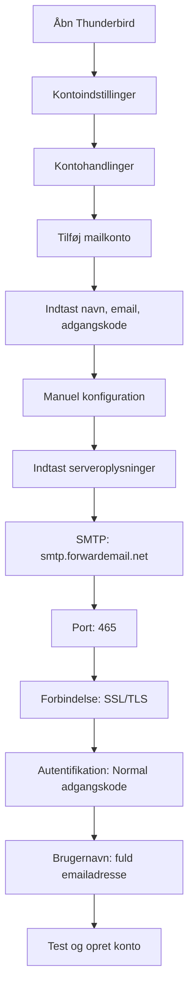

# SMTP Integrations Eksempler {#smtp-integration-examples}


## Indholdsfortegnelse {#table-of-contents}

* [Forord](#foreword)
* [Hvordan Forward Emails SMTP-behandling fungerer](#how-forward-emails-smtp-processing-works)
  * [Email-kø og genforsøgs-system](#email-queue-and-retry-system)
  * [Sikret mod fejl for pålidelighed](#dummy-proofed-for-reliability)
* [Node.js Integration](#nodejs-integration)
  * [Brug af Nodemailer](#using-nodemailer)
  * [Brug af Express.js](#using-expressjs)
* [Python Integration](#python-integration)
  * [Brug af smtplib](#using-smtplib)
  * [Brug af Django](#using-django)
* [PHP Integration](#php-integration)
  * [Brug af PHPMailer](#using-phpmailer)
  * [Brug af Laravel](#using-laravel)
* [Ruby Integration](#ruby-integration)
  * [Brug af Ruby Mail Gem](#using-ruby-mail-gem)
* [Java Integration](#java-integration)
  * [Brug af JavaMail API](#using-javamail-api)
* [Email-klient konfiguration](#email-client-configuration)
  * [Thunderbird](#thunderbird)
  * [Apple Mail](#apple-mail)
  * [Gmail (Send Mail As)](#gmail-send-mail-as)
* [Fejlfinding](#troubleshooting)
  * [Almindelige problemer og løsninger](#common-issues-and-solutions)
  * [Få hjælp](#getting-help)
* [Yderligere ressourcer](#additional-resources)
* [Konklusion](#conclusion)


## Forord {#foreword}

Denne vejledning giver detaljerede eksempler på, hvordan man integrerer med Forward Emails SMTP-service ved brug af forskellige programmeringssprog, frameworks og email-klienter. Vores SMTP-service er designet til at være pålidelig, sikker og nem at integrere med dine eksisterende applikationer.


## Hvordan Forward Emails SMTP-behandling fungerer {#how-forward-emails-smtp-processing-works}

Før vi dykker ned i integrations-eksemplerne, er det vigtigt at forstå, hvordan vores SMTP-service behandler emails:

### Email-kø og genforsøgs-system {#email-queue-and-retry-system}

Når du sender en email via SMTP til vores servere:

1. **Indledende behandling**: Emailen valideres, scannes for malware og kontrolleres mod spamfiltre
2. **Smart køsystem**: Emails placeres i et avanceret køsystem til levering
3. **Intelligent genforsøgs-mekanisme**: Hvis leveringen midlertidigt fejler, vil vores system:
   * Analysere fejlresponsen ved hjælp af vores `getBounceInfo` funktion
   * Bestemme om problemet er midlertidigt (f.eks. "prøv igen senere", "midlertidigt udsat") eller permanent (f.eks. "bruger ukendt")
   * For midlertidige problemer markeres emailen til genforsøg
   * For permanente problemer genereres en bounce-notifikation
4. **5-dages genforsøgsperiode**: Vi forsøger levering i op til 5 dage (ligesom branchestandarder som Postfix), hvilket giver midlertidige problemer tid til at løse sig
5. **Leveringsstatus-notifikationer**: Afsendere modtager notifikationer om status på deres emails (leveret, forsinket eller bounced)

> \[!NOTE]
> Efter vellykket levering bliver udgående SMTP-emailindhold slettet efter en konfigurerbar opbevaringsperiode (standard 30 dage) for sikkerhed og privatliv. Kun en pladsholderbesked forbliver, der angiver vellykket levering.

### Sikret mod fejl for pålidelighed {#dummy-proofed-for-reliability}

Vores system er designet til at håndtere forskellige kanttilfælde:

* Hvis en blokliste opdages, vil emailen automatisk blive genforsøgt
* Hvis netværksproblemer opstår, vil leveringen blive forsøgt igen
* Hvis modtagerens postkasse er fuld, vil systemet prøve igen senere
* Hvis modtagerserveren midlertidigt er utilgængelig, fortsætter vi med at prøve

Denne tilgang forbedrer leveringsrater betydeligt samtidig med at privatliv og sikkerhed opretholdes.


## Node.js Integration {#nodejs-integration}

### Brug af Nodemailer {#using-nodemailer}

[Nodemailer](https://nodemailer.com/) er et populært modul til at sende emails fra Node.js-applikationer.

```javascript
const nodemailer = require('nodemailer');

// Create a transporter object
const transporter = nodemailer.createTransport({
  host: 'smtp.forwardemail.net',
  port: 465,
  secure: true, // Use TLS
  auth: {
    user: 'your-username@your-domain.com',
    pass: 'your-password'
  }
});

// Send mail with defined transport object
async function sendEmail() {
  try {
    const info = await transporter.sendMail({
      from: '"Your Name" <your-username@your-domain.com>',
      to: 'recipient@example.com',
      subject: 'Hello from Forward Email',
      text: 'Hello world! This is a test email sent using Nodemailer and Forward Email SMTP.',
      html: '<b>Hello world!</b> This is a test email sent using Nodemailer and Forward Email SMTP.'
    });

    console.log('Message sent: %s', info.messageId);
  } catch (error) {
    console.error('Error sending email:', error);
  }
}

sendEmail();
```
### Brug af Express.js {#using-expressjs}

Sådan integreres Forward Email SMTP med en Express.js-applikation:

```javascript
const express = require('express');
const nodemailer = require('nodemailer');
const app = express();
const port = 3000;

app.use(express.json());

// Konfigurer email-transporter
const transporter = nodemailer.createTransport({
  host: 'smtp.forwardemail.net',
  port: 465,
  secure: true,
  auth: {
    user: 'your-username@your-domain.com',
    pass: 'your-password'
  }
});

// API-endpoint til at sende emails
app.post('/send-email', async (req, res) => {
  const { to, subject, text, html } = req.body;

  try {
    const info = await transporter.sendMail({
      from: '"Your App" <your-username@your-domain.com>',
      to,
      subject,
      text,
      html
    });

    res.status(200).json({
      success: true,
      messageId: info.messageId
    });
  } catch (error) {
    console.error('Fejl ved afsendelse af email:', error);
    res.status(500).json({
      success: false,
      error: error.message
    });
  }
});

app.listen(port, () => {
  console.log(`Server kører på http://localhost:${port}`);
});
```


## Python-integration {#python-integration}

### Brug af smtplib {#using-smtplib}

```python
import smtplib
from email.mime.text import MIMEText
from email.mime.multipart import MIMEMultipart

# Email-konfiguration
sender_email = "your-username@your-domain.com"
receiver_email = "recipient@example.com"
password = "your-password"

# Opret besked
message = MIMEMultipart("alternative")
message["Subject"] = "Hej fra Forward Email"
message["From"] = sender_email
message["To"] = receiver_email

# Opret den almindelige tekst- og HTML-version af din besked
text = "Hej verden! Dette er en test-email sendt med Python og Forward Email SMTP."
html = "<html><body><b>Hej verden!</b> Dette er en test-email sendt med Python og Forward Email SMTP.</body></html>"

# Omform disse til plain/html MIMEText-objekter
part1 = MIMEText(text, "plain")
part2 = MIMEText(html, "html")

# Tilføj HTML/plain-text dele til MIMEMultipart-beskeden
message.attach(part1)
message.attach(part2)

# Send email
try:
    server = smtplib.SMTP_SSL("smtp.forwardemail.net", 465)
    server.login(sender_email, password)
    server.sendmail(sender_email, receiver_email, message.as_string())
    server.quit()
    print("Email sendt succesfuldt!")
except Exception as e:
    print(f"Fejl ved afsendelse af email: {e}")
```

### Brug af Django {#using-django}

For Django-applikationer, tilføj følgende til din `settings.py`:

```python
# Email-indstillinger
EMAIL_BACKEND = 'django.core.mail.backends.smtp.EmailBackend'
EMAIL_HOST = 'smtp.forwardemail.net'
EMAIL_PORT = 465
EMAIL_USE_SSL = True
EMAIL_HOST_USER = 'your-username@your-domain.com'
EMAIL_HOST_PASSWORD = 'your-password'
DEFAULT_FROM_EMAIL = 'your-username@your-domain.com'
```

Send derefter emails i dine views:

```python
from django.core.mail import send_mail

def send_email_view(request):
    send_mail(
        'Emne her',
        'Her er beskeden.',
        'from@your-domain.com',
        ['to@example.com'],
        fail_silently=False,
        html_message='<b>Her er HTML-beskeden.</b>'
    )
    return HttpResponse('Email sendt!')
```


## PHP-integration {#php-integration}

### Brug af PHPMailer {#using-phpmailer}

```php
<?php
use PHPMailer\PHPMailer\PHPMailer;
use PHPMailer\PHPMailer\Exception;

require 'vendor/autoload.php';

$mail = new PHPMailer(true);

try {
    // Serverindstillinger
    $mail->isSMTP();
    $mail->Host       = 'smtp.forwardemail.net';
    $mail->SMTPAuth   = true;
    $mail->Username   = 'your-username@your-domain.com';
    $mail->Password   = 'your-password';
    $mail->SMTPSecure = PHPMailer::ENCRYPTION_SMTPS;
    $mail->Port       = 465;

    // Modtagere
    $mail->setFrom('your-username@your-domain.com', 'Dit Navn');
    $mail->addAddress('recipient@example.com', 'Modtager Navn');
    $mail->addReplyTo('your-username@your-domain.com', 'Dit Navn');

    // Indhold
    $mail->isHTML(true);
    $mail->Subject = 'Hej fra Forward Email';
    $mail->Body    = '<b>Hej verden!</b> Dette er en test-email sendt med PHPMailer og Forward Email SMTP.';
    $mail->AltBody = 'Hej verden! Dette er en test-email sendt med PHPMailer og Forward Email SMTP.';

    $mail->send();
    echo 'Besked er sendt';
} catch (Exception $e) {
    echo "Besked kunne ikke sendes. Mailer-fejl: {$mail->ErrorInfo}";
}
```
### Using Laravel {#using-laravel}

For Laravel-applikationer, opdater din `.env` fil:

```sh
MAIL_MAILER=smtp
MAIL_HOST=smtp.forwardemail.net
MAIL_PORT=465
MAIL_USERNAME=your-username@your-domain.com
MAIL_PASSWORD=your-password
MAIL_ENCRYPTION=ssl
MAIL_FROM_ADDRESS=your-username@your-domain.com
MAIL_FROM_NAME="${APP_NAME}"
```

Send derefter e-mails ved hjælp af Laravel's Mail-facade:

```php
<?php

namespace App\Http\Controllers;

use Illuminate\Http\Request;
use Illuminate\Support\Facades\Mail;
use App\Mail\WelcomeEmail;

class EmailController extends Controller
{
    public function sendEmail()
    {
        Mail::to('recipient@example.com')->send(new WelcomeEmail());

        return 'Email sendt succesfuldt!';
    }
}
```


## Ruby Integration {#ruby-integration}

### Using Ruby Mail Gem {#using-ruby-mail-gem}

```ruby
require 'mail'

Mail.defaults do
  delivery_method :smtp, {
    address: 'smtp.forwardemail.net',
    port: 465,
    domain: 'your-domain.com',
    user_name: 'your-username@your-domain.com',
    password: 'your-password',
    authentication: 'plain',
    enable_starttls_auto: true,
    ssl: true
  }
end

mail = Mail.new do
  from     'your-username@your-domain.com'
  to       'recipient@example.com'
  subject  'Hej fra Forward Email'

  text_part do
    body 'Hej verden! Dette er en test-email sendt ved hjælp af Ruby Mail og Forward Email SMTP.'
  end

  html_part do
    content_type 'text/html; charset=UTF-8'
    body '<b>Hej verden!</b> Dette er en test-email sendt ved hjælp af Ruby Mail og Forward Email SMTP.'
  end
end

mail.deliver!
puts "Email sendt succesfuldt!"
```


## Java Integration {#java-integration}

### Using JavaMail API {#using-javamail-api}

```java
import java.util.Properties;
import javax.mail.*;
import javax.mail.internet.*;

public class SendEmail {
    public static void main(String[] args) {
        // Afsenders email og adgangskode
        final String username = "your-username@your-domain.com";
        final String password = "your-password";

        // SMTP server egenskaber
        Properties props = new Properties();
        props.put("mail.smtp.auth", "true");
        props.put("mail.smtp.starttls.enable", "true");
        props.put("mail.smtp.host", "smtp.forwardemail.net");
        props.put("mail.smtp.port", "465");
        props.put("mail.smtp.socketFactory.port", "465");
        props.put("mail.smtp.socketFactory.class", "javax.net.ssl.SSLSocketFactory");

        // Opret session med autentifikator
        Session session = Session.getInstance(props,
            new javax.mail.Authenticator() {
                protected PasswordAuthentication getPasswordAuthentication() {
                    return new PasswordAuthentication(username, password);
                }
            });

        try {
            // Opret besked
            Message message = new MimeMessage(session);
            message.setFrom(new InternetAddress(username));
            message.setRecipients(Message.RecipientType.TO, InternetAddress.parse("recipient@example.com"));
            message.setSubject("Hej fra Forward Email");

            // Opret multipart besked
            Multipart multipart = new MimeMultipart("alternative");

            // Tekst del
            BodyPart textPart = new MimeBodyPart();
            textPart.setText("Hej verden! Dette er en test-email sendt ved hjælp af JavaMail og Forward Email SMTP.");

            // HTML del
            BodyPart htmlPart = new MimeBodyPart();
            htmlPart.setContent("<b>Hej verden!</b> Dette er en test-email sendt ved hjælp af JavaMail og Forward Email SMTP.", "text/html");

            // Tilføj dele til multipart
            multipart.addBodyPart(textPart);
            multipart.addBodyPart(htmlPart);

            // Sæt indhold
            message.setContent(multipart);

            // Send besked
            Transport.send(message);

            System.out.println("Email sendt succesfuldt!");

        } catch (MessagingException e) {
            throw new RuntimeException(e);
        }
    }
}
```


## Email Client Configuration {#email-client-configuration}

### Thunderbird {#thunderbird}


```mermaid
flowchart TD
    A[Åbn Thunderbird] --> B[Kontoindstillinger]
    B --> C[Kontohandlinger]
    C --> D[Tilføj mailkonto]
    D --> E[Indtast navn, email, adgangskode]
    E --> F[Manuel konfiguration]
    F --> G[Indtast serveroplysninger]
    G --> H[SMTP: smtp.forwardemail.net]
    H --> I[Port: 465]
    I --> J[Forbindelse: SSL/TLS]
    J --> K[Autentifikation: Normal adgangskode]
    K --> L[Brugernavn: fuld emailadresse]
    L --> M[Test og opret konto]
```
1. Åbn Thunderbird og gå til Kontoindstillinger  
2. Klik på "Kontohandlinger" og vælg "Tilføj mailkonto"  
3. Indtast dit navn, e-mailadresse og adgangskode  
4. Klik på "Manuel konfiguration" og indtast følgende oplysninger:  
   * Indgående server:  
     * IMAP: imap.forwardemail.net, Port: 993, SSL/TLS  
     * POP3: pop3.forwardemail.net, Port: 995, SSL/TLS  
   * Udgående server (SMTP): smtp.forwardemail.net, Port: 465, SSL/TLS  
   * Godkendelse: Normal adgangskode  
   * Brugernavn: din fulde e-mailadresse  
5. Klik på "Test" og derefter "Færdig"  

### Apple Mail {#apple-mail}

1. Åbn Mail og gå til Mail > Indstillinger > Konti  
2. Klik på "+" knappen for at tilføje en ny konto  
3. Vælg "Anden mailkonto" og klik på "Fortsæt"  
4. Indtast dit navn, e-mailadresse og adgangskode, og klik derefter på "Log ind"  
5. Når automatisk opsætning fejler, indtast følgende oplysninger:  
   * Indgående mailserver: imap.forwardemail.net (eller pop3.forwardemail.net for POP3)  
   * Udgående mailserver: smtp.forwardemail.net  
   * Brugernavn: din fulde e-mailadresse  
   * Adgangskode: din adgangskode  
6. Klik på "Log ind" for at fuldføre opsætningen  

### Gmail (Send mail som) {#gmail-send-mail-as}

1. Åbn Gmail og gå til Indstillinger > Konti og import  
2. Under "Send mail som", klik på "Tilføj en anden e-mailadresse"  
3. Indtast dit navn og e-mailadresse, og klik derefter på "Næste trin"  
4. Indtast følgende SMTP-serveroplysninger:  
   * SMTP-server: smtp.forwardemail.net  
   * Port: 465  
   * Brugernavn: din fulde e-mailadresse  
   * Adgangskode: din adgangskode  
   * Vælg "Sikret forbindelse ved hjælp af SSL"  
5. Klik på "Tilføj konto" og bekræft din e-mailadresse  

## Fejlfinding {#troubleshooting}

### Almindelige problemer og løsninger {#common-issues-and-solutions}

1. **Godkendelse mislykkedes**  
   * Bekræft dit brugernavn (fuld e-mailadresse) og adgangskode  
   * Sørg for, at du bruger den korrekte port (465 for SSL/TLS)  
   * Tjek om din konto har aktiveret SMTP-adgang  

2. **Forbindelsen udløb**  
   * Tjek din internetforbindelse  
   * Bekræft at firewall-indstillinger ikke blokerer SMTP-trafik  
   * Prøv at bruge port 465 med SSL/TLS (anbefalet) eller port 587 med STARTTLS  

3. **Besked afvist**  
   * Sørg for, at din "Fra"-adresse matcher din godkendte e-mail  
   * Tjek om din IP er på en sortliste  
   * Bekræft at dit beskedindhold ikke udløser spamfiltre  

4. **TLS/SSL fejl**  
   * Opdater din applikation/bibliotek til at understøtte moderne TLS-versioner  
   * Sørg for, at dit systems CA-certifikater er opdaterede  
   * Prøv eksplicit TLS i stedet for implicit TLS  

### Få hjælp {#getting-help}

Hvis du støder på problemer, der ikke er dækket her, bedes du:  

1. Tjekke vores [FAQ-side](/faq) for almindelige spørgsmål  
2. Gennemgå vores [blogindlæg om e-mail levering](/blog/docs/best-email-forwarding-service) for detaljeret information  
3. Kontakte vores supportteam på <support@forwardemail.net>  

## Yderligere ressourcer {#additional-resources}

* [Forward Email Dokumentation](/docs)  
* [SMTP-servergrænser og konfiguration](/faq#what-are-your-outbound-smtp-limits)  
* [Guide til bedste praksis for e-mail](/blog/docs/best-email-forwarding-service)  
* [Sikkerhedspraksis](/security)  

## Konklusion {#conclusion}

Forward Emails SMTP-service tilbyder en pålidelig, sikker og privatlivsfokuseret måde at sende e-mails fra dine applikationer og e-mailklienter. Med vores intelligente køsystem, 5-dages genforsøgsmekanisme og omfattende leveringsstatusmeddelelser kan du være sikker på, at dine e-mails når deres destination.  

For mere avancerede brugsscenarier eller tilpassede integrationer, kontakt venligst vores supportteam.
