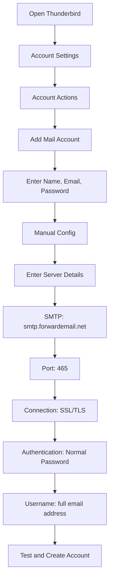

# SMTP-Integrationsbeispiele {#smtp-integration-examples}

## Inhaltsverzeichnis {#table-of-contents}

* [Vorwort](#foreword)
* [So funktioniert die SMTP-Verarbeitung von Forward Email](#how-forward-emails-smtp-processing-works)
  * [E-Mail-Warteschlange und Wiederholungssystem](#email-queue-and-retry-system)
  * [Für absolute Zuverlässigkeit](#dummy-proofed-for-reliability)
* [Node.js-Integration](#nodejs-integration)
  * [Verwenden von Nodemailer](#using-nodemailer)
  * [Verwenden von Express.js](#using-expressjs)
* [Python-Integration](#python-integration)
  * [Verwenden von smtplib](#using-smtplib)
  * [Verwenden von Django](#using-django)
* [PHP-Integration](#php-integration)
  * [Verwenden von PHPMailer](#using-phpmailer)
  * [Verwenden von Laravel](#using-laravel)
* [Ruby-Integration](#ruby-integration)
  * [Verwenden von Ruby Mail Gem](#using-ruby-mail-gem)
* [Java-Integration](#java-integration)
  * [Verwenden der Java Mail API](#using-javamail-api)
* [E-Mail-Client-Konfiguration](#email-client-configuration)
  * [Thunderbird](#thunderbird)
  * [Apple Mail](#apple-mail)
  * [Gmail (E-Mail senden als)](#gmail-send-mail-as)
* [Fehlerbehebung](#troubleshooting)
  * [Häufige Probleme und Lösungen](#common-issues-and-solutions)
  * [Hilfe bekommen](#getting-help)
* [Weitere Ressourcen](#additional-resources)
* [Abschluss](#conclusion)

## Vorwort {#foreword}

Diese Anleitung bietet detaillierte Beispiele zur Integration des SMTP-Dienstes von Forward Email mithilfe verschiedener Programmiersprachen, Frameworks und E-Mail-Clients. Unser SMTP-Dienst ist zuverlässig, sicher und lässt sich problemlos in Ihre bestehenden Anwendungen integrieren.

## Funktionsweise der SMTP-Verarbeitung beim Weiterleiten von E-Mails {#how-forward-emails-smtp-processing-works}

Bevor wir uns in die Integrationsbeispiele vertiefen, ist es wichtig zu verstehen, wie unser SMTP-Dienst E-Mails verarbeitet:

### E-Mail-Warteschlange und Wiederholungssystem {#email-queue-and-retry-system}

Wenn Sie eine E-Mail per SMTP an unsere Server senden:

1. **Erstverarbeitung**: Die E-Mail wird validiert, auf Malware geprüft und mit Spamfiltern abgeglichen.
2. **Smart Queuing**: E-Mails werden zur Zustellung in ein ausgeklügeltes Warteschlangensystem gestellt.
3. **Intelligenter Wiederholungsmechanismus**: Bei vorübergehenden Zustellungsfehlern führt unser System Folgendes durch:
* Analyse der Fehlerantwort mithilfe unserer Funktion `getBounceInfo`
* Feststellung, ob das Problem vorübergehend (z. B. „Später erneut versuchen“, „vorübergehend verschoben“) oder dauerhaft (z. B. „Benutzer unbekannt“) ist.
* Bei vorübergehenden Problemen wird die E-Mail zur Wiederholung markiert.
* Bei dauerhaften Problemen wird eine Benachrichtigung über eine Zurückweisung generiert.
4. **5-tägige Wiederholungsfrist**: Wir versuchen die Zustellung bis zu 5 Tage lang erneut (ähnlich wie bei Industriestandards wie Postfix), um vorübergehenden Problemen Zeit zur Behebung zu geben.
5. **Benachrichtigungen zum Zustellungsstatus**: Absender erhalten Benachrichtigungen über den Status ihrer E-Mails (zugestellt, verzögert oder zurückgewiesen).

> \[!NOTE]
> Nach erfolgreicher Zustellung werden ausgehende SMTP-E-Mail-Inhalte nach einer konfigurierbaren Aufbewahrungsfrist (standardmäßig 30 Tage) aus Sicherheits- und Datenschutzgründen redigiert. Es bleibt lediglich eine Platzhalternachricht mit der erfolgreichen Zustellung erhalten.

### Dummy-geprüft für Zuverlässigkeit {#dummy-proofed-for-reliability}

Unser System ist für die Handhabung verschiedener Sonderfälle ausgelegt:

* Wird eine Sperrliste erkannt, wird die E-Mail automatisch erneut zugestellt.
* Bei Netzwerkproblemen wird die Zustellung erneut versucht.
* Ist das Postfach des Empfängers voll, wird der Zustellversuch später wiederholt.
* Ist der Empfangsserver vorübergehend nicht erreichbar, versuchen wir es erneut.

Dieser Ansatz verbessert die Zustellraten erheblich und gewährleistet gleichzeitig Datenschutz und Sicherheit.

## Node.js-Integration {#nodejs-integration}

### Nodemailer verwenden {#using-nodemailer}

[Nodemailer](https://nodemailer.com/) ist ein beliebtes Modul zum Senden von E-Mails aus Node.js-Anwendungen.

```javascript
const nodemailer = require('nodemailer');

// Create a transporter object
const transporter = nodemailer.createTransport({
  host: 'smtp.forwardemail.net',
  port: 465,
  secure: true, // Use TLS
  auth: {
    user: 'your-username@your-domain.com',
    pass: 'your-password'
  }
});

// Send mail with defined transport object
async function sendEmail() {
  try {
    const info = await transporter.sendMail({
      from: '"Your Name" <your-username@your-domain.com>',
      to: 'recipient@example.com',
      subject: 'Hello from Forward Email',
      text: 'Hello world! This is a test email sent using Nodemailer and Forward Email SMTP.',
      html: '<b>Hello world!</b> This is a test email sent using Nodemailer and Forward Email SMTP.'
    });

    console.log('Message sent: %s', info.messageId);
  } catch (error) {
    console.error('Error sending email:', error);
  }
}

sendEmail();
```

### Verwenden von Express.js {#using-expressjs}

So integrieren Sie Forward Email SMTP in eine Express.js-Anwendung:

```javascript
const express = require('express');
const nodemailer = require('nodemailer');
const app = express();
const port = 3000;

app.use(express.json());

// Configure email transporter
const transporter = nodemailer.createTransport({
  host: 'smtp.forwardemail.net',
  port: 465,
  secure: true,
  auth: {
    user: 'your-username@your-domain.com',
    pass: 'your-password'
  }
});

// API endpoint for sending emails
app.post('/send-email', async (req, res) => {
  const { to, subject, text, html } = req.body;

  try {
    const info = await transporter.sendMail({
      from: '"Your App" <your-username@your-domain.com>',
      to,
      subject,
      text,
      html
    });

    res.status(200).json({
      success: true,
      messageId: info.messageId
    });
  } catch (error) {
    console.error('Error sending email:', error);
    res.status(500).json({
      success: false,
      error: error.message
    });
  }
});

app.listen(port, () => {
  console.log(`Server running at http://localhost:${port}`);
});
```

## Python-Integration {#python-integration}

### Verwenden von smtplib {#using-smtplib}

```python
import smtplib
from email.mime.text import MIMEText
from email.mime.multipart import MIMEMultipart

# Email configuration
sender_email = "your-username@your-domain.com"
receiver_email = "recipient@example.com"
password = "your-password"

# Create message
message = MIMEMultipart("alternative")
message["Subject"] = "Hello from Forward Email"
message["From"] = sender_email
message["To"] = receiver_email

# Create the plain-text and HTML version of your message
text = "Hello world! This is a test email sent using Python and Forward Email SMTP."
html = "<html><body><b>Hello world!</b> This is a test email sent using Python and Forward Email SMTP.</body></html>"

# Turn these into plain/html MIMEText objects
part1 = MIMEText(text, "plain")
part2 = MIMEText(html, "html")

# Add HTML/plain-text parts to MIMEMultipart message
message.attach(part1)
message.attach(part2)

# Send email
try:
    server = smtplib.SMTP_SSL("smtp.forwardemail.net", 465)
    server.login(sender_email, password)
    server.sendmail(sender_email, receiver_email, message.as_string())
    server.quit()
    print("Email sent successfully!")
except Exception as e:
    print(f"Error sending email: {e}")
```

### Verwenden von Django {#using-django}

Fügen Sie für Django-Anwendungen Folgendes zu Ihrem `settings.py` hinzu:

```python
# Email settings
EMAIL_BACKEND = 'django.core.mail.backends.smtp.EmailBackend'
EMAIL_HOST = 'smtp.forwardemail.net'
EMAIL_PORT = 465
EMAIL_USE_SSL = True
EMAIL_HOST_USER = 'your-username@your-domain.com'
EMAIL_HOST_PASSWORD = 'your-password'
DEFAULT_FROM_EMAIL = 'your-username@your-domain.com'
```

Senden Sie dann E-Mails in Ihren Ansichten:

```python
from django.core.mail import send_mail

def send_email_view(request):
    send_mail(
        'Subject here',
        'Here is the message.',
        'from@your-domain.com',
        ['to@example.com'],
        fail_silently=False,
        html_message='<b>Here is the HTML message.</b>'
    )
    return HttpResponse('Email sent!')
```

## PHP-Integration {#php-integration}

### Verwendung von PHPMailer {#using-phpmailer}

```php
<?php
use PHPMailer\PHPMailer\PHPMailer;
use PHPMailer\PHPMailer\Exception;

require 'vendor/autoload.php';

$mail = new PHPMailer(true);

try {
    // Server settings
    $mail->isSMTP();
    $mail->Host       = 'smtp.forwardemail.net';
    $mail->SMTPAuth   = true;
    $mail->Username   = 'your-username@your-domain.com';
    $mail->Password   = 'your-password';
    $mail->SMTPSecure = PHPMailer::ENCRYPTION_SMTPS;
    $mail->Port       = 465;

    // Recipients
    $mail->setFrom('your-username@your-domain.com', 'Your Name');
    $mail->addAddress('recipient@example.com', 'Recipient Name');
    $mail->addReplyTo('your-username@your-domain.com', 'Your Name');

    // Content
    $mail->isHTML(true);
    $mail->Subject = 'Hello from Forward Email';
    $mail->Body    = '<b>Hello world!</b> This is a test email sent using PHPMailer and Forward Email SMTP.';
    $mail->AltBody = 'Hello world! This is a test email sent using PHPMailer and Forward Email SMTP.';

    $mail->send();
    echo 'Message has been sent';
} catch (Exception $e) {
    echo "Message could not be sent. Mailer Error: {$mail->ErrorInfo}";
}
```

### Verwendung von Laravel {#using-laravel}

Aktualisieren Sie für Laravel-Anwendungen Ihre Datei `.env`:

```sh
MAIL_MAILER=smtp
MAIL_HOST=smtp.forwardemail.net
MAIL_PORT=465
MAIL_USERNAME=your-username@your-domain.com
MAIL_PASSWORD=your-password
MAIL_ENCRYPTION=ssl
MAIL_FROM_ADDRESS=your-username@your-domain.com
MAIL_FROM_NAME="${APP_NAME}"
```

Senden Sie dann E-Mails mithilfe der Mail-Fassade von Laravel:

```php
<?php

namespace App\Http\Controllers;

use Illuminate\Http\Request;
use Illuminate\Support\Facades\Mail;
use App\Mail\WelcomeEmail;

class EmailController extends Controller
{
    public function sendEmail()
    {
        Mail::to('recipient@example.com')->send(new WelcomeEmail());

        return 'Email sent successfully!';
    }
}
```

## Ruby-Integration {#ruby-integration}

### Verwenden von Ruby Mail Gem {#using-ruby-mail-gem}

```ruby
require 'mail'

Mail.defaults do
  delivery_method :smtp, {
    address: 'smtp.forwardemail.net',
    port: 465,
    domain: 'your-domain.com',
    user_name: 'your-username@your-domain.com',
    password: 'your-password',
    authentication: 'plain',
    enable_starttls_auto: true,
    ssl: true
  }
end

mail = Mail.new do
  from     'your-username@your-domain.com'
  to       'recipient@example.com'
  subject  'Hello from Forward Email'

  text_part do
    body 'Hello world! This is a test email sent using Ruby Mail and Forward Email SMTP.'
  end

  html_part do
    content_type 'text/html; charset=UTF-8'
    body '<b>Hello world!</b> This is a test email sent using Ruby Mail and Forward Email SMTP.'
  end
end

mail.deliver!
puts "Email sent successfully!"
```

## Java-Integration {#java-integration}

### Verwenden der JavaMail-API {#using-javamail-api}

```java
import java.util.Properties;
import javax.mail.*;
import javax.mail.internet.*;

public class SendEmail {
    public static void main(String[] args) {
        // Sender's email and password
        final String username = "your-username@your-domain.com";
        final String password = "your-password";

        // SMTP server properties
        Properties props = new Properties();
        props.put("mail.smtp.auth", "true");
        props.put("mail.smtp.starttls.enable", "true");
        props.put("mail.smtp.host", "smtp.forwardemail.net");
        props.put("mail.smtp.port", "465");
        props.put("mail.smtp.socketFactory.port", "465");
        props.put("mail.smtp.socketFactory.class", "javax.net.ssl.SSLSocketFactory");

        // Create session with authenticator
        Session session = Session.getInstance(props,
            new javax.mail.Authenticator() {
                protected PasswordAuthentication getPasswordAuthentication() {
                    return new PasswordAuthentication(username, password);
                }
            });

        try {
            // Create message
            Message message = new MimeMessage(session);
            message.setFrom(new InternetAddress(username));
            message.setRecipients(Message.RecipientType.TO, InternetAddress.parse("recipient@example.com"));
            message.setSubject("Hello from Forward Email");

            // Create multipart message
            Multipart multipart = new MimeMultipart("alternative");

            // Text part
            BodyPart textPart = new MimeBodyPart();
            textPart.setText("Hello world! This is a test email sent using JavaMail and Forward Email SMTP.");

            // HTML part
            BodyPart htmlPart = new MimeBodyPart();
            htmlPart.setContent("<b>Hello world!</b> This is a test email sent using JavaMail and Forward Email SMTP.", "text/html");

            // Add parts to multipart
            multipart.addBodyPart(textPart);
            multipart.addBodyPart(htmlPart);

            // Set content
            message.setContent(multipart);

            // Send message
            Transport.send(message);

            System.out.println("Email sent successfully!");

        } catch (MessagingException e) {
            throw new RuntimeException(e);
        }
    }
}
```

## E-Mail-Client-Konfiguration {#email-client-configuration}

### Thunderbird {#thunderbird}



1. Öffnen Sie Thunderbird und gehen Sie zu den Kontoeinstellungen.
2. Klicken Sie auf „Kontoaktionen“ und wählen Sie „E-Mail-Konto hinzufügen“.
3. Geben Sie Ihren Namen, Ihre E-Mail-Adresse und Ihr Passwort ein.
4. Klicken Sie auf „Manuelle Konfiguration“ und geben Sie die folgenden Daten ein:
* Posteingangsserver:
* IMAP: imap.forwardemail.net, Port: 993, SSL/TLS
* POP3: pop3.forwardemail.net, Port: 995, SSL/TLS
* Postausgangsserver (SMTP): smtp.forwardemail.net, Port: 465, SSL/TLS
* Authentifizierung: Normales Passwort
* Benutzername: Ihre vollständige E-Mail-Adresse
5. Klicken Sie auf „Testen“ und dann auf „Fertig“.

### Apple Mail {#apple-mail}

1. Öffnen Sie Mail und gehen Sie zu Mail > Einstellungen > Konten.
2. Klicken Sie auf das „+“, um ein neues Konto hinzuzufügen.
3. Wählen Sie „Anderes E-Mail-Konto“ und klicken Sie auf „Weiter“.
4. Geben Sie Ihren Namen, Ihre E-Mail-Adresse und Ihr Passwort ein und klicken Sie anschließend auf „Anmelden“.
5. Falls die automatische Einrichtung fehlschlägt, geben Sie bitte folgende Daten ein:
* Posteingangsserver: imap.forwardemail.net (oder pop3.forwardemail.net für POP3)
* Postausgangsserver: smtp.forwardemail.net
* Benutzername: Ihre vollständige E-Mail-Adresse
* Passwort: Ihr Passwort
6. Klicken Sie auf „Anmelden“, um die Einrichtung abzuschließen

### Gmail (E-Mail senden als) {#gmail-send-mail-as}

1. Öffnen Sie Gmail und gehen Sie zu Einstellungen > Konten und Importieren.
2. Klicken Sie unter „E-Mail senden als“ auf „Weitere E-Mail-Adresse hinzufügen“.
3. Geben Sie Ihren Namen und Ihre E-Mail-Adresse ein und klicken Sie anschließend auf „Nächster Schritt“.
4. Geben Sie die folgenden SMTP-Serverdaten ein:
* SMTP-Server: smtp.forwardemail.net
* Port: 465
* Benutzername: Ihre vollständige E-Mail-Adresse
* Passwort: Ihr Passwort
* Wählen Sie „Gesicherte Verbindung mit SSL“ aus.
5. Klicken Sie auf „Konto hinzufügen“ und bestätigen Sie Ihre E-Mail-Adresse.

## Fehlerbehebung {#troubleshooting}

### Häufige Probleme und Lösungen {#common-issues-and-solutions}

1. **Authentifizierung fehlgeschlagen**
* Bestätigen Sie Ihren Benutzernamen (vollständige E-Mail-Adresse) und Ihr Passwort.
* Stellen Sie sicher, dass Sie den richtigen Port verwenden (465 für SSL/TLS).
* Prüfen Sie, ob für Ihr Konto SMTP-Zugriff aktiviert ist.

2. **Verbindungs-Timeout**
* Überprüfen Sie Ihre Internetverbindung.
* Stellen Sie sicher, dass die Firewall-Einstellungen den SMTP-Verkehr nicht blockieren.
* Versuchen Sie es mit einem anderen Port (587 mit STARTTLS).

3. **Nachricht abgelehnt**
* Stellen Sie sicher, dass Ihre Absenderadresse mit Ihrer authentifizierten E-Mail-Adresse übereinstimmt.
* Prüfen Sie, ob Ihre IP-Adresse auf der schwarzen Liste steht.
* Stellen Sie sicher, dass Ihr Nachrichteninhalt keine Spamfilter auslöst.

4. **TLS/SSL-Fehler**
* Aktualisieren Sie Ihre Anwendung/Bibliothek, um moderne TLS-Versionen zu unterstützen.
* Stellen Sie sicher, dass die CA-Zertifikate Ihres Systems aktuell sind.
* Versuchen Sie explizites TLS anstelle von implizitem TLS.

### Hilfe erhalten {#getting-help}

Wenn Sie auf Probleme stoßen, die hier nicht behandelt werden, gehen Sie bitte wie folgt vor:

1. Häufig gestellte Fragen finden Sie in unserem [FAQ-Seite](/faq).
2. Detaillierte Informationen finden Sie in unserem [Blogbeitrag zur E-Mail-Zustellung](/blog/docs/best-email-forwarding-service).
3. Kontaktieren Sie unser Support-Team unter <support@forwardemail.net>.

## Zusätzliche Ressourcen {#additional-resources}

* [E-Mail-Dokumentation weiterleiten](/docs)
* [SMTP-Server-Limits und -Konfiguration](/faq#what-are-your-outbound-smtp-limits)
* [Leitfaden zu Best Practices für E-Mails](/blog/docs/best-email-forwarding-service)
* [Sicherheitspraktiken](/security)

## Fazit {#conclusion}

Der SMTP-Dienst von Forward Email bietet eine zuverlässige, sichere und datenschutzfreundliche Möglichkeit, E-Mails aus Ihren Anwendungen und E-Mail-Clients zu versenden. Dank unseres intelligenten Warteschlangensystems, der 5-tägigen Wiederholungsfunktion und umfassender Benachrichtigungen zum Zustellstatus können Sie sicher sein, dass Ihre E-Mails ihr Ziel erreichen.

Für erweiterte Anwendungsfälle oder benutzerdefinierte Integrationen wenden Sie sich bitte an unser Supportteam.