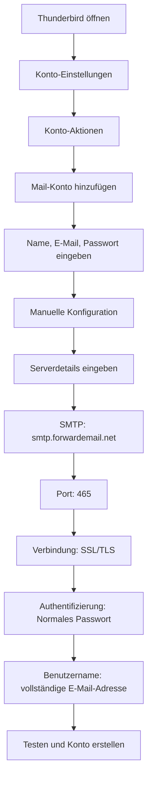

# SMTP-Integrationsbeispiele {#smtp-integration-examples}


## Inhaltsverzeichnis {#table-of-contents}

* [Vorwort](#foreword)
* [Wie die SMTP-Verarbeitung von Forward Email funktioniert](#how-forward-emails-smtp-processing-works)
  * [E-Mail-Warteschlange und Wiederholsystem](#email-queue-and-retry-system)
  * [Einfach und zuverlässig gestaltet](#dummy-proofed-for-reliability)
* [Node.js-Integration](#nodejs-integration)
  * [Verwendung von Nodemailer](#using-nodemailer)
  * [Verwendung von Express.js](#using-expressjs)
* [Python-Integration](#python-integration)
  * [Verwendung von smtplib](#using-smtplib)
  * [Verwendung von Django](#using-django)
* [PHP-Integration](#php-integration)
  * [Verwendung von PHPMailer](#using-phpmailer)
  * [Verwendung von Laravel](#using-laravel)
* [Ruby-Integration](#ruby-integration)
  * [Verwendung des Ruby Mail Gems](#using-ruby-mail-gem)
* [Java-Integration](#java-integration)
  * [Verwendung der JavaMail API](#using-javamail-api)
* [E-Mail-Client-Konfiguration](#email-client-configuration)
  * [Thunderbird](#thunderbird)
  * [Apple Mail](#apple-mail)
  * [Gmail (Senden als)](#gmail-send-mail-as)
* [Fehlerbehebung](#troubleshooting)
  * [Häufige Probleme und Lösungen](#common-issues-and-solutions)
  * [Hilfe erhalten](#getting-help)
* [Zusätzliche Ressourcen](#additional-resources)
* [Fazit](#conclusion)


## Vorwort {#foreword}

Dieser Leitfaden bietet detaillierte Beispiele, wie man den SMTP-Dienst von Forward Email mit verschiedenen Programmiersprachen, Frameworks und E-Mail-Clients integriert. Unser SMTP-Dienst ist darauf ausgelegt, zuverlässig, sicher und einfach in Ihre bestehenden Anwendungen integrierbar zu sein.


## Wie die SMTP-Verarbeitung von Forward Email funktioniert {#how-forward-emails-smtp-processing-works}

Bevor wir zu den Integrationsbeispielen kommen, ist es wichtig zu verstehen, wie unser SMTP-Dienst E-Mails verarbeitet:

### E-Mail-Warteschlange und Wiederholsystem {#email-queue-and-retry-system}

Wenn Sie eine E-Mail per SMTP an unsere Server senden:

1. **Erstverarbeitung**: Die E-Mail wird validiert, auf Malware gescannt und gegen Spamfilter geprüft
2. **Intelligente Warteschlange**: E-Mails werden in ein ausgeklügeltes Warteschlangensystem zur Zustellung eingereiht
3. **Intelligenter Wiederholmechanismus**: Falls die Zustellung vorübergehend fehlschlägt, wird unser System:
   * Die Fehlermeldung mit unserer Funktion `getBounceInfo` analysieren
   * Bestimmen, ob das Problem temporär (z. B. „später erneut versuchen“, „vorübergehend zurückgestellt“) oder dauerhaft (z. B. „Benutzer unbekannt“) ist
   * Bei temporären Problemen die E-Mail für einen erneuten Zustellversuch markieren
   * Bei dauerhaften Problemen eine Bounce-Benachrichtigung erzeugen
4. **5-Tage-Wiederholzeitraum**: Wir versuchen die Zustellung bis zu 5 Tage lang erneut (ähnlich wie branchenübliche Standards wie Postfix), um temporäre Probleme zu beheben
5. **Zustellstatus-Benachrichtigungen**: Absender erhalten Benachrichtigungen über den Status ihrer E-Mails (zugestellt, verzögert oder zurückgewiesen)

> \[!NOTE]
> Nach erfolgreicher Zustellung wird der Inhalt ausgehender SMTP-E-Mails nach einer konfigurierbaren Aufbewahrungsfrist (Standard 30 Tage) aus Sicherheits- und Datenschutzgründen entfernt. Es bleibt nur eine Platzhalternachricht, die die erfolgreiche Zustellung anzeigt.

### Einfach und zuverlässig gestaltet {#dummy-proofed-for-reliability}

Unser System ist darauf ausgelegt, verschiedene Randfälle zu bewältigen:

* Wird eine Blockliste erkannt, wird die E-Mail automatisch erneut zugestellt
* Bei Netzwerkproblemen erfolgt ein erneuter Zustellversuch
* Ist das Postfach des Empfängers voll, wird das System später erneut versuchen
* Ist der empfangende Server vorübergehend nicht erreichbar, versuchen wir es weiter

Dieser Ansatz verbessert die Zustellraten erheblich und gewährleistet gleichzeitig Datenschutz und Sicherheit.


## Node.js-Integration {#nodejs-integration}

### Verwendung von Nodemailer {#using-nodemailer}

[Nodemailer](https://nodemailer.com/) ist ein beliebtes Modul zum Versenden von E-Mails aus Node.js-Anwendungen.

```javascript
const nodemailer = require('nodemailer');

// Create a transporter object
const transporter = nodemailer.createTransport({
  host: 'smtp.forwardemail.net',
  port: 465,
  secure: true, // Use TLS
  auth: {
    user: 'your-username@your-domain.com',
    pass: 'your-password'
  }
});

// Send mail with defined transport object
async function sendEmail() {
  try {
    const info = await transporter.sendMail({
      from: '"Your Name" <your-username@your-domain.com>',
      to: 'recipient@example.com',
      subject: 'Hello from Forward Email',
      text: 'Hello world! This is a test email sent using Nodemailer and Forward Email SMTP.',
      html: '<b>Hello world!</b> This is a test email sent using Nodemailer and Forward Email SMTP.'
    });

    console.log('Message sent: %s', info.messageId);
  } catch (error) {
    console.error('Error sending email:', error);
  }
}

sendEmail();
```
### Verwendung von Express.js {#using-expressjs}

So integrieren Sie Forward Email SMTP in eine Express.js-Anwendung:

```javascript
const express = require('express');
const nodemailer = require('nodemailer');
const app = express();
const port = 3000;

app.use(express.json());

// Konfigurieren des E-Mail-Transporters
const transporter = nodemailer.createTransport({
  host: 'smtp.forwardemail.net',
  port: 465,
  secure: true,
  auth: {
    user: 'your-username@your-domain.com',
    pass: 'your-password'
  }
});

// API-Endpunkt zum Senden von E-Mails
app.post('/send-email', async (req, res) => {
  const { to, subject, text, html } = req.body;

  try {
    const info = await transporter.sendMail({
      from: '"Your App" <your-username@your-domain.com>',
      to,
      subject,
      text,
      html
    });

    res.status(200).json({
      success: true,
      messageId: info.messageId
    });
  } catch (error) {
    console.error('Fehler beim Senden der E-Mail:', error);
    res.status(500).json({
      success: false,
      error: error.message
    });
  }
});

app.listen(port, () => {
  console.log(`Server läuft unter http://localhost:${port}`);
});
```


## Python-Integration {#python-integration}

### Verwendung von smtplib {#using-smtplib}

```python
import smtplib
from email.mime.text import MIMEText
from email.mime.multipart import MIMEMultipart

# E-Mail-Konfiguration
sender_email = "your-username@your-domain.com"
receiver_email = "recipient@example.com"
password = "your-password"

# Nachricht erstellen
message = MIMEMultipart("alternative")
message["Subject"] = "Hallo von Forward Email"
message["From"] = sender_email
message["To"] = receiver_email

# Erstellen der Text- und HTML-Version der Nachricht
text = "Hallo Welt! Dies ist eine Test-E-Mail, die mit Python und Forward Email SMTP gesendet wurde."
html = "<html><body><b>Hallo Welt!</b> Dies ist eine Test-E-Mail, die mit Python und Forward Email SMTP gesendet wurde.</body></html>"

# Umwandeln in plain/html MIMEText-Objekte
part1 = MIMEText(text, "plain")
part2 = MIMEText(html, "html")

# HTML-/Plain-Text-Teile zur MIMEMultipart-Nachricht hinzufügen
message.attach(part1)
message.attach(part2)

# E-Mail senden
try:
    server = smtplib.SMTP_SSL("smtp.forwardemail.net", 465)
    server.login(sender_email, password)
    server.sendmail(sender_email, receiver_email, message.as_string())
    server.quit()
    print("E-Mail erfolgreich gesendet!")
except Exception as e:
    print(f"Fehler beim Senden der E-Mail: {e}")
```

### Verwendung von Django {#using-django}

Für Django-Anwendungen fügen Sie Folgendes zu Ihrer `settings.py` hinzu:

```python
# E-Mail-Einstellungen
EMAIL_BACKEND = 'django.core.mail.backends.smtp.EmailBackend'
EMAIL_HOST = 'smtp.forwardemail.net'
EMAIL_PORT = 465
EMAIL_USE_SSL = True
EMAIL_HOST_USER = 'your-username@your-domain.com'
EMAIL_HOST_PASSWORD = 'your-password'
DEFAULT_FROM_EMAIL = 'your-username@your-domain.com'
```

Dann senden Sie E-Mails in Ihren Views:

```python
from django.core.mail import send_mail

def send_email_view(request):
    send_mail(
        'Betreff hier',
        'Hier ist die Nachricht.',
        'from@your-domain.com',
        ['to@example.com'],
        fail_silently=False,
        html_message='<b>Hier ist die HTML-Nachricht.</b>'
    )
    return HttpResponse('E-Mail gesendet!')
```


## PHP-Integration {#php-integration}

### Verwendung von PHPMailer {#using-phpmailer}

```php
<?php
use PHPMailer\PHPMailer\PHPMailer;
use PHPMailer\PHPMailer\Exception;

require 'vendor/autoload.php';

$mail = new PHPMailer(true);

try {
    // Server-Einstellungen
    $mail->isSMTP();
    $mail->Host       = 'smtp.forwardemail.net';
    $mail->SMTPAuth   = true;
    $mail->Username   = 'your-username@your-domain.com';
    $mail->Password   = 'your-password';
    $mail->SMTPSecure = PHPMailer::ENCRYPTION_SMTPS;
    $mail->Port       = 465;

    // Empfänger
    $mail->setFrom('your-username@your-domain.com', 'Ihr Name');
    $mail->addAddress('recipient@example.com', 'Empfängername');
    $mail->addReplyTo('your-username@your-domain.com', 'Ihr Name');

    // Inhalt
    $mail->isHTML(true);
    $mail->Subject = 'Hallo von Forward Email';
    $mail->Body    = '<b>Hallo Welt!</b> Dies ist eine Test-E-Mail, die mit PHPMailer und Forward Email SMTP gesendet wurde.';
    $mail->AltBody = 'Hallo Welt! Dies ist eine Test-E-Mail, die mit PHPMailer und Forward Email SMTP gesendet wurde.';

    $mail->send();
    echo 'Nachricht wurde gesendet';
} catch (Exception $e) {
    echo "Nachricht konnte nicht gesendet werden. Mailer-Fehler: {$mail->ErrorInfo}";
}
```
### Verwendung von Laravel {#using-laravel}

Für Laravel-Anwendungen aktualisieren Sie Ihre `.env`-Datei:

```sh
MAIL_MAILER=smtp
MAIL_HOST=smtp.forwardemail.net
MAIL_PORT=465
MAIL_USERNAME=your-username@your-domain.com
MAIL_PASSWORD=your-password
MAIL_ENCRYPTION=ssl
MAIL_FROM_ADDRESS=your-username@your-domain.com
MAIL_FROM_NAME="${APP_NAME}"
```

Senden Sie dann E-Mails mit der Mail-Fassade von Laravel:

```php
<?php

namespace App\Http\Controllers;

use Illuminate\Http\Request;
use Illuminate\Support\Facades\Mail;
use App\Mail\WelcomeEmail;

class EmailController extends Controller
{
    public function sendEmail()
    {
        Mail::to('recipient@example.com')->send(new WelcomeEmail());

        return 'E-Mail erfolgreich gesendet!';
    }
}
```


## Ruby-Integration {#ruby-integration}

### Verwendung des Ruby Mail Gems {#using-ruby-mail-gem}

```ruby
require 'mail'

Mail.defaults do
  delivery_method :smtp, {
    address: 'smtp.forwardemail.net',
    port: 465,
    domain: 'your-domain.com',
    user_name: 'your-username@your-domain.com',
    password: 'your-password',
    authentication: 'plain',
    enable_starttls_auto: true,
    ssl: true
  }
end

mail = Mail.new do
  from     'your-username@your-domain.com'
  to       'recipient@example.com'
  subject  'Hallo von Forward Email'

  text_part do
    body 'Hallo Welt! Dies ist eine Test-E-Mail, die mit Ruby Mail und Forward Email SMTP gesendet wurde.'
  end

  html_part do
    content_type 'text/html; charset=UTF-8'
    body '<b>Hallo Welt!</b> Dies ist eine Test-E-Mail, die mit Ruby Mail und Forward Email SMTP gesendet wurde.'
  end
end

mail.deliver!
puts "E-Mail erfolgreich gesendet!"
```


## Java-Integration {#java-integration}

### Verwendung der JavaMail API {#using-javamail-api}

```java
import java.util.Properties;
import javax.mail.*;
import javax.mail.internet.*;

public class SendEmail {
    public static void main(String[] args) {
        // E-Mail und Passwort des Absenders
        final String username = "your-username@your-domain.com";
        final String password = "your-password";

        // SMTP-Server-Eigenschaften
        Properties props = new Properties();
        props.put("mail.smtp.auth", "true");
        props.put("mail.smtp.starttls.enable", "true");
        props.put("mail.smtp.host", "smtp.forwardemail.net");
        props.put("mail.smtp.port", "465");
        props.put("mail.smtp.socketFactory.port", "465");
        props.put("mail.smtp.socketFactory.class", "javax.net.ssl.SSLSocketFactory");

        // Sitzung mit Authentifikator erstellen
        Session session = Session.getInstance(props,
            new javax.mail.Authenticator() {
                protected PasswordAuthentication getPasswordAuthentication() {
                    return new PasswordAuthentication(username, password);
                }
            });

        try {
            // Nachricht erstellen
            Message message = new MimeMessage(session);
            message.setFrom(new InternetAddress(username));
            message.setRecipients(Message.RecipientType.TO, InternetAddress.parse("recipient@example.com"));
            message.setSubject("Hallo von Forward Email");

            // Multipart-Nachricht erstellen
            Multipart multipart = new MimeMultipart("alternative");

            // Textteil
            BodyPart textPart = new MimeBodyPart();
            textPart.setText("Hallo Welt! Dies ist eine Test-E-Mail, die mit JavaMail und Forward Email SMTP gesendet wurde.");

            // HTML-Teil
            BodyPart htmlPart = new MimeBodyPart();
            htmlPart.setContent("<b>Hallo Welt!</b> Dies ist eine Test-E-Mail, die mit JavaMail und Forward Email SMTP gesendet wurde.", "text/html");

            // Teile zum Multipart hinzufügen
            multipart.addBodyPart(textPart);
            multipart.addBodyPart(htmlPart);

            // Inhalt setzen
            message.setContent(multipart);

            // Nachricht senden
            Transport.send(message);

            System.out.println("E-Mail erfolgreich gesendet!");

        } catch (MessagingException e) {
            throw new RuntimeException(e);
        }
    }
}
```


## E-Mail-Client-Konfiguration {#email-client-configuration}

### Thunderbird {#thunderbird}


```mermaid
flowchart TD
    A[Thunderbird öffnen] --> B[Konto-Einstellungen]
    B --> C[Konto-Aktionen]
    C --> D[Mail-Konto hinzufügen]
    D --> E[Name, E-Mail, Passwort eingeben]
    E --> F[Manuelle Konfiguration]
    F --> G[Serverdetails eingeben]
    G --> H[SMTP: smtp.forwardemail.net]
    H --> I[Port: 465]
    I --> J[Verbindung: SSL/TLS]
    J --> K[Authentifizierung: Normales Passwort]
    K --> L[Benutzername: vollständige E-Mail-Adresse]
    L --> M[Testen und Konto erstellen]
```
1. Öffnen Sie Thunderbird und gehen Sie zu Kontoeinstellungen  
2. Klicken Sie auf „Kontenaktionen“ und wählen Sie „E-Mail-Konto hinzufügen“  
3. Geben Sie Ihren Namen, Ihre E-Mail-Adresse und Ihr Passwort ein  
4. Klicken Sie auf „Manuelle Konfiguration“ und geben Sie die folgenden Daten ein:  
   * Eingehender Server:  
     * IMAP: imap.forwardemail.net, Port: 993, SSL/TLS  
     * POP3: pop3.forwardemail.net, Port: 995, SSL/TLS  
   * Ausgehender Server (SMTP): smtp.forwardemail.net, Port: 465, SSL/TLS  
   * Authentifizierung: Normales Passwort  
   * Benutzername: Ihre vollständige E-Mail-Adresse  
5. Klicken Sie auf „Testen“ und dann auf „Fertig“  

### Apple Mail {#apple-mail}

1. Öffnen Sie Mail und gehen Sie zu Mail > Einstellungen > Accounts  
2. Klicken Sie auf die „+“-Schaltfläche, um ein neues Konto hinzuzufügen  
3. Wählen Sie „Anderes E-Mail-Konto“ und klicken Sie auf „Fortfahren“  
4. Geben Sie Ihren Namen, Ihre E-Mail-Adresse und Ihr Passwort ein und klicken Sie auf „Anmelden“  
5. Wenn die automatische Einrichtung fehlschlägt, geben Sie die folgenden Daten ein:  
   * Eingehender Mailserver: imap.forwardemail.net (oder pop3.forwardemail.net für POP3)  
   * Ausgehender Mailserver: smtp.forwardemail.net  
   * Benutzername: Ihre vollständige E-Mail-Adresse  
   * Passwort: Ihr Passwort  
6. Klicken Sie auf „Anmelden“, um die Einrichtung abzuschließen  

### Gmail (Senden als) {#gmail-send-mail-as}

1. Öffnen Sie Gmail und gehen Sie zu Einstellungen > Konten und Import  
2. Unter „Senden als“ klicken Sie auf „Weitere E-Mail-Adresse hinzufügen“  
3. Geben Sie Ihren Namen und Ihre E-Mail-Adresse ein und klicken Sie auf „Nächster Schritt“  
4. Geben Sie die folgenden SMTP-Serverdaten ein:  
   * SMTP-Server: smtp.forwardemail.net  
   * Port: 465  
   * Benutzername: Ihre vollständige E-Mail-Adresse  
   * Passwort: Ihr Passwort  
   * Wählen Sie „Gesicherte Verbindung mit SSL“  
5. Klicken Sie auf „Konto hinzufügen“ und verifizieren Sie Ihre E-Mail-Adresse  

## Fehlerbehebung {#troubleshooting}

### Häufige Probleme und Lösungen {#common-issues-and-solutions}

1. **Authentifizierung fehlgeschlagen**  
   * Überprüfen Sie Ihren Benutzernamen (vollständige E-Mail-Adresse) und Ihr Passwort  
   * Stellen Sie sicher, dass Sie den richtigen Port verwenden (465 für SSL/TLS)  
   * Prüfen Sie, ob Ihr Konto SMTP-Zugriff aktiviert hat  

2. **Verbindungszeitüberschreitung**  
   * Überprüfen Sie Ihre Internetverbindung  
   * Stellen Sie sicher, dass Ihre Firewall SMTP-Verkehr nicht blockiert  
   * Versuchen Sie Port 465 mit SSL/TLS (empfohlen) oder Port 587 mit STARTTLS  

3. **Nachricht abgelehnt**  
   * Stellen Sie sicher, dass Ihre „Von“-Adresse mit Ihrer authentifizierten E-Mail übereinstimmt  
   * Prüfen Sie, ob Ihre IP auf einer Blacklist steht  
   * Vergewissern Sie sich, dass der Inhalt Ihrer Nachricht keine Spamfilter auslöst  

4. **TLS/SSL-Fehler**  
   * Aktualisieren Sie Ihre Anwendung/Bibliothek, um moderne TLS-Versionen zu unterstützen  
   * Stellen Sie sicher, dass die CA-Zertifikate Ihres Systems aktuell sind  
   * Versuchen Sie explizites TLS statt implizitem TLS  

### Hilfe erhalten {#getting-help}

Wenn Sie auf Probleme stoßen, die hier nicht behandelt werden, bitte:  

1. Prüfen Sie unsere [FAQ-Seite](/faq) für häufige Fragen  
2. Lesen Sie unseren [Blogbeitrag zur E-Mail-Zustellung](/blog/docs/best-email-forwarding-service) für detaillierte Informationen  
3. Kontaktieren Sie unser Support-Team unter <support@forwardemail.net>  

## Zusätzliche Ressourcen {#additional-resources}

* [Forward Email Dokumentation](/docs)  
* [SMTP-Server-Limits und Konfiguration](/faq#what-are-your-outbound-smtp-limits)  
* [Leitfaden zu Best Practices für E-Mails](/blog/docs/best-email-forwarding-service)  
* [Sicherheitspraktiken](/security)  

## Fazit {#conclusion}

Der SMTP-Dienst von Forward Email bietet eine zuverlässige, sichere und datenschutzorientierte Möglichkeit, E-Mails von Ihren Anwendungen und E-Mail-Clients zu senden. Mit unserem intelligenten Warteschlangensystem, dem 5-Tage-Wiederholungsmechanismus und umfassenden Zustellstatusbenachrichtigungen können Sie sicher sein, dass Ihre E-Mails ihr Ziel erreichen.  

Für fortgeschrittene Anwendungsfälle oder individuelle Integrationen kontaktieren Sie bitte unser Support-Team.
