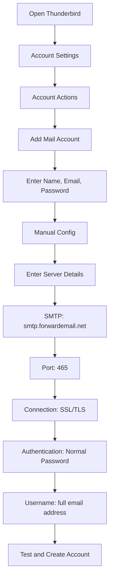

# Ejemplos de integración SMTP {#smtp-integration-examples}

## Tabla de contenido {#table-of-contents}

* [Prefacio](#foreword)
* [Cómo funciona el procesamiento SMTP de Forward Email](#how-forward-emails-smtp-processing-works)
  * [Sistema de cola de correo electrónico y reintentos](#email-queue-and-retry-system)
  * [A prueba de tontos para mayor confiabilidad](#dummy-proofed-for-reliability)
* [Integración con Node.js](#nodejs-integration)
  * [Usando Nodemailer](#using-nodemailer)
  * [Usando Express.js](#using-expressjs)
* [Integración de Python](#python-integration)
  * [Usando smtplib](#using-smtplib)
  * [Usando Django](#using-django)
* [Integración PHP](#php-integration)
  * [Usando PHPMailer](#using-phpmailer)
  * [Usando Laravel](#using-laravel)
* [Integración de Ruby](#ruby-integration)
  * [Uso de Ruby Mail Gem](#using-ruby-mail-gem)
* [Integración con Java](#java-integration)
  * [Uso de la API de correo de Java](#using-javamail-api)
* [Configuración del cliente de correo electrónico](#email-client-configuration)
  * [Pájaro de trueno](#thunderbird)
  * [Correo de Apple](#apple-mail)
  * [Gmail (Enviar correo como)](#gmail-send-mail-as)
* [Solución de problemas](#troubleshooting)
  * [Problemas comunes y soluciones](#common-issues-and-solutions)
  * [Obtener ayuda](#getting-help)
* [Recursos adicionales](#additional-resources)
* [Conclusión](#conclusion)

## Prólogo {#foreword}

Esta guía proporciona ejemplos detallados de cómo integrarse con el servicio SMTP de Forward Email mediante diversos lenguajes de programación, frameworks y clientes de correo electrónico. Nuestro servicio SMTP está diseñado para ser confiable, seguro y fácil de integrar con sus aplicaciones existentes.

## Cómo funciona el procesamiento SMTP del reenvío de correo electrónico {#how-forward-emails-smtp-processing-works}

Antes de profundizar en los ejemplos de integración, es importante comprender cómo nuestro servicio SMTP procesa los correos electrónicos:

### Cola de correo electrónico y sistema de reintentos {#email-queue-and-retry-system}

Cuando envía un correo electrónico a través de SMTP a nuestros servidores:

1. **Procesamiento inicial**: El correo electrónico se valida, se analiza en busca de malware y se verifica con filtros de spam.
2. **Cola inteligente**: Los correos electrónicos se colocan en un sofisticado sistema de colas para su entrega.
3. **Mecanismo de reintento inteligente**: Si la entrega falla temporalmente, nuestro sistema:
* Analiza la respuesta de error mediante nuestra función `getBounceInfo`.
* Determina si el problema es temporal (p. ej., "inténtelo de nuevo más tarde", "aplazado temporalmente") o permanente (p. ej., "usuario desconocido").
* Para problemas temporales, se marca el correo electrónico para reintentarlo.
* Para problemas permanentes, se genera una notificación de rebote.
4. **Periodo de reintento de 5 días**: Reintentamos la entrega durante un máximo de 5 días (similar a los estándares de la industria como Postfix), lo que da tiempo a que los problemas temporales se resuelvan.
5. **Notificaciones de estado de entrega**: Los remitentes reciben notificaciones sobre el estado de sus correos electrónicos (entregados, retrasados o rebotados).

> \[!NOTE]
> Tras una entrega exitosa, el contenido del correo electrónico SMTP saliente se redacta tras un periodo de retención configurable (30 días por defecto) por motivos de seguridad y privacidad. Solo queda un mensaje de marcador de posición que indica la entrega exitosa.

### A prueba de manipulaciones para mayor confiabilidad {#dummy-proofed-for-reliability}

Nuestro sistema está diseñado para manejar diversos casos extremos:

* Si se detecta una lista negra, se volverá a intentar el envío automáticamente.
* Si hay problemas de red, se volverá a intentar la entrega.
* Si el buzón del destinatario está lleno, el sistema volverá a intentarlo más tarde.
* Si el servidor receptor no está disponible temporalmente, seguiremos intentándolo.

Este enfoque mejora significativamente las tasas de entrega manteniendo la privacidad y la seguridad.

## Integración con Node.js {#nodejs-integration}

### Usando Nodemailer {#using-nodemailer}

[Nodemailer](https://nodemailer.com/) es un módulo popular para enviar correos electrónicos desde aplicaciones Node.js.

```javascript
const nodemailer = require('nodemailer');

// Create a transporter object
const transporter = nodemailer.createTransport({
  host: 'smtp.forwardemail.net',
  port: 465,
  secure: true, // Use TLS
  auth: {
    user: 'your-username@your-domain.com',
    pass: 'your-password'
  }
});

// Send mail with defined transport object
async function sendEmail() {
  try {
    const info = await transporter.sendMail({
      from: '"Your Name" <your-username@your-domain.com>',
      to: 'recipient@example.com',
      subject: 'Hello from Forward Email',
      text: 'Hello world! This is a test email sent using Nodemailer and Forward Email SMTP.',
      html: '<b>Hello world!</b> This is a test email sent using Nodemailer and Forward Email SMTP.'
    });

    console.log('Message sent: %s', info.messageId);
  } catch (error) {
    console.error('Error sending email:', error);
  }
}

sendEmail();
```

### Usando Express.js {#using-expressjs}

A continuación se explica cómo integrar Forward Email SMTP con una aplicación Express.js:

```javascript
const express = require('express');
const nodemailer = require('nodemailer');
const app = express();
const port = 3000;

app.use(express.json());

// Configure email transporter
const transporter = nodemailer.createTransport({
  host: 'smtp.forwardemail.net',
  port: 465,
  secure: true,
  auth: {
    user: 'your-username@your-domain.com',
    pass: 'your-password'
  }
});

// API endpoint for sending emails
app.post('/send-email', async (req, res) => {
  const { to, subject, text, html } = req.body;

  try {
    const info = await transporter.sendMail({
      from: '"Your App" <your-username@your-domain.com>',
      to,
      subject,
      text,
      html
    });

    res.status(200).json({
      success: true,
      messageId: info.messageId
    });
  } catch (error) {
    console.error('Error sending email:', error);
    res.status(500).json({
      success: false,
      error: error.message
    });
  }
});

app.listen(port, () => {
  console.log(`Server running at http://localhost:${port}`);
});
```

## Integración de Python {#python-integration}

### Usando smtplib {#using-smtplib}

```python
import smtplib
from email.mime.text import MIMEText
from email.mime.multipart import MIMEMultipart

# Email configuration
sender_email = "your-username@your-domain.com"
receiver_email = "recipient@example.com"
password = "your-password"

# Create message
message = MIMEMultipart("alternative")
message["Subject"] = "Hello from Forward Email"
message["From"] = sender_email
message["To"] = receiver_email

# Create the plain-text and HTML version of your message
text = "Hello world! This is a test email sent using Python and Forward Email SMTP."
html = "<html><body><b>Hello world!</b> This is a test email sent using Python and Forward Email SMTP.</body></html>"

# Turn these into plain/html MIMEText objects
part1 = MIMEText(text, "plain")
part2 = MIMEText(html, "html")

# Add HTML/plain-text parts to MIMEMultipart message
message.attach(part1)
message.attach(part2)

# Send email
try:
    server = smtplib.SMTP_SSL("smtp.forwardemail.net", 465)
    server.login(sender_email, password)
    server.sendmail(sender_email, receiver_email, message.as_string())
    server.quit()
    print("Email sent successfully!")
except Exception as e:
    print(f"Error sending email: {e}")
```

### Usando Django {#using-django}

Para aplicaciones Django, agregue lo siguiente a su `settings.py`:

```python
# Email settings
EMAIL_BACKEND = 'django.core.mail.backends.smtp.EmailBackend'
EMAIL_HOST = 'smtp.forwardemail.net'
EMAIL_PORT = 465
EMAIL_USE_SSL = True
EMAIL_HOST_USER = 'your-username@your-domain.com'
EMAIL_HOST_PASSWORD = 'your-password'
DEFAULT_FROM_EMAIL = 'your-username@your-domain.com'
```

Luego envía correos electrónicos con tus opiniones:

```python
from django.core.mail import send_mail

def send_email_view(request):
    send_mail(
        'Subject here',
        'Here is the message.',
        'from@your-domain.com',
        ['to@example.com'],
        fail_silently=False,
        html_message='<b>Here is the HTML message.</b>'
    )
    return HttpResponse('Email sent!')
```

## Integración PHP {#php-integration}

### Usando PHPMailer {#using-phpmailer}

```php
<?php
use PHPMailer\PHPMailer\PHPMailer;
use PHPMailer\PHPMailer\Exception;

require 'vendor/autoload.php';

$mail = new PHPMailer(true);

try {
    // Server settings
    $mail->isSMTP();
    $mail->Host       = 'smtp.forwardemail.net';
    $mail->SMTPAuth   = true;
    $mail->Username   = 'your-username@your-domain.com';
    $mail->Password   = 'your-password';
    $mail->SMTPSecure = PHPMailer::ENCRYPTION_SMTPS;
    $mail->Port       = 465;

    // Recipients
    $mail->setFrom('your-username@your-domain.com', 'Your Name');
    $mail->addAddress('recipient@example.com', 'Recipient Name');
    $mail->addReplyTo('your-username@your-domain.com', 'Your Name');

    // Content
    $mail->isHTML(true);
    $mail->Subject = 'Hello from Forward Email';
    $mail->Body    = '<b>Hello world!</b> This is a test email sent using PHPMailer and Forward Email SMTP.';
    $mail->AltBody = 'Hello world! This is a test email sent using PHPMailer and Forward Email SMTP.';

    $mail->send();
    echo 'Message has been sent';
} catch (Exception $e) {
    echo "Message could not be sent. Mailer Error: {$mail->ErrorInfo}";
}
```

### Usando Laravel {#using-laravel}

Para aplicaciones Laravel, actualice su archivo `.env`:

```sh
MAIL_MAILER=smtp
MAIL_HOST=smtp.forwardemail.net
MAIL_PORT=465
MAIL_USERNAME=your-username@your-domain.com
MAIL_PASSWORD=your-password
MAIL_ENCRYPTION=ssl
MAIL_FROM_ADDRESS=your-username@your-domain.com
MAIL_FROM_NAME="${APP_NAME}"
```

Luego envíe correos electrónicos utilizando la fachada Mail de Laravel:

```php
<?php

namespace App\Http\Controllers;

use Illuminate\Http\Request;
use Illuminate\Support\Facades\Mail;
use App\Mail\WelcomeEmail;

class EmailController extends Controller
{
    public function sendEmail()
    {
        Mail::to('recipient@example.com')->send(new WelcomeEmail());

        return 'Email sent successfully!';
    }
}
```

## Integración de Ruby {#ruby-integration}

### Uso de Ruby Mail Gem {#using-ruby-mail-gem}

```ruby
require 'mail'

Mail.defaults do
  delivery_method :smtp, {
    address: 'smtp.forwardemail.net',
    port: 465,
    domain: 'your-domain.com',
    user_name: 'your-username@your-domain.com',
    password: 'your-password',
    authentication: 'plain',
    enable_starttls_auto: true,
    ssl: true
  }
end

mail = Mail.new do
  from     'your-username@your-domain.com'
  to       'recipient@example.com'
  subject  'Hello from Forward Email'

  text_part do
    body 'Hello world! This is a test email sent using Ruby Mail and Forward Email SMTP.'
  end

  html_part do
    content_type 'text/html; charset=UTF-8'
    body '<b>Hello world!</b> This is a test email sent using Ruby Mail and Forward Email SMTP.'
  end
end

mail.deliver!
puts "Email sent successfully!"
```

## Integración con Java {#java-integration}

### Uso de la API de JavaMail {#using-javamail-api}

```java
import java.util.Properties;
import javax.mail.*;
import javax.mail.internet.*;

public class SendEmail {
    public static void main(String[] args) {
        // Sender's email and password
        final String username = "your-username@your-domain.com";
        final String password = "your-password";

        // SMTP server properties
        Properties props = new Properties();
        props.put("mail.smtp.auth", "true");
        props.put("mail.smtp.starttls.enable", "true");
        props.put("mail.smtp.host", "smtp.forwardemail.net");
        props.put("mail.smtp.port", "465");
        props.put("mail.smtp.socketFactory.port", "465");
        props.put("mail.smtp.socketFactory.class", "javax.net.ssl.SSLSocketFactory");

        // Create session with authenticator
        Session session = Session.getInstance(props,
            new javax.mail.Authenticator() {
                protected PasswordAuthentication getPasswordAuthentication() {
                    return new PasswordAuthentication(username, password);
                }
            });

        try {
            // Create message
            Message message = new MimeMessage(session);
            message.setFrom(new InternetAddress(username));
            message.setRecipients(Message.RecipientType.TO, InternetAddress.parse("recipient@example.com"));
            message.setSubject("Hello from Forward Email");

            // Create multipart message
            Multipart multipart = new MimeMultipart("alternative");

            // Text part
            BodyPart textPart = new MimeBodyPart();
            textPart.setText("Hello world! This is a test email sent using JavaMail and Forward Email SMTP.");

            // HTML part
            BodyPart htmlPart = new MimeBodyPart();
            htmlPart.setContent("<b>Hello world!</b> This is a test email sent using JavaMail and Forward Email SMTP.", "text/html");

            // Add parts to multipart
            multipart.addBodyPart(textPart);
            multipart.addBodyPart(htmlPart);

            // Set content
            message.setContent(multipart);

            // Send message
            Transport.send(message);

            System.out.println("Email sent successfully!");

        } catch (MessagingException e) {
            throw new RuntimeException(e);
        }
    }
}
```

## Configuración del cliente de correo electrónico {#email-client-configuration}

MARCADOR DE TEMPERATURA 0 Thunderbird {MARCADOR DE TEMPERATURA 1



1. Abra Thunderbird y vaya a Configuración de la cuenta.
2. Haga clic en "Acciones de la cuenta" y seleccione "Añadir cuenta de correo".
3. Introduzca su nombre, dirección de correo electrónico y contraseña.
4. Haga clic en "Configuración manual" e introduzca la siguiente información:
* Servidor de entrada:
* IMAP: imap.forwardemail.net, Puerto: 993, SSL/TLS
* POP3: pop3.forwardemail.net, Puerto: 995, SSL/TLS
* Servidor de salida (SMTP): smtp.forwardemail.net, Puerto: 465, SSL/TLS
* Autenticación: Contraseña normal
* Nombre de usuario: su dirección de correo electrónico completa.
5. Haga clic en "Probar" y luego en "Listo".

MARCADOR DE TEMPERATURA 0 Apple Mail {MARCADOR DE TEMPERATURA 1

1. Abra Correo y vaya a Correo > Preferencias > Cuentas.
2. Haga clic en el botón "+" para agregar una nueva cuenta.
3. Seleccione "Otra cuenta de correo" y haga clic en "Continuar".
4. Ingrese su nombre, dirección de correo electrónico y contraseña, y luego haga clic en "Iniciar sesión".
5. Si la configuración automática falla, ingrese los siguientes datos:
* Servidor de correo entrante: imap.forwardemail.net (o pop3.forwardemail.net para POP3).
* Servidor de correo saliente: smtp.forwardemail.net.
* Nombre de usuario: su dirección de correo electrónico completa.
* Contraseña: su contraseña.
6. Haga clic en "Iniciar sesión" para completar la configuración.

### Gmail (Enviar correo como) {#gmail-send-mail-as}

1. Abre Gmail y ve a Configuración > Cuentas e Importar.
2. En "Enviar correo como", haz clic en "Añadir otra dirección de correo electrónico".
3. Introduce tu nombre y dirección de correo electrónico y haz clic en "Siguiente paso".
4. Introduce los siguientes datos del servidor SMTP:
* Servidor SMTP: smtp.forwardemail.net
* Puerto: 465
* Nombre de usuario: tu dirección de correo electrónico completa
* Contraseña: tu contraseña
* Selecciona "Conexión segura mediante SSL".
5. Haz clic en "Añadir cuenta" y verifica tu dirección de correo electrónico.

## Solución de problemas {#troubleshooting}

### Problemas comunes y soluciones {#common-issues-and-solutions}

1. **Error de autenticación**
* Verifique su nombre de usuario (correo electrónico completo) y contraseña
* Asegúrese de usar el puerto correcto (465 para SSL/TLS)
* Compruebe si su cuenta tiene habilitado el acceso SMTP

2. **Tiempo de espera de conexión**
* Verifique su conexión a internet
* Verifique que la configuración del firewall no esté bloqueando el tráfico SMTP
* Intente usar un puerto diferente (587 con STARTTLS)

3. **Mensaje rechazado**
* Asegúrate de que tu dirección de remitente coincida con tu correo electrónico autenticado.
* Comprueba si tu IP está en la lista negra.
* Verifica que el contenido de tu mensaje no active los filtros de spam.

4. **Errores de TLS/SSL**
* Actualice su aplicación/biblioteca para que sea compatible con las versiones modernas de TLS
* Asegúrese de que los certificados de CA de su sistema estén actualizados
* Pruebe con TLS explícito en lugar de TLS implícito

### Obtención de ayuda {#getting-help}

Si encuentra problemas que no se abordan aquí, por favor:

1. Consulta nuestro [Página de preguntas frecuentes](/faq) para preguntas frecuentes.
2. Consulta nuestro [Entrada de blog sobre la entrega de correo electrónico](/blog/docs/best-email-forwarding-service) para obtener información detallada.
3. Contacta con nuestro equipo de soporte en <support@forwardemail.net>.

## Recursos adicionales {#additional-resources}

* [Documentación de reenvío de correo electrónico](/docs)
* [Límites y configuración del servidor SMTP](/faq#what-are-your-outbound-smtp-limits)
* [Guía de mejores prácticas de correo electrónico](/blog/docs/best-email-forwarding-service)
* [Prácticas de seguridad](/security)

## Conclusión {#conclusion}

El servicio SMTP de Forward Email ofrece una forma confiable, segura y con privacidad para enviar correos electrónicos desde sus aplicaciones y clientes. Con nuestro sistema de colas inteligente, nuestro mecanismo de reintento de 5 días y nuestras completas notificaciones de estado de entrega, puede estar seguro de que sus correos llegarán a su destino.

Para casos de uso más avanzados o integraciones personalizadas, comuníquese con nuestro equipo de soporte.