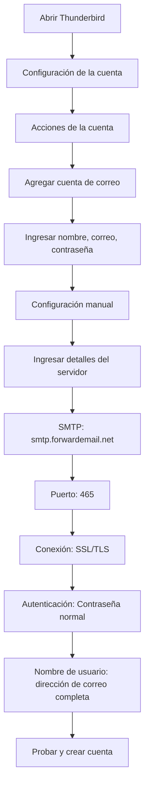

# Ejemplos de Integración SMTP {#smtp-integration-examples}


## Tabla de Contenidos {#table-of-contents}

* [Prólogo](#foreword)
* [Cómo Funciona el Procesamiento SMTP de Forward Email](#how-forward-emails-smtp-processing-works)
  * [Cola de Correos y Sistema de Reintentos](#email-queue-and-retry-system)
  * [A Prueba de Errores para Mayor Confiabilidad](#dummy-proofed-for-reliability)
* [Integración con Node.js](#nodejs-integration)
  * [Usando Nodemailer](#using-nodemailer)
  * [Usando Express.js](#using-expressjs)
* [Integración con Python](#python-integration)
  * [Usando smtplib](#using-smtplib)
  * [Usando Django](#using-django)
* [Integración con PHP](#php-integration)
  * [Usando PHPMailer](#using-phpmailer)
  * [Usando Laravel](#using-laravel)
* [Integración con Ruby](#ruby-integration)
  * [Usando Ruby Mail Gem](#using-ruby-mail-gem)
* [Integración con Java](#java-integration)
  * [Usando JavaMail API](#using-javamail-api)
* [Configuración del Cliente de Correo](#email-client-configuration)
  * [Thunderbird](#thunderbird)
  * [Apple Mail](#apple-mail)
  * [Gmail (Enviar correo como)](#gmail-send-mail-as)
* [Solución de Problemas](#troubleshooting)
  * [Problemas Comunes y Soluciones](#common-issues-and-solutions)
  * [Obtener Ayuda](#getting-help)
* [Recursos Adicionales](#additional-resources)
* [Conclusión](#conclusion)


## Prólogo {#foreword}

Esta guía proporciona ejemplos detallados de cómo integrarse con el servicio SMTP de Forward Email usando varios lenguajes de programación, frameworks y clientes de correo. Nuestro servicio SMTP está diseñado para ser confiable, seguro y fácil de integrar con tus aplicaciones existentes.


## Cómo Funciona el Procesamiento SMTP de Forward Email {#how-forward-emails-smtp-processing-works}

Antes de profundizar en los ejemplos de integración, es importante entender cómo nuestro servicio SMTP procesa los correos electrónicos:

### Cola de Correos y Sistema de Reintentos {#email-queue-and-retry-system}

Cuando envías un correo vía SMTP a nuestros servidores:

1. **Procesamiento Inicial**: El correo es validado, escaneado en busca de malware y revisado contra filtros de spam
2. **Cola Inteligente**: Los correos se colocan en un sistema sofisticado de colas para su entrega
3. **Mecanismo Inteligente de Reintentos**: Si la entrega falla temporalmente, nuestro sistema:
   * Analiza la respuesta de error usando nuestra función `getBounceInfo`
   * Determina si el problema es temporal (por ejemplo, "intenta más tarde", "temporalmente diferido") o permanente (por ejemplo, "usuario desconocido")
   * Para problemas temporales, marca el correo para reintento
   * Para problemas permanentes, genera una notificación de rebote
4. **Periodo de Reintentos de 5 Días**: Reintentamos la entrega hasta por 5 días (similar a estándares de la industria como Postfix), dando tiempo para resolver problemas temporales
5. **Notificaciones de Estado de Entrega**: Los remitentes reciben notificaciones sobre el estado de sus correos (entregado, retrasado o rebotado)

> \[!NOTE]
> Después de la entrega exitosa, el contenido del correo SMTP saliente se redacta tras un periodo configurable de retención (por defecto 30 días) por seguridad y privacidad. Solo queda un mensaje marcador de posición indicando la entrega exitosa.

### A Prueba de Errores para Mayor Confiabilidad {#dummy-proofed-for-reliability}

Nuestro sistema está diseñado para manejar varios casos límite:

* Si se detecta una lista negra, el correo será reintentado automáticamente
* Si ocurren problemas de red, la entrega será reintentada
* Si el buzón del destinatario está lleno, el sistema reintentará más tarde
* Si el servidor receptor está temporalmente no disponible, seguiremos intentando

Este enfoque mejora significativamente las tasas de entrega mientras mantiene la privacidad y seguridad.


## Integración con Node.js {#nodejs-integration}

### Usando Nodemailer {#using-nodemailer}

[Nodemailer](https://nodemailer.com/) es un módulo popular para enviar correos desde aplicaciones Node.js.

```javascript
const nodemailer = require('nodemailer');

// Crear un objeto transporter
const transporter = nodemailer.createTransport({
  host: 'smtp.forwardemail.net',
  port: 465,
  secure: true, // Usar TLS
  auth: {
    user: 'your-username@your-domain.com',
    pass: 'your-password'
  }
});

// Enviar correo con el objeto de transporte definido
async function sendEmail() {
  try {
    const info = await transporter.sendMail({
      from: '"Tu Nombre" <your-username@your-domain.com>',
      to: 'recipient@example.com',
      subject: 'Hola desde Forward Email',
      text: '¡Hola mundo! Este es un correo de prueba enviado usando Nodemailer y Forward Email SMTP.',
      html: '<b>¡Hola mundo!</b> Este es un correo de prueba enviado usando Nodemailer y Forward Email SMTP.'
    });

    console.log('Mensaje enviado: %s', info.messageId);
  } catch (error) {
    console.error('Error al enviar el correo:', error);
  }
}

sendEmail();
```
### Usando Express.js {#using-expressjs}

Aquí se explica cómo integrar Forward Email SMTP con una aplicación Express.js:

```javascript
const express = require('express');
const nodemailer = require('nodemailer');
const app = express();
const port = 3000;

app.use(express.json());

// Configurar el transportador de correo
const transporter = nodemailer.createTransport({
  host: 'smtp.forwardemail.net',
  port: 465,
  secure: true,
  auth: {
    user: 'your-username@your-domain.com',
    pass: 'your-password'
  }
});

// Punto final API para enviar correos
app.post('/send-email', async (req, res) => {
  const { to, subject, text, html } = req.body;

  try {
    const info = await transporter.sendMail({
      from: '"Your App" <your-username@your-domain.com>',
      to,
      subject,
      text,
      html
    });

    res.status(200).json({
      success: true,
      messageId: info.messageId
    });
  } catch (error) {
    console.error('Error enviando correo:', error);
    res.status(500).json({
      success: false,
      error: error.message
    });
  }
});

app.listen(port, () => {
  console.log(`Servidor corriendo en http://localhost:${port}`);
});
```


## Integración con Python {#python-integration}

### Usando smtplib {#using-smtplib}

```python
import smtplib
from email.mime.text import MIMEText
from email.mime.multipart import MIMEMultipart

# Configuración del correo
sender_email = "your-username@your-domain.com"
receiver_email = "recipient@example.com"
password = "your-password"

# Crear mensaje
message = MIMEMultipart("alternative")
message["Subject"] = "Hola desde Forward Email"
message["From"] = sender_email
message["To"] = receiver_email

# Crear la versión en texto plano y HTML de tu mensaje
text = "¡Hola mundo! Este es un correo de prueba enviado usando Python y Forward Email SMTP."
html = "<html><body><b>¡Hola mundo!</b> Este es un correo de prueba enviado usando Python y Forward Email SMTP.</body></html>"

# Convertir estos en objetos MIMEText de texto plano/HTML
part1 = MIMEText(text, "plain")
part2 = MIMEText(html, "html")

# Añadir partes HTML/texto plano al mensaje MIMEMultipart
message.attach(part1)
message.attach(part2)

# Enviar correo
try:
    server = smtplib.SMTP_SSL("smtp.forwardemail.net", 465)
    server.login(sender_email, password)
    server.sendmail(sender_email, receiver_email, message.as_string())
    server.quit()
    print("¡Correo enviado con éxito!")
except Exception as e:
    print(f"Error enviando correo: {e}")
```

### Usando Django {#using-django}

Para aplicaciones Django, añade lo siguiente a tu `settings.py`:

```python
# Configuración de correo
EMAIL_BACKEND = 'django.core.mail.backends.smtp.EmailBackend'
EMAIL_HOST = 'smtp.forwardemail.net'
EMAIL_PORT = 465
EMAIL_USE_SSL = True
EMAIL_HOST_USER = 'your-username@your-domain.com'
EMAIL_HOST_PASSWORD = 'your-password'
DEFAULT_FROM_EMAIL = 'your-username@your-domain.com'
```

Luego envía correos en tus vistas:

```python
from django.core.mail import send_mail

def send_email_view(request):
    send_mail(
        'Asunto aquí',
        'Aquí está el mensaje.',
        'from@your-domain.com',
        ['to@example.com'],
        fail_silently=False,
        html_message='<b>Aquí está el mensaje HTML.</b>'
    )
    return HttpResponse('¡Correo enviado!')
```


## Integración con PHP {#php-integration}

### Usando PHPMailer {#using-phpmailer}

```php
<?php
use PHPMailer\PHPMailer\PHPMailer;
use PHPMailer\PHPMailer\Exception;

require 'vendor/autoload.php';

$mail = new PHPMailer(true);

try {
    // Configuración del servidor
    $mail->isSMTP();
    $mail->Host       = 'smtp.forwardemail.net';
    $mail->SMTPAuth   = true;
    $mail->Username   = 'your-username@your-domain.com';
    $mail->Password   = 'your-password';
    $mail->SMTPSecure = PHPMailer::ENCRYPTION_SMTPS;
    $mail->Port       = 465;

    // Destinatarios
    $mail->setFrom('your-username@your-domain.com', 'Tu Nombre');
    $mail->addAddress('recipient@example.com', 'Nombre del Destinatario');
    $mail->addReplyTo('your-username@your-domain.com', 'Tu Nombre');

    // Contenido
    $mail->isHTML(true);
    $mail->Subject = 'Hola desde Forward Email';
    $mail->Body    = '<b>¡Hola mundo!</b> Este es un correo de prueba enviado usando PHPMailer y Forward Email SMTP.';
    $mail->AltBody = '¡Hola mundo! Este es un correo de prueba enviado usando PHPMailer y Forward Email SMTP.';

    $mail->send();
    echo 'Mensaje enviado';
} catch (Exception $e) {
    echo "El mensaje no pudo ser enviado. Error de Mailer: {$mail->ErrorInfo}";
}
```
### Usando Laravel {#using-laravel}

Para aplicaciones Laravel, actualice su archivo `.env`:

```sh
MAIL_MAILER=smtp
MAIL_HOST=smtp.forwardemail.net
MAIL_PORT=465
MAIL_USERNAME=your-username@your-domain.com
MAIL_PASSWORD=your-password
MAIL_ENCRYPTION=ssl
MAIL_FROM_ADDRESS=your-username@your-domain.com
MAIL_FROM_NAME="${APP_NAME}"
```

Luego envíe correos usando la fachada Mail de Laravel:

```php
<?php

namespace App\Http\Controllers;

use Illuminate\Http\Request;
use Illuminate\Support\Facades\Mail;
use App\Mail\WelcomeEmail;

class EmailController extends Controller
{
    public function sendEmail()
    {
        Mail::to('recipient@example.com')->send(new WelcomeEmail());

        return '¡Correo enviado con éxito!';
    }
}
```


## Integración Ruby {#ruby-integration}

### Usando Ruby Mail Gem {#using-ruby-mail-gem}

```ruby
require 'mail'

Mail.defaults do
  delivery_method :smtp, {
    address: 'smtp.forwardemail.net',
    port: 465,
    domain: 'your-domain.com',
    user_name: 'your-username@your-domain.com',
    password: 'your-password',
    authentication: 'plain',
    enable_starttls_auto: true,
    ssl: true
  }
end

mail = Mail.new do
  from     'your-username@your-domain.com'
  to       'recipient@example.com'
  subject  'Hola desde Forward Email'

  text_part do
    body '¡Hola mundo! Este es un correo de prueba enviado usando Ruby Mail y Forward Email SMTP.'
  end

  html_part do
    content_type 'text/html; charset=UTF-8'
    body '<b>¡Hola mundo!</b> Este es un correo de prueba enviado usando Ruby Mail y Forward Email SMTP.'
  end
end

mail.deliver!
puts "¡Correo enviado con éxito!"
```


## Integración Java {#java-integration}

### Usando JavaMail API {#using-javamail-api}

```java
import java.util.Properties;
import javax.mail.*;
import javax.mail.internet.*;

public class SendEmail {
    public static void main(String[] args) {
        // Correo y contraseña del remitente
        final String username = "your-username@your-domain.com";
        final String password = "your-password";

        // Propiedades del servidor SMTP
        Properties props = new Properties();
        props.put("mail.smtp.auth", "true");
        props.put("mail.smtp.starttls.enable", "true");
        props.put("mail.smtp.host", "smtp.forwardemail.net");
        props.put("mail.smtp.port", "465");
        props.put("mail.smtp.socketFactory.port", "465");
        props.put("mail.smtp.socketFactory.class", "javax.net.ssl.SSLSocketFactory");

        // Crear sesión con autenticador
        Session session = Session.getInstance(props,
            new javax.mail.Authenticator() {
                protected PasswordAuthentication getPasswordAuthentication() {
                    return new PasswordAuthentication(username, password);
                }
            });

        try {
            // Crear mensaje
            Message message = new MimeMessage(session);
            message.setFrom(new InternetAddress(username));
            message.setRecipients(Message.RecipientType.TO, InternetAddress.parse("recipient@example.com"));
            message.setSubject("Hola desde Forward Email");

            // Crear mensaje multipart
            Multipart multipart = new MimeMultipart("alternative");

            // Parte de texto
            BodyPart textPart = new MimeBodyPart();
            textPart.setText("¡Hola mundo! Este es un correo de prueba enviado usando JavaMail y Forward Email SMTP.");

            // Parte HTML
            BodyPart htmlPart = new MimeBodyPart();
            htmlPart.setContent("<b>¡Hola mundo!</b> Este es un correo de prueba enviado usando JavaMail y Forward Email SMTP.", "text/html");

            // Añadir partes al multipart
            multipart.addBodyPart(textPart);
            multipart.addBodyPart(htmlPart);

            // Establecer contenido
            message.setContent(multipart);

            // Enviar mensaje
            Transport.send(message);

            System.out.println("¡Correo enviado con éxito!");

        } catch (MessagingException e) {
            throw new RuntimeException(e);
        }
    }
}
```


## Configuración del Cliente de Correo {#email-client-configuration}

### Thunderbird {#thunderbird}


```mermaid
flowchart TD
    A[Abrir Thunderbird] --> B[Configuración de la cuenta]
    B --> C[Acciones de la cuenta]
    C --> D[Agregar cuenta de correo]
    D --> E[Ingresar nombre, correo, contraseña]
    E --> F[Configuración manual]
    F --> G[Ingresar detalles del servidor]
    G --> H[SMTP: smtp.forwardemail.net]
    H --> I[Puerto: 465]
    I --> J[Conexión: SSL/TLS]
    J --> K[Autenticación: Contraseña normal]
    K --> L[Nombre de usuario: dirección de correo completa]
    L --> M[Probar y crear cuenta]
```
1. Abra Thunderbird y vaya a Configuración de la cuenta  
2. Haga clic en "Acciones de cuenta" y seleccione "Agregar cuenta de correo"  
3. Ingrese su nombre, dirección de correo electrónico y contraseña  
4. Haga clic en "Configuración manual" e ingrese los siguientes detalles:  
   * Servidor entrante:  
     * IMAP: imap.forwardemail.net, Puerto: 993, SSL/TLS  
     * POP3: pop3.forwardemail.net, Puerto: 995, SSL/TLS  
   * Servidor saliente (SMTP): smtp.forwardemail.net, Puerto: 465, SSL/TLS  
   * Autenticación: Contraseña normal  
   * Nombre de usuario: su dirección de correo electrónico completa  
5. Haga clic en "Probar" y luego en "Hecho"  

### Apple Mail {#apple-mail}

1. Abra Mail y vaya a Mail > Preferencias > Cuentas  
2. Haga clic en el botón "+" para agregar una nueva cuenta  
3. Seleccione "Otra cuenta de correo" y haga clic en "Continuar"  
4. Ingrese su nombre, dirección de correo electrónico y contraseña, luego haga clic en "Iniciar sesión"  
5. Cuando la configuración automática falle, ingrese los siguientes detalles:  
   * Servidor de correo entrante: imap.forwardemail.net (o pop3.forwardemail.net para POP3)  
   * Servidor de correo saliente: smtp.forwardemail.net  
   * Nombre de usuario: su dirección de correo electrónico completa  
   * Contraseña: su contraseña  
6. Haga clic en "Iniciar sesión" para completar la configuración  

### Gmail (Enviar correo como) {#gmail-send-mail-as}

1. Abra Gmail y vaya a Configuración > Cuentas e importación  
2. Bajo "Enviar correo como", haga clic en "Agregar otra dirección de correo electrónico"  
3. Ingrese su nombre y dirección de correo electrónico, luego haga clic en "Siguiente paso"  
4. Ingrese los siguientes detalles del servidor SMTP:  
   * Servidor SMTP: smtp.forwardemail.net  
   * Puerto: 465  
   * Nombre de usuario: su dirección de correo electrónico completa  
   * Contraseña: su contraseña  
   * Seleccione "Conexión segura usando SSL"  
5. Haga clic en "Agregar cuenta" y verifique su dirección de correo electrónico  

## Solución de problemas {#troubleshooting}

### Problemas comunes y soluciones {#common-issues-and-solutions}

1. **Autenticación fallida**  
   * Verifique su nombre de usuario (dirección de correo electrónico completa) y contraseña  
   * Asegúrese de estar usando el puerto correcto (465 para SSL/TLS)  
   * Compruebe si su cuenta tiene acceso SMTP habilitado  

2. **Tiempo de conexión agotado**  
   * Verifique su conexión a internet  
   * Asegúrese de que la configuración del firewall no esté bloqueando el tráfico SMTP  
   * Intente usar el puerto 465 con SSL/TLS (recomendado) o el puerto 587 con STARTTLS  

3. **Mensaje rechazado**  
   * Asegúrese de que la dirección "De" coincida con su correo autenticado  
   * Verifique si su IP está en una lista negra  
   * Compruebe que el contenido de su mensaje no active filtros de spam  

4. **Errores TLS/SSL**  
   * Actualice su aplicación/biblioteca para soportar versiones modernas de TLS  
   * Asegúrese de que los certificados CA de su sistema estén actualizados  
   * Intente TLS explícito en lugar de TLS implícito  

### Obtener ayuda {#getting-help}

Si encuentra problemas no cubiertos aquí, por favor:  

1. Consulte nuestra [página de preguntas frecuentes](/faq) para preguntas comunes  
2. Revise nuestra [entrada de blog sobre entrega de correo](/blog/docs/best-email-forwarding-service) para información detallada  
3. Contacte a nuestro equipo de soporte en <support@forwardemail.net>  

## Recursos adicionales {#additional-resources}

* [Documentación de Forward Email](/docs)  
* [Límites y configuración del servidor SMTP](/faq#what-are-your-outbound-smtp-limits)  
* [Guía de mejores prácticas para correo electrónico](/blog/docs/best-email-forwarding-service)  
* [Prácticas de seguridad](/security)  

## Conclusión {#conclusion}

El servicio SMTP de Forward Email ofrece una forma confiable, segura y enfocada en la privacidad para enviar correos electrónicos desde sus aplicaciones y clientes de correo. Con nuestro sistema inteligente de colas, mecanismo de reintentos de 5 días y notificaciones completas del estado de entrega, puede estar seguro de que sus correos llegarán a su destino.  

Para casos de uso más avanzados o integraciones personalizadas, por favor contacte a nuestro equipo de soporte.
