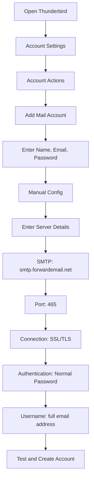

# SMTP-integraatioesimerkkejä {#smtp-integration-examples}

## Sisällysluettelo {#table-of-contents}

* [Esipuhe](#foreword)
* [Miten sähköpostin edelleenlähetyksen SMTP-käsittely toimii](#how-forward-emails-smtp-processing-works)
  * [Sähköpostijono ja uudelleenyritysjärjestelmä](#email-queue-and-retry-system)
  * [Luotettavuus on testattu testitestillä](#dummy-proofed-for-reliability)
* [Node.js-integraatio](#nodejs-integration)
  * [Nodemailerin käyttäminen](#using-nodemailer)
  * [Express.js:n käyttö](#using-expressjs)
* [Python-integraatio](#python-integration)
  * [smtplibin käyttäminen](#using-smtplib)
  * [Djangon käyttö](#using-django)
* [PHP-integraatio](#php-integration)
  * [PHPMailerin käyttö](#using-phpmailer)
  * [Laravelin käyttö](#using-laravel)
* [Ruby-integraatio](#ruby-integration)
  * [Ruby Mail Gemin käyttö](#using-ruby-mail-gem)
* [Java-integraatio](#java-integration)
  * [Java Mail -rajapinnan käyttäminen](#using-javamail-api)
* [Sähköpostiohjelman määritys](#email-client-configuration)
  * [Thunderbird](#thunderbird)
  * [Apple Mail](#apple-mail)
  * [Gmail (Lähetä sähköpostia nimellä)](#gmail-send-mail-as)
* [Vianmääritys](#troubleshooting)
  * [Yleisiä ongelmia ja ratkaisuja](#common-issues-and-solutions)
  * [Avun saaminen](#getting-help)
* [Lisäresurssit](#additional-resources)
* [Johtopäätös](#conclusion)

## Esipuhe {#foreword}

Tämä opas tarjoaa yksityiskohtaisia esimerkkejä siitä, miten Forward Emailin SMTP-palvelu integroidaan käyttämällä erilaisia ohjelmointikieliä, kehyksiä ja sähköpostiohjelmia. SMTP-palvelumme on suunniteltu luotettavaksi, turvalliseksi ja helposti integroitavaksi olemassa oleviin sovelluksiisi.

## Sähköpostin edelleenlähetyksen SMTP-käsittelyn toimintaperiaate {#how-forward-emails-smtp-processing-works}

Ennen integraatioesimerkkien syventämistä on tärkeää ymmärtää, miten SMTP-palvelumme käsittelee sähköposteja:

### Sähköpostijono ja uudelleenyritysjärjestelmä {#email-queue-and-retry-system}

Kun lähetät sähköpostin palvelimillemme SMTP:n kautta:

1. **Alkukäsittely**: Sähköposti validoidaan, skannataan haittaohjelmien varalta ja tarkistetaan roskapostisuodattimia vasten.
2. **Älykäs jonotus**: Sähköpostit asetetaan kehittyneeseen jonotusjärjestelmään toimitusta varten.
3. **Älykäs uudelleenyritysmekanismi**: Jos toimitus epäonnistuu tilapäisesti, järjestelmämme:
* Analysoi virhevastauksen `getBounceInfo`-funktiolla.
* Määrittää, onko ongelma tilapäinen (esim. "yritä myöhemmin uudelleen", "tilapäisesti lykätty") vai pysyvä (esim. "käyttäjä tuntematon").
* Tilapäisten ongelmien tapauksessa merkitsee sähköpostin uudelleenyritystä varten.
* Pysyvien ongelmien tapauksessa luo palautusilmoituksen.
4. **5 päivän uudelleenyritysjakso**: Yritämme toimitusta uudelleen jopa 5 päivän ajan (samanlainen kuin alan standardit, kuten Postfix), jolloin tilapäisille ongelmille annetaan aikaa ratkaista.
5. **Toimituksen tilailmoitukset**: Lähettäjät saavat ilmoituksia sähköpostiensa tilasta (toimitettu, viivästynyt tai palautettu).

> \[!NOTE]
> Onnistuneen toimituksen jälkeen lähtevän SMTP-sähköpostin sisältö sensuroidaan määritettävän säilytysajan (oletusarvo 30 päivää) jälkeen turvallisuus- ja yksityisyyssyistä. Jäljelle jää vain paikkamerkkiviesti, joka osoittaa toimituksen onnistumisen.

### Luotettavuuden varmistamiseksi tehty testitestaus {#dummy-proofed-for-reliability}

Järjestelmämme on suunniteltu käsittelemään erilaisia reunatapauksia:

* Jos estolista havaitaan, sähköpostia yritetään automaattisesti uudelleen.
* Jos verkko-ongelmia ilmenee, toimitusta yritetään uudelleen.
* Jos vastaanottajan postilaatikko on täynnä, järjestelmä yrittää uudelleen myöhemmin.
* Jos vastaanottava palvelin on tilapäisesti poissa käytöstä, jatkamme yrittämistä.

Tämä lähestymistapa parantaa merkittävästi toimitusnopeuksia säilyttäen samalla yksityisyyden ja turvallisuuden.

## Node.js-integraatio {#nodejs-integration}

### Käytetään Nodemaileria {#using-nodemailer}

[Nodemailer](https://nodemailer.com/) on suosittu moduuli sähköpostien lähettämiseen Node.js-sovelluksista.

```javascript
const nodemailer = require('nodemailer');

// Create a transporter object
const transporter = nodemailer.createTransport({
  host: 'smtp.forwardemail.net',
  port: 465,
  secure: true, // Use TLS
  auth: {
    user: 'your-username@your-domain.com',
    pass: 'your-password'
  }
});

// Send mail with defined transport object
async function sendEmail() {
  try {
    const info = await transporter.sendMail({
      from: '"Your Name" <your-username@your-domain.com>',
      to: 'recipient@example.com',
      subject: 'Hello from Forward Email',
      text: 'Hello world! This is a test email sent using Nodemailer and Forward Email SMTP.',
      html: '<b>Hello world!</b> This is a test email sent using Nodemailer and Forward Email SMTP.'
    });

    console.log('Message sent: %s', info.messageId);
  } catch (error) {
    console.error('Error sending email:', error);
  }
}

sendEmail();
```

### Käytetään Express.js:ää {#using-expressjs}

Näin integroit Forward Email SMTP:n Express.js-sovellukseen:

```javascript
const express = require('express');
const nodemailer = require('nodemailer');
const app = express();
const port = 3000;

app.use(express.json());

// Configure email transporter
const transporter = nodemailer.createTransport({
  host: 'smtp.forwardemail.net',
  port: 465,
  secure: true,
  auth: {
    user: 'your-username@your-domain.com',
    pass: 'your-password'
  }
});

// API endpoint for sending emails
app.post('/send-email', async (req, res) => {
  const { to, subject, text, html } = req.body;

  try {
    const info = await transporter.sendMail({
      from: '"Your App" <your-username@your-domain.com>',
      to,
      subject,
      text,
      html
    });

    res.status(200).json({
      success: true,
      messageId: info.messageId
    });
  } catch (error) {
    console.error('Error sending email:', error);
    res.status(500).json({
      success: false,
      error: error.message
    });
  }
});

app.listen(port, () => {
  console.log(`Server running at http://localhost:${port}`);
});
```

## Python-integraatio {#python-integration}

### Käytetään smtplib-tiedostoa {#using-smtplib}

```python
import smtplib
from email.mime.text import MIMEText
from email.mime.multipart import MIMEMultipart

# Email configuration
sender_email = "your-username@your-domain.com"
receiver_email = "recipient@example.com"
password = "your-password"

# Create message
message = MIMEMultipart("alternative")
message["Subject"] = "Hello from Forward Email"
message["From"] = sender_email
message["To"] = receiver_email

# Create the plain-text and HTML version of your message
text = "Hello world! This is a test email sent using Python and Forward Email SMTP."
html = "<html><body><b>Hello world!</b> This is a test email sent using Python and Forward Email SMTP.</body></html>"

# Turn these into plain/html MIMEText objects
part1 = MIMEText(text, "plain")
part2 = MIMEText(html, "html")

# Add HTML/plain-text parts to MIMEMultipart message
message.attach(part1)
message.attach(part2)

# Send email
try:
    server = smtplib.SMTP_SSL("smtp.forwardemail.net", 465)
    server.login(sender_email, password)
    server.sendmail(sender_email, receiver_email, message.as_string())
    server.quit()
    print("Email sent successfully!")
except Exception as e:
    print(f"Error sending email: {e}")
```

### Käytetään Djangoa {#using-django}

Django-sovelluksissa lisää seuraava `settings.py`-kohtaan:

```python
# Email settings
EMAIL_BACKEND = 'django.core.mail.backends.smtp.EmailBackend'
EMAIL_HOST = 'smtp.forwardemail.net'
EMAIL_PORT = 465
EMAIL_USE_SSL = True
EMAIL_HOST_USER = 'your-username@your-domain.com'
EMAIL_HOST_PASSWORD = 'your-password'
DEFAULT_FROM_EMAIL = 'your-username@your-domain.com'
```

Lähetä sitten sähköposteja näkymissäsi:

```python
from django.core.mail import send_mail

def send_email_view(request):
    send_mail(
        'Subject here',
        'Here is the message.',
        'from@your-domain.com',
        ['to@example.com'],
        fail_silently=False,
        html_message='<b>Here is the HTML message.</b>'
    )
    return HttpResponse('Email sent!')
```

## PHP-integraatio {#php-integration}

### Käytetään PHPMaileria {#using-phpmailer}

```php
<?php
use PHPMailer\PHPMailer\PHPMailer;
use PHPMailer\PHPMailer\Exception;

require 'vendor/autoload.php';

$mail = new PHPMailer(true);

try {
    // Server settings
    $mail->isSMTP();
    $mail->Host       = 'smtp.forwardemail.net';
    $mail->SMTPAuth   = true;
    $mail->Username   = 'your-username@your-domain.com';
    $mail->Password   = 'your-password';
    $mail->SMTPSecure = PHPMailer::ENCRYPTION_SMTPS;
    $mail->Port       = 465;

    // Recipients
    $mail->setFrom('your-username@your-domain.com', 'Your Name');
    $mail->addAddress('recipient@example.com', 'Recipient Name');
    $mail->addReplyTo('your-username@your-domain.com', 'Your Name');

    // Content
    $mail->isHTML(true);
    $mail->Subject = 'Hello from Forward Email';
    $mail->Body    = '<b>Hello world!</b> This is a test email sent using PHPMailer and Forward Email SMTP.';
    $mail->AltBody = 'Hello world! This is a test email sent using PHPMailer and Forward Email SMTP.';

    $mail->send();
    echo 'Message has been sent';
} catch (Exception $e) {
    echo "Message could not be sent. Mailer Error: {$mail->ErrorInfo}";
}
```

### Laravelin käyttö {#using-laravel}

Laravel-sovellusten osalta päivitä `.env`-tiedostosi:

```sh
MAIL_MAILER=smtp
MAIL_HOST=smtp.forwardemail.net
MAIL_PORT=465
MAIL_USERNAME=your-username@your-domain.com
MAIL_PASSWORD=your-password
MAIL_ENCRYPTION=ssl
MAIL_FROM_ADDRESS=your-username@your-domain.com
MAIL_FROM_NAME="${APP_NAME}"
```

Lähetä sitten sähköposteja Laravelin Mail-fasadilla:

```php
<?php

namespace App\Http\Controllers;

use Illuminate\Http\Request;
use Illuminate\Support\Facades\Mail;
use App\Mail\WelcomeEmail;

class EmailController extends Controller
{
    public function sendEmail()
    {
        Mail::to('recipient@example.com')->send(new WelcomeEmail());

        return 'Email sent successfully!';
    }
}
```

## Ruby-integraatio {#ruby-integration}

### Käytetään Ruby Mail Gemiä {#using-ruby-mail-gem}

```ruby
require 'mail'

Mail.defaults do
  delivery_method :smtp, {
    address: 'smtp.forwardemail.net',
    port: 465,
    domain: 'your-domain.com',
    user_name: 'your-username@your-domain.com',
    password: 'your-password',
    authentication: 'plain',
    enable_starttls_auto: true,
    ssl: true
  }
end

mail = Mail.new do
  from     'your-username@your-domain.com'
  to       'recipient@example.com'
  subject  'Hello from Forward Email'

  text_part do
    body 'Hello world! This is a test email sent using Ruby Mail and Forward Email SMTP.'
  end

  html_part do
    content_type 'text/html; charset=UTF-8'
    body '<b>Hello world!</b> This is a test email sent using Ruby Mail and Forward Email SMTP.'
  end
end

mail.deliver!
puts "Email sent successfully!"
```

## Java-integraatio {#java-integration}

### Käytetään JavaMail-rajapintaa {#using-javamail-api}

```java
import java.util.Properties;
import javax.mail.*;
import javax.mail.internet.*;

public class SendEmail {
    public static void main(String[] args) {
        // Sender's email and password
        final String username = "your-username@your-domain.com";
        final String password = "your-password";

        // SMTP server properties
        Properties props = new Properties();
        props.put("mail.smtp.auth", "true");
        props.put("mail.smtp.starttls.enable", "true");
        props.put("mail.smtp.host", "smtp.forwardemail.net");
        props.put("mail.smtp.port", "465");
        props.put("mail.smtp.socketFactory.port", "465");
        props.put("mail.smtp.socketFactory.class", "javax.net.ssl.SSLSocketFactory");

        // Create session with authenticator
        Session session = Session.getInstance(props,
            new javax.mail.Authenticator() {
                protected PasswordAuthentication getPasswordAuthentication() {
                    return new PasswordAuthentication(username, password);
                }
            });

        try {
            // Create message
            Message message = new MimeMessage(session);
            message.setFrom(new InternetAddress(username));
            message.setRecipients(Message.RecipientType.TO, InternetAddress.parse("recipient@example.com"));
            message.setSubject("Hello from Forward Email");

            // Create multipart message
            Multipart multipart = new MimeMultipart("alternative");

            // Text part
            BodyPart textPart = new MimeBodyPart();
            textPart.setText("Hello world! This is a test email sent using JavaMail and Forward Email SMTP.");

            // HTML part
            BodyPart htmlPart = new MimeBodyPart();
            htmlPart.setContent("<b>Hello world!</b> This is a test email sent using JavaMail and Forward Email SMTP.", "text/html");

            // Add parts to multipart
            multipart.addBodyPart(textPart);
            multipart.addBodyPart(htmlPart);

            // Set content
            message.setContent(multipart);

            // Send message
            Transport.send(message);

            System.out.println("Email sent successfully!");

        } catch (MessagingException e) {
            throw new RuntimeException(e);
        }
    }
}
```

## Sähköpostiohjelman määritys {#email-client-configuration}

VÄLIAIKAINEN_PAIKKAPIDÄN_0 Thunderbird {VÄLIAIKAINEN_PAIKKAPIDÄN_1



1. Avaa Thunderbird ja siirry kohtaan Tilin asetukset.
2. Napsauta "Tilin toiminnot" ja valitse "Lisää sähköpostitili".
3. Anna nimesi, sähköpostiosoitteesi ja salasanasi.
4. Napsauta "Manuaalinen määritys" ja anna seuraavat tiedot:
* Saapuvan postin palvelin:
* IMAP: imap.forwardemail.net, portti: 993, SSL/TLS
* POP3: pop3.forwardemail.net, portti: 995, SSL/TLS
* Lähtevän postin palvelin (SMTP): smtp.forwardemail.net, portti: 465, SSL/TLS
* Todennus: Normaali salasana
* Käyttäjänimi: koko sähköpostiosoitteesi.
5. Napsauta "Testi" ja sitten "Valmis".

### Apple Mail {#apple-mail}

1. Avaa Mail ja siirry kohtaan Mail > Asetukset > Tilit.
2. Lisää uusi tili napsauttamalla +-painiketta.
3. Valitse "Muu sähköpostitili" ja napsauta "Jatka".
4. Anna nimesi, sähköpostiosoitteesi ja salasanasi ja napsauta sitten "Kirjaudu sisään".
5. Jos automaattinen asennus epäonnistuu, anna seuraavat tiedot:
* Saapuvan postin palvelin: imap.forwardemail.net (tai pop3.forwardemail.net POP3:lle)
* Lähtevän postin palvelin: smtp.forwardemail.net
* Käyttäjätunnus: koko sähköpostiosoitteesi
* Salasana: salasanasi
6. Viimeistele asennus napsauttamalla "Kirjaudu sisään".

### Gmail (Lähetä viesti osoitteena) {#gmail-send-mail-as}

1. Avaa Gmail ja siirry kohtaan Asetukset > Tilit ja tuonti.
2. Napsauta Lähetä sähköpostia osoitteena -kohdassa Lisää toinen sähköpostiosoite.
3. Anna nimesi ja sähköpostiosoitteesi ja napsauta sitten Seuraava vaihe.
4. Anna seuraavat SMTP-palvelimen tiedot:
* SMTP-palvelin: smtp.forwardemail.net
* Portti: 465
* Käyttäjänimi: koko sähköpostiosoitteesi
* Salasana: salasanasi
* Valitse SSL-suojattu yhteys.
5. Napsauta Lisää tili ja vahvista sähköpostiosoitteesi.

## Vianmääritys {#troubleshooting}

### Yleisiä ongelmia ja ratkaisuja {#common-issues-and-solutions}

1. **Todennus epäonnistui**
* Vahvista käyttäjätunnuksesi (koko sähköpostiosoitteesi) ja salasanasi
* Varmista, että käytät oikeaa porttia (465 SSL/TLS:lle)
* Tarkista, onko tililläsi SMTP-käyttö käytössä

2. **Yhteyden aikakatkaisu**
* Tarkista internetyhteytesi
* Varmista, että palomuuriasetukset eivät estä SMTP-liikennettä
* Kokeile käyttää toista porttia (587 ja STARTTLS)

3. **Viesti hylätty**
* Varmista, että "Lähettäjä"-osoite vastaa todennettua sähköpostiosoitettasi
* Tarkista, onko IP-osoitteesi mustalla listalla
* Varmista, ettei viestisi sisältö laukaise roskapostisuodattimia

4. **TLS/SSL-virheet**
* Päivitä sovelluksesi/kirjastosi tukemaan nykyaikaisia TLS-versioita
* Varmista, että järjestelmäsi CA-varmenteet ovat ajan tasalla
* Kokeile eksplisiittistä TLS:ää implisiittisen TLS:n sijaan

### Avun saaminen {#getting-help}

Jos kohtaat ongelmia, joita ei ole käsitelty tässä:

1. Katso yleisiä kysymyksiä [Usein kysytyt kysymykset -sivu](/faq)-sivultamme.
2. Katso lisätietoja [blogikirjoitus sähköpostin toimituksesta](/blog/docs/best-email-forwarding-service)-sivultamme.
3. Ota yhteyttä tukitiimiimme osoitteessa <support@forwardemail.net>.

## Lisäresurssit {#additional-resources}

* [Sähköpostin välitysdokumentaatio](/docs)
* [SMTP-palvelimen rajoitukset ja konfigurointi](/faq#what-are-your-outbound-smtp-limits)
* [Sähköpostin parhaiden käytäntöjen opas](/blog/docs/best-email-forwarding-service)
* [Turvallisuuskäytännöt](/security)

## Johtopäätös {#conclusion}

Forward Emailin SMTP-palvelu tarjoaa luotettavan, turvallisen ja yksityisyyttä kunnioittavan tavan lähettää sähköposteja sovelluksistasi ja sähköpostiohjelmistasi. Älykkään jonotusjärjestelmämme, viiden päivän uudelleenyritysmekanismimme ja kattavien toimitustilailmoitusten ansiosta voit olla varma, että sähköpostisi saapuvat perille.

Edistyneempien käyttötapausten tai mukautettujen integraatioiden osalta ota yhteyttä tukitiimiimme.