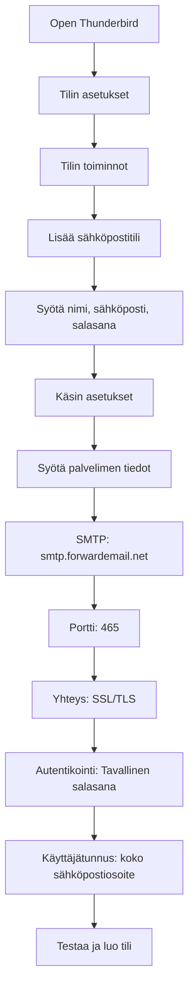

# SMTP-integrointiesimerkit {#smtp-integration-examples}


## Sisällysluettelo {#table-of-contents}

* [Esipuhe](#foreword)
* [Miten Forward Emailin SMTP-käsittely toimii](#how-forward-emails-smtp-processing-works)
  * [Sähköpostijono ja uudelleenyritysjärjestelmä](#email-queue-and-retry-system)
  * [Luotettavuus varmistettu yksinkertaisuudella](#dummy-proofed-for-reliability)
* [Node.js-integrointi](#nodejs-integration)
  * [Nodemailerin käyttö](#using-nodemailer)
  * [Express.js:n käyttö](#using-expressjs)
* [Python-integrointi](#python-integration)
  * [smtplibin käyttö](#using-smtplib)
  * [Djangon käyttö](#using-django)
* [PHP-integrointi](#php-integration)
  * [PHPMailerin käyttö](#using-phpmailer)
  * [Laravelin käyttö](#using-laravel)
* [Ruby-integrointi](#ruby-integration)
  * [Ruby Mail Gemin käyttö](#using-ruby-mail-gem)
* [Java-integrointi](#java-integration)
  * [JavaMail API:n käyttö](#using-javamail-api)
* [Sähköpostiohjelman asetukset](#email-client-configuration)
  * [Thunderbird](#thunderbird)
  * [Apple Mail](#apple-mail)
  * [Gmail (Lähetä sähköpostina)](#gmail-send-mail-as)
* [Vianmääritys](#troubleshooting)
  * [Yleiset ongelmat ja ratkaisut](#common-issues-and-solutions)
  * [Apua saaminen](#getting-help)
* [Lisäresurssit](#additional-resources)
* [Yhteenveto](#conclusion)


## Esipuhe {#foreword}

Tämä opas tarjoaa yksityiskohtaisia esimerkkejä siitä, miten integroit Forward Emailin SMTP-palveluun eri ohjelmointikielillä, kehyksillä ja sähköpostiohjelmilla. SMTP-palvelumme on suunniteltu olemaan luotettava, turvallinen ja helppo integroida olemassa oleviin sovelluksiisi.


## Miten Forward Emailin SMTP-käsittely toimii {#how-forward-emails-smtp-processing-works}

Ennen kuin siirryt integrointiesimerkkeihin, on tärkeää ymmärtää, miten SMTP-palvelumme käsittelee sähköposteja:

### Sähköpostijono ja uudelleenyritysjärjestelmä {#email-queue-and-retry-system}

Kun lähetät sähköpostin SMTP:n kautta palvelimillemme:

1. **Alkukäsittely**: Sähköposti validoidaan, tarkistetaan haittaohjelmien varalta ja suodatetaan roskapostisuodattimilla
2. **Älykäs jonotus**: Sähköpostit asetetaan kehittyneeseen jonotusjärjestelmään toimitusta varten
3. **Älykäs uudelleenyritysmekanismi**: Jos toimitus epäonnistuu väliaikaisesti, järjestelmämme:
   * Analysoi virhevastauksen `getBounceInfo`-funktiollamme
   * Määrittää, onko ongelma väliaikainen (esim. "yritä myöhemmin uudelleen", "väliaikaisesti lykätty") vai pysyvä (esim. "käyttäjää ei tunnistettu")
   * Väliaikaisissa ongelmissa merkitsee sähköpostin uudelleenyritystä varten
   * Pysyvien ongelmien kohdalla luo palautusilmoituksen
4. **5 päivän uudelleenyritysjakso**: Yritämme toimitusta enintään 5 päivän ajan (kuten alan standardit, esim. Postfix), antaen väliaikaisten ongelmien ratketa
5. **Toimitusilmoitukset**: Lähettäjät saavat ilmoituksia sähköpostien tilasta (toimitettu, viivästynyt tai palautettu)

> \[!NOTE]
> Onnistuneen toimituksen jälkeen lähtevän SMTP-sähköpostin sisältö poistetaan määritettävän säilytysajan (oletuksena 30 päivää) jälkeen turvallisuuden ja yksityisyyden vuoksi. Jäljelle jää vain paikkamerkki, joka ilmoittaa onnistuneesta toimituksesta.

### Luotettavuus varmistettu yksinkertaisuudella {#dummy-proofed-for-reliability}

Järjestelmämme on suunniteltu käsittelemään erilaisia reunatapauksia:

* Jos estolista havaitaan, sähköpostia yritetään automaattisesti uudelleen
* Jos verkko-ongelmia ilmenee, toimitusta yritetään uudelleen
* Jos vastaanottajan postilaatikko on täynnä, järjestelmä yrittää myöhemmin uudelleen
* Jos vastaanottava palvelin on väliaikaisesti poissa käytöstä, yritämme uudelleen

Tämä lähestymistapa parantaa merkittävästi toimitusprosentteja samalla kun säilyttää yksityisyyden ja turvallisuuden.


## Node.js-integrointi {#nodejs-integration}

### Nodemailerin käyttö {#using-nodemailer}

[Nodemailer](https://nodemailer.com/) on suosittu moduuli sähköpostien lähettämiseen Node.js-sovelluksista.

```javascript
const nodemailer = require('nodemailer');

// Luo transporter-objekti
const transporter = nodemailer.createTransport({
  host: 'smtp.forwardemail.net',
  port: 465,
  secure: true, // Käytä TLS:ää
  auth: {
    user: 'your-username@your-domain.com',
    pass: 'your-password'
  }
});

// Lähetä sähköposti määritellyllä transporter-objektilla
async function sendEmail() {
  try {
    const info = await transporter.sendMail({
      from: '"Your Name" <your-username@your-domain.com>',
      to: 'recipient@example.com',
      subject: 'Hei Forward Emaililta',
      text: 'Hei maailma! Tämä on testisähköposti, joka on lähetetty Nodemailerilla ja Forward Emailin SMTP:llä.',
      html: '<b>Hei maailma!</b> Tämä on testisähköposti, joka on lähetetty Nodemailerilla ja Forward Emailin SMTP:llä.'
    });

    console.log('Viesti lähetetty: %s', info.messageId);
  } catch (error) {
    console.error('Virhe sähköpostin lähetyksessä:', error);
  }
}

sendEmail();
```
### Using Express.js {#using-expressjs}

Tässä ohjeet Forward Email SMTP:n integroimiseksi Express.js-sovellukseen:

```javascript
const express = require('express');
const nodemailer = require('nodemailer');
const app = express();
const port = 3000;

app.use(express.json());

// Määritä sähköpostin lähettäjä
const transporter = nodemailer.createTransport({
  host: 'smtp.forwardemail.net',
  port: 465,
  secure: true,
  auth: {
    user: 'your-username@your-domain.com',
    pass: 'your-password'
  }
});

// API-päätepiste sähköpostien lähettämiseen
app.post('/send-email', async (req, res) => {
  const { to, subject, text, html } = req.body;

  try {
    const info = await transporter.sendMail({
      from: '"Your App" <your-username@your-domain.com>',
      to,
      subject,
      text,
      html
    });

    res.status(200).json({
      success: true,
      messageId: info.messageId
    });
  } catch (error) {
    console.error('Error sending email:', error);
    res.status(500).json({
      success: false,
      error: error.message
    });
  }
});

app.listen(port, () => {
  console.log(`Server running at http://localhost:${port}`);
});
```


## Python Integration {#python-integration}

### Using smtplib {#using-smtplib}

```python
import smtplib
from email.mime.text import MIMEText
from email.mime.multipart import MIMEMultipart

# Sähköpostin asetukset
sender_email = "your-username@your-domain.com"
receiver_email = "recipient@example.com"
password = "your-password"

# Luo viesti
message = MIMEMultipart("alternative")
message["Subject"] = "Hello from Forward Email"
message["From"] = sender_email
message["To"] = receiver_email

# Luo viestin tekstiversio ja HTML-versio
text = "Hello world! This is a test email sent using Python and Forward Email SMTP."
html = "<html><body><b>Hello world!</b> This is a test email sent using Python and Forward Email SMTP.</body></html>"

# Muunna nämä tavalliseksi/html MIMEText-objekteiksi
part1 = MIMEText(text, "plain")
part2 = MIMEText(html, "html")

# Lisää HTML/tavalliset tekstiosat MIMEMultipart-viestiin
message.attach(part1)
message.attach(part2)

# Lähetä sähköposti
try:
    server = smtplib.SMTP_SSL("smtp.forwardemail.net", 465)
    server.login(sender_email, password)
    server.sendmail(sender_email, receiver_email, message.as_string())
    server.quit()
    print("Email sent successfully!")
except Exception as e:
    print(f"Error sending email: {e}")
```

### Using Django {#using-django}

Django-sovelluksissa lisää seuraavat asetukset tiedostoon `settings.py`:

```python
# Sähköpostiasetukset
EMAIL_BACKEND = 'django.core.mail.backends.smtp.EmailBackend'
EMAIL_HOST = 'smtp.forwardemail.net'
EMAIL_PORT = 465
EMAIL_USE_SSL = True
EMAIL_HOST_USER = 'your-username@your-domain.com'
EMAIL_HOST_PASSWORD = 'your-password'
DEFAULT_FROM_EMAIL = 'your-username@your-domain.com'
```

Lähetä sitten sähköposteja näkymissäsi:

```python
from django.core.mail import send_mail

def send_email_view(request):
    send_mail(
        'Subject here',
        'Here is the message.',
        'from@your-domain.com',
        ['to@example.com'],
        fail_silently=False,
        html_message='<b>Here is the HTML message.</b>'
    )
    return HttpResponse('Email sent!')
```


## PHP Integration {#php-integration}

### Using PHPMailer {#using-phpmailer}

```php
<?php
use PHPMailer\PHPMailer\PHPMailer;
use PHPMailer\PHPMailer\Exception;

require 'vendor/autoload.php';

$mail = new PHPMailer(true);

try {
    // Palvelinasetukset
    $mail->isSMTP();
    $mail->Host       = 'smtp.forwardemail.net';
    $mail->SMTPAuth   = true;
    $mail->Username   = 'your-username@your-domain.com';
    $mail->Password   = 'your-password';
    $mail->SMTPSecure = PHPMailer::ENCRYPTION_SMTPS;
    $mail->Port       = 465;

    // Vastaanottajat
    $mail->setFrom('your-username@your-domain.com', 'Your Name');
    $mail->addAddress('recipient@example.com', 'Recipient Name');
    $mail->addReplyTo('your-username@your-domain.com', 'Your Name');

    // Sisältö
    $mail->isHTML(true);
    $mail->Subject = 'Hello from Forward Email';
    $mail->Body    = '<b>Hello world!</b> This is a test email sent using PHPMailer and Forward Email SMTP.';
    $mail->AltBody = 'Hello world! This is a test email sent using PHPMailer and Forward Email SMTP.';

    $mail->send();
    echo 'Message has been sent';
} catch (Exception $e) {
    echo "Message could not be sent. Mailer Error: {$mail->ErrorInfo}";
}
```
### Laravelin käyttäminen {#using-laravel}

Laravel-sovelluksissa päivitä `.env`-tiedostosi:

```sh
MAIL_MAILER=smtp
MAIL_HOST=smtp.forwardemail.net
MAIL_PORT=465
MAIL_USERNAME=your-username@your-domain.com
MAIL_PASSWORD=your-password
MAIL_ENCRYPTION=ssl
MAIL_FROM_ADDRESS=your-username@your-domain.com
MAIL_FROM_NAME="${APP_NAME}"
```

Lähetä sitten sähköposteja Laravelin Mail-fasadin avulla:

```php
<?php

namespace App\Http\Controllers;

use Illuminate\Http\Request;
use Illuminate\Support\Facades\Mail;
use App\Mail\WelcomeEmail;

class EmailController extends Controller
{
    public function sendEmail()
    {
        Mail::to('recipient@example.com')->send(new WelcomeEmail());

        return 'Sähköposti lähetetty onnistuneesti!';
    }
}
```


## Ruby-integraatio {#ruby-integration}

### Ruby Mail Gem -kirjaston käyttäminen {#using-ruby-mail-gem}

```ruby
require 'mail'

Mail.defaults do
  delivery_method :smtp, {
    address: 'smtp.forwardemail.net',
    port: 465,
    domain: 'your-domain.com',
    user_name: 'your-username@your-domain.com',
    password: 'your-password',
    authentication: 'plain',
    enable_starttls_auto: true,
    ssl: true
  }
end

mail = Mail.new do
  from     'your-username@your-domain.com'
  to       'recipient@example.com'
  subject  'Hei Forward Emaililtä'

  text_part do
    body 'Hei maailma! Tämä on testisähköposti, joka on lähetetty Ruby Maililla ja Forward Emailin SMTP:llä.'
  end

  html_part do
    content_type 'text/html; charset=UTF-8'
    body '<b>Hei maailma!</b> Tämä on testisähköposti, joka on lähetetty Ruby Maililla ja Forward Emailin SMTP:llä.'
  end
end

mail.deliver!
puts "Sähköposti lähetetty onnistuneesti!"
```


## Java-integraatio {#java-integration}

### JavaMail API:n käyttäminen {#using-javamail-api}

```java
import java.util.Properties;
import javax.mail.*;
import javax.mail.internet.*;

public class SendEmail {
    public static void main(String[] args) {
        // Lähettäjän sähköposti ja salasana
        final String username = "your-username@your-domain.com";
        final String password = "your-password";

        // SMTP-palvelimen asetukset
        Properties props = new Properties();
        props.put("mail.smtp.auth", "true");
        props.put("mail.smtp.starttls.enable", "true");
        props.put("mail.smtp.host", "smtp.forwardemail.net");
        props.put("mail.smtp.port", "465");
        props.put("mail.smtp.socketFactory.port", "465");
        props.put("mail.smtp.socketFactory.class", "javax.net.ssl.SSLSocketFactory");

        // Luo istunto autentikointia varten
        Session session = Session.getInstance(props,
            new javax.mail.Authenticator() {
                protected PasswordAuthentication getPasswordAuthentication() {
                    return new PasswordAuthentication(username, password);
                }
            });

        try {
            // Luo viesti
            Message message = new MimeMessage(session);
            message.setFrom(new InternetAddress(username));
            message.setRecipients(Message.RecipientType.TO, InternetAddress.parse("recipient@example.com"));
            message.setSubject("Hei Forward Emaililtä");

            // Luo moniosainen viesti
            Multipart multipart = new MimeMultipart("alternative");

            // Tekstiosa
            BodyPart textPart = new MimeBodyPart();
            textPart.setText("Hei maailma! Tämä on testisähköposti, joka on lähetetty JavaMaililla ja Forward Emailin SMTP:llä.");

            // HTML-osa
            BodyPart htmlPart = new MimeBodyPart();
            htmlPart.setContent("<b>Hei maailma!</b> Tämä on testisähköposti, joka on lähetetty JavaMaililla ja Forward Emailin SMTP:llä.", "text/html");

            // Lisää osat moniosaiseen viestiin
            multipart.addBodyPart(textPart);
            multipart.addBodyPart(htmlPart);

            // Aseta sisältö
            message.setContent(multipart);

            // Lähetä viesti
            Transport.send(message);

            System.out.println("Sähköposti lähetetty onnistuneesti!");

        } catch (MessagingException e) {
            throw new RuntimeException(e);
        }
    }
}
```


## Sähköpostiohjelman asetukset {#email-client-configuration}

### Thunderbird {#thunderbird}


```mermaid
flowchart TD
    A[Open Thunderbird] --> B[Tilin asetukset]
    B --> C[Tilin toiminnot]
    C --> D[Lisää sähköpostitili]
    D --> E[Syötä nimi, sähköposti, salasana]
    E --> F[Käsin asetukset]
    F --> G[Syötä palvelimen tiedot]
    G --> H[SMTP: smtp.forwardemail.net]
    H --> I[Portti: 465]
    I --> J[Yhteys: SSL/TLS]
    J --> K[Autentikointi: Tavallinen salasana]
    K --> L[Käyttäjätunnus: koko sähköpostiosoite]
    L --> M[Testaa ja luo tili]
```
1. Avaa Thunderbird ja siirry Tilin asetuksiin
2. Napsauta "Tilitoiminnot" ja valitse "Lisää sähköpostitili"
3. Syötä nimesi, sähköpostiosoitteesi ja salasanasi
4. Napsauta "Manuaalinen määritys" ja syötä seuraavat tiedot:
   * Saapuva palvelin:
     * IMAP: imap.forwardemail.net, Portti: 993, SSL/TLS
     * POP3: pop3.forwardemail.net, Portti: 995, SSL/TLS
   * Lähtevä palvelin (SMTP): smtp.forwardemail.net, Portti: 465, SSL/TLS
   * Todennus: Normaali salasana
   * Käyttäjätunnus: koko sähköpostiosoitteesi
5. Napsauta "Testaa" ja sitten "Valmis"

### Apple Mail {#apple-mail}

1. Avaa Mail ja siirry Mail > Asetukset > Tilit
2. Napsauta "+"-painiketta lisätäksesi uuden tilin
3. Valitse "Muu sähköpostitili" ja napsauta "Jatka"
4. Syötä nimesi, sähköpostiosoitteesi ja salasanasi, sitten napsauta "Kirjaudu sisään"
5. Kun automaattinen määritys epäonnistuu, syötä seuraavat tiedot:
   * Saapuvan postin palvelin: imap.forwardemail.net (tai pop3.forwardemail.net POP3:lle)
   * Lähtevän postin palvelin: smtp.forwardemail.net
   * Käyttäjätunnus: koko sähköpostiosoitteesi
   * Salasana: salasanasi
6. Napsauta "Kirjaudu sisään" viimeistelläksesi määrityksen

### Gmail (Lähetä sähköpostina) {#gmail-send-mail-as}

1. Avaa Gmail ja siirry Asetukset > Tilit ja tuonti
2. "Lähetä sähköpostina" -kohdassa napsauta "Lisää toinen sähköpostiosoite"
3. Syötä nimesi ja sähköpostiosoitteesi, sitten napsauta "Seuraava vaihe"
4. Syötä seuraavat SMTP-palvelimen tiedot:
   * SMTP-palvelin: smtp.forwardemail.net
   * Portti: 465
   * Käyttäjätunnus: koko sähköpostiosoitteesi
   * Salasana: salasanasi
   * Valitse "Suojattu yhteys SSL:llä"
5. Napsauta "Lisää tili" ja vahvista sähköpostiosoitteesi


## Vianmääritys {#troubleshooting}

### Yleiset ongelmat ja ratkaisut {#common-issues-and-solutions}

1. **Todennus epäonnistui**
   * Varmista käyttäjätunnuksesi (koko sähköpostiosoite) ja salasana
   * Varmista, että käytät oikeaa porttia (465 SSL/TLS:lle)
   * Tarkista, onko tililläsi SMTP-käyttöoikeus käytössä

2. **Yhteyden aikakatkaisu**
   * Tarkista internet-yhteytesi
   * Varmista, ettei palomuuri estä SMTP-liikennettä
   * Kokeile porttia 465 SSL/TLS:llä (suositeltu) tai porttia 587 STARTTLS:llä

3. **Viesti hylätty**
   * Varmista, että "Lähettäjä"-osoite vastaa todennettua sähköpostiasi
   * Tarkista, onko IP-osoitteesi mustalistalla
   * Varmista, ettei viestisi sisältö laukaise roskapostisuodattimia

4. **TLS/SSL-virheet**
   * Päivitä sovelluksesi/kirjastosi tukemaan nykyaikaisia TLS-versioita
   * Varmista, että järjestelmäsi CA-varmenteet ovat ajan tasalla
   * Kokeile eksplisiittistä TLS:ää implisiittisen sijaan

### Apua {#getting-help}

Jos kohtaat tässä käsiteltyjä ongelmia, tee seuraavat:

1. Tarkista [UKK-sivumme](/faq) yleisimmistä kysymyksistä
2. Lue [blogikirjoituksemme sähköpostin toimituksesta](/blog/docs/best-email-forwarding-service) saadaksesi yksityiskohtaista tietoa
3. Ota yhteyttä tukitiimiimme osoitteessa <support@forwardemail.net>


## Lisäresurssit {#additional-resources}

* [Forward Email -dokumentaatio](/docs)
* [SMTP-palvelimen rajoitukset ja määritys](/faq#what-are-your-outbound-smtp-limits)
* [Sähköpostin parhaat käytännöt -opas](/blog/docs/best-email-forwarding-service)
* [Turvakäytännöt](/security)


## Yhteenveto {#conclusion}

Forward Emailin SMTP-palvelu tarjoaa luotettavan, turvallisen ja yksityisyyttä kunnioittavan tavan lähettää sähköposteja sovelluksistasi ja sähköpostiohjelmistasi. Älykkään jonojärjestelmämme, 5 päivän uudelleenyritysmekanismin ja kattavien toimitusilmoitusten ansiosta voit olla varma, että sähköpostisi saavuttavat määränpäänsä.

Edistyneempiä käyttötapauksia tai räätälöityjä integraatioita varten ota yhteyttä tukitiimiimme.
