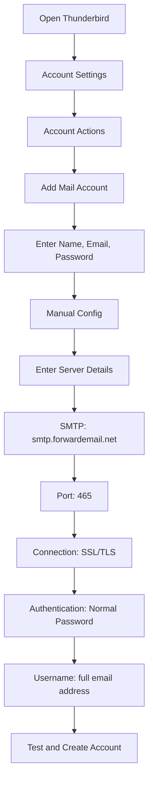

# Exemples d'intégration SMTP {#smtp-integration-examples}

## Table des matières {#table-of-contents}

* [Avant-propos](#foreword)
* [Comment fonctionne le traitement SMTP de Forward Email](#how-forward-emails-smtp-processing-works)
  * [Système de file d'attente et de nouvelle tentative de courrier électronique](#email-queue-and-retry-system)
  * [Fiabilité garantie grâce à une épreuve de mannequin](#dummy-proofed-for-reliability)
* [Intégration Node.js](#nodejs-integration)
  * [Utilisation de Nodemailer](#using-nodemailer)
  * [Utilisation d'Express.js](#using-expressjs)
* [Intégration Python](#python-integration)
  * [Utilisation de smtplib](#using-smtplib)
  * [Utilisation de Django](#using-django)
* [Intégration PHP](#php-integration)
  * [Utilisation de PHPMailer](#using-phpmailer)
  * [Utilisation de Laravel](#using-laravel)
* [Intégration Ruby](#ruby-integration)
  * [Utilisation de Ruby Mail Gem](#using-ruby-mail-gem)
* [Intégration Java](#java-integration)
  * [Utilisation de l'API Java Mail](#using-javamail-api)
* [Configuration du client de messagerie](#email-client-configuration)
  * [Thunderbird](#thunderbird)
  * [Apple Mail](#apple-mail)
  * [Gmail (Envoyer un e-mail en tant que)](#gmail-send-mail-as)
* [Dépannage](#troubleshooting)
  * [Problèmes courants et solutions](#common-issues-and-solutions)
  * [Obtenir de l'aide](#getting-help)
* [Ressources supplémentaires](#additional-resources)
* [Conclusion](#conclusion)

## Avant-propos {#foreword}

Ce guide fournit des exemples détaillés d'intégration au service SMTP de Forward Email à l'aide de différents langages de programmation, frameworks et clients de messagerie. Notre service SMTP est conçu pour être fiable, sécurisé et facile à intégrer à vos applications existantes.

## Comment fonctionne le traitement SMTP des e-mails transférés {#how-forward-emails-smtp-processing-works}

Avant de plonger dans les exemples d'intégration, il est important de comprendre comment notre service SMTP traite les e-mails :

### Système de file d'attente et de nouvelle tentative de courrier électronique {#email-queue-and-retry-system}

Lorsque vous soumettez un e-mail via SMTP à nos serveurs :

1. **Traitement initial** : L’e-mail est validé, analysé pour détecter les logiciels malveillants et vérifié par les filtres anti-spam.
2. **Mise en file d’attente intelligente** : Les e-mails sont placés dans un système de file d’attente sophistiqué avant d’être distribués.
3. **Mécanisme de nouvelle tentative intelligent** : En cas d’échec temporaire de distribution, notre système :
* Analyse la réponse d’erreur à l’aide de notre fonction `getBounceInfo`.
* Détermine si le problème est temporaire (par exemple, « réessayer ultérieurement », « temporairement différé ») ou permanent (par exemple, « utilisateur inconnu »).
* En cas de problème temporaire, l’e-mail est marqué pour une nouvelle tentative.
* En cas de problème permanent, une notification de rebond est générée.
4. **Période de nouvelle tentative de 5 jours** : Nous retentons la distribution pendant 5 jours maximum (similaire aux normes du secteur comme Postfix), ce qui laisse le temps aux problèmes temporaires de se résoudre.
5. **Notifications d’état de distribution** : Les expéditeurs reçoivent des notifications sur l’état de leurs e-mails (distribués, retardés ou rejetés).

> \[!NOTE]
> Après une distribution réussie, le contenu des e-mails SMTP sortants est supprimé après une période de conservation configurable (30 jours par défaut) pour des raisons de sécurité et de confidentialité. Seul un message d'espace réservé reste affiché, indiquant la distribution réussie.

### Testé pour plus de fiabilité {#dummy-proofed-for-reliability}

Notre système est conçu pour gérer divers cas extrêmes :

* Si une liste noire est détectée, l'e-mail sera automatiquement réessayé.
* En cas de problème réseau, une nouvelle tentative de livraison sera effectuée.
* Si la boîte mail du destinataire est pleine, le système réessayera ultérieurement.
* Si le serveur de réception est temporairement indisponible, nous réessayerons.

Cette approche améliore considérablement les taux de livraison tout en préservant la confidentialité et la sécurité.

## Intégration Node.js {#nodejs-integration}

### Utilisation de Nodemailer {#using-nodemailer}

[Nodemailer](https://nodemailer.com/) est un module populaire pour l'envoi d'e-mails à partir d'applications Node.js.

```javascript
const nodemailer = require('nodemailer');

// Create a transporter object
const transporter = nodemailer.createTransport({
  host: 'smtp.forwardemail.net',
  port: 465,
  secure: true, // Use TLS
  auth: {
    user: 'your-username@your-domain.com',
    pass: 'your-password'
  }
});

// Send mail with defined transport object
async function sendEmail() {
  try {
    const info = await transporter.sendMail({
      from: '"Your Name" <your-username@your-domain.com>',
      to: 'recipient@example.com',
      subject: 'Hello from Forward Email',
      text: 'Hello world! This is a test email sent using Nodemailer and Forward Email SMTP.',
      html: '<b>Hello world!</b> This is a test email sent using Nodemailer and Forward Email SMTP.'
    });

    console.log('Message sent: %s', info.messageId);
  } catch (error) {
    console.error('Error sending email:', error);
  }
}

sendEmail();
```

### Utilisation d'Express.js {#using-expressjs}

Voici comment intégrer Forward Email SMTP à une application Express.js :

```javascript
const express = require('express');
const nodemailer = require('nodemailer');
const app = express();
const port = 3000;

app.use(express.json());

// Configure email transporter
const transporter = nodemailer.createTransport({
  host: 'smtp.forwardemail.net',
  port: 465,
  secure: true,
  auth: {
    user: 'your-username@your-domain.com',
    pass: 'your-password'
  }
});

// API endpoint for sending emails
app.post('/send-email', async (req, res) => {
  const { to, subject, text, html } = req.body;

  try {
    const info = await transporter.sendMail({
      from: '"Your App" <your-username@your-domain.com>',
      to,
      subject,
      text,
      html
    });

    res.status(200).json({
      success: true,
      messageId: info.messageId
    });
  } catch (error) {
    console.error('Error sending email:', error);
    res.status(500).json({
      success: false,
      error: error.message
    });
  }
});

app.listen(port, () => {
  console.log(`Server running at http://localhost:${port}`);
});
```

## Intégration Python {#python-integration}

### Utilisation de smtplib {#using-smtplib}

```python
import smtplib
from email.mime.text import MIMEText
from email.mime.multipart import MIMEMultipart

# Email configuration
sender_email = "your-username@your-domain.com"
receiver_email = "recipient@example.com"
password = "your-password"

# Create message
message = MIMEMultipart("alternative")
message["Subject"] = "Hello from Forward Email"
message["From"] = sender_email
message["To"] = receiver_email

# Create the plain-text and HTML version of your message
text = "Hello world! This is a test email sent using Python and Forward Email SMTP."
html = "<html><body><b>Hello world!</b> This is a test email sent using Python and Forward Email SMTP.</body></html>"

# Turn these into plain/html MIMEText objects
part1 = MIMEText(text, "plain")
part2 = MIMEText(html, "html")

# Add HTML/plain-text parts to MIMEMultipart message
message.attach(part1)
message.attach(part2)

# Send email
try:
    server = smtplib.SMTP_SSL("smtp.forwardemail.net", 465)
    server.login(sender_email, password)
    server.sendmail(sender_email, receiver_email, message.as_string())
    server.quit()
    print("Email sent successfully!")
except Exception as e:
    print(f"Error sending email: {e}")
```

### Utilisation de Django {#using-django}

Pour les applications Django, ajoutez ce qui suit à votre `settings.py` :

```python
# Email settings
EMAIL_BACKEND = 'django.core.mail.backends.smtp.EmailBackend'
EMAIL_HOST = 'smtp.forwardemail.net'
EMAIL_PORT = 465
EMAIL_USE_SSL = True
EMAIL_HOST_USER = 'your-username@your-domain.com'
EMAIL_HOST_PASSWORD = 'your-password'
DEFAULT_FROM_EMAIL = 'your-username@your-domain.com'
```

Envoyez ensuite des e-mails dans vos vues :

```python
from django.core.mail import send_mail

def send_email_view(request):
    send_mail(
        'Subject here',
        'Here is the message.',
        'from@your-domain.com',
        ['to@example.com'],
        fail_silently=False,
        html_message='<b>Here is the HTML message.</b>'
    )
    return HttpResponse('Email sent!')
```

## Intégration PHP {#php-integration}

### Utilisation de PHPMailer {#using-phpmailer}

```php
<?php
use PHPMailer\PHPMailer\PHPMailer;
use PHPMailer\PHPMailer\Exception;

require 'vendor/autoload.php';

$mail = new PHPMailer(true);

try {
    // Server settings
    $mail->isSMTP();
    $mail->Host       = 'smtp.forwardemail.net';
    $mail->SMTPAuth   = true;
    $mail->Username   = 'your-username@your-domain.com';
    $mail->Password   = 'your-password';
    $mail->SMTPSecure = PHPMailer::ENCRYPTION_SMTPS;
    $mail->Port       = 465;

    // Recipients
    $mail->setFrom('your-username@your-domain.com', 'Your Name');
    $mail->addAddress('recipient@example.com', 'Recipient Name');
    $mail->addReplyTo('your-username@your-domain.com', 'Your Name');

    // Content
    $mail->isHTML(true);
    $mail->Subject = 'Hello from Forward Email';
    $mail->Body    = '<b>Hello world!</b> This is a test email sent using PHPMailer and Forward Email SMTP.';
    $mail->AltBody = 'Hello world! This is a test email sent using PHPMailer and Forward Email SMTP.';

    $mail->send();
    echo 'Message has been sent';
} catch (Exception $e) {
    echo "Message could not be sent. Mailer Error: {$mail->ErrorInfo}";
}
```

### Utilisation de Laravel {#using-laravel}

Pour les applications Laravel, mettez à jour votre fichier `.env` :

```sh
MAIL_MAILER=smtp
MAIL_HOST=smtp.forwardemail.net
MAIL_PORT=465
MAIL_USERNAME=your-username@your-domain.com
MAIL_PASSWORD=your-password
MAIL_ENCRYPTION=ssl
MAIL_FROM_ADDRESS=your-username@your-domain.com
MAIL_FROM_NAME="${APP_NAME}"
```

Envoyez ensuite des e-mails en utilisant la façade Mail de Laravel :

```php
<?php

namespace App\Http\Controllers;

use Illuminate\Http\Request;
use Illuminate\Support\Facades\Mail;
use App\Mail\WelcomeEmail;

class EmailController extends Controller
{
    public function sendEmail()
    {
        Mail::to('recipient@example.com')->send(new WelcomeEmail());

        return 'Email sent successfully!';
    }
}
```

## Intégration Ruby {#ruby-integration}

### Utilisation de Ruby Mail Gem {#using-ruby-mail-gem}

```ruby
require 'mail'

Mail.defaults do
  delivery_method :smtp, {
    address: 'smtp.forwardemail.net',
    port: 465,
    domain: 'your-domain.com',
    user_name: 'your-username@your-domain.com',
    password: 'your-password',
    authentication: 'plain',
    enable_starttls_auto: true,
    ssl: true
  }
end

mail = Mail.new do
  from     'your-username@your-domain.com'
  to       'recipient@example.com'
  subject  'Hello from Forward Email'

  text_part do
    body 'Hello world! This is a test email sent using Ruby Mail and Forward Email SMTP.'
  end

  html_part do
    content_type 'text/html; charset=UTF-8'
    body '<b>Hello world!</b> This is a test email sent using Ruby Mail and Forward Email SMTP.'
  end
end

mail.deliver!
puts "Email sent successfully!"
```

## Intégration Java {#java-integration}

### Utilisation de l'API JavaMail {#using-javamail-api}

```java
import java.util.Properties;
import javax.mail.*;
import javax.mail.internet.*;

public class SendEmail {
    public static void main(String[] args) {
        // Sender's email and password
        final String username = "your-username@your-domain.com";
        final String password = "your-password";

        // SMTP server properties
        Properties props = new Properties();
        props.put("mail.smtp.auth", "true");
        props.put("mail.smtp.starttls.enable", "true");
        props.put("mail.smtp.host", "smtp.forwardemail.net");
        props.put("mail.smtp.port", "465");
        props.put("mail.smtp.socketFactory.port", "465");
        props.put("mail.smtp.socketFactory.class", "javax.net.ssl.SSLSocketFactory");

        // Create session with authenticator
        Session session = Session.getInstance(props,
            new javax.mail.Authenticator() {
                protected PasswordAuthentication getPasswordAuthentication() {
                    return new PasswordAuthentication(username, password);
                }
            });

        try {
            // Create message
            Message message = new MimeMessage(session);
            message.setFrom(new InternetAddress(username));
            message.setRecipients(Message.RecipientType.TO, InternetAddress.parse("recipient@example.com"));
            message.setSubject("Hello from Forward Email");

            // Create multipart message
            Multipart multipart = new MimeMultipart("alternative");

            // Text part
            BodyPart textPart = new MimeBodyPart();
            textPart.setText("Hello world! This is a test email sent using JavaMail and Forward Email SMTP.");

            // HTML part
            BodyPart htmlPart = new MimeBodyPart();
            htmlPart.setContent("<b>Hello world!</b> This is a test email sent using JavaMail and Forward Email SMTP.", "text/html");

            // Add parts to multipart
            multipart.addBodyPart(textPart);
            multipart.addBodyPart(htmlPart);

            // Set content
            message.setContent(multipart);

            // Send message
            Transport.send(message);

            System.out.println("Email sent successfully!");

        } catch (MessagingException e) {
            throw new RuntimeException(e);
        }
    }
}
```

## Configuration du client de messagerie {#email-client-configuration}

### Thunderbird {#thunderbird}



1. Ouvrez Thunderbird et accédez aux Paramètres du compte.
2. Cliquez sur « Actions du compte » et sélectionnez « Ajouter un compte de messagerie ».
3. Saisissez votre nom, votre adresse e-mail et votre mot de passe.
4. Cliquez sur « Configuration manuelle » et saisissez les informations suivantes :
* Serveur entrant :
* IMAP : imap.forwardemail.net, Port : 993, SSL/TLS
* POP3 : pop3.forwardemail.net, Port : 995, SSL/TLS
* Serveur sortant (SMTP) : smtp.forwardemail.net, Port : 465, SSL/TLS
* Authentification : Mot de passe standard
* Nom d'utilisateur : votre adresse e-mail complète
5. Cliquez sur « Tester », puis sur « Terminé ».

### Apple Mail {#apple-mail}

1. Ouvrez Mail et accédez à Mail > Préférences > Comptes.
2. Cliquez sur le bouton « + » pour ajouter un nouveau compte.
3. Sélectionnez « Autre compte de messagerie » et cliquez sur « Continuer ».
4. Saisissez votre nom, votre adresse e-mail et votre mot de passe, puis cliquez sur « Connexion ».
5. En cas d'échec de la configuration automatique, saisissez les informations suivantes :
* Serveur de courrier entrant : imap.forwardemail.net (ou pop3.forwardemail.net pour POP3)
* Serveur de courrier sortant : smtp.forwardemail.net
* Nom d'utilisateur : votre adresse e-mail complète
* Mot de passe : votre mot de passe.
6. Cliquez sur « Connexion » pour terminer la configuration.

### Gmail (Envoyer un e-mail en tant que) {#gmail-send-mail-as}

1. Ouvrez Gmail et accédez à Paramètres > Comptes et Importation.
2. Sous « Envoyer un e-mail en tant que », cliquez sur « Ajouter une autre adresse e-mail ».
3. Saisissez votre nom et votre adresse e-mail, puis cliquez sur « Étape suivante ».
4. Saisissez les informations de serveur SMTP suivantes :
* Serveur SMTP : smtp.forwardemail.net
* Port : 465
* Nom d'utilisateur : votre adresse e-mail complète
* Mot de passe : votre mot de passe
* Sélectionnez « Connexion sécurisée via SSL ».
5. Cliquez sur « Ajouter un compte » et vérifiez votre adresse e-mail.

## Dépannage de {#troubleshooting}

### Problèmes courants et solutions {#common-issues-and-solutions}

1. **Échec de l'authentification**
* Vérifiez votre nom d'utilisateur (adresse e-mail complète) et votre mot de passe.
* Assurez-vous d'utiliser le bon port (465 pour SSL/TLS).
* Vérifiez que l'accès SMTP est activé sur votre compte.

2. **Délai de connexion expiré**
* Vérifiez votre connexion Internet
* Vérifiez que les paramètres du pare-feu ne bloquent pas le trafic SMTP
* Essayez d'utiliser un autre port (587 avec STARTTLS)

3. **Message rejeté**
* Assurez-vous que votre adresse d'expéditeur correspond à votre adresse e-mail authentifiée.
* Vérifiez si votre adresse IP est sur liste noire.
* Vérifiez que le contenu de votre message ne déclenche pas les filtres anti-spam.

4. **Erreurs TLS/SSL**
* Mettez à jour votre application/bibliothèque pour prendre en charge les versions TLS modernes.
* Assurez-vous que les certificats d'autorité de certification de votre système sont à jour.
* Privilégiez TLS explicite plutôt qu'implicite.

### Obtenir de l'aide {#getting-help}

Si vous rencontrez des problèmes non abordés ici, veuillez :

1. Consultez notre [Page FAQ](/faq) pour les questions fréquentes
2. Consultez notre [article de blog sur la livraison des e-mails](/blog/docs/best-email-forwarding-service) pour des informations détaillées
3. Contactez notre équipe d'assistance à l'adresse <support@forwardemail.net>

## Ressources supplémentaires {#additional-resources}

* [Documentation sur les e-mails transférés](/docs)
* [Limites et configuration du serveur SMTP](/faq#what-are-your-outbound-smtp-limits)
* [Guide des meilleures pratiques en matière de courrier électronique](/blog/docs/best-email-forwarding-service)
* [Pratiques de sécurité](/security)

## Conclusion {#conclusion}

Le service SMTP de Forward Email offre un moyen fiable, sécurisé et respectueux de la confidentialité pour envoyer des e-mails depuis vos applications et clients de messagerie. Grâce à notre système de file d'attente intelligent, notre mécanisme de nouvelle tentative sous 5 jours et nos notifications complètes sur l'état de livraison, vous avez l'assurance que vos e-mails arriveront à destination.

Pour des cas d'utilisation plus avancés ou des intégrations personnalisées, veuillez contacter notre équipe d'assistance.