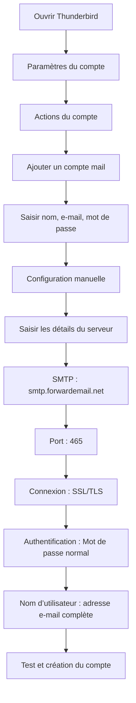

# Exemples d'Intégration SMTP {#smtp-integration-examples}


## Table des Matières {#table-of-contents}

* [Avant-propos](#foreword)
* [Comment fonctionne le traitement SMTP de Forward Email](#how-forward-emails-smtp-processing-works)
  * [File d'attente des emails et système de réessai](#email-queue-and-retry-system)
  * [Conçu pour la fiabilité](#dummy-proofed-for-reliability)
* [Intégration Node.js](#nodejs-integration)
  * [Utilisation de Nodemailer](#using-nodemailer)
  * [Utilisation d'Express.js](#using-expressjs)
* [Intégration Python](#python-integration)
  * [Utilisation de smtplib](#using-smtplib)
  * [Utilisation de Django](#using-django)
* [Intégration PHP](#php-integration)
  * [Utilisation de PHPMailer](#using-phpmailer)
  * [Utilisation de Laravel](#using-laravel)
* [Intégration Ruby](#ruby-integration)
  * [Utilisation du gem Ruby Mail](#using-ruby-mail-gem)
* [Intégration Java](#java-integration)
  * [Utilisation de l'API JavaMail](#using-javamail-api)
* [Configuration du client email](#email-client-configuration)
  * [Thunderbird](#thunderbird)
  * [Apple Mail](#apple-mail)
  * [Gmail (Envoyer un mail en tant que)](#gmail-send-mail-as)
* [Dépannage](#troubleshooting)
  * [Problèmes courants et solutions](#common-issues-and-solutions)
  * [Obtenir de l'aide](#getting-help)
* [Ressources supplémentaires](#additional-resources)
* [Conclusion](#conclusion)


## Avant-propos {#foreword}

Ce guide fournit des exemples détaillés sur la manière d'intégrer le service SMTP de Forward Email en utilisant divers langages de programmation, frameworks et clients email. Notre service SMTP est conçu pour être fiable, sécurisé et facile à intégrer à vos applications existantes.


## Comment fonctionne le traitement SMTP de Forward Email {#how-forward-emails-smtp-processing-works}

Avant de plonger dans les exemples d'intégration, il est important de comprendre comment notre service SMTP traite les emails :

### File d'attente des emails et système de réessai {#email-queue-and-retry-system}

Lorsque vous soumettez un email via SMTP à nos serveurs :

1. **Traitement initial** : L'email est validé, scanné pour détecter les malwares, et vérifié contre les filtres anti-spam
2. **Mise en file intelligente** : Les emails sont placés dans un système de file d'attente sophistiqué pour la livraison
3. **Mécanisme de réessai intelligent** : Si la livraison échoue temporairement, notre système va :
   * Analyser la réponse d'erreur en utilisant notre fonction `getBounceInfo`
   * Déterminer si le problème est temporaire (ex. : "réessayez plus tard", "temporairement différé") ou permanent (ex. : "utilisateur inconnu")
   * Pour les problèmes temporaires, marquer l'email pour un réessai
   * Pour les problèmes permanents, générer une notification de rebond
4. **Période de réessai de 5 jours** : Nous réessayons la livraison pendant jusqu'à 5 jours (similaire aux standards de l'industrie comme Postfix), donnant le temps aux problèmes temporaires de se résoudre
5. **Notifications de statut de livraison** : Les expéditeurs reçoivent des notifications concernant le statut de leurs emails (livrés, retardés ou rebondis)

> \[!NOTE]
> Après une livraison réussie, le contenu des emails SMTP sortants est expurgé après une période de rétention configurable (par défaut 30 jours) pour des raisons de sécurité et de confidentialité. Seul un message de remplacement indiquant la livraison réussie reste.

### Conçu pour la fiabilité {#dummy-proofed-for-reliability}

Notre système est conçu pour gérer divers cas limites :

* Si une liste de blocage est détectée, l'email sera automatiquement réessayé
* En cas de problèmes réseau, la livraison sera tentée à nouveau
* Si la boîte de réception du destinataire est pleine, le système réessaiera plus tard
* Si le serveur destinataire est temporairement indisponible, nous continuerons à essayer

Cette approche améliore significativement les taux de livraison tout en maintenant la confidentialité et la sécurité.


## Intégration Node.js {#nodejs-integration}

### Utilisation de Nodemailer {#using-nodemailer}

[Nodemailer](https://nodemailer.com/) est un module populaire pour envoyer des emails depuis des applications Node.js.

```javascript
const nodemailer = require('nodemailer');

// Create a transporter object
const transporter = nodemailer.createTransport({
  host: 'smtp.forwardemail.net',
  port: 465,
  secure: true, // Use TLS
  auth: {
    user: 'your-username@your-domain.com',
    pass: 'your-password'
  }
});

// Send mail with defined transport object
async function sendEmail() {
  try {
    const info = await transporter.sendMail({
      from: '"Your Name" <your-username@your-domain.com>',
      to: 'recipient@example.com',
      subject: 'Hello from Forward Email',
      text: 'Hello world! This is a test email sent using Nodemailer and Forward Email SMTP.',
      html: '<b>Hello world!</b> This is a test email sent using Nodemailer and Forward Email SMTP.'
    });

    console.log('Message sent: %s', info.messageId);
  } catch (error) {
    console.error('Error sending email:', error);
  }
}

sendEmail();
```
### Utilisation d'Express.js {#using-expressjs}

Voici comment intégrer Forward Email SMTP avec une application Express.js :

```javascript
const express = require('express');
const nodemailer = require('nodemailer');
const app = express();
const port = 3000;

app.use(express.json());

// Configurer le transporteur d'email
const transporter = nodemailer.createTransport({
  host: 'smtp.forwardemail.net',
  port: 465,
  secure: true,
  auth: {
    user: 'your-username@your-domain.com',
    pass: 'your-password'
  }
});

// Point de terminaison API pour l'envoi d'emails
app.post('/send-email', async (req, res) => {
  const { to, subject, text, html } = req.body;

  try {
    const info = await transporter.sendMail({
      from: '"Your App" <your-username@your-domain.com>',
      to,
      subject,
      text,
      html
    });

    res.status(200).json({
      success: true,
      messageId: info.messageId
    });
  } catch (error) {
    console.error('Erreur lors de l\'envoi de l\'email :', error);
    res.status(500).json({
      success: false,
      error: error.message
    });
  }
});

app.listen(port, () => {
  console.log(`Serveur en cours d'exécution à http://localhost:${port}`);
});
```


## Intégration Python {#python-integration}

### Utilisation de smtplib {#using-smtplib}

```python
import smtplib
from email.mime.text import MIMEText
from email.mime.multipart import MIMEMultipart

# Configuration de l'email
sender_email = "your-username@your-domain.com"
receiver_email = "recipient@example.com"
password = "your-password"

# Créer le message
message = MIMEMultipart("alternative")
message["Subject"] = "Bonjour de Forward Email"
message["From"] = sender_email
message["To"] = receiver_email

# Créer la version texte brut et HTML de votre message
text = "Hello world! This is a test email sent using Python and Forward Email SMTP."
html = "<html><body><b>Hello world!</b> This is a test email sent using Python and Forward Email SMTP.</body></html>"

# Transformer ces parties en objets MIMEText texte/plain et HTML
part1 = MIMEText(text, "plain")
part2 = MIMEText(html, "html")

# Ajouter les parties HTML/texte brut au message MIMEMultipart
message.attach(part1)
message.attach(part2)

# Envoyer l'email
try:
    server = smtplib.SMTP_SSL("smtp.forwardemail.net", 465)
    server.login(sender_email, password)
    server.sendmail(sender_email, receiver_email, message.as_string())
    server.quit()
    print("Email envoyé avec succès !")
except Exception as e:
    print(f"Erreur lors de l'envoi de l'email : {e}")
```

### Utilisation de Django {#using-django}

Pour les applications Django, ajoutez ce qui suit à votre `settings.py` :

```python
# Paramètres email
EMAIL_BACKEND = 'django.core.mail.backends.smtp.EmailBackend'
EMAIL_HOST = 'smtp.forwardemail.net'
EMAIL_PORT = 465
EMAIL_USE_SSL = True
EMAIL_HOST_USER = 'your-username@your-domain.com'
EMAIL_HOST_PASSWORD = 'your-password'
DEFAULT_FROM_EMAIL = 'your-username@your-domain.com'
```

Puis envoyez des emails dans vos vues :

```python
from django.core.mail import send_mail

def send_email_view(request):
    send_mail(
        'Sujet ici',
        'Voici le message.',
        'from@your-domain.com',
        ['to@example.com'],
        fail_silently=False,
        html_message='<b>Voici le message HTML.</b>'
    )
    return HttpResponse('Email envoyé !')
```


## Intégration PHP {#php-integration}

### Utilisation de PHPMailer {#using-phpmailer}

```php
<?php
use PHPMailer\PHPMailer\PHPMailer;
use PHPMailer\PHPMailer\Exception;

require 'vendor/autoload.php';

$mail = new PHPMailer(true);

try {
    // Paramètres du serveur
    $mail->isSMTP();
    $mail->Host       = 'smtp.forwardemail.net';
    $mail->SMTPAuth   = true;
    $mail->Username   = 'your-username@your-domain.com';
    $mail->Password   = 'your-password';
    $mail->SMTPSecure = PHPMailer::ENCRYPTION_SMTPS;
    $mail->Port       = 465;

    // Destinataires
    $mail->setFrom('your-username@your-domain.com', 'Votre Nom');
    $mail->addAddress('recipient@example.com', 'Nom du destinataire');
    $mail->addReplyTo('your-username@your-domain.com', 'Votre Nom');

    // Contenu
    $mail->isHTML(true);
    $mail->Subject = 'Bonjour de Forward Email';
    $mail->Body    = '<b>Hello world!</b> This is a test email sent using PHPMailer and Forward Email SMTP.';
    $mail->AltBody = 'Hello world! This is a test email sent using PHPMailer and Forward Email SMTP.';

    $mail->send();
    echo 'Le message a été envoyé';
} catch (Exception $e) {
    echo "Le message n'a pas pu être envoyé. Erreur du Mailer : {$mail->ErrorInfo}";
}
```
### Utilisation de Laravel {#using-laravel}

Pour les applications Laravel, mettez à jour votre fichier `.env` :

```sh
MAIL_MAILER=smtp
MAIL_HOST=smtp.forwardemail.net
MAIL_PORT=465
MAIL_USERNAME=your-username@your-domain.com
MAIL_PASSWORD=your-password
MAIL_ENCRYPTION=ssl
MAIL_FROM_ADDRESS=your-username@your-domain.com
MAIL_FROM_NAME="${APP_NAME}"
```

Ensuite, envoyez des e-mails en utilisant la façade Mail de Laravel :

```php
<?php

namespace App\Http\Controllers;

use Illuminate\Http\Request;
use Illuminate\Support\Facades\Mail;
use App\Mail\WelcomeEmail;

class EmailController extends Controller
{
    public function sendEmail()
    {
        Mail::to('recipient@example.com')->send(new WelcomeEmail());

        return 'E-mail envoyé avec succès !';
    }
}
```


## Intégration Ruby {#ruby-integration}

### Utilisation de la gem Ruby Mail {#using-ruby-mail-gem}

```ruby
require 'mail'

Mail.defaults do
  delivery_method :smtp, {
    address: 'smtp.forwardemail.net',
    port: 465,
    domain: 'your-domain.com',
    user_name: 'your-username@your-domain.com',
    password: 'your-password',
    authentication: 'plain',
    enable_starttls_auto: true,
    ssl: true
  }
end

mail = Mail.new do
  from     'your-username@your-domain.com'
  to       'recipient@example.com'
  subject  'Bonjour de Forward Email'

  text_part do
    body 'Bonjour le monde ! Ceci est un e-mail de test envoyé en utilisant Ruby Mail et Forward Email SMTP.'
  end

  html_part do
    content_type 'text/html; charset=UTF-8'
    body '<b>Bonjour le monde !</b> Ceci est un e-mail de test envoyé en utilisant Ruby Mail et Forward Email SMTP.'
  end
end

mail.deliver!
puts "E-mail envoyé avec succès !"
```


## Intégration Java {#java-integration}

### Utilisation de l’API JavaMail {#using-javamail-api}

```java
import java.util.Properties;
import javax.mail.*;
import javax.mail.internet.*;

public class SendEmail {
    public static void main(String[] args) {
        // E-mail et mot de passe de l’expéditeur
        final String username = "your-username@your-domain.com";
        final String password = "your-password";

        // Propriétés du serveur SMTP
        Properties props = new Properties();
        props.put("mail.smtp.auth", "true");
        props.put("mail.smtp.starttls.enable", "true");
        props.put("mail.smtp.host", "smtp.forwardemail.net");
        props.put("mail.smtp.port", "465");
        props.put("mail.smtp.socketFactory.port", "465");
        props.put("mail.smtp.socketFactory.class", "javax.net.ssl.SSLSocketFactory");

        // Création de la session avec authentificateur
        Session session = Session.getInstance(props,
            new javax.mail.Authenticator() {
                protected PasswordAuthentication getPasswordAuthentication() {
                    return new PasswordAuthentication(username, password);
                }
            });

        try {
            // Création du message
            Message message = new MimeMessage(session);
            message.setFrom(new InternetAddress(username));
            message.setRecipients(Message.RecipientType.TO, InternetAddress.parse("recipient@example.com"));
            message.setSubject("Bonjour de Forward Email");

            // Création du message multipart
            Multipart multipart = new MimeMultipart("alternative");

            // Partie texte
            BodyPart textPart = new MimeBodyPart();
            textPart.setText("Bonjour le monde ! Ceci est un e-mail de test envoyé en utilisant JavaMail et Forward Email SMTP.");

            // Partie HTML
            BodyPart htmlPart = new MimeBodyPart();
            htmlPart.setContent("<b>Bonjour le monde !</b> Ceci est un e-mail de test envoyé en utilisant JavaMail et Forward Email SMTP.", "text/html");

            // Ajout des parties au multipart
            multipart.addBodyPart(textPart);
            multipart.addBodyPart(htmlPart);

            // Définition du contenu
            message.setContent(multipart);

            // Envoi du message
            Transport.send(message);

            System.out.println("E-mail envoyé avec succès !");

        } catch (MessagingException e) {
            throw new RuntimeException(e);
        }
    }
}
```


## Configuration du client e-mail {#email-client-configuration}

### Thunderbird {#thunderbird}


```mermaid
flowchart TD
    A[Ouvrir Thunderbird] --> B[Paramètres du compte]
    B --> C[Actions du compte]
    C --> D[Ajouter un compte mail]
    D --> E[Saisir nom, e-mail, mot de passe]
    E --> F[Configuration manuelle]
    F --> G[Saisir les détails du serveur]
    G --> H[SMTP : smtp.forwardemail.net]
    H --> I[Port : 465]
    I --> J[Connexion : SSL/TLS]
    J --> K[Authentification : Mot de passe normal]
    K --> L[Nom d’utilisateur : adresse e-mail complète]
    L --> M[Test et création du compte]
```
1. Ouvrez Thunderbird et allez dans Paramètres du compte  
2. Cliquez sur "Actions du compte" et sélectionnez "Ajouter un compte mail"  
3. Entrez votre nom, adresse e-mail et mot de passe  
4. Cliquez sur "Configuration manuelle" et saisissez les informations suivantes :  
   * Serveur entrant :  
     * IMAP : imap.forwardemail.net, Port : 993, SSL/TLS  
     * POP3 : pop3.forwardemail.net, Port : 995, SSL/TLS  
   * Serveur sortant (SMTP) : smtp.forwardemail.net, Port : 465, SSL/TLS  
   * Authentification : Mot de passe normal  
   * Nom d’utilisateur : votre adresse e-mail complète  
5. Cliquez sur "Tester" puis sur "Terminé"  

### Apple Mail {#apple-mail}

1. Ouvrez Mail et allez dans Mail > Préférences > Comptes  
2. Cliquez sur le bouton "+" pour ajouter un nouveau compte  
3. Sélectionnez "Autre compte mail" et cliquez sur "Continuer"  
4. Entrez votre nom, adresse e-mail et mot de passe, puis cliquez sur "Se connecter"  
5. Lorsque la configuration automatique échoue, saisissez les informations suivantes :  
   * Serveur de courrier entrant : imap.forwardemail.net (ou pop3.forwardemail.net pour POP3)  
   * Serveur de courrier sortant : smtp.forwardemail.net  
   * Nom d’utilisateur : votre adresse e-mail complète  
   * Mot de passe : votre mot de passe  
6. Cliquez sur "Se connecter" pour terminer la configuration  

### Gmail (Envoyer un mail en tant que) {#gmail-send-mail-as}

1. Ouvrez Gmail et allez dans Paramètres > Comptes et importation  
2. Sous "Envoyer un mail en tant que", cliquez sur "Ajouter une autre adresse e-mail"  
3. Entrez votre nom et votre adresse e-mail, puis cliquez sur "Étape suivante"  
4. Saisissez les détails du serveur SMTP suivants :  
   * Serveur SMTP : smtp.forwardemail.net  
   * Port : 465  
   * Nom d’utilisateur : votre adresse e-mail complète  
   * Mot de passe : votre mot de passe  
   * Sélectionnez "Connexion sécurisée utilisant SSL"  
5. Cliquez sur "Ajouter un compte" et vérifiez votre adresse e-mail  

## Dépannage {#troubleshooting}

### Problèmes courants et solutions {#common-issues-and-solutions}

1. **Échec d’authentification**  
   * Vérifiez votre nom d’utilisateur (adresse e-mail complète) et votre mot de passe  
   * Assurez-vous d’utiliser le bon port (465 pour SSL/TLS)  
   * Vérifiez que votre compte a l’accès SMTP activé  

2. **Délai de connexion dépassé**  
   * Vérifiez votre connexion internet  
   * Assurez-vous que les paramètres du pare-feu ne bloquent pas le trafic SMTP  
   * Essayez d’utiliser le port 465 avec SSL/TLS (recommandé) ou le port 587 avec STARTTLS  

3. **Message rejeté**  
   * Assurez-vous que l’adresse "De" correspond à votre e-mail authentifié  
   * Vérifiez si votre IP est sur liste noire  
   * Vérifiez que le contenu de votre message ne déclenche pas les filtres anti-spam  

4. **Erreurs TLS/SSL**  
   * Mettez à jour votre application/bibliothèque pour supporter les versions TLS modernes  
   * Assurez-vous que les certificats CA de votre système sont à jour  
   * Essayez TLS explicite au lieu de TLS implicite  

### Obtenir de l’aide {#getting-help}

Si vous rencontrez des problèmes non couverts ici, veuillez :  

1. Consulter notre [page FAQ](/faq) pour les questions courantes  
2. Lire notre [article de blog sur la livraison des e-mails](/blog/docs/best-email-forwarding-service) pour des informations détaillées  
3. Contacter notre équipe de support à <support@forwardemail.net>  

## Ressources supplémentaires {#additional-resources}

* [Documentation Forward Email](/docs)  
* [Limites et configuration du serveur SMTP](/faq#what-are-your-outbound-smtp-limits)  
* [Guide des bonnes pratiques pour les e-mails](/blog/docs/best-email-forwarding-service)  
* [Pratiques de sécurité](/security)  

## Conclusion {#conclusion}

Le service SMTP de Forward Email offre un moyen fiable, sécurisé et respectueux de la vie privée pour envoyer des e-mails depuis vos applications et clients mail. Grâce à notre système de file d’attente intelligent, notre mécanisme de nouvelle tentative sur 5 jours et nos notifications complètes sur le statut de livraison, vous pouvez être sûr que vos e-mails atteindront leur destination.  

Pour des cas d’utilisation plus avancés ou des intégrations personnalisées, veuillez contacter notre équipe de support.
