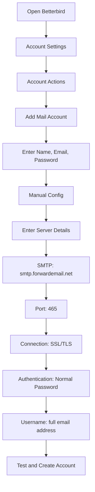

# דוגמאות לשילוב SMTP {#smtp-integration-examples}

## תוכן עניינים

* [הַקדָמָה](#foreword)
* [כיצד פועל עיבוד ה-SMTP של דוא"ל קדמי](#how-forward-emails-smtp-processing-works)
  * [מערכת תור וניסיון חוזר של דוא"ל](#email-queue-and-retry-system)
  * [אטום לאמינות](#dummy-proofed-for-reliability)
* [אינטגרציה עם Node.js](#nodejs-integration)
  * [שימוש ב-Nodemailer](#using-nodemailer)
  * [שימוש ב-Express.js](#using-expressjs)
* [אינטגרציה של פייתון](#python-integration)
  * [שימוש ב-smtplib](#using-smtplib)
  * [שימוש בדג'נגו](#using-django)
* [אינטגרציה של PHP](#php-integration)
  * [שימוש ב-PHPMailer](#using-phpmailer)
  * [שימוש בלראבל](#using-laravel)
* [אינטגרציה של רובי](#ruby-integration)
  * [שימוש באבני דואר רובי](#using-ruby-mail-gem)
* [אינטגרציה של ג'אווה](#java-integration)
  * [שימוש ב-API של Java Mail](#using-javamail-api)
* [תצורת לקוח דוא"ל](#email-client-configuration)
  * [ת'אנדרברד](#betterbird)
  * [אפל מייל](#apple-mail)
  * [ג'ימייל (שלח דואר כ)](#gmail-send-mail-as)
* [פתרון בעיות](#troubleshooting)
  * [בעיות נפוצות ופתרונות](#common-issues-and-solutions)
  * [קבלת עזרה](#getting-help)
* [משאבים נוספים](#additional-resources)
* [מַסְקָנָה](#conclusion)

## הקדמה {#foreword}

מדריך זה מספק דוגמאות מפורטות כיצד לשלב עם שירות ה-SMTP של Forward Email באמצעות שפות תכנות, מסגרות ולקוחות דוא"ל שונים. שירות ה-SMTP שלנו נועד להיות אמין, מאובטח וקל לשילוב עם היישומים הקיימים שלך.

## כיצד פועל עיבוד ה-SMTP של העברת דוא"ל {#how-forward-emails-smtp-processing-works}

לפני שנצלול לדוגמאות האינטגרציה, חשוב להבין כיצד שירות ה-SMTP שלנו מעבד מיילים:

### מערכת תור דוא"ל וניסיון חוזר {#email-queue-and-retry-system}

כאשר אתה שולח דוא"ל באמצעות SMTP לשרתים שלנו:

1. **עיבוד ראשוני**: האימייל מאומת, נסרק לאיתור תוכנות זדוניות ונבדק מול מסנני דואר זבל.
2. **תור חכם**: אימיילים מוצבים במערכת תור מתוחכמת למשלוח.
3. **מנגנון ניסיון חוזר חכם**: אם המסירה נכשלת באופן זמני, המערכת שלנו:
* תנתח את תגובת השגיאה באמצעות הפונקציה `getBounceInfo` שלנו.
* תקבע אם הבעיה זמנית (למשל, "נסה שוב מאוחר יותר", "נדחה זמנית") או קבועה (למשל, "משתמש לא ידוע").
* עבור בעיות זמניות, סמן את האימייל לניסיון חוזר.
* עבור בעיות קבועות, צור הודעת החזרה.
4. **תקופת ניסיון חוזר של 5 ימים**: אנו מנסים לשלוח שוב עד 5 ימים (בדומה לתקני התעשייה כמו Postfix), ונותנים לבעיות זמניות זמן לפתרון.
5. **הודעות סטטוס מסירה**: שולחים מקבלים התראות על סטטוס האימיילים שלהם (נמסרו, התעכבו או הוחזרו).

> \[!NOTE]
> לאחר מסירה מוצלחת, תוכן דוא"ל SMTP יוצא מוסר לאחר תקופת שמירה הניתנת להגדרה (ברירת מחדל 30 יום) למטרות אבטחה ופרטיות. נותרת רק הודעת placeholder המציינת מסירה מוצלחת.

### הוכחה לאמינות באמצעות דמה {#dummy-proofed-for-reliability}

המערכת שלנו מתוכננת להתמודד עם מגוון מקרי קצה:

* אם מזוהה רשימת חסימה, ייעשה ניסיון חוזר אוטומטי של שליחת האימייל
* אם יתרחשו בעיות רשת, ייעשה ניסיון חוזר למשלוח
* אם תיבת הדואר של הנמען מלאה, המערכת תנסה שוב מאוחר יותר
* אם שרת המקבל אינו זמין באופן זמני, נמשיך לנסות

גישה זו משפרת משמעותית את שיעורי המסירה תוך שמירה על פרטיות ואבטחה.

## שילוב Node.js {#nodejs-integration}

### שימוש ב-Nodemailer {#using-nodemailer}

[Nodemailer](https://nodemailer.com/) הוא מודול פופולרי לשליחת מיילים מיישומי Node.js.

```javascript
const nodemailer = require('nodemailer');

// Create a transporter object
const transporter = nodemailer.createTransport({
  host: 'smtp.forwardemail.net',
  port: 465,
  secure: true, // Use TLS
  auth: {
    user: 'your-username@your-domain.com',
    pass: 'your-password'
  }
});

// Send mail with defined transport object
async function sendEmail() {
  try {
    const info = await transporter.sendMail({
      from: '"Your Name" <your-username@your-domain.com>',
      to: 'recipient@example.com',
      subject: 'Hello from Forward Email',
      text: 'Hello world! This is a test email sent using Nodemailer and Forward Email SMTP.',
      html: '<b>Hello world!</b> This is a test email sent using Nodemailer and Forward Email SMTP.'
    });

    console.log('Message sent: %s', info.messageId);
  } catch (error) {
    console.error('Error sending email:', error);
  }
}

sendEmail();
```

### שימוש ב-Express.js {#using-expressjs}

כך ניתן לשלב Forward Email SMTP עם יישום Express.js:

```javascript
const express = require('express');
const nodemailer = require('nodemailer');
const app = express();
const port = 3000;

app.use(express.json());

// Configure email transporter
const transporter = nodemailer.createTransport({
  host: 'smtp.forwardemail.net',
  port: 465,
  secure: true,
  auth: {
    user: 'your-username@your-domain.com',
    pass: 'your-password'
  }
});

// API endpoint for sending emails
app.post('/send-email', async (req, res) => {
  const { to, subject, text, html } = req.body;

  try {
    const info = await transporter.sendMail({
      from: '"Your App" <your-username@your-domain.com>',
      to,
      subject,
      text,
      html
    });

    res.status(200).json({
      success: true,
      messageId: info.messageId
    });
  } catch (error) {
    console.error('Error sending email:', error);
    res.status(500).json({
      success: false,
      error: error.message
    });
  }
});

app.listen(port, () => {
  console.log(`Server running at http://localhost:${port}`);
});
```

## אינטגרציה של פייתון {#python-integration}

### שימוש ב-smtplib {#using-smtplib}

```python
import smtplib
from email.mime.text import MIMEText
from email.mime.multipart import MIMEMultipart

# Email configuration
sender_email = "your-username@your-domain.com"
receiver_email = "recipient@example.com"
password = "your-password"

# Create message
message = MIMEMultipart("alternative")
message["Subject"] = "Hello from Forward Email"
message["From"] = sender_email
message["To"] = receiver_email

# Create the plain-text and HTML version of your message
text = "Hello world! This is a test email sent using Python and Forward Email SMTP."
html = "<html><body><b>Hello world!</b> This is a test email sent using Python and Forward Email SMTP.</body></html>"

# Turn these into plain/html MIMEText objects
part1 = MIMEText(text, "plain")
part2 = MIMEText(html, "html")

# Add HTML/plain-text parts to MIMEMultipart message
message.attach(part1)
message.attach(part2)

# Send email
try:
    server = smtplib.SMTP_SSL("smtp.forwardemail.net", 465)
    server.login(sender_email, password)
    server.sendmail(sender_email, receiver_email, message.as_string())
    server.quit()
    print("Email sent successfully!")
except Exception as e:
    print(f"Error sending email: {e}")
```

### שימוש ב-Django {#using-django}

עבור יישומי Django, הוסף את הפרטים הבאים ל-`settings.py` שלך:

```python
# Email settings
EMAIL_BACKEND = 'django.core.mail.backends.smtp.EmailBackend'
EMAIL_HOST = 'smtp.forwardemail.net'
EMAIL_PORT = 465
EMAIL_USE_SSL = True
EMAIL_HOST_USER = 'your-username@your-domain.com'
EMAIL_HOST_PASSWORD = 'your-password'
DEFAULT_FROM_EMAIL = 'your-username@your-domain.com'
```

לאחר מכן שלח מיילים בתצוגות שלך:

```python
from django.core.mail import send_mail

def send_email_view(request):
    send_mail(
        'Subject here',
        'Here is the message.',
        'from@your-domain.com',
        ['to@example.com'],
        fail_silently=False,
        html_message='<b>Here is the HTML message.</b>'
    )
    return HttpResponse('Email sent!')
```

## אינטגרציית PHP {#php-integration}

### שימוש ב-PHPMailer {#using-phpmailer}

```php
<?php
use PHPMailer\PHPMailer\PHPMailer;
use PHPMailer\PHPMailer\Exception;

require 'vendor/autoload.php';

$mail = new PHPMailer(true);

try {
    // Server settings
    $mail->isSMTP();
    $mail->Host       = 'smtp.forwardemail.net';
    $mail->SMTPAuth   = true;
    $mail->Username   = 'your-username@your-domain.com';
    $mail->Password   = 'your-password';
    $mail->SMTPSecure = PHPMailer::ENCRYPTION_SMTPS;
    $mail->Port       = 465;

    // Recipients
    $mail->setFrom('your-username@your-domain.com', 'Your Name');
    $mail->addAddress('recipient@example.com', 'Recipient Name');
    $mail->addReplyTo('your-username@your-domain.com', 'Your Name');

    // Content
    $mail->isHTML(true);
    $mail->Subject = 'Hello from Forward Email';
    $mail->Body    = '<b>Hello world!</b> This is a test email sent using PHPMailer and Forward Email SMTP.';
    $mail->AltBody = 'Hello world! This is a test email sent using PHPMailer and Forward Email SMTP.';

    $mail->send();
    echo 'Message has been sent';
} catch (Exception $e) {
    echo "Message could not be sent. Mailer Error: {$mail->ErrorInfo}";
}
```

### שימוש ב-Laravel {#using-laravel}

עבור יישומי Laravel, עדכנו את קובץ `.env` שלכם:

```sh
MAIL_MAILER=smtp
MAIL_HOST=smtp.forwardemail.net
MAIL_PORT=465
MAIL_USERNAME=your-username@your-domain.com
MAIL_PASSWORD=your-password
MAIL_ENCRYPTION=ssl
MAIL_FROM_ADDRESS=your-username@your-domain.com
MAIL_FROM_NAME="${APP_NAME}"
```

לאחר מכן, שלחו מיילים באמצעות חזית הדואר של Laravel:

```php
<?php

namespace App\Http\Controllers;

use Illuminate\Http\Request;
use Illuminate\Support\Facades\Mail;
use App\Mail\WelcomeEmail;

class EmailController extends Controller
{
    public function sendEmail()
    {
        Mail::to('recipient@example.com')->send(new WelcomeEmail());

        return 'Email sent successfully!';
    }
}
```

## אינטגרציה של רובי {#ruby-integration}

### שימוש ב-Ruby Mail Gem {#using-ruby-mail-gem}

```ruby
require 'mail'

Mail.defaults do
  delivery_method :smtp, {
    address: 'smtp.forwardemail.net',
    port: 465,
    domain: 'your-domain.com',
    user_name: 'your-username@your-domain.com',
    password: 'your-password',
    authentication: 'plain',
    enable_starttls_auto: true,
    ssl: true
  }
end

mail = Mail.new do
  from     'your-username@your-domain.com'
  to       'recipient@example.com'
  subject  'Hello from Forward Email'

  text_part do
    body 'Hello world! This is a test email sent using Ruby Mail and Forward Email SMTP.'
  end

  html_part do
    content_type 'text/html; charset=UTF-8'
    body '<b>Hello world!</b> This is a test email sent using Ruby Mail and Forward Email SMTP.'
  end
end

mail.deliver!
puts "Email sent successfully!"
```

## אינטגרציית ג'אווה {#java-integration}

### שימוש ב-API של JavaMail {#using-javamail-api}

```java
import java.util.Properties;
import javax.mail.*;
import javax.mail.internet.*;

public class SendEmail {
    public static void main(String[] args) {
        // Sender's email and password
        final String username = "your-username@your-domain.com";
        final String password = "your-password";

        // SMTP server properties
        Properties props = new Properties();
        props.put("mail.smtp.auth", "true");
        props.put("mail.smtp.starttls.enable", "true");
        props.put("mail.smtp.host", "smtp.forwardemail.net");
        props.put("mail.smtp.port", "465");
        props.put("mail.smtp.socketFactory.port", "465");
        props.put("mail.smtp.socketFactory.class", "javax.net.ssl.SSLSocketFactory");

        // Create session with authenticator
        Session session = Session.getInstance(props,
            new javax.mail.Authenticator() {
                protected PasswordAuthentication getPasswordAuthentication() {
                    return new PasswordAuthentication(username, password);
                }
            });

        try {
            // Create message
            Message message = new MimeMessage(session);
            message.setFrom(new InternetAddress(username));
            message.setRecipients(Message.RecipientType.TO, InternetAddress.parse("recipient@example.com"));
            message.setSubject("Hello from Forward Email");

            // Create multipart message
            Multipart multipart = new MimeMultipart("alternative");

            // Text part
            BodyPart textPart = new MimeBodyPart();
            textPart.setText("Hello world! This is a test email sent using JavaMail and Forward Email SMTP.");

            // HTML part
            BodyPart htmlPart = new MimeBodyPart();
            htmlPart.setContent("<b>Hello world!</b> This is a test email sent using JavaMail and Forward Email SMTP.", "text/html");

            // Add parts to multipart
            multipart.addBodyPart(textPart);
            multipart.addBodyPart(htmlPart);

            // Set content
            message.setContent(multipart);

            // Send message
            Transport.send(message);

            System.out.println("Email sent successfully!");

        } catch (MessagingException e) {
            throw new RuntimeException(e);
        }
    }
}
```

## תצורת לקוח דוא"ל {#email-client-configuration}

### ת'אנדרבירד {#betterbird}



1. פתחו את Betterbird ועברו להגדרות חשבון
2. לחצו על "פעולות חשבון" ובחרו "הוספת חשבון דואר"
3. הזינו את שמכם, כתובת הדוא"ל והסיסמה שלכם
4. לחצו על "הגדרה ידנית" והזינו את הפרטים הבאים:
* שרת נכנס:
* IMAP: imap.forwardemail.net, יציאה: 993, SSL/TLS
* POP3: pop3.forwardemail.net, יציאה: 995, SSL/TLS
* שרת יוצא (SMTP): smtp.forwardemail.net, יציאה: 465, SSL/TLS
* אימות: סיסמה רגילה
* שם משתמש: כתובת הדוא"ל המלאה שלכם
5. לחצו על "בדיקה" ולאחר מכן על "סיום"

### אפל מייל {#apple-mail}

1. פתחו את דואר ועברו אל דואר > העדפות > חשבונות
2. לחצו על כפתור "+" כדי להוסיף חשבון חדש
3. בחרו "חשבון דואר אחר" ולחצו על "המשך"
4. הזינו את שמכם, כתובת הדוא"ל והסיסמה שלכם, ולאחר מכן לחצו על "כניסה"
5. כאשר ההתקנה האוטומטית נכשלת, הזינו את הפרטים הבאים:
* שרת דואר נכנס: imap.forwardemail.net (או pop3.forwardemail.net עבור POP3)
* שרת דואר יוצא: smtp.forwardemail.net
* שם משתמש: כתובת הדוא"ל המלאה שלכם
* סיסמה: הסיסמה שלכם
6. לחצו על "כניסה" כדי להשלים את ההתקנה

### ג'ימייל (שלח דואר בשם) {#gmail-send-mail-as}

1. פתחו את Gmail ועברו אל הגדרות > חשבונות וייבוא.
2. תחת "שלח דואר בשם", לחצו על "הוסיפו כתובת דוא"ל נוספת".
3. הזינו את שמכם וכתובת הדוא"ל שלכם, ולאחר מכן לחצו על "השלב הבא".
4. הזינו את פרטי שרת ה-SMTP הבאים:
* שרת SMTP: smtp.forwardemail.net
* פורט: 465
* שם משתמש: כתובת הדוא"ל המלאה שלכם.
* סיסמה: הסיסמה שלכם.
* בחרו "חיבור מאובטח באמצעות SSL".
5. לחצו על "הוסיפו חשבון" ואמתו את כתובת הדוא"ל שלכם.

## פתרון בעיות {#troubleshooting}

### בעיות נפוצות ופתרונות {#common-issues-and-solutions}

1. **האימות נכשל**
* אמת את שם המשתמש (כתובת הדוא"ל המלאה) והסיסמה שלך
* ודא שאתה משתמש בפורט הנכון (465 עבור SSL/TLS)
* בדוק אם גישת SMTP מופעלת בחשבון שלך

2. **פסק זמן לחיבור**
* בדוק את חיבור האינטרנט שלך
* ודא שהגדרות חומת האש אינן חוסמות תעבורת SMTP
* נסה להשתמש בפורט אחר (587 עם STARTTLS)

3. **הודעה נדחתה**
* ודא שכתובת ה"מאת" שלך תואמת את כתובת הדוא"ל המאומתת שלך
* בדוק אם כתובת ה-IP שלך נמצאת ברשימה שחורה
* ודא שתוכן ההודעה שלך אינו מפעיל מסנני דואר זבל

4. **שגיאות TLS/SSL**
* עדכן את האפליקציה/ספרייה שלך לתמיכה בגרסאות TLS מודרניות
* ודא שאישורי CA של המערכת שלך מעודכנים
* נסה TLS מפורש במקום TLS מרומז

### קבלת עזרה {#getting-help}

אם נתקלת בבעיות שלא מכוסות כאן, אנא:

1. בדוק את ה-[דף שאלות נפוצות](/faq) שלנו לשאלות נפוצות
2. עיין ב-[פוסט בבלוג על משלוח דוא"ל](/blog/docs/best-email-forwarding-service) שלנו למידע מפורט
3. צור קשר עם צוות התמיכה שלנו בכתובת <support@forwardemail.net>

## משאבים נוספים {#additional-resources}

* [תיעוד העברת דוא"ל](/docs)
* [מגבלות ותצורה של שרת SMTP](/faq#what-are-your-outbound-smtp-limits)
* [מדריך שיטות עבודה מומלצות לדוא"ל](/blog/docs/best-email-forwarding-service)
* [נוהלי אבטחה](/security)

## מסקנה {#conclusion}

שירות ה-SMTP של Forward Email מספק דרך אמינה, מאובטחת וממוקדת פרטיות לשליחת דוא"ל מהיישומים ולקוחות הדוא"ל שלך. בעזרת מערכת התורים החכמה שלנו, מנגנון ניסיון חוזר תוך 5 ימים והודעות מקיפות על סטטוס המסירה, אתה יכול להיות בטוח שהדוא"ל שלך יגיע ליעדו.

עבור מקרי שימוש מתקדמים יותר או אינטגרציות מותאמות אישית, אנא צרו קשר עם צוות התמיכה שלנו.