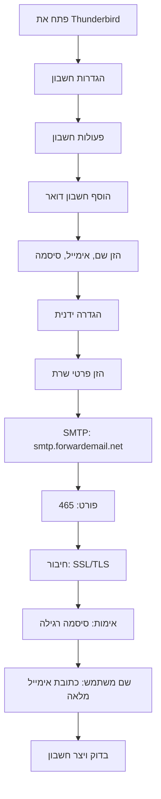

# דוגמאות אינטגרציה ל-SMTP {#smtp-integration-examples}


## תוכן העניינים {#table-of-contents}

* [הקדמה](#foreword)
* [איך מעבד שירות ה-SMTP של Forward Email](#how-forward-emails-smtp-processing-works)
  * [תור דואר ומערכת ניסיון חוזר](#email-queue-and-retry-system)
  * [מוגן מפני טעויות לשם אמינות](#dummy-proofed-for-reliability)
* [אינטגרציה עם Node.js](#nodejs-integration)
  * [שימוש ב-Nodemailer](#using-nodemailer)
  * [שימוש ב-Express.js](#using-expressjs)
* [אינטגרציה עם Python](#python-integration)
  * [שימוש ב-smtplib](#using-smtplib)
  * [שימוש ב-Django](#using-django)
* [אינטגרציה עם PHP](#php-integration)
  * [שימוש ב-PHPMailer](#using-phpmailer)
  * [שימוש ב-Laravel](#using-laravel)
* [אינטגרציה עם Ruby](#ruby-integration)
  * [שימוש ב-Ruby Mail Gem](#using-ruby-mail-gem)
* [אינטגרציה עם Java](#java-integration)
  * [שימוש ב-JavaMail API](#using-javamail-api)
* [הגדרת לקוח דואר אלקטרוני](#email-client-configuration)
  * [Thunderbird](#thunderbird)
  * [Apple Mail](#apple-mail)
  * [Gmail (שלח דואר בשם)](#gmail-send-mail-as)
* [פתרון בעיות](#troubleshooting)
  * [בעיות נפוצות ופתרונות](#common-issues-and-solutions)
  * [קבלת עזרה](#getting-help)
* [משאבים נוספים](#additional-resources)
* [סיכום](#conclusion)


## הקדמה {#foreword}

מדריך זה מספק דוגמאות מפורטות כיצד להשתלב עם שירות ה-SMTP של Forward Email באמצעות שפות תכנות, מסגרות עבודה ולקוחות דואר שונים. שירות ה-SMTP שלנו מתוכנן להיות אמין, מאובטח וקל לשילוב עם היישומים הקיימים שלך.


## איך מעבד שירות ה-SMTP של Forward Email {#how-forward-emails-smtp-processing-works}

לפני שנצלול לדוגמאות האינטגרציה, חשוב להבין כיצד שירות ה-SMTP שלנו מעבד מיילים:

### תור דואר ומערכת ניסיון חוזר {#email-queue-and-retry-system}

כאשר אתה שולח מייל דרך SMTP לשרתים שלנו:

1. **עיבוד ראשוני**: המייל מאומת, נסרק לאיתור תוכנות זדוניות ונבדק מול מסנני ספאם
2. **תור חכם**: המיילים מונחים במערכת תורים מתוחכמת למשלוח
3. **מנגנון ניסיון חוזר חכם**: אם המשלוח נכשל זמנית, המערכת שלנו ת:
   * תנתח את תגובת השגיאה באמצעות הפונקציה `getBounceInfo`
   * תקבע אם הבעיה זמנית (למשל, "נסה שוב מאוחר יותר", "נדחה זמנית") או קבועה (למשל, "משתמש לא ידוע")
   * עבור בעיות זמניות, תסמן את המייל לניסיון חוזר
   * עבור בעיות קבועות, תיצור הודעת החזרה (bounce)
4. **תקופת ניסיון חוזר של 5 ימים**: אנו מנסים שוב את המשלוח עד 5 ימים (בדומה לסטנדרטים בתעשייה כמו Postfix), כדי לתת זמן לבעיות זמניות להיפתר
5. **הודעות סטטוס משלוח**: השולחים מקבלים הודעות על מצב המיילים שלהם (נשלח, מתעכב או הוחזר)

> \[!NOTE]
> לאחר משלוח מוצלח, תוכן המייל היוצא דרך SMTP נמחק לאחר תקופת שמירה שניתנת להגדרה (ברירת מחדל 30 יום) לשם אבטחה ופרטיות. נשאר רק הודעת מיקום המציינת משלוח מוצלח.

### מוגן מפני טעויות לשם אמינות {#dummy-proofed-for-reliability}

המערכת שלנו מתוכננת להתמודד עם מקרים שונים:

* אם זוהה רשימת חסימה, המייל יישלח שוב אוטומטית
* אם מתרחשות בעיות רשת, המשלוח ינסה שוב
* אם תיבת הדואר של הנמען מלאה, המערכת תנסה שוב מאוחר יותר
* אם השרת המקבל אינו זמין זמנית, נמשיך לנסות

גישה זו משפרת משמעותית את שיעורי המשלוח תוך שמירה על פרטיות ואבטחה.


## אינטגרציה עם Node.js {#nodejs-integration}

### שימוש ב-Nodemailer {#using-nodemailer}

[Nodemailer](https://nodemailer.com/) הוא מודול פופולרי לשליחת מיילים מיישומי Node.js.

```javascript
const nodemailer = require('nodemailer');

// Create a transporter object
const transporter = nodemailer.createTransport({
  host: 'smtp.forwardemail.net',
  port: 465,
  secure: true, // Use TLS
  auth: {
    user: 'your-username@your-domain.com',
    pass: 'your-password'
  }
});

// Send mail with defined transport object
async function sendEmail() {
  try {
    const info = await transporter.sendMail({
      from: '"Your Name" <your-username@your-domain.com>',
      to: 'recipient@example.com',
      subject: 'Hello from Forward Email',
      text: 'Hello world! This is a test email sent using Nodemailer and Forward Email SMTP.',
      html: '<b>Hello world!</b> This is a test email sent using Nodemailer and Forward Email SMTP.'
    });

    console.log('Message sent: %s', info.messageId);
  } catch (error) {
    console.error('Error sending email:', error);
  }
}

sendEmail();
```
### שימוש ב-Express.js {#using-expressjs}

הנה איך לשלב את Forward Email SMTP עם אפליקציית Express.js:

```javascript
const express = require('express');
const nodemailer = require('nodemailer');
const app = express();
const port = 3000;

app.use(express.json());

// הגדרת טרנספורטר של דואר אלקטרוני
const transporter = nodemailer.createTransport({
  host: 'smtp.forwardemail.net',
  port: 465,
  secure: true,
  auth: {
    user: 'your-username@your-domain.com',
    pass: 'your-password'
  }
});

// נקודת קצה API לשליחת מיילים
app.post('/send-email', async (req, res) => {
  const { to, subject, text, html } = req.body;

  try {
    const info = await transporter.sendMail({
      from: '"Your App" <your-username@your-domain.com>',
      to,
      subject,
      text,
      html
    });

    res.status(200).json({
      success: true,
      messageId: info.messageId
    });
  } catch (error) {
    console.error('Error sending email:', error);
    res.status(500).json({
      success: false,
      error: error.message
    });
  }
});

app.listen(port, () => {
  console.log(`Server running at http://localhost:${port}`);
});
```


## אינטגרציה עם Python {#python-integration}

### שימוש ב-smtplib {#using-smtplib}

```python
import smtplib
from email.mime.text import MIMEText
from email.mime.multipart import MIMEMultipart

# הגדרות דואר אלקטרוני
sender_email = "your-username@your-domain.com"
receiver_email = "recipient@example.com"
password = "your-password"

# יצירת ההודעה
message = MIMEMultipart("alternative")
message["Subject"] = "Hello from Forward Email"
message["From"] = sender_email
message["To"] = receiver_email

# יצירת גרסאות הטקסט וה-HTML של ההודעה
text = "Hello world! This is a test email sent using Python and Forward Email SMTP."
html = "<html><body><b>Hello world!</b> This is a test email sent using Python and Forward Email SMTP.</body></html>"

# המרת הטקסט וה-HTML לאובייקטים מסוג MIMEText
part1 = MIMEText(text, "plain")
part2 = MIMEText(html, "html")

# הוספת חלקי HTML וטקסט להודעה מסוג MIMEMultipart
message.attach(part1)
message.attach(part2)

# שליחת המייל
try:
    server = smtplib.SMTP_SSL("smtp.forwardemail.net", 465)
    server.login(sender_email, password)
    server.sendmail(sender_email, receiver_email, message.as_string())
    server.quit()
    print("Email sent successfully!")
except Exception as e:
    print(f"Error sending email: {e}")
```

### שימוש ב-Django {#using-django}

לאפליקציות Django, הוסף את ההגדרות הבאות ל-`settings.py` שלך:

```python
# הגדרות דואר אלקטרוני
EMAIL_BACKEND = 'django.core.mail.backends.smtp.EmailBackend'
EMAIL_HOST = 'smtp.forwardemail.net'
EMAIL_PORT = 465
EMAIL_USE_SSL = True
EMAIL_HOST_USER = 'your-username@your-domain.com'
EMAIL_HOST_PASSWORD = 'your-password'
DEFAULT_FROM_EMAIL = 'your-username@your-domain.com'
```

לאחר מכן שלח מיילים ב-views שלך:

```python
from django.core.mail import send_mail

def send_email_view(request):
    send_mail(
        'Subject here',
        'Here is the message.',
        'from@your-domain.com',
        ['to@example.com'],
        fail_silently=False,
        html_message='<b>Here is the HTML message.</b>'
    )
    return HttpResponse('Email sent!')
```


## אינטגרציה עם PHP {#php-integration}

### שימוש ב-PHPMailer {#using-phpmailer}

```php
<?php
use PHPMailer\PHPMailer\PHPMailer;
use PHPMailer\PHPMailer\Exception;

require 'vendor/autoload.php';

$mail = new PHPMailer(true);

try {
    // הגדרות שרת
    $mail->isSMTP();
    $mail->Host       = 'smtp.forwardemail.net';
    $mail->SMTPAuth   = true;
    $mail->Username   = 'your-username@your-domain.com';
    $mail->Password   = 'your-password';
    $mail->SMTPSecure = PHPMailer::ENCRYPTION_SMTPS;
    $mail->Port       = 465;

    // נמענים
    $mail->setFrom('your-username@your-domain.com', 'Your Name');
    $mail->addAddress('recipient@example.com', 'Recipient Name');
    $mail->addReplyTo('your-username@your-domain.com', 'Your Name');

    // תוכן
    $mail->isHTML(true);
    $mail->Subject = 'Hello from Forward Email';
    $mail->Body    = '<b>Hello world!</b> This is a test email sent using PHPMailer and Forward Email SMTP.';
    $mail->AltBody = 'Hello world! This is a test email sent using PHPMailer and Forward Email SMTP.';

    $mail->send();
    echo 'Message has been sent';
} catch (Exception $e) {
    echo "Message could not be sent. Mailer Error: {$mail->ErrorInfo}";
}
```
### שימוש ב-Laravel {#using-laravel}

ליישומי Laravel, עדכן את קובץ `.env` שלך:

```sh
MAIL_MAILER=smtp
MAIL_HOST=smtp.forwardemail.net
MAIL_PORT=465
MAIL_USERNAME=your-username@your-domain.com
MAIL_PASSWORD=your-password
MAIL_ENCRYPTION=ssl
MAIL_FROM_ADDRESS=your-username@your-domain.com
MAIL_FROM_NAME="${APP_NAME}"
```

לאחר מכן שלח מיילים באמצעות הפאצ' של Mail ב-Laravel:

```php
<?php

namespace App\Http\Controllers;

use Illuminate\Http\Request;
use Illuminate\Support\Facades\Mail;
use App\Mail\WelcomeEmail;

class EmailController extends Controller
{
    public function sendEmail()
    {
        Mail::to('recipient@example.com')->send(new WelcomeEmail());

        return 'האימייל נשלח בהצלחה!';
    }
}
```


## אינטגרציה עם Ruby {#ruby-integration}

### שימוש ב-Ruby Mail Gem {#using-ruby-mail-gem}

```ruby
require 'mail'

Mail.defaults do
  delivery_method :smtp, {
    address: 'smtp.forwardemail.net',
    port: 465,
    domain: 'your-domain.com',
    user_name: 'your-username@your-domain.com',
    password: 'your-password',
    authentication: 'plain',
    enable_starttls_auto: true,
    ssl: true
  }
end

mail = Mail.new do
  from     'your-username@your-domain.com'
  to       'recipient@example.com'
  subject  'שלום מ-Forward Email'

  text_part do
    body 'שלום עולם! זהו מייל בדיקה שנשלח באמצעות Ruby Mail ו-Forward Email SMTP.'
  end

  html_part do
    content_type 'text/html; charset=UTF-8'
    body '<b>שלום עולם!</b> זהו מייל בדיקה שנשלח באמצעות Ruby Mail ו-Forward Email SMTP.'
  end
end

mail.deliver!
puts "האימייל נשלח בהצלחה!"
```


## אינטגרציה עם Java {#java-integration}

### שימוש ב-JavaMail API {#using-javamail-api}

```java
import java.util.Properties;
import javax.mail.*;
import javax.mail.internet.*;

public class SendEmail {
    public static void main(String[] args) {
        // אימייל וסיסמה של השולח
        final String username = "your-username@your-domain.com";
        final String password = "your-password";

        // מאפייני שרת SMTP
        Properties props = new Properties();
        props.put("mail.smtp.auth", "true");
        props.put("mail.smtp.starttls.enable", "true");
        props.put("mail.smtp.host", "smtp.forwardemail.net");
        props.put("mail.smtp.port", "465");
        props.put("mail.smtp.socketFactory.port", "465");
        props.put("mail.smtp.socketFactory.class", "javax.net.ssl.SSLSocketFactory");

        // יצירת סשן עם מאמת
        Session session = Session.getInstance(props,
            new javax.mail.Authenticator() {
                protected PasswordAuthentication getPasswordAuthentication() {
                    return new PasswordAuthentication(username, password);
                }
            });

        try {
            // יצירת ההודעה
            Message message = new MimeMessage(session);
            message.setFrom(new InternetAddress(username));
            message.setRecipients(Message.RecipientType.TO, InternetAddress.parse("recipient@example.com"));
            message.setSubject("שלום מ-Forward Email");

            // יצירת הודעה מרובת חלקים
            Multipart multipart = new MimeMultipart("alternative");

            // חלק טקסט
            BodyPart textPart = new MimeBodyPart();
            textPart.setText("שלום עולם! זהו מייל בדיקה שנשלח באמצעות JavaMail ו-Forward Email SMTP.");

            // חלק HTML
            BodyPart htmlPart = new MimeBodyPart();
            htmlPart.setContent("<b>שלום עולם!</b> זהו מייל בדיקה שנשלח באמצעות JavaMail ו-Forward Email SMTP.", "text/html");

            // הוספת החלקים למולטיפארט
            multipart.addBodyPart(textPart);
            multipart.addBodyPart(htmlPart);

            // הגדרת התוכן
            message.setContent(multipart);

            // שליחת ההודעה
            Transport.send(message);

            System.out.println("האימייל נשלח בהצלחה!");

        } catch (MessagingException e) {
            throw new RuntimeException(e);
        }
    }
}
```


## הגדרת לקוח דואר אלקטרוני {#email-client-configuration}

### Thunderbird {#thunderbird}


```mermaid
flowchart TD
    A[פתח את Thunderbird] --> B[הגדרות חשבון]
    B --> C[פעולות חשבון]
    C --> D[הוסף חשבון דואר]
    D --> E[הזן שם, אימייל, סיסמה]
    E --> F[הגדרה ידנית]
    F --> G[הזן פרטי שרת]
    G --> H[SMTP: smtp.forwardemail.net]
    H --> I[פורט: 465]
    I --> J[חיבור: SSL/TLS]
    J --> K[אימות: סיסמה רגילה]
    K --> L[שם משתמש: כתובת אימייל מלאה]
    L --> M[בדוק ויצר חשבון]
```
1. פתח את Thunderbird ועבור להגדרות חשבון  
2. לחץ על "Account Actions" ובחר "Add Mail Account"  
3. הזן את שמך, כתובת האימייל והסיסמה שלך  
4. לחץ על "Manual Config" והזן את הפרטים הבאים:  
   * שרת נכנס:  
     * IMAP: imap.forwardemail.net, פורט: 993, SSL/TLS  
     * POP3: pop3.forwardemail.net, פורט: 995, SSL/TLS  
   * שרת יוצא (SMTP): smtp.forwardemail.net, פורט: 465, SSL/TLS  
   * אימות: סיסמה רגילה  
   * שם משתמש: כתובת האימייל המלאה שלך  
5. לחץ על "Test" ואז על "Done"  

### Apple Mail {#apple-mail}

1. פתח את Mail ועבור אל Mail > Preferences > Accounts  
2. לחץ על כפתור "+" להוספת חשבון חדש  
3. בחר "Other Mail Account" ולחץ על "Continue"  
4. הזן את שמך, כתובת האימייל והסיסמה שלך, ואז לחץ על "Sign In"  
5. כאשר ההגדרה האוטומטית נכשלת, הזן את הפרטים הבאים:  
   * שרת דואר נכנס: imap.forwardemail.net (או pop3.forwardemail.net עבור POP3)  
   * שרת דואר יוצא: smtp.forwardemail.net  
   * שם משתמש: כתובת האימייל המלאה שלך  
   * סיסמה: הסיסמה שלך  
6. לחץ על "Sign In" להשלמת ההגדרה  

### Gmail (Send Mail As) {#gmail-send-mail-as}

1. פתח את Gmail ועבור אל Settings > Accounts and Import  
2. תחת "Send mail as", לחץ על "Add another email address"  
3. הזן את שמך וכתובת האימייל שלך, ואז לחץ על "Next Step"  
4. הזן את פרטי שרת ה-SMTP הבאים:  
   * שרת SMTP: smtp.forwardemail.net  
   * פורט: 465  
   * שם משתמש: כתובת האימייל המלאה שלך  
   * סיסמה: הסיסמה שלך  
   * בחר "Secured connection using SSL"  
5. לחץ על "Add Account" ואמת את כתובת האימייל שלך  

## פתרון בעיות {#troubleshooting}

### בעיות נפוצות ופתרונות {#common-issues-and-solutions}

1. **אימות נכשל**  
   * ודא את שם המשתמש (כתובת האימייל המלאה) והסיסמה שלך  
   * ודא שאתה משתמש בפורט הנכון (465 עבור SSL/TLS)  
   * בדוק אם החשבון שלך מאפשר גישה ל-SMTP  

2. **פסק זמן בחיבור**  
   * בדוק את חיבור האינטרנט שלך  
   * ודא שהגדרות חומת האש אינן חוסמות תעבורת SMTP  
   * נסה להשתמש בפורט 465 עם SSL/TLS (מומלץ) או פורט 587 עם STARTTLS  

3. **הודעה נדחתה**  
   * ודא שכתובת "From" תואמת את האימייל המאומת שלך  
   * בדוק אם כתובת ה-IP שלך ברשימה שחורה  
   * ודא שתוכן ההודעה שלך אינו מפעיל מסנני דואר זבל  

4. **שגיאות TLS/SSL**  
   * עדכן את האפליקציה/ספרייה שלך לתמיכה בגרסאות TLS מודרניות  
   * ודא שתעודות ה-CA של המערכת מעודכנות  
   * נסה TLS מפורש במקום TLS מרומז  

### קבלת עזרה {#getting-help}

אם נתקלת בבעיות שלא נכללו כאן, אנא:  

1. בדוק את [דף השאלות הנפוצות](/faq) שלנו לשאלות נפוצות  
2. עיין ב-[פוסט הבלוג שלנו על משלוח דואר](/blog/docs/best-email-forwarding-service) למידע מפורט  
3. פנה לצוות התמיכה שלנו בכתובת <support@forwardemail.net>  

## משאבים נוספים {#additional-resources}

* [תיעוד Forward Email](/docs)  
* [מגבלות והגדרות שרת SMTP](/faq#what-are-your-outbound-smtp-limits)  
* [מדריך לפרקטיקות מיטביות בדואר אלקטרוני](/blog/docs/best-email-forwarding-service)  
* [פרקטיקות אבטחה](/security)  

## סיכום {#conclusion}

שירות ה-SMTP של Forward Email מספק דרך אמינה, מאובטחת וממוקדת פרטיות לשליחת מיילים מהאפליקציות ולקוחות הדואר שלך. עם מערכת התורים החכמה שלנו, מנגנון ניסיון חוזר למשך 5 ימים, והתראות סטטוס משלוח מקיפות, תוכל להיות בטוח שהאימיילים שלך יגיעו ליעדם.  

לשימושים מתקדמים יותר או אינטגרציות מותאמות אישית, אנא פנה לצוות התמיכה שלנו.
