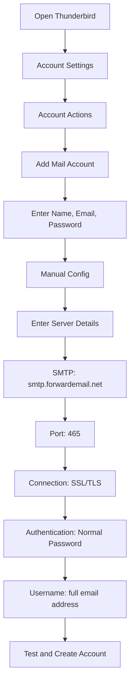

# SMTP integrációs példák {#smtp-integration-examples}

## Tartalomjegyzék {#table-of-contents}

* [Előszó](#foreword)
* [Hogyan működik a továbbított e-mail SMTP-feldolgozása?](#how-forward-emails-smtp-processing-works)
  * [E-mail sorkezelő és újrapróbálkozó rendszer](#email-queue-and-retry-system)
  * [Dummy-biztos a megbízhatóság érdekében](#dummy-proofed-for-reliability)
* [Node.js integráció](#nodejs-integration)
  * [Nodemailer használata](#using-nodemailer)
  * [Express.js használata](#using-expressjs)
* [Python integráció](#python-integration)
  * [smtplib használata](#using-smtplib)
  * [Django használata](#using-django)
* [PHP integráció](#php-integration)
  * [PHPMailer használata](#using-phpmailer)
  * [Laravel használata](#using-laravel)
* [Ruby integráció](#ruby-integration)
  * [Ruby Mail Gem használata](#using-ruby-mail-gem)
* [Java integráció](#java-integration)
  * [A Java Mail API használata](#using-javamail-api)
* [E-mail kliens konfiguráció](#email-client-configuration)
  * [Thunderbird](#thunderbird)
  * [Apple Mail](#apple-mail)
  * [Gmail (E-mail küldése másként)](#gmail-send-mail-as)
* [Hibaelhárítás](#troubleshooting)
  * [Gyakori problémák és megoldások](#common-issues-and-solutions)
  * [Segítségkérés](#getting-help)
* [További források](#additional-resources)
* [Következtetés](#conclusion)

## Előszó {#foreword}

Ez az útmutató részletes példákat mutat be arról, hogyan integrálható a Forward Email SMTP szolgáltatásával különböző programozási nyelvek, keretrendszerek és e-mail kliensek használatával. SMTP szolgáltatásunkat úgy terveztük, hogy megbízható, biztonságos és könnyen integrálható legyen a meglévő alkalmazásaival.

## Hogyan működik az e-mailek továbbításának SMTP-feldolgozása {#how-forward-emails-smtp-processing-works}

Mielőtt belemerülnénk az integrációs példákba, fontos megérteni, hogyan dolgozza fel az SMTP szolgáltatásunk az e-maileket:

### E-mail sorkezelő és újrapróbálkozási rendszer {#email-queue-and-retry-system}

Amikor SMTP-n keresztül küld e-mailt a szervereinknek:

1. **Kezdeti feldolgozás**: Az e-mailt ellenőrzik, átvizsgálják kártevők szempontjából és ellenőrzik a spamszűrők ellen.
2. **Intelligens sorba állítás**: Az e-maileket egy kifinomult sorrendszerbe helyezik a kézbesítéshez.
3. **Intelligens újrapróbálkozási mechanizmus**: Ha a kézbesítés átmenetileg meghiúsul, a rendszerünk a következőket teszi:
* Elemzi a hibaüzenetet a `getBounceInfo` függvényünkkel.
* Meghatározza, hogy a probléma átmeneti (pl. „próbálja újra később”, „ideiglenesen elhalasztva”) vagy állandó (pl. „felhasználó ismeretlen”).
* Ideiglenes problémák esetén megjelöli az e-mailt újrapróbálkozásra.
* Állandó problémák esetén visszapattanási értesítést generál.
4. **5 napos újrapróbálkozási időszak**: Legfeljebb 5 napig próbálkozunk a kézbesítéssel (hasonlóan az iparági szabványokhoz, mint például a Postfix), így időt adunk az ideiglenes problémák megoldására.
5. **Kézbesítési állapotértesítések**: A feladók értesítést kapnak e-mailjeik állapotáról (kézbesített, késleltetett vagy visszapattanó).

> \[!NOTE]
> A sikeres kézbesítés után a kimenő SMTP e-mailek tartalmát egy konfigurálható megőrzési időszak (alapértelmezett 30 nap) elteltével a rendszer biztonsági és adatvédelmi okokból kitakarja. Csak egy helykitöltő üzenet marad, amely jelzi a sikeres kézbesítést.

### Megbízhatósági teszttel tesztelve {#dummy-proofed-for-reliability}

Rendszerünket úgy terveztük, hogy különféle szélsőséges eseteket kezeljen:

* Ha a rendszer tiltólistát észlel, az e-mailt automatikusan újrapróbáljuk.
* Hálózati problémák esetén a kézbesítést újrapróbáljuk.
* Ha a címzett postaládája megtelt, a rendszer később újrapróbálkozik.
* Ha a fogadó szerver átmenetileg nem érhető el, továbbra is próbálkozunk.

Ez a megközelítés jelentősen javítja a kézbesítési arányokat, miközben megőrzi az adatvédelmet és a biztonságot.

## Node.js integráció {#nodejs-integration}}

### Nodemailer használata {#using-nodemailer}

A [Nodemailer](https://nodemailer.com/) egy népszerű modul e-mailek Node.js alkalmazásokból történő küldéséhez.

```javascript
const nodemailer = require('nodemailer');

// Create a transporter object
const transporter = nodemailer.createTransport({
  host: 'smtp.forwardemail.net',
  port: 465,
  secure: true, // Use TLS
  auth: {
    user: 'your-username@your-domain.com',
    pass: 'your-password'
  }
});

// Send mail with defined transport object
async function sendEmail() {
  try {
    const info = await transporter.sendMail({
      from: '"Your Name" <your-username@your-domain.com>',
      to: 'recipient@example.com',
      subject: 'Hello from Forward Email',
      text: 'Hello world! This is a test email sent using Nodemailer and Forward Email SMTP.',
      html: '<b>Hello world!</b> This is a test email sent using Nodemailer and Forward Email SMTP.'
    });

    console.log('Message sent: %s', info.messageId);
  } catch (error) {
    console.error('Error sending email:', error);
  }
}

sendEmail();
```

### Express.js használata {#using-expressjs}

Így integrálhatja a Forward Email SMTP-t egy Express.js alkalmazással:

```javascript
const express = require('express');
const nodemailer = require('nodemailer');
const app = express();
const port = 3000;

app.use(express.json());

// Configure email transporter
const transporter = nodemailer.createTransport({
  host: 'smtp.forwardemail.net',
  port: 465,
  secure: true,
  auth: {
    user: 'your-username@your-domain.com',
    pass: 'your-password'
  }
});

// API endpoint for sending emails
app.post('/send-email', async (req, res) => {
  const { to, subject, text, html } = req.body;

  try {
    const info = await transporter.sendMail({
      from: '"Your App" <your-username@your-domain.com>',
      to,
      subject,
      text,
      html
    });

    res.status(200).json({
      success: true,
      messageId: info.messageId
    });
  } catch (error) {
    console.error('Error sending email:', error);
    res.status(500).json({
      success: false,
      error: error.message
    });
  }
});

app.listen(port, () => {
  console.log(`Server running at http://localhost:${port}`);
});
```

## Python-integráció {#python-integration}

### Az smtplib {#using-smtplib}} használata

```python
import smtplib
from email.mime.text import MIMEText
from email.mime.multipart import MIMEMultipart

# Email configuration
sender_email = "your-username@your-domain.com"
receiver_email = "recipient@example.com"
password = "your-password"

# Create message
message = MIMEMultipart("alternative")
message["Subject"] = "Hello from Forward Email"
message["From"] = sender_email
message["To"] = receiver_email

# Create the plain-text and HTML version of your message
text = "Hello world! This is a test email sent using Python and Forward Email SMTP."
html = "<html><body><b>Hello world!</b> This is a test email sent using Python and Forward Email SMTP.</body></html>"

# Turn these into plain/html MIMEText objects
part1 = MIMEText(text, "plain")
part2 = MIMEText(html, "html")

# Add HTML/plain-text parts to MIMEMultipart message
message.attach(part1)
message.attach(part2)

# Send email
try:
    server = smtplib.SMTP_SSL("smtp.forwardemail.net", 465)
    server.login(sender_email, password)
    server.sendmail(sender_email, receiver_email, message.as_string())
    server.quit()
    print("Email sent successfully!")
except Exception as e:
    print(f"Error sending email: {e}")
```

### Django használata {#using-django}

Django alkalmazások esetén add hozzá a következőket a `settings.py`-hoz:

```python
# Email settings
EMAIL_BACKEND = 'django.core.mail.backends.smtp.EmailBackend'
EMAIL_HOST = 'smtp.forwardemail.net'
EMAIL_PORT = 465
EMAIL_USE_SSL = True
EMAIL_HOST_USER = 'your-username@your-domain.com'
EMAIL_HOST_PASSWORD = 'your-password'
DEFAULT_FROM_EMAIL = 'your-username@your-domain.com'
```

Ezután küldjön e-maileket a nézeteiben:

```python
from django.core.mail import send_mail

def send_email_view(request):
    send_mail(
        'Subject here',
        'Here is the message.',
        'from@your-domain.com',
        ['to@example.com'],
        fail_silently=False,
        html_message='<b>Here is the HTML message.</b>'
    )
    return HttpResponse('Email sent!')
```

## PHP integráció {#php-integration}

### PHPMailer használata {#using-phpmailer}

```php
<?php
use PHPMailer\PHPMailer\PHPMailer;
use PHPMailer\PHPMailer\Exception;

require 'vendor/autoload.php';

$mail = new PHPMailer(true);

try {
    // Server settings
    $mail->isSMTP();
    $mail->Host       = 'smtp.forwardemail.net';
    $mail->SMTPAuth   = true;
    $mail->Username   = 'your-username@your-domain.com';
    $mail->Password   = 'your-password';
    $mail->SMTPSecure = PHPMailer::ENCRYPTION_SMTPS;
    $mail->Port       = 465;

    // Recipients
    $mail->setFrom('your-username@your-domain.com', 'Your Name');
    $mail->addAddress('recipient@example.com', 'Recipient Name');
    $mail->addReplyTo('your-username@your-domain.com', 'Your Name');

    // Content
    $mail->isHTML(true);
    $mail->Subject = 'Hello from Forward Email';
    $mail->Body    = '<b>Hello world!</b> This is a test email sent using PHPMailer and Forward Email SMTP.';
    $mail->AltBody = 'Hello world! This is a test email sent using PHPMailer and Forward Email SMTP.';

    $mail->send();
    echo 'Message has been sent';
} catch (Exception $e) {
    echo "Message could not be sent. Mailer Error: {$mail->ErrorInfo}";
}
```

### Laravel használata {#using-laravel}

Laravel alkalmazások esetén frissítse a `.env` fájlt:

```sh
MAIL_MAILER=smtp
MAIL_HOST=smtp.forwardemail.net
MAIL_PORT=465
MAIL_USERNAME=your-username@your-domain.com
MAIL_PASSWORD=your-password
MAIL_ENCRYPTION=ssl
MAIL_FROM_ADDRESS=your-username@your-domain.com
MAIL_FROM_NAME="${APP_NAME}"
```

Ezután küldj e-maileket a Laravel Mail facade használatával:

```php
<?php

namespace App\Http\Controllers;

use Illuminate\Http\Request;
use Illuminate\Support\Facades\Mail;
use App\Mail\WelcomeEmail;

class EmailController extends Controller
{
    public function sendEmail()
    {
        Mail::to('recipient@example.com')->send(new WelcomeEmail());

        return 'Email sent successfully!';
    }
}
```

## Ruby integráció {#ruby-integration}}

### Ruby Mail Gem használata {#using-ruby-mail-gem}

```ruby
require 'mail'

Mail.defaults do
  delivery_method :smtp, {
    address: 'smtp.forwardemail.net',
    port: 465,
    domain: 'your-domain.com',
    user_name: 'your-username@your-domain.com',
    password: 'your-password',
    authentication: 'plain',
    enable_starttls_auto: true,
    ssl: true
  }
end

mail = Mail.new do
  from     'your-username@your-domain.com'
  to       'recipient@example.com'
  subject  'Hello from Forward Email'

  text_part do
    body 'Hello world! This is a test email sent using Ruby Mail and Forward Email SMTP.'
  end

  html_part do
    content_type 'text/html; charset=UTF-8'
    body '<b>Hello world!</b> This is a test email sent using Ruby Mail and Forward Email SMTP.'
  end
end

mail.deliver!
puts "Email sent successfully!"
```

## Java integráció {#java-integration}

### JavaMail API használata {#using-javamail-api}

```java
import java.util.Properties;
import javax.mail.*;
import javax.mail.internet.*;

public class SendEmail {
    public static void main(String[] args) {
        // Sender's email and password
        final String username = "your-username@your-domain.com";
        final String password = "your-password";

        // SMTP server properties
        Properties props = new Properties();
        props.put("mail.smtp.auth", "true");
        props.put("mail.smtp.starttls.enable", "true");
        props.put("mail.smtp.host", "smtp.forwardemail.net");
        props.put("mail.smtp.port", "465");
        props.put("mail.smtp.socketFactory.port", "465");
        props.put("mail.smtp.socketFactory.class", "javax.net.ssl.SSLSocketFactory");

        // Create session with authenticator
        Session session = Session.getInstance(props,
            new javax.mail.Authenticator() {
                protected PasswordAuthentication getPasswordAuthentication() {
                    return new PasswordAuthentication(username, password);
                }
            });

        try {
            // Create message
            Message message = new MimeMessage(session);
            message.setFrom(new InternetAddress(username));
            message.setRecipients(Message.RecipientType.TO, InternetAddress.parse("recipient@example.com"));
            message.setSubject("Hello from Forward Email");

            // Create multipart message
            Multipart multipart = new MimeMultipart("alternative");

            // Text part
            BodyPart textPart = new MimeBodyPart();
            textPart.setText("Hello world! This is a test email sent using JavaMail and Forward Email SMTP.");

            // HTML part
            BodyPart htmlPart = new MimeBodyPart();
            htmlPart.setContent("<b>Hello world!</b> This is a test email sent using JavaMail and Forward Email SMTP.", "text/html");

            // Add parts to multipart
            multipart.addBodyPart(textPart);
            multipart.addBodyPart(htmlPart);

            // Set content
            message.setContent(multipart);

            // Send message
            Transport.send(message);

            System.out.println("Email sent successfully!");

        } catch (MessagingException e) {
            throw new RuntimeException(e);
        }
    }
}
```

## E-mail kliens konfiguráció {#email-client-configuration}

IDEIGLENES_HELYTARTÓ_0 Thunderbird {IDEIGLENES_HELYTARTÓ_1



1. Nyissa meg a Thunderbirdöt, és lépjen a Fiókbeállítások menüpontra.
2. Kattintson a „Fiókműveletek” lehetőségre, és válassza a „Levelezési fiók hozzáadása” lehetőséget.
3. Adja meg a nevét, e-mail címét és jelszavát.
4. Kattintson a „Manuális konfiguráció” lehetőségre, és adja meg a következő adatokat:
* Bejövő szerver:
* IMAP: imap.forwardemail.net, Port: 993, SSL/TLS
* POP3: pop3.forwardemail.net, Port: 995, SSL/TLS
* Kimenő szerver (SMTP): smtp.forwardemail.net, Port: 465, SSL/TLS
* Hitelesítés: Normál jelszó
* Felhasználónév: a teljes e-mail címe.
5. Kattintson a „Teszt”, majd a „Kész” gombra.

### Apple Mail {#apple-mail}

1. Nyissa meg a Mail alkalmazást, és lépjen a Mail > Beállítások > Fiókok menüpontra.
2. Kattintson a „+” gombra új fiók hozzáadásához.
3. Válassza az „Egyéb levelezési fiók” lehetőséget, majd kattintson a „Folytatás” gombra.
4. Adja meg nevét, e-mail címét és jelszavát, majd kattintson a „Bejelentkezés” gombra.
5. Ha az automatikus beállítás sikertelen, adja meg a következő adatokat:
* Bejövő levelek kiszolgálója: imap.forwardemail.net (vagy pop3.forwardemail.net POP3 esetén)
* Kimenő levelek kiszolgálója: smtp.forwardemail.net
* Felhasználónév: a teljes e-mail címe
* Jelszó: a jelszava
6. A beállítás befejezéséhez kattintson a „Bejelentkezés” gombra.

### Gmail (E-mail küldése másként) {#gmail-send-mail-as}

1. Nyissa meg a Gmailt, és lépjen a Beállítások > Fiókok és importálás menüpontra.
2. A „Küldés másként” alatt kattintson a „Másik e-mail cím hozzáadása” lehetőségre.
3. Adja meg a nevét és az e-mail címét, majd kattintson a „Következő lépés” gombra.
4. Adja meg az SMTP-kiszolgáló következő adatait:
* SMTP-kiszolgáló: smtp.forwardemail.net
* Port: 465
* Felhasználónév: a teljes e-mail-címe
* Jelszó: a jelszava
* Válassza a „Biztonságos kapcsolat SSL használatával” lehetőséget.
5. Kattintson a „Fiók hozzáadása” gombra, és ellenőrizze az e-mail-címét.

## Hibaelhárítás {#troubleshooting}

### Gyakori problémák és megoldások {#common-issues-and-solutions}

1. **Hitelesítés sikertelen**
* Ellenőrizze felhasználónevét (teljes e-mail cím) és jelszavát.
* Győződjön meg arról, hogy a megfelelő portot használja (465 SSL/TLS esetén).
* Ellenőrizze, hogy a fiókjában engedélyezve van-e az SMTP-hozzáférés.

2. **Kapcsolati időtúllépés**
* Ellenőrizze az internetkapcsolatát.
* Ellenőrizze, hogy a tűzfal beállításai nem blokkolják-e az SMTP forgalmat.
* Próbáljon meg másik portot használni (587 STARTTLS-sel).

3. **Üzenet elutasítva**
* Győződjön meg arról, hogy a „Feladó” címe megegyezik a hitelesített e-mail címével.
* Ellenőrizze, hogy az IP-címe szerepel-e a tiltólistán.
* Ellenőrizze, hogy az üzenet tartalma nem aktiválja-e a spamszűrőket.

4. **TLS/SSL hibák**
* Frissítse alkalmazását/könyvtárát a modern TLS-verziók támogatásához
* Győződjön meg arról, hogy rendszere CA-tanúsítványai naprakészek
* Próbálja ki az explicit TLS-t az implicit TLS helyett

### Segítség kérése {#getting-help}

Ha olyan problémákkal találkozik, amelyekre itt nem tér ki, kérjük:

1. A gyakori kérdésekért tekintse meg a [GYIK oldal](/faq) oldalunkat.
2. Részletes információkért tekintse át a [blogbejegyzés az e-mail kézbesítésről](/blog/docs/best-email-forwarding-service) oldalunkat.
3. Lépjen kapcsolatba ügyfélszolgálatunkkal a <support@forwardemail.net> címen.

## További források {#additional-resources}

* [E-mail továbbítási dokumentáció](/docs)
* [SMTP szerver korlátai és konfigurációja](/faq#what-are-your-outbound-smtp-limits)
* [E-mail bevált gyakorlatok útmutatója](/blog/docs/best-email-forwarding-service)
* [Biztonsági gyakorlatok](/security)

## Következtetés {#conclusion}

A Forward Email SMTP szolgáltatása megbízható, biztonságos és adatvédelmet biztosító módot kínál e-mailek küldésére alkalmazásaiból és levelezőprogramjaiból. Intelligens várólistás rendszerünkkel, 5 napos újrapróbálkozási mechanizmusunkkal és átfogó kézbesítési állapotértesítéseinkkel biztos lehet benne, hogy e-mailjei eljutnak a címzetthez.

Speciálisabb használati esetekért vagy egyéni integrációkért kérjük, vegye fel a kapcsolatot ügyfélszolgálatunkkal.