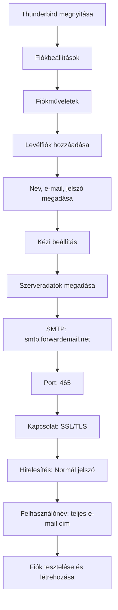

# SMTP Integrációs Példák {#smtp-integration-examples}


## Tartalomjegyzék {#table-of-contents}

* [Előszó](#foreword)
* [Hogyan működik a Forward Email SMTP feldolgozása](#how-forward-emails-smtp-processing-works)
  * [E-mail sor és újrapróbálkozási rendszer](#email-queue-and-retry-system)
  * [Hülyebiztos a megbízhatóság érdekében](#dummy-proofed-for-reliability)
* [Node.js Integráció](#nodejs-integration)
  * [Nodemailer használata](#using-nodemailer)
  * [Express.js használata](#using-expressjs)
* [Python Integráció](#python-integration)
  * [smtplib használata](#using-smtplib)
  * [Django használata](#using-django)
* [PHP Integráció](#php-integration)
  * [PHPMailer használata](#using-phpmailer)
  * [Laravel használata](#using-laravel)
* [Ruby Integráció](#ruby-integration)
  * [Ruby Mail Gem használata](#using-ruby-mail-gem)
* [Java Integráció](#java-integration)
  * [JavaMail API használata](#using-javamail-api)
* [E-mail kliens beállítása](#email-client-configuration)
  * [Thunderbird](#thunderbird)
  * [Apple Mail](#apple-mail)
  * [Gmail (Levél küldése másként)](#gmail-send-mail-as)
* [Hibaelhárítás](#troubleshooting)
  * [Gyakori problémák és megoldások](#common-issues-and-solutions)
  * [Segítségkérés](#getting-help)
* [További források](#additional-resources)
* [Összefoglalás](#conclusion)


## Előszó {#foreword}

Ez az útmutató részletes példákat nyújt arra, hogyan integrálható a Forward Email SMTP szolgáltatása különböző programozási nyelvek, keretrendszerek és e-mail kliensek használatával. SMTP szolgáltatásunk megbízható, biztonságos és könnyen integrálható meglévő alkalmazásaiddal.


## Hogyan működik a Forward Email SMTP feldolgozása {#how-forward-emails-smtp-processing-works}

Mielőtt belevágnánk az integrációs példákba, fontos megérteni, hogyan dolgozza fel SMTP szolgáltatásunk az e-maileket:

### E-mail sor és újrapróbálkozási rendszer {#email-queue-and-retry-system}

Amikor SMTP-n keresztül e-mailt küldesz szervereinknek:

1. **Kezdeti feldolgozás**: Az e-mailt érvényesítjük, átvizsgáljuk rosszindulatú programok után, és spam szűrőknek vetjük alá
2. **Okos sorba állítás**: Az e-mailek egy kifinomult sorba kerülnek a kézbesítéshez
3. **Intelligens újrapróbálkozási mechanizmus**: Ha a kézbesítés ideiglenesen sikertelen, rendszerünk:
   * Elemzi a hibaválaszt a `getBounceInfo` függvényünkkel
   * Meghatározza, hogy a probléma ideiglenes-e (pl. „próbáld újra később”, „ideiglenesen elhalasztva”) vagy végleges (pl. „ismeretlen felhasználó”)
   * Ideiglenes problémák esetén az e-mail újrapróbálkozásra kerül megjelölve
   * Végleges problémák esetén visszapattanási értesítést generál
4. **5 napos újrapróbálkozási időszak**: Akár 5 napig próbáljuk újra a kézbesítést (iparági szabványokhoz, mint a Postfix, hasonlóan), hogy az ideiglenes problémák megoldódhassanak
5. **Kézbesítési állapot értesítések**: A feladók értesítést kapnak az e-mailjeik státuszáról (kézbesítve, késleltetve vagy visszapattant)

> \[!NOTE]
> Sikeres kézbesítés után a kimenő SMTP e-mail tartalom egy konfigurálható megőrzési időszak (alapértelmezett 30 nap) után törlésre kerül a biztonság és adatvédelem érdekében. Csak egy helyőrző üzenet marad, amely jelzi a sikeres kézbesítést.

### Hülyebiztos a megbízhatóság érdekében {#dummy-proofed-for-reliability}

Rendszerünk úgy van kialakítva, hogy különféle szélsőséges eseteket kezeljen:

* Ha blokkolólista kerül észlelésre, az e-mail automatikusan újrapróbálkozásra kerül
* Hálózati problémák esetén a kézbesítést újra megkíséreljük
* Ha a címzett postaládája tele van, a rendszer később próbálkozik újra
* Ha a fogadó szerver ideiglenesen nem elérhető, folyamatosan próbálkozunk

Ez a megközelítés jelentősen javítja a kézbesítési arányokat, miközben megőrzi az adatvédelmet és a biztonságot.


## Node.js Integráció {#nodejs-integration}

### Nodemailer használata {#using-nodemailer}

[A Nodemailer](https://nodemailer.com/) egy népszerű modul e-mailek küldésére Node.js alkalmazásokból.

```javascript
const nodemailer = require('nodemailer');

// Create a transporter object
const transporter = nodemailer.createTransport({
  host: 'smtp.forwardemail.net',
  port: 465,
  secure: true, // Use TLS
  auth: {
    user: 'your-username@your-domain.com',
    pass: 'your-password'
  }
});

// Send mail with defined transport object
async function sendEmail() {
  try {
    const info = await transporter.sendMail({
      from: '"Your Name" <your-username@your-domain.com>',
      to: 'recipient@example.com',
      subject: 'Hello from Forward Email',
      text: 'Hello world! This is a test email sent using Nodemailer and Forward Email SMTP.',
      html: '<b>Hello world!</b> This is a test email sent using Nodemailer and Forward Email SMTP.'
    });

    console.log('Message sent: %s', info.messageId);
  } catch (error) {
    console.error('Error sending email:', error);
  }
}

sendEmail();
```
### Express.js használata {#using-expressjs}

Így integrálhatod a Forward Email SMTP-t egy Express.js alkalmazásba:

```javascript
const express = require('express');
const nodemailer = require('nodemailer');
const app = express();
const port = 3000;

app.use(express.json());

// Email szállító konfigurálása
const transporter = nodemailer.createTransport({
  host: 'smtp.forwardemail.net',
  port: 465,
  secure: true,
  auth: {
    user: 'your-username@your-domain.com',
    pass: 'your-password'
  }
});

// API végpont az emailek küldéséhez
app.post('/send-email', async (req, res) => {
  const { to, subject, text, html } = req.body;

  try {
    const info = await transporter.sendMail({
      from: '"Your App" <your-username@your-domain.com>',
      to,
      subject,
      text,
      html
    });

    res.status(200).json({
      success: true,
      messageId: info.messageId
    });
  } catch (error) {
    console.error('Hiba az email küldésekor:', error);
    res.status(500).json({
      success: false,
      error: error.message
    });
  }
});

app.listen(port, () => {
  console.log(`Szerver fut a http://localhost:${port} címen`);
});
```


## Python integráció {#python-integration}

### smtplib használata {#using-smtplib}

```python
import smtplib
from email.mime.text import MIMEText
from email.mime.multipart import MIMEMultipart

# Email konfiguráció
sender_email = "your-username@your-domain.com"
receiver_email = "recipient@example.com"
password = "your-password"

# Üzenet létrehozása
message = MIMEMultipart("alternative")
message["Subject"] = "Üdv a Forward Email-től"
message["From"] = sender_email
message["To"] = receiver_email

# Az üzenet sima szöveges és HTML verziója
text = "Hello world! Ez egy teszt email, amit Python és a Forward Email SMTP segítségével küldtek."
html = "<html><body><b>Hello world!</b> Ez egy teszt email, amit Python és a Forward Email SMTP segítségével küldtek.</body></html>"

# Ezeket sima/HTML MIMEText objektumokká alakítjuk
part1 = MIMEText(text, "plain")
part2 = MIMEText(html, "html")

# HTML/sima szöveges részek hozzáadása a MIMEMultipart üzenethez
message.attach(part1)
message.attach(part2)

# Email küldése
try:
    server = smtplib.SMTP_SSL("smtp.forwardemail.net", 465)
    server.login(sender_email, password)
    server.sendmail(sender_email, receiver_email, message.as_string())
    server.quit()
    print("Email sikeresen elküldve!")
except Exception as e:
    print(f"Hiba az email küldésekor: {e}")
```

### Django használata {#using-django}

Django alkalmazásokhoz add hozzá a következőt a `settings.py` fájlodhoz:

```python
# Email beállítások
EMAIL_BACKEND = 'django.core.mail.backends.smtp.EmailBackend'
EMAIL_HOST = 'smtp.forwardemail.net'
EMAIL_PORT = 465
EMAIL_USE_SSL = True
EMAIL_HOST_USER = 'your-username@your-domain.com'
EMAIL_HOST_PASSWORD = 'your-password'
DEFAULT_FROM_EMAIL = 'your-username@your-domain.com'
```

Ezután küldj emaileket a nézeteidben:

```python
from django.core.mail import send_mail

def send_email_view(request):
    send_mail(
        'Tárgy itt',
        'Itt az üzenet.',
        'from@your-domain.com',
        ['to@example.com'],
        fail_silently=False,
        html_message='<b>Itt a HTML üzenet.</b>'
    )
    return HttpResponse('Email elküldve!')
```


## PHP integráció {#php-integration}

### PHPMailer használata {#using-phpmailer}

```php
<?php
use PHPMailer\PHPMailer\PHPMailer;
use PHPMailer\PHPMailer\Exception;

require 'vendor/autoload.php';

$mail = new PHPMailer(true);

try {
    // Szerver beállítások
    $mail->isSMTP();
    $mail->Host       = 'smtp.forwardemail.net';
    $mail->SMTPAuth   = true;
    $mail->Username   = 'your-username@your-domain.com';
    $mail->Password   = 'your-password';
    $mail->SMTPSecure = PHPMailer::ENCRYPTION_SMTPS;
    $mail->Port       = 465;

    // Címzettek
    $mail->setFrom('your-username@your-domain.com', 'A Te Neved');
    $mail->addAddress('recipient@example.com', 'Címzett Neve');
    $mail->addReplyTo('your-username@your-domain.com', 'A Te Neved');

    // Tartalom
    $mail->isHTML(true);
    $mail->Subject = 'Üdv a Forward Email-től';
    $mail->Body    = '<b>Hello world!</b> Ez egy teszt email, amit PHPMailer és a Forward Email SMTP segítségével küldtek.';
    $mail->AltBody = 'Hello world! Ez egy teszt email, amit PHPMailer és a Forward Email SMTP segítségével küldtek.';

    $mail->send();
    echo 'Az üzenet elküldve';
} catch (Exception $e) {
    echo "Az üzenetet nem sikerült elküldeni. Mailer hiba: {$mail->ErrorInfo}";
}
```
### Laravel használata {#using-laravel}

Laravel alkalmazások esetén frissítse a `.env` fájlt:

```sh
MAIL_MAILER=smtp
MAIL_HOST=smtp.forwardemail.net
MAIL_PORT=465
MAIL_USERNAME=your-username@your-domain.com
MAIL_PASSWORD=your-password
MAIL_ENCRYPTION=ssl
MAIL_FROM_ADDRESS=your-username@your-domain.com
MAIL_FROM_NAME="${APP_NAME}"
```

Ezután küldjön e-maileket a Laravel Mail homlokzatával:

```php
<?php

namespace App\Http\Controllers;

use Illuminate\Http\Request;
use Illuminate\Support\Facades\Mail;
use App\Mail\WelcomeEmail;

class EmailController extends Controller
{
    public function sendEmail()
    {
        Mail::to('recipient@example.com')->send(new WelcomeEmail());

        return 'E-mail sikeresen elküldve!';
    }
}
```


## Ruby integráció {#ruby-integration}

### Ruby Mail Gem használata {#using-ruby-mail-gem}

```ruby
require 'mail'

Mail.defaults do
  delivery_method :smtp, {
    address: 'smtp.forwardemail.net',
    port: 465,
    domain: 'your-domain.com',
    user_name: 'your-username@your-domain.com',
    password: 'your-password',
    authentication: 'plain',
    enable_starttls_auto: true,
    ssl: true
  }
end

mail = Mail.new do
  from     'your-username@your-domain.com'
  to       'recipient@example.com'
  subject  'Üdv a Forward Email-től'

  text_part do
    body 'Helló világ! Ez egy teszt e-mail, amelyet Ruby Mail és a Forward Email SMTP segítségével küldtek.'
  end

  html_part do
    content_type 'text/html; charset=UTF-8'
    body '<b>Helló világ!</b> Ez egy teszt e-mail, amelyet Ruby Mail és a Forward Email SMTP segítségével küldtek.'
  end
end

mail.deliver!
puts "E-mail sikeresen elküldve!"
```


## Java integráció {#java-integration}

### JavaMail API használata {#using-javamail-api}

```java
import java.util.Properties;
import javax.mail.*;
import javax.mail.internet.*;

public class SendEmail {
    public static void main(String[] args) {
        // Feladó e-mail címe és jelszava
        final String username = "your-username@your-domain.com";
        final String password = "your-password";

        // SMTP szerver beállításai
        Properties props = new Properties();
        props.put("mail.smtp.auth", "true");
        props.put("mail.smtp.starttls.enable", "true");
        props.put("mail.smtp.host", "smtp.forwardemail.net");
        props.put("mail.smtp.port", "465");
        props.put("mail.smtp.socketFactory.port", "465");
        props.put("mail.smtp.socketFactory.class", "javax.net.ssl.SSLSocketFactory");

        // Munkamenet létrehozása hitelesítővel
        Session session = Session.getInstance(props,
            new javax.mail.Authenticator() {
                protected PasswordAuthentication getPasswordAuthentication() {
                    return new PasswordAuthentication(username, password);
                }
            });

        try {
            // Üzenet létrehozása
            Message message = new MimeMessage(session);
            message.setFrom(new InternetAddress(username));
            message.setRecipients(Message.RecipientType.TO, InternetAddress.parse("recipient@example.com"));
            message.setSubject("Üdv a Forward Email-től");

            // Többrészes üzenet létrehozása
            Multipart multipart = new MimeMultipart("alternative");

            // Szöveges rész
            BodyPart textPart = new MimeBodyPart();
            textPart.setText("Helló világ! Ez egy teszt e-mail, amelyet JavaMail és a Forward Email SMTP segítségével küldtek.");

            // HTML rész
            BodyPart htmlPart = new MimeBodyPart();
            htmlPart.setContent("<b>Helló világ!</b> Ez egy teszt e-mail, amelyet JavaMail és a Forward Email SMTP segítségével küldtek.", "text/html");

            // Részek hozzáadása a többrészeshez
            multipart.addBodyPart(textPart);
            multipart.addBodyPart(htmlPart);

            // Tartalom beállítása
            message.setContent(multipart);

            // Üzenet küldése
            Transport.send(message);

            System.out.println("E-mail sikeresen elküldve!");

        } catch (MessagingException e) {
            throw new RuntimeException(e);
        }
    }
}
```


## E-mail kliens beállítása {#email-client-configuration}

### Thunderbird {#thunderbird}


```mermaid
flowchart TD
    A[Thunderbird megnyitása] --> B[Fiókbeállítások]
    B --> C[Fiókműveletek]
    C --> D[Levélfiók hozzáadása]
    D --> E[Név, e-mail, jelszó megadása]
    E --> F[Kézi beállítás]
    F --> G[Szerveradatok megadása]
    G --> H[SMTP: smtp.forwardemail.net]
    H --> I[Port: 465]
    I --> J[Kapcsolat: SSL/TLS]
    J --> K[Hitelesítés: Normál jelszó]
    K --> L[Felhasználónév: teljes e-mail cím]
    L --> M[Fiók tesztelése és létrehozása]
```
1. Nyissa meg a Thunderbirdöt, és lépjen a Fiókbeállításokhoz
2. Kattintson a "Fiókműveletek" gombra, majd válassza az "E-mail fiók hozzáadása" lehetőséget
3. Adja meg a nevét, e-mail címét és jelszavát
4. Kattintson a "Kézi beállítás" gombra, és adja meg a következő adatokat:
   * Bejövő szerver:
     * IMAP: imap.forwardemail.net, Port: 993, SSL/TLS
     * POP3: pop3.forwardemail.net, Port: 995, SSL/TLS
   * Kimenő szerver (SMTP): smtp.forwardemail.net, Port: 465, SSL/TLS
   * Hitelesítés: Normál jelszó
   * Felhasználónév: teljes e-mail címe
5. Kattintson a "Teszt" gombra, majd a "Kész" gombra

### Apple Mail {#apple-mail}

1. Nyissa meg a Mail alkalmazást, és lépjen a Mail > Beállítások > Fiókok menüpontra
2. Kattintson a "+" gombra egy új fiók hozzáadásához
3. Válassza az "Egyéb e-mail fiók" lehetőséget, majd kattintson a "Folytatás" gombra
4. Adja meg a nevét, e-mail címét és jelszavát, majd kattintson a "Bejelentkezés" gombra
5. Ha az automatikus beállítás sikertelen, adja meg a következő adatokat:
   * Bejövő levelezőszerver: imap.forwardemail.net (vagy pop3.forwardemail.net POP3 esetén)
   * Kimenő levelezőszerver: smtp.forwardemail.net
   * Felhasználónév: teljes e-mail címe
   * Jelszó: jelszava
6. Kattintson a "Bejelentkezés" gombra a beállítás befejezéséhez

### Gmail (Levél küldése másként) {#gmail-send-mail-as}

1. Nyissa meg a Gmailt, és lépjen a Beállítások > Fiókok és importálás menüpontra
2. A "Levél küldése másként" alatt kattintson az "Új e-mail cím hozzáadása" lehetőségre
3. Adja meg a nevét és e-mail címét, majd kattintson a "Következő lépés" gombra
4. Adja meg a következő SMTP szerver adatokat:
   * SMTP szerver: smtp.forwardemail.net
   * Port: 465
   * Felhasználónév: teljes e-mail címe
   * Jelszó: jelszava
   * Válassza a "Biztonságos kapcsolat SSL használatával" lehetőséget
5. Kattintson a "Fiók hozzáadása" gombra, és igazolja e-mail címét


## Hibakeresés {#troubleshooting}

### Gyakori problémák és megoldások {#common-issues-and-solutions}

1. **Hitelesítés sikertelen**
   * Ellenőrizze a felhasználónevét (teljes e-mail cím) és jelszavát
   * Győződjön meg róla, hogy a megfelelő portot használja (465 SSL/TLS-hez)
   * Ellenőrizze, hogy a fiókja engedélyezve van-e SMTP hozzáférésre

2. **Kapcsolati időtúllépés**
   * Ellenőrizze az internetkapcsolatát
   * Győződjön meg róla, hogy a tűzfal nem blokkolja az SMTP forgalmat
   * Próbálja meg a 465-ös portot SSL/TLS-sel (ajánlott) vagy a 587-es portot STARTTLS-sel

3. **Üzenet elutasítva**
   * Győződjön meg róla, hogy a "Feladó" cím megegyezik a hitelesített e-mail címmel
   * Ellenőrizze, hogy az IP címe nincs-e feketelistán
   * Ellenőrizze, hogy az üzenet tartalma nem vált-e ki spam szűrőket

4. **TLS/SSL hibák**
   * Frissítse az alkalmazását/könyvtárát, hogy támogassa a modern TLS verziókat
   * Győződjön meg róla, hogy a rendszer CA tanúsítványai naprakészek
   * Próbálja meg az explicit TLS használatát az implicit TLS helyett

### Segítségkérés {#getting-help}

Ha olyan problémába ütközik, amely itt nem szerepel, kérjük:

1. Nézze meg a [GYIK oldalunkat](/faq) a gyakori kérdésekért
2. Tekintse át a [blogbejegyzésünket az e-mail kézbesítésről](/blog/docs/best-email-forwarding-service) részletes információkért
3. Vegye fel a kapcsolatot támogatási csapatunkkal a <support@forwardemail.net> címen


## További források {#additional-resources}

* [Forward Email dokumentáció](/docs)
* [SMTP szerver korlátok és beállítások](/faq#what-are-your-outbound-smtp-limits)
* [E-mail legjobb gyakorlatok útmutató](/blog/docs/best-email-forwarding-service)
* [Biztonsági gyakorlatok](/security)


## Összefoglalás {#conclusion}

A Forward Email SMTP szolgáltatása megbízható, biztonságos és adatvédelmi szempontból is előnyös módot kínál arra, hogy alkalmazásaiból és e-mail klienseiből leveleket küldjön. Intelligens sorban állítási rendszerünk, 5 napos újrapróbálkozási mechanizmusunk és átfogó kézbesítési állapot értesítéseink révén biztos lehet benne, hogy levelei eljutnak a címzetthez.

Haladóbb felhasználási esetek vagy egyedi integrációk esetén kérjük, vegye fel a kapcsolatot támogatási csapatunkkal.
