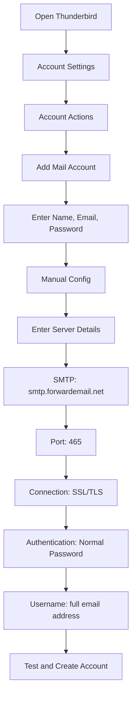

# Contoh Integrasi SMTP {#smtp-integration-examples}

## Daftar Isi {#table-of-contents}

* [Kata pengantar](#foreword)
* [Cara Kerja Pemrosesan SMTP Email Terusan](#how-forward-emails-smtp-processing-works)
  * [Sistem Antrean dan Coba Ulang Email](#email-queue-and-retry-system)
  * [Diuji secara Dummy untuk Keandalan](#dummy-proofed-for-reliability)
* [Integrasi Node.js](#nodejs-integration)
  * [Menggunakan Nodemailer](#using-nodemailer)
  * [Menggunakan Express.js](#using-expressjs)
* [Integrasi Python](#python-integration)
  * [Menggunakan smtplib](#using-smtplib)
  * [Menggunakan Django](#using-django)
* [Integrasi PHP](#php-integration)
  * [Menggunakan PHPMailer](#using-phpmailer)
  * [Menggunakan Laravel](#using-laravel)
* [Integrasi Ruby](#ruby-integration)
  * [Menggunakan Ruby Mail Gem](#using-ruby-mail-gem)
* [Integrasi Java](#java-integration)
  * [Menggunakan Java Mail API](#using-javamail-api)
* [Konfigurasi Klien Email](#email-client-configuration)
  * [Burung Guntur](#thunderbird)
  * [Apple Mail](#apple-mail)
  * [Gmail (Kirim Email Sebagai)](#gmail-send-mail-as)
* [Pemecahan Masalah](#troubleshooting)
  * [Masalah Umum dan Solusinya](#common-issues-and-solutions)
  * [Mendapatkan Bantuan](#getting-help)
* [Sumber Daya Tambahan](#additional-resources)
* [Kesimpulan](#conclusion)

## Kata Pengantar {#foreword}

Panduan ini memberikan contoh detail tentang cara berintegrasi dengan layanan SMTP Forward Email menggunakan berbagai bahasa pemrograman, kerangka kerja, dan klien email. Layanan SMTP kami dirancang agar andal, aman, dan mudah diintegrasikan dengan aplikasi Anda yang sudah ada.

## Cara Kerja Pemrosesan SMTP Email Penerusan {#how-forward-emails-smtp-processing-works}

Sebelum menyelami contoh integrasi, penting untuk memahami bagaimana layanan SMTP kami memproses email:

### Sistem Antrean Email dan Coba Ulang {#email-queue-and-retry-system}

Saat Anda mengirimkan email melalui SMTP ke server kami:

1. **Pemrosesan Awal**: Email divalidasi, dipindai untuk mendeteksi malware, dan diperiksa dengan filter spam.
2. **Antrean Cerdas**: Email ditempatkan dalam sistem antrean canggih untuk pengiriman.
3. **Mekanisme Coba Ulang Cerdas**: Jika pengiriman gagal sementara, sistem kami akan:
* Menganalisis respons kesalahan menggunakan fungsi `getBounceInfo` kami.
* Menentukan apakah masalah bersifat sementara (misalnya, "coba lagi nanti", "ditunda sementara") atau permanen (misalnya, "pengguna tidak dikenal").
* Untuk masalah sementara, tandai email untuk dicoba ulang.
* Untuk masalah permanen, buat notifikasi pantulan.
4. **Periode Coba Ulang 5 Hari**: Kami mencoba ulang pengiriman hingga 5 hari (mirip dengan standar industri seperti Postfix), memberikan waktu bagi masalah sementara untuk diselesaikan.
5. **Notifikasi Status Pengiriman**: Pengirim menerima notifikasi tentang status email mereka (terkirim, tertunda, atau terpental).

> \[!NOTE]
> Setelah pengiriman berhasil, konten email SMTP keluar akan dihapus setelah periode penyimpanan yang dapat dikonfigurasi (default 30 hari) demi keamanan dan privasi. Hanya pesan placeholder yang tersisa yang menunjukkan pengiriman berhasil.

### Diuji Coba untuk Keandalan {#dummy-proofed-for-reliability}

Sistem kami dirancang untuk menangani berbagai kasus khusus:

* Jika daftar blokir terdeteksi, email akan dicoba ulang secara otomatis.
* Jika terjadi masalah jaringan, pengiriman akan dicoba ulang.
* Jika kotak surat penerima penuh, sistem akan mencoba lagi nanti.
* Jika server penerima sementara tidak tersedia, kami akan terus mencoba.

Pendekatan ini secara signifikan meningkatkan tingkat pengiriman dengan tetap menjaga privasi dan keamanan.

## Integrasi Node.js {#nodejs-integration}

### Menggunakan Nodemailer {#using-nodemailer}

[Nodemailer](https://nodemailer.com/) adalah modul populer untuk mengirim email dari aplikasi Node.js.

```javascript
const nodemailer = require('nodemailer');

// Create a transporter object
const transporter = nodemailer.createTransport({
  host: 'smtp.forwardemail.net',
  port: 465,
  secure: true, // Use TLS
  auth: {
    user: 'your-username@your-domain.com',
    pass: 'your-password'
  }
});

// Send mail with defined transport object
async function sendEmail() {
  try {
    const info = await transporter.sendMail({
      from: '"Your Name" <your-username@your-domain.com>',
      to: 'recipient@example.com',
      subject: 'Hello from Forward Email',
      text: 'Hello world! This is a test email sent using Nodemailer and Forward Email SMTP.',
      html: '<b>Hello world!</b> This is a test email sent using Nodemailer and Forward Email SMTP.'
    });

    console.log('Message sent: %s', info.messageId);
  } catch (error) {
    console.error('Error sending email:', error);
  }
}

sendEmail();
```

### Menggunakan Express.js {#using-expressjs}

Berikut cara mengintegrasikan Forward Email SMTP dengan aplikasi Express.js:

```javascript
const express = require('express');
const nodemailer = require('nodemailer');
const app = express();
const port = 3000;

app.use(express.json());

// Configure email transporter
const transporter = nodemailer.createTransport({
  host: 'smtp.forwardemail.net',
  port: 465,
  secure: true,
  auth: {
    user: 'your-username@your-domain.com',
    pass: 'your-password'
  }
});

// API endpoint for sending emails
app.post('/send-email', async (req, res) => {
  const { to, subject, text, html } = req.body;

  try {
    const info = await transporter.sendMail({
      from: '"Your App" <your-username@your-domain.com>',
      to,
      subject,
      text,
      html
    });

    res.status(200).json({
      success: true,
      messageId: info.messageId
    });
  } catch (error) {
    console.error('Error sending email:', error);
    res.status(500).json({
      success: false,
      error: error.message
    });
  }
});

app.listen(port, () => {
  console.log(`Server running at http://localhost:${port}`);
});
```

## Integrasi Python {#python-integration}

### Menggunakan smtplib {#using-smtplib}

```python
import smtplib
from email.mime.text import MIMEText
from email.mime.multipart import MIMEMultipart

# Email configuration
sender_email = "your-username@your-domain.com"
receiver_email = "recipient@example.com"
password = "your-password"

# Create message
message = MIMEMultipart("alternative")
message["Subject"] = "Hello from Forward Email"
message["From"] = sender_email
message["To"] = receiver_email

# Create the plain-text and HTML version of your message
text = "Hello world! This is a test email sent using Python and Forward Email SMTP."
html = "<html><body><b>Hello world!</b> This is a test email sent using Python and Forward Email SMTP.</body></html>"

# Turn these into plain/html MIMEText objects
part1 = MIMEText(text, "plain")
part2 = MIMEText(html, "html")

# Add HTML/plain-text parts to MIMEMultipart message
message.attach(part1)
message.attach(part2)

# Send email
try:
    server = smtplib.SMTP_SSL("smtp.forwardemail.net", 465)
    server.login(sender_email, password)
    server.sendmail(sender_email, receiver_email, message.as_string())
    server.quit()
    print("Email sent successfully!")
except Exception as e:
    print(f"Error sending email: {e}")
```

### Menggunakan Django {#using-django}

Untuk aplikasi Django, tambahkan yang berikut ke `settings.py` Anda:

```python
# Email settings
EMAIL_BACKEND = 'django.core.mail.backends.smtp.EmailBackend'
EMAIL_HOST = 'smtp.forwardemail.net'
EMAIL_PORT = 465
EMAIL_USE_SSL = True
EMAIL_HOST_USER = 'your-username@your-domain.com'
EMAIL_HOST_PASSWORD = 'your-password'
DEFAULT_FROM_EMAIL = 'your-username@your-domain.com'
```

Lalu kirim email dalam tampilan Anda:

```python
from django.core.mail import send_mail

def send_email_view(request):
    send_mail(
        'Subject here',
        'Here is the message.',
        'from@your-domain.com',
        ['to@example.com'],
        fail_silently=False,
        html_message='<b>Here is the HTML message.</b>'
    )
    return HttpResponse('Email sent!')
```

## Integrasi PHP {#php-integration}

### Menggunakan PHPMailer {#using-phpmailer}

```php
<?php
use PHPMailer\PHPMailer\PHPMailer;
use PHPMailer\PHPMailer\Exception;

require 'vendor/autoload.php';

$mail = new PHPMailer(true);

try {
    // Server settings
    $mail->isSMTP();
    $mail->Host       = 'smtp.forwardemail.net';
    $mail->SMTPAuth   = true;
    $mail->Username   = 'your-username@your-domain.com';
    $mail->Password   = 'your-password';
    $mail->SMTPSecure = PHPMailer::ENCRYPTION_SMTPS;
    $mail->Port       = 465;

    // Recipients
    $mail->setFrom('your-username@your-domain.com', 'Your Name');
    $mail->addAddress('recipient@example.com', 'Recipient Name');
    $mail->addReplyTo('your-username@your-domain.com', 'Your Name');

    // Content
    $mail->isHTML(true);
    $mail->Subject = 'Hello from Forward Email';
    $mail->Body    = '<b>Hello world!</b> This is a test email sent using PHPMailer and Forward Email SMTP.';
    $mail->AltBody = 'Hello world! This is a test email sent using PHPMailer and Forward Email SMTP.';

    $mail->send();
    echo 'Message has been sent';
} catch (Exception $e) {
    echo "Message could not be sent. Mailer Error: {$mail->ErrorInfo}";
}
```

### Menggunakan Laravel {#using-laravel}

Untuk aplikasi Laravel, perbarui file `.env` Anda:

```sh
MAIL_MAILER=smtp
MAIL_HOST=smtp.forwardemail.net
MAIL_PORT=465
MAIL_USERNAME=your-username@your-domain.com
MAIL_PASSWORD=your-password
MAIL_ENCRYPTION=ssl
MAIL_FROM_ADDRESS=your-username@your-domain.com
MAIL_FROM_NAME="${APP_NAME}"
```

Kemudian kirim email menggunakan façade Mail Laravel:

```php
<?php

namespace App\Http\Controllers;

use Illuminate\Http\Request;
use Illuminate\Support\Facades\Mail;
use App\Mail\WelcomeEmail;

class EmailController extends Controller
{
    public function sendEmail()
    {
        Mail::to('recipient@example.com')->send(new WelcomeEmail());

        return 'Email sent successfully!';
    }
}
```

## Integrasi Ruby {#ruby-integration}

### Menggunakan Ruby Mail Gem {#using-ruby-mail-gem}

```ruby
require 'mail'

Mail.defaults do
  delivery_method :smtp, {
    address: 'smtp.forwardemail.net',
    port: 465,
    domain: 'your-domain.com',
    user_name: 'your-username@your-domain.com',
    password: 'your-password',
    authentication: 'plain',
    enable_starttls_auto: true,
    ssl: true
  }
end

mail = Mail.new do
  from     'your-username@your-domain.com'
  to       'recipient@example.com'
  subject  'Hello from Forward Email'

  text_part do
    body 'Hello world! This is a test email sent using Ruby Mail and Forward Email SMTP.'
  end

  html_part do
    content_type 'text/html; charset=UTF-8'
    body '<b>Hello world!</b> This is a test email sent using Ruby Mail and Forward Email SMTP.'
  end
end

mail.deliver!
puts "Email sent successfully!"
```

## Integrasi Java {#java-integration}

### Menggunakan API JavaMail {#using-javamail-api}

```java
import java.util.Properties;
import javax.mail.*;
import javax.mail.internet.*;

public class SendEmail {
    public static void main(String[] args) {
        // Sender's email and password
        final String username = "your-username@your-domain.com";
        final String password = "your-password";

        // SMTP server properties
        Properties props = new Properties();
        props.put("mail.smtp.auth", "true");
        props.put("mail.smtp.starttls.enable", "true");
        props.put("mail.smtp.host", "smtp.forwardemail.net");
        props.put("mail.smtp.port", "465");
        props.put("mail.smtp.socketFactory.port", "465");
        props.put("mail.smtp.socketFactory.class", "javax.net.ssl.SSLSocketFactory");

        // Create session with authenticator
        Session session = Session.getInstance(props,
            new javax.mail.Authenticator() {
                protected PasswordAuthentication getPasswordAuthentication() {
                    return new PasswordAuthentication(username, password);
                }
            });

        try {
            // Create message
            Message message = new MimeMessage(session);
            message.setFrom(new InternetAddress(username));
            message.setRecipients(Message.RecipientType.TO, InternetAddress.parse("recipient@example.com"));
            message.setSubject("Hello from Forward Email");

            // Create multipart message
            Multipart multipart = new MimeMultipart("alternative");

            // Text part
            BodyPart textPart = new MimeBodyPart();
            textPart.setText("Hello world! This is a test email sent using JavaMail and Forward Email SMTP.");

            // HTML part
            BodyPart htmlPart = new MimeBodyPart();
            htmlPart.setContent("<b>Hello world!</b> This is a test email sent using JavaMail and Forward Email SMTP.", "text/html");

            // Add parts to multipart
            multipart.addBodyPart(textPart);
            multipart.addBodyPart(htmlPart);

            // Set content
            message.setContent(multipart);

            // Send message
            Transport.send(message);

            System.out.println("Email sent successfully!");

        } catch (MessagingException e) {
            throw new RuntimeException(e);
        }
    }
}
```

## Konfigurasi Klien Email {#email-client-configuration}

### Thunderbird {#thunderbird}



1. Buka Thunderbird dan buka Pengaturan Akun
2. Klik "Tindakan Akun" dan pilih "Tambahkan Akun Email"
3. Masukkan nama, alamat email, dan kata sandi Anda
4. Klik "Konfigurasi Manual" dan masukkan detail berikut:
* Server Masuk:
* IMAP: imap.forwardemail.net, Port: 993, SSL/TLS
* POP3: pop3.forwardemail.net, Port: 995, SSL/TLS
* Server Keluar (SMTP): smtp.forwardemail.net, Port: 465, SSL/TLS
* Autentikasi: Kata Sandi Normal
* Nama Pengguna: alamat email lengkap Anda
5. Klik "Uji" lalu "Selesai"

### Apple Mail {#apple-mail}

1. Buka Mail dan buka Mail > Preferensi > Akun
2. Klik tombol "+" untuk menambahkan akun baru
3. Pilih "Akun Mail Lainnya" dan klik "Lanjutkan"
4. Masukkan nama, alamat email, dan kata sandi Anda, lalu klik "Masuk"
5. Jika pengaturan otomatis gagal, masukkan detail berikut:
* Server Email Masuk: imap.forwardemail.net (atau pop3.forwardemail.net untuk POP3)
* Server Email Keluar: smtp.forwardemail.net
* Nama Pengguna: alamat email lengkap Anda
* Kata Sandi: kata sandi Anda
6. Klik "Masuk" untuk menyelesaikan pengaturan

### Gmail (Kirim Email Sebagai) {#gmail-send-mail-as}

1. Buka Gmail dan buka Setelan > Akun dan Impor
2. Di bagian "Kirim email sebagai", klik "Tambahkan alamat email lain"
3. Masukkan nama dan alamat email Anda, lalu klik "Langkah Berikutnya"
4. Masukkan detail server SMTP berikut:
* Server SMTP: smtp.forwardemail.net
* Port: 465
* Nama Pengguna: alamat email lengkap Anda
* Kata Sandi: kata sandi Anda
* Pilih "Koneksi aman menggunakan SSL"
5. Klik "Tambahkan Akun" dan verifikasi alamat email Anda

## Pemecahan Masalah {#troubleshooting}

### Masalah Umum dan Solusi {#common-issues-and-solutions}

1. **Otentikasi Gagal**
* Verifikasi nama pengguna (alamat email lengkap) dan kata sandi Anda
* Pastikan Anda menggunakan port yang benar (465 untuk SSL/TLS)
* Periksa apakah akun Anda telah mengaktifkan akses SMTP

2. **Waktu Koneksi Habis**
* Periksa koneksi internet Anda
* Pastikan pengaturan firewall tidak memblokir lalu lintas SMTP
* Coba gunakan port lain (587 dengan STARTTLS)

3. **Pesan Ditolak**
* Pastikan alamat "Dari" Anda sesuai dengan alamat email terautentikasi Anda
* Periksa apakah IP Anda masuk daftar hitam
* Pastikan isi pesan Anda tidak memicu filter spam

4. **Kesalahan TLS/SSL**
* Perbarui aplikasi/pustaka Anda agar mendukung versi TLS terbaru
* Pastikan sertifikat CA sistem Anda mutakhir
* Coba TLS eksplisit, bukan TLS implisit

### Mendapatkan Bantuan {#getting-help}

Jika Anda mengalami masalah yang tidak tercakup di sini, silakan:

1. Periksa [Halaman FAQ](/faq) kami untuk pertanyaan umum
2. Tinjau [postingan blog tentang pengiriman email](/blog/docs/best-email-forwarding-service) kami untuk informasi lebih lanjut
3. Hubungi tim dukungan kami di <support@forwardemail.net>

## Sumber Daya Tambahan {#additional-resources}

* [Teruskan Dokumentasi Email](/docs)
* [Batasan dan Konfigurasi Server SMTP](/faq#what-are-your-outbound-smtp-limits)
* [Panduan Praktik Terbaik Email](/blog/docs/best-email-forwarding-service)
* [Praktik Keamanan](/security)

## Kesimpulan {#conclusion}

Layanan SMTP Forward Email menyediakan cara yang andal, aman, dan mengutamakan privasi untuk mengirim email dari aplikasi dan klien email Anda. Dengan sistem antrean cerdas kami, mekanisme coba ulang 5 hari, dan notifikasi status pengiriman yang komprehensif, Anda dapat yakin bahwa email Anda akan sampai ke tujuannya.

Untuk kasus penggunaan lebih lanjut atau integrasi khusus, silakan hubungi tim dukungan kami.