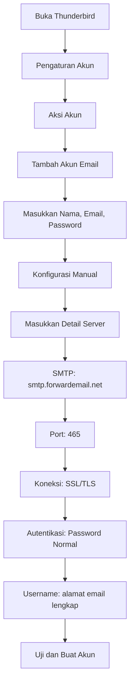

# Contoh Integrasi SMTP {#smtp-integration-examples}


## Daftar Isi {#table-of-contents}

* [Kata Pengantar](#foreword)
* [Cara Kerja Pemrosesan SMTP Forward Email](#how-forward-emails-smtp-processing-works)
  * [Antrian Email dan Sistem Pengulangan](#email-queue-and-retry-system)
  * [Dirancang Agar Mudah dan Andal](#dummy-proofed-for-reliability)
* [Integrasi Node.js](#nodejs-integration)
  * [Menggunakan Nodemailer](#using-nodemailer)
  * [Menggunakan Express.js](#using-expressjs)
* [Integrasi Python](#python-integration)
  * [Menggunakan smtplib](#using-smtplib)
  * [Menggunakan Django](#using-django)
* [Integrasi PHP](#php-integration)
  * [Menggunakan PHPMailer](#using-phpmailer)
  * [Menggunakan Laravel](#using-laravel)
* [Integrasi Ruby](#ruby-integration)
  * [Menggunakan Ruby Mail Gem](#using-ruby-mail-gem)
* [Integrasi Java](#java-integration)
  * [Menggunakan JavaMail API](#using-javamail-api)
* [Konfigurasi Klien Email](#email-client-configuration)
  * [Thunderbird](#thunderbird)
  * [Apple Mail](#apple-mail)
  * [Gmail (Kirim Email Sebagai)](#gmail-send-mail-as)
* [Pemecahan Masalah](#troubleshooting)
  * [Masalah Umum dan Solusinya](#common-issues-and-solutions)
  * [Mendapatkan Bantuan](#getting-help)
* [Sumber Daya Tambahan](#additional-resources)
* [Kesimpulan](#conclusion)


## Kata Pengantar {#foreword}

Panduan ini menyediakan contoh rinci tentang cara mengintegrasikan layanan SMTP Forward Email menggunakan berbagai bahasa pemrograman, kerangka kerja, dan klien email. Layanan SMTP kami dirancang agar andal, aman, dan mudah diintegrasikan dengan aplikasi Anda yang sudah ada.


## Cara Kerja Pemrosesan SMTP Forward Email {#how-forward-emails-smtp-processing-works}

Sebelum masuk ke contoh integrasi, penting untuk memahami bagaimana layanan SMTP kami memproses email:

### Antrian Email dan Sistem Pengulangan {#email-queue-and-retry-system}

Saat Anda mengirim email melalui SMTP ke server kami:

1. **Pemrosesan Awal**: Email divalidasi, dipindai untuk malware, dan diperiksa terhadap filter spam
2. **Antrian Cerdas**: Email ditempatkan dalam sistem antrian canggih untuk pengiriman
3. **Mekanisme Pengulangan Cerdas**: Jika pengiriman gagal sementara, sistem kami akan:
   * Menganalisis respons kesalahan menggunakan fungsi `getBounceInfo`
   * Menentukan apakah masalah bersifat sementara (misalnya, "coba lagi nanti", "ditunda sementara") atau permanen (misalnya, "pengguna tidak dikenal")
   * Untuk masalah sementara, menandai email untuk pengulangan
   * Untuk masalah permanen, menghasilkan notifikasi bounce
4. **Periode Pengulangan 5 Hari**: Kami mencoba ulang pengiriman hingga 5 hari (mirip dengan standar industri seperti Postfix), memberi waktu untuk masalah sementara terselesaikan
5. **Notifikasi Status Pengiriman**: Pengirim menerima notifikasi tentang status email mereka (terkirim, tertunda, atau bounce)

> \[!NOTE]
> Setelah pengiriman berhasil, konten email SMTP keluar akan dihapus setelah periode retensi yang dapat dikonfigurasi (default 30 hari) demi keamanan dan privasi. Hanya pesan placeholder yang tersisa yang menunjukkan pengiriman berhasil.

### Dirancang Agar Mudah dan Andal {#dummy-proofed-for-reliability}

Sistem kami dirancang untuk menangani berbagai kasus tepi:

* Jika terdeteksi daftar blokir, email akan otomatis dicoba ulang
* Jika terjadi masalah jaringan, pengiriman akan dicoba ulang
* Jika kotak surat penerima penuh, sistem akan mencoba lagi nanti
* Jika server penerima sementara tidak tersedia, kami akan terus mencoba

Pendekatan ini secara signifikan meningkatkan tingkat pengiriman sambil menjaga privasi dan keamanan.


## Integrasi Node.js {#nodejs-integration}

### Menggunakan Nodemailer {#using-nodemailer}

[Nodemailer](https://nodemailer.com/) adalah modul populer untuk mengirim email dari aplikasi Node.js.

```javascript
const nodemailer = require('nodemailer');

// Create a transporter object
const transporter = nodemailer.createTransport({
  host: 'smtp.forwardemail.net',
  port: 465,
  secure: true, // Use TLS
  auth: {
    user: 'your-username@your-domain.com',
    pass: 'your-password'
  }
});

// Send mail with defined transport object
async function sendEmail() {
  try {
    const info = await transporter.sendMail({
      from: '"Your Name" <your-username@your-domain.com>',
      to: 'recipient@example.com',
      subject: 'Hello from Forward Email',
      text: 'Hello world! This is a test email sent using Nodemailer and Forward Email SMTP.',
      html: '<b>Hello world!</b> This is a test email sent using Nodemailer and Forward Email SMTP.'
    });

    console.log('Message sent: %s', info.messageId);
  } catch (error) {
    console.error('Error sending email:', error);
  }
}

sendEmail();
```
### Menggunakan Express.js {#using-expressjs}

Berikut cara mengintegrasikan Forward Email SMTP dengan aplikasi Express.js:

```javascript
const express = require('express');
const nodemailer = require('nodemailer');
const app = express();
const port = 3000;

app.use(express.json());

// Konfigurasi transporter email
const transporter = nodemailer.createTransport({
  host: 'smtp.forwardemail.net',
  port: 465,
  secure: true,
  auth: {
    user: 'your-username@your-domain.com',
    pass: 'your-password'
  }
});

// Endpoint API untuk mengirim email
app.post('/send-email', async (req, res) => {
  const { to, subject, text, html } = req.body;

  try {
    const info = await transporter.sendMail({
      from: '"Your App" <your-username@your-domain.com>',
      to,
      subject,
      text,
      html
    });

    res.status(200).json({
      success: true,
      messageId: info.messageId
    });
  } catch (error) {
    console.error('Error sending email:', error);
    res.status(500).json({
      success: false,
      error: error.message
    });
  }
});

app.listen(port, () => {
  console.log(`Server running at http://localhost:${port}`);
});
```


## Integrasi Python {#python-integration}

### Menggunakan smtplib {#using-smtplib}

```python
import smtplib
from email.mime.text import MIMEText
from email.mime.multipart import MIMEMultipart

# Konfigurasi email
sender_email = "your-username@your-domain.com"
receiver_email = "recipient@example.com"
password = "your-password"

# Buat pesan
message = MIMEMultipart("alternative")
message["Subject"] = "Hello from Forward Email"
message["From"] = sender_email
message["To"] = receiver_email

# Buat versi teks biasa dan HTML dari pesan Anda
text = "Hello world! This is a test email sent using Python and Forward Email SMTP."
html = "<html><body><b>Hello world!</b> This is a test email sent using Python and Forward Email SMTP.</body></html>"

# Ubah ini menjadi objek MIMEText plain/html
part1 = MIMEText(text, "plain")
part2 = MIMEText(html, "html")

# Tambahkan bagian HTML/teks biasa ke pesan MIMEMultipart
message.attach(part1)
message.attach(part2)

# Kirim email
try:
    server = smtplib.SMTP_SSL("smtp.forwardemail.net", 465)
    server.login(sender_email, password)
    server.sendmail(sender_email, receiver_email, message.as_string())
    server.quit()
    print("Email sent successfully!")
except Exception as e:
    print(f"Error sending email: {e}")
```

### Menggunakan Django {#using-django}

Untuk aplikasi Django, tambahkan berikut ini ke `settings.py` Anda:

```python
# Pengaturan email
EMAIL_BACKEND = 'django.core.mail.backends.smtp.EmailBackend'
EMAIL_HOST = 'smtp.forwardemail.net'
EMAIL_PORT = 465
EMAIL_USE_SSL = True
EMAIL_HOST_USER = 'your-username@your-domain.com'
EMAIL_HOST_PASSWORD = 'your-password'
DEFAULT_FROM_EMAIL = 'your-username@your-domain.com'
```

Kemudian kirim email di views Anda:

```python
from django.core.mail import send_mail

def send_email_view(request):
    send_mail(
        'Subject here',
        'Here is the message.',
        'from@your-domain.com',
        ['to@example.com'],
        fail_silently=False,
        html_message='<b>Here is the HTML message.</b>'
    )
    return HttpResponse('Email sent!')
```


## Integrasi PHP {#php-integration}

### Menggunakan PHPMailer {#using-phpmailer}

```php
<?php
use PHPMailer\PHPMailer\PHPMailer;
use PHPMailer\PHPMailer\Exception;

require 'vendor/autoload.php';

$mail = new PHPMailer(true);

try {
    // Pengaturan server
    $mail->isSMTP();
    $mail->Host       = 'smtp.forwardemail.net';
    $mail->SMTPAuth   = true;
    $mail->Username   = 'your-username@your-domain.com';
    $mail->Password   = 'your-password';
    $mail->SMTPSecure = PHPMailer::ENCRYPTION_SMTPS;
    $mail->Port       = 465;

    // Penerima
    $mail->setFrom('your-username@your-domain.com', 'Your Name');
    $mail->addAddress('recipient@example.com', 'Recipient Name');
    $mail->addReplyTo('your-username@your-domain.com', 'Your Name');

    // Konten
    $mail->isHTML(true);
    $mail->Subject = 'Hello from Forward Email';
    $mail->Body    = '<b>Hello world!</b> This is a test email sent using PHPMailer and Forward Email SMTP.';
    $mail->AltBody = 'Hello world! This is a test email sent using PHPMailer and Forward Email SMTP.';

    $mail->send();
    echo 'Message has been sent';
} catch (Exception $e) {
    echo "Message could not be sent. Mailer Error: {$mail->ErrorInfo}";
}
```
### Menggunakan Laravel {#using-laravel}

Untuk aplikasi Laravel, perbarui file `.env` Anda:

```sh
MAIL_MAILER=smtp
MAIL_HOST=smtp.forwardemail.net
MAIL_PORT=465
MAIL_USERNAME=your-username@your-domain.com
MAIL_PASSWORD=your-password
MAIL_ENCRYPTION=ssl
MAIL_FROM_ADDRESS=your-username@your-domain.com
MAIL_FROM_NAME="${APP_NAME}"
```

Kemudian kirim email menggunakan façade Mail Laravel:

```php
<?php

namespace App\Http\Controllers;

use Illuminate\Http\Request;
use Illuminate\Support\Facades\Mail;
use App\Mail\WelcomeEmail;

class EmailController extends Controller
{
    public function sendEmail()
    {
        Mail::to('recipient@example.com')->send(new WelcomeEmail());

        return 'Email berhasil dikirim!';
    }
}
```


## Integrasi Ruby {#ruby-integration}

### Menggunakan Ruby Mail Gem {#using-ruby-mail-gem}

```ruby
require 'mail'

Mail.defaults do
  delivery_method :smtp, {
    address: 'smtp.forwardemail.net',
    port: 465,
    domain: 'your-domain.com',
    user_name: 'your-username@your-domain.com',
    password: 'your-password',
    authentication: 'plain',
    enable_starttls_auto: true,
    ssl: true
  }
end

mail = Mail.new do
  from     'your-username@your-domain.com'
  to       'recipient@example.com'
  subject  'Halo dari Forward Email'

  text_part do
    body 'Halo dunia! Ini adalah email percobaan yang dikirim menggunakan Ruby Mail dan Forward Email SMTP.'
  end

  html_part do
    content_type 'text/html; charset=UTF-8'
    body '<b>Halo dunia!</b> Ini adalah email percobaan yang dikirim menggunakan Ruby Mail dan Forward Email SMTP.'
  end
end

mail.deliver!
puts "Email berhasil dikirim!"
```


## Integrasi Java {#java-integration}

### Menggunakan JavaMail API {#using-javamail-api}

```java
import java.util.Properties;
import javax.mail.*;
import javax.mail.internet.*;

public class SendEmail {
    public static void main(String[] args) {
        // Email dan password pengirim
        final String username = "your-username@your-domain.com";
        final String password = "your-password";

        // Properti server SMTP
        Properties props = new Properties();
        props.put("mail.smtp.auth", "true");
        props.put("mail.smtp.starttls.enable", "true");
        props.put("mail.smtp.host", "smtp.forwardemail.net");
        props.put("mail.smtp.port", "465");
        props.put("mail.smtp.socketFactory.port", "465");
        props.put("mail.smtp.socketFactory.class", "javax.net.ssl.SSLSocketFactory");

        // Membuat sesi dengan authenticator
        Session session = Session.getInstance(props,
            new javax.mail.Authenticator() {
                protected PasswordAuthentication getPasswordAuthentication() {
                    return new PasswordAuthentication(username, password);
                }
            });

        try {
            // Membuat pesan
            Message message = new MimeMessage(session);
            message.setFrom(new InternetAddress(username));
            message.setRecipients(Message.RecipientType.TO, InternetAddress.parse("recipient@example.com"));
            message.setSubject("Halo dari Forward Email");

            // Membuat pesan multipart
            Multipart multipart = new MimeMultipart("alternative");

            // Bagian teks
            BodyPart textPart = new MimeBodyPart();
            textPart.setText("Halo dunia! Ini adalah email percobaan yang dikirim menggunakan JavaMail dan Forward Email SMTP.");

            // Bagian HTML
            BodyPart htmlPart = new MimeBodyPart();
            htmlPart.setContent("<b>Halo dunia!</b> Ini adalah email percobaan yang dikirim menggunakan JavaMail dan Forward Email SMTP.", "text/html");

            // Menambahkan bagian ke multipart
            multipart.addBodyPart(textPart);
            multipart.addBodyPart(htmlPart);

            // Mengatur konten
            message.setContent(multipart);

            // Mengirim pesan
            Transport.send(message);

            System.out.println("Email berhasil dikirim!");

        } catch (MessagingException e) {
            throw new RuntimeException(e);
        }
    }
}
```


## Konfigurasi Klien Email {#email-client-configuration}

### Thunderbird {#thunderbird}


```mermaid
flowchart TD
    A[Buka Thunderbird] --> B[Pengaturan Akun]
    B --> C[Aksi Akun]
    C --> D[Tambah Akun Email]
    D --> E[Masukkan Nama, Email, Password]
    E --> F[Konfigurasi Manual]
    F --> G[Masukkan Detail Server]
    G --> H[SMTP: smtp.forwardemail.net]
    H --> I[Port: 465]
    I --> J[Koneksi: SSL/TLS]
    J --> K[Autentikasi: Password Normal]
    K --> L[Username: alamat email lengkap]
    L --> M[Uji dan Buat Akun]
```
1. Buka Thunderbird dan pergi ke Pengaturan Akun  
2. Klik "Tindakan Akun" dan pilih "Tambah Akun Email"  
3. Masukkan nama Anda, alamat email, dan kata sandi  
4. Klik "Konfigurasi Manual" dan masukkan detail berikut:  
   * Server Masuk:  
     * IMAP: imap.forwardemail.net, Port: 993, SSL/TLS  
     * POP3: pop3.forwardemail.net, Port: 995, SSL/TLS  
   * Server Keluar (SMTP): smtp.forwardemail.net, Port: 465, SSL/TLS  
   * Autentikasi: Kata Sandi Normal  
   * Nama Pengguna: alamat email lengkap Anda  
5. Klik "Uji" lalu "Selesai"  

### Apple Mail {#apple-mail}

1. Buka Mail dan pergi ke Mail > Preferensi > Akun  
2. Klik tombol "+" untuk menambahkan akun baru  
3. Pilih "Akun Email Lain" dan klik "Lanjutkan"  
4. Masukkan nama Anda, alamat email, dan kata sandi, lalu klik "Masuk"  
5. Ketika pengaturan otomatis gagal, masukkan detail berikut:  
   * Server Surat Masuk: imap.forwardemail.net (atau pop3.forwardemail.net untuk POP3)  
   * Server Surat Keluar: smtp.forwardemail.net  
   * Nama Pengguna: alamat email lengkap Anda  
   * Kata Sandi: kata sandi Anda  
6. Klik "Masuk" untuk menyelesaikan pengaturan  

### Gmail (Kirim Email Sebagai) {#gmail-send-mail-as}

1. Buka Gmail dan pergi ke Pengaturan > Akun dan Impor  
2. Di bawah "Kirim email sebagai", klik "Tambahkan alamat email lain"  
3. Masukkan nama dan alamat email Anda, lalu klik "Langkah Berikutnya"  
4. Masukkan detail server SMTP berikut:  
   * Server SMTP: smtp.forwardemail.net  
   * Port: 465  
   * Nama Pengguna: alamat email lengkap Anda  
   * Kata Sandi: kata sandi Anda  
   * Pilih "Koneksi aman menggunakan SSL"  
5. Klik "Tambahkan Akun" dan verifikasi alamat email Anda  

## Pemecahan Masalah {#troubleshooting}

### Masalah Umum dan Solusi {#common-issues-and-solutions}

1. **Autentikasi Gagal**  
   * Verifikasi nama pengguna Anda (alamat email lengkap) dan kata sandi  
   * Pastikan Anda menggunakan port yang benar (465 untuk SSL/TLS)  
   * Periksa apakah akun Anda memiliki akses SMTP yang diaktifkan  

2. **Waktu Koneksi Habis**  
   * Periksa koneksi internet Anda  
   * Verifikasi pengaturan firewall tidak memblokir lalu lintas SMTP  
   * Coba gunakan port 465 dengan SSL/TLS (disarankan) atau port 587 dengan STARTTLS  

3. **Pesan Ditolak**  
   * Pastikan alamat "Dari" Anda sesuai dengan email yang diautentikasi  
   * Periksa apakah IP Anda masuk daftar hitam  
   * Verifikasi isi pesan Anda tidak memicu filter spam  

4. **Kesalahan TLS/SSL**  
   * Perbarui aplikasi/perpustakaan Anda untuk mendukung versi TLS modern  
   * Pastikan sertifikat CA sistem Anda terbaru  
   * Coba TLS eksplisit daripada TLS implisit  

### Mendapatkan Bantuan {#getting-help}

Jika Anda mengalami masalah yang tidak tercakup di sini, silakan:  

1. Periksa [halaman FAQ kami](/faq) untuk pertanyaan umum  
2. Tinjau [posting blog kami tentang pengiriman email](/blog/docs/best-email-forwarding-service) untuk informasi detail  
3. Hubungi tim dukungan kami di <support@forwardemail.net>  

## Sumber Daya Tambahan {#additional-resources}

* [Dokumentasi Forward Email](/docs)  
* [Batas dan Konfigurasi Server SMTP](/faq#what-are-your-outbound-smtp-limits)  
* [Panduan Praktik Terbaik Email](/blog/docs/best-email-forwarding-service)  
* [Praktik Keamanan](/security)  

## Kesimpulan {#conclusion}

Layanan SMTP Forward Email menyediakan cara yang andal, aman, dan berfokus pada privasi untuk mengirim email dari aplikasi dan klien email Anda. Dengan sistem antrean cerdas kami, mekanisme percobaan ulang selama 5 hari, dan notifikasi status pengiriman yang komprehensif, Anda dapat yakin bahwa email Anda akan sampai ke tujuan.  

Untuk kasus penggunaan yang lebih maju atau integrasi khusus, silakan hubungi tim dukungan kami.
