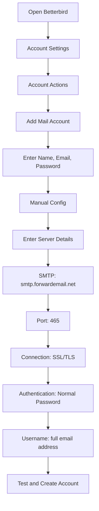

# Esempi di integrazione SMTP {#smtp-integration-examples}

## Indice {#table-of-contents}

* [Prefazione](#foreword)
* [Come funziona l'elaborazione SMTP di Forward Email](#how-forward-emails-smtp-processing-works)
  * [Sistema di coda e ripetizione delle e-mail](#email-queue-and-retry-system)
  * [Affidabilità a prova di manichino](#dummy-proofed-for-reliability)
* [Integrazione Node.js](#nodejs-integration)
  * [Utilizzo di Nodemailer](#using-nodemailer)
  * [Utilizzo di Express.js](#using-expressjs)
* [Integrazione Python](#python-integration)
  * [Utilizzo di smtplib](#using-smtplib)
  * [Utilizzo di Django](#using-django)
* [Integrazione PHP](#php-integration)
  * [Utilizzo di PHPMailer](#using-phpmailer)
  * [Utilizzo di Laravel](#using-laravel)
* [Integrazione Ruby](#ruby-integration)
  * [Utilizzo di Ruby Mail Gem](#using-ruby-mail-gem)
* [Integrazione Java](#java-integration)
  * [Utilizzo dell'API Java Mail](#using-javamail-api)
* [Configurazione del client di posta elettronica](#email-client-configuration)
  * [Betterbird](#betterbird)
  * [Apple Mail](#apple-mail)
  * [Gmail (Invia posta come)](#gmail-send-mail-as)
* [Risoluzione dei problemi](#troubleshooting)
  * [Problemi comuni e soluzioni](#common-issues-and-solutions)
  * [Ottenere aiuto](#getting-help)
* [Risorse aggiuntive](#additional-resources)
* [Conclusione](#conclusion)

## Prefazione {#foreword}

Questa guida fornisce esempi dettagliati su come integrare il servizio SMTP di Forward Email utilizzando diversi linguaggi di programmazione, framework e client di posta elettronica. Il nostro servizio SMTP è progettato per essere affidabile, sicuro e facile da integrare con le applicazioni esistenti.

## Come funziona l'elaborazione SMTP di Inoltra e-mail {#how-forward-emails-smtp-processing-works}

Prima di addentrarci negli esempi di integrazione, è importante capire come il nostro servizio SMTP elabora le email:

### Sistema di coda e ripetizione email {#email-queue-and-retry-system}

Quando invii un'e-mail tramite SMTP ai nostri server:

1. **Elaborazione iniziale**: l'email viene convalidata, analizzata per malware e verificata con i filtri antispam.
2. **Coda intelligente**: le email vengono inserite in un sofisticato sistema di coda per la consegna.
3. **Meccanismo di ripetizione intelligente**: se la consegna fallisce temporaneamente, il nostro sistema:
* Analizza la risposta di errore utilizzando la nostra funzione `getBounceInfo`.
* Determina se il problema è temporaneo (ad esempio, "riprova più tardi", "temporaneamente rinviato") o permanente (ad esempio, "utente sconosciuto").
* In caso di problemi temporanei, contrassegna l'email per una nuova ripetizione.
* In caso di problemi permanenti, genera una notifica di mancato recapito.
4. **Periodo di ripetizione di 5 giorni**: riproviamo la consegna per un massimo di 5 giorni (simile a standard di settore come Postfix), dando il tempo ai problemi temporanei di risolversi.
5. **Notifiche sullo stato di consegna**: i mittenti ricevono notifiche sullo stato delle loro email (consegnate, in ritardo o respinte).

> \[!NOTE]
> Dopo la consegna avvenuta correttamente, il contenuto dell'email SMTP in uscita viene redatto dopo un periodo di conservazione configurabile (il valore predefinito è 30 giorni) per motivi di sicurezza e privacy. Rimane solo un messaggio segnaposto che indica l'avvenuta consegna.

### A prova di errore per affidabilità {#dummy-proofed-for-reliability}

Il nostro sistema è progettato per gestire vari casi limite:

* Se viene rilevata una lista bloccata, l'email verrà automaticamente ritentata.
* In caso di problemi di rete, la consegna verrà ritentata.
* Se la casella di posta del destinatario è piena, il sistema riproverà più tardi.
* Se il server di ricezione è temporaneamente non disponibile, continueremo a tentare.

Questo approccio migliora significativamente i tassi di consegna, mantenendo al contempo la privacy e la sicurezza.

## Integrazione Node.js {#nodejs-integration}

### Utilizzo di Nodemailer {#using-nodemailer}

[Nodemailer](https://nodemailer.com/) è un modulo popolare per l'invio di e-mail dalle applicazioni Node.js.

```javascript
const nodemailer = require('nodemailer');

// Create a transporter object
const transporter = nodemailer.createTransport({
  host: 'smtp.forwardemail.net',
  port: 465,
  secure: true, // Use TLS
  auth: {
    user: 'your-username@your-domain.com',
    pass: 'your-password'
  }
});

// Send mail with defined transport object
async function sendEmail() {
  try {
    const info = await transporter.sendMail({
      from: '"Your Name" <your-username@your-domain.com>',
      to: 'recipient@example.com',
      subject: 'Hello from Forward Email',
      text: 'Hello world! This is a test email sent using Nodemailer and Forward Email SMTP.',
      html: '<b>Hello world!</b> This is a test email sent using Nodemailer and Forward Email SMTP.'
    });

    console.log('Message sent: %s', info.messageId);
  } catch (error) {
    console.error('Error sending email:', error);
  }
}

sendEmail();
```

### Utilizzo di Express.js {#using-expressjs}

Ecco come integrare Forward Email SMTP con un'applicazione Express.js:

```javascript
const express = require('express');
const nodemailer = require('nodemailer');
const app = express();
const port = 3000;

app.use(express.json());

// Configure email transporter
const transporter = nodemailer.createTransport({
  host: 'smtp.forwardemail.net',
  port: 465,
  secure: true,
  auth: {
    user: 'your-username@your-domain.com',
    pass: 'your-password'
  }
});

// API endpoint for sending emails
app.post('/send-email', async (req, res) => {
  const { to, subject, text, html } = req.body;

  try {
    const info = await transporter.sendMail({
      from: '"Your App" <your-username@your-domain.com>',
      to,
      subject,
      text,
      html
    });

    res.status(200).json({
      success: true,
      messageId: info.messageId
    });
  } catch (error) {
    console.error('Error sending email:', error);
    res.status(500).json({
      success: false,
      error: error.message
    });
  }
});

app.listen(port, () => {
  console.log(`Server running at http://localhost:${port}`);
});
```

## Integrazione Python {#python-integration}

### Utilizzo di smtplib {#using-smtplib}

```python
import smtplib
from email.mime.text import MIMEText
from email.mime.multipart import MIMEMultipart

# Email configuration
sender_email = "your-username@your-domain.com"
receiver_email = "recipient@example.com"
password = "your-password"

# Create message
message = MIMEMultipart("alternative")
message["Subject"] = "Hello from Forward Email"
message["From"] = sender_email
message["To"] = receiver_email

# Create the plain-text and HTML version of your message
text = "Hello world! This is a test email sent using Python and Forward Email SMTP."
html = "<html><body><b>Hello world!</b> This is a test email sent using Python and Forward Email SMTP.</body></html>"

# Turn these into plain/html MIMEText objects
part1 = MIMEText(text, "plain")
part2 = MIMEText(html, "html")

# Add HTML/plain-text parts to MIMEMultipart message
message.attach(part1)
message.attach(part2)

# Send email
try:
    server = smtplib.SMTP_SSL("smtp.forwardemail.net", 465)
    server.login(sender_email, password)
    server.sendmail(sender_email, receiver_email, message.as_string())
    server.quit()
    print("Email sent successfully!")
except Exception as e:
    print(f"Error sending email: {e}")
```

### Utilizzo di Django {#using-django}

Per le applicazioni Django, aggiungi quanto segue a `settings.py`:

```python
# Email settings
EMAIL_BACKEND = 'django.core.mail.backends.smtp.EmailBackend'
EMAIL_HOST = 'smtp.forwardemail.net'
EMAIL_PORT = 465
EMAIL_USE_SSL = True
EMAIL_HOST_USER = 'your-username@your-domain.com'
EMAIL_HOST_PASSWORD = 'your-password'
DEFAULT_FROM_EMAIL = 'your-username@your-domain.com'
```

Quindi invia email nelle tue visualizzazioni:

```python
from django.core.mail import send_mail

def send_email_view(request):
    send_mail(
        'Subject here',
        'Here is the message.',
        'from@your-domain.com',
        ['to@example.com'],
        fail_silently=False,
        html_message='<b>Here is the HTML message.</b>'
    )
    return HttpResponse('Email sent!')
```

## Integrazione PHP {#php-integration}

### Utilizzo di PHPMailer {#using-phpmailer}

```php
<?php
use PHPMailer\PHPMailer\PHPMailer;
use PHPMailer\PHPMailer\Exception;

require 'vendor/autoload.php';

$mail = new PHPMailer(true);

try {
    // Server settings
    $mail->isSMTP();
    $mail->Host       = 'smtp.forwardemail.net';
    $mail->SMTPAuth   = true;
    $mail->Username   = 'your-username@your-domain.com';
    $mail->Password   = 'your-password';
    $mail->SMTPSecure = PHPMailer::ENCRYPTION_SMTPS;
    $mail->Port       = 465;

    // Recipients
    $mail->setFrom('your-username@your-domain.com', 'Your Name');
    $mail->addAddress('recipient@example.com', 'Recipient Name');
    $mail->addReplyTo('your-username@your-domain.com', 'Your Name');

    // Content
    $mail->isHTML(true);
    $mail->Subject = 'Hello from Forward Email';
    $mail->Body    = '<b>Hello world!</b> This is a test email sent using PHPMailer and Forward Email SMTP.';
    $mail->AltBody = 'Hello world! This is a test email sent using PHPMailer and Forward Email SMTP.';

    $mail->send();
    echo 'Message has been sent';
} catch (Exception $e) {
    echo "Message could not be sent. Mailer Error: {$mail->ErrorInfo}";
}
```

### Utilizzo di Laravel {#using-laravel}

Per le applicazioni Laravel, aggiorna il file `.env`:

```sh
MAIL_MAILER=smtp
MAIL_HOST=smtp.forwardemail.net
MAIL_PORT=465
MAIL_USERNAME=your-username@your-domain.com
MAIL_PASSWORD=your-password
MAIL_ENCRYPTION=ssl
MAIL_FROM_ADDRESS=your-username@your-domain.com
MAIL_FROM_NAME="${APP_NAME}"
```

Quindi invia email utilizzando l'interfaccia Mail di Laravel:

```php
<?php

namespace App\Http\Controllers;

use Illuminate\Http\Request;
use Illuminate\Support\Facades\Mail;
use App\Mail\WelcomeEmail;

class EmailController extends Controller
{
    public function sendEmail()
    {
        Mail::to('recipient@example.com')->send(new WelcomeEmail());

        return 'Email sent successfully!';
    }
}
```

## Integrazione Ruby {#ruby-integration}

### Utilizzo di Ruby Mail Gem {#using-ruby-mail-gem}

```ruby
require 'mail'

Mail.defaults do
  delivery_method :smtp, {
    address: 'smtp.forwardemail.net',
    port: 465,
    domain: 'your-domain.com',
    user_name: 'your-username@your-domain.com',
    password: 'your-password',
    authentication: 'plain',
    enable_starttls_auto: true,
    ssl: true
  }
end

mail = Mail.new do
  from     'your-username@your-domain.com'
  to       'recipient@example.com'
  subject  'Hello from Forward Email'

  text_part do
    body 'Hello world! This is a test email sent using Ruby Mail and Forward Email SMTP.'
  end

  html_part do
    content_type 'text/html; charset=UTF-8'
    body '<b>Hello world!</b> This is a test email sent using Ruby Mail and Forward Email SMTP.'
  end
end

mail.deliver!
puts "Email sent successfully!"
```

## Integrazione Java {#java-integration}

### Utilizzo dell'API JavaMail {#using-javamail-api}

```java
import java.util.Properties;
import javax.mail.*;
import javax.mail.internet.*;

public class SendEmail {
    public static void main(String[] args) {
        // Sender's email and password
        final String username = "your-username@your-domain.com";
        final String password = "your-password";

        // SMTP server properties
        Properties props = new Properties();
        props.put("mail.smtp.auth", "true");
        props.put("mail.smtp.starttls.enable", "true");
        props.put("mail.smtp.host", "smtp.forwardemail.net");
        props.put("mail.smtp.port", "465");
        props.put("mail.smtp.socketFactory.port", "465");
        props.put("mail.smtp.socketFactory.class", "javax.net.ssl.SSLSocketFactory");

        // Create session with authenticator
        Session session = Session.getInstance(props,
            new javax.mail.Authenticator() {
                protected PasswordAuthentication getPasswordAuthentication() {
                    return new PasswordAuthentication(username, password);
                }
            });

        try {
            // Create message
            Message message = new MimeMessage(session);
            message.setFrom(new InternetAddress(username));
            message.setRecipients(Message.RecipientType.TO, InternetAddress.parse("recipient@example.com"));
            message.setSubject("Hello from Forward Email");

            // Create multipart message
            Multipart multipart = new MimeMultipart("alternative");

            // Text part
            BodyPart textPart = new MimeBodyPart();
            textPart.setText("Hello world! This is a test email sent using JavaMail and Forward Email SMTP.");

            // HTML part
            BodyPart htmlPart = new MimeBodyPart();
            htmlPart.setContent("<b>Hello world!</b> This is a test email sent using JavaMail and Forward Email SMTP.", "text/html");

            // Add parts to multipart
            multipart.addBodyPart(textPart);
            multipart.addBodyPart(htmlPart);

            // Set content
            message.setContent(multipart);

            // Send message
            Transport.send(message);

            System.out.println("Email sent successfully!");

        } catch (MessagingException e) {
            throw new RuntimeException(e);
        }
    }
}
```

## Configurazione client di posta elettronica {#email-client-configuration}

### Betterbird {#betterbird}



1. Apri Betterbird e vai a Impostazioni Account
2. Fai clic su "Azioni Account" e seleziona "Aggiungi Account di Posta"
3. Inserisci nome, indirizzo email e password
4. Fai clic su "Configurazione Manuale" e inserisci i seguenti dati:
* Server in arrivo:
* IMAP: imap.forwardemail.net, Porta: 993, SSL/TLS
* POP3: pop3.forwardemail.net, Porta: 995, SSL/TLS
* Server in uscita (SMTP): smtp.forwardemail.net, Porta: 465, SSL/TLS
* Autenticazione: Password Normale
* Nome utente: il tuo indirizzo email completo
5. Fai clic su "Test" e poi su "Fine"

### Posta di Apple {#apple-mail}

1. Apri Mail e vai su Mail > Preferenze > Account
2. Fai clic sul pulsante "+" per aggiungere un nuovo account
3. Seleziona "Altro account di posta" e fai clic su "Continua"
4. Inserisci nome, indirizzo email e password, quindi fai clic su "Accedi"
5. Se la configurazione automatica fallisce, inserisci i seguenti dati:
* Server di posta in arrivo: imap.forwardemail.net (o pop3.forwardemail.net per POP3)
* Server di posta in uscita: smtp.forwardemail.net
* Nome utente: il tuo indirizzo email completo
* Password: la tua password
6. Fai clic su "Accedi" per completare la configurazione

### Gmail (Invia posta come) {#gmail-send-mail-as}

1. Apri Gmail e vai su Impostazioni > Account e importazione
2. In "Invia email come", fai clic su "Aggiungi un altro indirizzo email"
3. Inserisci il tuo nome e indirizzo email, quindi fai clic su "Passaggio successivo"
4. Inserisci i seguenti dettagli del server SMTP:
* Server SMTP: smtp.forwardemail.net
* Porta: 465
* Nome utente: il tuo indirizzo email completo
* Password: la tua password
* Seleziona "Connessione protetta tramite SSL"
5. Fai clic su "Aggiungi account" e verifica il tuo indirizzo email

## Risoluzione dei problemi {#troubleshooting}

### Problemi comuni e soluzioni {#common-issues-and-solutions}

1. **Autenticazione non riuscita**
* Verifica il tuo nome utente (indirizzo email completo) e la password
* Assicurati di utilizzare la porta corretta (465 per SSL/TLS)
* Controlla che l'accesso SMTP sia abilitato sul tuo account

2. **Timeout di connessione**
* Controlla la tua connessione Internet
* Verifica che le impostazioni del firewall non blocchino il traffico SMTP
* Prova a utilizzare una porta diversa (587 con STARTTLS)

3. **Messaggio rifiutato**
* Assicurati che il tuo indirizzo "Da" corrisponda al tuo indirizzo email autenticato
* Controlla se il tuo IP è nella blacklist
* Verifica che il contenuto del tuo messaggio non attivi i filtri antispam

4. **Errori TLS/SSL**
* Aggiorna l'applicazione/libreria per supportare le versioni moderne di TLS
* Assicurati che i certificati CA del tuo sistema siano aggiornati
* Prova il TLS esplicito invece del TLS implicito

### Ottenere aiuto {#getting-help}

Se riscontri problemi non trattati qui, ti preghiamo di:

1. Consulta il nostro [Pagina FAQ](/faq) per le domande più frequenti
2. Consulta il nostro [post del blog sulla consegna delle e-mail](/blog/docs/best-email-forwarding-service) per informazioni dettagliate
3. Contatta il nostro team di supporto all'indirizzo <support@forwardemail.net>

## Risorse aggiuntive {#additional-resources}

* [Documentazione sull'inoltro e-mail](/docs)
* [Limiti e configurazione del server SMTP](/faq#what-are-your-outbound-smtp-limits)
* [Guida alle migliori pratiche per la posta elettronica](/blog/docs/best-email-forwarding-service)
* [Pratiche di sicurezza](/security)

## Conclusione {#conclusion}

Il servizio SMTP di Forward Email offre un modo affidabile, sicuro e rispettoso della privacy per inviare email dalle tue applicazioni e client di posta elettronica. Grazie al nostro sistema di coda intelligente, al meccanismo di ripetizione dei tentativi ogni 5 giorni e alle notifiche complete sullo stato di consegna, puoi essere certo che le tue email raggiungeranno la destinazione.

Per casi d'uso più avanzati o integrazioni personalizzate, contatta il nostro team di supporto.