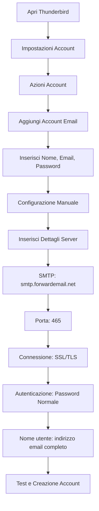

# Esempi di Integrazione SMTP {#smtp-integration-examples}


## Indice {#table-of-contents}

* [Prefazione](#foreword)
* [Come Funziona il Processo SMTP di Forward Email](#how-forward-emails-smtp-processing-works)
  * [Coda Email e Sistema di Ritentativo](#email-queue-and-retry-system)
  * [A Prova di Principiante per Affidabilità](#dummy-proofed-for-reliability)
* [Integrazione Node.js](#nodejs-integration)
  * [Uso di Nodemailer](#using-nodemailer)
  * [Uso di Express.js](#using-expressjs)
* [Integrazione Python](#python-integration)
  * [Uso di smtplib](#using-smtplib)
  * [Uso di Django](#using-django)
* [Integrazione PHP](#php-integration)
  * [Uso di PHPMailer](#using-phpmailer)
  * [Uso di Laravel](#using-laravel)
* [Integrazione Ruby](#ruby-integration)
  * [Uso della Gem Ruby Mail](#using-ruby-mail-gem)
* [Integrazione Java](#java-integration)
  * [Uso di JavaMail API](#using-javamail-api)
* [Configurazione Client Email](#email-client-configuration)
  * [Thunderbird](#thunderbird)
  * [Apple Mail](#apple-mail)
  * [Gmail (Invia Mail Come)](#gmail-send-mail-as)
* [Risoluzione Problemi](#troubleshooting)
  * [Problemi Comuni e Soluzioni](#common-issues-and-solutions)
  * [Ottenere Aiuto](#getting-help)
* [Risorse Aggiuntive](#additional-resources)
* [Conclusione](#conclusion)


## Prefazione {#foreword}

Questa guida fornisce esempi dettagliati su come integrare il servizio SMTP di Forward Email utilizzando vari linguaggi di programmazione, framework e client email. Il nostro servizio SMTP è progettato per essere affidabile, sicuro e facile da integrare con le tue applicazioni esistenti.


## Come Funziona il Processo SMTP di Forward Email {#how-forward-emails-smtp-processing-works}

Prima di entrare negli esempi di integrazione, è importante capire come il nostro servizio SMTP elabora le email:

### Coda Email e Sistema di Ritentativo {#email-queue-and-retry-system}

Quando invii un'email tramite SMTP ai nostri server:

1. **Elaborazione Iniziale**: L'email viene validata, scansionata per malware e controllata contro i filtri antispam
2. **Coda Intelligente**: Le email vengono inserite in un sistema di coda sofisticato per la consegna
3. **Meccanismo Intelligente di Ritentativo**: Se la consegna fallisce temporaneamente, il nostro sistema:
   * Analizza la risposta di errore usando la nostra funzione `getBounceInfo`
   * Determina se il problema è temporaneo (es. "riprovare più tardi", "temporaneamente differito") o permanente (es. "utente sconosciuto")
   * Per problemi temporanei, segna l'email per un ritentativo
   * Per problemi permanenti, genera una notifica di rimbalzo
4. **Periodo di Ritentativo di 5 Giorni**: Ritentiamo la consegna fino a 5 giorni (simile agli standard del settore come Postfix), dando tempo ai problemi temporanei di risolversi
5. **Notifiche di Stato della Consegna**: I mittenti ricevono notifiche sullo stato delle loro email (consegnate, ritardate o rimbalzate)

> \[!NOTE]
> Dopo la consegna avvenuta con successo, il contenuto delle email SMTP in uscita viene oscurato dopo un periodo di conservazione configurabile (default 30 giorni) per sicurezza e privacy. Rimane solo un messaggio segnaposto che indica la consegna avvenuta con successo.

### A Prova di Principiante per Affidabilità {#dummy-proofed-for-reliability}

Il nostro sistema è progettato per gestire vari casi limite:

* Se viene rilevata una blocklist, l'email verrà automaticamente ritentata
* Se si verificano problemi di rete, la consegna verrà riprovata
* Se la casella del destinatario è piena, il sistema ritenterà più tardi
* Se il server ricevente è temporaneamente non disponibile, continueremo a provare

Questo approccio migliora significativamente i tassi di consegna mantenendo privacy e sicurezza.


## Integrazione Node.js {#nodejs-integration}

### Uso di Nodemailer {#using-nodemailer}

[Nodemailer](https://nodemailer.com/) è un modulo popolare per inviare email da applicazioni Node.js.

```javascript
const nodemailer = require('nodemailer');

// Create a transporter object
const transporter = nodemailer.createTransport({
  host: 'smtp.forwardemail.net',
  port: 465,
  secure: true, // Use TLS
  auth: {
    user: 'your-username@your-domain.com',
    pass: 'your-password'
  }
});

// Send mail with defined transport object
async function sendEmail() {
  try {
    const info = await transporter.sendMail({
      from: '"Your Name" <your-username@your-domain.com>',
      to: 'recipient@example.com',
      subject: 'Hello from Forward Email',
      text: 'Hello world! This is a test email sent using Nodemailer and Forward Email SMTP.',
      html: '<b>Hello world!</b> This is a test email sent using Nodemailer and Forward Email SMTP.'
    });

    console.log('Message sent: %s', info.messageId);
  } catch (error) {
    console.error('Error sending email:', error);
  }
}

sendEmail();
```
### Usare Express.js {#using-expressjs}

Ecco come integrare Forward Email SMTP con un'applicazione Express.js:

```javascript
const express = require('express');
const nodemailer = require('nodemailer');
const app = express();
const port = 3000;

app.use(express.json());

// Configura il trasportatore email
const transporter = nodemailer.createTransport({
  host: 'smtp.forwardemail.net',
  port: 465,
  secure: true,
  auth: {
    user: 'your-username@your-domain.com',
    pass: 'your-password'
  }
});

// Endpoint API per inviare email
app.post('/send-email', async (req, res) => {
  const { to, subject, text, html } = req.body;

  try {
    const info = await transporter.sendMail({
      from: '"Your App" <your-username@your-domain.com>',
      to,
      subject,
      text,
      html
    });

    res.status(200).json({
      success: true,
      messageId: info.messageId
    });
  } catch (error) {
    console.error('Errore nell\'invio dell\'email:', error);
    res.status(500).json({
      success: false,
      error: error.message
    });
  }
});

app.listen(port, () => {
  console.log(`Server in esecuzione su http://localhost:${port}`);
});
```


## Integrazione Python {#python-integration}

### Usare smtplib {#using-smtplib}

```python
import smtplib
from email.mime.text import MIMEText
from email.mime.multipart import MIMEMultipart

# Configurazione email
sender_email = "your-username@your-domain.com"
receiver_email = "recipient@example.com"
password = "your-password"

# Crea il messaggio
message = MIMEMultipart("alternative")
message["Subject"] = "Ciao da Forward Email"
message["From"] = sender_email
message["To"] = receiver_email

# Crea la versione in testo semplice e HTML del messaggio
text = "Hello world! This is a test email sent using Python and Forward Email SMTP."
html = "<html><body><b>Hello world!</b> This is a test email sent using Python and Forward Email SMTP.</body></html>"

# Trasforma questi in oggetti MIMEText plain/html
part1 = MIMEText(text, "plain")
part2 = MIMEText(html, "html")

# Aggiungi le parti HTML/plain-text al messaggio MIMEMultipart
message.attach(part1)
message.attach(part2)

# Invia email
try:
    server = smtplib.SMTP_SSL("smtp.forwardemail.net", 465)
    server.login(sender_email, password)
    server.sendmail(sender_email, receiver_email, message.as_string())
    server.quit()
    print("Email inviata con successo!")
except Exception as e:
    print(f"Errore nell'invio dell'email: {e}")
```

### Usare Django {#using-django}

Per le applicazioni Django, aggiungi quanto segue al tuo `settings.py`:

```python
# Impostazioni email
EMAIL_BACKEND = 'django.core.mail.backends.smtp.EmailBackend'
EMAIL_HOST = 'smtp.forwardemail.net'
EMAIL_PORT = 465
EMAIL_USE_SSL = True
EMAIL_HOST_USER = 'your-username@your-domain.com'
EMAIL_HOST_PASSWORD = 'your-password'
DEFAULT_FROM_EMAIL = 'your-username@your-domain.com'
```

Poi invia email nelle tue views:

```python
from django.core.mail import send_mail

def send_email_view(request):
    send_mail(
        'Oggetto qui',
        'Ecco il messaggio.',
        'from@your-domain.com',
        ['to@example.com'],
        fail_silently=False,
        html_message='<b>Ecco il messaggio HTML.</b>'
    )
    return HttpResponse('Email inviata!')
```


## Integrazione PHP {#php-integration}

### Usare PHPMailer {#using-phpmailer}

```php
<?php
use PHPMailer\PHPMailer\PHPMailer;
use PHPMailer\PHPMailer\Exception;

require 'vendor/autoload.php';

$mail = new PHPMailer(true);

try {
    // Impostazioni server
    $mail->isSMTP();
    $mail->Host       = 'smtp.forwardemail.net';
    $mail->SMTPAuth   = true;
    $mail->Username   = 'your-username@your-domain.com';
    $mail->Password   = 'your-password';
    $mail->SMTPSecure = PHPMailer::ENCRYPTION_SMTPS;
    $mail->Port       = 465;

    // Destinatari
    $mail->setFrom('your-username@your-domain.com', 'Your Name');
    $mail->addAddress('recipient@example.com', 'Recipient Name');
    $mail->addReplyTo('your-username@your-domain.com', 'Your Name');

    // Contenuto
    $mail->isHTML(true);
    $mail->Subject = 'Ciao da Forward Email';
    $mail->Body    = '<b>Hello world!</b> This is a test email sent using PHPMailer and Forward Email SMTP.';
    $mail->AltBody = 'Hello world! This is a test email sent using PHPMailer and Forward Email SMTP.';

    $mail->send();
    echo 'Messaggio inviato';
} catch (Exception $e) {
    echo "Il messaggio non può essere inviato. Errore Mailer: {$mail->ErrorInfo}";
}
```
### Utilizzo di Laravel {#using-laravel}

Per le applicazioni Laravel, aggiorna il file `.env`:

```sh
MAIL_MAILER=smtp
MAIL_HOST=smtp.forwardemail.net
MAIL_PORT=465
MAIL_USERNAME=your-username@your-domain.com
MAIL_PASSWORD=your-password
MAIL_ENCRYPTION=ssl
MAIL_FROM_ADDRESS=your-username@your-domain.com
MAIL_FROM_NAME="${APP_NAME}"
```

Quindi invia email usando la facciata Mail di Laravel:

```php
<?php

namespace App\Http\Controllers;

use Illuminate\Http\Request;
use Illuminate\Support\Facades\Mail;
use App\Mail\WelcomeEmail;

class EmailController extends Controller
{
    public function sendEmail()
    {
        Mail::to('recipient@example.com')->send(new WelcomeEmail());

        return 'Email inviata con successo!';
    }
}
```


## Integrazione Ruby {#ruby-integration}

### Utilizzo della gemma Ruby Mail {#using-ruby-mail-gem}

```ruby
require 'mail'

Mail.defaults do
  delivery_method :smtp, {
    address: 'smtp.forwardemail.net',
    port: 465,
    domain: 'your-domain.com',
    user_name: 'your-username@your-domain.com',
    password: 'your-password',
    authentication: 'plain',
    enable_starttls_auto: true,
    ssl: true
  }
end

mail = Mail.new do
  from     'your-username@your-domain.com'
  to       'recipient@example.com'
  subject  'Ciao da Forward Email'

  text_part do
    body 'Ciao mondo! Questa è una email di prova inviata usando Ruby Mail e Forward Email SMTP.'
  end

  html_part do
    content_type 'text/html; charset=UTF-8'
    body '<b>Ciao mondo!</b> Questa è una email di prova inviata usando Ruby Mail e Forward Email SMTP.'
  end
end

mail.deliver!
puts "Email inviata con successo!"
```


## Integrazione Java {#java-integration}

### Utilizzo della JavaMail API {#using-javamail-api}

```java
import java.util.Properties;
import javax.mail.*;
import javax.mail.internet.*;

public class SendEmail {
    public static void main(String[] args) {
        // Email e password del mittente
        final String username = "your-username@your-domain.com";
        final String password = "your-password";

        // Proprietà del server SMTP
        Properties props = new Properties();
        props.put("mail.smtp.auth", "true");
        props.put("mail.smtp.starttls.enable", "true");
        props.put("mail.smtp.host", "smtp.forwardemail.net");
        props.put("mail.smtp.port", "465");
        props.put("mail.smtp.socketFactory.port", "465");
        props.put("mail.smtp.socketFactory.class", "javax.net.ssl.SSLSocketFactory");

        // Crea sessione con autenticatore
        Session session = Session.getInstance(props,
            new javax.mail.Authenticator() {
                protected PasswordAuthentication getPasswordAuthentication() {
                    return new PasswordAuthentication(username, password);
                }
            });

        try {
            // Crea messaggio
            Message message = new MimeMessage(session);
            message.setFrom(new InternetAddress(username));
            message.setRecipients(Message.RecipientType.TO, InternetAddress.parse("recipient@example.com"));
            message.setSubject("Ciao da Forward Email");

            // Crea messaggio multipart
            Multipart multipart = new MimeMultipart("alternative");

            // Parte testo
            BodyPart textPart = new MimeBodyPart();
            textPart.setText("Ciao mondo! Questa è una email di prova inviata usando JavaMail e Forward Email SMTP.");

            // Parte HTML
            BodyPart htmlPart = new MimeBodyPart();
            htmlPart.setContent("<b>Ciao mondo!</b> Questa è una email di prova inviata usando JavaMail e Forward Email SMTP.", "text/html");

            // Aggiungi parti al multipart
            multipart.addBodyPart(textPart);
            multipart.addBodyPart(htmlPart);

            // Imposta contenuto
            message.setContent(multipart);

            // Invia messaggio
            Transport.send(message);

            System.out.println("Email inviata con successo!");

        } catch (MessagingException e) {
            throw new RuntimeException(e);
        }
    }
}
```


## Configurazione Client Email {#email-client-configuration}

### Thunderbird {#thunderbird}


```mermaid
flowchart TD
    A[Apri Thunderbird] --> B[Impostazioni Account]
    B --> C[Azioni Account]
    C --> D[Aggiungi Account Email]
    D --> E[Inserisci Nome, Email, Password]
    E --> F[Configurazione Manuale]
    F --> G[Inserisci Dettagli Server]
    G --> H[SMTP: smtp.forwardemail.net]
    H --> I[Porta: 465]
    I --> J[Connessione: SSL/TLS]
    J --> K[Autenticazione: Password Normale]
    K --> L[Nome utente: indirizzo email completo]
    L --> M[Test e Creazione Account]
```
1. Apri Thunderbird e vai su Impostazioni Account  
2. Clicca su "Azioni account" e seleziona "Aggiungi account di posta"  
3. Inserisci il tuo nome, indirizzo email e password  
4. Clicca su "Configurazione manuale" e inserisci i seguenti dettagli:  
   * Server in arrivo:  
     * IMAP: imap.forwardemail.net, Porta: 993, SSL/TLS  
     * POP3: pop3.forwardemail.net, Porta: 995, SSL/TLS  
   * Server in uscita (SMTP): smtp.forwardemail.net, Porta: 465, SSL/TLS  
   * Autenticazione: Password normale  
   * Nome utente: il tuo indirizzo email completo  
5. Clicca su "Test" e poi su "Fine"  

### Apple Mail {#apple-mail}

1. Apri Mail e vai su Mail > Preferenze > Account  
2. Clicca sul pulsante "+" per aggiungere un nuovo account  
3. Seleziona "Altro account di posta" e clicca su "Continua"  
4. Inserisci il tuo nome, indirizzo email e password, quindi clicca su "Accedi"  
5. Quando la configurazione automatica fallisce, inserisci i seguenti dettagli:  
   * Server posta in arrivo: imap.forwardemail.net (o pop3.forwardemail.net per POP3)  
   * Server posta in uscita: smtp.forwardemail.net  
   * Nome utente: il tuo indirizzo email completo  
   * Password: la tua password  
6. Clicca su "Accedi" per completare la configurazione  

### Gmail (Invia posta come) {#gmail-send-mail-as}

1. Apri Gmail e vai su Impostazioni > Account e importazione  
2. Sotto "Invia messaggio come", clicca su "Aggiungi un altro indirizzo email"  
3. Inserisci il tuo nome e indirizzo email, quindi clicca su "Passaggio successivo"  
4. Inserisci i seguenti dettagli del server SMTP:  
   * Server SMTP: smtp.forwardemail.net  
   * Porta: 465  
   * Nome utente: il tuo indirizzo email completo  
   * Password: la tua password  
   * Seleziona "Connessione protetta usando SSL"  
5. Clicca su "Aggiungi account" e verifica il tuo indirizzo email  

## Risoluzione dei problemi {#troubleshooting}

### Problemi comuni e soluzioni {#common-issues-and-solutions}

1. **Autenticazione fallita**  
   * Verifica il tuo nome utente (indirizzo email completo) e la password  
   * Assicurati di usare la porta corretta (465 per SSL/TLS)  
   * Controlla che il tuo account abbia l’accesso SMTP abilitato  

2. **Timeout di connessione**  
   * Controlla la tua connessione internet  
   * Verifica che le impostazioni del firewall non blocchino il traffico SMTP  
   * Prova a usare la porta 465 con SSL/TLS (consigliato) o la porta 587 con STARTTLS  

3. **Messaggio rifiutato**  
   * Assicurati che l’indirizzo "Da" corrisponda alla tua email autenticata  
   * Controlla se il tuo IP è in blacklist  
   * Verifica che il contenuto del messaggio non attivi filtri antispam  

4. **Errori TLS/SSL**  
   * Aggiorna la tua applicazione/libreria per supportare versioni TLS moderne  
   * Assicurati che i certificati CA del sistema siano aggiornati  
   * Prova TLS esplicito invece di TLS implicito  

### Ottenere aiuto {#getting-help}

Se riscontri problemi non trattati qui, per favore:  

1. Controlla la nostra [pagina FAQ](/faq) per domande comuni  
2. Consulta il nostro [post sul blog sulla consegna email](/blog/docs/best-email-forwarding-service) per informazioni dettagliate  
3. Contatta il nostro team di supporto a <support@forwardemail.net>  

## Risorse aggiuntive {#additional-resources}

* [Documentazione Forward Email](/docs)  
* [Limiti e configurazione del server SMTP](/faq#what-are-your-outbound-smtp-limits)  
* [Guida alle migliori pratiche per le email](/blog/docs/best-email-forwarding-service)  
* [Pratiche di sicurezza](/security)  

## Conclusione {#conclusion}

Il servizio SMTP di Forward Email offre un modo affidabile, sicuro e attento alla privacy per inviare email dalle tue applicazioni e client di posta. Con il nostro sistema intelligente di coda, il meccanismo di ritentativo di 5 giorni e le notifiche complete sullo stato di consegna, puoi essere sicuro che le tue email raggiungeranno la destinazione.  

Per casi d’uso più avanzati o integrazioni personalizzate, contatta il nostro team di supporto.
