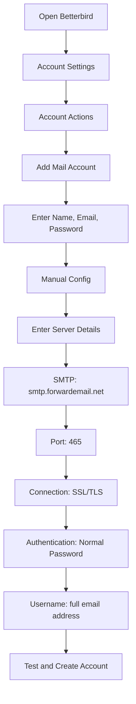

# SMTP統合例 {#smtp-integration-examples}

## 目次 {#table-of-contents}

* [序文](#foreword)
* [Forward EmailのSMTP処理の仕組み](#how-forward-emails-smtp-processing-works)
  * [メールキューと再試行システム](#email-queue-and-retry-system)
  * [信頼性のためにダミー対策済み](#dummy-proofed-for-reliability)
* [Node.js 統合](#nodejs-integration)
  * [Nodemailerの使用](#using-nodemailer)
  * [Express.jsの使用](#using-expressjs)
* [Python統合](#python-integration)
  * [smtplibの使用](#using-smtplib)
  * [Djangoの使用](#using-django)
* [PHP統合](#php-integration)
  * [PHPMailerの使用](#using-phpmailer)
  * [Laravelの使用](#using-laravel)
* [Ruby統合](#ruby-integration)
  * [Ruby Mail Gemの使用](#using-ruby-mail-gem)
* [Java統合](#java-integration)
  * [Java メール API の使用](#using-javamail-api)
* [電子メールクライアントの設定](#email-client-configuration)
  * [サンダーバード](#betterbird)
  * [アップルメール](#apple-mail)
  * [Gmail（送信者名）](#gmail-send-mail-as)
* [トラブルシューティング](#troubleshooting)
  * [よくある問題と解決策](#common-issues-and-solutions)
  * [ヘルプの取得](#getting-help)
* [追加リソース](#additional-resources)
* [結論](#conclusion)

## 序文 {#foreword}

このガイドでは、様々なプログラミング言語、フレームワーク、メールクライアントを用いてForward EmailのSMTPサービスと統合する方法を、詳細な例を用いて解説します。Forward EmailのSMTPサービスは、信頼性とセキュリティに優れ、既存のアプリケーションとの統合が容易なように設計されています。

## 転送メールのSMTP処理の仕組み {#how-forward-emails-smtp-processing-works}

統合例に進む前に、SMTP サービスが電子メールを処理する方法を理解することが重要です。

### メールキューと再試行システム {#email-queue-and-retry-system}

SMTP 経由で当社のサーバーに電子メールを送信すると、次のようになります。

1. **初期処理**: メールは検証され、マルウェアスキャンとスパムフィルターによるチェックが行われます。
2. **スマートキューイング**: メールは配信のために高度なキューシステムに配置されます。
3. **インテリジェントな再試行メカニズム**: 配信が一時的に失敗した場合、システムは以下の処理を行います。
* `getBounceInfo`関数を使用してエラー応答を分析します。
* 問題が一時的なものか（例: 「後でもう一度お試しください」、「一時的に延期」）永続的なものか（例: 「ユーザー不明」）を判断します。
* 一時的な問題の場合は、メールを再試行対象としてマークします。
* 永続的な問題の場合は、バウンス通知を生成します。
4. **5日間の再試行期間**: 一時的な問題が解決するまで、最大5日間（Postfixなどの業界標準に類似）配信を再試行します。
5. **配信状況通知**: 送信者はメールのステータス（配信済み、遅延、バウンス）に関する通知を受け取ります。

> \[!NOTE]
> 配信に成功した後、送信SMTPメールの内容は、セキュリティとプライバシー保護のため、設定可能な保存期間（デフォルトは30日間）後に編集されます。配信に成功したことを示すプレースホルダメッセージのみが残ります。

### 信頼性のためにダミー対策済み {#dummy-proofed-for-reliability}

当社のシステムは、さまざまなエッジケースを処理できるように設計されています。

* ブロックリストが検出された場合、メールは自動的に再試行されます
* ネットワークに問題が発生した場合、配信が再試行されます
* 受信者のメールボックスがいっぱいの場合、システムは後で再試行します
* 受信サーバーが一時的に利用できない場合、再試行を継続します

このアプローチにより、プライバシーとセキュリティを維持しながら配信率が大幅に向上します。

## Node.js 統合 {#nodejs-integration}

### Nodemailer の使用 {#using-nodemailer}

[ノードメーラー](https://nodemailer.com/) は、Node.js アプリケーションから電子メールを送信するための一般的なモジュールです。

```javascript
const nodemailer = require('nodemailer');

// Create a transporter object
const transporter = nodemailer.createTransport({
  host: 'smtp.forwardemail.net',
  port: 465,
  secure: true, // Use TLS
  auth: {
    user: 'your-username@your-domain.com',
    pass: 'your-password'
  }
});

// Send mail with defined transport object
async function sendEmail() {
  try {
    const info = await transporter.sendMail({
      from: '"Your Name" <your-username@your-domain.com>',
      to: 'recipient@example.com',
      subject: 'Hello from Forward Email',
      text: 'Hello world! This is a test email sent using Nodemailer and Forward Email SMTP.',
      html: '<b>Hello world!</b> This is a test email sent using Nodemailer and Forward Email SMTP.'
    });

    console.log('Message sent: %s', info.messageId);
  } catch (error) {
    console.error('Error sending email:', error);
  }
}

sendEmail();
```

### Express.js の使用 {#using-expressjs}

Forward Email SMTP を Express.js アプリケーションに統合する方法は次のとおりです。

```javascript
const express = require('express');
const nodemailer = require('nodemailer');
const app = express();
const port = 3000;

app.use(express.json());

// Configure email transporter
const transporter = nodemailer.createTransport({
  host: 'smtp.forwardemail.net',
  port: 465,
  secure: true,
  auth: {
    user: 'your-username@your-domain.com',
    pass: 'your-password'
  }
});

// API endpoint for sending emails
app.post('/send-email', async (req, res) => {
  const { to, subject, text, html } = req.body;

  try {
    const info = await transporter.sendMail({
      from: '"Your App" <your-username@your-domain.com>',
      to,
      subject,
      text,
      html
    });

    res.status(200).json({
      success: true,
      messageId: info.messageId
    });
  } catch (error) {
    console.error('Error sending email:', error);
    res.status(500).json({
      success: false,
      error: error.message
    });
  }
});

app.listen(port, () => {
  console.log(`Server running at http://localhost:${port}`);
});
```

## Python統合 {#python-integration}

### smtplib の使用 {#using-smtplib}

```python
import smtplib
from email.mime.text import MIMEText
from email.mime.multipart import MIMEMultipart

# Email configuration
sender_email = "your-username@your-domain.com"
receiver_email = "recipient@example.com"
password = "your-password"

# Create message
message = MIMEMultipart("alternative")
message["Subject"] = "Hello from Forward Email"
message["From"] = sender_email
message["To"] = receiver_email

# Create the plain-text and HTML version of your message
text = "Hello world! This is a test email sent using Python and Forward Email SMTP."
html = "<html><body><b>Hello world!</b> This is a test email sent using Python and Forward Email SMTP.</body></html>"

# Turn these into plain/html MIMEText objects
part1 = MIMEText(text, "plain")
part2 = MIMEText(html, "html")

# Add HTML/plain-text parts to MIMEMultipart message
message.attach(part1)
message.attach(part2)

# Send email
try:
    server = smtplib.SMTP_SSL("smtp.forwardemail.net", 465)
    server.login(sender_email, password)
    server.sendmail(sender_email, receiver_email, message.as_string())
    server.quit()
    print("Email sent successfully!")
except Exception as e:
    print(f"Error sending email: {e}")
```

### Django の使用 {#using-django}

Django アプリケーションの場合は、`settings.py` に以下を追加します。

```python
# Email settings
EMAIL_BACKEND = 'django.core.mail.backends.smtp.EmailBackend'
EMAIL_HOST = 'smtp.forwardemail.net'
EMAIL_PORT = 465
EMAIL_USE_SSL = True
EMAIL_HOST_USER = 'your-username@your-domain.com'
EMAIL_HOST_PASSWORD = 'your-password'
DEFAULT_FROM_EMAIL = 'your-username@your-domain.com'
```

次に、ビュー内でメールを送信します。

```python
from django.core.mail import send_mail

def send_email_view(request):
    send_mail(
        'Subject here',
        'Here is the message.',
        'from@your-domain.com',
        ['to@example.com'],
        fail_silently=False,
        html_message='<b>Here is the HTML message.</b>'
    )
    return HttpResponse('Email sent!')
```

## PHP統合 {#php-integration}

### PHPMailer の使用 {#using-phpmailer}

```php
<?php
use PHPMailer\PHPMailer\PHPMailer;
use PHPMailer\PHPMailer\Exception;

require 'vendor/autoload.php';

$mail = new PHPMailer(true);

try {
    // Server settings
    $mail->isSMTP();
    $mail->Host       = 'smtp.forwardemail.net';
    $mail->SMTPAuth   = true;
    $mail->Username   = 'your-username@your-domain.com';
    $mail->Password   = 'your-password';
    $mail->SMTPSecure = PHPMailer::ENCRYPTION_SMTPS;
    $mail->Port       = 465;

    // Recipients
    $mail->setFrom('your-username@your-domain.com', 'Your Name');
    $mail->addAddress('recipient@example.com', 'Recipient Name');
    $mail->addReplyTo('your-username@your-domain.com', 'Your Name');

    // Content
    $mail->isHTML(true);
    $mail->Subject = 'Hello from Forward Email';
    $mail->Body    = '<b>Hello world!</b> This is a test email sent using PHPMailer and Forward Email SMTP.';
    $mail->AltBody = 'Hello world! This is a test email sent using PHPMailer and Forward Email SMTP.';

    $mail->send();
    echo 'Message has been sent';
} catch (Exception $e) {
    echo "Message could not be sent. Mailer Error: {$mail->ErrorInfo}";
}
```

### Laravel の使用 {#using-laravel}

Laravel アプリケーションの場合は、`.env` ファイルを更新します。

```sh
MAIL_MAILER=smtp
MAIL_HOST=smtp.forwardemail.net
MAIL_PORT=465
MAIL_USERNAME=your-username@your-domain.com
MAIL_PASSWORD=your-password
MAIL_ENCRYPTION=ssl
MAIL_FROM_ADDRESS=your-username@your-domain.com
MAIL_FROM_NAME="${APP_NAME}"
```

次に、Laravel の Mail ファサードを使用してメールを送信します。

```php
<?php

namespace App\Http\Controllers;

use Illuminate\Http\Request;
use Illuminate\Support\Facades\Mail;
use App\Mail\WelcomeEmail;

class EmailController extends Controller
{
    public function sendEmail()
    {
        Mail::to('recipient@example.com')->send(new WelcomeEmail());

        return 'Email sent successfully!';
    }
}
```

## Ruby統合 {#ruby-integration}

### Ruby Mail Gem を使用 {#using-ruby-mail-gem}

```ruby
require 'mail'

Mail.defaults do
  delivery_method :smtp, {
    address: 'smtp.forwardemail.net',
    port: 465,
    domain: 'your-domain.com',
    user_name: 'your-username@your-domain.com',
    password: 'your-password',
    authentication: 'plain',
    enable_starttls_auto: true,
    ssl: true
  }
end

mail = Mail.new do
  from     'your-username@your-domain.com'
  to       'recipient@example.com'
  subject  'Hello from Forward Email'

  text_part do
    body 'Hello world! This is a test email sent using Ruby Mail and Forward Email SMTP.'
  end

  html_part do
    content_type 'text/html; charset=UTF-8'
    body '<b>Hello world!</b> This is a test email sent using Ruby Mail and Forward Email SMTP.'
  end
end

mail.deliver!
puts "Email sent successfully!"
```

## Java統合 {#java-integration}

### JavaMail APIの使用 {#using-javamail-api}

```java
import java.util.Properties;
import javax.mail.*;
import javax.mail.internet.*;

public class SendEmail {
    public static void main(String[] args) {
        // Sender's email and password
        final String username = "your-username@your-domain.com";
        final String password = "your-password";

        // SMTP server properties
        Properties props = new Properties();
        props.put("mail.smtp.auth", "true");
        props.put("mail.smtp.starttls.enable", "true");
        props.put("mail.smtp.host", "smtp.forwardemail.net");
        props.put("mail.smtp.port", "465");
        props.put("mail.smtp.socketFactory.port", "465");
        props.put("mail.smtp.socketFactory.class", "javax.net.ssl.SSLSocketFactory");

        // Create session with authenticator
        Session session = Session.getInstance(props,
            new javax.mail.Authenticator() {
                protected PasswordAuthentication getPasswordAuthentication() {
                    return new PasswordAuthentication(username, password);
                }
            });

        try {
            // Create message
            Message message = new MimeMessage(session);
            message.setFrom(new InternetAddress(username));
            message.setRecipients(Message.RecipientType.TO, InternetAddress.parse("recipient@example.com"));
            message.setSubject("Hello from Forward Email");

            // Create multipart message
            Multipart multipart = new MimeMultipart("alternative");

            // Text part
            BodyPart textPart = new MimeBodyPart();
            textPart.setText("Hello world! This is a test email sent using JavaMail and Forward Email SMTP.");

            // HTML part
            BodyPart htmlPart = new MimeBodyPart();
            htmlPart.setContent("<b>Hello world!</b> This is a test email sent using JavaMail and Forward Email SMTP.", "text/html");

            // Add parts to multipart
            multipart.addBodyPart(textPart);
            multipart.addBodyPart(htmlPart);

            // Set content
            message.setContent(multipart);

            // Send message
            Transport.send(message);

            System.out.println("Email sent successfully!");

        } catch (MessagingException e) {
            throw new RuntimeException(e);
        }
    }
}
```

## メールクライアント構成 {#email-client-configuration}

### サンダーバード {#betterbird}



1. Thunderbirdを開き、「アカウント設定」に移動します。
2. 「アカウント操作」をクリックし、「メールアカウントを追加」を選択します。
3. 名前、メールアドレス、パスワードを入力します。
4. 「手動設定」をクリックし、以下の情報を入力します。
* 受信サーバー：
* IMAP：imap.forwardemail.net、ポート：993、SSL/TLS
* POP3：pop3.forwardemail.net、ポート：995、SSL/TLS
* 送信サーバー（SMTP）：smtp.forwardemail.net、ポート：465、SSL/TLS
* 認証：通常のパスワード
* ユーザー名：メールアドレス全体
5. 「テスト」をクリックし、「完了」をクリックします。

### Appleメール {#apple-mail}

1. メールアプリを開き、「メール」>「環境設定」>「アカウント」に移動します。
2. 「+」ボタンをクリックして新しいアカウントを追加します。
3. 「その他のメールアカウント」を選択し、「続ける」をクリックします。
4. 名前、メールアドレス、パスワードを入力し、「サインイン」をクリックします。
5. 自動セットアップに失敗した場合は、以下の情報を入力します。
* 受信メールサーバー：imap.forwardemail.net（POP3の場合はpop3.forwardemail.net）
* 送信メールサーバー：smtp.forwardemail.net
* ユーザー名：メールアドレス全体
* パスワード：パスワード
6. 「サインイン」をクリックしてセットアップを完了します。

### Gmail（送信者名）{#gmail-send-mail-as}

1. Gmailを開き、「設定」>「アカウントとインポート」に移動します。
2. 「送信元メールアドレス」で「別のメールアドレスを追加」をクリックします。
3. 名前とメールアドレスを入力し、「次のステップ」をクリックします。
4. 以下のSMTPサーバーの詳細を入力します。
* SMTPサーバー: smtp.forwardemail.net
* ポート: 465
* ユーザー名: メールアドレス全体
* パスワード: パスワード
* 「SSLを使用したセキュリティ保護された接続」を選択します。
5. 「アカウントを追加」をクリックし、メールアドレスを確認します。

## トラブルシューティング {#troubleshooting}

### よくある問題と解決策 {#common-issues-and-solutions}

1. **認証に失敗しました**
* ユーザー名（メールアドレス全体）とパスワードを確認してください
* 正しいポート番号（SSL/TLSの場合は465）を使用していることを確認してください
* アカウントでSMTPアクセスが有効になっていることを確認してください

2. **接続タイムアウト**
* インターネット接続を確認してください
* ファイアウォール設定でSMTPトラフィックがブロックされていないことを確認してください
* 別のポート（STARTTLSの場合は587）を使用してみてください

3. **メッセージを拒否しました**
* 送信元アドレスが認証済みのメールアドレスと一致していることを確認してください
* IPアドレスがブラックリストに登録されていないことを確認してください
* メッセージの内容がスパムフィルターに引っかかっていないことを確認してください

4. **TLS/SSL エラー**
* アプリケーション/ライブラリを更新して、最新の TLS バージョンをサポートする
* システムの CA 証明書が最新であることを確認する
* 暗黙的 TLS ではなく明示的 TLS を試す

### ヘルプの取得 {#getting-help}

ここで説明されていない問題が発生した場合は、次の手順に従ってください。

1. よくある質問については、[FAQページ](/faq) をご覧ください。
2. 詳細情報については、[メール配信に関するブログ投稿](/blog/docs/best-email-forwarding-service) をご覧ください。
3. サポートチーム（<support@forwardemail.net>）までお問い合わせください。

## 追加リソース {#additional-resources}

* [メール転送ドキュメント](/docs)
* [SMTPサーバーの制限と構成](/faq#what-are-your-outbound-smtp-limits)
* [メールのベストプラクティスガイド](/blog/docs/best-email-forwarding-service)
* [セキュリティプラクティス](/security)

## 結論 {#conclusion}

Forward EmailのSMTPサービスは、アプリケーションやメールクライアントから、信頼性、セキュリティ、プライバシーを重視した方法でメールを送信できます。インテリジェントなキューシステム、5日間の再試行メカニズム、そして包括的な配信状況通知により、メールが確実に宛先に届くことを確信できます。

より高度な使用例やカスタム統合については、サポート チームにお問い合わせください。