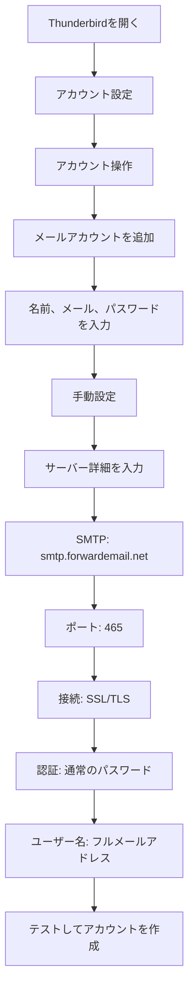

# SMTP 統合例 {#smtp-integration-examples}


## 目次 {#table-of-contents}

* [はじめに](#foreword)
* [Forward Email の SMTP 処理の仕組み](#how-forward-emails-smtp-processing-works)
  * [メールキューと再試行システム](#email-queue-and-retry-system)
  * [信頼性のためのダミープルーフ設計](#dummy-proofed-for-reliability)
* [Node.js 統合](#nodejs-integration)
  * [Nodemailer の使用](#using-nodemailer)
  * [Express.js の使用](#using-expressjs)
* [Python 統合](#python-integration)
  * [smtplib の使用](#using-smtplib)
  * [Django の使用](#using-django)
* [PHP 統合](#php-integration)
  * [PHPMailer の使用](#using-phpmailer)
  * [Laravel の使用](#using-laravel)
* [Ruby 統合](#ruby-integration)
  * [Ruby Mail Gem の使用](#using-ruby-mail-gem)
* [Java 統合](#java-integration)
  * [JavaMail API の使用](#using-javamail-api)
* [メールクライアント設定](#email-client-configuration)
  * [Thunderbird](#thunderbird)
  * [Apple Mail](#apple-mail)
  * [Gmail（送信メールとして設定）](#gmail-send-mail-as)
* [トラブルシューティング](#troubleshooting)
  * [よくある問題と解決策](#common-issues-and-solutions)
  * [サポートを受ける](#getting-help)
* [追加リソース](#additional-resources)
* [まとめ](#conclusion)


## はじめに {#foreword}

このガイドでは、Forward Email の SMTP サービスをさまざまなプログラミング言語、フレームワーク、メールクライアントで統合するための詳細な例を提供します。当社の SMTP サービスは、信頼性が高く、安全で、既存のアプリケーションに簡単に統合できるよう設計されています。


## Forward Email の SMTP 処理の仕組み {#how-forward-emails-smtp-processing-works}

統合例に入る前に、当社の SMTP サービスがメールをどのように処理するかを理解することが重要です。

### メールキューと再試行システム {#email-queue-and-retry-system}

SMTP 経由で当社のサーバーにメールを送信すると：

1. **初期処理**：メールの検証、マルウェアスキャン、スパムフィルターのチェックを行います
2. **スマートキューイング**：メールは配信のための高度なキューシステムに配置されます
3. **インテリジェント再試行メカニズム**：配信が一時的に失敗した場合、当社のシステムは：
   * `getBounceInfo` 関数を使ってエラー応答を解析します
   * 問題が一時的（例：「後で再試行してください」、「一時的に保留」）か恒久的（例：「ユーザー不明」）かを判断します
   * 一時的な問題の場合、メールを再試行対象としてマークします
   * 恒久的な問題の場合、バウンス通知を生成します
4. **5日間の再試行期間**：業界標準（Postfix など）と同様に、最大5日間配信を再試行し、一時的な問題の解決を待ちます
5. **配信状況通知**：送信者にメールの配信状況（配信済み、遅延中、バウンス）を通知します

> \[!NOTE]
> 配信成功後、送信された SMTP メールの内容は設定可能な保持期間（デフォルト30日）経過後にセキュリティとプライバシーのために削除されます。成功配信を示すプレースホルダメッセージのみが残ります。

### 信頼性のためのダミープルーフ設計 {#dummy-proofed-for-reliability}

当社のシステムはさまざまなエッジケースに対応できるよう設計されています：

* ブロックリストが検出された場合、自動的にメールを再試行します
* ネットワーク障害が発生した場合、配信を再試行します
* 受信者のメールボックスが満杯の場合、後で再試行します
* 受信サーバーが一時的に利用不可の場合、継続して再試行します

このアプローチにより、プライバシーとセキュリティを維持しつつ、配信率が大幅に向上します。


## Node.js 統合 {#nodejs-integration}

### Nodemailer の使用 {#using-nodemailer}

[Nodemailer](https://nodemailer.com/) は、Node.js アプリケーションからメールを送信するための人気モジュールです。

```javascript
const nodemailer = require('nodemailer');

// トランスポーターオブジェクトを作成
const transporter = nodemailer.createTransport({
  host: 'smtp.forwardemail.net',
  port: 465,
  secure: true, // TLS を使用
  auth: {
    user: 'your-username@your-domain.com',
    pass: 'your-password'
  }
});

// 定義したトランスポートオブジェクトでメールを送信
async function sendEmail() {
  try {
    const info = await transporter.sendMail({
      from: '"Your Name" <your-username@your-domain.com>',
      to: 'recipient@example.com',
      subject: 'Hello from Forward Email',
      text: 'Hello world! This is a test email sent using Nodemailer and Forward Email SMTP.',
      html: '<b>Hello world!</b> This is a test email sent using Nodemailer and Forward Email SMTP.'
    });

    console.log('Message sent: %s', info.messageId);
  } catch (error) {
    console.error('Error sending email:', error);
  }
}

sendEmail();
```
### Using Express.js {#using-expressjs}

Forward Email SMTPをExpress.jsアプリケーションに統合する方法は以下の通りです：

```javascript
const express = require('express');
const nodemailer = require('nodemailer');
const app = express();
const port = 3000;

app.use(express.json());

// メールトランスポーターの設定
const transporter = nodemailer.createTransport({
  host: 'smtp.forwardemail.net',
  port: 465,
  secure: true,
  auth: {
    user: 'your-username@your-domain.com',
    pass: 'your-password'
  }
});

// メール送信用のAPIエンドポイント
app.post('/send-email', async (req, res) => {
  const { to, subject, text, html } = req.body;

  try {
    const info = await transporter.sendMail({
      from: '"Your App" <your-username@your-domain.com>',
      to,
      subject,
      text,
      html
    });

    res.status(200).json({
      success: true,
      messageId: info.messageId
    });
  } catch (error) {
    console.error('Error sending email:', error);
    res.status(500).json({
      success: false,
      error: error.message
    });
  }
});

app.listen(port, () => {
  console.log(`Server running at http://localhost:${port}`);
});
```


## Python Integration {#python-integration}

### Using smtplib {#using-smtplib}

```python
import smtplib
from email.mime.text import MIMEText
from email.mime.multipart import MIMEMultipart

# メール設定
sender_email = "your-username@your-domain.com"
receiver_email = "recipient@example.com"
password = "your-password"

# メッセージ作成
message = MIMEMultipart("alternative")
message["Subject"] = "Hello from Forward Email"
message["From"] = sender_email
message["To"] = receiver_email

# プレーンテキストとHTMLバージョンのメッセージを作成
text = "Hello world! This is a test email sent using Python and Forward Email SMTP."
html = "<html><body><b>Hello world!</b> This is a test email sent using Python and Forward Email SMTP.</body></html>"

# これらをプレーン/HTMLのMIMETextオブジェクトに変換
part1 = MIMEText(text, "plain")
part2 = MIMEText(html, "html")

# HTML/プレーンテキストのパートをMIMEMultipartメッセージに追加
message.attach(part1)
message.attach(part2)

# メール送信
try:
    server = smtplib.SMTP_SSL("smtp.forwardemail.net", 465)
    server.login(sender_email, password)
    server.sendmail(sender_email, receiver_email, message.as_string())
    server.quit()
    print("Email sent successfully!")
except Exception as e:
    print(f"Error sending email: {e}")
```

### Using Django {#using-django}

Djangoアプリケーションの場合、`settings.py`に以下を追加してください：

```python
# メール設定
EMAIL_BACKEND = 'django.core.mail.backends.smtp.EmailBackend'
EMAIL_HOST = 'smtp.forwardemail.net'
EMAIL_PORT = 465
EMAIL_USE_SSL = True
EMAIL_HOST_USER = 'your-username@your-domain.com'
EMAIL_HOST_PASSWORD = 'your-password'
DEFAULT_FROM_EMAIL = 'your-username@your-domain.com'
```

その後、ビューでメールを送信します：

```python
from django.core.mail import send_mail

def send_email_view(request):
    send_mail(
        'Subject here',
        'Here is the message.',
        'from@your-domain.com',
        ['to@example.com'],
        fail_silently=False,
        html_message='<b>Here is the HTML message.</b>'
    )
    return HttpResponse('Email sent!')
```


## PHP Integration {#php-integration}

### Using PHPMailer {#using-phpmailer}

```php
<?php
use PHPMailer\PHPMailer\PHPMailer;
use PHPMailer\PHPMailer\Exception;

require 'vendor/autoload.php';

$mail = new PHPMailer(true);

try {
    // サーバー設定
    $mail->isSMTP();
    $mail->Host       = 'smtp.forwardemail.net';
    $mail->SMTPAuth   = true;
    $mail->Username   = 'your-username@your-domain.com';
    $mail->Password   = 'your-password';
    $mail->SMTPSecure = PHPMailer::ENCRYPTION_SMTPS;
    $mail->Port       = 465;

    // 送信者・受信者設定
    $mail->setFrom('your-username@your-domain.com', 'Your Name');
    $mail->addAddress('recipient@example.com', 'Recipient Name');
    $mail->addReplyTo('your-username@your-domain.com', 'Your Name');

    // コンテンツ設定
    $mail->isHTML(true);
    $mail->Subject = 'Hello from Forward Email';
    $mail->Body    = '<b>Hello world!</b> This is a test email sent using PHPMailer and Forward Email SMTP.';
    $mail->AltBody = 'Hello world! This is a test email sent using PHPMailer and Forward Email SMTP.';

    $mail->send();
    echo 'Message has been sent';
} catch (Exception $e) {
    echo "Message could not be sent. Mailer Error: {$mail->ErrorInfo}";
}
```
### Laravelの使用 {#using-laravel}

Laravelアプリケーションの場合、`.env`ファイルを更新してください：

```sh
MAIL_MAILER=smtp
MAIL_HOST=smtp.forwardemail.net
MAIL_PORT=465
MAIL_USERNAME=your-username@your-domain.com
MAIL_PASSWORD=your-password
MAIL_ENCRYPTION=ssl
MAIL_FROM_ADDRESS=your-username@your-domain.com
MAIL_FROM_NAME="${APP_NAME}"
```

その後、LaravelのMailファサードを使ってメールを送信します：

```php
<?php

namespace App\Http\Controllers;

use Illuminate\Http\Request;
use Illuminate\Support\Facades\Mail;
use App\Mail\WelcomeEmail;

class EmailController extends Controller
{
    public function sendEmail()
    {
        Mail::to('recipient@example.com')->send(new WelcomeEmail());

        return 'メールが正常に送信されました！';
    }
}
```


## Ruby統合 {#ruby-integration}

### Ruby Mail Gemの使用 {#using-ruby-mail-gem}

```ruby
require 'mail'

Mail.defaults do
  delivery_method :smtp, {
    address: 'smtp.forwardemail.net',
    port: 465,
    domain: 'your-domain.com',
    user_name: 'your-username@your-domain.com',
    password: 'your-password',
    authentication: 'plain',
    enable_starttls_auto: true,
    ssl: true
  }
end

mail = Mail.new do
  from     'your-username@your-domain.com'
  to       'recipient@example.com'
  subject  'Forward Emailからのこんにちは'

  text_part do
    body 'こんにちは！これはRuby MailとForward Email SMTPを使って送信されたテストメールです。'
  end

  html_part do
    content_type 'text/html; charset=UTF-8'
    body '<b>こんにちは！</b> これはRuby MailとForward Email SMTPを使って送信されたテストメールです。'
  end
end

mail.deliver!
puts "メールが正常に送信されました！"
```


## Java統合 {#java-integration}

### JavaMail APIの使用 {#using-javamail-api}

```java
import java.util.Properties;
import javax.mail.*;
import javax.mail.internet.*;

public class SendEmail {
    public static void main(String[] args) {
        // 送信者のメールアドレスとパスワード
        final String username = "your-username@your-domain.com";
        final String password = "your-password";

        // SMTPサーバーのプロパティ
        Properties props = new Properties();
        props.put("mail.smtp.auth", "true");
        props.put("mail.smtp.starttls.enable", "true");
        props.put("mail.smtp.host", "smtp.forwardemail.net");
        props.put("mail.smtp.port", "465");
        props.put("mail.smtp.socketFactory.port", "465");
        props.put("mail.smtp.socketFactory.class", "javax.net.ssl.SSLSocketFactory");

        // 認証付きセッションの作成
        Session session = Session.getInstance(props,
            new javax.mail.Authenticator() {
                protected PasswordAuthentication getPasswordAuthentication() {
                    return new PasswordAuthentication(username, password);
                }
            });

        try {
            // メッセージの作成
            Message message = new MimeMessage(session);
            message.setFrom(new InternetAddress(username));
            message.setRecipients(Message.RecipientType.TO, InternetAddress.parse("recipient@example.com"));
            message.setSubject("Forward Emailからのこんにちは");

            // マルチパートメッセージの作成
            Multipart multipart = new MimeMultipart("alternative");

            // テキストパート
            BodyPart textPart = new MimeBodyPart();
            textPart.setText("こんにちは！これはJavaMailとForward Email SMTPを使って送信されたテストメールです。");

            // HTMLパート
            BodyPart htmlPart = new MimeBodyPart();
            htmlPart.setContent("<b>こんにちは！</b> これはJavaMailとForward Email SMTPを使って送信されたテストメールです。", "text/html");

            // パーツをマルチパートに追加
            multipart.addBodyPart(textPart);
            multipart.addBodyPart(htmlPart);

            // コンテンツを設定
            message.setContent(multipart);

            // メッセージを送信
            Transport.send(message);

            System.out.println("メールが正常に送信されました！");

        } catch (MessagingException e) {
            throw new RuntimeException(e);
        }
    }
}
```


## メールクライアントの設定 {#email-client-configuration}

### Thunderbird {#thunderbird}


```mermaid
flowchart TD
    A[Thunderbirdを開く] --> B[アカウント設定]
    B --> C[アカウント操作]
    C --> D[メールアカウントを追加]
    D --> E[名前、メール、パスワードを入力]
    E --> F[手動設定]
    F --> G[サーバー詳細を入力]
    G --> H[SMTP: smtp.forwardemail.net]
    H --> I[ポート: 465]
    I --> J[接続: SSL/TLS]
    J --> K[認証: 通常のパスワード]
    K --> L[ユーザー名: フルメールアドレス]
    L --> M[テストしてアカウントを作成]
```
1. Thunderbirdを開き、アカウント設定に移動します
2. 「アカウント操作」をクリックし、「メールアカウントを追加」を選択します
3. 名前、メールアドレス、パスワードを入力します
4. 「手動設定」をクリックし、以下の詳細を入力します：
   * 受信サーバー：
     * IMAP: imap.forwardemail.net、ポート: 993、SSL/TLS
     * POP3: pop3.forwardemail.net、ポート: 995、SSL/TLS
   * 送信サーバー（SMTP）：smtp.forwardemail.net、ポート: 465、SSL/TLS
   * 認証：通常のパスワード
   * ユーザー名：あなたのフルメールアドレス
5. 「テスト」をクリックし、「完了」をクリックします

### Apple Mail {#apple-mail}

1. Mailを開き、Mail > 環境設定 > アカウントに移動します
2. 「＋」ボタンをクリックして新しいアカウントを追加します
3. 「その他のメールアカウント」を選択し、「続ける」をクリックします
4. 名前、メールアドレス、パスワードを入力し、「サインイン」をクリックします
5. 自動設定が失敗した場合、以下の詳細を入力します：
   * 受信メールサーバー：imap.forwardemail.net（POP3の場合はpop3.forwardemail.net）
   * 送信メールサーバー：smtp.forwardemail.net
   * ユーザー名：あなたのフルメールアドレス
   * パスワード：あなたのパスワード
6. 「サインイン」をクリックして設定を完了します

### Gmail (送信メールとして) {#gmail-send-mail-as}

1. Gmailを開き、設定 > アカウントとインポートに移動します
2. 「送信メールとして」の下で「別のメールアドレスを追加」をクリックします
3. 名前とメールアドレスを入力し、「次のステップ」をクリックします
4. 以下のSMTPサーバーの詳細を入力します：
   * SMTPサーバー：smtp.forwardemail.net
   * ポート：465
   * ユーザー名：あなたのフルメールアドレス
   * パスワード：あなたのパスワード
   * 「SSLを使用した安全な接続」を選択
5. 「アカウントを追加」をクリックし、メールアドレスを確認します


## トラブルシューティング {#troubleshooting}

### よくある問題と解決策 {#common-issues-and-solutions}

1. **認証に失敗しました**
   * ユーザー名（フルメールアドレス）とパスワードを確認してください
   * 正しいポート（SSL/TLSの場合は465）を使用しているか確認してください
   * アカウントにSMTPアクセスが有効になっているか確認してください

2. **接続タイムアウト**
   * インターネット接続を確認してください
   * ファイアウォール設定がSMTPトラフィックをブロックしていないか確認してください
   * SSL/TLS推奨のポート465、またはSTARTTLSのポート587を試してください

3. **メッセージが拒否されました**
   * 「送信元」アドレスが認証済みのメールアドレスと一致しているか確認してください
   * IPがブラックリストに登録されていないか確認してください
   * メッセージ内容がスパムフィルターをトリガーしていないか確認してください

4. **TLS/SSLエラー**
   * アプリケーションやライブラリを最新のTLSバージョンに対応するよう更新してください
   * システムのCA証明書が最新であることを確認してください
   * 暗黙的TLSの代わりに明示的TLSを試してください

### ヘルプを得るには {#getting-help}

ここに記載されていない問題が発生した場合は、以下をお試しください：

1. よくある質問は[FAQページ](/faq)をご確認ください
2. 詳細情報は[メール配信に関するブログ記事](/blog/docs/best-email-forwarding-service)をご覧ください
3. サポートチームへは <support@forwardemail.net> までご連絡ください


## 追加リソース {#additional-resources}

* [Forward Email ドキュメント](/docs)
* [SMTPサーバーの制限と設定](/faq#what-are-your-outbound-smtp-limits)
* [メールのベストプラクティスガイド](/blog/docs/best-email-forwarding-service)
* [セキュリティプラクティス](/security)


## 結論 {#conclusion}

Forward EmailのSMTPサービスは、アプリケーションやメールクライアントからメールを送信するための信頼性が高く、安全でプライバシーに配慮した方法を提供します。インテリジェントなキューシステム、5日間の再試行機能、包括的な配信状況通知により、メールが確実に目的地に届くことを保証します。

より高度なユースケースやカスタム統合については、サポートチームまでお問い合わせください。
