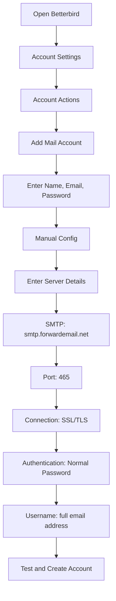

# SMTP 통합 예제 {#smtp-integration-examples}

## 목차 {#table-of-contents}

* [머리말](#foreword)
* [전달 이메일의 SMTP 처리 작동 방식](#how-forward-emails-smtp-processing-works)
  * [이메일 대기열 및 재시도 시스템](#email-queue-and-retry-system)
  * [신뢰성을 위한 더미 방지](#dummy-proofed-for-reliability)
* [Node.js 통합](#nodejs-integration)
  * [Nodemailer 사용하기](#using-nodemailer)
  * [Express.js 사용하기](#using-expressjs)
* [파이썬 통합](#python-integration)
  * [smtplib 사용](#using-smtplib)
  * [Django 사용하기](#using-django)
* [PHP 통합](#php-integration)
  * [PHPMailer 사용하기](#using-phpmailer)
  * [라라벨 사용하기](#using-laravel)
* [루비 통합](#ruby-integration)
  * [Ruby Mail Gem 사용하기](#using-ruby-mail-gem)
* [자바 통합](#java-integration)
  * [Java Mail API 사용](#using-javamail-api)
* [이메일 클라이언트 구성](#email-client-configuration)
  * [천둥새](#betterbird)
  * [애플 메일](#apple-mail)
  * [Gmail(메일 보내기)](#gmail-send-mail-as)
* [문제 해결](#troubleshooting)
  * [일반적인 문제 및 솔루션](#common-issues-and-solutions)
  * [도움 받기](#getting-help)
* [추가 자료](#additional-resources)
* [결론](#conclusion)

## 서문 {#foreword}

이 가이드에서는 다양한 프로그래밍 언어, 프레임워크 및 이메일 클라이언트를 사용하여 Forward Email의 SMTP 서비스와 통합하는 방법에 대한 자세한 예를 제공합니다. 당사의 SMTP 서비스는 안정적이고 안전하며 기존 애플리케이션과 쉽게 통합되도록 설계되었습니다.

## 전달 이메일의 SMTP 처리 작동 방식 {#how-forward-emails-smtp-processing-works}

통합 사례를 살펴보기 전에 SMTP 서비스가 이메일을 처리하는 방식을 이해하는 것이 중요합니다.

### 이메일 대기열 및 재시도 시스템 {#email-queue-and-retry-system}

SMTP를 통해 당사 서버로 이메일을 제출하는 경우:

1. **초기 처리**: 이메일 유효성 검사, 맬웨어 검사, 스팸 필터 검사를 거칩니다.
2. **스마트 큐잉**: 이메일은 정교한 큐 시스템에 배치되어 전송됩니다.
3. **지능형 재시도 메커니즘**: 일시적으로 전송이 실패할 경우, 시스템은 다음을 수행합니다.
* `getBounceInfo` 함수를 사용하여 오류 응답을 분석합니다.
* 문제가 일시적인지(예: "나중에 다시 시도", "일시적으로 지연됨") 또는 영구적인지(예: "사용자 불명") 판단합니다.
* 일시적인 문제의 경우, 이메일을 재시도 대상으로 표시합니다.
* 영구적인 문제의 경우, 반송 알림을 생성합니다.
4. **5일 재시도 기간**: Postfix와 같은 업계 표준과 유사하게 최대 5일 동안 전송을 재시도하여 일시적인 문제가 해결될 수 있도록 합니다.
5. **전송 상태 알림**: 발신자는 이메일 상태(전송됨, 지연됨 또는 반송됨)에 대한 알림을 받습니다.

> \[!NOTE]
> 전송이 완료되면, 보안 및 개인정보 보호를 위해 설정된 보관 기간(기본 30일) 후에 아웃바운드 SMTP 이메일 내용이 삭제됩니다. 전송 성공을 나타내는 플레이스홀더 메시지만 남습니다.

### 신뢰성을 위한 더미 방지 {#dummy-proofed-for-reliability}

본 시스템은 다양한 예외 상황을 처리하도록 설계되었습니다.

* 차단 목록이 감지되면 이메일이 자동으로 다시 시도됩니다.
* 네트워크 문제가 발생하면 전송이 다시 시도됩니다.
* 수신자의 메일함이 가득 찬 경우, 시스템은 나중에 다시 시도합니다.
* 수신 서버를 일시적으로 사용할 수 없는 경우, 계속해서 시도합니다.

이러한 접근 방식은 개인정보 보호와 보안을 유지하면서도 배달률을 크게 향상시킵니다.

## Node.js 통합 {#nodejs-integration}

### Nodemailer 사용 {#using-nodemailer}

[노드메일러](https://nodemailer.com/)은 Node.js 애플리케이션에서 이메일을 보내는 데 널리 사용되는 모듈입니다.

```javascript
const nodemailer = require('nodemailer');

// Create a transporter object
const transporter = nodemailer.createTransport({
  host: 'smtp.forwardemail.net',
  port: 465,
  secure: true, // Use TLS
  auth: {
    user: 'your-username@your-domain.com',
    pass: 'your-password'
  }
});

// Send mail with defined transport object
async function sendEmail() {
  try {
    const info = await transporter.sendMail({
      from: '"Your Name" <your-username@your-domain.com>',
      to: 'recipient@example.com',
      subject: 'Hello from Forward Email',
      text: 'Hello world! This is a test email sent using Nodemailer and Forward Email SMTP.',
      html: '<b>Hello world!</b> This is a test email sent using Nodemailer and Forward Email SMTP.'
    });

    console.log('Message sent: %s', info.messageId);
  } catch (error) {
    console.error('Error sending email:', error);
  }
}

sendEmail();
```

### Express.js 사용 {#using-expressjs}

Express.js 애플리케이션과 Forward Email SMTP를 통합하는 방법은 다음과 같습니다.

```javascript
const express = require('express');
const nodemailer = require('nodemailer');
const app = express();
const port = 3000;

app.use(express.json());

// Configure email transporter
const transporter = nodemailer.createTransport({
  host: 'smtp.forwardemail.net',
  port: 465,
  secure: true,
  auth: {
    user: 'your-username@your-domain.com',
    pass: 'your-password'
  }
});

// API endpoint for sending emails
app.post('/send-email', async (req, res) => {
  const { to, subject, text, html } = req.body;

  try {
    const info = await transporter.sendMail({
      from: '"Your App" <your-username@your-domain.com>',
      to,
      subject,
      text,
      html
    });

    res.status(200).json({
      success: true,
      messageId: info.messageId
    });
  } catch (error) {
    console.error('Error sending email:', error);
    res.status(500).json({
      success: false,
      error: error.message
    });
  }
});

app.listen(port, () => {
  console.log(`Server running at http://localhost:${port}`);
});
```

## Python 통합 {#python-integration}

### smtplib 사용 {#using-smtplib}

```python
import smtplib
from email.mime.text import MIMEText
from email.mime.multipart import MIMEMultipart

# Email configuration
sender_email = "your-username@your-domain.com"
receiver_email = "recipient@example.com"
password = "your-password"

# Create message
message = MIMEMultipart("alternative")
message["Subject"] = "Hello from Forward Email"
message["From"] = sender_email
message["To"] = receiver_email

# Create the plain-text and HTML version of your message
text = "Hello world! This is a test email sent using Python and Forward Email SMTP."
html = "<html><body><b>Hello world!</b> This is a test email sent using Python and Forward Email SMTP.</body></html>"

# Turn these into plain/html MIMEText objects
part1 = MIMEText(text, "plain")
part2 = MIMEText(html, "html")

# Add HTML/plain-text parts to MIMEMultipart message
message.attach(part1)
message.attach(part2)

# Send email
try:
    server = smtplib.SMTP_SSL("smtp.forwardemail.net", 465)
    server.login(sender_email, password)
    server.sendmail(sender_email, receiver_email, message.as_string())
    server.quit()
    print("Email sent successfully!")
except Exception as e:
    print(f"Error sending email: {e}")
```

### Django 사용 {#using-django}

Django 애플리케이션의 경우 `settings.py`에 다음을 추가하세요.

```python
# Email settings
EMAIL_BACKEND = 'django.core.mail.backends.smtp.EmailBackend'
EMAIL_HOST = 'smtp.forwardemail.net'
EMAIL_PORT = 465
EMAIL_USE_SSL = True
EMAIL_HOST_USER = 'your-username@your-domain.com'
EMAIL_HOST_PASSWORD = 'your-password'
DEFAULT_FROM_EMAIL = 'your-username@your-domain.com'
```

그런 다음 귀하의 견해에 따라 이메일을 보내세요.

```python
from django.core.mail import send_mail

def send_email_view(request):
    send_mail(
        'Subject here',
        'Here is the message.',
        'from@your-domain.com',
        ['to@example.com'],
        fail_silently=False,
        html_message='<b>Here is the HTML message.</b>'
    )
    return HttpResponse('Email sent!')
```

## PHP 통합 {#php-integration}

### PHPMailer 사용 {#using-phpmailer}

```php
<?php
use PHPMailer\PHPMailer\PHPMailer;
use PHPMailer\PHPMailer\Exception;

require 'vendor/autoload.php';

$mail = new PHPMailer(true);

try {
    // Server settings
    $mail->isSMTP();
    $mail->Host       = 'smtp.forwardemail.net';
    $mail->SMTPAuth   = true;
    $mail->Username   = 'your-username@your-domain.com';
    $mail->Password   = 'your-password';
    $mail->SMTPSecure = PHPMailer::ENCRYPTION_SMTPS;
    $mail->Port       = 465;

    // Recipients
    $mail->setFrom('your-username@your-domain.com', 'Your Name');
    $mail->addAddress('recipient@example.com', 'Recipient Name');
    $mail->addReplyTo('your-username@your-domain.com', 'Your Name');

    // Content
    $mail->isHTML(true);
    $mail->Subject = 'Hello from Forward Email';
    $mail->Body    = '<b>Hello world!</b> This is a test email sent using PHPMailer and Forward Email SMTP.';
    $mail->AltBody = 'Hello world! This is a test email sent using PHPMailer and Forward Email SMTP.';

    $mail->send();
    echo 'Message has been sent';
} catch (Exception $e) {
    echo "Message could not be sent. Mailer Error: {$mail->ErrorInfo}";
}
```

### Laravel 사용 {#using-laravel}

Laravel 애플리케이션의 경우 `.env` 파일을 업데이트하세요.

```sh
MAIL_MAILER=smtp
MAIL_HOST=smtp.forwardemail.net
MAIL_PORT=465
MAIL_USERNAME=your-username@your-domain.com
MAIL_PASSWORD=your-password
MAIL_ENCRYPTION=ssl
MAIL_FROM_ADDRESS=your-username@your-domain.com
MAIL_FROM_NAME="${APP_NAME}"
```

그런 다음 Laravel의 Mail façade를 사용하여 이메일을 보내세요.

```php
<?php

namespace App\Http\Controllers;

use Illuminate\Http\Request;
use Illuminate\Support\Facades\Mail;
use App\Mail\WelcomeEmail;

class EmailController extends Controller
{
    public function sendEmail()
    {
        Mail::to('recipient@example.com')->send(new WelcomeEmail());

        return 'Email sent successfully!';
    }
}
```

## 루비 통합 {#ruby-integration}

### Ruby Mail Gem 사용 {#using-ruby-mail-gem}

```ruby
require 'mail'

Mail.defaults do
  delivery_method :smtp, {
    address: 'smtp.forwardemail.net',
    port: 465,
    domain: 'your-domain.com',
    user_name: 'your-username@your-domain.com',
    password: 'your-password',
    authentication: 'plain',
    enable_starttls_auto: true,
    ssl: true
  }
end

mail = Mail.new do
  from     'your-username@your-domain.com'
  to       'recipient@example.com'
  subject  'Hello from Forward Email'

  text_part do
    body 'Hello world! This is a test email sent using Ruby Mail and Forward Email SMTP.'
  end

  html_part do
    content_type 'text/html; charset=UTF-8'
    body '<b>Hello world!</b> This is a test email sent using Ruby Mail and Forward Email SMTP.'
  end
end

mail.deliver!
puts "Email sent successfully!"
```

## Java 통합 {#java-integration}

### JavaMail API 사용 {#using-javamail-api}

```java
import java.util.Properties;
import javax.mail.*;
import javax.mail.internet.*;

public class SendEmail {
    public static void main(String[] args) {
        // Sender's email and password
        final String username = "your-username@your-domain.com";
        final String password = "your-password";

        // SMTP server properties
        Properties props = new Properties();
        props.put("mail.smtp.auth", "true");
        props.put("mail.smtp.starttls.enable", "true");
        props.put("mail.smtp.host", "smtp.forwardemail.net");
        props.put("mail.smtp.port", "465");
        props.put("mail.smtp.socketFactory.port", "465");
        props.put("mail.smtp.socketFactory.class", "javax.net.ssl.SSLSocketFactory");

        // Create session with authenticator
        Session session = Session.getInstance(props,
            new javax.mail.Authenticator() {
                protected PasswordAuthentication getPasswordAuthentication() {
                    return new PasswordAuthentication(username, password);
                }
            });

        try {
            // Create message
            Message message = new MimeMessage(session);
            message.setFrom(new InternetAddress(username));
            message.setRecipients(Message.RecipientType.TO, InternetAddress.parse("recipient@example.com"));
            message.setSubject("Hello from Forward Email");

            // Create multipart message
            Multipart multipart = new MimeMultipart("alternative");

            // Text part
            BodyPart textPart = new MimeBodyPart();
            textPart.setText("Hello world! This is a test email sent using JavaMail and Forward Email SMTP.");

            // HTML part
            BodyPart htmlPart = new MimeBodyPart();
            htmlPart.setContent("<b>Hello world!</b> This is a test email sent using JavaMail and Forward Email SMTP.", "text/html");

            // Add parts to multipart
            multipart.addBodyPart(textPart);
            multipart.addBodyPart(htmlPart);

            // Set content
            message.setContent(multipart);

            // Send message
            Transport.send(message);

            System.out.println("Email sent successfully!");

        } catch (MessagingException e) {
            throw new RuntimeException(e);
        }
    }
}
```

## 이메일 클라이언트 구성 {#email-client-configuration}

### 썬더버드 {#betterbird}



1. Thunderbird를 열고 계정 설정으로 이동합니다.
2. "계정 작업"을 클릭하고 "메일 계정 추가"를 선택합니다.
3. 이름, 이메일 주소, 비밀번호를 입력합니다.
4. "수동 구성"을 클릭하고 다음 정보를 입력합니다.
* 받는 메일 서버:
* IMAP: imap.forwardemail.net, 포트: 993, SSL/TLS
* POP3: pop3.forwardemail.net, 포트: 995, SSL/TLS
* 보내는 메일 서버(SMTP): smtp.forwardemail.net, 포트: 465, SSL/TLS
* 인증: 일반 비밀번호
* 사용자 이름: 전체 이메일 주소
5. "테스트"를 클릭한 후 "완료"를 클릭합니다.

### Apple 메일 {#apple-mail}

1. 메일 앱을 열고 메일 > 환경설정 > 계정으로 이동합니다.
2. "+" 버튼을 클릭하여 새 계정을 추가합니다.
3. "다른 메일 계정"을 선택하고 "계속"을 클릭합니다.
4. 이름, 이메일 주소, 비밀번호를 입력하고 "로그인"을 클릭합니다.
5. 자동 설정이 실패하면 다음 정보를 입력합니다.
* 받는 메일 서버: imap.forwardemail.net (POP3의 경우 pop3.forwardemail.net)
* 보내는 메일 서버: smtp.forwardemail.net
* 사용자 이름: 전체 이메일 주소
* 비밀번호: 비밀번호
6. "로그인"을 클릭하여 설정을 완료합니다.

### Gmail(메일 보내기) {#gmail-send-mail-as}

1. Gmail을 열고 설정 > 계정 및 가져오기로 이동합니다.
2. "다른 주소에서 메일 보내기"에서 "다른 이메일 주소 추가"를 클릭합니다.
3. 이름과 이메일 주소를 입력하고 "다음 단계"를 클릭합니다.
4. 다음 SMTP 서버 정보를 입력합니다.
* SMTP 서버: smtp.forwardemail.net
* 포트: 465
* 사용자 이름: 전체 이메일 주소
* 비밀번호: 비밀번호
* "SSL을 사용한 보안 연결"을 선택합니다.
5. "계정 추가"를 클릭하고 이메일 주소를 확인합니다.

## 문제 해결 {#troubleshooting}

### 일반적인 문제 및 해결 방법 {#common-issues-and-solutions}

1. **인증 실패**
* 사용자 이름(전체 이메일 주소)과 비밀번호를 확인하세요.
* 올바른 포트(SSL/TLS의 경우 465)를 사용하고 있는지 확인하세요.
* 계정에 SMTP 액세스가 활성화되어 있는지 확인하세요.

2. **연결 시간 초과**
* 인터넷 연결을 확인하세요.
* 방화벽 설정이 SMTP 트래픽을 차단하고 있지 않은지 확인하세요.
* 다른 포트(STARTTLS를 사용하는 587)를 사용해 보세요.

3. **메시지 거부됨**
* "보낸 사람" 주소가 인증된 이메일과 일치하는지 확인하세요.
* IP 주소가 블랙리스트에 등록되어 있는지 확인하세요.
* 메시지 내용이 스팸 필터를 통과하지 않는지 확인하세요.

4. **TLS/SSL 오류**
* 최신 TLS 버전을 지원하도록 애플리케이션/라이브러리를 업데이트하세요.
* 시스템의 CA 인증서가 최신 상태인지 확인하세요.
* 암묵적 TLS 대신 명시적 TLS를 사용해 보세요.

### 도움말 받기 {#getting-help}

여기에 언급되지 않은 문제가 발생하면 다음을 수행하세요.

1. 자주 묻는 질문은 [FAQ 페이지](/faq)에서 확인하세요.
2. 자세한 내용은 [이메일 배달에 대한 블로그 게시물](/blog/docs/best-email-forwarding-service)에서 확인하세요.
3. <support@forwardemail.net>으로 지원팀에 문의하세요.

## 추가 리소스 {#additional-resources}

* [전달 이메일 문서](/docs)
* [SMTP 서버 제한 및 구성](/faq#what-are-your-outbound-smtp-limits)
* [이메일 모범 사례 가이드](/blog/docs/best-email-forwarding-service)
* [보안 관행](/security)

## 결론 {#conclusion}

Forward Email의 SMTP 서비스는 애플리케이션과 이메일 클라이언트에서 이메일을 안전하고 안정적으로 전송하며 개인 정보 보호에 중점을 둔 서비스를 제공합니다. 지능형 대기열 시스템, 5일 재시도 메커니즘, 그리고 포괄적인 전송 상태 알림을 통해 이메일이 목적지에 도착할 것이라는 확신을 가질 수 있습니다.

더욱 고급 사용 사례나 맞춤형 통합이 필요한 경우 당사 지원팀에 문의하세요.