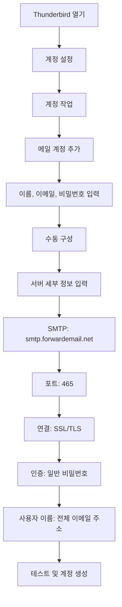

# SMTP 통합 예제 {#smtp-integration-examples}


## 목차 {#table-of-contents}

* [서문](#foreword)
* [Forward Email의 SMTP 처리 방식](#how-forward-emails-smtp-processing-works)
  * [이메일 큐 및 재시도 시스템](#email-queue-and-retry-system)
  * [신뢰성을 위한 더미 방지](#dummy-proofed-for-reliability)
* [Node.js 통합](#nodejs-integration)
  * [Nodemailer 사용하기](#using-nodemailer)
  * [Express.js 사용하기](#using-expressjs)
* [Python 통합](#python-integration)
  * [smtplib 사용하기](#using-smtplib)
  * [Django 사용하기](#using-django)
* [PHP 통합](#php-integration)
  * [PHPMailer 사용하기](#using-phpmailer)
  * [Laravel 사용하기](#using-laravel)
* [Ruby 통합](#ruby-integration)
  * [Ruby Mail Gem 사용하기](#using-ruby-mail-gem)
* [Java 통합](#java-integration)
  * [JavaMail API 사용하기](#using-javamail-api)
* [이메일 클라이언트 설정](#email-client-configuration)
  * [Thunderbird](#thunderbird)
  * [Apple Mail](#apple-mail)
  * [Gmail (보내는 메일 주소 설정)](#gmail-send-mail-as)
* [문제 해결](#troubleshooting)
  * [일반적인 문제 및 해결책](#common-issues-and-solutions)
  * [도움 받기](#getting-help)
* [추가 자료](#additional-resources)
* [결론](#conclusion)


## 서문 {#foreword}

이 가이드는 다양한 프로그래밍 언어, 프레임워크 및 이메일 클라이언트를 사용하여 Forward Email의 SMTP 서비스와 통합하는 방법에 대한 자세한 예제를 제공합니다. 저희 SMTP 서비스는 신뢰성 있고, 안전하며, 기존 애플리케이션과 쉽게 통합할 수 있도록 설계되었습니다.


## Forward Email의 SMTP 처리 방식 {#how-forward-emails-smtp-processing-works}

통합 예제로 들어가기 전에, 저희 SMTP 서비스가 이메일을 어떻게 처리하는지 이해하는 것이 중요합니다:

### 이메일 큐 및 재시도 시스템 {#email-queue-and-retry-system}

SMTP를 통해 이메일을 저희 서버에 제출하면:

1. **초기 처리**: 이메일이 검증되고, 악성코드 검사를 거치며, 스팸 필터를 통과하는지 확인합니다
2. **스마트 큐잉**: 이메일은 배달을 위해 정교한 큐 시스템에 배치됩니다
3. **지능형 재시도 메커니즘**: 배달이 일시적으로 실패하면, 저희 시스템은:
   * `getBounceInfo` 함수를 사용해 오류 응답을 분석합니다
   * 문제가 일시적인지(예: "나중에 다시 시도", "일시적으로 연기됨") 또는 영구적인지(예: "사용자 없음") 판단합니다
   * 일시적인 문제일 경우 이메일을 재시도 대상으로 표시합니다
   * 영구적인 문제일 경우 반송 알림을 생성합니다
4. **5일 재시도 기간**: 업계 표준(Postfix 등)과 유사하게 최대 5일 동안 배달을 재시도하여 일시적 문제 해결 시간을 제공합니다
5. **배달 상태 알림**: 발신자에게 이메일 상태(배달됨, 지연됨, 반송됨)에 대한 알림을 보냅니다

> \[!NOTE]
> 성공적으로 배달된 후, 보안 및 개인정보 보호를 위해 아웃바운드 SMTP 이메일 내용은 구성 가능한 보존 기간(기본 30일) 후에 삭제됩니다. 성공적인 배달을 나타내는 자리 표시자 메시지만 남습니다.

### 신뢰성을 위한 더미 방지 {#dummy-proofed-for-reliability}

저희 시스템은 다양한 예외 상황을 처리하도록 설계되었습니다:

* 블랙리스트가 감지되면 이메일이 자동으로 재시도됩니다
* 네트워크 문제가 발생하면 배달이 재시도됩니다
* 수신자의 메일박스가 가득 찬 경우 시스템이 나중에 재시도합니다
* 수신 서버가 일시적으로 사용 불가능한 경우 계속 시도합니다

이 접근법은 개인정보 보호와 보안을 유지하면서 배달률을 크게 향상시킵니다.


## Node.js 통합 {#nodejs-integration}

### Nodemailer 사용하기 {#using-nodemailer}

[Nodemailer](https://nodemailer.com/)는 Node.js 애플리케이션에서 이메일을 보내기 위한 인기 있는 모듈입니다.

```javascript
const nodemailer = require('nodemailer');

// 전송자 객체 생성
const transporter = nodemailer.createTransport({
  host: 'smtp.forwardemail.net',
  port: 465,
  secure: true, // TLS 사용
  auth: {
    user: 'your-username@your-domain.com',
    pass: 'your-password'
  }
});

// 정의된 전송자 객체로 메일 보내기
async function sendEmail() {
  try {
    const info = await transporter.sendMail({
      from: '"Your Name" <your-username@your-domain.com>',
      to: 'recipient@example.com',
      subject: 'Forward Email에서 보낸 인사',
      text: '안녕하세요! 이것은 Nodemailer와 Forward Email SMTP를 사용하여 보낸 테스트 이메일입니다.',
      html: '<b>안녕하세요!</b> 이것은 Nodemailer와 Forward Email SMTP를 사용하여 보낸 테스트 이메일입니다.'
    });

    console.log('메시지 전송됨: %s', info.messageId);
  } catch (error) {
    console.error('이메일 전송 오류:', error);
  }
}

sendEmail();
```
### Express.js 사용하기 {#using-expressjs}

다음은 Express.js 애플리케이션에 Forward Email SMTP를 통합하는 방법입니다:

```javascript
const express = require('express');
const nodemailer = require('nodemailer');
const app = express();
const port = 3000;

app.use(express.json());

// 이메일 전송기 구성
const transporter = nodemailer.createTransport({
  host: 'smtp.forwardemail.net',
  port: 465,
  secure: true,
  auth: {
    user: 'your-username@your-domain.com',
    pass: 'your-password'
  }
});

// 이메일 전송을 위한 API 엔드포인트
app.post('/send-email', async (req, res) => {
  const { to, subject, text, html } = req.body;

  try {
    const info = await transporter.sendMail({
      from: '"Your App" <your-username@your-domain.com>',
      to,
      subject,
      text,
      html
    });

    res.status(200).json({
      success: true,
      messageId: info.messageId
    });
  } catch (error) {
    console.error('이메일 전송 중 오류:', error);
    res.status(500).json({
      success: false,
      error: error.message
    });
  }
});

app.listen(port, () => {
  console.log(`서버가 http://localhost:${port} 에서 실행 중입니다`);
});
```


## Python 통합 {#python-integration}

### smtplib 사용하기 {#using-smtplib}

```python
import smtplib
from email.mime.text import MIMEText
from email.mime.multipart import MIMEMultipart

# 이메일 설정
sender_email = "your-username@your-domain.com"
receiver_email = "recipient@example.com"
password = "your-password"

# 메시지 생성
message = MIMEMultipart("alternative")
message["Subject"] = "Forward Email에서 보낸 인사"
message["From"] = sender_email
message["To"] = receiver_email

# 메시지의 일반 텍스트 및 HTML 버전 생성
text = "Hello world! 이것은 Python과 Forward Email SMTP를 사용하여 보낸 테스트 이메일입니다."
html = "<html><body><b>Hello world!</b> 이것은 Python과 Forward Email SMTP를 사용하여 보낸 테스트 이메일입니다.</body></html>"

# 일반 텍스트/HTML MIMEText 객체로 변환
part1 = MIMEText(text, "plain")
part2 = MIMEText(html, "html")

# MIMEMultipart 메시지에 HTML/일반 텍스트 부분 추가
message.attach(part1)
message.attach(part2)

# 이메일 전송
try:
    server = smtplib.SMTP_SSL("smtp.forwardemail.net", 465)
    server.login(sender_email, password)
    server.sendmail(sender_email, receiver_email, message.as_string())
    server.quit()
    print("이메일이 성공적으로 전송되었습니다!")
except Exception as e:
    print(f"이메일 전송 중 오류: {e}")
```

### Django 사용하기 {#using-django}

Django 애플리케이션에서는 `settings.py`에 다음을 추가하세요:

```python
# 이메일 설정
EMAIL_BACKEND = 'django.core.mail.backends.smtp.EmailBackend'
EMAIL_HOST = 'smtp.forwardemail.net'
EMAIL_PORT = 465
EMAIL_USE_SSL = True
EMAIL_HOST_USER = 'your-username@your-domain.com'
EMAIL_HOST_PASSWORD = 'your-password'
DEFAULT_FROM_EMAIL = 'your-username@your-domain.com'
```

그런 다음 뷰에서 이메일을 전송하세요:

```python
from django.core.mail import send_mail

def send_email_view(request):
    send_mail(
        '제목 입력',
        '여기에 메시지를 입력하세요.',
        'from@your-domain.com',
        ['to@example.com'],
        fail_silently=False,
        html_message='<b>여기에 HTML 메시지를 입력하세요.</b>'
    )
    return HttpResponse('이메일이 전송되었습니다!')
```


## PHP 통합 {#php-integration}

### PHPMailer 사용하기 {#using-phpmailer}

```php
<?php
use PHPMailer\PHPMailer\PHPMailer;
use PHPMailer\PHPMailer\Exception;

require 'vendor/autoload.php';

$mail = new PHPMailer(true);

try {
    // 서버 설정
    $mail->isSMTP();
    $mail->Host       = 'smtp.forwardemail.net';
    $mail->SMTPAuth   = true;
    $mail->Username   = 'your-username@your-domain.com';
    $mail->Password   = 'your-password';
    $mail->SMTPSecure = PHPMailer::ENCRYPTION_SMTPS;
    $mail->Port       = 465;

    // 수신자 설정
    $mail->setFrom('your-username@your-domain.com', 'Your Name');
    $mail->addAddress('recipient@example.com', 'Recipient Name');
    $mail->addReplyTo('your-username@your-domain.com', 'Your Name');

    // 내용 설정
    $mail->isHTML(true);
    $mail->Subject = 'Forward Email에서 보낸 인사';
    $mail->Body    = '<b>Hello world!</b> 이것은 PHPMailer와 Forward Email SMTP를 사용하여 보낸 테스트 이메일입니다.';
    $mail->AltBody = 'Hello world! 이것은 PHPMailer와 Forward Email SMTP를 사용하여 보낸 테스트 이메일입니다.';

    $mail->send();
    echo '메시지가 전송되었습니다';
} catch (Exception $e) {
    echo "메시지를 전송할 수 없습니다. 메일러 오류: {$mail->ErrorInfo}";
}
```
### Laravel 사용하기 {#using-laravel}

Laravel 애플리케이션의 경우 `.env` 파일을 업데이트하세요:

```sh
MAIL_MAILER=smtp
MAIL_HOST=smtp.forwardemail.net
MAIL_PORT=465
MAIL_USERNAME=your-username@your-domain.com
MAIL_PASSWORD=your-password
MAIL_ENCRYPTION=ssl
MAIL_FROM_ADDRESS=your-username@your-domain.com
MAIL_FROM_NAME="${APP_NAME}"
```

그런 다음 Laravel의 Mail 파사드를 사용하여 이메일을 보내세요:

```php
<?php

namespace App\Http\Controllers;

use Illuminate\Http\Request;
use Illuminate\Support\Facades\Mail;
use App\Mail\WelcomeEmail;

class EmailController extends Controller
{
    public function sendEmail()
    {
        Mail::to('recipient@example.com')->send(new WelcomeEmail());

        return '이메일이 성공적으로 전송되었습니다!';
    }
}
```


## Ruby 통합 {#ruby-integration}

### Ruby Mail Gem 사용하기 {#using-ruby-mail-gem}

```ruby
require 'mail'

Mail.defaults do
  delivery_method :smtp, {
    address: 'smtp.forwardemail.net',
    port: 465,
    domain: 'your-domain.com',
    user_name: 'your-username@your-domain.com',
    password: 'your-password',
    authentication: 'plain',
    enable_starttls_auto: true,
    ssl: true
  }
end

mail = Mail.new do
  from     'your-username@your-domain.com'
  to       'recipient@example.com'
  subject  'Forward Email에서 보낸 인사말'

  text_part do
    body '안녕하세요! 이것은 Ruby Mail과 Forward Email SMTP를 사용하여 보낸 테스트 이메일입니다.'
  end

  html_part do
    content_type 'text/html; charset=UTF-8'
    body '<b>안녕하세요!</b> 이것은 Ruby Mail과 Forward Email SMTP를 사용하여 보낸 테스트 이메일입니다.'
  end
end

mail.deliver!
puts "이메일이 성공적으로 전송되었습니다!"
```


## Java 통합 {#java-integration}

### JavaMail API 사용하기 {#using-javamail-api}

```java
import java.util.Properties;
import javax.mail.*;
import javax.mail.internet.*;

public class SendEmail {
    public static void main(String[] args) {
        // 발신자 이메일과 비밀번호
        final String username = "your-username@your-domain.com";
        final String password = "your-password";

        // SMTP 서버 설정
        Properties props = new Properties();
        props.put("mail.smtp.auth", "true");
        props.put("mail.smtp.starttls.enable", "true");
        props.put("mail.smtp.host", "smtp.forwardemail.net");
        props.put("mail.smtp.port", "465");
        props.put("mail.smtp.socketFactory.port", "465");
        props.put("mail.smtp.socketFactory.class", "javax.net.ssl.SSLSocketFactory");

        // 인증자와 함께 세션 생성
        Session session = Session.getInstance(props,
            new javax.mail.Authenticator() {
                protected PasswordAuthentication getPasswordAuthentication() {
                    return new PasswordAuthentication(username, password);
                }
            });

        try {
            // 메시지 생성
            Message message = new MimeMessage(session);
            message.setFrom(new InternetAddress(username));
            message.setRecipients(Message.RecipientType.TO, InternetAddress.parse("recipient@example.com"));
            message.setSubject("Forward Email에서 보낸 인사말");

            // 멀티파트 메시지 생성
            Multipart multipart = new MimeMultipart("alternative");

            // 텍스트 부분
            BodyPart textPart = new MimeBodyPart();
            textPart.setText("안녕하세요! 이것은 JavaMail과 Forward Email SMTP를 사용하여 보낸 테스트 이메일입니다.");

            // HTML 부분
            BodyPart htmlPart = new MimeBodyPart();
            htmlPart.setContent("<b>안녕하세요!</b> 이것은 JavaMail과 Forward Email SMTP를 사용하여 보낸 테스트 이메일입니다.", "text/html");

            // 멀티파트에 부분 추가
            multipart.addBodyPart(textPart);
            multipart.addBodyPart(htmlPart);

            // 내용 설정
            message.setContent(multipart);

            // 메시지 전송
            Transport.send(message);

            System.out.println("이메일이 성공적으로 전송되었습니다!");

        } catch (MessagingException e) {
            throw new RuntimeException(e);
        }
    }
}
```


## 이메일 클라이언트 설정 {#email-client-configuration}

### Thunderbird {#thunderbird}


```mermaid
flowchart TD
    A[Thunderbird 열기] --> B[계정 설정]
    B --> C[계정 작업]
    C --> D[메일 계정 추가]
    D --> E[이름, 이메일, 비밀번호 입력]
    E --> F[수동 구성]
    F --> G[서버 세부 정보 입력]
    G --> H[SMTP: smtp.forwardemail.net]
    H --> I[포트: 465]
    I --> J[연결: SSL/TLS]
    J --> K[인증: 일반 비밀번호]
    K --> L[사용자 이름: 전체 이메일 주소]
    L --> M[테스트 및 계정 생성]
```
1. Thunderbird를 열고 계정 설정으로 이동합니다  
2. "계정 작업"을 클릭하고 "메일 계정 추가"를 선택합니다  
3. 이름, 이메일 주소 및 비밀번호를 입력합니다  
4. "수동 구성"을 클릭하고 다음 세부 정보를 입력합니다:  
   * 수신 서버:  
     * IMAP: imap.forwardemail.net, 포트: 993, SSL/TLS  
     * POP3: pop3.forwardemail.net, 포트: 995, SSL/TLS  
   * 발신 서버(SMTP): smtp.forwardemail.net, 포트: 465, SSL/TLS  
   * 인증: 일반 비밀번호  
   * 사용자 이름: 전체 이메일 주소  
5. "테스트"를 클릭한 다음 "완료"를 클릭합니다  

### Apple Mail {#apple-mail}

1. Mail을 열고 Mail > 환경설정 > 계정으로 이동합니다  
2. "+" 버튼을 클릭하여 새 계정을 추가합니다  
3. "기타 메일 계정"을 선택하고 "계속"을 클릭합니다  
4. 이름, 이메일 주소 및 비밀번호를 입력한 후 "로그인"을 클릭합니다  
5. 자동 설정이 실패하면 다음 세부 정보를 입력합니다:  
   * 수신 메일 서버: imap.forwardemail.net (또는 POP3의 경우 pop3.forwardemail.net)  
   * 발신 메일 서버: smtp.forwardemail.net  
   * 사용자 이름: 전체 이메일 주소  
   * 비밀번호: 비밀번호  
6. "로그인"을 클릭하여 설정을 완료합니다  

### Gmail (보내는 메일 주소로 사용) {#gmail-send-mail-as}

1. Gmail을 열고 설정 > 계정 및 가져오기로 이동합니다  
2. "다른 이메일 주소 추가"를 클릭합니다  
3. 이름과 이메일 주소를 입력한 후 "다음 단계"를 클릭합니다  
4. 다음 SMTP 서버 세부 정보를 입력합니다:  
   * SMTP 서버: smtp.forwardemail.net  
   * 포트: 465  
   * 사용자 이름: 전체 이메일 주소  
   * 비밀번호: 비밀번호  
   * "SSL을 사용한 보안 연결" 선택  
5. "계정 추가"를 클릭하고 이메일 주소를 확인합니다  

## 문제 해결 {#troubleshooting}

### 일반 문제 및 해결책 {#common-issues-and-solutions}

1. **인증 실패**  
   * 사용자 이름(전체 이메일 주소)과 비밀번호를 확인하세요  
   * 올바른 포트(SSL/TLS의 경우 465)를 사용하고 있는지 확인하세요  
   * 계정에 SMTP 접근 권한이 활성화되어 있는지 확인하세요  

2. **연결 시간 초과**  
   * 인터넷 연결 상태를 확인하세요  
   * 방화벽 설정이 SMTP 트래픽을 차단하지 않는지 확인하세요  
   * SSL/TLS 권장 포트 465 또는 STARTTLS용 포트 587을 사용해 보세요  

3. **메시지 거부됨**  
   * "보낸 사람" 주소가 인증된 이메일과 일치하는지 확인하세요  
   * IP가 블랙리스트에 등록되어 있는지 확인하세요  
   * 메시지 내용이 스팸 필터를 유발하지 않는지 확인하세요  

4. **TLS/SSL 오류**  
   * 최신 TLS 버전을 지원하도록 애플리케이션/라이브러리를 업데이트하세요  
   * 시스템의 CA 인증서가 최신인지 확인하세요  
   * 암시적 TLS 대신 명시적 TLS를 시도해 보세요  

### 도움 받기 {#getting-help}

여기서 다루지 않은 문제가 발생하면 다음을 참고하세요:  

1. 자주 묻는 질문은 [FAQ 페이지](/faq)에서 확인하세요  
2. 자세한 정보는 [이메일 전달에 관한 블로그 게시물](/blog/docs/best-email-forwarding-service)을 검토하세요  
3. 지원팀에 <support@forwardemail.net>으로 문의하세요  

## 추가 자료 {#additional-resources}

* [Forward Email 문서](/docs)  
* [SMTP 서버 제한 및 구성](/faq#what-are-your-outbound-smtp-limits)  
* [이메일 모범 사례 가이드](/blog/docs/best-email-forwarding-service)  
* [보안 관행](/security)  

## 결론 {#conclusion}

Forward Email의 SMTP 서비스는 애플리케이션과 이메일 클라이언트에서 이메일을 보내는 신뢰할 수 있고 안전하며 개인정보 보호에 중점을 둔 방법을 제공합니다. 지능형 큐 시스템, 5일 재시도 메커니즘, 포괄적인 전달 상태 알림을 통해 이메일이 목적지에 도달할 것임을 확신할 수 있습니다.  

더 고급 사용 사례나 맞춤 통합이 필요하면 지원팀에 문의해 주세요.
