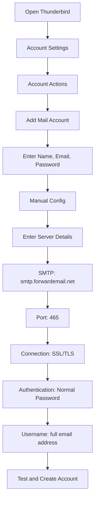

# SMTP-integratievoorbeelden {#smtp-integration-examples}

## Inhoudsopgave {#table-of-contents}

* [Voorwoord](#foreword)
* [Hoe de SMTP-verwerking van Forward Email werkt](#how-forward-emails-smtp-processing-works)
  * [E-mailwachtrij en herhaalsysteem](#email-queue-and-retry-system)
  * [Dummy-proof voor betrouwbaarheid](#dummy-proofed-for-reliability)
* [Node.js-integratie](#nodejs-integration)
  * [Nodemailer gebruiken](#using-nodemailer)
  * [Express.js gebruiken](#using-expressjs)
* [Python-integratie](#python-integration)
  * [smtplib gebruiken](#using-smtplib)
  * [Django gebruiken](#using-django)
* [PHP-integratie](#php-integration)
  * [PHPMailer gebruiken](#using-phpmailer)
  * [Laravel gebruiken](#using-laravel)
* [Ruby-integratie](#ruby-integration)
  * [Ruby Mail Gem gebruiken](#using-ruby-mail-gem)
* [Java-integratie](#java-integration)
  * [De Java Mail API gebruiken](#using-javamail-api)
* [Configuratie van e-mailclient](#email-client-configuration)
  * [Dondervogel](#thunderbird)
  * [Apple Mail](#apple-mail)
  * [Gmail (e-mail verzenden als)](#gmail-send-mail-as)
* [Probleemoplossing](#troubleshooting)
  * [Veelvoorkomende problemen en oplossingen](#common-issues-and-solutions)
  * [Hulp krijgen](#getting-help)
* [Aanvullende bronnen](#additional-resources)
* [Conclusie](#conclusion)

## Voorwoord {#foreword}

Deze handleiding biedt gedetailleerde voorbeelden van hoe u kunt integreren met de SMTP-service van Forward Email met behulp van verschillende programmeertalen, frameworks en e-mailclients. Onze SMTP-service is ontworpen om betrouwbaar, veilig en eenvoudig te integreren met uw bestaande applicaties.

## Hoe de SMTP-verwerking van Forward Email werkt {#how-forward-emails-smtp-processing-works}

Voordat we ingaan op de integratievoorbeelden, is het belangrijk om te begrijpen hoe onze SMTP-service e-mails verwerkt:

### E-mailwachtrij en herhaalsysteem {#email-queue-and-retry-system}

Wanneer u een e-mail via SMTP naar onze servers verzendt:

1. **Initiële verwerking**: De e-mail wordt gevalideerd, gescand op malware en gecontroleerd door spamfilters.
2. **Slimme wachtrij**: E-mails worden in een geavanceerd wachtrijsysteem geplaatst voor bezorging.
3. **Intelligent herhaalmechanisme**: Als de bezorging tijdelijk mislukt, zal ons systeem:
* De foutreactie analyseren met onze `getBounceInfo`-functie.
* Bepalen of het probleem tijdelijk is (bijv. "probeer het later opnieuw", "tijdelijk uitgesteld") of permanent (bijv. "gebruiker onbekend").
* Bij tijdelijke problemen de e-mail markeren voor opnieuw proberen.
* Bij permanente problemen een bouncemelding genereren.
4. **5-daagse herhaalperiode**: We proberen de bezorging maximaal 5 dagen opnieuw (vergelijkbaar met industriestandaarden zoals Postfix), waardoor tijdelijke problemen de tijd krijgen om op te lossen.
5. **Meldingen over de bezorgstatus**: Verzenders ontvangen meldingen over de status van hun e-mails (bezorgd, vertraagd of teruggestuurd).

> \[!NOTE]
> Na succesvolle bezorging wordt de inhoud van uitgaande SMTP-e-mails na een configureerbare bewaartermijn (standaard 30 dagen) om veiligheids- en privacyredenen verwijderd. Alleen een tijdelijke aanduiding blijft over om de succesvolle bezorging aan te geven.

### Dummy-proof voor betrouwbaarheid {#dummy-proofed-for-reliability}

Ons systeem is ontworpen om verschillende randgevallen te kunnen verwerken:

* Als er een blokkeerlijst wordt gedetecteerd, wordt de e-mail automatisch opnieuw geprobeerd.
* Als er netwerkproblemen optreden, wordt de bezorging opnieuw geprobeerd.
* Als de mailbox van de ontvanger vol is, probeert het systeem het later opnieuw.
* Als de ontvangende server tijdelijk niet beschikbaar is, blijven we proberen.

Deze aanpak verbetert de bezorgsnelheid aanzienlijk, terwijl de privacy en veiligheid gewaarborgd blijven.

## Node.js-integratie {#nodejs-integration}

### Nodemailer gebruiken {#using-nodemailer}

[Nodemailer](https://nodemailer.com/) is een populaire module voor het verzenden van e-mails vanuit Node.js-toepassingen.

```javascript
const nodemailer = require('nodemailer');

// Create a transporter object
const transporter = nodemailer.createTransport({
  host: 'smtp.forwardemail.net',
  port: 465,
  secure: true, // Use TLS
  auth: {
    user: 'your-username@your-domain.com',
    pass: 'your-password'
  }
});

// Send mail with defined transport object
async function sendEmail() {
  try {
    const info = await transporter.sendMail({
      from: '"Your Name" <your-username@your-domain.com>',
      to: 'recipient@example.com',
      subject: 'Hello from Forward Email',
      text: 'Hello world! This is a test email sent using Nodemailer and Forward Email SMTP.',
      html: '<b>Hello world!</b> This is a test email sent using Nodemailer and Forward Email SMTP.'
    });

    console.log('Message sent: %s', info.messageId);
  } catch (error) {
    console.error('Error sending email:', error);
  }
}

sendEmail();
```

### Express.js gebruiken {#using-expressjs}

Hier leest u hoe u Forward Email SMTP integreert met een Express.js-toepassing:

```javascript
const express = require('express');
const nodemailer = require('nodemailer');
const app = express();
const port = 3000;

app.use(express.json());

// Configure email transporter
const transporter = nodemailer.createTransport({
  host: 'smtp.forwardemail.net',
  port: 465,
  secure: true,
  auth: {
    user: 'your-username@your-domain.com',
    pass: 'your-password'
  }
});

// API endpoint for sending emails
app.post('/send-email', async (req, res) => {
  const { to, subject, text, html } = req.body;

  try {
    const info = await transporter.sendMail({
      from: '"Your App" <your-username@your-domain.com>',
      to,
      subject,
      text,
      html
    });

    res.status(200).json({
      success: true,
      messageId: info.messageId
    });
  } catch (error) {
    console.error('Error sending email:', error);
    res.status(500).json({
      success: false,
      error: error.message
    });
  }
});

app.listen(port, () => {
  console.log(`Server running at http://localhost:${port}`);
});
```

## Python-integratie {#python-integration}

### Gebruik smtplib {#using-smtplib}

```python
import smtplib
from email.mime.text import MIMEText
from email.mime.multipart import MIMEMultipart

# Email configuration
sender_email = "your-username@your-domain.com"
receiver_email = "recipient@example.com"
password = "your-password"

# Create message
message = MIMEMultipart("alternative")
message["Subject"] = "Hello from Forward Email"
message["From"] = sender_email
message["To"] = receiver_email

# Create the plain-text and HTML version of your message
text = "Hello world! This is a test email sent using Python and Forward Email SMTP."
html = "<html><body><b>Hello world!</b> This is a test email sent using Python and Forward Email SMTP.</body></html>"

# Turn these into plain/html MIMEText objects
part1 = MIMEText(text, "plain")
part2 = MIMEText(html, "html")

# Add HTML/plain-text parts to MIMEMultipart message
message.attach(part1)
message.attach(part2)

# Send email
try:
    server = smtplib.SMTP_SSL("smtp.forwardemail.net", 465)
    server.login(sender_email, password)
    server.sendmail(sender_email, receiver_email, message.as_string())
    server.quit()
    print("Email sent successfully!")
except Exception as e:
    print(f"Error sending email: {e}")
```

### Django gebruiken {#using-django}

Voor Django-toepassingen voegt u het volgende toe aan uw `settings.py`:

```python
# Email settings
EMAIL_BACKEND = 'django.core.mail.backends.smtp.EmailBackend'
EMAIL_HOST = 'smtp.forwardemail.net'
EMAIL_PORT = 465
EMAIL_USE_SSL = True
EMAIL_HOST_USER = 'your-username@your-domain.com'
EMAIL_HOST_PASSWORD = 'your-password'
DEFAULT_FROM_EMAIL = 'your-username@your-domain.com'
```

Stuur dan e-mails in uw weergaven:

```python
from django.core.mail import send_mail

def send_email_view(request):
    send_mail(
        'Subject here',
        'Here is the message.',
        'from@your-domain.com',
        ['to@example.com'],
        fail_silently=False,
        html_message='<b>Here is the HTML message.</b>'
    )
    return HttpResponse('Email sent!')
```

## PHP-integratie {#php-integration}

### PHPMailer gebruiken {#using-phpmailer}

```php
<?php
use PHPMailer\PHPMailer\PHPMailer;
use PHPMailer\PHPMailer\Exception;

require 'vendor/autoload.php';

$mail = new PHPMailer(true);

try {
    // Server settings
    $mail->isSMTP();
    $mail->Host       = 'smtp.forwardemail.net';
    $mail->SMTPAuth   = true;
    $mail->Username   = 'your-username@your-domain.com';
    $mail->Password   = 'your-password';
    $mail->SMTPSecure = PHPMailer::ENCRYPTION_SMTPS;
    $mail->Port       = 465;

    // Recipients
    $mail->setFrom('your-username@your-domain.com', 'Your Name');
    $mail->addAddress('recipient@example.com', 'Recipient Name');
    $mail->addReplyTo('your-username@your-domain.com', 'Your Name');

    // Content
    $mail->isHTML(true);
    $mail->Subject = 'Hello from Forward Email';
    $mail->Body    = '<b>Hello world!</b> This is a test email sent using PHPMailer and Forward Email SMTP.';
    $mail->AltBody = 'Hello world! This is a test email sent using PHPMailer and Forward Email SMTP.';

    $mail->send();
    echo 'Message has been sent';
} catch (Exception $e) {
    echo "Message could not be sent. Mailer Error: {$mail->ErrorInfo}";
}
```

### Laravel gebruiken {#using-laravel}

Voor Laravel-toepassingen moet u uw bestand `.env` bijwerken:

```sh
MAIL_MAILER=smtp
MAIL_HOST=smtp.forwardemail.net
MAIL_PORT=465
MAIL_USERNAME=your-username@your-domain.com
MAIL_PASSWORD=your-password
MAIL_ENCRYPTION=ssl
MAIL_FROM_ADDRESS=your-username@your-domain.com
MAIL_FROM_NAME="${APP_NAME}"
```

Verstuur vervolgens e-mails met behulp van Laravel's Mail-façade:

```php
<?php

namespace App\Http\Controllers;

use Illuminate\Http\Request;
use Illuminate\Support\Facades\Mail;
use App\Mail\WelcomeEmail;

class EmailController extends Controller
{
    public function sendEmail()
    {
        Mail::to('recipient@example.com')->send(new WelcomeEmail());

        return 'Email sent successfully!';
    }
}
```

## Ruby-integratie {#ruby-integration}

### Ruby Mail Gem gebruiken {#using-ruby-mail-gem}

```ruby
require 'mail'

Mail.defaults do
  delivery_method :smtp, {
    address: 'smtp.forwardemail.net',
    port: 465,
    domain: 'your-domain.com',
    user_name: 'your-username@your-domain.com',
    password: 'your-password',
    authentication: 'plain',
    enable_starttls_auto: true,
    ssl: true
  }
end

mail = Mail.new do
  from     'your-username@your-domain.com'
  to       'recipient@example.com'
  subject  'Hello from Forward Email'

  text_part do
    body 'Hello world! This is a test email sent using Ruby Mail and Forward Email SMTP.'
  end

  html_part do
    content_type 'text/html; charset=UTF-8'
    body '<b>Hello world!</b> This is a test email sent using Ruby Mail and Forward Email SMTP.'
  end
end

mail.deliver!
puts "Email sent successfully!"
```

## Java-integratie {#java-integration}

### JavaMail API gebruiken {#using-javamail-api}

```java
import java.util.Properties;
import javax.mail.*;
import javax.mail.internet.*;

public class SendEmail {
    public static void main(String[] args) {
        // Sender's email and password
        final String username = "your-username@your-domain.com";
        final String password = "your-password";

        // SMTP server properties
        Properties props = new Properties();
        props.put("mail.smtp.auth", "true");
        props.put("mail.smtp.starttls.enable", "true");
        props.put("mail.smtp.host", "smtp.forwardemail.net");
        props.put("mail.smtp.port", "465");
        props.put("mail.smtp.socketFactory.port", "465");
        props.put("mail.smtp.socketFactory.class", "javax.net.ssl.SSLSocketFactory");

        // Create session with authenticator
        Session session = Session.getInstance(props,
            new javax.mail.Authenticator() {
                protected PasswordAuthentication getPasswordAuthentication() {
                    return new PasswordAuthentication(username, password);
                }
            });

        try {
            // Create message
            Message message = new MimeMessage(session);
            message.setFrom(new InternetAddress(username));
            message.setRecipients(Message.RecipientType.TO, InternetAddress.parse("recipient@example.com"));
            message.setSubject("Hello from Forward Email");

            // Create multipart message
            Multipart multipart = new MimeMultipart("alternative");

            // Text part
            BodyPart textPart = new MimeBodyPart();
            textPart.setText("Hello world! This is a test email sent using JavaMail and Forward Email SMTP.");

            // HTML part
            BodyPart htmlPart = new MimeBodyPart();
            htmlPart.setContent("<b>Hello world!</b> This is a test email sent using JavaMail and Forward Email SMTP.", "text/html");

            // Add parts to multipart
            multipart.addBodyPart(textPart);
            multipart.addBodyPart(htmlPart);

            // Set content
            message.setContent(multipart);

            // Send message
            Transport.send(message);

            System.out.println("Email sent successfully!");

        } catch (MessagingException e) {
            throw new RuntimeException(e);
        }
    }
}
```

## Configuratie van e-mailclient {#email-client-configuration}

### Thunderbird {#thunderbird}



1. Open Thunderbird en ga naar Accountinstellingen.
2. Klik op 'Accountacties' en selecteer 'E-mailaccount toevoegen'.
3. Voer je naam, e-mailadres en wachtwoord in.
4. Klik op 'Handmatige configuratie' en voer de volgende gegevens in:
* Inkomende server:
* IMAP: imap.forwardemail.net, Poort: 993, SSL/TLS
* POP3: pop3.forwardemail.net, Poort: 995, SSL/TLS
* Uitgaande server (SMTP): smtp.forwardemail.net, Poort: 465, SSL/TLS
* Authenticatie: Normaal wachtwoord
* Gebruikersnaam: je volledige e-mailadres
5. Klik op 'Test' en vervolgens op 'Gereed'.

### Apple Mail {#apple-mail}

1. Open Mail en ga naar Mail > Voorkeuren > Accounts
2. Klik op de knop "+" om een nieuw account toe te voegen
3. Selecteer "Ander e-mailaccount" en klik op "Doorgaan"
4. Voer uw naam, e-mailadres en wachtwoord in en klik op "Aanmelden"
5. Wanneer de automatische installatie mislukt, voert u de volgende gegevens in:
* Server inkomende e-mail: imap.forwardemail.net (of pop3.forwardemail.net voor POP3)
* Server uitgaande e-mail: smtp.forwardemail.net
* Gebruikersnaam: uw volledige e-mailadres
* Wachtwoord: uw wachtwoord
6. Klik op "Aanmelden" om de installatie te voltooien

### Gmail (e-mail verzenden als) {#gmail-send-mail-as}

1. Open Gmail en ga naar Instellingen > Accounts en Importeren.
2. Klik onder 'E-mail verzenden als' op 'Nog een e-mailadres toevoegen'.
3. Voer je naam en e-mailadres in en klik op 'Volgende stap'.
4. Voer de volgende SMTP-servergegevens in:
* SMTP-server: smtp.forwardemail.net
* Poort: 465
* Gebruikersnaam: je volledige e-mailadres
* Wachtwoord: je wachtwoord
* Selecteer 'Beveiligde verbinding via SSL'.
5. Klik op 'Account toevoegen' en verifieer je e-mailadres.

## Problemen oplossen met {#troubleshooting}

### Veelvoorkomende problemen en oplossingen {#common-issues-and-solutions}

1. **Authenticatie mislukt**
* Controleer je gebruikersnaam (volledig e-mailadres) en wachtwoord
* Controleer of je de juiste poort gebruikt (465 voor SSL/TLS)
* Controleer of SMTP-toegang is ingeschakeld voor je account

2. **Time-out van verbinding**
* Controleer je internetverbinding
* Controleer of de firewallinstellingen SMTP-verkeer niet blokkeren
* Probeer een andere poort (587 met STARTTLS)

3. **Bericht geweigerd**
* Zorg ervoor dat uw afzenderadres overeenkomt met uw geverifieerde e-mailadres
* Controleer of uw IP-adres op de zwarte lijst staat
* Controleer of de inhoud van uw bericht geen spamfilters activeert

4. **TLS/SSL-fouten**
* Werk uw applicatie/bibliotheek bij om moderne TLS-versies te ondersteunen
* Zorg ervoor dat de CA-certificaten van uw systeem up-to-date zijn
* Probeer expliciete TLS in plaats van impliciete TLS

### Hulp krijgen {#getting-help}

Als u problemen ondervindt die hier niet worden behandeld, kunt u het volgende doen:

1. Raadpleeg onze [FAQ-pagina](/faq) voor veelgestelde vragen.
2. Raadpleeg onze [blogpost over e-mailbezorging](/blog/docs/best-email-forwarding-service) voor gedetailleerde informatie.
3. Neem contact op met ons supportteam via <support@forwardemail.net>.

## Aanvullende bronnen {#additional-resources}

* [Documentatie voor het doorsturen van e-mails](/docs)
* [SMTP-serverlimieten en -configuratie](/faq#what-are-your-outbound-smtp-limits)
* [Handleiding voor best practices voor e-mail](/blog/docs/best-email-forwarding-service)
* [Beveiligingspraktijken](/security)

## Conclusie {#conclusion}

De SMTP-service van Forward Email biedt een betrouwbare, veilige en privacyvriendelijke manier om e-mails te versturen vanuit uw applicaties en e-mailclients. Dankzij ons intelligente wachtrijsysteem, een mechanisme om 5 dagen opnieuw te proberen en uitgebreide meldingen over de bezorgstatus kunt u erop vertrouwen dat uw e-mails hun bestemming bereiken.

Voor geavanceerdere use cases of aangepaste integraties kunt u contact opnemen met ons supportteam.